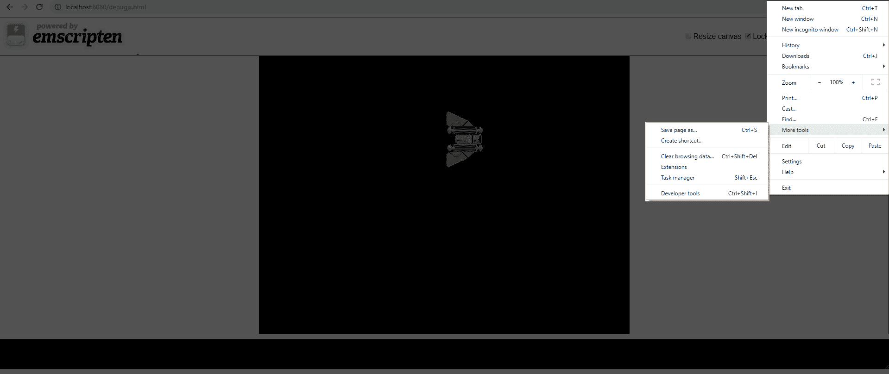
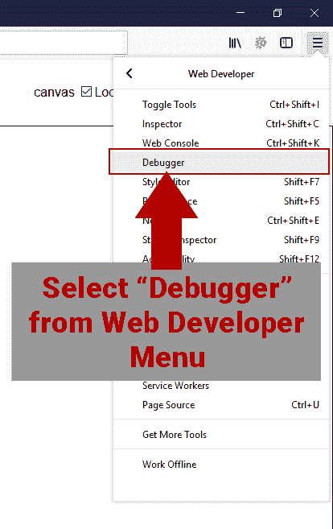
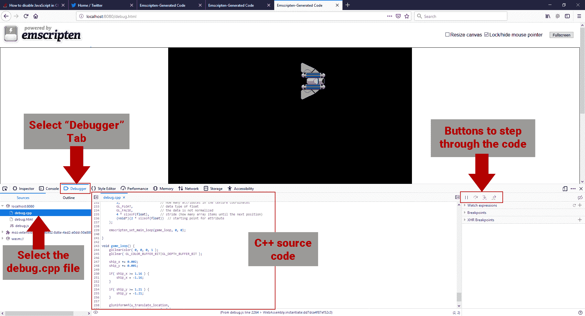
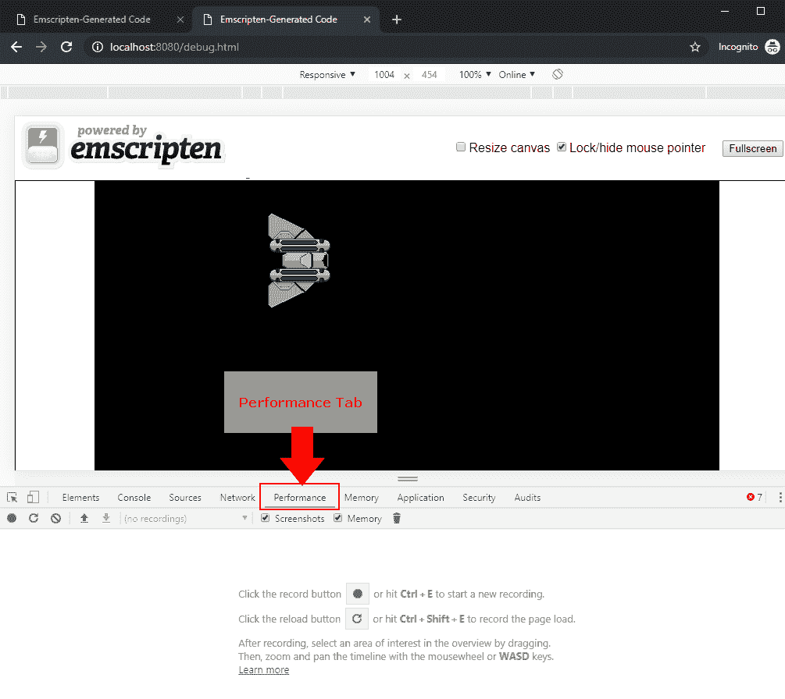
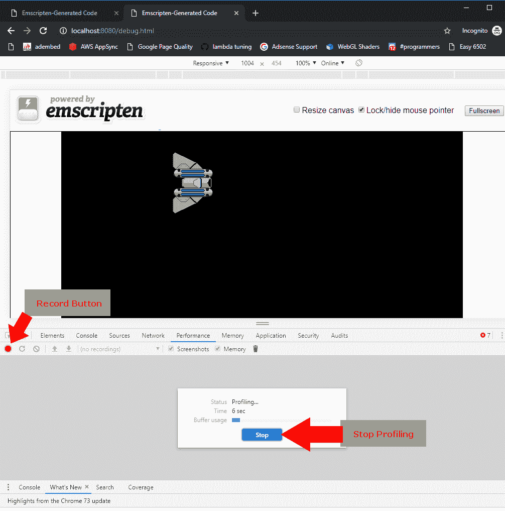
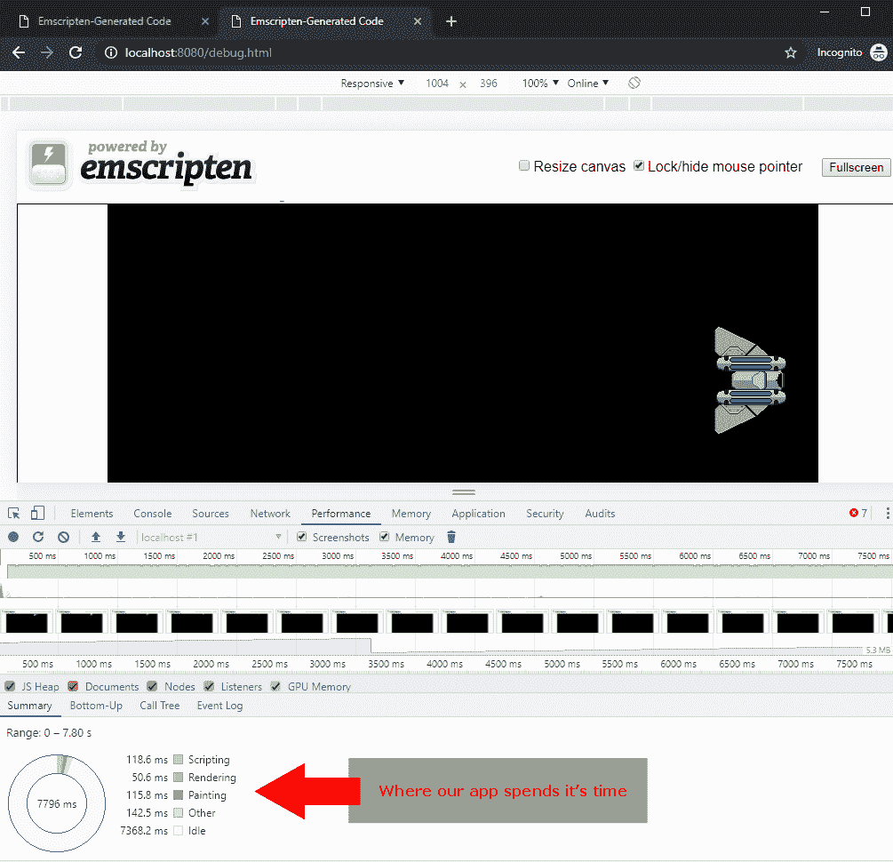

# 调试和优化

在最后一章中，我们将讨论两个主题，这两个主题将有助于您继续使用 Emscripten 创建游戏和在 WebAssembly 中构建。我们将讨论调试和优化的主题。我们将在优化之前进行调试，因为构建代码以输出更多调试信息会妨碍优化。我们将从使用一些基本的调试技术开始，例如打印堆栈跟踪和定义调试宏，我们可以通过更改编译标志来删除这些宏。然后，我们将转向一些更高级的调试技术，例如使用 Emscripten 标志进行编译，这允许我们在 Firefox 和 Chrome 中跟踪代码。我们还将讨论使用火狐和 Chrome 开发工具进行调试之间的一些差异。

You will need to include several images in your build to make this project work. Make sure that you include the `/Chapter16/sprites/` folder from this project's GitHub repository. If you haven't downloaded the GitHub project yet, you can get it online here: [https://github.com/PacktPublishing/Hands-On-Game-Development-with-WebAssembly](https://github.com/PacktPublishing/Hands-On-Game-Development-with-WebAssembly).

讨论完调试后，我们将继续优化。我们将讨论您可以与 Emscripten 一起使用的优化标志，以及使用剖析器来确定您的游戏或应用程序可能存在性能问题的地方。我们将讨论优化网络组装部署代码的一般技术。最后，我们将讨论与网络游戏和网络组装模块进行的网络 GL 调用相关的优化。

# 调试宏和堆栈跟踪

您可以开始调试代码的一种方法是使用`#define`创建一个调试宏，我们可以通过向 Emscripten 编译器传递一个标志来激活它。然而，如果我们不通过那面旗帜，这将化为乌有。宏很容易添加，如果我们带着调试标志运行，我们可以创建一个打印行的调用，但是如果我们不这样做，就不会降低性能。如果您不熟悉预处理器命令，它们是在编译代码时而不是在运行时向编译器发出的评估命令。例如，如果我使用了`#ifdef PRINT_ME`命令，那么只有当`PRINT_ME`宏在代码的前面一行用`#define PRINT_ME`宏定义时，或者当我们运行编译器时用传递给编译器的`-DPRINT_ME`标志编译源代码时，这一行代码才会被编译成我们的源代码。假设我们的`main`函数中有以下代码块:

```cpp
#ifdef PRINT_ME
    printf("PRINT_ME was defined\n");
#else
    printf("nothing was defined\n");
#endif
```

如果我们这样做了，我们就会编译并运行这些代码。网络浏览器的控制台打印以下内容:

```cpp
"nothing was defined"
```

如果我们用`-DPRINT_ME`标志编译它，然后在命令行运行代码，我们会看到下面的输出:

```cpp
"PRINT_ME was defined"
```

如果您将代码分解成网络组装文本，那么您将看不到任何打印“没有定义任何东西”的原始`printf`语句的提示。在编译时，代码被移除。这使得预处理器宏在创建我们希望在开发阶段包含的代码时非常有用。

If you are using the `-D` flag to include debug macros in your code, make sure that you don't include that flag when you are compiling for release, as that will continue to include all of your debug macros when you don't want them. You may want to consider having a `-DRELEASE` flag that overrides your `-DDEBUG` flag when you compile your code for general release.

将所有`printf`调用限制在一个宏中是一个很好的方法，可以确保您删除了所有对`printf`的调用，这将在您发布应用程序时降低其速度。让我们以`webgl-redux.c`文件作为基线来尝试一下。根据我们在上一章中创建的代码，将`webgl-redux.c`复制并粘贴到名为`debug.cpp`的文件中。我们将在这个文件的开头添加调试宏。紧接在包含`emscripten.h`的行之后，但在定义画布宽度的代码行之前，添加以下代码块:

```cpp
#ifdef DEBUG
    void run_debug(const char* str) {
        EM_ASM (
            console.log(new Error().stack);
        );
        printf("%s\n", str);
    }

    #define DBG(str) run_debug(str)
#else
    #define DBG(str)
#endif
```

如果我们将`-DDEBUG`标志传递给编译器，这段代码只会编译`run_debug`函数。用户不应该直接运行`run_debug`功能，因为不使用`-DDEBUG`标志就不存在。相反，我们应该使用`DBG`宏观功能。不管我们是否使用`-DDEBUG`标志，这个宏都存在。如果我们使用这个标志，函数调用`run_debug`函数。如果我们不使用这个标志，对`DBG`的调用就会神奇地消失。`run_debug`函数不仅使用`printf`打印出一个字符串，还使用`EM_ASM`将堆栈跟踪转储到 JavaScript 控制台。堆栈跟踪会注销当前在 JavaScript 堆栈上的每个函数。让我们添加几个最终会调用我们的`DBG`宏的函数调用。这些应在`main`功能之前添加:

```cpp
extern "C" {
    void inner_call_1() {
        DBG("check console log for stack trace");
    }
    void inner_call_2() {
        inner_call_1();
    }
    void inner_call_3() {
        inner_call_2();
    }
}
```

在我们的`main`函数中，我们应该添加对`inner_call_3()`的调用，如下所示:

```cpp
int main() {
    inner_call_3();
```

现在，让我们用以下命令编译我们的`debug.cpp`文件:

```cpp
emcc debug.cpp -o index.html -DDEBUG --preload-file sprites -s USE_SDL=2 -s USE_SDL_IMAGE=2 -s SDL2_IMAGE_FORMATS=["png"]
```

这会将`debug.cpp`文件编译成`index.html`文件。如果我们从 web 服务器提供该文件，并在浏览器中打开它，我们将在 JavaScript 控制台中看到以下内容:

```cpp
Error
 at Array.ASM_CONSTS (index.js:1901)
 at _emscripten_asm_const_i (index.js:1920)
 at :8080/wasm-function[737]:36
 at :8080/wasm-function[738]:11
 at :8080/wasm-function[739]:7
 at :8080/wasm-function[740]:7
 at :8080/wasm-function[741]:102
 at Object.Module._main (index.js:11708)
 at Object.callMain (index.js:12096)
 at doRun (index.js:12154)

(index):1237 check console log for stack trace
```

您会注意到我们有一个堆栈跟踪，后面是我们的消息`check console log for stack trace`，这是我们传递到`DBG`宏中的字符串。如果你仔细观察，你可能会注意到一件事，那就是这个堆栈跟踪没有太大帮助。堆栈跟踪中的大多数函数都被标记为`wasm-function`，从调试的角度来看，这有点没用。这是因为我们在编译过程中丢失了函数名。为了保留这些名称，我们需要在编译时将`-g4`标志传递给 Emscripten。`-g`标志后面跟一个数字，告诉编译器在编译过程中要保留多少调试信息，其中`-g0`是最少的信息量，`-g4`是最多的。如果我们想创建源映射，将我们的 WebAssembly 映射到创建它的 C/C++ 源代码，我们需要传入`-g4`命令，如果我们想知道堆栈跟踪调用的函数，我们也需要`-g4`命令。让我们尝试用我们的`-g4`标志重新编译。以下是新版本的`emcc`命令:

```cpp
emcc debug.cpp -o index.html -g4 -DDEBUG --preload-file sprites -s USE_SDL=2 -s USE_SDL_IMAGE=2 -s SDL2_IMAGE_FORMATS=["png"]
```

现在，重新加载页面并检查控制台。在下面的代码片段中，我们有了新的堆栈跟踪:

```cpp
Error
 at Array.ASM_CONSTS (index.js:1901)
 at _emscripten_asm_const_i (index.js:1920)
 at __Z9run_debugPKc (:8080/wasm-function[737]:36)
 at _inner_call_1 (:8080/wasm-function[738]:11)
 at _inner_call_2 (:8080/wasm-function[739]:7)
 at _inner_call_3 (:8080/wasm-function[740]:7)
 at _main (:8080/wasm-function[741]:102)
 at Object.Module._main (index.js:11708)
 at Object.callMain (index.js:12096)
 at doRun (index.js:12154)
 (index):1237 check console log for stack trace
```

这可读性更强。您可以看到我们定义的所有内部调用函数，以及`main`函数。但是`run_debug`怎么了？结果是这样的:

```cpp
 __Z9run_debugPKc
```

这里发生的事情被称为 C++ 名称 mangling，我们在前面的章节中对此进行了简要讨论。因为 C++ 允许函数重载，编译器*会修改*函数的名称，这样每个版本的函数都有不同的名称。我们能够通过将它们放在一个标有`extern "C"`的块中来防止这种情况发生。这告诉编译器不要篡改这些函数的名称。这对于调试来说并不是绝对必要的，但是我想演示如何向这个块中添加函数，以便在堆栈跟踪中更容易识别我们的函数。如果我移除`extern "C"`块，同样的堆栈跟踪看起来如下:

```cpp
Error
 at Array.ASM_CONSTS (index.js:1901)
 at _emscripten_asm_const_i (index.js:1920)
 at __Z9run_debugPKc (:8080/wasm-function[737]:36)
 at __Z12inner_call_1v (:8080/wasm-function[738]:11)
 at __Z12inner_call_2v (:8080/wasm-function[739]:7)
 at __Z12inner_call_3v (:8080/wasm-function[740]:7)
 at _main (:8080/wasm-function[741]:102)
 at Object.Module._main (index.js:11708)
 at Object.callMain (index.js:12096)
 at doRun (index.js:12154)
 (index):1237 check console log for stack trace
```

如您所见，我们所有的内部调用函数都被破坏了。在下一节中，我们将讨论源地图。

# 源地图

现在，让我们简单讨论一下源图。回到网络的早期，人们决定用户应该能够查看每个网页上的所有源代码。早期，这一直是 HTML，但后来，JavaScript 被添加进来，成为用户可以查看的东西，试图理解给定网页的工作原理。今天，这在大多数情况下是不可能的。今天的一些代码，比如 TypeScript，被从另一种语言翻译成了 JavaScript。如果您正在编写 JavaScript，您可以使用 Babel 来转换最新的 JavaScript，以便在旧的网络浏览器上运行。Uglify 或 Minify 可用于删除空格和缩短变量名。如果您需要调试原始源代码，源代码映射是一种工具，您可以使用它将浏览器中运行的 JavaScript 映射回原始源代码。

源映射是一个 JSON 文件，它包含机器生成的 JavaScript 输出代码的数据映射，并将其指向手写的 JavaScript 或其他语言，如 TypeScript 或 CoffeeScript。应用程序可以通过两种方式告诉 web 浏览器有一个与给定代码段相关联的源映射文件。我们可以在代码中包含带有`sourceMappingURL`指令的注释，或者我们可以在该文件的 HTTP 头中包含一个`SourceMap`。如果我们使用的是`sourceMappingURL`注释方法，请在输出 JavaScript 文件的末尾添加以下一行:

```cpp
//# sourceMappingURL=http://localhost:8080/debug.wasm.map
```

这通常是在构建过程中以编程方式完成的。另一种方法是在 HTTP 头中添加以下一行:

```cpp
SourceMap: http://localhost:8080/debug.wasm.map
```

在下一节中，我们将讨论基于浏览器的 WebAssembly 调试工具。

# 浏览器调试

在 web 浏览器中调试 WebAssembly 仍然相当粗糙。例如，在编写时，仍然不可能使用调试器直接*观察*一个变量。在 Firefox 和 Chrome 中，您必须偶尔刷新浏览器才能看到 CPP 源文件。与调试 JavaScript 不同，WebAssembly 调试器感觉(讽刺的是)有问题。在 Chrome 中，您经常需要多次单击“单步执行”按钮来推进代码行。在两种浏览器中，断点有时都无法工作。

我经常不得不删除，然后重新添加一个断点，让他们再次工作。WebAssembly 源代码图和浏览器内调试还为时过早，所以希望情况很快会有所改善。在此之前，请尝试将浏览器中的调试与添加调试语句结合起来，就像我之前建议的那样。

# 编译代码进行调试

正如我之前提到的，我们将需要编译我们的应用程序来支持源地图，我们可以在火狐和 Chrome 中使用它进行浏览器内调试。目前，唯一支持浏览器内调试的浏览器是火狐、Chrome 和 Safari。我只会在这本书里介绍火狐和 Chrome。您可以使用以下`emcc`命令编译`debug.cpp`文件，以便与网络程序集调试器一起使用:

```cpp
emcc -g4 debug.cpp -o debug.html --source-map-base http://localhost:8080/ --preload-file sprites -s USE_SDL=2 -s USE_SDL_IMAGE=2 -s SDL2_IMAGE_FORMATS=["png"] -s MAIN_MODULE=1 -s WASM=1
```

第一个新标志是`-g4`，它指示编译器拥有最高数量的调试数据，并为我们的 WebAssembly 创建源映射文件。之后是`--source-map-base http://localhost:8080/`标志，它告诉编译器将`sourceMappingURL$http://localhost:8080/debug.wasm.map`字符串添加到`debug.wasm`文件的末尾。这允许浏览器找到与`debug.wasm`文件相关联的源地图文件。最后两个新标志是`-s MAIN_MODULE=1`和`-s WASM=1`。我不确定为什么需要这两个标志来使源映射工作。这两个标志都明确告诉编译器运行默认行为。但是，在编写时，如果不包含这些标志，浏览器调试将不起作用。这在我看来是一个 bug，所以有可能在你阅读这篇文章的时候，`emcc`不需要最后的两个标志。使用前面的命令进行编译将允许您在 Chrome 和 Firefox 上使用 WebAssembly 调试器进行测试。如果您真的想在 Opera、Edge 或其他不支持 WebAssembly 调试的调试器上进行调试，您确实有一个替代方案。

# 使用 asm.js 作为调试的替代方案

无论出于什么原因，您可能会觉得使用 Edge 或 Opera 进行调试是必要的。如果您觉得必须在没有 WebAssembly 调试器的浏览器中进行调试，您可以选择为 asm.js 进行编译。如果是，将`-s WASM=1`标志改为`-s WASM=0`，你就被设置了。这将创建一个 JavaScript 文件，而不是一个 WASM 文件，但是这两个文件(理论上)应该表现相同。

# 使用 Chrome 调试

Chrome 有一些很好的调试 JavaScript 的工具，但是在调试 WebAssembly 的时候仍然很粗糙。构建应用程序后，在 Chrome 中打开它，然后打开 Chrome 开发工具:



Figure 16.1: Screenshot of opening Chrome Developer Tools using the menu

您可以使用浏览器左上角的菜单打开它，如前面的截图所示，或者您可以通过按键盘上的*Ctrl*+*Shift*+*I*打开开发人员工具。当你在 Chrome 中加载你的`debug.html`文件时，你需要点击开发者窗口中的来源标签。如果您在“来源”选项卡上，应该是这样的:


Figure 16.2: Screenshot using the sources tab in Chrome Developer Tools

如果在“来源”标签中没有看到`debug.cpp`，可能需要点击顶部 URL 旁边的浏览器的重新加载按钮来重新加载页面。正如我前面所说的，界面感觉有点问题，有时 CPP 文件在第一次尝试时没有加载。希望当你读到这篇文章的时候，这已经改变了。一旦您选择了 CPP 文件，您应该能够在开发人员工具窗口中心的代码窗口中看到我们的`debug.cpp`文件中的 C++ 代码。通过单击代码行旁边需要断点的行号，可以在 C++ 代码中设置断点。然后，您可以使用`Watch`变量上方的按钮单步执行代码。虽然手表变量在编写时不起作用，但您可能还是想尝试一下。WebAssembly 几乎每天都在改进，错误修复也在不断发生，所以当你读到这篇文章的时候，事情可能已经发生了变化。如果没有，您可以使用`Local`变量来了解哪些值在变化。

您可以在逐步浏览源代码时看到这些变量被填充，并且您可以通过观察这些值的变化来频繁地确定哪些变量被更新。请看下面的截图:


Figure 16.3: Screenshot of the debug tools in the Chrome browser

在编写时，您需要多次单击“单步执行”按钮，以使该行在 C++ 代码窗口中前进。在 Chrome 中，单步执行按钮是每次点击推进一条 WebAssembly 指令，而不是一条 C++ 指令。当您阅读本文时，这可能已经发生了变化，但是如果您需要多次单击“单步执行”来浏览代码，请不要感到惊讶。

# 使用 Firefox 进行调试

与 Chrome 相比，Firefox 有很多优点和缺点。从好的方面来说，你可以在 C++ 代码中的每一行点击一次火狐中的单步执行按钮。不利的一面是，这使得知道哪些局部变量在响应您正在执行的行而改变变得更加困难。这些`Local`变量有点像基于寄存器的汇编语言中的寄存器，因此同一个变量可以进出其中的几个。如果您必须在每个汇编指令中单击一次按钮，那么遵循这些值可能会更容易一些。但是，如果您对跟踪代码流比了解每个网络组装指令的值变化更感兴趣，那么火狐在这方面要好得多。

要打开火狐开发者工具，请单击浏览器窗口右上角的菜单按钮，然后选择网络开发者:


Figure 16.4: Web Developer tools in the Firefox browser

在“网站开发人员”菜单上，单击“调试器”菜单项打开“调试器”窗口:



Figure 16.5: Screenshot of opening Debugger in Firefox

不用通过菜单系统选择调试器，可以使用快捷键*Ctrl*+*Shift*+*C*打开检查器，然后从 Web Developer 窗口选择调试器选项卡。以下是您在火狐调试器中的样子:



Figure 16.6: Screenshot of using Debugger in the Firefox browser

现在，调试需要将调试宏的使用(如前一节所述)与浏览器完全理解正在发生的事情的能力结合起来。

# 火狐开发者版

我将简要提及火狐开发者版。如果您更喜欢使用火狐作为您的主要网络组件开发浏览器，您可能需要考虑使用火狐开发者版。开发者版比标准版火狐更快地推进网络开发者工具的更新。因为 WebAssembly 是如此新，所以改进开发体验的更新很可能会比标准版本早几周或几个月出现在开发人员版中。在撰写本文时，这两个版本之间没有显著差异，但如果您有兴趣试用，可在以下网址获得:[https://www.mozilla.org/en-US/firefox/developer/](https://www.mozilla.org/en-US/firefox/developer/)。

# 网络组装的优化

优化您的网络组装代码部分是关于决策和实验。它是关于发现什么适合你的特定游戏或应用。例如，当设计网络组装时，决定让网络组装字节码在虚拟堆栈机器上运行。WebAssembly 的设计者之所以做出这个选择，是因为他们觉得可以用小得多的字节码下载量来弥补性能的小损失。每段代码都有一个瓶颈。在 OpenGL 应用程序中，瓶颈将是与图形处理器的接口。应用程序的瓶颈可能是内存，也可能是受 CPU 限制的。总的来说，优化代码是关于确定什么是延迟，以及决定你想要做什么样的权衡来改进事情。如果优化下载大小，可能会损失一些运行时性能。如果优化运行时性能，可能需要增加内存占用。

# 优化标志

Emscripten 为我们提供了大量的标志选择，以针对不同的潜在瓶颈进行优化。所有的优化标志都会导致不同程度的更长编译时间，所以使用这些标志应该会出现在开发周期的后期。

# 优化性能

我们可以使用`-O`标志进行常规优化。`-O0`、`-O1`、`-O2`和`-O3`在编译时和代码性能之间提供了不同程度的权衡。`-O0`和`-O1`标志提供最小的优化。`-O2`标志提供了从`-O3`标志获得的大部分优化，但是编译时间明显缩短。最后，`-O3`提供了最高级别的优化，但编译时间比任何其他标志都长，所以最好等到开发接近尾声时再开始使用。除了`-O`标志之外，`-s AGGRESSIVE_VARIABLE_ELIMINATION=1`可以用来提高性能，但是可能会导致更大的字节码下载量。

# 优化尺寸

还有另外两个`-O`标志，我在前面部分没有提到。这些标志用于优化字节码下载大小，而不是纯粹的性能优化。`-Os`标志的时间大约与`-O3`一样长，并且提供了尽可能多的性能优化，但是牺牲了一些`-O3`优化以支持更小的下载量。`-Oz`就像`-Os`一样，但是通过牺牲更多的性能优化来进一步优先考虑更小的下载量，这导致了更小的字节码。另一种优化尺寸的方法是加入`-s ENVIRONMENT='web'`标志。只有在为网站编译时，才应该使用此标志。它删除了任何用于支持其他环境的源代码，例如 Node.js

# 不安全标志

除了到目前为止我们一直在使用的安全优化标志之外，Emscripten 还允许两个*不安全*标志，它们可以提高性能，但有可能破坏您的代码。这些标志是高风险/高回报的优化，您应该只在大量测试完成之前使用。使用`--closure 1`标志运行 Closure JavaScript 编译器，它对我们应用程序中的 JavaScript 执行非常激进的优化。但是，您不应该使用`--closure 1`标志，除非您已经熟悉使用闭包编译器以及编译器可能对 JavaScript 产生的影响。第二个*不安全*标志是`--llvm-lto 1`标志，它在 LLVM 编译步骤中启用*链接时间优化*。这个过程可能会破坏您的代码，所以在使用这个标志时要特别小心。

# 压型

分析是确定源代码中存在哪些瓶颈的最佳方法。当您分析 WebAssembly 模块时，我建议您在编译时使用`--profiling`标志。没有它你也可以配置，但是你调用的所有模块功能都会被贴上`wasm-function`的标签，这会让你的生活变得比需要的更艰难。用`--profile`标志编译完代码后，在 Chrome 中打开一个新的*隐姓埋名*窗口。

您可以通过按下 *CTRL + SHIFT + N* 键，或者通过浏览器右上角的菜单来实现:


Figure 16.7: Opening an Incognito window in the Chrome browser

打开一个匿名窗口将会阻止任何 Chrome 扩展在分析你的应用时运行。这将防止您不得不费力地通过这些扩展中的代码来获取应用程序中的代码。打开微服窗口后，按*Ctrl*+*Shift*+*I*查看页面。这将在浏览器窗口的底部打开 Chrome 开发工具。在 Chrome 开发工具中，选择性能选项卡，如下图所示:



Figure 16.8: The Performance tab in the Chrome browser

现在，点击记录按钮，让它运行几秒钟。记录五六秒钟后，单击停止按钮停止分析:



Figure 16.9: Screenshot of recording performance metrics in the Chrome browser

停止分析后，您将在性能窗口中看到数据。这称为“摘要”选项卡，并以饼图的形式显示数据，该饼图按毫秒数细分应用程序在各种任务上花费的时间。

如您所见，绝大多数时间，我们的应用程序都处于闲置状态:



Figure 16.10: Performance overview in the Chrome browser

总结很有意思。它可以在很高的层次上告诉您瓶颈在哪里，但是要评估我们的网络组件，我们需要查看调用树选项卡。单击呼叫树选项卡，您将看到下面的 window:


Figure 16.11: Screenshot of the Call Tree in the Chrome browser

因为我们的`game_loop`函数每一帧都被调用，所以我们可以在`Animation Frame Fired`树中找到调用。往下钻，寻找`game_loop`。当我们找到这个函数时，它被破坏了，因为它是一个 C++ 函数。所以，我们看到的不是`_game_loop`，而是`_Z9game_loopv`，尽管你可能会看到不同的东西。如果您想防止这种混乱，您可以将此功能包装在`extern "C"`块中。

可以看到，这个函数的执行总共占用了浏览器 3.2%的 CPU 时间。您也可以从这个函数中查看每个 OpenGL 调用。如果你看看我们的游戏循环，超过一半的 CPU 时间都花在`_glClear`上。这对于这个应用程序来说不是问题，因为绝大多数浏览器的 CPU 时间都是闲置的。然而，如果我们的游戏循环函数占用了很大一部分 CPU 时间，我们就需要看看我们在这个函数中花了多少时间。

# 尝试/捕捉块的问题

在编写本文时，众所周知，try/catch 块会在 WebAssembly 模块中导致严重的性能问题，因此只有在绝对必要时才使用它们。您可能希望在开发阶段使用它们，并在构建版本时删除它们。一些`-O`优化标志将删除 try/catch 块，如果您计划在生产中使用它们，您需要注意这些块。如果您想在生产构建中使用 try/catch 块，您需要使用`-s DISABLE_EXCEPTION_CATCHING=0`标志进行编译。这将告诉编译器不要从字节码的优化版本中移除 try/catch 块。如果您想从未优化的开发代码中删除您的 try/catch 块，您可以使用`-s DISABLE_EXCEPTION_CATCHING=1`标志来完成。

# 面向网络组装的 OpenGL 优化

重要的是要记住，从 WebAssembly 对 OpenGL 的任何调用都是使用函数表调用 WebGL。这一点很重要的部分原因是，每当您使用 OpenGL ES 和 OpenGL 功能(在 WebGL 中不可用)时，Emscripten 必须对这些功能执行一些非常慢的软件仿真。同样重要的是要记住，在原生平台上，WebGL 调用比 OpenGL 调用更昂贵，因为 WebGL 是沙箱化的，浏览器在调用 WebGL 时会执行各种安全检查。Emscripten 为您提供了几个标志，允许您模拟在 WebGL 中不可用的 OpenGL 和 OpenGL ES 调用。但是，出于性能原因，除非绝对必要，否则不要使用这些函数。

# 如果可能的话，使用 WebGL 2.0

WebGL 2.0 比 WebGL 1.0 更快，但是，在撰写本文时，支持它的浏览器要少得多。只需将您的 WebGL 1.0 代码编译为 WebGL 2.0，就可以获得大约 7%的性能提升。但是，在您选择这样做之前，您可能想咨询一下[https://caniuse.com/#search=webgl2](https://caniuse.com/#search=webgl2)，看看您所瞄准的浏览器是否支持 WebGL 2.0。

# 最小化 OpenGL 调用的次数

从 WebAssembly 调用 OpenGL 的速度不如从本机编译的应用程序调用 OpenGL 的速度快。从网络组件对 OpenGL 的调用就是对网络组件模拟的调用。WebGL 被构建为在 web 浏览器内部执行，并执行一些安全检查，以验证我们没有要求 WebGL 做任何恶意的事情。这意味着我们在编写针对网络组装的 OpenGL 时，必须考虑到额外的开销。在某些情况下，对一个本地应用程序调用两到三次 OpenGL 会比将这些调用组合成一次 OpenGL 调用更快。但是，如果您将 WebAssembly 中的相同代码压缩为对 OpenGL 的一次调用，它可能会运行得更快。为 WebAssembly 进行优化时，尝试尽可能减少 OpenGL 调用的数量，并使用您的探查器来验证新代码是否更快。

# Emscripten OpenGL flags

几个 Emscripten 链接器标志会对性能产生显著影响。一些标志的创建是为了方便将代码移植到网络组件，但是可能会产生性能问题。其他人可以在合适的条件下提高绩效。

`-s FULL_ES2=1`和`-s FULL_ES3=1`链接器标志模拟整个 OpenGL ES 2.0/3.0 API。正如我前面提到的，默认情况下，WebAssembly 中的 OpenGL ES 2/3 实现只支持与 WebGL 兼容的 OpenGL ES 2/3 的子集。这是因为 WebGL 是在 WebAssembly 中进行渲染的。你绝对需要 OpenGL ES 2/3 的一个默认不可用的特性，这可能是有原因的。如果是这样，您可以使用`-s FULL_ES2=1`或`-s FULL_ES3=1`标志在软件中模拟该功能。在性能方面，这是有代价的，所以如果你决定使用它，就要考虑到这一点。

`-s LEGACY_GL_EMULATION=1`标志用于模拟使用固定函数管道的 OpenGL 旧版本。也不建议您使用此标志，因为这会导致性能下降。对于希望将旧代码移植到 WebAssembly 的人来说，此标志是存在的。

如果您想使用 WebGL 2 获得与其相关的性能提升，请使用`-s USE_WEBGL2=1`链接器标志。如果您有为 WebGL 1.0 编写的代码，但希望获得 WebGL 2.0 的性能提升，您可以尝试编译到 WebGL 2.0，看看您是否使用了任何在 WebGL 2.0 中不向后兼容的代码。如果它没有用这个标志编译，你可以尝试`-s WEBGL2_BACKWARDS_COMPATIBILITY_EMULATION=1`链接器标志，这将允许你编译你的 WebGL 1.0 代码，这样你就可以在 WebGL 2.0 中使用它。

# 摘要

在本章中，我们讨论了可以用来调试和优化我们的 WebAssembly 代码的不同策略。我们讨论了编写 C 宏，当我们从开发阶段进入生产阶段时，它允许我们轻松地删除打印到控制台的调用。我们讨论了源映射，它们是什么，以及它们如何帮助我们从浏览器中调试我们的网络组装代码。我们讨论了在 Chrome 和 Firefox 中使用调试器来逐步查看 WebAssembly 的源代码。最后，我们讨论了 WebAssembly 中的优化，Emscripten 中有哪些编译器选项，以及如何着手提高我们的 WebGL 性能。

# 这就是结局

恭喜你！你应该可以在网络组装中开发自己的游戏或应用程序了。我希望您喜欢学习我们如何使用 WebGL 为网络构建游戏。如果您有任何问题、评论或只想打个招呼，您可以在以下平台找到我:

*   **推特**:[https://twitter.com/battagline](https://twitter.com/battagline)
*   **领英**:[https://www.linkedin.com/in/battagline/](https://www.linkedin.com/in/battagline/)
*   **YouTube**:[https://www . YouTube . com/channel/ucajytbkp 0 VM 1 rlt 82 pcxwkq](https://www.youtube.com/channel/UCaJYTBKp0vM1rLT82PcXwKQ)