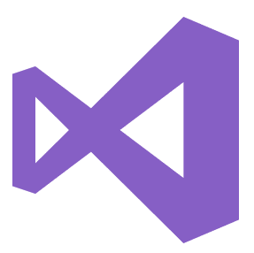
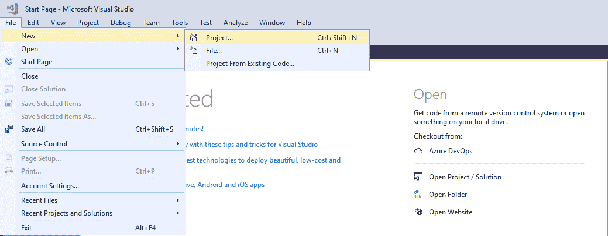
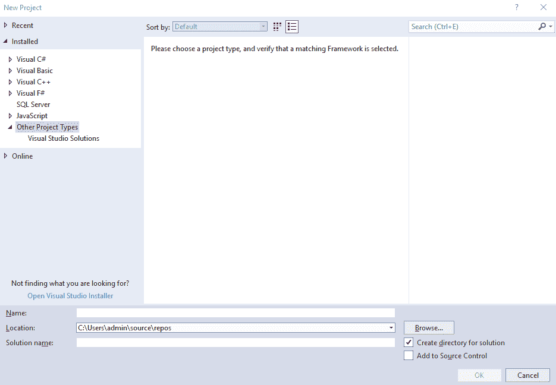
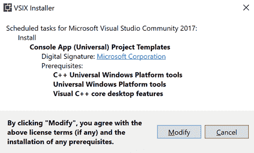
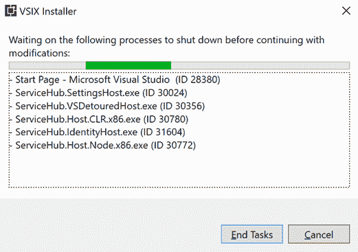
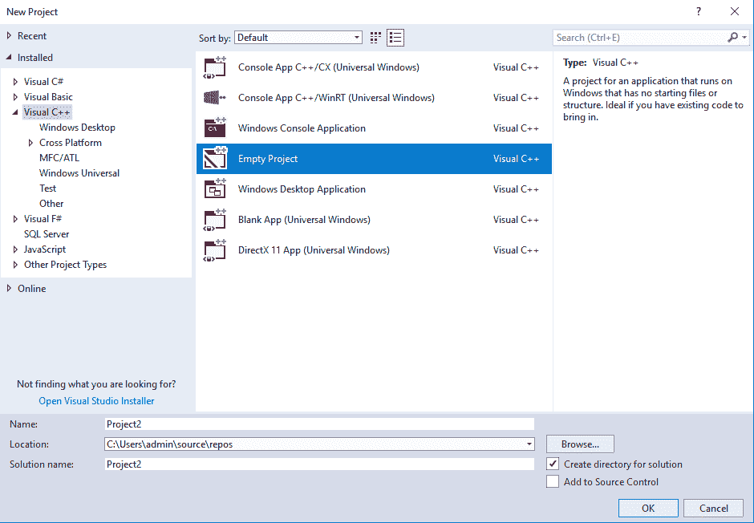
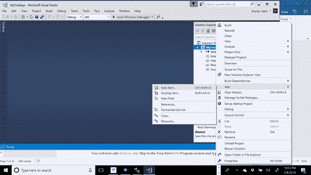
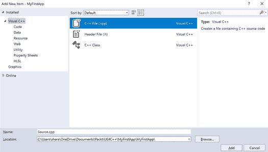
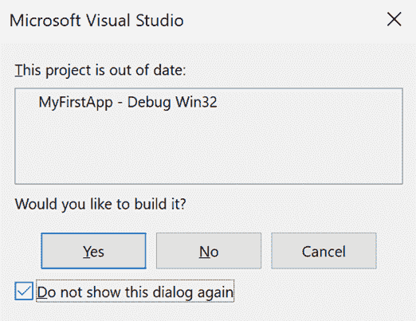

# C++ 17 入门

学者们经常在理论上描述编程概念，但喜欢把实现留给其他人，最好是业内人士。在这本书里，我们涵盖了所有内容:我们将描述 C++ 概念背后的理论，并实现我们自己的游戏。如果你是第一次做程序员，你有很多东西要学！

我建议的第一件事是你做练习。你不能仅仅通过阅读来学习编程。你必须在练习中应用理论来吸收它，并能够在将来使用它。

我们将从用 C++ 编写非常简单的程序开始。我知道你想现在就开始玩你的游戏。然而，你必须从头开始才能到达那个终点(如果你真的想，跳到[第 13 章](13.html)**法术书*，或者打开一些样本来感受一下我们要去的地方)。*

 *在本章中，我们将涵盖以下主题:

*   设置新项目(在 Visual Studio 或 Xcode 中)
*   你的第一个 C++ 项目
*   如何处理错误
*   什么是构建和编译？

# 建立我们的项目

我们的第一个 C++ 程序将在 UE4 之外编写。首先，我将提供 Xcode 和 Visual Studio 2017 的步骤，但是在这一章之后，我将尝试只讨论 C++ 代码，而不涉及您是使用微软 Windows 还是 macOS。

# 在视窗系统上使用微软视觉工作室

在这一部分，我们将安装一个**集成开发环境** ( **IDE** )，允许你为微软的 Visual Studio Windows 编辑代码。如果您使用的是苹果电脑，请跳到下一部分。

# 下载和安装 Visual Studio

要启动，请下载并安装 Microsoft Visual Studio Community 2017。

The Community edition of Visual Studio is the free version of Visual Studio that Microsoft provides on their website. Go to [https://www.visualstudio.com/downloads/](http://www.visualstudio.com/en-us/products/visual-studio-express-vs.aspx) to download and then start the installation process.

你可以在这里找到完整的安装说明:[https://docs . Microsoft . com/en-us/visualstudio/install/install-visual-studio？view=vs-2017](https://docs.microsoft.com/en-us/visualstudio/install/install-visual-studio?view=vs-2017) 。当您进入工作负载部分时，您会想要选择 C++ 桌面开发。

一旦有了 Visual Studio Community 2017，请打开它。这是软件图标的外观:



# 在 Visual Studio 中启动新项目

通过以下步骤，您可以真正键入代码:

1.  从“文件”菜单中，选择“新建|项目”...，如下图所示:



2.  您将看到以下对话框:



Note that there is a small box at the bottom with the text Solution name. In general, Visual Studio Solutions might contain many projects. However, this book only works with a single project, but at times you might find it useful to integrate many projects into the same solution.

3.  现在有五件事需要处理，如下所示:
    1.  从左侧面板中选择联机|模板| Visual C++
    2.  从右侧面板中选择控制台应用程序(通用)项目模板
    3.  说出你的应用(我用了`MyFirstApp`)
    4.  选择保存代码的文件夹
    5.  点击确定按钮
4.  如果您以前从未使用过此模板，它将打开 VSIX 安装程序并显示此对话框:



5.  单击修改。它将安装并关闭 Visual Studio。如果出现此对话框，您可能需要单击结束任务:



6.  然后，它会为您安装项目模板。这需要很长时间，但你应该只需要做一次。完成后，单击关闭并重新启动 Visual Studio。
7.  您需要从文件|新建|项目中重新开始前面的步骤....这一次，Visual C++ 将显示在“已安装:



8.  选择空项目，您可以将项目 1 的名称更改为您想要的任何名称，在我的例子中是 MyFirstApp。

现在，您处于 Visual Studio 2017 环境中。这是你将完成所有工作和代码的地方。

然而，我们需要一个文件来编写代码。因此，我们将通过在解决方案资源管理器中右键单击项目名称并选择添加| **新项**，向我们的项目添加一个 C++ 代码文件，如下图所示:



添加新的 C++ ( `.cpp`)源代码文件，如下图截图所示:



`Source.cpp`现在已经打开，可以添加代码了。跳到*创建你的第一个 C++ 程序*部分开始。

# 在苹果电脑上使用 Xcode

在本节中，我们将讨论如何在 Mac 上安装 Xcode。如果您使用的是 Windows，请跳到下一部分。

# 下载并安装 Xcode

Xcode 可用(免费！)在苹果应用商店的所有苹果电脑上。

如果可能的话，你应该得到最新版本。截至本文撰写之时，它是 Xcode 10，但它至少需要 macOS Sierra 或(最好)High Sierra。如果你的苹果电脑比较旧，运行的是旧的操作系统，你可以免费下载操作系统更新，只要你使用的机器足够新，可以支持它。

只需在苹果应用商店搜索 Xcode，如下所示:


只需点击获取按钮，等待它下载并安装。

# 在 Xcode 中启动新项目

1.  一旦你安装了 Xcode，打开它。然后，从打开的闪屏中选择创建新的 Xcode 项目，或者导航到文件|新建|项目...从屏幕顶部的系统菜单栏中，如下图所示:


2.  在“新建项目”对话框中，在屏幕顶部 macOS 下的“应用程序”部分，选择“命令行工具”。然后，点击下一步:


3.  在下一个对话框中，命名您的项目。请务必填写所有字段，否则 Xcode 不会让您继续。确保项目的类型设置为 C++，然后单击“下一步”按钮，如下所示:


4.  下一个弹出窗口将要求您选择一个位置来保存您的项目。在你的硬盘上选一个位置，保存在那里。默认情况下，Xcode 为您创建的每个项目创建一个 Git 存储库。您可以取消选中创建 git 存储库，因为我们不会在本章中介绍 Git，如下图所示:


Git is a **version control system**. This basically means that Git takes and keeps snapshots of all the code in your project every so often (every time you *commit* to the repository). Other popular **source control management** (**SCM**) tools are Mercurial, Perforce, and Subversion. When multiple people are collaborating on the same project, the scm tool has the ability to automatically merge and copy other people's changes from the repository to your local code base.

好的。你们都准备好了。点击 Xcode 左侧面板中的`main.cpp`文件。如果文件没有出现，请确保首先选择左侧面板顶部的文件夹图标，如下图所示:


# 创建您的第一个 C++ 程序

我们现在要写一些 C++ 源代码。我们称之为源代码有一个很好的理由:它是构建二进制可执行代码的来源。相同的 C++ 源代码可以构建在不同的平台上，如 Mac、Windows 和移动平台，理论上，在每个平台上做完全相同的事情的可执行代码应该会产生结果。

在不远的过去，在引入 C 和 C++ 之前，程序员为他们分别瞄准的每台特定机器编写代码。他们用一种叫做汇编语言的语言编写代码。但是现在，有了 C 和 C++ 可用，程序员只需编写一次代码，只需使用不同的编译器构建相同的源代码，就可以将其部署到许多不同的机器上。

In practice, there are some differences between Visual Studio's flavor of C++ and Xcode's flavor of C++, but these differences mostly appear when working with advanced C++ concepts, such as templates. UE4 is very helpful when working with multiple platforms.

Epic Games 投入了大量的工作，以便让相同的代码在 Windows 和 Mac 上工作，以及许多其他平台，如移动和游戏控制台。

A real-world tip
It is important for the code to run in the same way on all machines, especially for networked games or games that allow things such as shareable replays. This can be achieved using standards. For example, the IEEE floating-point standard is used to implement decimal math on all C++ compilers. This means that the result of computations such as 200 * 3.14159 should be the same on all machines. Without standards, different compilers might (for example) round numbers differently, and where there are many calculations and the code needs to be precise, this could cause unacceptable differences.

在 Microsoft Visual Studio 或 Xcode 中编写以下代码:

```cpp
#include <iostream>
using namespace std;  
int main() 
{ 
  cout << "Hello, world" << endl; 
  cout << "I am now a C++ programmer." << endl; 
  return 0;
} 
```

为了解释发生了什么，这里是相同的代码，但添加了注释(同一行中`//`之后的任何内容都将被编译器忽略，但可以帮助解释发生了什么)。

```cpp
#include <iostream>  // Import the input-output library 
using namespace std; // allows us to write cout 
                     // instead of std::cout 
int main() 
{ 
  cout << "Hello, world" << endl; 
  cout << "I am now a C++ programmer." << endl; 
  return 0;      // "return" to the operating sys 
} 
```

在 Visual Studio 中按 *Ctrl* + *F5* (或使用调试|开始不调试菜单)运行前面的代码，或按*命令* + *R* (产品|运行)在 Xcode 中运行。第一次在 Visual Studio 中按 *Ctrl* + *F5* ，会看到这个对话框:



如果您不想在每次运行程序时看到此对话框，请选择“是”并不再显示此对话框。

以下是您应该在窗口中看到的内容:


这是在苹果电脑上:


If you're on Windows, you will probably notice that the window closes automatically when you run it so you can't see the results. There are various ways around this, including changing the settings to pause and make you press a key to continue. You can get more information here: [https://stackoverflow.com/questions/454681/how-to-keep-the-console-window-open-in-visual-c/1152873#1152873](https://stackoverflow.com/questions/454681/how-to-keep-the-console-window-open-in-visual-c/1152873#1152873)

你可能想到的第一件事是“我的！一大堆废话！”

事实上，在正常的英语文本中，你很少看到散列(#)符号(除非你使用推特)和大括号对`{` `}`的使用。然而，在 C++ 代码中，这些奇怪的符号比比皆是。你只需要习惯它们。

那么，我们来解读一下这个节目，从第一行开始。

这是节目的第一行:

```cpp
#include <iostream>  // Import the input-output library 
```

这条线有两点需要注意:

1.  我们首先看到的是一个`#include`语句。我们要求 C++ 将另一个名为`<iostream>`的 C++ 源文件的内容直接复制粘贴到我们的代码文件中。`<iostream>`是一个标准的 C++ 库，处理所有让我们在屏幕上打印文本的代码。
2.  我们注意到的第二件事是`//`评论。如前所述，C++ 会忽略双斜线(`//`)之后的任何文本，直到该行结束。注释对于在纯文本解释中添加一些代码的功能非常有用。您可能还会在源代码中看到`/* */`多行 C 风格的注释。用斜杠星`/*`和斜杠星`*/`包围 C 或 C++ 中的任何文本(甚至是多行文本)会给出一条指令，要求编译器删除该代码。

这是下一行代码:

```cpp
using namespace std; // allows us to write cout 
                     // instead of std::cout 
```

这一行旁边的注释解释了`using`语句的作用:它只是让你使用一个简写(例如，`cout`)来代替我们的很多 C++ 代码命令的完全限定名(在这种情况下，应该是`std::cout`)。有些人不喜欢`using namespace std;`的说法；每当他们想使用`cout`的时候，他们更喜欢用长字书写`std::cout`。像这样的事情你会陷入长时间的争论。在本文的这一部分，我们更喜欢`using namespace` `std;`语句的简洁。

此外，请注意，本节第二行的注释与上一行的注释是一致的。这是很好的编程实践，因为它直观地显示了它是前面注释的延续。

这是下一行:

```cpp
int main() 
```

这是应用程序的起点。你可以把`main`想象成一场比赛的起跑线。`int main()`语句是你的 C++ 程序如何知道从哪里开始。

如果你没有`int main()`程序标记或者`main`拼写错误，那么你的程序就不会运行，因为程序不知道从哪里开始。

下一行是您不常看到的字符:

```cpp
{ 
```

这个`{`人物不是侧身小胡子。它被称为大括号，表示程序的起点。

下面两行将文本打印到屏幕上:

```cpp
cout << "Hello, world" << endl; 
cout << "I am now a C++ programmer." << endl; 
```

`cout`语句代表控制台输出。双引号之间的文本将像出现在引号之间一样输出到控制台。除了双引号之外，您可以在双引号之间写任何您想要的内容，它仍然是有效的代码。另外，注意`endl`告诉`cout`添加一个结束行(回车)字符，这对格式化非常有用。

To enter a double quote between double quotes, you need to stick a backslash () in front of the double quote character that you want inside the string, as shown here:

```cpp
cout << "John shouted into the cave \"Hello!\" The cave echoed."  
```

`\"`符号是转义序列的一个例子。您可以使用其他转义序列；你会发现最常见的转义序列是`\n`，用于将文本输出跳转到下一行。

程序的最后一行是`return`语句:

```cpp
return 0; 
```

这一行代码表明 C++ 程序正在退出。你可以把`return`语句想象成返回操作系统。

最后，您的程序的结尾由右花括号表示，它是一个面向相反方向的侧髭:

```cpp
} 
```

# 分号

分号(；)在 C++ 编程中很重要。请注意，在前面的代码示例中，大多数代码行都以分号结尾。如果你没有用分号结束每一行，你的代码将不会编译，如果发生这种情况，你的雇主不会很高兴(当然，一旦你这样做了一段时间，你会发现并解决这些问题，甚至在他们发现之前)。

# 处理错误

如果您在输入代码时出错，那么您将会遇到语法错误。面对语法错误，C++ 会尖叫血腥谋杀，你的程序甚至不会编译；而且，它不会运行。

让我们试着在之前的 C++ 代码中插入几个错误:


Warning! This code listing contains errors. It is a good exercise to find all the errors and fix them!

作为练习，试着找出并修复这个程序中的所有错误。

Note that if you are extremely new to C++, this might be a hard exercise. However, this will show you how careful you need to be when writing C++ code.

修复编译错误可能是一件令人讨厌的事情。但是，如果您将此程序的文本输入到代码编辑器中并尝试编译它，它将导致编译器向您报告所有错误。一次修复一个错误，然后尝试重新编译(从列表中的第一个开始，因为它可能会导致后面的一些错误)。将弹出一个新的错误，或者程序将正常工作，如下图所示:


当您尝试编译代码时，编译器会向您显示代码中的错误(尽管如果您使用的是 Visual Studio，它会询问您是否要先运行先前成功的构建)。

我向您展示这个示例程序的原因是，只要您是 C++ 新手，就应该鼓励以下工作流:

1.  总是从一个有效的 C++ 代码示例开始。你可以从你的第一个 C++ 程序部分*创建* *中分叉出一堆新的 C++ 程序。*
2.  分几步修改代码。当你是新用户时，在写完每一行新代码后进行编译。不要花一到两个小时编写代码，然后一次编译所有新代码。
3.  你可以期待几个月之后，你才能写出第一次编写时就能达到预期性能的代码。不要气馁。学习编码很有趣。

# C++ 中的警告

编译器会标记它认为可能是错误的东西。这些是另一类被称为警告的编译器通知。警告是代码中的问题，您不必修复这些问题就可以运行代码，只需建议编译器修复即可。警告通常表明代码并不完美，在代码中修复警告通常被认为是一种好的做法。

然而，并不是所有的警告都会在您的代码中引起问题。一些程序员更喜欢禁用他们不认为是问题的警告(例如，警告 4018 警告不要出现指定/无符号不匹配，这很可能会在后面看到)。

# 什么是构建和编译？

你可能听说过一个叫做编译的计算机过程术语。编译是将 C++ 程序转换成可以在 CPU 上运行的代码的过程。构建你的源代码意味着编译它。

看，你的源`code.cpp`文件实际上不会在电脑上运行。必须先编译它才能运行。

这就是使用微软 Visual Studio 社区或 Xcode 的全部意义。Visual Studio 和 Xcode 都是编译器。您可以在任何文本编辑程序中编写 C++ 源代码，甚至可以在记事本中编写。但是你需要一个编译器在你的机器上运行它。

每个操作系统通常都有一个或多个 C++ 编译器，它们可以编译 C++ 代码以在该平台上运行。在 Windows 上，您有 Visual Studio 和英特尔 C++ Studio 编译器。在 Mac 上，有 Xcode，在所有的 Windows、Mac 和 Linux 上，都有 **GNU 编译器集合** ( **GCC** )。

我们编写的相同 C++ 代码(源代码)可以使用不同的编译器针对不同的操作系统进行编译，理论上它们应该会产生相同的结果。在不同平台上编译相同代码的能力称为可移植性。总的来说，便携性是一件好事。

# 示例输出

这是你第一个 C++ 程序的截图:


下面的截图是它的输出，你的第一次胜利:


There is another class of programming languages called scripting languages. These include languages such as PHP, Python, and `ActionScript.` Scripted languages are not compiled; for JavaScript, PHP, and ActionScript, there is no compilation step. Rather, they are interpreted from the source as the program is run. The good thing about scripting languages is that they are usually platform-independent from the word go, because interpreters are very carefully designed to be platform-independent.

# 练习- ASCII 艺术

游戏程序员喜欢 ASCII 艺术，你可以只用字符画一幅画。下面是一个 ASCII 艺术迷宫的例子:

```cpp
cout << "****************" << endl; 
cout << "*............*.*" << endl; 
cout << "*.*.*******..*.*" << endl; 
cout << "*.*.*..........*" << endl; 
cout << "*.*.*.**********" << endl; 
cout << "***.***........*" << endl; 
```

用 C++ 代码构建自己的迷宫或者用字符画一幅画。

# 摘要

总而言之，我们学习了如何在集成开发环境(IDE、Visual Studio 或 Xcode)中用 C++ 编程语言编写我们的第一个程序。这是一个简单的程序，但是你应该把编译和运行你的第一个程序算作你的第一次胜利。在接下来的章节中，我们将把更复杂的程序放在一起，并开始为我们的游戏使用虚幻引擎。*