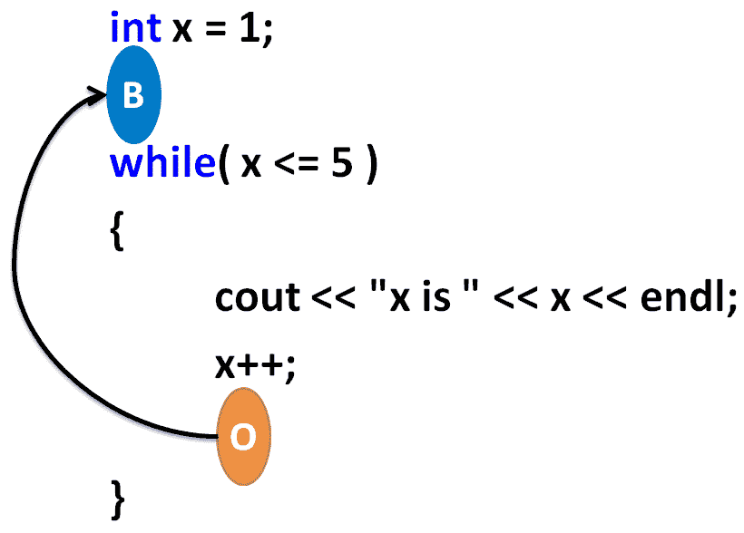
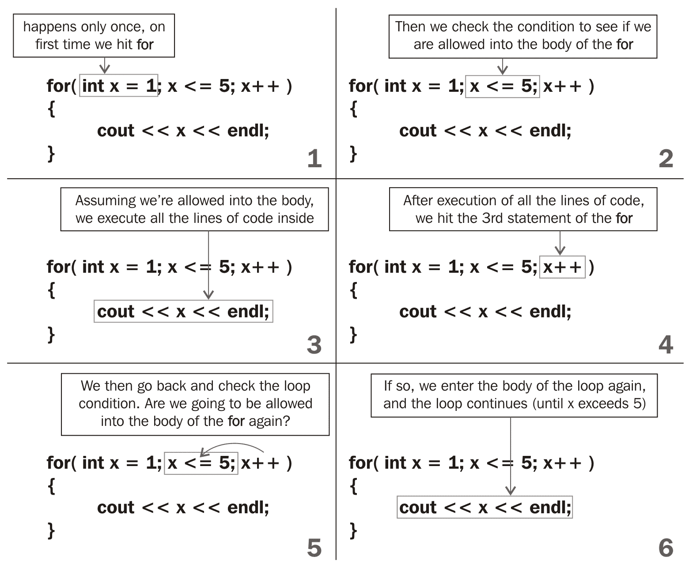

# 环

在前一章中，我们讨论了`if`语句。`if`语句使您能够对代码块的执行设置条件。

在本章中，我们将探讨循环，这是一种代码结构，使您能够在特定条件下重复一个代码块。一旦条件变为假，我们就停止重复这段代码。

在本章中，我们将探讨以下主题:

*   while 循环
*   do/while 循环
*   for 循环
*   虚幻引擎中一个实际循环的简单例子

# while 循环

`while`循环用于重复运行一段代码。如果您有一组必须重复执行才能完成某个目标的操作，这将非常有用。例如，以下代码中的`while`循环重复打印变量`x`的值，因为它从`1`增加到 5:

```cpp
int x = 1; 
while( x <= 5 ) // may only enter the body of the while when x<=5 
{ 
  cout << "x is " << x << endl; 
  x++; 
} 
cout << "Finished" << endl; 
```

这是前面程序的输出:

```cpp
x is 1 
x is 2 
x is 3 
x is 4 
x is 5 
Finished 
```

在第一行代码中，创建了一个整数变量`x`，并将其设置为`1`。然后，我们去`while`境。`while`条件表示当`x`小于或等于`5`时，您必须留在后面的代码块中。

循环的每次迭代(一次迭代意味着执行一次`{`和`}`之间的所有事情)从任务(打印数字`1`到`5`)中完成得更多一点。一旦任务完成(当`x <= 5`不再正确时)，我们将循环编程为自动退出。

与前一章的`if`语句类似，只有当您满足`while`循环(在前面的示例中为`x <= 5`)括号内的条件时，`while`循环才允许进入后面的块。你可以试着用一个`if`循环代替`while`循环，如下面的代码所示:

```cpp
int x = 1; 
if( x <= 5 ) // you may only enter the block below when x<=5 
{ 
  cout << "x is " << x << endl; 
  x = x + 1; 
} 
cout << "End of program" << endl; 
```

前面的代码示例只打印`x is 1`。因此，`while`循环完全像一个`if`语句，只是它有自动重复自身的特殊属性，直到`while`循环括号之间的条件变为假。

I'd like to explain the repetition of the `while` loop using a video game. If you don't know Valve's *Portal*, you should play it, if only to understand loops. Check out [https://www.youtube.com/watch?v=TluRVBhmf8w](https://www.youtube.com/watch?v=TluRVBhmf8w) for a demo video.

`while`循环在底部有一种魔法入口，这导致循环重复。下面的截图说明了我的意思:



There is a portal at the end of the while loop that takes you back to the beginning

在前面的截图中，我们从橙色入口(标记为`O`)返回到蓝色入口(标记为`B`)。这是我们第一次能够回到代码中。这就像时间旅行，只是为了代码。多刺激啊！

通过`while`循环块的唯一方法是不满足进入条件。在前面的例子中，一旦`x`的值变为 6(因此`x <= 5`变为假)，我们将不会再次进入`while`循环。因为橙色的入口在循环内，一旦`x`变成 6，我们就能退出循环。

# 无限循环

你会永远困在同一个循环里。考虑以下代码块中的修改程序(您认为输出会是什么？):

```cpp
int x = 1; 
while( x <= 5 ) // may only enter the body of the while when x<=5 
{ 
  cout << "x is " << x << endl; 
} 
cout << "End of program" << endl; 
```

输出将是这样的:

```cpp
x is 1 
x is 1 
x is 1 
. 
. 
. 
(repeats forever) 
```

循环永远重复，因为我们删除了改变`x`值的代码行。如果`x`的值保持不变，不允许增加，我们就会卡在`while`回路的体内。这是因为如果`x`在环体内没有变化，则不能满足环的退出条件(`x`的值变为 6)。

Just click the x button on the window to close the program.

以下练习将使用前几章的所有概念，如`+=`和减量操作。如果你忘记了什么，回去重读前面几节。

# 练习

让我们来看几个练习:

1.  写一个`while`循环，打印从`1`到`10`的数字
2.  写一个`while`循环，打印从 10 到 1(向后)的数字
3.  编写一个`while`循环，打印数字 2 到 20，递增 2(例如 2、4、6 和 8)
4.  写一个`while`循环，打印数字 1 到 16 以及它们旁边的方块

以下是练习 4 的示例程序输出:

| `1` | `1` |
| `2` | `4` |
| `3` | `9` |
| `4` | `16` |
| `5` | `25` |

# 解决方法

前面练习的代码解决方案如下:

1.  打印从`1`到`10`的数字的`while`循环的解决方案如下:

```cpp
int x = 1; 
while( x <= 10 ) 
{ 
  cout << x << endl; 
  x++; 
}
```

2.  将数字从`10`向后打印到`1`的`while`循环的解决方案如下:

```cpp
int x = 10; // start x high 
while( x >= 1 ) // go until x becomes 0 or less 
{ 
  cout << x << endl; 
  x--; // take x down by 1 
} 
```

3.  将从`2`到`20`的数字递增`2`的`while`循环的解决方案如下:

```cpp
int x = 2; 
while( x <= 20 ) 
{ 
  cout << x << endl; 
  x+=2; // increase x by 2's 
} 
```

4.  打印从`1`到`16`的数字及其方块的`while`循环的解决方案如下:

```cpp
int x = 1; 
while( x <= 16 ) 
{ 
  cout << x << "   " << x*x << endl; // print x and it's  
   square 
  x++; 
} 
```

# do/while 循环

`do` / `while`循环几乎与`while`循环相同。这里有一个`do` / `while`循环的例子，它相当于我们检查的第一个`while`循环:

```cpp
int x = 1; 
do 
{ 
  cout << "x is " << x << endl; 
  x++; 
} while( x <= 5 ); // may only loop back when x<=5 
cout << "End of program" << endl; 
```

这里唯一的区别是，我们不必在第一次进入循环时检查`while`条件。这意味着`do` / `while`循环的主体总是至少被执行一次(其中`while`循环可以被完全跳过，如果当你第一次击中它时进入 while `loop`的条件为假)。

这里有一个例子:

```cpp
int val = 5;
while (val < 5)
{
    cout << "This will not print." << endl;
}
do {
    cout << "This will print once." << endl;
} while (val < 5);
```

# for 循环

`for`环的解剖结构与`while`环略有不同，但两者非常相似。

让我们来研究一下`for`环与等效`while`环的解剖结构。以下面的代码片段为例:

| `for`循环 | 等效的`while`循环 |
| for(int x = 1；x < = 5；x++){层< < x <} | int x = 1;而(x <= 5){层< < x <x++；} |

`for`循环的括号内有三个语句。让我们按顺序检查它们。

`for`循环(`int x = 1;`)的第一个语句只执行一次，当我们第一次进入`for`循环的主体时。它通常用于初始化循环的计数器变量的值(在本例中是变量`x`)。`for`循环(`x <= 5;`)中的第二个语句是循环的重复条件。只要`x <= 5`，我们就必须继续留在`for`循环的体内。`for`循环(`x++;`)括号内的最后一条语句在我们每次完成`for`循环的主体后执行。

下图说明了`for`循环的进程:



# 练习

让我们看看这里的一些练习:

1.  写一个`for`循环，收集从`1`到`10`的数字总和
2.  写一个`for`循环，打印`6`的倍数，从`6`到`30` (6，12，18，24，30)
3.  写一个`for`循环，以`2`的倍数打印数字 2 到 100(例如 2、4、6、8 等等)
4.  写一个`for`循环，将数字`1`打印到`16`及其旁边的方块

# 解决方法

以下是前面练习的解决方案:

1.  打印从`1`到`10`的数字总和的`for`循环的解决方案如下:

```cpp
int sum = 0; 
for( int x = 1; x <= 10; x++ ) 
{ 
  sum += x; 
} 
cout << sum << endl; 
```

2.  从`6`到`30`打印`6`倍数的`for`循环的解决方案如下:

```cpp
for( int x = 6; x <= 30; x += 6 ) 
{ 
  cout << x << endl; 
} 
```

3.  以`2`的倍数从`2`到`100`打印数字的`for`循环的解决方案如下:

```cpp
for( int x = 2; x <= 100; x += 2 ) 
{ 
  cout << x << endl; 
}
```

4.  打印从`1`到`16`的数字及其方块的`for`循环的解决方案如下:

```cpp
for( int x = 1; x <= 16; x++ ) 
{ 
  cout << x << " " << x*x << endl; 
} 
```

# 用虚幻引擎循环

在你的代码编辑器中，从[第三章](03.html)、 *If、Else 打开你的虚幻`Puzzle`项目，然后切换*。

有几种方法可以打开您的虚幻项目。在 Windows 上，最简单的方法可能是导航到`Unreal Projects`文件夹(默认情况下位于用户的`Documents`文件夹中)，然后在 Windows 资源管理器中双击`.sln`文件，如下图所示:


在 Windows 中，打开`.sln`文件编辑项目代码。您也可以只打开 Visual Studio，它会记住您最近处理的项目并显示它们，以便您可以从那里单击它来打开它。您还需要从史诗游戏启动器在虚幻编辑器中打开项目来测试它。

现在，打开`PuzzleBlockGrid.cpp`文件。在该文件中，向下滚动到以以下语句开头的部分:

```cpp
void APuzzleBlockGrid::BeginPlay() 
```

请注意，这里有一个`for`循环来产生最初的九个块，如以下代码所示:

```cpp
// Loop to spawn each block 
for( int32 BlockIndex=0; BlockIndex < NumBlocks; BlockIndex++ ) 
{ 
  // ... 
} 
```

由于`NumBlocks`(用于确定何时停止循环)被计算为`Size*Size`，我们可以通过改变`Size`变量的值来轻松改变产生的块数。转到`PuzzleBlockGrid.cpp`的第 24 行，将`Size`变量的值更改为`4`或`5`。然后，再次运行代码(确保在虚幻编辑器中按下编译按钮，使其使用更新的代码)。

您应该会看到屏幕上的块数增加(尽管您可能需要滚动才能全部看到)，如下图所示:


将大小设置为`14`会创建更多的块。

# 摘要

在本章中，您学习了如何通过循环代码来重复代码行，这允许您多次运行它。这可以用来重复使用同一行代码来完成任务。想象一下从`1`到`10`打印数字(或者 10000！)而不使用循环。

在下一章中，我们将探索函数，函数是可重用代码的基本单元。