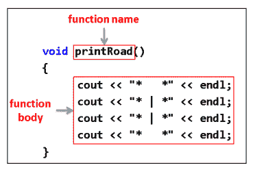
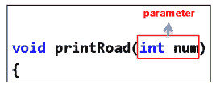
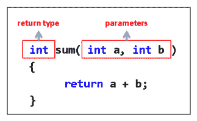
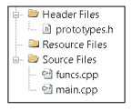

# 函数和宏

编写代码时，您会发现自己需要多次运行相同的代码。你最不想做的事情就是在一堆不同的地方复制和粘贴相同的代码(毕竟，如果你需要做一个改变会发生什么？).写一次叫多次不是更容易吗？这就是我们在这一章要讲的内容。我们将讨论的主题包括:

*   功能
*   带参数的函数
*   返回值的函数
*   初始化列表
*   更多变量
*   宏指令
*   康斯特布尔

# 功能

有些事情需要重复。代码不是其中之一。一个函数是一堆代码，可以被调用任意多次，就像你经常希望的那样。

类比是好的。让我们探索一个涉及服务员、厨师、比萨饼和功能的类比。在英语中，当我们说一个人有功能时，我们的意思是这个人执行一些非常具体(通常非常重要)的任务。每当他们被要求这样做时，他们可以一次又一次地完成这项任务。

下面的连环画展示了服务员(呼叫者)和厨师(被呼叫者)之间的互动。服务员想为他的桌子准备食物，所以他叫厨师准备等候的桌子需要的食物。厨师准备食物，然后将结果返回给服务员:


在这里，厨师履行烹饪食物的职责。厨师接受了关于烹饪哪种食物的参数(三个意大利辣香肠馅饼)。然后厨师走了，做了一些工作，带着三个比萨饼回来了。请注意，服务员不知道也不关心厨师如何烹饪比萨饼。厨师为服务员抽象出做披萨的过程，所以做披萨对服务员来说只是一个简单的单行命令。服务员只是想完成他的要求，把比萨饼还给他。

当一个函数(厨师)被调用了一些参数(要准备的比萨饼的类型)时，这个函数会执行一些操作(准备比萨饼)并可选地返回一个结果(实际完成的比萨饼)。

# 库函数示例–sqrt()

现在，让我们谈一个更实际的例子，并把它与比萨饼的例子联系起来。

`<cmath>`库中有一个函数叫做`sqrt()`函数。让我快速说明它的用法，如下面的代码所示:

```cpp
#include <iostream> 
#include <cmath> 
using namespace std; 
int main() 
{ 
  double rootOf5 = sqrt( 5 ); // function call to the sqrt  
   function 
  cout << rootOf5  << endl; 
} 
```

函数调用在`=`字符后:`sqrt( 5 )`。所以，`sqrt()`可以求出给它的任何数的数学平方根。

你知道如何求一个棘手数字的平方根吗，比如 5？这并不简单。一个聪明的灵魂坐下来写了一个函数，可以找到所有类型的数字的平方根。使用`sqrt(5)`函数调用如何求 5 的平方根，你一定要理解背后的数学吗？见鬼，不！所以，就像服务员不一定要了解如何烹饪比萨饼才能得到比萨饼一样，C++库函数的调用者也不一定要完全了解库函数内部是如何工作的，才能有效地使用它。

以下是使用函数的优点:

*   函数将复杂的任务抽象成简单的、可调用的例程。这使得*做披萨*所需的代码，例如，只是调用者的一个单行命令(调用者通常是你的程序)。
*   函数避免了不必要的代码重复。假设我们有 20 行左右的代码可以找到一个双精度值的平方根。我们将这些代码行包装成一个可调用的函数；我们不需要重复复制粘贴这 20 行代码，只需要在需要根的时候调用`sqrt`函数(数字为 root)。

下图显示了求平方根的过程:


# 编写我们自己的函数

假设我们想编写一些代码，打印出一条道路，如下所示:

```cpp
cout << "*   *" << endl; 
cout << "* | *" << endl; 
cout << "* | *" << endl; 
cout << "*   *" << endl; 
```

现在，假设我们想连续打印两条路，或者三条路。或者，假设我们想要打印任意数量的道路带。我们将不得不对我们试图打印的每一条道路重复生成第一条道路的四行代码。

如果我们引入自己的 C++命令，允许我们在调用命令时打印一条道路，会怎么样？看起来是这样的:

```cpp
void printRoad() 
{ 
  cout << "*   *" << endl; 
  cout << "* | *" << endl; 
  cout << "* | *" << endl; 
  cout << "*   *" << endl; 
} 
```

这是函数的定义。C++函数有以下结构:



`void`表示它不返回任何值，并且由于括号内没有任何内容，因此它不接受任何参数。稍后我们将讨论参数和返回值。使用函数很简单:我们只需通过名称调用我们想要执行的函数，后跟两个圆括号，`()`。例如，调用`printRoad()`函数将导致`printRoad()`函数运行。让我们追踪一个示例程序来完全理解这意味着什么。

# 示例程序跟踪

下面是函数调用工作原理的完整示例:

```cpp
#include <iostream> 
using namespace std; 
void printRoad() 
{ 
  cout << "*   *" << endl; 
  cout << "* | *" << endl; 
  cout << "* | *" << endl; 
  cout << "*   *" << endl; 
} 
int main() 
{ 
  cout << "Program begin!" << endl; 
  printRoad(); 
  cout << "Program end" << endl; 
  return 0; 
} 
```

让我们从头到尾跟踪程序的执行。请记住，对于所有 C++程序，执行从`main()`的第一行开始。

`main()` is also a function. It oversees the execution of the whole program. Once `main()` executes the `return` statement, your program ends.

前面程序执行的逐行跟踪如下所示:

```cpp
void printRoad() 
{ 
  cout << "*   *" << endl;          // 3: then we jump up here 
  cout << "* | *" << endl;          // 4: run this 
  cout << "* | *" << endl;          // 5: and this 
  cout << "*   *" << endl;          // 6: and this 
} 
int main() 
{ 
  cout << "Program begin!" << endl; // 1: first line to execute 
  printRoad();                      // 2: second line.. 
  cout << "Program end" << endl;    // 7: finally, last line 
  return 0;                         // 8: and return to o/s 
} 
```

这个程序的输出是这样的:

```cpp
Program begin! 
*   * 
* | * 
* | * 
*   * 
Program end 
```

下面是对前面代码的逐行解释:

1.  程序的执行从`main()`的第一行开始，输出`program begin!`。
2.  运行的下一行代码是对`printRoad()`的调用。这是把程序计数器跳到`printRoad()`的第一行。`printRoad()`的所有行按顺序执行(第 3-6 行)。
3.  对`printRoad()`的函数调用完成后，控制返回到`main()`语句。我们接着看到`Program end`印出来了。

Don't forget the brackets after the function call to `printRoad()`. A function call must always be followed by round brackets, `()`, otherwise the function call will not work and you will get a compiler error.

以下代码用于打印四条道路:

```cpp
int main() 
{ 
        printRoad(); 
        printRoad(); 
        printRoad(); 
        printRoad(); 
} 
```

或者，您也可以使用以下代码:

```cpp
for( int i = 0; i < 4; i++ ) 
{
    printRoad();
}
```

所以，我们不是每次打印一个盒子都重复`cout`的四行，而是简单的调用`printRoad()`函数让它打印出来。此外，如果我们想改变印刷道路的外观，我们必须简单地修改`printRoad()`功能的实现。

调用一个函数需要一行一行地运行该函数的整个主体。函数调用完成后，程序的控制将在函数调用点恢复。

# 锻炼

作为练习，找出以下代码有什么问题:

```cpp
#include <iostream> 
using namespace std; 
void myFunction() 
{ 
   cout << "You called?" << endl; 
} 
int main() 
{ 
   cout << "I'm going to call myFunction now." << endl; 
   myFunction; 
} 
```

# 解决办法

这个问题的正确答案是对`myFunction`(在`main()`的最后一行)的调用后面没有圆括号。所有函数调用都必须后跟圆括号。`main()`的最后一行应该是`myFunction();`，而不仅仅是`myFunction`。

# 带参数的函数

如何扩展`printRoad()`功能，打印出有一定段数的道路？答案很简单。我们可以让`printRoad()`函数接受一个名为`numSegments`的参数，来打印一定数量的路段。

下面的代码片段显示了这将如何出现:

```cpp
void printRoad(int numSegments) 
{ 
  // use a for loop to print numSegments road segments 
  for( int i = 0; i < numSegments; i++) 
  { 
    cout << "*   *" << endl; 
    cout << "* | *" << endl; 
    cout << "* | *" << endl; 
    cout << "*   *" << endl; 
  } 
} 
```

下面的截图显示了接受参数的函数的结构:



调用这个新版本的`printRoad()`，要求它打印四段，如下:

```cpp
printRoad( 4 );    // function call 
```

前面语句中`function call`括号之间的值`4`被分配给`printRoad(int numSegments)`函数的`numSegments`变量。这就是值`4`传递到`numSegments`的方式:


An illustration of how printRoad(4) will assign the value 4 to the numSegments variable

因此，`numSegments`将调用
中括号之间传递的值赋给`printRoad()`。

# 返回值的函数

一个返回值的函数的例子是`sqrt()`函数。`sqrt()`函数接受括号中的单个参数(要求根的数字)，并返回该数字的实际根。

这里有一个使用`sqrt`函数的例子:

```cpp
cout << sqrt( 4 ) << endl; 
```

`sqrt()`功能的作用类似于厨师在准备比萨饼时所做的。

作为函数的调用者，你不关心`sqrt()`函数体内发生了什么；这个信息是不相关的，因为你想要的只是你传递的数字的平方根的结果。

让我们声明自己的简单的返回值函数，如下面的代码所示:

```cpp
int sum(int a, int b) 
{ 
  return a + b; 
} 
```

下面的屏幕截图显示了带有参数和返回值的函数的结构:



`sum`功能非常基础。它所做的只是取两个`int`数字，`a`和`b`，将它们相加，并返回一个结果。你可能会说，我们甚至不需要一个完整的函数来加两个数字。你说得对，但请稍等。我们将使用这个简单的函数来解释返回值的概念。

您将以这种方式使用`sum`功能(从`main()`开始):

```cpp
int sum( int a, int b ) 
{ 
  return a + b; 
} 
int main() 
{ 
  cout << "The sum of 5 and 6 is " << sum( 5,6 ) << endl;  
} 
```

要完成`cout`命令，必须评估`sum( 5,6 )`函数调用。在发生`sum( 5,6 )`函数调用的地方，从`sum( 5,6 )`返回的值就放在那里。

换句话说，这是`cout`在评估`sum( 5,6 )`函数调用后实际看到的代码行:

```cpp
cout << "The sum of 5 and 6 is " << 11 << endl;     
```

从`sum( 5,6 )`返回的值被有效地剪切并粘贴到函数调用点。一个值必须总是由一个承诺这样做的函数返回(如果该函数的返回类型不是`void`)。

# 练习

1.  写一个`isPositive`函数，当传递给它的双参数确实为正时，返回`true`。
2.  完成以下功能定义:

```cpp
// function returns true when the magnitude of 'a' 
// is equal to the magnitude of 'b' (absolute value) 
bool absEqual(int a, int b)
 { 
    // to complete this exercise, try to not use 
    // cmath library functions 
}
```

3.  编写一个接受整数值(满分 100 分)并返回等级的`getGrade()`函数(可以是`A`、`B`、`C`、`D`或`F`)。
4.  数学函数的形式是`f(x) = 3x + 4`。编写一个为`f(x)`返回值的 C++函数。

# 解决方法

1.  `isPositive`函数接受一个双参数并返回一个布尔值:

```cpp
bool isPositive( double value ) 
{ 
  return value > 0; 
} 
```

2.  以下是已完成的`absEqual`功能:

```cpp
bool absEqual( int a, int b ) 
{ 
  // Make a and b positive 
  if( a < 0 ) 
  {
    a = -a;
  } 
  if( b < 0 ) 
  {
    b = -b; 
  }
  // now since they're both +ve, 
  // we just have to compare equality of a and b together 
  return a == b; 
} 
```

3.  `getGrade()`功能由以下代码给出:

```cpp
char getGrade( int grade ) 
{ 
  if( grade >= 90 )
  { 
    return 'A'; 
  }
  else if( grade >= 80 ) 
  {
    return 'B'; 
  }
  else if( grade >= 70 ) 
  {
    return 'C'; 
  }
  else if( grade >= 60 ) 
  {
    return 'D'; 
  }
  else 
  {
    return 'F'; 
  }
} 
```

4.  这个节目很简单，应该能让你开心。C++中名字函数的起源实际上来自数学世界，如下面的代码所示:

```cpp
double f( double x ) 
{ 
  return 3*x + 4; 
} 
```

# 初始化列表

有时，您可能不知道要向数组传递多少项。较新版本的 C++增加了一种简单的方法，初始化列表。这允许您在花括号内传递任意数量的项目，并用逗号分隔，如下所示:

```cpp
{ 1, 2, 3, 4 }
```

要进行设置，您需要使用`initializer_list`作为类型:

```cpp
#include <initializer_list>
using namespace std;

int sum(initializer_list<int> list) {
    int total = 0;
    for (int e : list) { // Iterate through the list
        total += e;
    }

    return total;
}
```

这是一个模板，我们将在后面讨论，但是现在你需要知道的是你放在列表中的对象的类型是在尖括号内，像这样:`<int>`。这很可能是另一种类型，如`float`或`char`。

要调用该函数，可以传入如下值:

```cpp
sum({ 1, 2, 3, 4 });
```

对于这种情况，结果将是`10`。

# 重新审视变量

既然您对 C++编码有了更深入的理解，那么重温您以前讨论过的主题总是很好的。

# 全局变量

既然我们已经引入了函数的概念，那么就可以引入全局变量的概念了。

什么是全局变量？全局变量是程序的所有函数都可以访问的任何变量。我们如何使程序的所有函数都可以访问一个变量？我们只需在代码文件的顶部声明全局变量，通常在`#include`语句之后或附近。

下面是一个带有一些全局变量的示例程序:

```cpp
#include <iostream> 
#include <string> 
using namespace std; 

string g_string;             // global string variable, 
// accessible to all functions within the program 
// (because it is declared before any of the functions 
// below!) 

void addA(){ g_string += "A"; } 
void addB(){ g_string += "B"; } 
void addC(){ g_string += "C"; } 

int main() 
{ 
  addA(); 
  addB(); 
  cout << g_string << endl; 
  addC(); 
  cout << g_string << endl; 
} 
```

在这里，程序中的所有四个函数都可以访问同一个`g_string`全局变量(`addA()`、`addB()`、`addC()`和`main()`)。全局变量在程序期间一直存在。

People sometimes prefer to prefix global variables with `g_`, but prefixing the variable name with `g_` is not a requirement for a variable to be global.

# 局部变量

局部变量是在代码块中定义的变量。局部变量在声明它们的块的末尾超出范围。一些例子将在下一节中跟随**范围的一个变量*。*

 *# 变量的范围

变量的范围是可以使用该变量的代码区域。任何变量的范围基本上都是定义它的块。我们可以用一个例子演示变量的作用域，如下面的代码所示:

```cpp
int g_int; // global int, has scope until end of file 
void func( int arg ) 
{ 
  int fx; 
} // </fx> dies, </arg> dies 

int main() 
{ 
  int x = 0; // variable <x> has scope starting here.. 
         // until the end of main() 
  if( x == 0 ) 
  { 
    int y;  // variable <y> has scope starting here, 
            // until closing brace below 
  } // </y> dies 
  if( int x2 = x ) // variable <x2> created and set equal to <x> 
  { 
    // enter here if x2 was nonzero 
  } // </x2> dies 

  for( int c = 0; c < 5; c++ ) // c is created and has 
  { // scope inside the curly braces of the for loop 
    cout << c << endl; 
  } // </c> dies only when we exit the loop 
} // </x> dies 
```

定义变量范围的主要东西是块。让我们讨论一下前面代码示例中定义的几个变量的范围:

*   `g_int`:这是一个全局整数，它的作用域范围是从它被声明的那一点一直到代码文件的末尾。也就是说，`g_int`可以在`func()`和`main()`内部使用，但不能在其他代码文件中使用。要有一个跨多个代码文件使用的全局变量，您需要一个外部变量。
*   `arg`(第`func()`的论点):这个可以从第一行的`func()`(左花括号后，`{`)到最后一行的`func()`(直到右花括号，`}`)使用。
*   `fx`:这个可以在`func()`里面的任何地方使用，直到`func()`的右花括号(`}`)。
*   `main()`(在`main()`内部的变量):这可以在评论中标记使用。

请注意，在函数参数列表的括号中声明的变量只能在该函数声明下面的块中使用，例如，传递给`func()`的`arg`变量:

```cpp
void func( int arg ) 
{ 
  int fx; 
} // </fx> dies, </arg> dies 
```

`arg`变量将在`func()`函数的右花括号(`}`)后消失。这是违背直觉的，因为圆括号在技术上不在定义`{`区块`}`的花括号内。

在`for`循环的圆括号内声明的变量也是如此。以下面的`for`循环为例:

```cpp
for( int c = 0; c < 5; c++ ) 
{ 
  cout << c << endl; 
} // c dies here 
```

`int c`变量可以用在`for`循环声明的圆括号内，也可以用在`for`循环声明下面的块内。`c`变量将在其声明所在的`for`循环的大括号结束后消失。如果希望`c`变量在`for`循环的括号后继续存在，需要在`for`循环之前声明`c`变量，如下图所示:

```cpp
int c; 
for( c = 0; c < 5; c++ ) 
{ 
  cout << c << endl; 
} // c does not die here 
```

# 静态局部变量

`static`局部变量有局部作用域，但退出函数时不会消失，而是记住调用之间的值，如下面的代码所示:

```cpp
void testFunc() 
{ 
  static int runCount = 0; // this only runs ONCE, even on 
  // subsequent calls to testFunc()! 
  cout << "Ran this function " << ++runCount << " times" << endl; 
} // runCount stops being in scope, but does not die here 

int main() 
{ 
  testFunc();  // says 1 time 
  testFunc();  // says 2 times! 
} 
```

通过使用`testFunc()`中的`static`关键字，`runCount`变量会在`testFunc()`的两次调用之间记住它的值。因此，`testFunc()`前面两个独立运行的输出如下:

```cpp
Ran this function 1 times 
Ran this function 2 times 
```

这是因为静态变量只创建和初始化一次(第一次在函数中声明它们时)，之后，静态变量保留其旧值。假设我们将`runCount`声明为一个正则的、局部的、非静态的变量:

```cpp
int runCount = 0; // if declared this way, runCount is local 
```

然后，输出会是这样的:

```cpp
Ran this function 1 times 
Ran this function 1 times 
```

在这里，我们看到`testFunc`两次都说`Ran this function 1 time`。作为局部变量，`runCount`的值不会在函数调用之间保留。

您不应该过度使用静态局部变量。一般来说，只有在绝对必要时，才应该使用静态局部变量。

# 常量变量

`const`变量是一个变量，它的值你承诺编译器在第一次初始化后不会改变。我们可以简单地声明一个，例如`pi`的值:

```cpp
const double pi = 3.14159; 
```

由于`pi`是一个普适常数(你可以依赖的为数不多的一样东西之一)，所以初始化后应该没有必要改变`pi`。事实上，对`pi`的修改应该被编译器禁止。例如，尝试为`pi`分配一个新值:

```cpp
pi *= 2; 
```

我们将得到以下编译器错误:

```cpp
error C3892: 'pi' : you cannot assign to a variable that is const 
```

这个错误非常有意义，因为除了初始化之外，我们不应该能够改变`pi`的值——一个常量变量。

# 常量和函数

`const`可以有多种用法，其中有些涉及函数。有时，您将变量传递给函数，但不希望函数对值进行任何更改。你可能会认为，我可以确保我不会改变它，不是吗？在你自己的项目中可能是这样，但是如果你在一个有多个程序员的大团队中呢？你可以只放一个注释，但是通常最好确保参数被标记为`const`。为此，您可以这样编写函数:

```cpp
int sum(const int x, const int y)
{
    return x + y;
}
```

现在，如果您试图更改这些值中的任何一个，都会导致错误。例如，这是行不通的:

```cpp
int sum(const int x, const int y)
{
    x = x + y; //ERROR!
    return x;
}
```

您也可以通过将其更改为类似以下内容来返回常数值:

```cpp
const int returnConst()
```

只要确保将函数返回的值保存在一个也标记为`const`的变量中，否则会出现错误。

# 功能原型

函数原型是没有主体的函数的签名。例如，让我们从以下练习中原型化`isPositive`、`absEqual`和`getGrade`功能:

```cpp
bool isPositive( double value ); 
bool absEqual( int a, int b ); 
char getGrade( int grade ); 
```

注意函数原型只是函数需要的返回类型、函数名和参数列表。功能原型没有身体。函数的主体通常放在`.cpp`文件中。

# 。h 和。cpp 文件

典型的做法是将你的函数原型放在`.h`文件中，将函数的主体放在`.cpp`文件中。这是因为您可以将您的`.h`文件包含在一堆`.cpp`文件中，而不会出现多个定义错误。

下面的截图清晰地展示了`.h`和`.cpp`文件，显示了主代码和函数的`.cpp`文件，以及保存函数原型的`.h`文件:


这里，我们在这个 Visual C++项目中有三个文件:



# 原型

`prototypes.h`文件包含功能原型。我们稍后将解释`extern`关键字的作用:

```cpp
// Make sure these prototypes are 
// only included in compilation ONCE 
#pragma once 
extern int superglobal; // extern: variable "prototype" 
// function prototypes 
bool isPositive( double value ); 
bool absEqual( int a, int b ); 
char getGrade( int grade ); 
```

# 功能.cpp

以下是`funcs.cpp`的内容:

```cpp
#include "prototypes.h" // every file that uses isPositive, 
// absEqual or getGrade must #include "prototypes.h" 
int superglobal; // variable "implementation" 
// The actual function definitions are here, in the .cpp file 
bool isPositive( double value ) 
{ 
  return value > 0; 
} 
bool absEqual( int a, int b ) 
{ 
  // Make a and b positive 
  if( a < 0 ) 
  {
    a = -a; 
  }
  if( b < 0 ) 
  {
    b = -b; 
  }
  // now since they're both +ve, 
  // we just have to compare equality of a and b together 
  return a == b; 
} 
char getGrade( int grade ) 
{ 
  if( grade >= 90 ) 
  {
    return 'A'; 
  }
  else if( grade >= 80 ) 
  {
    return 'B'; 
  }
  else if( grade >= 70 ) 
  {
    return 'C'; 
  }
  else if( grade >= 60 ) 
  {
    return 'D'; 
  }
  else 
  {
    return 'F'; 
  }
} 
```

# main.cpp

以下是`main.cpp`的内容:

```cpp
 #include <iostream> 
using namespace std; 
#include "prototypes.h" // for use of isPositive, absEqual  
// functions 
int main() 
{ 
  cout << boolalpha << isPositive( 4 ) << endl; 
  cout << absEqual( 4, -4 ) << endl; 
} 
```

当你把代码拆分成`.h`和`.cpp`文件时，`.h`文件(头文件)称为接口，`.cpp`文件(包含实际功能的文件)称为实现。

对于一些程序员来说，一开始令人困惑的是，如果我们只有原型，C++怎么知道`isPositive`和`getGrade`函数体在哪里？难道我们不应该把`funcs.cpp`文件也放入`main.cpp`吗？

答案是*魔法*。您只需要在`main.cpp`和`funcs.cpp`中`#include`到`prototypes.h`头文件。只要这两个`.cpp`文件都包含在您的 C++ **集成开发环境** ( **IDE** )项目中(即它们出现在左侧的解决方案资源管理器树视图中)，原型到函数体的链接就由编译器自动完成。

# 外部变量

一个`extern`声明类似于一个函数原型，只是它用在一个变量上。您可以将`extern`全局变量声明放在一个`.h`文件中，并将这个`.h`文件包含在一大堆其他文件中。这样，您可以拥有一个跨多个源文件共享的全局变量，而不会出现多重定义符号发现链接器错误。你应该把实际的变量声明放在一个`.cpp`文件中，这样变量只被声明一次。在上例的`prototypes.h`文件中有一个`extern`变量。

# 宏指令

C++宏来自一类称为预处理器指令的 C++命令。预处理器指令在编译发生之前执行。宏以`#define`开始。例如，假设我们有以下宏:

```cpp
#define PI 3.14159 
```

在最底层，宏只是在编译前发生的复制和粘贴操作。在前面的宏语句中，`3.14159`文字将被复制并粘贴到程序中出现符号`PI`的任何地方。

以下面的代码为例:

```cpp
#include <iostream> 
using namespace std; 
#define PI 3.14159 
int main() 
{ 
  double r = 4; 
  cout << "Circumference is " << 2*PI*r << endl; 
} 
```

C++预处理器要做的是首先检查代码，寻找`PI`符号的任何用法。它将在这条线上找到这样一个用途:

```cpp
cout << "Circumference is " << 2*PI*r << endl; 
```

前一行将在编译前转换为下面的行:

```cpp
cout << "Circumference is " << 2*3.14159*r << endl; 
```

因此，`#define`语句所发生的是，所使用的符号(例如，`PI`)的所有出现都被文字数字`3.14159`代替，甚至在编译发生之前。以这种方式使用宏的目的是避免将数字硬编码到代码中。符号通常比又大又长的数字更容易阅读。

Advice: try to use `const` variables where possible.

您可以使用宏来定义常量变量。也可以用`const`变量表达式代替。假设我们有下面一行代码:

```cpp
#define PI 3.14159 
```

我们将被鼓励使用以下内容:

```cpp
const double PI = 3.14159; 
```

使用`const`变量将受到鼓励，因为它将您的值存储在实际变量中。变量是类型化的，类型化数据是一件好事。

# 带参数的宏

我们也可以编写接受参数的宏。下面是一个带有参数的宏示例:

```cpp
#define println(X) cout << X << endl; 
```

这个宏会做的是每次在代码中遇到`println("Some value")`，右侧的代码(`cout << "Some value" << endl`)就会被复制粘贴到控制台中。注意括号之间的参数是如何在`X`处被复制的。假设我们有下面一行代码:

```cpp
println( "Hello there" ) 
```

这将由以下语句代替:

```cpp
cout << "Hello there" << endl; 
```

带有参数的宏就像非常短的函数。宏不能包含任何换行符。

Advice: use inline functions instead of macros with arguments.

你必须知道带有参数的宏是如何工作的，因为你会在 C++代码中经常遇到它们。然而，只要有可能，许多 C++程序员更喜欢使用内联函数，而不是带有参数的宏。

正常的函数调用执行包括对函数的`jump`指令，然后是函数的执行。内联函数的代码行被复制到函数调用点，并且不发出跳转。对于没有很多代码行的非常小的简单函数，使用内联函数通常是有意义的。例如，我们可以内联一个简单的函数`max`，它可以找到两个值中较大的一个:

```cpp
inline int max( int a, int b ) 
{ 
  if( a > b ) return a; 
  else return b; 
} 
```

在使用这个`max`函数的任何地方，函数体的代码都会被复制粘贴到函数调用点。不必对函数进行`jump`节省了执行时间，使内联函数有效地类似于宏。

使用内联函数有一个缺点。内联函数的主体必须完全包含在`.h`头文件中。这是为了让编译器可以进行优化，并在使用函数的任何地方进行内联。函数被内联通常是为了速度(因为你不必跳到另一段代码来执行函数)，但代价是代码膨胀。

以下是内联函数优于宏的原因:

*   宏容易出错:没有键入宏的参数。
*   宏必须写在一行中，否则您会看到它们使用转义:

```cpp
 \
newline characters \
like this \
which is hard to read \ 
```

*   如果宏编写得不仔细，将导致难以修复的编译器错误。例如，如果您没有正确地将参数括起来，那么您的代码就是错误的。
*   大型宏很难调试。

应该说，宏确实允许你执行一些预处理器编译魔法。UE4 大量使用带有参数的宏，您将在后面看到。

# 康斯特布尔

还有一种新的方法，你也可以在编译时而不是运行时做事情，那就是使用`constexpr`。与宏一样，您可以创建变量和函数，这些变量和函数将被编译器自动复制到使用它们的地方。所以，你可以做这样的变量:

```cpp
constexpr float pi = 3.14129f;
```

您也可以将`constexpr`添加到您想要在编译时运行的函数中，如下所示:

```cpp
constexpr int increment(int i)
{
    return i + 1;
}
```

还有一件事你可以用`constexpr`来做，那就是在编译的时候用它和`if`语句一起计算一些东西。因此，如果您想在编译游戏时为演示版本做一些不同的事情，您可以这样做:

```cpp
if constexpr (kIsDemoVersion) {
    //use demo version code here
} else {
   //use regular version code here
}
```

当我们谈论模板时，您会发现这些的更多用途。

# 摘要

函数调用允许您重用基本代码。代码重用很重要，原因有很多，主要是因为编程很难，应该尽可能避免重复劳动。编写`sqrt()`函数的程序员的努力，不需要其他想解决同样问题的程序员重复。*