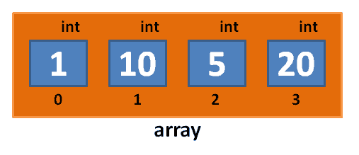
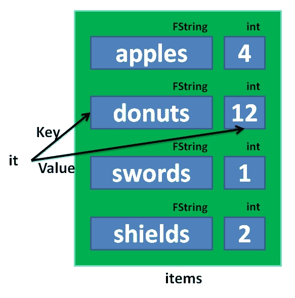
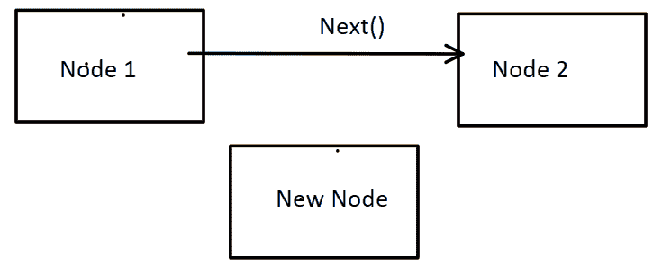

# 模板和常用容器

在[第 7 章](07.html)*动态内存分配*中，我们谈到了如果您想要创建一个在编译时大小未知的新数组，您将如何使用动态内存分配。动态内存分配的形式为`int * array = new int[ number_of_elements ]`。

您还看到，使用`new[]`关键字的动态分配要求您稍后在数组上调用`delete[]`，否则您会有内存泄漏。必须以这种方式管理内存是一项艰巨的工作。

有没有办法创建一个动态大小的数组，让 C++ 自动为你管理内存？答案是肯定的。有一些 C++ 对象类型(通常称为容器)可以自动处理动态内存分配和释放。UE4 提供了两种容器类型来将数据存储在可动态调整大小的集合中。

有两组不同的模板容器。有 UE4 系列容器(从`T*`开始)和 C++ **标准模板库** ( **STL** )系列容器。UE4 容器和 C++ STL 容器之间有一些区别，但是区别不是很大。UE4 容器集的编写考虑了游戏性能。C++ STL 容器也表现良好，它们的接口更加一致(API 中的一致性是您更喜欢的)。你用哪个容器组由你决定。但是，建议您使用 UE4 容器集，因为它保证您在尝试编译代码时不会有跨平台问题。

我们将在本章中讨论以下主题:

*   在 UE4 中调试输出
*   模板和容器
*   欧盟四国杯
*   测试和
*   常用容器的 C++ STL 版本

# 在 UE4 中调试输出

本章(以及后面章节)中的所有代码都要求您在 UE4 项目中工作。为了测试`TArray`，我创建了一个名为`TArrays`的基本代码项目。在`ATArraysGameMode::ATArraysGameMode`构造器中，我使用调试输出功能将文本打印到控制台。

以下是`TArraysGameMode.cpp`中的代码外观:

```cpp
#include "TArraysGameMode.h"
#include "Engine/Engine.h"

ATArraysGameMode::ATArraysGameMode(const FObjectInitializer& ObjectInitializer) : Super(ObjectInitializer)
{
    if (GEngine)
    {
        GEngine->AddOnScreenDebugMessage(-1, 30.f, FColor::Red, 
        TEXT("Hello!"));
    }
}
```

确保您也将该功能添加到`.h`文件中。如果您编译并运行这个项目，当您开始游戏时，您会在游戏窗口的左上角看到调试文本。您可以随时使用调试输出来查看程序的内部。只需确保在调试输出时`GEngine`对象存在。前面代码的输出显示在下面的截图中(请注意，您可能需要将其作为独立游戏运行才能看到它):


# 模板和容器

模板是一种特殊类型的对象。模板对象允许您指定它应该预期的数据类型。例如，正如您将很快看到的，您可以运行一个`TArray<T>`变量。这是一个模板的例子。

要理解`TArray<T>`变量是什么，首先你必须知道尖括号之间的`<T>`选项代表什么。`<T>`选项意味着存储在数组中的数据类型是一个变量。要不要`int`的数组？然后创建一个`TArray<int>`变量。`double`的一个`TArray`变量？创建一个`TArray<double>`变量。

所以一般来说，无论`<T>`出现在哪里，都可以插入自己选择的 C++ 数据类型。

容器是用于存储对象的不同结构。模板对于这些特别有用，因为它们可以用来存储许多不同类型的对象。您可能希望用 int 或 float、字符串或不同类型的游戏对象来存储数字。想象一下，如果你必须为你想要存储的每种类型的对象编写一个新的类。幸运的是，你不必。模板让一个类足够灵活，可以处理您想要存储在其中的任何对象。

# 你的第一个模板

创建模板是一个高级主题，您可以几年都不用创建自己的模板(尽管您会一直使用标准模板)。但是看到一个人的样子可能会有所帮助，这只是为了帮助你理解幕后发生的事情。

假设您想创建一个数字模板，让您使用 int、float 或其他类型。你可以这样做:

```cpp
template <class T>
class Number {
    T value;
public:
    Number(T val)
    {
        value = val;
    }

    T getSumWith(T val2);
};

template <class T>
T Number<T>::getSumWith(T val2)
{
    T retval;
    retval = value + val2;
    return retval;
}
```

第一部分是类本身。如您所见，您想要在模板中的任何地方使用该类型，您创建了该类，并将使用`T`而不是指定特定的类型。您也可以使用模板来指定发送给函数的值。在这种情况下，最后一部分让您添加另一个数字并返回总和。

您甚至可以通过重载+运算符使事情变得更简单，这样您就可以像添加任何标准类型一样添加这些数字。这是通过一种叫做运算符重载的方法实现的。

# UE4 '塔雷〔t0〕

tarray 是 UE4 的动态数组版本，使用模板构建。像我们讨论的其他动态阵列一样，您不必担心自己管理阵列大小。让我们继续，用一个例子来看看这个。

# 一个使用 TArray <t>的例子</t>

一个`TArray<int>`变量只是一个`int`的数组。一个`TArray<Player*>`变量将是一个`Player*`指针数组。数组是可动态调整大小的，并且可以在创建后在数组末尾添加元素。

要创建一个`TArray<int>`变量，你所要做的就是使用正常的变量分配语法:

```cpp
TArray<int> array; 
```

使用成员函数完成对`TArray`变量的更改。有几个成员函数可以在`TArray`变量上使用:

您需要了解的第一个成员函数是如何向数组中添加值，如以下代码所示:

```cpp
array.Add( 1 ); 
array.Add( 10 ); 
array.Add( 5 ); 
array.Add( 20 ); 
```

这四行代码将在内存中产生数组值，如下图所示:



当你呼叫`array.Add( number )`时，新号码会到达数组的末尾。既然我们把数字 **1** 、 **10** 、 **5** 、 **20** 加到了数组中，按照这个顺序，那就是它们进入数组的顺序。

如果您想在数组的前面或中间插入一个数字，这也是可能的。你所要做的就是使用`array.Insert(value, index)`函数，如下一行代码所示:

```cpp
array.Insert( 9, 0 ); 
```

该功能将把数字`9`推到阵列的位置`0`(在前面)。这意味着剩余的数组元素将向右偏移，如下图所示:


我们可以使用下面一行代码将另一个元素插入数组的位置`2`:

```cpp
array.Insert( 30, 2 ); 
```

该函数将重新排列数组，如下图所示:


If you insert a number into a position in the array that is out of bounds (it doesn't exist), UE4 will crash. So, be careful not to do that. You can use `Add` to add a new item instead.

# 重复一天

您可以通过两种方式迭代(遍历)`TArray`变量的元素:使用基于整数的索引或使用迭代器。我将在这里向你展示两种方法。

# 普通的循环加方括号符号

使用整数来索引数组的元素有时被称为普通的`for`循环。可以使用`array[ index ]`访问数组的元素，其中`index`是元素在数组中的数字位置:

```cpp
for( int index = 0; index < array.Num(); index++ ) 
{ 
  // print the array element to the screen using debug message 
  GEngine->AddOnScreenDebugMessage( -1, 30.f, FColor::Red,  
   FString::FromInt( array[ index ] ) ); 
} 
```

# 迭代程序

您也可以使用迭代器逐个遍历数组的元素，如以下代码所示:

```cpp
for (TArray<int>::TIterator it = array.CreateIterator(); it; ++ it)
{
    GEngine->AddOnScreenDebugMessage(-1, 30.f, FColor::Green, FString::FromInt(*it));
}
```

迭代器是指向数组的指针。迭代器可以用来检查或改变数组中的值。下图显示了一个迭代器示例:


迭代器是一个外部对象，可以查看和检查数组的值。做`++ it`移动迭代器检查下一个元素。

迭代器必须适合它所遍历的集合。要遍历一个`TArray<int>`变量，需要一个`TArray<int>::TIterator`类型的迭代器。

我们使用`*`来查看迭代器后面的值。在前面的代码中，我们使用`(*it)`从迭代器中获取整数值。这叫做取消引用。取消引用迭代器意味着查看它的值。

在`for`循环的每次迭代结束时发生的`++ it`操作递增迭代器，使其继续指向列表中的下一个元素。

把代码插入程序，现在就试一试。以下是我们使用`TArray`(都在`ATArraysGameMode::ATArraysGameMode()`构造函数中)创建的示例程序:

```cpp
ATArraysGameMode::ATArraysGameMode(const FObjectInitializer& ObjectInitializer) : Super(ObjectInitializer)
{
    if (GEngine)
    {
        TArray<int> array;
        array.Add(1);
        array.Add(10);
        array.Add(5);
        array.Add(20);
        array.Insert(9, 0);// put a 9 in the front 
        array.Insert(30, 2);// put a 30 at index 2 
        if (GEngine)
        {
            for (int index = 0; index < array.Num(); index++)
            {
                GEngine->AddOnScreenDebugMessage(index, 30.f, FColor::Red,
                    FString::FromInt(array[index]));
            }
        }
    }
}
```

下面的屏幕截图显示了前面代码的输出:


# 确定元素是否在数组中

搜索我们的 UE4 容器很容易。通常使用`Find`成员函数来完成。使用我们之前创建的数组，我们可以通过键入以下代码行找到`10`值的索引:

```cpp
int index = array.Find( 10 ); // would be index 3 in image above 
```

一个`TSet<int>`变量存储一组整数。一个`TSet<FString>`变量存储一组字符串。`TSet`和`TArray`的主要区别在于`TSet`不允许重复；`TSet`内部的所有元素保证是唯一的。一个`TArray`变量不介意相同元素的重复。

要给`TSet`添加号码，只需拨打`Add`。这里有一个例子:

```cpp
TSet<int> set; 
set.Add( 1 ); 
set.Add( 2 ); 
set.Add( 3 ); 
set.Add( 1 );// duplicate! won't be added 
set.Add( 1 );// duplicate! won't be added 
```

这就是`TSet`的样子:


不允许在`TSet`中出现相同值的重复条目。注意`TSet`中的条目没有编号，就像它们在`TArray`中一样；您不能使用方括号来访问`TSet`数组中的条目。

# 迭代一个 TSet

为了查看`TSet`数组，必须使用迭代器。您不能使用方括号符号来访问`TSet`的元素:

```cpp
for( TSet<int>::TIterator it = set.CreateIterator(); it; ++ it ) 
{ 
  GEngine->AddOnScreenDebugMessage( -1, 30.f, FColor::Red,  
   FString::FromInt( *it ) ); 
} 
```

# 交叉 TSet 阵列

`TSet`数组有两个特殊功能，`TArray`变量没有。两个`TSet`数组的交集基本上是它们共有的元素。如果我们有两个`TSet`数组，如`X`和`Y`，我们将它们相交，结果将是第三个新的`TSet`数组，它只包含它们之间共有的元素。请看下面的例子:

```cpp
TSet<int> X; 
X.Add( 1 ); 
X.Add( 2 ); 
X.Add( 3 ); 
TSet<int> Y; 
Y.Add( 2 ); 
Y.Add( 4 ); 
Y.Add( 8 ); 
TSet<int> common = X.Intersect(Y); // 2 
```

`X`和`Y`之间的共同元素就是`2`元素。

# 正在联合 TSet 数组

从数学上讲，两个集合的并集是指基本上将所有元素插入同一个集合。既然我们在这里谈论的是布景，就不会有任何重复。

如果我们取前面例子中的`X`和`Y`集合并创建一个并集，我们将得到一个新集合，如下所示:

```cpp
TSet<int> uni = X.Union(Y); // 1, 2, 3, 4, 8 
```

# 在 TSet 数组中查找

您可以使用集合上的`Find()`成员函数来确定元素是否在`TSet`内。`TSet`将返回一个指向`TSet`中与您的查询相匹配的条目的指针，如果该元素存在于`TSet`中，或者如果您所请求的元素不存在于`TSet`中，它将返回`NULL`。

# tmap〔t0〕

`TMap<T,S>`在内存中创建一个分类表。`TMap`表示左侧的键到右侧值的映射。您可以将`TMap`可视化为一个两列表格，左列为键，右列为值。

# 玩家物品清单

例如，假设我们想要创建一个 C++ 数据结构，以便为玩家的库存存储一个项目列表。在桌子的左手边(钥匙)，我们会有`FString`作为物品的名称。在右侧(数值)，我们有一个`int`表示该项目的数量，如下表所示:

| 项目(键) | 数量(价值) |
| `apples` | `4` |
| `donuts` | `12` |
| `swords` | `1` |
| `shields` | `2` |

要在代码中做到这一点，我们只需使用以下内容:

```cpp
TMap<FString, int> items; 
items.Add( "apples", 4 ); 
items.Add( "donuts", 12 ); 
items.Add( "swords", 1 ); 
items.Add( "shields", 2 ); 
```

一旦创建了`TMap`，就可以使用方括号并通过在方括号之间传递一个键来访问`TMap`内的值。例如，在前面代码中的`items`地图中，`items[ "apples" ]`是`4`。

UE4 will crash if you use square brackets to access a key that doesn't exist in the map yet, so be careful! The C++ STL does not crash if you do this.

# 迭代一个 TMap

为了迭代一个`TMap`，你也可以使用一个迭代器:

```cpp
for( TMap<FString, int>::TIterator it = items.CreateIterator(); it; ++ it ) 
{ 
  GEngine->AddOnScreenDebugMessage( -1, 30.f, FColor::Red, 
  it->Key + FString(": ") + FString::FromInt( it->Value ) ); 
} 
```

`TMap`迭代器与`TArray`或`TSet`迭代器略有不同。一个`TMap`迭代器包含一个`Key`和一个`Value`。我们可以使用`it->Key`访问密钥，使用`it->Value`访问`TMap`中的值。

这里有一个例子:



# TLinkedList/t 双链接列表

当您使用 TArray 时，每个项目都有一个按数字顺序排列的索引，数组数据通常以相同的方式存储，因此每个条目也紧挨着内存中它之前的条目。但是，如果您需要在中间的某个地方放置一个新项目(例如，如果数组中按字母顺序填充了字符串)，该怎么办呢？

由于这些物品是一个挨着一个的，所以旁边的那一个必须挪过去腾出空间。但是要做到这一点，旁边的那一个也必须被移走。这将一直持续到数组的末尾，当它最终到达它可以使用的内存时，不需要移动其他东西。正如你可能想象的，这可能会变得非常慢，尤其是如果你经常这样做的话。

这就是链表出现的地方。链表没有任何索引。链接列表具有包含项目的节点，并允许您访问列表中的第一个节点。该节点有一个指向列表中下一个节点的指针，可以通过调用`Next()`获得。然后，你可以在那个上面调用`Next()`来获得它后面的那个。它看起来像这样:


正如你可能猜到的，如果你在列表的末尾寻找一个项目，这可能会变得很慢。但与此同时，您可能不会经常搜索列表，而是会在中间的某个地方添加新项目。在中间添加一个项目要快得多。假设您试图在**节点 1** 和**节点 2** 之间插入一个新节点，如下所示:



这次没有必要在内存中移动东西来腾出空间。相反，要一个接一个地插入一个项目，请从**节点 1** ( **节点 2** )获取`Next()`指向的节点。设置新节点指向那个节点(**节点 2** )。然后，将节点 1 设置为指向新节点。现在应该是这样的:


你完蛋了！

那么，如果你打算花更多的时间在清单的末尾寻找物品呢？这就是`TDoubleLinkedList`派上用场的地方。双向链表可以给你列表中的第一个节点，也可以给你列表中的最后一个节点。每个节点也有指向下一个节点和上一个节点的指针。您可以使用`GetNextLink()`和`GetPrevLink()`访问这些。所以，你可以选择前进或后退，甚至两者兼而有之，在中间相遇。

现在，你可能会问自己，*“为什么我可以只用 TArray，不用担心它在幕后做什么，这有什么关系？”*首先，专业游戏程序员总要担心速度。计算机和游戏机的每一次进步都伴随着越来越多更好的图形，以及其他可以让事情再次减速的进步。所以，优化速度总是很重要的。

此外，还有另一个实际原因:根据经验，我可以告诉你，如果你不使用链表，这个行业中有人会在求职面试中拒绝你。程序员都有自己喜欢的做事方式，所以你应该随时熟悉可能出现的任何事情。

# 常用容器的 C++ STL 版本

现在，我们将介绍几个容器的 C++ STL 版本。STL 是大多数 C++ 编译器附带的标准模板库。我想介绍这些 STL 版本的原因是，它们的行为与相同容器的 UE4 版本有些不同。在某些方面，他们的行为非常好，但是游戏程序员经常抱怨 STL 有性能问题。特别是我想涵盖 STL 的`set`和`map`容器，但我也会涵盖常用的`vector`。

If you like STL's interface but want better performance, there is a well-known reimplementation of the STL library by Electronic Arts called EASTL, which you can use. It provides the same functionality as STL but is implemented with better performance (basically by doing things such as eliminating bounds checking). It is available on GitHub at [https://github.com/paulhodge/EASTL](https://github.com/paulhodge/EASTL).

# C++ STL 集

C++ 集合是一堆唯一且经过排序的项目。STL `set`的好特性是它保持集合元素有序。对一堆值进行分类的一种快速而肮脏的方法实际上是把它们塞进同一个`set`中。`set`会帮你整理的。

我们可以返回一个简单的 C++ 控制台应用来使用集合。要使用 C++ STL 集，需要包含`<set>`，如下图:

```cpp
#include <iostream> 
#include <set> 
using namespace std; 

int main() 
{ 
  set<int> intSet; 
  intSet.insert( 7 ); 
  intSet.insert( 7 ); 
  intSet.insert( 8 ); 
  intSet.insert( 1 ); 

  for( set<int>::iterator it = intSet.begin(); it != intSet.end();  
   ++ it ) 
  { 
    cout << *it << endl; 
  } 
} 
```

以下是前面代码的输出:

```cpp
1 
7 
8 
```

重复的`7`被过滤掉，元素在`set`内保持递增的顺序。我们迭代 STL 容器元素的方式类似于 UE4 的`TSet`数组。`intSet.begin()`函数返回一个指向`intSet`头部的迭代器。

停止迭代的条件是当它变成`intSet.end()`时。`intSet.end()`实际上是经过`set`末端的一个位置，如下图所示:


# 在<set>中寻找元素</set>

要在 STL `set`中找到一个元素，我们可以使用`find()`成员函数。如果我们要找的项目出现在`set`中，我们会得到一个迭代器，指向我们要搜索的元素。如果我们要找的物品不在`set`中，我们将返回`set.end()`，如下图所示:

```cpp
set<int>::iterator it = intSet.find( 7 ); 
if( it != intSet.end() ) 
{ 
  //  7  was inside intSet, and *it has its value 
  cout << "Found " << *it << endl; 
} 
```

# 锻炼

要求用户提供一组三个唯一的名称。逐个输入每个名字，然后按排序顺序打印出来。如果用户重复一个名字，请他们再叫一个，直到你数到三。

# 解决办法

可以使用以下代码找到前面练习的解决方案:

```cpp
#include <iostream> 
#include <string> 
#include <set> 
using namespace std; 
int main() 
{ 
  set<string> names; 
  // so long as we don't have 3 names yet, keep looping, 
  while( names.size() < 3 ) 
  { 
    cout << names.size() << " names so far. Enter a name" << endl; 
    string name; 
    cin >> name; 
    names.insert( name ); // won't insert if already there, 
  } 
  // now print the names. the set will have kept order 
  for( set<string>::iterator it = names.begin(); it !=  
   names.end(); ++ it ) 
  { 
    cout << *it << endl; 
  } 
} 
```

# C++ STL 映射

C++ STL `map`对象很像 UE4 的`TMap`对象。`TMap`没有做的一件事是在地图中保持有序。排序引入了额外的成本，但是如果你想要你的地图被排序，选择 STL 版本可能是一个不错的选择。

为了使用 C++ STL `map`对象，我们包括`<map>`。在下面的示例程序中，我们用一些键值对填充一个项目映射:

```cpp
#include <iostream> 
#include <string> 
#include <map> 
using namespace std; 
int main() 
{ 
  map<string, int> items; 
  items.insert( make_pair( "apple", 12 ) ); 
  items.insert( make_pair( "orange", 1 ) ); 
  items.insert( make_pair( "banana", 3 ) ); 
  // can also use square brackets to insert into an STL map 
  items[ "kiwis" ] = 44; 

  for( map<string, int>::iterator it = items.begin(); it !=  
   items.end(); ++ it ) 
  { 
    cout << "items[ " << it->first << " ] = " << it->second <<  
     endl; 
  } 
} 
```

这是前面程序的输出:

```cpp
items[ apple ] = 12 
items[ banana ] = 3 
items[ kiwis ] = 44 
items[ orange ] = 1 
```

请注意迭代器对 STL 映射的语法与`TMap`略有不同；我们使用`it->first`访问密钥，使用`it->second`访问值。

注意 C++ STL 如何比`TMap`还提供一点语法糖；可以用方括号插入到 C++ STL `map`中。你不能用方括号插入`TMap`。

# 在<map>中寻找元素</map>

您可以使用 STL 地图的`find`成员功能在地图中搜索<`key`、`value`、>对。你通常通过`key`搜索，它会给你这个`key`的价值。

# 锻炼

要求用户在一个空的`map`中输入五个项目及其数量。按排序顺序打印结果(即，按字母顺序或从低到高，如果是数字)。

# 解决办法

前面练习的解决方案使用了以下代码:

```cpp
#include <iostream> 
#include <string> 
#include <map> 
using namespace std; 
int main() 
{ 
  map<string, int> items; 
  cout << "Enter 5 items, and their quantities" << endl; 
  while( items.size() < 5 ) 
  { 
    cout << "Enter item" << endl; 
    string item; 
    cin >> item; 
    cout << "Enter quantity" << endl; 
    int qty; 
    cin >> qty; 
    items[ item ] = qty; // save in map, square brackets 
    // notation 
  } 

  for( map<string, int>::iterator it = items.begin(); it !=  
   items.end(); ++ it ) 
  { 
    cout << "items[ " << it->first << " ] = " << it->second <<  
     endl; 
  } 
} 
```

在这个解决方案代码中，我们首先创建`map<string, int> items`来存储我们将要接收的所有项目。向用户询问项目和数量；然后，我们使用方括号符号将`item`保存在`items`地图中。

# C++ STL 向量

`Vector`是`TArray`的 STL 等价物。它基本上是一个管理幕后一切的数组，就像`TArray`一样。在 UE4 工作的时候可能不需要用到，但是知道万一别人在项目中用到就好了。

# 摘要

UE4 的容器和 C++ STL 系列容器都非常适合存储游戏数据。通常，通过选择正确的数据容器类型，可以大大简化编程问题。

在下一章中，我们将通过跟踪玩家携带的信息并将这些信息存储在一个`TMap`对象中，开始对我们游戏的开始进行编程。