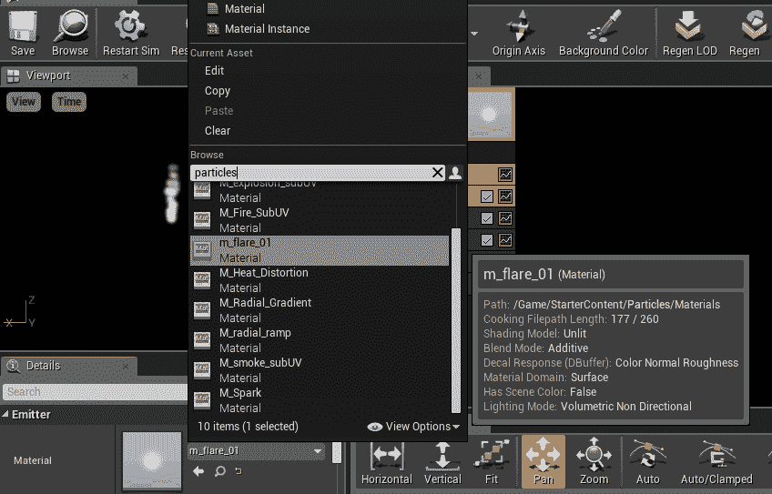
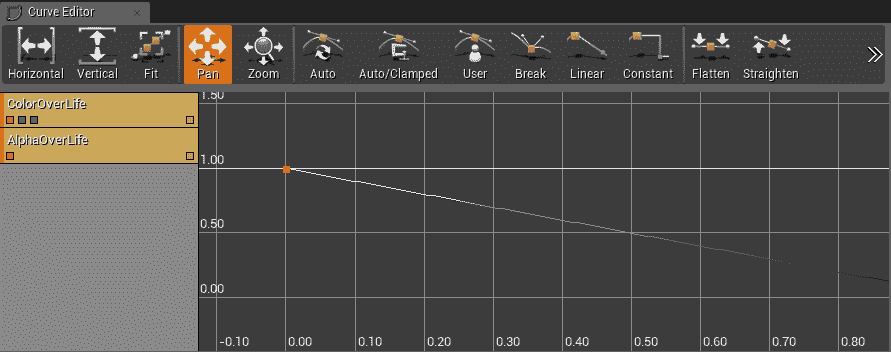
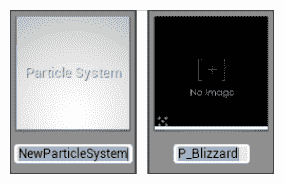
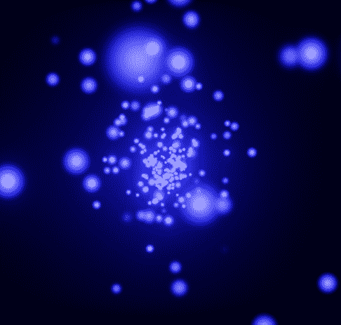
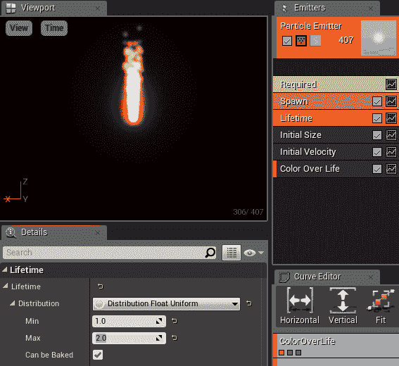
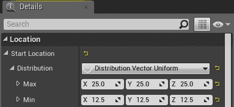
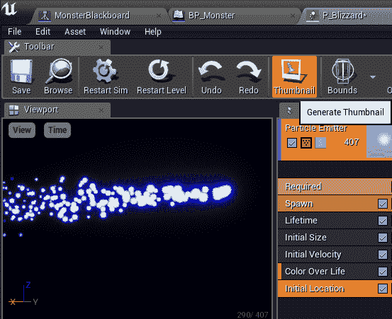
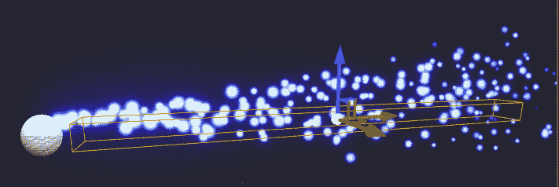
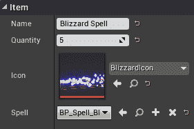

# 拼写书

这名球员还没有办法为自己辩护。我们现在将为玩家提供一种非常有用和有趣的方法，叫做魔法咒语。魔法法术将被玩家用来影响附近的怪物，所以你现在可以伤害他们。

我们将从描述如何创建我们自己的粒子系统开始这一章。然后，我们将继续把粒子发射器包装成一个`Spell`类，并为化身编写一个`CastSpell`函数，以便能够真正地`CastSpells`。

本章将涵盖以下主题:

*   什么是咒语？
*   粒子系统
*   法术类演员
*   将鼠标右键单击附加到 CastSpell
*   创造其他法术

# 什么是咒语？

实际上，法术将是一个粒子系统和一个由包围体表示的效果区域的组合。检查每个帧中包含的演员的边界体积。当一个演员在一个法术的范围内，那么这个演员就会受到这个法术的影响。

下面是暴雪法术的截图，包围体用橙色突出显示:


暴风雪法术有一个长长的、盒状的包围体。在每一帧中，检查包围体中包含的演员。包含在该法术的包围体中的任何演员将只在该帧中受到该法术的影响。如果演员移动到该法术的包围体之外，演员将不再受到该法术的影响。记住，法术的粒子系统只是一个可视化；粒子本身并不是影响游戏演员的因素。

我们在[第 8 章](08.html)、*演员和棋子*中创建的`PickupItem`职业可以让玩家拾取代表法术的物品。我们将扩展`PickupItem`职业，并附上一个法术蓝图来施放每个`PickupItem`。从平视显示器点击一个法术的小部件将会施放它。界面如下所示:


# 设置粒子系统

首先，我们需要一个地方来放置我们所有的时髦效果。为此，我们将遵循以下步骤:

1.  在内容浏览器选项卡中，右键单击内容根目录，并创建一个名为`ParticleSystems`的新文件夹。
2.  右键单击该新文件夹，并选择“新资产|粒子系统”，如下图所示:


See this Unreal Engine 4 particle systems guide for information on how Unreal particle emitters work: [https://www.youtube.com/watch?v=OXK2Xbd7D9w&amp;index=1&amp;list=PLZlv_N0_O1gYDLyB3LVfjYIcbBe8NqR8t](https://www.youtube.com/watch?v=OXK2Xbd7D9w&index=1&list=PLZlv_N0_O1gYDLyB3LVfjYIcbBe8NqR8t).

3.  双击出现的新粒子系统图标，如下图所示:


完成上述步骤后，您将进入粒子编辑器“级联”。环境如下图所示:


这里有几个不同的窗格，每个窗格显示不同的信息。它们如下:

*   左上角是“视口”窗格。这显示了当前发射器工作时的动画。
*   右侧是“发射器”面板。在其中，您可以看到一个名为“粒子发射器”的单个对象(您的粒子系统中可以有多个发射器，但我们现在不想要它)。“粒子发射器”的模块列表显示在它下面。从前面的截图中，我们有了必需、产卵、生命周期、初始大小、初始速度和颜色生命周期模块。

# 改变粒子属性

默认粒子发射器发射类似十字准线的形状。我们想把它变成更有趣的东西。为此，请遵循以下步骤:

1.  单击发射器面板下的黄色“必需”框，然后在“详细信息”面板中打开“材质”下拉列表。

将弹出所有可用粒子材料的列表(您可以在顶部键入`particles`，以便更容易找到您想要的材料)。

2.  选择 m_flare_01 选项来创建我们的第一个粒子系统，如下图所示:



3.  现在，让我们改变粒子系统的行为。单击发射器窗格下的“终生颜色”条目。底部的详细信息窗格显示了不同参数的信息，如下图所示:


4.  在“生命色彩”条目的“细节”面板中，我增加了 R，但没有增加 G，也没有增加 b。这给了粒子系统一种红色的光。(R 为红色，G 为绿色，B 为蓝色)。你可以看到吧台上的颜色。

然而，您实际上可以更直观地更改粒子颜色，而不是编辑原始数字。如果您单击发射器下“寿命期内颜色”条目旁边的绿色之字形按钮，您将看到“曲线编辑器”选项卡中显示的寿命期内颜色图表，如下图所示:



我们现在可以更改色彩寿命参数。曲线编辑器选项卡中的图形显示发射的颜色与粒子存活时间的关系。您可以通过拖动周围的点来调整值。按下 *Ctrl* +鼠标左键为一条线添加一个新的点(如果不起作用，请在黄色框中单击取消选择 AlphaOverLife，并确保仅选择 ColorOverLife):


您可以使用粒子发射器设置来创建自己的法术可视化效果。

# 暴雪咒语的设置

在这一点上，我们应该将我们的粒子系统从新粒子系统重命名为更具描述性的系统。我们把它重新命名为`P_Blizzard`。



只需点击粒子系统并按下 *F2，即可重命名粒子系统，如下图*:



我们将调整一些设置来获得暴雪粒子效果法术。请执行以下步骤:

1.  回到 P _ 暴雪粒子系统进行编辑。
2.  在产卵模块下，将产卵率更改为`200.0`。这增加了可视化的密度，如下所示:


3.  在寿命模块下，将 Max 属性从`1.0`增加到`2.0`，如下图截图所示。这给粒子的寿命带来了一些变化，一些发射粒子的寿命比其他粒子长:



4.  在“初始大小”模块下，将 X、Y 和 Z 中的“最小”属性大小更改为`12.5`，如下图所示:


5.  在初始速度模块下，将最小值/最大值更改为此处显示的值:


6.  我们让暴雪吹进+X 的原因是因为玩家的前进方向是从+X 开始的，因为法术会来自玩家的手，所以我们希望法术指向和玩家相同的方向。
7.  在“色彩寿命”菜单下，将蓝色(B)值更改为`100.0`。也把 R 改回`1.0`。您将看到蓝色辉光的瞬间变化:


现在开始看起来神奇了！

8.  右键单击生命周期颜色模块下方的黑色区域。选择位置|初始位置，如屏幕截图所示:


9.  在起始位置|分布下输入值，如下图所示:



10.  你应该有一场像这样的暴风雪:


11.  将相机移动到您喜欢的位置，然后单击顶部菜单栏中的缩略图选项。这将在内容浏览器选项卡中为粒子系统生成缩略图图标，如下图所示:



# 法术类演员

`Spell`职业最终会对所有怪物造成伤害。为此，我们需要在`Spell`类参与者中包含粒子系统和边界框。当化身施放一个`Spell`类时，`Spell`对象将被实例化到该级别并开始`Tick()`功能。在`Spell`对象的每个`Tick()`上，包含在该法术的包围体中的任何怪物都将受到该`Spell`的影响。

`Spell`类应该类似于下面的代码:

```cpp
#include "CoreMinimal.h"
#include "GameFramework/Actor.h"
#include "Components/BoxComponent.h"
#include "Runtime/Engine/Classes/Particles/ParticleSystemComponent.h"
#include "Spell.generated.h"

UCLASS()
class GOLDENEGG_API ASpell : public AActor
{
    GENERATED_BODY()

public:    
    ASpell(const FObjectInitializer&amp; ObjectInitializer);

    // box defining volume of damage 
    UPROPERTY(VisibleDefaultsOnly, BlueprintReadOnly, Category =
        Spell)
        UBoxComponent* ProxBox;

    // the particle visualization of the spell 
    UPROPERTY(VisibleDefaultsOnly, BlueprintReadOnly, Category =
        Spell)
        UParticleSystemComponent* Particles;

    // How much damage the spell does per second 
    UPROPERTY(EditAnywhere, BlueprintReadWrite, Category = Spell)
        float DamagePerSecond;

    // How long the spell lasts 
    UPROPERTY(EditAnywhere, BlueprintReadWrite, Category = Spell)
        float Duration;

    // Length of time the spell has been alive in the level 
    float TimeAlive;

    // The original caster of the spell (so player doesn't 
    // hit self) 
    AActor* Caster;

    // Parents this spell to a caster actor 
    void SetCaster(AActor* caster);

    // Runs each frame. override the Tick function to deal damage  
    // to anything in ProxBox each frame. 
    virtual void Tick(float DeltaSeconds) override;
};
```

我们只需要担心实现三个函数，即`ASpell::ASpell()`构造函数、`ASpell::SetCaster()`函数和`ASpell::Tick()`函数。

打开`Spell.cpp`文件。在`Spell.h`的 include 行下面，添加一行来包含`Monster.h`文件，这样我们就可以访问`Spell.cpp`文件中`Monster`对象的定义(以及其他几个 include)，如下面一行代码所示:

```cpp
#include "Monster.h" 
#include "Kismet/GameplayStatics.h"
#include "Components/CapsuleComponent.h"
```

首先，下面的代码显示了构造函数，它设置了拼写并初始化了所有组件:

```cpp
ASpell::ASpell(const FObjectInitializer&amp; ObjectInitializer)
 : Super(ObjectInitializer)
{
 ProxBox = ObjectInitializer.CreateDefaultSubobject<UBoxComponent>(this,
 TEXT("ProxBox")); 
 Particles = ObjectInitializer.CreateDefaultSubobject<UParticleSystemComponent>(this,
 TEXT("ParticleSystem"));

 // The Particles are the root component, and the ProxBox 
 // is a child of the Particle system. 
 // If it were the other way around, scaling the ProxBox 
 // would also scale the Particles, which we don't want 
 RootComponent = Particles;
 ProxBox->AttachToComponent(RootComponent, FAttachmentTransformRules::KeepWorldTransform);

 Duration = 3;
 DamagePerSecond = 1;
 TimeAlive = 0;

 PrimaryActorTick.bCanEverTick = true;//required for spells to 
 // tick! 
}
```

特别重要的是这里的最后一行`PrimaryActorTick.bCanEverTick = true`。如果不设置，您的`Spell`对象将永远不会有`Tick()`调用。

接下来，我们有`SetCaster()`方法。这样叫是为了让`Spell`对象知道施咒的人。我们可以通过使用以下代码来确保施法者不会用自己的法术伤害自己:

```cpp
void ASpell::SetCaster(AActor *caster)
{
 Caster = caster;
 RootComponent->AttachToComponent(caster->GetRootComponent(), FAttachmentTransformRules::KeepRelativeTransform);
}
```

最后，我们有`ASpell::Tick()`方法，它实际上对所有包含的参与者造成伤害，如下面的代码所示:

```cpp
void ASpell::Tick(float DeltaSeconds)
{
    Super::Tick(DeltaSeconds);

    // search the proxbox for all actors in the volume. 
    TArray<AActor*> actors;
    ProxBox->GetOverlappingActors(actors);

    // damage each actor the box overlaps 
    for (int c = 0; c < actors.Num(); c++)
    {
        // don't damage the spell caster 
        if (actors[c] != Caster)
        {
            // Only apply the damage if the box is overlapping 
            // the actors ROOT component. 
            // This way damage doesn't get applied for simply  
            // overlapping the SightSphere of a monster 
            AMonster *monster = Cast<AMonster>(actors[c]);

            if (monster &amp;&amp; ProxBox->IsOverlappingComponent(Cast<UPrimitiveComponent>(monster->GetCapsuleComponent())))
            {
                monster->TakeDamage(DamagePerSecond*DeltaSeconds,
                    FDamageEvent(), 0, this);
            }

            // to damage other class types, try a checked cast  
            // here.. 
        }
    }

    TimeAlive += DeltaSeconds;
    if (TimeAlive > Duration)
    {
        Destroy();
    }
}
```

`ASpell::Tick()`功能有很多功能，如下所示:

*   它让所有演员重叠`ProxBox`。如果重叠的组件是该对象的根组件，任何不是施法者的角色都会受到伤害。我们必须检查与根组件重叠的原因是，如果我们不这样做，法术可能会与怪物的`SightSphere`重叠，这意味着我们将从很远的地方获得命中，这是我们不想要的。
*   请注意，如果我们有另一类应该被损坏的东西，我们将不得不尝试对每种对象类型进行强制转换。每个类类型可能有一个不同类型的边界体积应该被碰撞；其他类型甚至可能没有`CapsuleComponent`(他们可能有`ProxBox`或`ProxSphere`)。
*   它增加了法术存活的时间。如果该法术超过了分配的施法持续时间，它将从该等级中移除。

现在，让我们专注于玩家如何获得法术，为玩家可以拾取的每个法术对象创建一个单独的`PickupItem`。

# 蓝印我们的咒语

用我们刚刚添加的`Spell`类编译并运行你的 C++ 项目。我们需要为我们想要施展的每一个法术创建蓝图。为此，请遵循以下步骤:

1.  在类查看器标签中，开始输入`Spell`，你会看到你的法术类出现
2.  右击法术，创建一个名为 BP _ 法术 _ 暴雪的蓝图，如下图截图所示:


3.  如果它没有自动打开，请双击打开它。
4.  在法术属性中，为粒子发射器选择 P _ 暴雪法术，如下图所示:


If you can't find it, try selecting Particles (Inherited) under Components.

选择 BP_SpellBlizzard(自)后，向下滚动，直到到达“法术”类别，然后将“每秒伤害”和“持续时间”参数更新为您喜欢的值，如下图所示。这里，暴雪法术持续`3.0`秒，每秒造成`16.0`伤害。三秒钟后，暴风雪会消失:


配置默认属性后，切换到组件选项卡进行进一步修改。点击并改变`ProxBox`的形状，使其形状有意义。盒子应该包裹粒子系统最强烈的部分，但不要忘了扩大它的尺寸。`ProxBox`物体不应该太大，因为那样你的暴雪法术会影响到那些甚至没有被暴雪接触到的东西。如下图所示，一些异常值是可以的:



你的暴雪法术现在是蓝印的，可以被玩家使用了。

# 拾起咒语

回想一下，我们之前对库存进行了编程，当用户按下 *I* 时，会显示玩家的领取物品数量。然而，我们想做的不止这些:


Items displayed when the user presses I

为了让玩家获得法术，我们将修改`PickupItem`类，通过使用以下代码为玩家施放的法术蓝图加入一个槽:

```cpp
// inside class APickupItem: 
// If this item casts a spell when used, set it here 
UPROPERTY(EditAnywhere, BlueprintReadWrite, Category = Item) 
UClass* Spell;
```

一旦将`UClass* Spell`属性添加到`APickupItem`类中，重新编译并重新运行您的 C++ 项目。现在，您可以继续为您的`Spell`对象制作`PickupItem`实例的蓝图。

# 为施法的拾取物品创建蓝图

创建一个名为 BP _ pick _ 法术 _ 暴雪的 PickupItem 蓝图，如下图截图所示:


它应该会自动打开，以便您可以编辑其属性。我将暴雪物品的拾取属性设置如下:

物品名称为暴雪法术，`5`在每个包裹中。我拍摄了一张暴雪粒子系统的截图，并将其导入到项目中，因此图标被选为该图像。在法术下，我选择了 BP _ 法术 _ 暴雪作为要施放的法术名称(不是 BP _ 皮卡 _ 法术 _ 暴雪)，如下图截图所示:



我为`PickupItem`类的`Mesh`类选择了一个蓝色的球体(使用 M_Water_Lake 材质也可以得到一个有趣的)。对于 Icon，我在粒子查看器预览中拍摄了暴雪法术的截图，保存到磁盘，并将该图像导入到项目中，如下图所示(参见示例项目的内容浏览器选项卡中的`images`文件夹):


在你的关卡中放置一些这样的`PickupItem`。如果我们拿起它们，我们的库存中会有一些暴雪法术(如果你不能拿起它们，确保你把 ProxSphere 做得足够大):


现在，我们需要激活暴雪。既然我们已经在[第 10 章](10.html)、*库存系统和拾取物品*中附加了鼠标左键，为了拖动图标，让我们附加鼠标右键来施法。

# 将鼠标右键单击附加到 CastSpell

鼠标右键在调用头像的`CastSpell`方法之前，需要经历相当多的函数调用。调用图看起来像下面的截图:


右击和施法之间会发生一些事情。它们如下:

*   正如我们之前看到的，所有用户鼠标和键盘的交互都是通过`Avatar`对象进行的。当`Avatar`对象检测到右键点击时，会通过`AAvatar::MouseRightClicked()`将点击事件传递给`HUD`。
*   在[第 10 章](10.html)、*库存系统和拾取物品*中，我们使用了`struct Widget`类来记录玩家拾取的物品。`struct Widget`只有三个成员:

```cpp
struct Widget 
{ 
  Icon icon; 
  FVector2D pos, size; 
  ///.. and some member functions 
}; 
```

*   我们现在需要为`struct Widget`类增加一个额外的属性来记住它所施放的法术。
*   `HUD`将确定点击事件是否在`AMyHUD::MouseRightClicked()`的`Widget`内。

*   如果点击的是施放法术的`Widget`，那么`HUD`通过召唤`AAvatar::CastSpell()`来召唤化身并请求施放该法术。

# 写头像的施法功能

我们将反向实现前面的调用图。我们将从编写游戏中实际施法的函数`AAvatar::CastSpell()`开始，如下面的代码所示:

```cpp
void AAvatar::CastSpell( UClass* bpSpell ) 
{ 
  // instantiate the spell and attach to character 
  ASpell *spell = GetWorld()->SpawnActor<ASpell>(bpSpell,  
   FVector(0), FRotator(0) ); 

  if( spell ) 
  { 
    spell->SetCaster( this ); 
  } 
  else 
  { 
    GEngine->AddOnScreenDebugMessage( 1, 5.f, FColor::Yellow,  
    FString("can't cast ") + bpSpell->GetName() ); } 
} 
```

还要确保将功能添加到`Avatar.h`并将`#include "Spell.h"`添加到该文件的顶部。

你可能会发现，实际上召唤一个咒语非常简单。施法有两个基本步骤:

1.  使用世界对象的`SpawnActor`功能实例化法术对象
2.  将其附加到头像上

一旦`Spell`对象被实例化，当该法术处于该等级时，其`Tick()`功能将运行每一帧。在每一个`Tick()`上，`Spell`物体会自动感应出关卡中的怪物并对其造成伤害。前面提到的每一行代码都会发生很多事情，所以让我们分别讨论每一行。

# 实例化拼写–GetWorld()-> SpawnActor()

要从蓝图创建`Spell`对象，我们需要从`World`对象调用`SpawnActor()`函数。`SpawnActor()`函数可以采用任何蓝图，并在级别内实例化。幸运的是，`Avatar`对象(实际上是任何`Actor`对象)只需调用`GetWorld()`成员函数，就可以随时获得`World`对象的句柄。

将`Spell`对象带入该级别的代码行如下:

```cpp
ASpell *spell = GetWorld()->SpawnActor<ASpell>( bpSpell,  
   FVector(0), FRotator(0) );
```

关于前一行代码，有几点需要注意:

*   `bpSpell`必须是一个`Spell`对象要创建的蓝图。尖括号中的`<ASpell>`表示期望。
*   新的`Spell`对象从原点(`0`、`0`、`0`)开始，并且没有对其应用额外的旋转。这是因为我们将把`Spell`对象附加到`Avatar`对象，这将为`Spell`对象提供平移和方向组件。

# if(拼写)

我们总是通过检查`if( spell )`来测试对`SpawnActor<ASpell>()`的调用是否成功。如果传递给`CastSpell`对象的蓝图实际上不是基于`ASpell`类的蓝图，那么`SpawnActor()`函数返回一个`NULL`指针，而不是一个`Spell`对象。如果发生这种情况，我们会在屏幕上打印一条错误消息，指出在施法过程中出现了问题。

# 法术->设定施法者(这个)

实例化时，如果法术成功，我们通过调用`spell->SetCaster( this )`将法术附加到`Avatar`对象上。请记住，在`Avatar`类的编程上下文中，`this`方法是对`Avatar`对象的引用。

现在，我们实际上如何从 UI 输入中连接施法，首先调用`AAvatar::CastSpell()`函数？我们需要再做一些`HUD`编程。

# 正在编写 AMyHUD::MouseRightClicked()

施法命令最终将来自平视显示器。我们需要编写一个 C++ 函数，该函数将遍历所有的 HUD 小部件并进行测试，看看是否有任何一个部件被点击。如果点击是在一个`widget`对象上，那么该`widget`对象应该通过施法来回应，如果它已经被分配了咒语的话。

我们必须扩展我们的`Widget`对象，使其有一个变量来保存要施放的法术的蓝图。使用以下代码向您的`struct Widget`对象添加成员:

```cpp
struct Widget
{
    Icon icon;
    // bpSpell is the blueprint of the spell this widget casts 
    UClass *bpSpell;
    FVector2D pos, size;
    //...
};
```

现在，回想一下，我们的`PickupItem`之前已经附上了它施放的法术蓝图。但是当`PickupItem`类被玩家从关卡中拾取时，那么`PickupItem`类就被破坏了，如下代码所示:

```cpp
// From APickupItem::Prox_Implementation(): 
avatar->Pickup( this ); // give this item to the avatar 
// delete the pickup item from the level once it is picked up 
Destroy(); 
```

所以，我们需要保留每个`PickupItem`施放什么法术的信息。当第一次拿起`PickupItem`时，我们可以这样做。

在`AAvatar`类中，添加一个额外的地图来记住物品施放的法术蓝图，按照物品名称，用下面一行代码:

```cpp
// Put this in Avatar.h 
TMap<FString, UClass*> Spells; 
```

现在，在`AAvatar::Pickup()`中，记住`PickupItem`类用下面一行代码实例化的拼写类:

```cpp
// the spell associated with the item 
Spells.Add(item->Name, item->Spell); 
```

现在，在`AAvatar::ToggleInventory()`中，我们可以拥有在屏幕上显示的`Widget`对象。通过查看`Spells`地图，记住它应该使用什么法术。

找到我们创建小部件的那一行，并对其进行修改，以添加`Widget`强制转换的`bpSpell`对象的赋值，如以下代码所示:

```cpp
// In AAvatar::ToggleInventory() 
Widget w(Icon(fs, tex));
w.bpSpell = Spells[it->Key];
hud->addWidget(w);
```

在`AMyHUD`中增加以下功能，我们将设置为每当鼠标右键点击图标时运行:

```cpp
void AMyHUD::MouseRightClicked()
{
    FVector2D mouse;
    APlayerController *PController = GetWorld()->GetFirstPlayerController();
    PController->GetMousePosition(mouse.X, mouse.Y);
    for (int c = 0; c < widgets.Num(); c++)
    {
        if (widgets[c].hit(mouse))
        {
            AAvatar *avatar = Cast<AAvatar>(
                UGameplayStatics::GetPlayerPawn(GetWorld(), 0));
            if (widgets[c].bpSpell)
                avatar->CastSpell(widgets[c].bpSpell);
        }
    }
}
```

这与我们的鼠标左键点击功能非常相似。我们只需对照所有小部件检查点击位置。如果任何`Widget`被右键点击，并且该`Widget`有一个`Spell`对象与之相关联，那么将通过调用头像的`CastSpell()`方法来施法。

# 激活鼠标右键单击

要连接这个 HUD 功能运行，我们需要在鼠标右键上附加一个事件处理程序。我们可以通过执行以下步骤来做到这一点:

1.  转到设置|项目设置；弹出对话框

2.  在引擎-输入下，为鼠标右键添加一个动作映射，如下图所示:


3.  在`Avatar.h` / `Avatar.cpp`中声明一个名为`MouseRightClicked()`的函数，代码如下:

```cpp
void AAvatar::MouseRightClicked() 
{ 
  if( inventoryShowing ) 
  { 
    APlayerController* PController = GetWorld()- 
     >GetFirstPlayerController(); 
    AMyHUD* hud = Cast<AMyHUD>( PController->GetHUD() ); 
    hud->MouseRightClicked(); 
  } 
}
```

4.  然后，在`AAvatar::SetupPlayerInputComponent()`中，我们应该将`MouseClickedRMB`事件附加到那个`MouseRightClicked()`函数:

```cpp
// In AAvatar::SetupPlayerInputComponent(): 
PlayerInputComponent->BindAction("MouseClickedRMB", IE_Pressed, this,
        &amp;AAvatar::MouseRightClicked);
```

我们终于接上了施法。试试看；游戏的玩法非常酷，如下图所示:


# 创造其他法术

通过玩粒子系统，你可以创造各种不同的法术，产生不同的效果。你可以创造火、闪电或者把敌人从你身边推开的法术。你可能在玩其他游戏的时候遇到了很多其他可能的咒语。

# 火焰咒语

通过将粒子系统的颜色改为红色，你可以很容易地创造出暴雪法术的火焰变体。这就是我们暴雪法术的火变体将会出现的方式:


The out val of the color changed to red

# 练习

尝试以下练习:

*   **闪电法术**:使用光束粒子制造闪电法术。跟随扎克的教程，在[https://www.youtube.com/watch?v=ywd3lFOuMV8&amp；list = PLZlv _ N0 _ o1gydlyb3lvfjyibbe8nqr8t&amp；指数=7](https://www.youtube.com/watch?v=ywd3lFOuMV8&list=PLZlv_N0_O1gYDLyB3LVfjYIcbBe8NqR8t&index=7) 。
*   **力场法术**:力场会转移攻击。这对任何球员来说都是必不可少的。建议实现:派生一个名为`ASpellForceField`的`ASpell`子类。给类添加一个包围球，并在`ASpellForceField::Tick()`函数中使用它来驱逐怪物。

# 摘要

你现在知道如何在游戏中创造法术来保护自己了。我们已经使用粒子系统创造了一个可见的法术效果，以及一个可以对里面的任何敌人造成伤害的区域。你可以扩展你所学的知识，创造更多。

在下一章中，我们将研究一种更新、更简单的方法来构建用户界面。