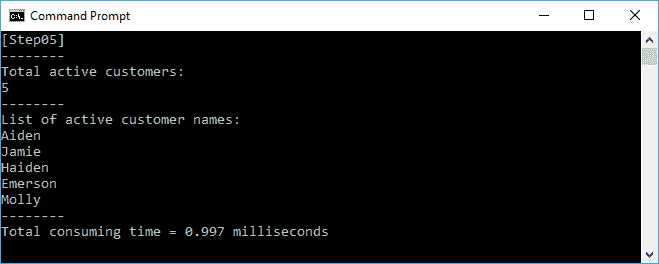
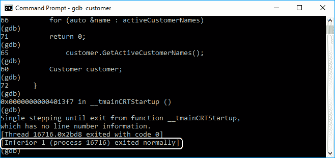
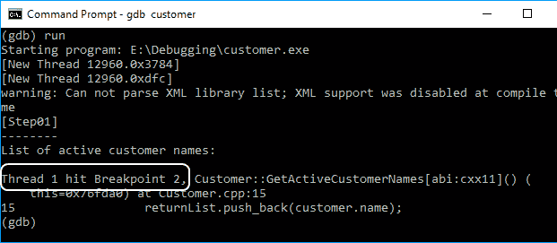
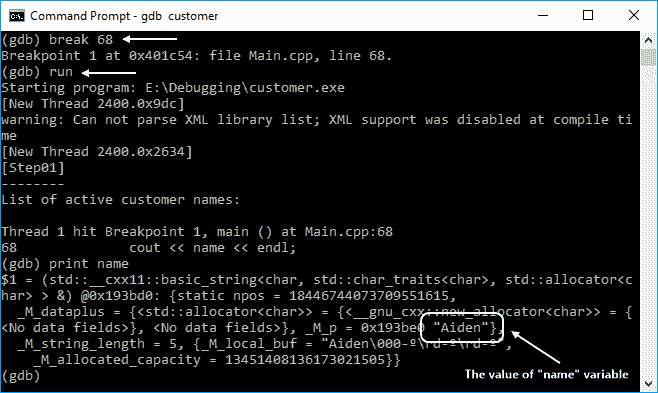

# 用函数方法创建和调试应用程序

在前几章中，我们讨论了开发函数式编程的一些基本技术，包括一个一级函数、一个纯函数和一个不可变对象。在本章中，我们将使用在前面章节中学习的所有技术，以功能性的方式生成应用程序。它还将解释如何调试使用 C++语言构建的应用程序。

在本章中，我们将涵盖以下主题:

*   准备一个命令代码作为要转换成功能代码的基础代码
*   对基础代码实现纯函数
*   将模板元编程实现到基础代码
*   使用 Lambda 表达式对基础代码实现过滤技术
*   对基础代码实现递归技术
*   对基础代码实现记忆技术
*   调试代码来解决，如果我们得到一个意想不到的结果

# 准备命令式课程

我们现在将开发函数类，这样我们就可以将它消费到我们的函数程序中。在此之前，让我们准备一个新的命令类`Customer`。该类将有一个名为`id`的`int`属性作为唯一的客户标识号。它还有四个字符串属性来存储我们客户的信息- `name`、`address`、`phoneNumber`和`email`。该类还有一个标志- `isActive` -指示我们的客户是否活跃。如果客户与我们签订了合同，他们就被视为活跃客户。另一个属性是`registeredCustomers`，保存我们所有的注册客户，不考虑活跃客户。我们将使`registeredCustomers`成员成为`static`，这样我们就可以从类外填充它，并且可以保留`Customer`类的列表。

除了这些属性，我们的类还将有四个方法来访问我们的属性列表。它们将是以下方法:

*   `GetActiveCustomerNames()`:可以用来获取活跃客户名称列表
*   `GetActiveCustomerAddresses()`:可以用来获取活动客户地址列表
*   `GetActiveCustomerPhoneNumbers()`:可以用来获取活跃客户电话号码列表
*   `GetActiveCustomerEmails()`:可以用来获取活跃客户邮件列表

现在，让我们看看下面的`Customer.h`代码，我们可以在`Step01`文件夹中找到它来适应我们前面的场景:

```cpp
    /* Customer.h - Step01 */
    #ifndef __CUSTOMER_H__
    #define __CUSTOMER_H__

    #include <string>
    #include <vector>

    class Customer
    {
      public:
        static std::vector<Customer> registeredCustomers;
        int id = 0;
        std::string name;
        std::string address;
        std::string phoneNumber;
        std::string email;
        bool isActive = true;

        std::vector<std::string> GetActiveCustomerNames();
        std::vector<std::string> GetActiveCustomerAddresses();
        std::vector<std::string> GetActiveCustomerPhoneNumbers();
        std::vector<std::string> GetActiveCustomerEmails();
    };
    #endif // __CUSTOMER_H__

```

从前面的代码中，我们有四个尚未定义的公共方法。现在，让我们定义它们，如我们在下面的`Customer.cpp`代码中所见:

```cpp
    /* Customer.cpp - Step01 */
    #include "Customer.h"

    using namespace std;

    vector<Customer> Customer::registeredCustomers;

    vector<string> Customer::GetActiveCustomerNames()
    {
      vector<string> returnList;
      for (auto &customer : Customer::registeredCustomers)
      {
        if (customer.isActive)
        {
            returnList.push_back(customer.name);
        }
      }
       return returnList;
    }

    vector<string> Customer::GetActiveCustomerAddresses()
    {
      vector<string> returnList;
      for (auto &customer : Customer::registeredCustomers)
      {
        if (customer.isActive)
        {
            returnList.push_back(customer.address);
        }
      }
      return returnList;
    }

    vector<string> Customer::GetActiveCustomerPhoneNumbers()
    {
      vector<string> returnList;
      for (auto &customer : Customer::registeredCustomers)
      {
        if (customer.isActive)
        {
            returnList.push_back(customer.phoneNumber);
        }
      }
      return returnList;
    }

    vector<string> Customer::GetActiveCustomerEmails()
    {
      vector<string> returnList;
      for (auto &customer : Customer::registeredCustomers)
      {
        if (customer.isActive)
        {
            returnList.push_back(customer.email);
        }
      }
      return returnList;
    } 

```

从前面的代码中，我们可以看到`Customer`类中四个方法的定义。例如，在`GetActiveCustomerNames()`方法中，代码循环`registeredCustomers`向量中的每个元素来找出活跃的客户。如果找到他们，代码将提取每个客户的名字并存储到`returnList`向量中。完成方法过程后，方法会将`returnList`结果反馈给方法用户。

现在，让我们使用下面的`main.cpp`代码来使用前面的类:

```cpp
    /* Main.cpp - Step01 */
    #include <iostream>
    #include <algorithm>
    #include "Customer.h"

    using namespace std;

    void RegisterCustomers()
    {
      int i = 0;
      bool b = false;

      // Initialize name
      vector<string> nameList =
      {
        "William",
        "Aiden",
        "Rowan",
        "Jamie",
        "Quinn",
        "Haiden",
        "Logan",
        "Emerson",
        "Sherlyn",
        "Molly"
       };

       // Clear the registeredCustomers vector array
       Customer::registeredCustomers.clear();

       for (auto name : nameList)
       {
         // Create Customer object
         // and fill all properties
         Customer c;
         c.id = i++;
         c.name = name;
         c.address = "somewhere";
         c.phoneNumber = "0123";
         c.email = name + "@xyz.com";
         c.isActive = b;

         // Flip the b value
         b = !b;

         // Send data to the registeredCustomers
         Customer::registeredCustomers.push_back(c);
      }
    }

    auto main() -> int
    {
      cout << "[Step01]" << endl;
      cout << "--------" << endl;

      // Fill the Customer::registeredCustomers
      // with the content
      RegisterCustomers();

      // Instance Customer object
      Customer customer;

      // Get the active customer names
      cout << "List of active customer names:" << endl;
      vector<string> activeCustomerNames =
        customer.GetActiveCustomerNames();
      for (auto &name : activeCustomerNames)
      {
        cout << name << endl;
      }

      return 0;
    }

```

从前面的代码中，在`main()`方法中，我们可以看到我们首先从`RegisterCustomers()`方法注册我们的客户。在那里，我们用一堆客户信息填充`Customer`类`registeredCustomers`的静态公共属性。之后，代码实例化`Customer`类，并调用名为`GetActiveCustomerNames()`的类的方法。如我们所见，该方法返回一个字符串向量，该向量包含我们将存储在`activeCustomerNames`向量中的活动客户名称列表。现在，我们可以迭代向量来提取活动客户名称的列表。下面是我们应该在控制台中看到的输出:


我们可以在`RegisterCustomer()`方法中看到，十个客户中只有五个是活跃的，所以在前面的输出中不会列出所有的名字。我们可以尝试其余三种方法来获取活跃客户的信息，具体来说，他们的地址、电话号码和电子邮件地址。我们在本章中的目标是使用我们在前面章节中学习的概念，并使用功能方法制作一个应用程序。那么，让我们看看如何实现这一点。

# 重构命令类成为一个函数类

的确，前面的`Customer`类可以很好地工作，我们已经成功地调用了它的方法。然而，这个类仍然可以通过转换成一个函数类来调整。正如我们在前面的代码中看到的，我们可以实现一个纯函数、一级函数、高阶函数，并对其进行记忆，使其成为函数。因此，在本节中，我们将重构`Customer`类，使其成为一个功能类，并使用我们从前面章节中获得的知识。在接下来的部分中，我们将实现我们在上一章中讨论过的函数方法，这是一级函数。

# 将函数作为参数传递

正如我们在[第 2 章](2.html)、*在函数编程*中讨论的，我们可以将函数重写为一级函数，这意味着我们可以将一个函数传递给另一个函数。我们将简化我们在`Step01`代码中所有四个方法的定义，然后我们将通过将其传递给另一个名为`GetActiveCustomerByFunctionField()`的方法来调用该函数。我们还将创建一个名为`GetActiveCustomerByField()`的新方法来选择我们应该运行的正确方法。`Customer`类的定义现在类似于下面的`Customer.h`代码:

```cpp
    /* Customer.h - Step02 */
    #ifndef __CUSTOMER_H__
    #define __CUSTOMER_H__

    #include <string>
    #include <vector>
    #include <functional>

    class Customer
    {
      private:
        std::string GetActiveCustomerNames(
          Customer customer) const;
        std::string GetActiveCustomerAddresses(
          Customer customer) const;
        std::string GetActiveCustomerPhoneNumbers(
          Customer customer) const;
        std::string GetActiveCustomerEmails(
          Customer customer) const;

      public:
        static std::vector<Customer> registeredCustomers;
        int id = 0;
        std::string name;
        std::string address;
        std::string phoneNumber;
        std::string email;
        bool isActive = true;

 std::vector<std::string> GetActiveCustomerByField(
 const std::string &field);

 std::vector<std::string> GetActiveCustomerByFunctionField(
 std::function<std::string(const Customer&, Customer)> 
 funcField);
     };
     #endif //#ifndef __CUSTOMER_H__

```

正如我们在前面的头文件中看到的，除了四个私有方法之外，我们还添加了一个名为`GetActiveCustomerByFunctionField()`的新公共方法，当我们需要其中一个属性的列表时，我们将调用该方法。现在，让我们定义在前面的头文件中创建的四种方法。代码应如下`Customer.cpp`文件:

```cpp
    /* Customer.cpp - Step02 */
    #include <stdexcept>
    #include "Customer.h"

    using namespace std;

    vector<Customer> Customer::registeredCustomers;

    string Customer::GetActiveCustomerNames(
      Customer customer) const
      {
        return customer.name;
      }

    string Customer::GetActiveCustomerAddresses(
      Customer customer) const
      {
        return customer.address;
      }

    string Customer::GetActiveCustomerPhoneNumbers(
      Customer customer) const
      {
        return customer.phoneNumber;
      }

    string Customer::GetActiveCustomerEmails(
      Customer customer) const
      {
 return customer.email;
      }

 vector<string> Customer::GetActiveCustomerByFunctionField(
 function<string(const Customer&, Customer)> funcField)
 {
 vector<string> returnList;

 Customer c;

 for (auto customer : Customer::registeredCustomers)
 {
 if (customer.isActive)
 {
 returnList.push_back(
 funcField(c, customer));
 }
 }
 return returnList;
 }

 vector<string> Customer::GetActiveCustomerByField(
 const string &field)
 {
 function<string(const Customer&, Customer)> funct;

 if (field == "name")
 {
 funct = &Customer::GetActiveCustomerNames;
 }
 else if (field == "address")
 {
 funct = &Customer::GetActiveCustomerAddresses;
 }
 else if (field == "phoneNumber")
 {
 funct = &Customer::GetActiveCustomerPhoneNumbers;
 }
 else if (field == "email")
 {
 funct = &Customer::GetActiveCustomerEmails;
 }
 else
 {
 throw invalid_argument("Unknown field");
 }

 return GetActiveCustomerByFunctionField(funct);
 }

```

与`Step01`代码相比，`GetActiveCustomerNames()`、`GetActiveCustomerAddresses()`、`GetActiveCustomerPhoneNumbers()`、`GetActiveCustomerEmails()`方法的实现现在更加简洁。它们只包含一行代码。然而，我们需要一种新的方法来适应这个过程，以获得类的私有属性列表，这就是`GetActiveCustomerByField()`方法。方法被传递给函数，使其成为一级函数，正如我们在前面的代码中看到的那样。在这个`Step02`文件夹中，`main.cpp`代码应该如下:

```cpp
    /* Main.cpp - Step02 */
    #include <iostream>
    #include "Customer.h"

    using namespace std;

    void RegisterCustomers()
    {
      int i = 0;
      bool b = false;

      // Initialize name
      vector<string> nameList =
      {
        "William",
        "Aiden",
        "Rowan",
        "Jamie",
        "Quinn",
        "Haiden",
        "Logan",
        "Emerson",
        "Sherlyn",
        "Molly"
       };

      // Clear the registeredCustomers vector array
      Customer::registeredCustomers.clear();
      for (auto name : nameList)
      {
        // Create Customer object
        // and fill all properties
        Customer c;
        c.id = i++;
        c.name = name;
        c.address = "somewhere";
        c.phoneNumber = "0123";
        c.email = name + "@xyz.com";
        c.isActive = b;

        // Flip the b value
        b = !b;

        // Send data to the registeredCustomers
        Customer::registeredCustomers.push_back(c);
       }
    }

    auto main() -> int
    {
      cout << "[Step02]" << endl;
      cout << "--------" << endl;

      // Fill the Customer::registeredCustomers
      // with the content
      RegisterCustomers();

      // Instance Customer object
      Customer customer;

      // Get the active customer names
      cout << "List of active customer names:" << endl;
      vector<string> activeCustomerNames =
 customer.GetActiveCustomerByField("name");
      for (auto &name : activeCustomerNames)
      {
        cout << name << endl;
      }

      return 0;
    }

```

正如我们在前面的`main.cpp`代码中所看到的，我们现在将调用`GetActiveCustomerByField()`方法而不是`GetActiveCustomerNames()`，就像我们在`Step01`中所做的那样。我们只需要将字符串数据类型中的字段名传递给`GetActiveCustomerNames()`方法，它将调用适当的方法来检索属性值。例如，我们将检索`name`属性值，因为我们在`GetActiveCustomerByField()`方法中通过了`name`。而且，如果我们运行前面的`Step02`代码，应该会看到下面的截图，和我们在`Step01`代码中看到的完全一样:


虽然我们已经让代码正常运行，但是如果我们想要向类中添加更多的字段或属性，然后需要收集新字段的列表，我们将会面临一个问题。通过使用前面的代码，我们必须在`GetActiveCustomerByFunctionField()`方法中添加一个新的`else`部分。接下来，我们会找到应对的办法。

# 添加基类

如果我们想在类中添加更多的字段，并想在每次添加新字段时轻松访问它的列表，我们必须创建一个从包含虚拟函数的基类派生的新类。通过这样做，我们可以派生基类虚拟方法，并为其实现正确的代码。我们还将在这里获得模板元编程的能力，因为我们将把基类设计为模板。基类的声明如下:

```cpp
    template<typename T, typename U>
    class BaseClass
    {
      public:
        virtual U InvokeFunction(
          const std::shared_ptr<T>&) = 0;
    };

```

现在，我们可以为类中的四个方法声明从基类派生的四个新类。类的声明应该如下:

```cpp
    class CustomerName :
      public BaseClass<Customer, std::string>
      {
        public:
          virtual std::string InvokeFunction(
            const std::shared_ptr<Customer> &customer)
          {
             return customer->name;
          }
      };

    class CustomerAddress :
      public BaseClass<Customer, std::string>
      {
        public:
          virtual std::string InvokeFunction(
            const std::shared_ptr<Customer> &customer)
            {
              return customer->address;
            }
      };

    class CustomerPhoneNumber :
      public BaseClass<Customer, std::string>
      {
         public:
           virtual std::string InvokeFunction(
             const std::shared_ptr<Customer> &customer)
             {
               return customer->phoneNumber;
             }
      };

    class CustomerEmail :
      public BaseClass<Customer, std::string>
      {
        public:
          virtual std::string InvokeFunction(
            const std::shared_ptr<Customer> &customer)
            {
              return customer->email;
            }
    };

```

我们还需要修改`GetActiveCustomerByFunctionField()`方法的参数类型，所以方法的签名应该如下:

```cpp
    template<typename T>
    static std::vector<T> GetActiveCustomerByFunctionField(
      const std::shared_ptr<BaseClass<Customer, T>>
        &classField);

```

此外，实现上述代码的这个`Step03`代码的完整头文件应该如下:

```cpp
    /* Customer.h - Step03 */
    #ifndef __CUSTOMER_H__
    #define __CUSTOMER_H__

    #include <string>
    #include <vector>
    #include <memory>

    class Customer
    {
      private:
        template<typename T, typename U>
        class BaseClass
        {
          public:
            virtual U InvokeFunction(
            const std::shared_ptr<T>&) = 0;
         };

        class CustomerName :
          public BaseClass<Customer, std::string>
          {
            public:
              virtual std::string InvokeFunction(
                const std::shared_ptr<Customer> &customer)
                {
                  return customer->name;
                }
          };

        class CustomerAddress :
          public BaseClass<Customer, std::string>
          {
            public:
              virtual std::string InvokeFunction(
                const std::shared_ptr<Customer> &customer)
                {
                  return customer->address;
                }
          };

        class CustomerPhoneNumber :
          public BaseClass<Customer, std::string>
          {
            public:
            virtual std::string InvokeFunction(
              const std::shared_ptr<Customer> &customer)
              {
                return customer->phoneNumber;
               }
          };

        class CustomerEmail :
          public BaseClass<Customer, std::string>
          {
            public:
              virtual std::string InvokeFunction(
                const std::shared_ptr<Customer> &customer)
                {
                  return customer->email;
                }
           };

         public:
           static std::vector<Customer> registeredCustomers;
           int id = 0;
           std::string name;
           std::string address;
           std::string phoneNumber;
           std::string email;
           bool isActive = true;

           static std::vector<std::string> GetActiveCustomerNames();
           static std::vector<std::string> 
             GetActiveCustomerAddresses();
           static std::vector<std::string> 
             GetActiveCustomerPhoneNumbers();
           static std::vector<std::string> GetActiveCustomerEmails();

           template<typename T>
           static std::vector<T> GetActiveCustomerByFunctionField(
             const std::shared_ptr<BaseClass<Customer, T>>
             &classField);
      };
     #endif // __CUSTOMER_H__

```

现在，前面每个类中的每个方法都有不同的任务，并且可以通过类的名称来识别。我们还将修改`GetActiveCustomerByFunctionField()`方法实现，因为它现在传递了一个新的参数类型，即类名。通过传递一个类，现在更容易传递我们期望的位于类方法中的任务。`GetActiveCustomerByFunctionField()`方法的实施应如下:

```cpp
    template<typename T>
    vector<T> Customer::GetActiveCustomerByFunctionField(
      const shared_ptr<BaseClass<Customer, T>> &classField)
      {
        vector<T> returnList;
        for (auto customer : Customer::registeredCustomers)
        {
          if (customer.isActive)
           {
            returnList.push_back(
              classField->InvokeFunction(
                make_shared<Customer>(customer)));
           }
         }
         return returnList;
       }

```

我们可以看到，前面的方法可以运行我们已经通过的类的方法，也就是`classField`。此外，由于我们拥有的类是从`BaseClass`类派生的，我们可以通知方法接收输入的参数`BaseClass`。

现在我们可以实现头文件中已经声明的公共方法——方法`GetActiveCustomerNames()`、`GetActiveCustomerAddresses()`、`GetActiveCustomerPhoneNumbers()`和`GetActiveCustomerEmails()`。这四个方法将调用`GetActiveCustomerByFunctionField()`方法并传递`InvokeFunction()`方法的定义。代码应如下所示:

```cpp
    vector<string> Customer::GetActiveCustomerNames()
    {
      return Customer::GetActiveCustomerByFunctionField<string>(
        make_shared<CustomerName>());
    }

    vector<string> Customer::GetActiveCustomerAddresses()
    {
      return Customer::GetActiveCustomerByFunctionField<string>(
        make_shared<CustomerAddress>());
    }

    vector<string> Customer::GetActiveCustomerPhoneNumbers()
    {
      return Customer::GetActiveCustomerByFunctionField<string>(
        make_shared<CustomerPhoneNumber>());
    }

    vector<string> Customer::GetActiveCustomerEmails()
    {
      return Customer::GetActiveCustomerByFunctionField<string>(
        make_shared<CustomerEmail>());
    }

```

然后，我们将有一个完整的`Customer.cpp`文件如下:

```cpp
    /* Customer.cpp - Step03 */
    #include "Customer.h"

    using namespace std;

    vector<Customer> Customer::registeredCustomers;

    vector<string> Customer::GetActiveCustomerNames()
    {
      return Customer::GetActiveCustomerByFunctionField<string>(
        make_shared<CustomerName>());
    }

    vector<string> Customer::GetActiveCustomerAddresses()
    {
      return Customer::GetActiveCustomerByFunctionField<string>(
        make_shared<CustomerAddress>());
    }

    vector<string> Customer::GetActiveCustomerPhoneNumbers()
    {
      return Customer::GetActiveCustomerByFunctionField<string>(
        make_shared<CustomerPhoneNumber>());
    }

    vector<string> Customer::GetActiveCustomerEmails()
    {
      return Customer::GetActiveCustomerByFunctionField<string>(
        make_shared<CustomerEmail>());
    }

    template<typename T>
    vector<T> Customer::GetActiveCustomerByFunctionField(
    const shared_ptr<BaseClass<Customer, T>> &classField)
    {
      vector<T> returnList;
      for (auto &customer : Customer::registeredCustomers)
      {
        if (customer.isActive)
        {
          returnList.push_back(
            classField->InvokeFunction(
              make_shared<Customer>(customer)));
         }
       }
       return returnList;
    }

```

通过在这个`Step03`文件夹中拥有`Customer.h`和`Customer.cpp`代码，我们现在更容易获取我们在`Customer`类中拥有的属性列表。例如，如果我们想要检索活跃客户的列表，我们可以直接调用`GetActiveCustomerNames()`方法，如下面的`main.cpp`代码所示:

```cpp
    /* Main.cpp - Step03 */
    #include <iostream>
    #include "Customer.h"

    using namespace std;

    void RegisterCustomers()
    {
      int i = 0;
      bool b = false;

      // Initialize name
      vector<string> nameList =
      {
        "William",
        "Aiden",
        "Rowan",
        "Jamie",
        "Quinn",
        "Haiden",
        "Logan",
        "Emerson",
        "Sherlyn",
        "Molly"
      };

      // Clear the registeredCustomers vector array
      Customer::registeredCustomers.clear();

      for (auto name : nameList)
      {
        // Create Customer object
        // and fill all properties
        Customer c;
        c.id = i++;
        c.name = name;
        c.address = "somewhere";
        c.phoneNumber = "0123";
        c.email = name + "@xyz.com";
        c.isActive = b;

        // Flip the b value
        b = !b;

        // Send data to the registeredCustomers
        Customer::registeredCustomers.push_back(c);
      }
    }

    auto main() -> int
    {
      cout << "[Step03]" << endl;
      cout << "--------" << endl;

      // Fill the Customer::registeredCustomers
      // with the content
      RegisterCustomers();

      // Instance Customer object
      Customer customer;

      // Get the active customer names
      cout << "List of active customer names:" << endl;
 vector<string> activeCustomerNames =
 customer.GetActiveCustomerNames();
      for (auto &name : activeCustomerNames)
      {
        cout << name << endl;
      }

       return 0;
    }

```

现在，让我们运行`Step03`文件夹中的程序。我们应该会在控制台上看到下面的截图:


同样，与上一步相比，我们得到了完全相同的输出。我们将在下一节让`Customer`类变得纯粹。所以，继续走！

# 把班级变得纯粹

正如我们在[第 2 章](2.html)、*在函数式编程中操纵函数*中所讨论的，我们必须在函数式编程中创建一个纯函数来避免副作用。如果我们回到前面的`GetActiveCustomerByFunctionField()`方法定义，它迭代一个`registeredCustomers`静态成员，它是一个全局变量。这将是一个问题，因为`GetActiveCustomerByFunctionField()`方法将提供不同的输出，尽管作为参数传递的是完全相同的输出。

为了解决这个问题，我们必须废除这个全局变量。然后，我们必须修改方法定义如下:

```cpp
    template<typename T>
    vector<T> Customer::GetActiveCustomerByFunctionField(
      vector<Customer> customers,
      const shared_ptr<BaseClass<Customer, T>>
        &classField)
        {
          vector<T> returnList;
          for (auto &customer : customers)
          {
            if (customer.isActive)
            {
              returnList.push_back(
                classField->InvokeFunction(
                make_shared<Customer>(customer)));
            }
          }
          return returnList;
        }

```

既然我们已经没有`registeredCustomers`属性了，我们还必须通过`GetActiveCustomerByFunctionField()`方法传递一个注册客户列表。然后，该方法将迭代我们传递的客户列表，以找到活动客户。此外，因为我们已经修改了方法签名，我们还必须修改`Customer.h`文件中的方法声明，如下所示:

```cpp
    template<typename T>
    static std::vector<T> GetActiveCustomerByFunctionField(
      std::vector<Customer> customers,
      const std::shared_ptr<BaseClass<Customer, T>>
        &classField);

```

我们讨论了`Customer`类中的其他方法调用`GetActiveCustomerByFunctionField()`方法。因此，我们还必须修改方法实现，如下面的代码片段所示:

```cpp
    vector<string> Customer::GetActiveCustomerNames(
      vector<Customer> customers)
      {
        return Customer::GetActiveCustomerByFunctionField<string>(
        customers,
        make_shared<CustomerName>());
      }

    vector<string> Customer::GetActiveCustomerAddresses(
      vector<Customer> customer)
      {
        return Customer::GetActiveCustomerByFunctionField<string>(
        customer,
        make_shared<CustomerAddress>());
      }

    vector<string> Customer::GetActiveCustomerPhoneNumbers(
      vector<Customer> customer)
      {
        return Customer::GetActiveCustomerByFunctionField<string>(
        customer,
        make_shared<CustomerPhoneNumber>());
      }

   vector<string> Customer::GetActiveCustomerEmails(
     vector<Customer> customer)
     {
        return Customer::GetActiveCustomerByFunctionField<string>(
        customer,
        make_shared<CustomerEmail>());
     }

```

我们还需要修改`Customer.h`文件中的方法声明，如下面的代码片段所示:

```cpp
    static std::vector<std::string> GetActiveCustomerNames(
      std::vector<Customer> customer);
    static std::vector<std::string> GetActiveCustomerAddresses(
      std::vector<Customer> customer);
    static std::vector<std::string> GetActiveCustomerPhoneNumbers(
      std::vector<Customer> customer);
    static std::vector<std::string> GetActiveCustomerEmails(
      std::vector<Customer> customer);

```

现在，`Customer.h`文件将包含以下完整的代码块:

```cpp
    /* Customer.h - Step04 */
    #ifndef __CUSTOMER_H__
    #define __CUSTOMER_H__

    #include <string>
    #include <vector>
    #include <memory>

    class Customer
    {
      private:
        template<typename T, typename U>
        class BaseClass
        {
          public:
            virtual U InvokeFunction(
            const std::shared_ptr<T>&) = 0;
        };

        class CustomerName :
          public BaseClass<Customer, std::string>
          {
            public:
              virtual std::string InvokeFunction(
                const std::shared_ptr<Customer> &customer)
                {
                  return customer->name;
                }
          };

       class CustomerAddress :
         public BaseClass<Customer, std::string>
         {
           public:
             virtual std::string InvokeFunction(
               const std::shared_ptr<Customer> &customer)
              {
            return customer->address;
          }
    };

      class CustomerPhoneNumber :
        public BaseClass<Customer, std::string>
        {
          public:
            virtual std::string InvokeFunction(
              const std::shared_ptr<Customer> &customer)
              {
                return customer->phoneNumber;
              }
       };

     class CustomerEmail :
        public BaseClass<Customer, std::string>
        {
          public:
            virtual std::string InvokeFunction(
            const std::shared_ptr<Customer> &customer)
            {
              return customer->email;
            }
        };

      public:
        int id = 0;
        std::string name;
        std::string address;
        std::string phoneNumber;
        std::string email;
        bool isActive = true;

        static std::vector<std::string> GetActiveCustomerNames(
          std::vector<Customer> customer);
       static std::vector<std::string> GetActiveCustomerAddresses(
          std::vector<Customer> customer);
       static std::vector<std::string> GetActiveCustomerPhoneNumbers(
          std::vector<Customer> customer);
       static std::vector<std::string> GetActiveCustomerEmails(
          std::vector<Customer> customer);

       template<typename T>
       static std::vector<T> GetActiveCustomerByFunctionField(
        std::vector<Customer> customers,
        const std::shared_ptr<BaseClass<Customer, T>>
          &classField);
    };
    #endif // __CUSTOMER_H__

```

并且，`Customer.cpp`文件将如下所示:

```cpp
    /* Customer.cpp - Step04 */
    #include "Customer.h"

    using namespace std;

    vector<string> Customer::GetActiveCustomerNames(
      vector<Customer> customers)
      {
        return Customer::GetActiveCustomerByFunctionField<string>(
        customers,
        make_shared<CustomerName>());
      }

    vector<string> Customer::GetActiveCustomerAddresses(
      vector<Customer> customer)
      {
        return Customer::GetActiveCustomerByFunctionField<string>(
          customer,
        make_shared<CustomerAddress>());
       }

    vector<string> Customer::GetActiveCustomerPhoneNumbers(
      vector<Customer> customer)
      {
        return Customer::GetActiveCustomerByFunctionField<string>(
         customer,
        make_shared<CustomerPhoneNumber>());
      }

    vector<string> Customer::GetActiveCustomerEmails(
      vector<Customer> customer)
      {
        return Customer::GetActiveCustomerByFunctionField<string>(
        customer,
        make_shared<CustomerEmail>());
       }

    template<typename T>
    vector<T> Customer::GetActiveCustomerByFunctionField(
      vector<Customer> customers,
      const shared_ptr<BaseClass<Customer, T>>
        &classField)
        {
          vector<T> returnList;
          for (auto &customer : customers)
          {
            if (customer.isActive)
            {
              returnList.push_back(
                classField->InvokeFunction(
                make_shared<Customer>(customer)));
             }
           }
           return returnList;
         }

```

由于`Customer`类已经更改，不再有`registeredCustomer`变量，我们还需要修改`main.cpp`文件中的`RegisterCustomers()`方法。该方法的早期版本不返回任何内容。现在，我们将使代码返回客户列表。我们还需要修改`main()`方法，因为我们必须使用`Main.cpp`文件中的新`RegisterCustomers()`方法。该文件将包含以下代码块:

```cpp
    /* Main.cpp - Step04 */
    #include <iostream>
    #include "Customer.h"

    using namespace std;

 vector<Customer> RegisterCustomers()
    {
      int i = 0;
      bool b = false;

      vector<Customer> returnValue;

      // Initialize name
      vector<string> nameList =
      {
        "William",
        "Aiden",
        "Rowan",
        "Jamie",
        "Quinn",
        "Haiden",
        "Logan",
        "Emerson",
        "Sherlyn",
        "Molly"
       };

      for (auto name : nameList)
      {
        // Create Customer object
        // and fill all properties
        Customer c;
        c.id = i++;
        c.name = name;
        c.address = "somewhere";
        c.phoneNumber = "0123";
        c.email = name + "@xyz.com";
        c.isActive = b;
        // Flip the b value
        b = !b;
        // Send data to the registeredCustomers
        returnValue.push_back(c);
      }

      return returnValue;
    }

    auto main() -> int
    {
      cout << "[Step04]" << endl;
      cout << "--------" << endl;

      // Instance Customer object
      Customer customer;

      // Get the active customer names
      cout << "List of active customer names:" << endl;
      vector<string> activeCustomerNames =
        customer.GetActiveCustomerNames(
            RegisterCustomers());
      for (auto name : activeCustomerNames)
      {
        cout << name << endl;
       }

       return 0;
    }

```

正如我们在前面的`main()`方法中看到的，我们调用`GetActiveCustomerNames()`方法并传递`RegisterCustomers()`方法的结果。现在，让我们通过在`Step06`文件夹中运行程序来尝试代码。运行程序时，我们应该在控制台上获得以下输出:


同样，我们得到了与上一步完全相同的输出，但是采用了函数式编程的新方法。接下来，我们将重构代码，使用 Lambda 表达式来简化过滤任务。

# 过滤条件并实现一个 Lambda 表达式

我们来关注一下`GetActiveCustomerByFunctionField()`法。在那里，我们可以找到一个`if`结构来过滤活跃的客户。正如我们在前面章节中所讨论的，我们可以使用`copy_if()`方法来过滤条件。下面的代码片段实现了`copy_if()`方法来过滤活跃客户:

```cpp
    template<typename T>
    vector<T> Customer::GetActiveCustomerByFunctionField(
      vector<Customer> customers,
      const shared_ptr<BaseClass<Customer, T>>
        &classField)
        {
 vector<Customer> activeCustomers;
          vector<T> returnList;

 copy_if(
 customers.begin(),
 customers.end(),
 back_inserter(activeCustomers),
 [](Customer customer)
 {
 if (customer.isActive)
 return true;
 else
 return false;
 });

            for (auto &customer : customers)
             {
                if (customer.isActive)
                {
                  returnList.push_back(
                  classField->InvokeFunction(
                  make_shared<Customer>(customer)));
                 }
             }

          return returnList;
      }

```

正如我们在前面的代码片段中看到的，我们创建了一个匿名方法，如果我们传递的客户实例是活动的，该方法返回 true。此外，我们可以重构前面的`GetActiveCustomerByFunctionField()`方法，这样它将再次使用匿名方法，正如我们在下面的代码片段中看到的:

```cpp
    template<typename T>
    vector<T> Customer::GetActiveCustomerByFunctionField(
      vector<Customer> customers,
      const shared_ptr<BaseClass<Customer, T>> 
        &classField)
        {
          vector<Customer> activeCustomers;
          vector<T> returnList;

          copy_if(
            customers.begin(),
            customers.end(),
            back_inserter(activeCustomers),
            [](Customer customer)
            {
              if (customer.isActive)
                return true;
              else
                return false;
             });

 for_each(
 activeCustomers.begin(),
 activeCustomers.end(),
 [&returnList, &classField](Customer customer)
 {
 returnList.push_back(
 classField->InvokeFunction(
 make_shared<Customer>(customer))
 );
 });

         return returnList;
    }

```

除了使用 Lambda 表达式实现过滤技术之外，我们还将向名为`CountActiveCustomers()`的`Customer`类添加一个方法。该方法将计算活跃客户。该方法的定义如下:

```cpp
    int Customer::CountActiveCustomers(
      vector<Customer> customer)
      {
        int add = 0;

        for (auto cust : customer)
        {
          // Adding 1 if the customer is active
          if(cust.isActive)
            ++add;
        }

        return add;
    }

```

现在，我们将在这个`Step05`代码块中有如下的`Customer.cpp`代码:

```cpp
    /* Customer.cpp - Step05 */
    #include <algorithm>
    #include "Customer.h"

    using namespace std;

    vector<string> Customer::GetActiveCustomerNames(
      vector<Customer> customers)
      {
        return Customer::GetActiveCustomerByFunctionField<string>(
        customers,
        make_shared<CustomerName>());
      }

    vector<string> Customer::GetActiveCustomerAddresses(
      vector<Customer> customer)
      {
        return Customer::GetActiveCustomerByFunctionField<string>(
          customer,
        make_shared<CustomerAddress>());
      }

    vector<string> Customer::GetActiveCustomerPhoneNumbers(
      vector<Customer> customer)
      {
        return Customer::GetActiveCustomerByFunctionField<string>(
          customer,
        make_shared<CustomerPhoneNumber>());
      }

    vector<string> Customer::GetActiveCustomerEmails(
      vector<Customer> customer)
      {
        return Customer::GetActiveCustomerByFunctionField<string>(
        customer,
        make_shared<CustomerEmail>());
      }

 int Customer::CountActiveCustomers(
 vector<Customer> customer)
 {
 int add = 0;

 for (auto cust : customer)
 {
 // Adding 1 if the customer is active
 if(cust.isActive)
 ++add;
 }

 return add;
 }

    template<typename T>
    vector<T> Customer::GetActiveCustomerByFunctionField(
 vector<Customer> customers,
      const shared_ptr<BaseClass<Customer, T>>
        &classField)
        {
 vector<Customer> activeCustomers;
          vector<T> returnList;

 copy_if(
 customers.begin(),
 customers.end(),
 back_inserter(activeCustomers),
 [](Customer customer)
 {
 if (customer.isActive)
 return true;
 else
 return false;
 });

 for_each(
 activeCustomers.begin(),
 activeCustomers.end(),
 [&returnList, &classField](Customer customer)
 {
 returnList.push_back(
 classField->InvokeFunction(
 make_shared<Customer>(customer))
 );
 });

 return returnList;
     }

```

不要忘记修改`Customer.h`文件，因为我们已经给类添加了一个新方法。该文件应包含以下代码:

```cpp
    /* Customer.h - Step05 */
    #ifndef __CUSTOMER_H__
    #define __CUSTOMER_H__

    #include <string>
    #include <vector>
    #include <memory>

    class Customer
    {
      private:
        template<typename T, typename U>
        class BaseClass
        {
          public:
            virtual U InvokeFunction(
            const std::shared_ptr<T>&) = 0;
        };

        class CustomerName :
          public BaseClass<Customer, std::string>
          {
            public:
              virtual std::string InvokeFunction(
                const std::shared_ptr<Customer> &customer)
                {
                  return customer->name;
                 }
          };

        class CustomerAddress :
          public BaseClass<Customer, std::string>
          {
             public:
               virtual std::string InvokeFunction(
                 const std::shared_ptr<Customer> &customer)
                 {
                   return customer->address;
                 }
          };

        class CustomerPhoneNumber :
          public BaseClass<Customer, std::string>
          {
            public:
              virtual std::string InvokeFunction(
                const std::shared_ptr<Customer> &customer)
                {
                 return customer->phoneNumber;
                }
           };

    class CustomerEmail :
        public BaseClass<Customer, std::string>
    {
    public:
        virtual std::string InvokeFunction(
            const std::shared_ptr<Customer> &customer)
        {
            return customer->email;
        }
    };

    public:
      int id = 0;
      std::string name;
      std::string address;
      std::string phoneNumber;
      std::string email;
      bool isActive = true;

      static std::vector<std::string> GetActiveCustomerNames(
        std::vector<Customer> customer);
      static std::vector<std::string> GetActiveCustomerAddresses(
        std::vector<Customer> customer);
      static std::vector<std::string> GetActiveCustomerPhoneNumbers(
        std::vector<Customer> customer);
      static std::vector<std::string> GetActiveCustomerEmails(
        std::vector<Customer> customer);

 static int CountActiveCustomers(
 std::vector<Customer> customer);

      template<typename T>
      static std::vector<T> GetActiveCustomerByFunctionField(
        std::vector<Customer> customers,
        const std::shared_ptr<BaseClass<Customer, T>>
            &classField);
    };
    #endif // __CUSTOMER_H__

```

现在，我们将在我们的`main()`函数中调用`CountActiveCustomers()`方法。我们将通过检查以下`Main.cpp`代码块来了解如何做到这一点:

```cpp
    /* Main.cpp - Step05 */
    #include <iostream>
    #include <chrono>
    #include "Customer.h"

    using namespace std;

    vector<Customer> RegisterCustomers()
    {
      int i = 0;
      bool b = false;

      vector<Customer> returnValue;

      // Initialize name
      vector<string> nameList =
      {
        "William",
        "Aiden",
        "Rowan",
        "Jamie",
        "Quinn",
        "Haiden",
        "Logan",
        "Emerson",
        "Sherlyn",
        "Molly"
      };

      for (auto name : nameList)
      {
        // Create Customer object
        // and fill all properties
        Customer c;
        c.id = i++;
        c.name = name;
        c.address = "somewhere";
        c.phoneNumber = "0123";
        c.email = name + "@xyz.com";
        c.isActive = b;

        // Flip the b value
        b = !b;

        // Send data to the registeredCustomers
        returnValue.push_back(c);
      }

     return returnValue;
    }

    auto main() -> int
    {
      cout << "[Step05]" << endl;
      cout << "--------" << endl;

 // Recording start time for the program
 auto start = chrono::high_resolution_clock::now();

      // Instance Customer object
      Customer customer;

 // Counting active customers
 cout << "Total active customers: " << endl;
 cout << customer.CountActiveCustomers(
 RegisterCustomers());
 cout << endl << "--------" << endl;

      // Get the active customer names
      cout << "List of active customer names:" << endl;
      vector<string> activeCustomerNames =
        customer.GetActiveCustomerNames(
            RegisterCustomers());
      for (auto name : activeCustomerNames)
      {
        cout << name << endl;
      }

 // Recording end time for the program
 auto finish = chrono::high_resolution_clock::now();

 // Calculating the elapsed time for the program
 chrono::duration<double, milli> elapsed = finish - start;

 // Displaying elapsed time for the program
 cout << "--------" << endl;
 cout << "Total consuming time = ";
 cout << elapsed.count() << " milliseconds" << endl;

      return 0;
    }

```

正如我们在前面的代码中看到的，我们调用`CountActiveCustomers()`方法，并将`RegisterCustomers()`方法的输出作为参数传递。我们还添加了一个简单的秒表来计算代码需要运行程序多长时间。前面代码的输出应该如下:



如我们所见，我们需要`0.997`毫秒来运行这一步的代码。然而，我们可以通过实现递归和记忆化来优化前面的代码，使其运行得更快，这将在下一节中讨论。

Indeed, we can find out the total of the active customers by running the method of `activeCustomerNames.size()` to get the number of elements in the vector after we run the following code line:

`vector<string> activeCustomerNames =
customer.GetActiveCustomerNames(RegisterCustomers())`

However, the preceding code example wants to show us how the `for` loop can be transformed into recursion, to optimize the speed of execution. We will discuss this in the upcoming
section.

# 在客户类中实现递归和记忆技术

如果我们看一下`Step05`中的`CountActiveCustomers()`方法定义，我们使用`for`循环来计算活跃客户。然而，我们可以重写方法来使用递归技术。让我们看看下面的代码，这是`CountActiveCustomers()`方法的新定义:

```cpp
    int Customer::CountActiveCustomers(
      vector<Customer> customer)
      {
        if(customer.empty())
          return 0;
        else
        {
          // Adding 1 if the customer is active
          int add = customer.front().isActive ? 1 : 0;

          // Removing the first element of vector
          // It's similar with removing head
          // and pass the tail
          customer.erase(customer.begin());

          // Running the recursion
          return add + CountActiveCustomers(
            customer);
         }
       }

```

正如我们在前面的代码片段中看到的，我们对`CountActiveCustomers()`方法使用尾部递归。我们只需要每次在`customer`向量中找到活跃客户时增加`add`变量。然后，代码移除`customer`向量的第一个元素，并再次将其传递给`CountActiveCustomers()`方法。我们重复这个过程，直到`customer`向量的元素为空。

此外，我们使用我们在[第 5 章](5.html)、*中讨论的`Memoization`类，使用惰性评估*来延迟执行过程，以优化我们的代码。我们将修改`Main.cpp`文件中的`main()`函数，因此`main()`函数包含以下代码片段:

```cpp
    auto main() -> int
    {
      cout << "[Step06]" << endl;
      cout << "--------" << endl;

      // Recording start time for the program
      auto start = chrono::high_resolution_clock::now();

      // Instance Customer object
      Customer customer;

      // Counting active customers
      cout << "Total active customers: " << endl;
      cout << customer.CountActiveCustomers(
        RegisterCustomers());
      cout << endl << "--------" << endl;

 // Initializing memoization instance
 Memoization<vector<string>> custMemo(
 [customer]()
 {
 return customer.GetActiveCustomerNames(
 RegisterCustomers());
 });

      // Get the active customer names
      cout << "List of active customer names:" << endl;
 vector<string> activeCustomerNames =
 custMemo.Fetch();
      for (auto name : activeCustomerNames)
      {
        cout << name << endl;
      }

      // Recording end time for the program
      auto finish = chrono::high_resolution_clock::now();

      // Calculating the elapsed time for the program
      chrono::duration<double, milli> elapsed = finish - start;

      // Displaying elapsed time for the program
      cout << "--------" << endl;
      cout << "Total consuming time = ";
      cout << elapsed.count() << " milliseconds" << endl;

      return 0;
    }

```

正如我们在前面的代码片段中看到的，我们现在通过调用`Fetch()`方法从`Memoization`实例运行`GetActiveCustomerNames()`方法。如果我们运行`Step06`代码，我们应该会在控制台上看到以下输出:


代码现在只需要`0.502`毫秒运行。相比`Step05`代码，代码执行的速度几乎快了一倍。实践证明，使用函数式方法，不仅可以获得更好的代码结构，而且可以加快优化速度。

# 调试代码

有时，在编码过程中，当我们运行代码时，我们会从一个或多个变量中得到意想不到的结果。可能发生在行刑过程中。为了避免陷入这种情况，我们可以通过逐步运行程序来分析我们的程序。我们可以使用 GCC 编译器中包含的调试器工具-**GDB**(**GNU 项目调试器**)。这个工具允许我们找出目标程序执行时内部发生了什么，或者它崩溃时在做什么。在这一节中，我们将应用 GDB 来减轻我们的编程任务，并找到问题的解决方案并处理它。

# 启动调试工具

现在，让我们准备将要分析的可执行文件。我们将使用`Step01`文件夹中的代码，因为它是一个简单的代码，我们可以很容易地从中学习。我们必须使用`-g`选项重新编译代码，并将可执行文件命名为`customer.exe`。下面是编译代码以便调试的三个命令:

```cpp
g++ -Wall -g -c Main.cpp -o Main.o
g++ -Wall -g -c Customer.cpp -o Customer.o
g++ Main.o Customer.o -o Customer.exe

```

GDB can only analyze the executable file that contains the debugging information and symbols that are important in the debugging process. We can insert the `-g` option when we compile the source so the debugging information and symbol will be added to the executable file.

在控制台上键入`gdb customer`将打开调试器工具，并从`customer.exe`文件加载调试器信息和符号。然后，我们将在控制台上看到以下屏幕截图:


正如我们在前面的截图中看到的，它已经成功地从`customer.exe`文件中读取了符号。然后，在 GDB 控制台中键入`start`开始分析过程。调试器将在`main()`方法的第一行创建一个临时断点。启动 GDB 后，我们将在控制台上看到以下屏幕截图:


现在，程序正在调试过程中。我们可以继续这个过程来分析程序正在进行什么。在下一节中，我们可以选择是一步一步地继续，还是运行程序直到找到下一个断点。

To start the debugging process, we can either call the `run` or `start` command. The former will start our program under GDB, while the latter will behave similarly but will execute the code line by line. The difference is, if we don't have the breakpoint yet, the program will run as usual, just like it does when we call the `run` command, while the debugger will automatically set the breakpoint in the main block of code and the program will stop when it reaches that breakpoint, if we start with the `start` command.

# 继续并逐步进行调试过程

有三个命令可以继续上一节中的步骤。它们如下:

*   `continue`:这将恢复程序的执行，直到我们的程序正常完成。如果找到断点，执行将在设置断点的行停止。
*   `step`:这只是执行我们程序的最后一步。该步骤可能意味着一行源代码或一条机器指令。如果它发现一个函数的调用，它将进入该函数，并在该函数中再运行一步。
*   `next`:继续到当前堆栈帧的下一行。换句话说，如果下一个命令找到了函数的调用，它将不会进入函数。

因为我们还没有设置断点，所以让我们键入`next`命令，这样调试指针就指向代码的下一行。我们将多次运行`next`命令，直到代码结束(或者直到我们可以看到进程正常退出)。当我们多次应用`next`命令时，应该会看到下面的截图:



正如我们在前面的截图中看到的，我们可以通过一步一步地运行程序来分析我们的程序。接下来，如果我们有一个要分析的可疑对象，我们将设置断点。

We just need to press the `Enter` key to run the previous command in GDB. Pressing the *Q* key will make the debugging console exit to the window console.

# 设置和删除断点

让我们通过键入 *Q* 键退出调试控制台。我们需要重新开始调试，所以我们需要在窗口控制台上再次键入`gdb customer`。之后，让我们在继续该过程之前设置断点，而不是键入`start`命令。我们在 GDB 控制台分别输入`break 68`和`break Customer.cpp:15`。输出如下所示:


现在，我们在单独的文件中有两个断点- `Main.cpp`和`Customer.cpp`。我们现在可以通过在 GDB 控制台中键入`run`来启动调试器，如下图所示:



由于调试器首先命中`GetActiveCustomerNames()`方法，所以它在我们将断点放入该方法的那一行停止，这就是`Customer.cpp`文件中的第`15`行。只需键入`continue`命令并多次按*进入*，直到碰到`Main.cpp`文件第`69`行的断点。

# 打印对象值

让我们通过在`Main.cpp`文件的第`68`行设置断点来重新运行调试器，然后启动调试器，直到它遇到断点。命中断点后，键入`print name`查看名称变量的值。下面的截图显示了该过程的步骤:



正如我们在前面的截图中看到的，`name`变量的值是`Aiden`。我们可以通过键入`continue`命令继续调试，以便调试器在`for`循环中再次命中断点，然后键入`print name`找出下一个名称值。

There are so many commands in the GDB that, will be overloaded if they are written in this book. If you need to find more commands in the GDB, refer to the following link:

[https://www.gnu.org/software/gdb/documentation/](https://www.gnu.org/software/gdb/documentation/)

# 摘要

在这本书的最后一章中，我们通过重构命令类成功地开发了函数类，我们可以用它来创建一个更复杂的程序。我们实现了我们在前面章节中学到的东西。我们还讨论了调试技术，当我们在程序中遇到意外结果或崩溃时，这是一个有用的武器。