# 一、CUDA 编程入门

自 2007 年首次发布以来，**计算统一设备架构** ( **CUDA** )已经成长为使用**图形计算单元**(**GPU**)进行通用计算(即非图形应用)的事实标准。那么，到底什么是 CUDA 呢？有人可能会问以下问题:

*   是编程语言吗？
*   是编译器吗？
*   它是一种新的计算范式吗？

在这一章中，我们将揭开关于 GPU 和 CUDA 的一些神话。本章通过提供**高性能计算** ( **高性能计算**)历史的简化视图，并通过摩尔定律和丹尼德标度等定律来证明这一点，从而为异构计算奠定基础，摩尔定律和丹尼德标度过去和现在都在推动半导体行业，进而推动处理器架构本身。还将向您介绍 CUDA 编程模型，并了解 CPU 和 GPU 架构之间的根本区别。到本章结束时，您将能够使用 C 语言中的 CUDA 编程构造来编写和理解`Hello World!`程序。

While this chapter primarily uses C to demonstrate CUDA constructs, we will be covering other programming languages such as Python, Fortran, and OpenACC in other chapters.

本章将涵盖以下主题:

*   高性能计算的历史
*   来自 CUDA 的你好世界
*   使用 CUDA 的向量加法
*   用 CUDA 报告错误
*   CUDA 中的数据类型支持

# 高性能计算的历史

为了实现科学发现，高性能计算一直在挑战极限。处理器架构和设计的根本转变有助于跨越 FLOP 障碍，从**超级浮点运算** ( **微操作**)到现在能够在一秒钟内完成 PetaFLOP 计算。

**Floating-Point Operations** (**FLOPs**) per second is the fundamental unit for measuring the theoretical peak of any compute processor. MegaFLOP stands for 10 to the 6<sup>th</sup> power of FLOPS. PetaFLOP stands for 10 to the 15<sup>th</sup> power of FLOPS.
**Instruction-Level Parallelism** (**ILP**) is a concept wherein code-independent instructions can execute at the same time. For the instructions to execute in parallel, they need to be independent of each other. All modern CPU architecture (even GPU architecture) provides five to 15+ stages to allow for faster clock rates:

`Instr 1: add = inp1 + inp2`
`Instr 2: mult = inp1 * inp2`
`Instr 3: final_result = mult / add`

Operations for calculating the `mult` and `add` variables do not depend on each other, so they can be calculated simultaneously while calculating `final_result`, which depends on the results of the `Instr 1` and `Instr 2` operations. Therefore, it cannot be calculated until `add` and `mult` have been calculated.

当我们从技术变革的角度来看高性能计算的历史时，技术变革导致了新处理器设计的根本转变及其对科学界的影响，其中有三个突出的主要变化，可以被称为时代:

*   **纪元 1** :超级计算机的历史可以追溯到 CRAY-1，它基本上是一个提供峰值 160 兆触发器/MFLOP 计算能力的单矢量 CPU 架构。
*   **纪元 2**:CRAY-2 从单核设计转向多核设计，跨越了 MegaFLOP 的壁垒，CRAY-2 是一款 4 核 Vector CPU，提供了 2gb 的峰值性能。
*   **纪元 3** :跨越千兆的计算性能是一个根本性的转变，需要计算节点相互协作并通过网络进行通信，以提供更高的性能。克雷·T3D 是首批提供 1tb 计算性能的机器之一。该网络是 3D 圆环，提供 300 兆字节/秒的带宽。这是围绕标准微处理器的丰富的*外壳*的第一次重大实现。

在这之后的近 20 年里，没有根本性的创新。技术创新主要集中在三个架构创新上:

*   从 8 位到 16 位再到 32 位，现在是 64 位指令集
*   增加 ILP
*   增加内核数量

这是通过提高时钟速率来实现的，目前时钟速率为 4 千兆赫。之所以有可能实现这一目标，是因为推动半导体产业发展的基本规律。

Moore's Law: This law observes the number of transistors in a dense integrated circuit double every two years.

几十年来，摩尔的预测被证明是准确的，现在仍然如此。摩尔定律是对历史趋势的观察和投射。

**Dennard 标度:**这是一个保持摩尔定律生命力的标度定律。Dennard 对晶体管尺寸和功率密度之间的关系进行了观察，并将其总结为以下公式:

*P = QfCV <sup>2</sup> + V I <sub>漏</sub>T5】*

在这个方程中， *Q* 为晶体管数量， *f* 为工作频率， *C* 为电容， *V* 为工作电压， *I <sub>泄漏</sub>* 为泄漏电流。

Dennard scaling 和 Moore 定律是相互关联的，因为可以推断，从成本效益的角度来看，减小晶体管的尺寸可以导致每个芯片上的晶体管越来越多。

使用 Dennard 缩放规则，给定尺寸的总芯片功率在许多代处理器中保持不变。晶体管数量增加了一倍，而尺寸保持收缩( *1/S* 速率)，频率每两年增加 40%。这在特征尺寸达到 65 纳米以下后停止，因为这些规则由于泄漏电流指数增长而不再持续。为了降低漏电流的影响，开关过程进行了新的创新。然而，这些突破仍然不足以恢复电压的比例。对于许多处理器设计，电压保持恒定在 1 伏。不再可能保持功率包络恒定。这也被普遍称为 Powerwall。

从 1977 年到 1997 年，Dennard scaling 保持了自己的风格，然后开始衰落。因此，从 2007 年到 2017 年，处理器从 45 纳米发展到 16 纳米，但导致能量/芯片尺寸增加了三倍。

与此同时，在最新的架构中，流水线阶段从五个阶段发展到 15+阶段。为了保持指令流水线满，使用了诸如推测等高级技术。推测单元包括预测程序的行为，例如预测分支和内存地址。如果一个预测是准确的，它可以继续进行；否则，它会撤消所做的工作并重新启动。深度流水线阶段和传统软件的写入方式导致了未使用的晶体管和浪费的时钟周期，这意味着应用的性能没有改善。

然后是 GPU，主要用于图形处理。一位名叫马克·哈里斯的研究人员第一次将图形处理器用于非图形任务，并创造了新的术语**使用图形处理器的通用计算** ( **图形处理器**)。当涉及到某些属于数据并行的任务时，GPU 被证明是高效的。不出所料，许多高性能计算应用中的大多数计算密集型任务本质上都是数据并行的。它们主要是矩阵到矩阵乘法，这是**基本线性代数规范** ( **BLAS** 中的一个例程，并且被广泛使用。

用户在适应和使用 GPU 时遇到的唯一问题是，他们必须了解图形管道才能使用 GPU。为 GPU 上的任何计算工作提供的唯一界面以着色器执行为中心。需要提供一个更通用的界面，该界面是 HPC 社区中的开发人员所知道的。2007 年引入 CUDA 解决了这个问题。

虽然 GPU 架构也受到相同定律的约束(摩尔定律和 Dennard 缩放)，但处理器的设计采用了不同的方法，并为不同的用途提供晶体管，从而获得比传统同构架构更高的性能。

下图显示了计算机体系结构从顺序处理到分布式内存的演变及其对编程模型的影响:

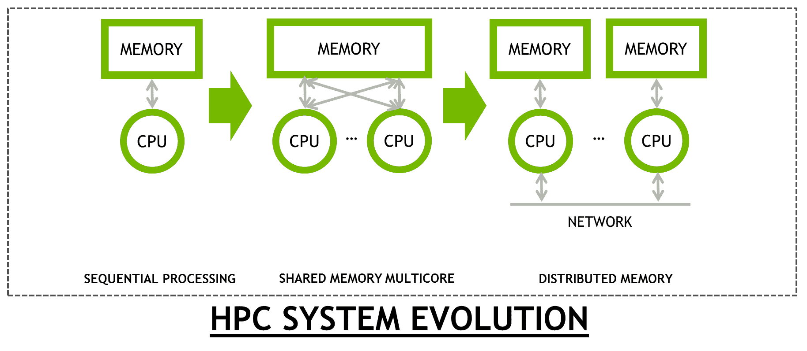

随着 GPU 被添加到现有服务器，应用运行在两种类型的处理器(中央处理器和图形处理器)上，这带来了异构性的概念。这是我们将在下一节中介绍的内容。

# 异构计算

围绕 GPU 的普遍误解是，它是 CPU 的替代品。GPU 用于加速代码中本质上并行的部分。 **Accelerator** 是 GPU 的常用术语，因为它们通过更快地运行代码的并行部分来加速应用，而 CPU 运行代码的另一部分，这是延迟限制。因此，高效的中央处理器和高吞吐量的图形处理器可以提高应用的性能。

下图显示了在多种处理器类型上运行的应用:

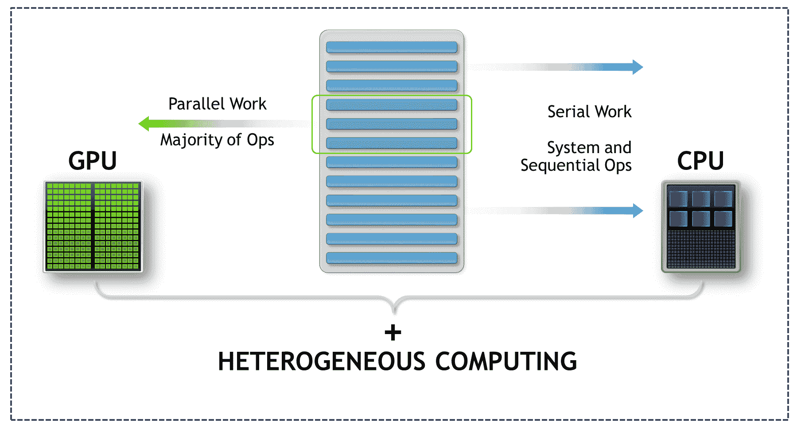

借助阿姆达尔定律可以很好地定义这个概念。Amdahl 定律用于定义当只有一小部分应用被并行化时可以实现的最大加速。为了演示这一点，上图显示了代码的两个部分。一部分是延迟限制，而另一部分是吞吐量限制。我们将在下一节讨论这两个术语的含义，这是中央处理器和图形处理器架构的区别。

关键点在于，对于一定分数的受延迟限制的代码，CPU 是好的，而 GPU 则擅长并行运行代码的**单指令多数据** ( **SIMD** )部分。如果只有其中一个，即 CPU 代码或 GPU 代码，在优化后运行得更快，这不一定会给整个应用带来良好的加速。要求两个处理器在最佳使用时，在性能方面都有最大的优势。这种本质上是“T4”将某些类型的操作从处理器卸载到图形处理器上的方法被称为“T6”异构计算“T7”。

下图描述了所有应用都具有的两种类型的部分，即延迟限制和吞吐量限制:

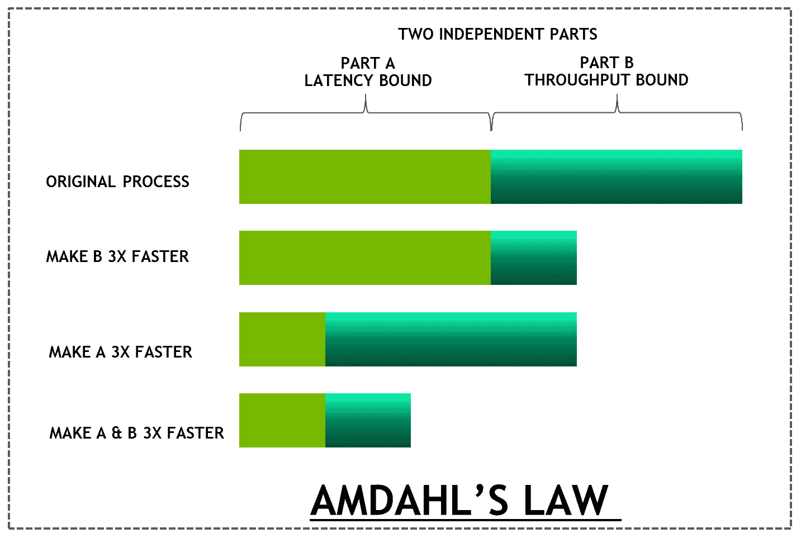

在这里，使用阿姆达尔定律证明了改进这两个部分的重要性。

# 编程范例

计算机体系结构的分类是使用弗林分类法完成的，该分类法描述了四类体系结构。弗林的分类 SIMDs 之一是用来描述 GPU 架构。然而，这两者之间有一个微妙的区别。SIMD 用于描述一种架构，其中相同的指令并行应用于多个数据点。此描述适用于具有矢量化能力的处理器。相比之下，在**单指令多线程** ( **SIMTs** )中，不是单个线程发出指令，而是多个线程向不同的数据发出相同的指令。与 SIMD 相比，GPU 架构更适合 SIMT 类别。

让我们看一个添加两个数组并将数据存储在第三个数组中的例子。该操作的数据集由数组 *A* 、 *B* 和 *C* 组成。用于加法的相同操作用于数组的每个元素:

CX = ax+bx

很明显，每个任务都是相互独立的，但是所有线程都在应用相同的操作。

下面的截图显示了向量加法，描述了这个范例的一个例子:


# 低延迟与高吞吐量

正如我们在上一节中提到的，CPU 架构针对低延迟访问进行了优化，而 GPU 架构针对数据并行吞吐量计算进行了优化。如下图截图所示，CPU 架构相比 GPU 缓存量大，类型多。我们走得越高，也就是说，L3 到 L1 的距离越长，缓存的数量越少，但延迟越短。中央处理器架构旨在实现对缓存数据集的低延迟访问。大量晶体管用于实现推测执行和无序执行。由于中央处理器以非常高的时钟速度运行，因此有必要通过将频繁使用的数据存储在缓存中并预测下一条要执行的指令来隐藏提取数据的延迟。能够探索这种时间局部性的应用可以最佳地利用 CPU 缓存。此外，容易填充指令流水线的应用，例如代码中没有`if`和`else`语句的应用，可以通过隐藏提取指令的延迟而从中受益。因此，中央处理器架构是一个减少延迟的架构。

下面的截图显示了 **CPU** 和 **GPU** 架构如何为不同的内存和计算单元分配芯片芯片区域。虽然 **GPU** 使用大量晶体管来计算 **ALUs** ， **CPU** 使用它来减少延迟:

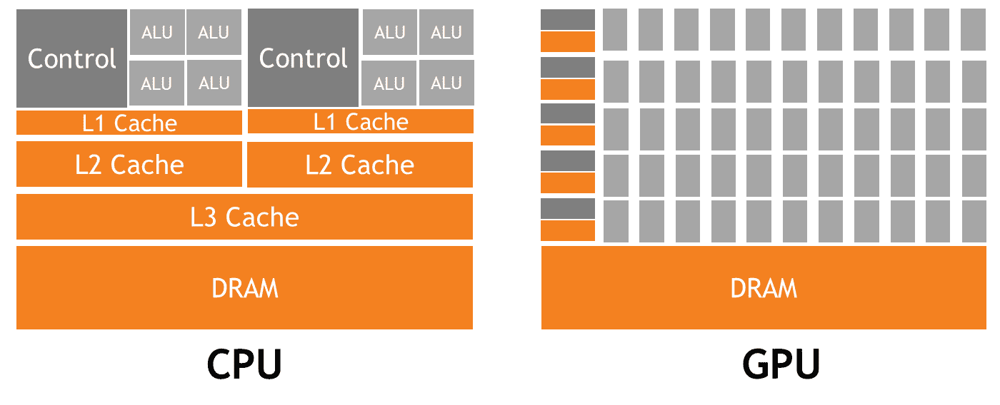

另一方面，GPU 架构被称为**延迟降低**或**高吞吐量架构**。GPU 架构隐藏了其他线程的计算延迟。当一个线程等待数据可供计算时，其他线程可以开始执行，因此不会浪费任何时钟周期。如果你熟悉 CUDA，那么你可能知道扭曲的概念。我们将在接下来的章节中介绍扭曲的概念。(在 CUDA 中，执行单元是一条经线，而不是一条线。因此，上下文切换发生在经线和纬线之间)。

你们中的一些人可能已经在想，为什么我们不能在中央处理器中创建这些线程，并做同样的事情来隐藏延迟。这是因为 GPU 有很多寄存器，并且所有的线程上下文切换信息已经存在于其中。这是目前最快的内存。然而，在中央处理器中，寄存器组有限，因此线程相关信息通常存储在较低的内存层次结构中，如缓存。例如，Volta 包含 20 MB 的寄存器存储。因此，与 GPU 相比，CPU 中线程之间的上下文切换时间要长得多。

现在，让我们看看在 GPU 上编程的不同方法。

# 图形处理器的编程方法

让我们回到最初的问题，那就是什么是 CUDA？CUDA 是由 NVIDIA 开发的并行计算平台和编程模型架构，它将 GPU 上的通用计算作为一流的能力公开。像任何其他处理器一样，GPU 架构可以使用各种方法进行编码。提供嵌入式加速的最简单的方法是利用现有的库。或者，开发人员可以选择使用 **OpenACC** 指令来获得快速加速结果和可移植性。另一种选择是通过使用 C、C++、Fortran、Python 等语言构造来深入 CUDA，以获得最高的性能和灵活性。我们将在后续章节中详细介绍所有这些方法。

下面的截图代表了我们可以执行 GPU 编程的各种方式:

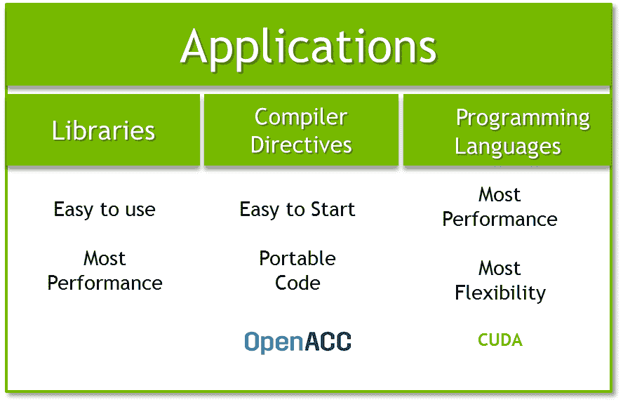

在本节中，我们为您提供了处理器和高性能计算如何随着时间的推移而发展的视角。我们向您概述了为什么异构编程模型是从应用中获得最佳性能的关键，然后介绍了 GPU 编程的方法。在下一节中，我们将开始在 GPU 上编写 Hello World 程序。

# 技术要求

本章需要一台带有现代 NVIDIA GPU(帕斯卡架构以上)的 Linux/Windows 电脑，以及所有必要的 GPU 驱动程序和安装的 CUDA 工具包(10.0 以上)。如果您不确定您的 GPU 架构，请访问英伟达的 GPU 网站([https://developer.nvidia.com/cuda-gpus](https://developer.nvidia.com/cuda-gpus))并确认您的 GPU 架构。本章的代码也可以在 https://github.com/PacktPublishing/Learn-CUDA-Programming的 GitHub 上找到。

本章中的代码示例已经用 CUDA 工具包的 10.1 版本进行了开发和测试，但是如果可能的话，建议使用最新的 CUDA 版本。

# 来自 CUDA 的你好世界

CUDA 是一种异构编程模型，包括对 CPU 和 GPU 的规定。CUDA C/C++ 编程接口由 C 语言扩展组成，因此您可以将部分源代码作为目标，以便在设备(GPU)上并行执行。它基于行业标准 C/C++ 并提供了一个可以在主机(CPU)上执行的 C 函数库，以便它可以与设备交互。

在 CUDA 中，有两个处理器相互协作。主机通常被称为中央处理器，而设备通常被称为图形处理器。主机负责调用设备功能。正如我们已经提到的，在 GPU 上运行的部分代码称为**设备代码**，而在 CPU 上运行的串行代码称为**主机代码**。

让我们从用 c 语言编写我们的第一个 CUDA 代码开始，目的是采取系统的分步方法，从一些顺序代码开始，并通过添加一些额外的关键字将其转换为 CUDA 感知代码。正如我们前面提到的，没有必要学习一门新的语言——我们只需要在现有的语言中添加一些关键词，这样我们就可以在具有 CPU 和 GPU 的异构环境中运行它。

让我们看看第一段代码。这些代码所做的就是打印 Hello World！从主机和设备:

```cpp
#include<stdio.h>
#include<stdlib.h>

__global__ void print_from_gpu(void) {
    printf("Hello World! from thread [%d,%d] \
        From device\n", threadIdx.x,blockIdx.x);
}

int main(void) {
    printf("Hello World from host!\n");
    print_from_gpu<<<1,1>>>();
    cudaDeviceSynchronize();
    return 0;
}

```

让我们试着编译并运行前面的代码片段:

1.  **编译代码**:将前面的代码放入名为`hello_world.cu`的文件中，使用 **NVIDIA C 编译器** ( **nvcc** )进行编译。注意文件的扩展名是`.cu`，它告诉编译器这个文件里面有 GPU 代码:

```cpp
$ nvcc -o hello_world hello_world.cu
```

2.  **执行 GPU 代码**:执行 GPU 代码后，我们应该会收到如下输出:


到目前为止，您可能已经观察到 CUDA C 代码的使用并没有很大的不同，只需要我们学习一些额外的构造来告诉编译器哪个函数是 GPU 代码以及如何调用 GPU 函数。我们不需要完全学习一门新语言。

在前面的代码中，我们添加了一些构造和关键字，如下所示:

*   `__global__`:这个关键字加在函数之前，告诉编译器这是一个会在设备上运行的函数，不会在主机上运行。但是，请注意它是由主机调用的。这里需要注意的另一件重要的事情是，设备函数的返回类型总是“void”。算法的数据并行部分作为内核在设备上执行。
*   `<<<,>>>`:这个关键字告诉编译器，这是对设备函数的调用，而不是对主机函数的调用。此外，`1,1`参数基本上决定了内核中要启动的线程数量。稍后我们将讨论尖括号内的参数。就目前而言，`1,1`参数基本上意味着我们只用一个线程启动内核，也就是说，用一个线程启动顺序代码，因为除了打印之外，我们在代码中没有做任何重要的事情。
*   `threadIdx.x`*`blockIdx.x`:这是一个唯一的 ID，给所有线程。我们将在下一节中更多地讨论这个主题。*
**   `cudaDeviceSynchronize()`:CUDA 中所有的内核调用本质上都是异步的。主机在调用内核后变得空闲，然后开始执行下一条指令。这应该不足为奇，因为这是一个异构环境，因此主机和设备可以并行运行，以利用可用的处理器类型。在主机需要等待设备完成的情况下，作为 CUDA 编程的一部分，已经提供了 API，使得主机代码等待设备功能完成。一个这样的应用编程接口是`cudaDeviceSynchronize`，它会一直等到对设备的所有调用都完成。*

*Try removing the `cudaDeviceSynchronize()` call and see whether the device output is visible or not. Alternatively, try putting this call before printing it on the host code.

# 线程层次结构

现在，让我们开始玩弄这两个参数，即`threadIdx.x`和`blockIdx.x`。

**实验 1** :首先将参数从`<<<1,1>>>`改为`<<<2,1>>`，查看输出。运行多个单线程 Hello World 代码块的输出应该如下所示:


如我们所见，我们现在有两个线程打印该值，而不是一个线程。请注意，它们的唯一标识是不同的。

**实验二**:现在我们不改变第一个参数，而是改变第二个，即把`<<<1,1>>>`改为`<<<1,2>>>`，观察运行 Hello World 代码多个单线程块的输出，如下:


如您所见，像以前一样，被启动到内核中的线程总数是两个——唯一的区别是它们的标识不同。那么，这些线程和块概念是什么？为了解决这个问题，让我们深入研究一下 GPU 架构。

# 图形处理器体系结构

CUDA 如此受欢迎的一个关键原因是，硬件和软件都经过了设计，并紧密结合，以获得应用的最佳性能。因此，有必要展示软件 CUDA 编程概念和硬件设计本身之间的关系。

下面的截图展示了 CUDA 的两面:

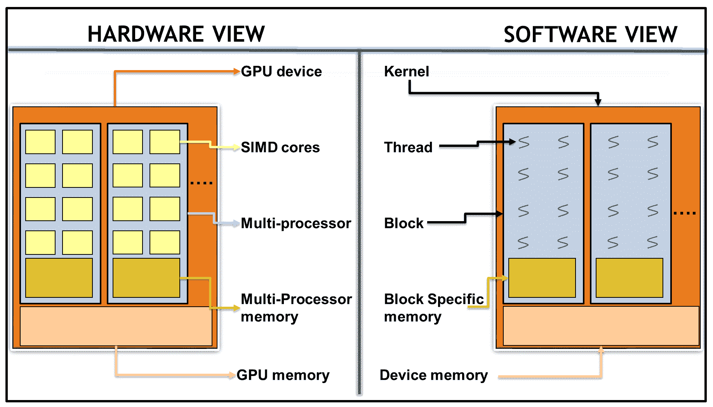

我们可以看到 CUDA 软件已经映射到了 GPU 硬件。

根据前面的截图，下表根据 CUDA 编程模型解释了软件和硬件映射:

| **软件** | **按**执行 | **硬件** |
| CUDA 线程 | 核心/SIMD 代码 |
| CUDA 块 | 流式多处理器 |
| 网格/内核 | 图形处理器设备 |

让我们详细看一下上表的组件:

*   **CUDA 线程** : CUDA 线程在一个 CUDA 核上执行。CUDA 线程不同于 CPU 线程。CUDA 线程极其轻量级，并提供快速的上下文切换。快速上下文切换的原因是由于图形处理器和基于硬件的调度器中有大的寄存器大小。与中央处理器相比，线程上下文存在于寄存器中，其中线程句柄位于较低的内存层次结构中，例如缓存。因此，当一个线程空闲/等待时，另一个准备好的线程可以几乎没有延迟地开始执行。每个 CUDA 线程必须执行相同的内核，并独立处理不同的数据(SIMT)。
*   **CUDA 块** : CUDA 线程被组合成一个逻辑实体，称为 CUDA 块。CUDA 块在单个**流式多处理器** ( **SM** )上执行。一个块在单个 SM 上运行，也就是说，一个块内的所有线程只能在一个 SM 的内核上执行，而不能在其他 SM 的内核上执行。每个图形处理器可以有一个或多个微处理器，从而有效地利用整个图形处理器；用户需要将并行计算分成块和线程。
*   **网格/内核** : CUDA 块被组合成一个逻辑实体，称为 CUDA 网格。然后在设备上执行 CUDA 网格。

乍一看，这听起来有些复杂。在下一节中，我们将看一个向量加法的例子来解释这一点。希望事情会变得更清楚。

# 使用 CUDA 的向量加法

我们试图解决的问题是向量加法。我们知道，**向量**加法是一个数据并行运算。我们的数据集由三个数组组成: *A* 、 *B* 和 *C* 。对每个元素执行相同的操作:

CX = ax+bx

每次添加都是相互独立的，但是相同的操作由所有 CUDA 线程应用。要开始，请按照以下步骤配置您的环境:

1.  准备好你的 GPU 应用。该代码将被置于`01_cuda_introduction/01_vector_addition`中。
2.  使用以下命令，使用`nvcc`编译器编译您的应用:

```cpp
$nvcc -o vector_addition vector_addition.cu
```

前面的代码是顺序代码。我们将转换此代码，以便它可以使用分步方法在 GPU 上运行，如下所示:

```cpp
#include<stdio.h>
#include<stdlib.h>

#define N 512

void host_add(int *a, int *b, int *c) {
    for(int idx=0;idx<N;idx++)
        c[idx] = a[idx] + b[idx];
}

//basically just fills the array with index.
void fill_array(int *data) {
    for(int idx=0;idx<N;idx++)
        data[idx] = idx;
}

void print_output(int *a, int *b, int*c) {
    for(int idx=0;idx<N;idx++)
        printf("\n %d + %d = %d", a[idx] , b[idx], c[idx]);
}

int main(void) {
    int *a, *b, *c;
    int size = N * sizeof(int);
   // Alloc space for host copies of a, b, c and setup input values
    a = (int *)malloc(size); fill_array(a);
    b = (int *)malloc(size); fill_array(b);
    c = (int *)malloc(size);
    host_add(a,b,c);
    print_output(a,b,c);
    free(a); free(b); free(c);
    return 0;
}
```

在转换顺序代码之前，让我们看一下 CUDA 和顺序代码之间的基本变化或步骤:

| **顺序码** | **CUDA 代码** |
| 第一步 | 在 CPU 上分配内存，即`malloc new`。 | 第一步 | 在 CPU 上分配内存，即`malloc new`。 |
| 第二步 | 填充/初始化中央处理器数据。 | 第二步 | 在 GPU 上分配内存，即`cudaMalloc`。 |
| 第三步 | 调用处理数据的中央处理器函数。在这种情况下，实际的算法是向量加法。 | 第三步 | 填充/初始化中央处理器数据。 |
| 第四步 | 使用经过处理的数据，在这种情况下会打印出来。 | 第四步 | 用`cudaMemcpy`将数据从主机传输到设备。 |
| 第五步 | 用`<<<,>>>`括号调用 GPU 函数。 |
| 第六步 | 用`cudaDeviceSynchronize`同步设备和主机。 |
| 第七步 | 用`cudaMemcpy`将数据从设备传输到主机。 |
| 第八步 | 使用经过处理的数据，在这种情况下会打印出来。 |

This book is not a replacement for the CUDA API guide and does not cover all CUDA APIs. For extensive use of the API, please refer to the CUDA API guide.

正如我们所看到的，CUDA 处理流程有一些额外的步骤需要添加到顺序代码中。这些措施如下:

1.  **GPU 上的内存分配:** CPU 内存和 GPU 内存是物理上分开的内存。`malloc`在 CPU 的 RAM 上分配内存。图形处理器内核/设备功能只能访问分配/指向设备内存的内存。要在 GPU 上分配内存，我们需要使用`cudaMalloc` API。与`malloc`命令不同，`cudaMalloc`不返回分配内存的指针；相反，它将指针引用作为参数，并使用分配的内存更新该引用。

2.  **将数据从主机内存传输到设备内存:**然后将主机数据复制到设备内存，该内存是使用上一步中使用的`cudaMalloc`命令分配的。用于在主机和设备之间以及主机和设备之间复制数据的应用编程接口是`cudaMemcpy`。像其他`memcopy`命令一样，这个应用编程接口需要目标指针、源指针和大小。它采用的另一个参数是拷贝方向，即我们是从主机拷贝到设备还是从设备拷贝到主机。在最新版本的 CUDA 中，这是可选的，因为驱动程序能够理解指针是指向主机内存还是设备内存。请注意`cudaMemcpy`有一个异步替代方案。这将在其他章节中详细介绍。
3.  **调用并执行一个 CUDA 函数:**如 Hello World CUDA 程序所示，我们通过使用`<<<,>>>`括号调用一个内核，括号中分别提供了块和线程大小的参数。所有步骤完成后，我们将对此进行更详细的介绍。
4.  **Synchronize:** 正如我们在 Hello World 程序中提到的，内核调用本质上是异步的。为了让主机确定内核执行已经完成，主机调用`cudaDeviceSynchronize`函数。这可以确保所有先前启动的设备调用都已完成。
5.  **将数据从主机内存传输到设备内存:**使用相同的`cudaMemcpy`应用编程接口将数据从设备复制回主机，用于后处理或验证任务，如打印。与第一步相比，这里唯一的变化是我们反转了拷贝的方向，即目标指针指向主机，而源指针指向内存中分配的设备。
6.  **释放分配的 GPU 内存:**最后，使用`cudaFree` API 释放分配的 GPU 内存。

更改顺序向量加法代码的`main`功能，以反映这些新步骤。`main`功能将如下所示:

```cpp
int main(void) {
    int *a, *b, *c;
    int *d_a, *d_b, *d_c; // device copies of a, b, c
    int size = N * sizeof(int);

    // Alloc space for host copies of a, b, c and setup input values
    a = (int *)malloc(size); fill_array(a);
    b = (int *)malloc(size); fill_array(b);
    c = (int *)malloc(size);

    // Alloc space for device copies of vector (a, b, c)
    cudaMalloc((void **)&d_a, N* * sizeof(int));
    cudaMalloc((void **)&d_b, N* *sizeof(int));
    cudaMalloc((void **)&d_c, N* * sizeof(int));

    // Copy from host to device
    cudaMemcpy(d_a, a, N * sizeof(int), cudaMemcpyHostToDevice);
    cudaMemcpy(d_b, b, N* sizeof(int), cudaMemcpyHostToDevice);

    device_add<<<1,1>>>(d_a,d_b,d_c);

    // Copy result back to host
    cudaMemcpy(c, d_c, N * sizeof(int), cudaMemcpyDeviceToHost);

    print_output(a,b,c);
    free(a); free(b); free(c);

    //free gpu memory
    cudaFree(d_a); cudaFree(d_b); cudaFree(d_c);

    return 0;
} 
```

现在，让我们看看内核代码是如何编写的，以及如何管理线程和块大小。为此，我们将进行多次实验。

# 实验 1–创建多个块

在本节中，我们将利用 CUDA 块在 GPU 上并行运行矢量加法代码。额外的关键字将被暴露，这些关键字与我们如何索引 CUDA 块有关。更改对`device_add`功能的调用，如下所示:

```cpp
//changing from device_add<<<1,1>>> to
device_add<<<N,1>>>
```

这将并行执行`device_add`功能`N`次，而不是一次。`device_add`函数的每次并行调用被称为一个块。现在，让我们添加一个`__global__`设备功能，如下所示:

```cpp
__global__ void device_add(int *a, int *b, int *c) {
 c[blockIdx.x] = a[blockIdx.x] + b[blockIdx.x];
}
```

通过使用`blockIdx.x`来索引数组，每个块处理数组的不同元素。在设备上，每个块可以并行执行。让我们看看下面的截图:

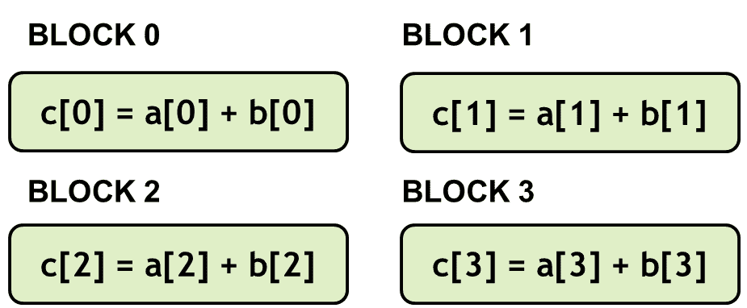

前面的截图表示矢量加法图形处理器代码，其中每个块显示多个单线程块的索引。

# 实验 2–创建多个线程

在本节中，我们将利用 CUDA 线程在 GPU 上并行运行向量加法代码。额外的关键字将被暴露，这些关键字与我们如何索引 CUDA 线程有关。

一个块可以分成多个线程。更改对`device_add`功能的调用，如下所示:

```cpp
//changing from device_add<<<1,1>>> to
device_add<<<1,N>>>
```

这将并行执行`device_add`功能`N`次，而不是一次。`device_add`函数的每次并行调用被称为一个线程。更改设备例程以反映内核，如下所示:

```cpp
__global__ void device_add(int *a, int *b, int *c) {
     c[threadIdx.x] = a[threadIdx.x] + b[threadIdx.x];
}
```

一个值得注意的区别是，我们使用的不是`blockIdx.x`，而是`threadIdx.x`，如下图截图所示:

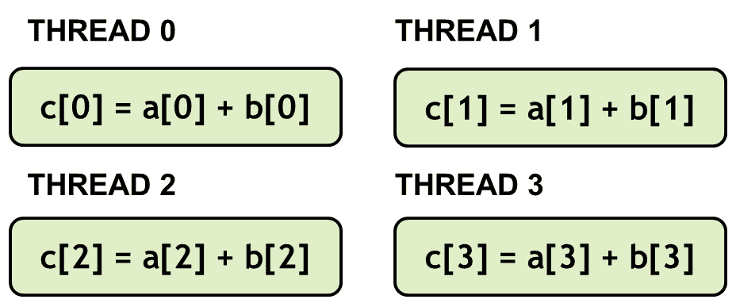

前面的截图表示矢量加法图形处理器代码，其中每个块显示单个块的索引——多线程。

# 实验 3–组合块和线程

到目前为止，我们已经在*实验 1–创建多个块*部分和*实验 2–创建多个线程*部分研究了通过使用多个具有一个线程的块进行并行向量加法。在这个实验中，我们将使用多个块以及包含多个线程的独立块。这在如何找到索引方面变得更具挑战性，因为我们需要组合`threadIdx`和`blockIdx`来生成唯一的 ID。

让我们看一下两个场景，它们描述了开发人员可以选择的不同组合:

*   **场景一:**我们来考虑一下向量元素的总数是 32。每个块包含八个线程，总共四个块。
*   **场景二:**我们来考虑一下向量元素的总数是 32。每个块包含四个线程，总共八个块。

在这两种情况下，并行执行的数量都是 32，其中所有 32 个元素并行填充。开发人员根据问题的大小和每个硬件的限制，在块内的线程和块的数量之间做出选择。我们将在另一章中详细介绍基于体系结构的正确规模选择。

下面的截图显示了不同块和线程配置的矢量加法 GPU 索引代码:

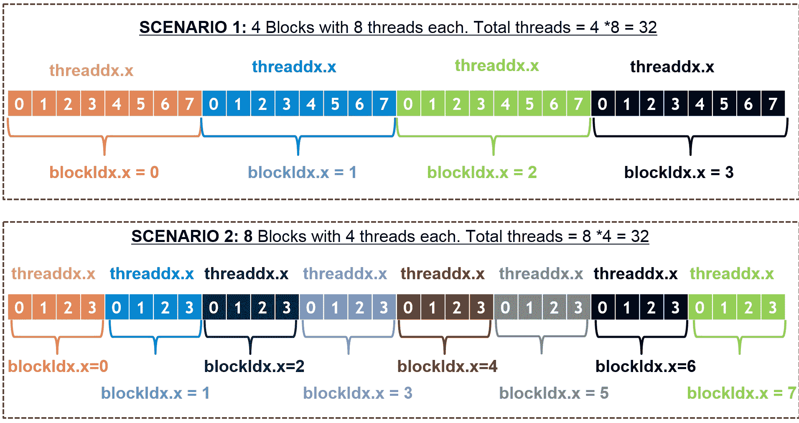

现在，让我们看看如何更改内核代码来组合线程和块来计算全局索引:

```cpp
__global__ void device_add(int *a, int *b, int *c) {
     int index = threadIdx.x + blockIdx.x * blockDim.x;
     c[index] = a[index] + b[index];
}
```

当从`main()`函数调用内核时，开发人员为我们前面提到的两种情况选择块和线程配置，如下面的代码所示:

*   **场景 1:** 以下是针对每个块八个线程的矢量加法 GPU 网格和块大小计算的代码:

```cpp
threads_per_block = 8;
no_of_blocks = N/threads_per_block;
device_add<<<no_of_blocks,threads_per_block>>>(d_a,d_b,d_c);
```

*   **场景 2:** 以下是矢量加法 GPU 网格和每个块四个线程的块大小计算的代码:

```cpp
threads_per_block = 4;
no_of_blocks = N/threads_per_block;
device_add<<<no_of_blocks,threads_per_block>>>(d_a,d_b,d_c);
```

通过线程和块的组合，可以计算线程的唯一标识。如前面的代码所示，另一个变量被赋予所有线程。这叫`blockDim`。该变量由块的尺寸组成，即每个块的线程数。让我们看看下面的截图:

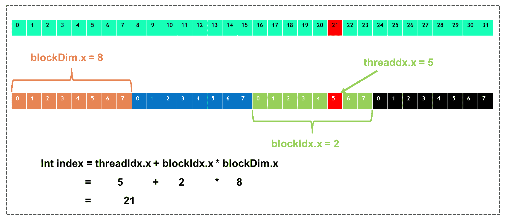

在这里，我们可以看到场景 1 的向量加法 GPU 索引计算。

# 为什么要为线程和块烦恼？

为什么我们需要这种额外的线程和块层次结构，这可能并不明显。它们增加了开发人员需要找到正确的块和网格大小的复杂性。此外，全局索引成为一项挑战。这是因为 CUDA 编程模型对其设置了限制。

与并行块不同，线程具有高效通信和同步的机制。现实世界的应用需要线程相互通信，并且可能希望在继续之前等待某些数据被交换。这种操作需要线程进行通信，CUDA 编程模型允许同一块内的线程进行这种通信。在内核执行期间，属于不同块的线程不能相互通信/同步。这种限制允许调度程序相互独立地调度 SM 上的块。这样做的结果是，如果新硬件发布了更多的 SMs，并且代码具有足够的并行性，则代码可以线性扩展。换句话说，这允许硬件根据图形处理器的能力来扩展并行运行的块的数量。

线程使用一种称为共享内存的特殊内存相互通信。我们将在[第 2 章](02.html)、 *CUDA 内存管理*中详细介绍共享内存，其中我们将展示 GPU 中的其他内存层次及其最佳使用。下面的截图演示了跨不同 GPU 的缩放块，这些 GPU 由不同数量的 SMs 组成:

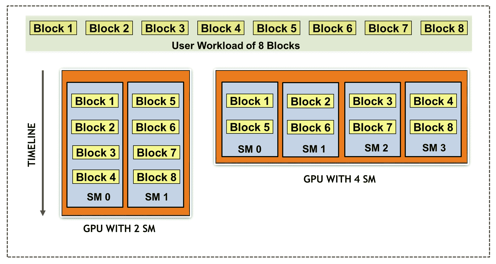

现在，让我们了解更多关于多维启动内核的信息。

# 多维启动内核

到目前为止，我们一直在一维空间中启动线程和块。这意味着我们只对一个维度使用索引；例如，我们一直在使用`threadIdx.x`，其中`x`表示我们只使用了一个`x`维度线程索引。同样，我们一直在使用`blockIdx.x`，其中`x`表示我们只使用了一个`x`维度块索引。我们可以在一个、两个或三个维度上启动线程和块。二维启动线程和块的一个例子是，当我们对图像使用并行操作时，例如，使用滤镜模糊图像。开发人员可以选择启动二维的线程和块，这是一个更自然的选择，因为图像本质上是二维的。

重要的是要理解，每一个 GPU 架构也对线程和块的尺寸进行了限制。例如，NVIDIA Pascal 卡在`x`和`y`维度中每个线程块最多允许 1，024 个线程，而在`z`维度中，您只能启动 64 个线程。类似地，在帕斯卡架构的`y`和`z`维度以及`x`维度中，网格中的最大块数被限制为 65，535。如果开发人员启动一个不支持维度的内核，应用将抛出一个运行时错误。

到目前为止，我们一直假设我们编写的代码没有错误。但是在现实世界中，每个程序员写的代码都有 bug，有必要捕捉这些错误。在下一节中，我们将看看 CUDA 中的错误报告是如何工作的。

# CUDA 中的错误报告

在 CUDA 中，主机代码管理错误。大多数 CUDA 函数调用`cudaError_t`，基本上是枚举类型。`cudaSuccess`(值 0)表示`0`错误。用户也可以使用`cudaGetErrorString()`功能，该功能返回描述错误情况的字符串，如下所示:

```cpp
 cudaError_t e;
 e = cudaMemcpy(...);
 if(e)
     printf("Error: %sn", cudaGetErrorString(err));
```

内核启动没有返回值。我们可以在这里使用`cudaGetLastError()`这样的函数，它返回最后一个 CUDA 函数的错误代码(包括内核启动)。在多个错误的情况下，只报告最后一个错误:

```cpp
MyKernel<<< ... >>> (...);
cudaDeviceSynchronize();
e = cudaGetLastError();
```

当涉及到生产代码时，建议在逻辑检查点使用错误检查代码，因为即使 GPU 内核崩溃，CPU 代码也会继续正常执行，从而导致不正确的结果。

在下一节中，我们将向您介绍 CUDA 编程模型中支持的数据类型。

# CUDA 中的数据类型支持

像任何处理器架构一样，图形处理器也有不同类型的存储器，每种存储器都有不同的用途。我们将在[第 2 章](02.html)、 *CUDA 内存管理*中更详细地介绍它们。但是，了解支持的不同数据类型及其对性能和准确性的影响非常重要。CUDA 编程支持开发人员在各自语言方面熟悉的所有标准数据类型。除了不同大小的标准数据类型(`char`为 1 字节、`float`为 4 字节、`double`为 8 字节等等)，它还支持`float2`、`float4`等向量类型。

建议数据类型自然对齐，因为大小为 1、2、4、8 或 16 字节的数据类型的对齐数据访问可确保 GPU 调用单个内存指令。如果它们没有对齐，编译器会生成多个指令，这些指令是交错的，导致内存和指令总线的利用率低下。因此，建议对驻留在 GPU 内存中的数据使用自然对齐的类型。内置类型`char`、`short`、`int`、`long`、`long long`、`float`和`double`如`float2`、`float4`自动满足对中要求。

此外，CUDA 编程支持复杂的数据结构，如结构和类(在 C 和 C++ 的上下文中)。对于复杂的数据结构，开发人员可以利用编译器的对齐说明符来实施对齐要求，如以下代码所示:

```cpp
struct __align__(16) {
    float r;
    float g;
    float b;
};
```

每个图形处理器都有一组有限的内核，因此 FLOPS 是不同的。例如，采用 Volta 架构的特斯拉 V100 卡有 2，560 个 FP64 内核(双精度)，而它的 32 位单精度内核数量是前者的两倍。很明显，根据算法的精度要求使用正确的数据类型是至关重要的。现在正在开发混合精度算法，以利用不同类型的内核，其中算法的某些部分以较高的精度运行，而某些部分以较低的精度运行。在接下来的章节中，我们还将讨论这个主题。目前，重要的是要理解 GPU 内存层次结构是不同的，因此，使用正确的数据类型很重要。

While this was a general introduction to the data types that are supported in GPU, more details about all of the supported data types can be found at [https://docs.nvidia.com/cuda/cuda-c-programming-guide/index.html#built-in-vector-types](https://docs.nvidia.com/cuda/cuda-c-programming-guide/index.html#built-in-vector-types).

# 摘要

在本章中，我们借助历史和高性能计算为您提供了异构计算的视角。我们详细讨论了两个处理器，即中央处理器和图形处理器，是如何不同的。我们还在 GPU 上编写了 Hello World 和矢量加法 CUDA 程序。最后，我们研究了如何检测 CUDA 中的错误，因为对 CUDA API 的大多数调用本质上都是异步的。

在下一章中，我们将看看可用的不同类型的图形处理器内存，以及如何最佳地利用它们。*