# 线程编程

CUDA 有一个分层的线程架构，这样我们可以分组控制 CUDA 线程。了解它们如何在 GPU 上并行工作有助于您编写并行编程代码并获得更好的性能。在本章中，我们将介绍 CUDA 线程操作及其与 GPU 资源的关系。作为实践经验，我们将研究并行约简算法，看看如何通过使用优化策略来优化 CUDA 代码。

在本章中，您将了解 CUDA 线程如何在 GPU 中运行:并行和并发线程执行、扭曲执行、内存带宽问题、控制开销、SIMD 操作等。

本章将涵盖以下主题:

*   分层 CUDA 线程操作
*   了解 CUDA 占用情况
*   跨多个 CUDA 线程的数据共享
*   识别应用的性能限制
*   最小化 CUDA 翘曲发散效应
*   提高内存利用率和网格跨步循环
*   灵活线程处理的协作组
*   翘曲同步编程
*   低/混合精度操作

# 技术要求

本章建议使用比帕斯卡架构更晚的 NVIDIA GPU 卡。换句话说，你的图形处理器的计算能力应该等于或大于 60。如果您不确定自己的 GPU 架构，请访问位于[https://developer.nvidia.com/cuda-gpus](https://developer.nvidia.com/cuda-gpus)的英伟达 GPU 网站，确认您的 GPU 计算能力。

当我们写这本书时，示例代码是用 10.1 开发和测试的。一般来说，如果适用，建议使用最新的 CUDA 版本。

在本章中，我们将通过分析代码来执行 CUDA 编程。如果你的 GPU 架构是图灵，建议安装 Nsight Compute 来剖析代码。免费，可以从[https://developer.nvidia.com/nsight-compute](https://developer.nvidia.com/nsight-compute)下载。当我们写这本书时，这是侧写员的一个过渡时刻。您可以在[第 5 章](05.html)、 *CUDA 应用分析和调试*中的*用 Nsight 计算分析内核*部分了解它的基本用法。

# CUDA 线程、块和图形处理器

CUDA 编程中的基本工作单元是 CUDA 线程。基本的 CUDA 线程执行模型是**单指令多线程** ( **SIMT** )。换句话说，内核函数的主体是对单个 CUDA 线程的工作描述。但是，CUDA 架构执行多个具有相同动作的 CUDA 线程。

从概念上讲，多个 CUDA 线程在一个组中并行工作。CUDA 线程块是多个 CUDA 线程的集合。多个线程块相互并发操作。我们称一组线程块为网格。下图显示了它们之间的关系:


这些分级 CUDA 线程操作与分级 CUDA 架构相匹配。当我们启动一个 CUDA 内核时，一个或多个 CUDA 线程块在 GPU 中的每个流式多处理器上执行。此外，流式多处理器可以根据资源可用性运行多个线程块。线程块中的线程数量不同，网格中的块数量也不同:


流式多处理器可以任意和并发地执行线程块，执行尽可能多的图形处理器资源。因此，可并行执行的线程块的数量取决于该块需要多少 GPU 资源以及可用的 GPU 资源量。我们将在下一节讨论这个问题。流式多处理器的数量因 GPU 规格而异。例如，特斯拉 V100 是 80，RTX 2080 (Ti)是 48。

CUDA 流式多处理器控制 32 个一组的 CUDA 线程。一个组被称为**扭曲**。以这种方式，一个或多个经线配置一个 CUDA 线程块。下图显示了这种关系:


绿色的小盒子是 CUDA 线程，它们由一个经线分组。翘曲是 GPU 架构的基本控制单元。因此，它的大小会隐式或显式地影响 CUDA 编程。例如，最佳线程块大小是在能够充分利用块的扭曲调度和操作的多个扭曲大小中确定的。我们称之为占用，这将在下一节中详细介绍。此外，翘曲中的 CUDA 线程并行工作，并且本质上具有同步操作。我们将在本章的*扭曲级原语编程*部分讨论这一点。

# 利用 CUDA 块和翘曲

现在，我们将使用 CUDA 的`printf`来看看 CUDA 线程调度及其隐式同步。并行 CUDA 线程和块操作的执行是并发的。另一方面，从设备打印出来是一个连续的任务。因此，我们可以很容易地看到它们的执行顺序，因为并发任务的输出是任意的，而并行任务的输出是一致的。

我们将开始编写打印全局线程索引、线程块索引、扭曲索引和通道索引的内核代码。为此，代码可以编写如下:

```cpp
__global__ void index_print_kernel() {
    int idx = blockIdx.x * blockDim.x + threadIdx.x;
    int warp_idx = threadIdx.x / warpSize;
    int lane_idx = threadIdx.x & (warpSize - 1);

    if ((lane_idx & (warpSize/2 - 1)) == 0)
        //thread, block, warp, lane
        printf(" %5d\t%5d\t %2d\t%2d\n", idx, blockIdx.x, 
               warp_idx, lane_idx);
}
```

这段代码将帮助我们理解 warp 和 CUDA 线程调度的并发性。让我们的代码从 shell 中获取参数，以便轻松测试各种网格和线程块配置。

然后，我们将编写调用内核函数的宿主代码:

```cpp
int main() {
    int gridDim = 4, blockDim = 128;
    puts("thread, block, warp, lane");
    index_print_kernel<<< gridDim, blockDim >>>();
    cudaDeviceSynchronize();
}
```

最后，让我们编译代码，执行它，并看到结果:

```cpp
nvcc -m64 -o cuda_thread_block cuda_thread_block.cu
```

以下结果是输出结果的示例。实际输出可能不同:

```cpp
$ ./cuda_thread_block.cu 4 128
thread, block, warp, lane
 64     0     2     0
 80     0     2    16
 96     0     3     0
 112     0     3    16
 0     0     0     0
 16     0     0    16
 ...
 352     2     3     0
 368     2     3    16
 288     2     1     0
 304     2     1    16
```

从结果中，您将看到 CUDA 线程是以经纱大小启动的，并且顺序没有确定。另一方面，通道输出是有序的。从给定的结果，我们可以证实以下事实:

*   **乱序块执行:**第二列显示线程块的索引。结果表明，它不能保证按照块索引的顺序执行。
*   **带有线块的无序经纱索引:**第三列显示了线块中经纱的索引。不同区块的经纱顺序不同。所以，我们可以推断，曲速执行顺序没有保证。
*   **经纱中执行的成组纱线:**第四列显示经纱中的通道。为了减少输出数量，应用将其限制为只打印两个索引。从每个扭曲内的顺序输出，我们可以类比`printf`函数的输出顺序是固定的，因此没有反转。

总结一下，CUDA 线程被分成 32 个线程，它们的输出和 warp 的执行没有顺序。因此，程序员在进行 CUDA 内核开发时，必须牢记这一点。

# 了解 CUDA 占用情况

CUDA 占用率是活动 CUDA 扭曲与每个流式多处理器可以并发执行的最大扭曲的比率。一般来说，更高的占用率会导致更有效的图形处理器利用率，因为有更多的扭曲可以用来隐藏停滞扭曲的延迟。但是，由于 CUDA 线程之间的资源争用增加，它也可能降低性能。因此，开发人员理解这种权衡是至关重要的。

寻找最佳 CUDA 占用率的目的是使 GPU 应用有效地利用 GPU 资源发出扭曲指令。GPU 在流式多处理器上使用多个扭曲调度器来调度多个扭曲。当有效调度多个扭曲时，图形处理器可以隐藏图形处理器指令之间的延迟或内存延迟。然后，CUDA 内核可以执行从多个扭曲连续发出的指令，而未调度的扭曲必须等待，直到它们可以发出下一个指令。

开发人员可以使用两种方法来确定 CUDA 占用率:

*   **理论占用率**由 CUDA 占用率计算器确定:该计算器是 CUDA 工具包提供的 Excel 表。理论上，我们可以从内核资源使用情况和 GPU 的流式多处理器来确定每个内核的占用率。
*   **实现的占用率**由 GPU 确定:实现的占用率反映了流式多处理器上并发执行的扭曲的真实数量和最大可用扭曲。这种占用率可以通过英伟达性能分析器的度量分析来衡量。

理论占用率可视为最大上限占用率，因为占用率不考虑指令相关性或内存带宽限制。

现在，让我们看看这个占用和 CUDA C/C++ 是如何关联的。

# 设置 NVCC 报告图形处理器资源使用情况

首先，我们将使用**简单矩阵乘法** ( **SGEMM** )内核代码，如下所示:

```cpp
__global__ void sgemm_gpu_kernel(const float *A, const float *B, 
        float *C, int N, int M, int K, alpha, float beta) {
    int col = blockIdx.x * blockDim.x + threadIdx.x;
    int row = blockIdx.y * blockDim.y + threadIdx.y;

    float sum = 0.f;
    for (int i = 0; i < K; ++ i) {
        sum += A[row * K + i] * B[i * K + col];
    }
    C[row * M + col] = alpha * sum + beta * C[row * M + col];
}
```

并且，我们将使用以下内核代码调用内核函数:

```cpp
void sgemm_gpu(const float *A, const float *B, float *C,
            int N, int M, int K, float alpha, float beta) {
    dim3 dimBlock(BLOCK_DIM, BLOCK_DIM);
    dim3 dimGrid(M / dimBlock.x, N / dimBlock.y);
    sgemm_gpu_kernel<<< dimGrid, dimBlock >>>(A, B, C, N, M, K, alpha, beta);
}
```

您可能需要提供适当的 GPU 内存及其大小信息。我们将使用 2048 作为`N`、`M`和`K`。内存大小是这个数字的平方。我们将`BLOCK_DIM`设为`16`。

现在，让我们看看如何让`nvcc`编译器报告内核函数的 GPU 资源使用情况。

# Linux 的设置

在 Linux 环境中，我们应该提供两个编译器选项，如下所示:

*   `--resource-usage` ( `--res-usage`):设置 GPU 资源使用的详细选项
*   `-gencode`:指定要编译和生成操作码的目标架构，如下所示:
    *   图灵:`compute_75,sm_75`
    *   回:`compute_70,sm_70`
    *   帕斯卡:`compute_61,sm_61`、`compute_61,sm_61`

如果你不确定自己使用的是哪种架构，可以从 CUDA GPU 网站([https://developer.nvidia.com/cuda-gpus](https://developer.nvidia.com/cuda-gpus))找到。例如，`nvcc`编译命令可以有如下编译选项:

```cpp
$ nvcc -m 64 --resource-usage \
 -gencode arch=compute_70,code=sm_70 \
 -I/usr/local/cuda/samples/common/inc \
 -o sgemm ./sgemm.cu 
```

我们还可以将代码编译为针对多个 GPU 架构，如下所示:

```cpp
$ nvcc -m64 --resource-usage \
      -gencode arch=compute_70,code=sm_70 \
      -gencode arch=compute_75,code=sm_75 \
      -I/usr/local/cuda/samples/common/inc \
      -o sgemm ./sgemm.cu
```

如果您想使您的代码与新的 GPU 架构(图灵)兼容，您需要提供一个额外的选项，如下所示:

```cpp
$ nvcc -m64 --resource-usage \
      -gencode arch=compute_70,code=sm_70 \
      -gencode arch=compute_75,code=sm_75 \
      -gencode arch=compute_75,code=compute_75 \
      -I/usr/local/cuda/samples/common/inc \
      -o sgemm ./sgemm.cu
```

如果您想了解这些选项更多信息，可以在本文档中找到相关信息:[https://docs . NVIDIA . com/cuda/turing-compatibility-guide/index . html # building-turing-compatible-apps-use-cuda-10-0](https://docs.nvidia.com/cuda/turing-compatibility-guide/index.html#building-turing-compatible-apps-using-cuda-10-0)。

现在，让我们编译源代码。我们可以从 NVCC 的输出中找到资源使用报告。使用前面的命令生成以下结果:


NVCC 报告了每个计算能力的 CUDA 内核资源使用信息。在前面的输出截图中，我们可以看到每个线程的寄存器数量和恒定的内存使用量。

# 窗口设置

当我们开发一个 Windows 应用时，我们可以在 Visual Studio 的项目属性对话框中设置这些设置。下面的截图显示了该对话框:

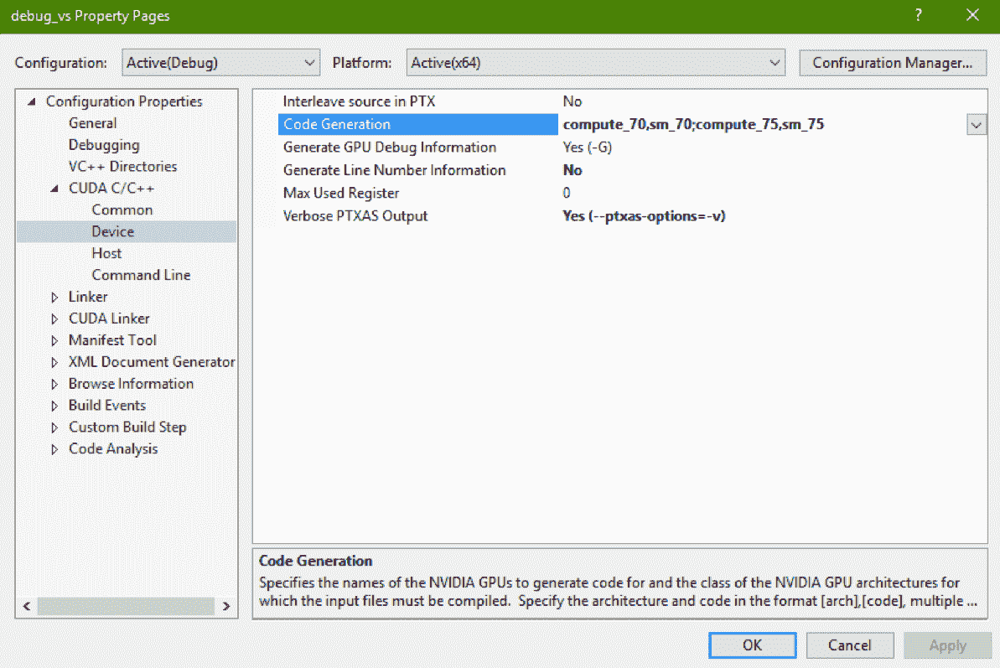

要打开这个对话框，我们应该打开 debug_vs 属性页，然后遍历左侧面板上的 CUDA C/C++ | Device 选项卡。然后，我们应该设置如下选项:

*   详细 PTXAS 输出:否|是
*   代码生成:更新选项以指定您的目标体系结构，如下所示:
    *   图灵:`compute_75,sm_75`
    *   回:`compute_70,sm_70`
    *   帕斯卡:t0]

我们可以为每个目标使用分号(`;`)指定多个目标架构。

现在，让我们构建源代码，我们将在 Visual Studio 的输出面板上看到 NVCC 的报告。然后，您将看到类似如下的输出:


它与 Linux 中的 NVCC 输出相同。

现在，让我们使用资源使用报告来分析内核的占用率。

# 使用占用率计算器分析最佳占用率

实际上，我们可以使用 CUDA 占用计算器，它是由 CUDA 工具包提供的。利用这一点，我们可以通过提供一些内核信息来获得理论占用率。计算器是一个 Excel 文件，根据您使用的操作系统，您可以在下面找到它:

*   **窗户:** `C:\Program Files\NVIDIA GPU Computing Toolkit\CUDA\<cuda-version>\tools`
*   **Linux:** `/usr/local/cuda/tools`
*   **柔软:** `/Developer/NVIDIA/<cuda-version>/tools`

以下是计算器的截图:


CUDA Occupancy Calculator

这个计算器有两个部分:内核信息输入和占用信息输出。作为输入，它需要两种信息，如下所示:

*   图形处理器的计算能力(绿色)
*   线程块资源信息(黄色):
    *   每个 CUDA 线程块的线程数
    *   每个 CUDA 线程的寄存器
    *   每个块的共享内存

计算器在此显示图形处理器的占用信息:

*   图形处理器占用数据(蓝色)
*   图形处理器对图形处理器计算能力的物理限制(灰色)
*   每个块分配的资源(黄色)
*   每个流多处理器的最大线程块(黄色、橙色和红色)
*   占用限制图遵循三个关键的占用资源，即线程、寄存器和每个块的共享内存
*   图表上的红色三角形，显示当前占用数据

现在，让我们把获得的信息输入计算器。我们可以在 Excel 工作表中编辑绿色和橙色区域:

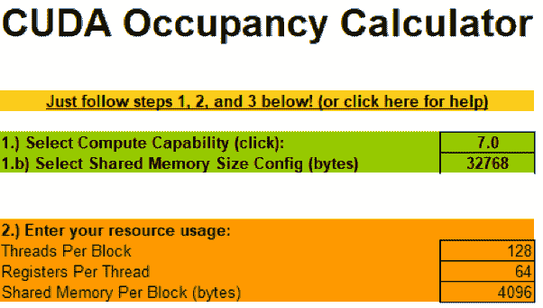

输入您获得的内核资源信息，并查看工作表的变化。

根据计算能力和输入数据，占用率会发生变化，如下图所示:


Changes in occupancy depending on compute capability and input data

蓝色区域显示了内核函数实现的占用率。在这张截图中，它显示了 100%的占用率成就。该表的右侧显示了图形处理器资源的占用率图:CUDA 线程、共享内存和寄存器。

一般来说，由于许多原因，内核代码不可能有 100%的理论占用率。然而，设置 pick 占用率是高效利用 GPU 资源的开始。

# 占用调节–边界寄存器使用

当内核算法复杂，或者处理数据类型是双精度时，CUDA 寄存器的使用会增加。在这种情况下，由于活动经纱尺寸有限，占用率会下降。在这种情况下，我们可以通过限制寄存器的使用来提高理论占用率，并看看性能是否得到提高。

资源调优 GPU 资源使用的一种方法是将`__launch_bound__`限定符与内核函数一起使用。这通知 NVCC 以最大块大小保证每个流的最小线程块被多处理。然后，NVCC 找到达到给定条件的最佳寄存器大小。如果您知道可以让您的算法在编译时高效运行的大小，您可以使用它。标识符可以如下使用:

```cpp
int maxThreadPerBlock = 256;
int minBlocksPerMultiprocessor = 2;
__global__ void
__launch_bound__ (maxThreadPerBlock, minBlocksPerMultiprocessor) foo_kernel() {
    ...
}
```

然后，编译器检查上限资源，并减少每个块的有限资源使用。如果它的资源使用没有超过上限，如果 CUDA 可以为每个多处理器调度一个额外的线程块，如果第二个参数没有给出，编译器会调整寄存器的使用。或者，编译器增加寄存器使用来隐藏单线程指令延迟。

此外，我们可以简单地在应用级别限制占用寄存器的数量。`--maxrregcount`标志到`NVCC`将指定数字，编译器将对寄存器使用重新排序。以下编译命令显示了如何在 Linux 终端中使用该标志:

```cpp
$ nvcc -m64 -I/usr/local/cuda/samples/common/inc -gencode arch=compute_70,code=sm_70 --resource-usage --maxrregcount 24 -o sgemm ./sgemm.cu
```

但是，请记住，以这种方式限制寄存器的使用会引入由寄存器限制带来的线程性能。即使是编译器，如果不能将寄存器设置在极限之下，也可以将寄存器拆分到局部内存中，局部变量放在全局内存中。

# 从分析器获取已实现的占用率

现在，我们可以使用可视化探查器从已分析的度量数据中获得已实现的占用率。单击目标内核时间线栏。然后，我们可以在“属性”面板中看到理论占用和实际占用。我们还可以从内核延迟菜单获得更多细节。下面的截图显示了我们使用的示例代码的性能:

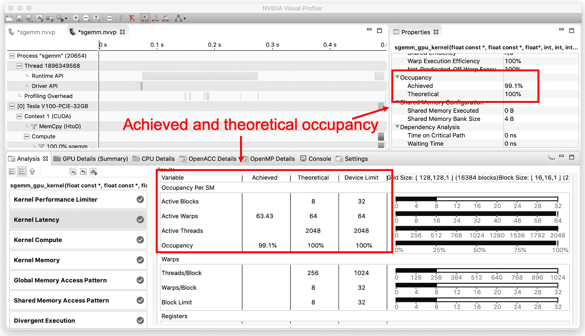

Performance showing achieved and theoretical occupancy

通过这种占用率调整，我们可以设计 CUDA 块大小，以充分利用流式多处理器中的翘曲调度。但是，这并不能解决 54.75%的内存限制问题，这是我们在上一节中发现的。这意味着，由于内存请求受阻，多处理器可能会停滞，并且无法隐藏内存访问延迟。我们将在本章中讨论如何对此进行优化，在[第 7 章](07.html)、*CUDA*中的并行编程模式中，我们将讨论矩阵-矩阵乘法优化。

# 理解平行约简

约简是一种简单但有用的算法，可以在许多参数中获得一个公共参数。这项任务可以按顺序完成，也可以并行完成。当涉及到并行架构的并行处理时，并行约简是获得直方图、平均值或任何其他统计值的最快方法。

下图显示了顺序约简和并行约简之间的区别:


通过并行执行约简任务，并行约简算法可以以对数规模减少总步骤。现在，让我们开始在 GPU 上实现这个并行约简算法。首先，我们将通过使用全局内存的简单设计来实现这一点。然后，我们将使用共享内存实现另一个缩减版本。通过比较这两种实现，我们将讨论什么会带来性能差异。

# 使用全局内存的朴素并行约简

缩减的第一个基本方法是使用并行 CUDA 线程，并使用全局内存共享缩减输出。对于每一次迭代，CUDA 内核通过将其大小减少 2 来从全局内存中获取累积值。缩减的工作方式如下图所示，该图显示了使用全局内存数据共享的简单并行缩减:

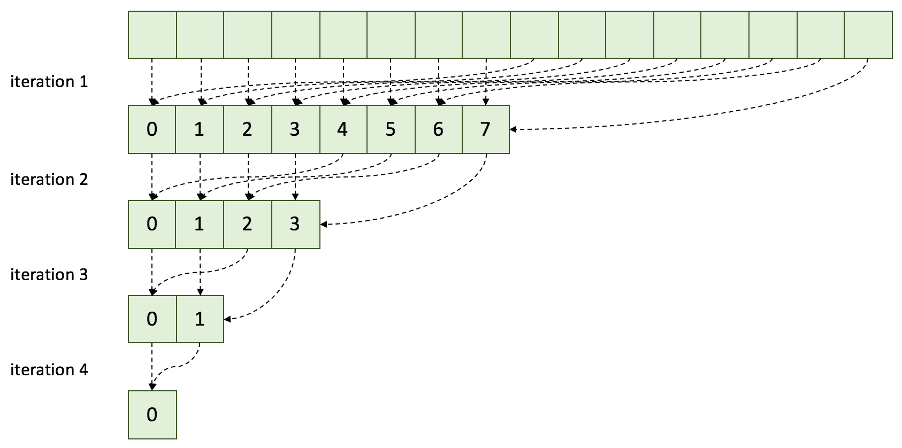

这种方法在 CUDA 中很慢，因为它浪费了全局内存的带宽，并且没有利用任何更快的片内内存。为了获得更好的性能，建议使用共享内存来节省全局内存带宽并减少内存获取延迟。稍后我们将讨论这种方法如何浪费带宽。

现在，让我们实现这种减少。首先，我们将编写约简核函数，如下所示:

```cpp
__global__ void naive_reduction_kernel
     (float *data_out, float *data_in, int stride, int size) {
     int idx_x = blockIdx.x * blockDim.x + threadIdx.x;
     if (idx_x + stride < size)
         data_out[idx_x] += data_in[idx_x + stride];
}
```

我们将调用内核函数，同时迭代地将步长减少一半，直到`stride`大小为 1，如下所示:

```cpp
void naive_reduction(float *d_out, float *d_in, int n_threads, int size) {
    int n_blocks = (size + n_threads - 1) / n_threads;
    for (int stride = 1; stride < size; stride *= 2)
        naive_reduction_kernel<<<n_blocks, n_threads>>>(d_out, d_in, stride, size);
}
```

在这个实现中，内核代码以跨越式寻址获取设备内存，并输出一个缩减结果。宿主代码为每一步触发缩减内核，参数大小减少一半。我们不能有一个内部内核循环，因为 CUDA 不能保证跨线程块和流多处理器的同步操作。

# 使用共享内存减少内核

在这种减少中，每个 CUDA 线程块减少输入值，并且 CUDA 线程使用共享内存共享数据。为了进行正确的数据更新，它们使用块级固有同步功能`__syncthreads()`。然后，下一次迭代对先前的约简结果进行操作。它的设计如下图所示，显示了使用共享内存的并行缩减:

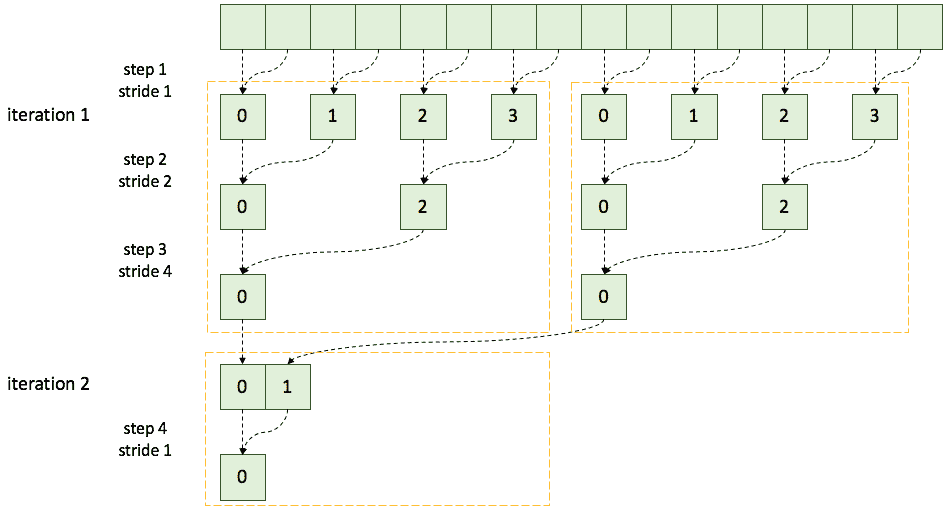

黄色虚线框表示 CUDA 线程块的操作覆盖范围。在这个设计中，每个 CUDA 线程块输出一个约简结果。

块级约简允许每个 CUDA 线程块进行约简，并输出单个约简输出。由于不需要我们将中间结果保存在全局内存中，所以 CUDA 内核可以将过渡值存储在共享内存中。这种设计有助于节省全局内存带宽并减少内存延迟。

正如我们为全球减排所做的那样，我们将实施这项行动。首先，我们将编写内核函数，如下所示:

```cpp
__global__ void reduction_kernel(float* d_out, float* d_in, 
                                 unsigned int size) {
    unsigned int idx_x = blockIdx.x * blockDim.x + threadIdx.x;

    extern __shared__ float s_data[];
    s_data[threadIdx.x] = (idx_x < size) ? d_in[idx_x] : 0.f;

    __syncthreads();

    // do reduction
    for (unsigned int stride = 1; stride < blockDim.x; stride *= 2) {
        // thread synchronous reduction
        if ( (idx_x % (stride * 2)) == 0 )
            s_data[threadIdx.x] += s_data[threadIdx.x + stride];

        __syncthreads();
    }

    if (threadIdx.x == 0)
        d_out[blockIdx.x] = s_data[0];
}
```

然后，我们将调用内核函数，如下所示:

```cpp
void reduction(float *d_out, float *d_in, int n_threads, int size)
{
    cudaMemcpy(d_out, d_in, size * sizeof(float), cudaMemcpyDeviceToDevice);
    while(size > 1) {
        int n_blocks = (size + n_threads - 1) / n_threads;
        reduction_kernel
            <<< n_blocks, n_threads, n_threads * sizeof(float), 0 >>>
            (d_out, d_out, size);
        size = n_blocks;
    }
}
```

在这段代码中，我们提供了`n_threads * sizeof (float)`字节，因为每个 CUDA 线程将为每个字节共享一个变量。

# 编写性能测量代码

为了衡量每个版本的性能，我们将使用 CUDA 示例`timer`助手函数:

```cpp
// Initialize timer
StopWatchInterface *timer;
sdkCreateTimer(&timer);
sdkStartTimer(&timer);

... Execution code ...

// Getting elapsed time
cudaDeviceSynchronize(); // Blocks the host until GPU finishes the work
sdkStopTimer(&timer);

// Getting execution time in micro-secondes
float execution_time_ms = sdkGetTimerValue(&timer)

// Termination of timer
sdkDeleteTimer(&timer);
```

该功能集有助于在微秒级测量执行时间。此外，建议在性能测量之前调用内核函数，以消除设备初始化开销。有关更详细的实现，请访问`global_reduction.cu`和`reduction.cu`文件中的实现代码。这些代码集在本章中与概要分析器一起用于评估优化效果。

# 两种缩减的性能比较—全局内存和共享内存

现在，我们可以比较两个并行约简操作的执行时间。性能可能因图形处理器和实现环境而异。分别运行以下命令进行全局缩减和使用共享内存进行缩减:

```cpp
# Reduction with global memory
$ nvcc -run -m64 -gencode arch=compute_70,code=sm_70 -I/usr/local/cuda/samples/common/inc -o reduction_global ./reduction_global.cpp reduction_global_kernel.cu

# Reduction using shared memory
$ nvcc -run -m64 -gencode arch=compute_70,code=sm_70 -I/usr/local/cuda/samples/common/inc -o reduction_shared ./reduction_shared.cpp reduction_shared_kernel.cu
```

使用我的特斯拉 V100 PCIe 卡，两种降低的估计性能如下。元素数量为*2<sup>24</sup>T3】项:*

| 

**操作**

 | 

**预计时间(毫秒)**

 | 

**加速**

 |
| 原始方法(使用全局内存进行缩减) | 

Four point six zero nine

 | 

1.0x

 |
| 使用共享内存进行还原 | 

Zero point six two four

 | 

7.4 倍

 |

从这个结果中，我们可以看到使用共享内存减少共享数据如何快速返回输出。第一个实现版本在`global_reduction.cu`中，第二个版本在`shared_reduction.cu`中，大家可以自己比较一下实现。

通过将缩减与共享内存分开，我们可以显著提高性能。然而，我们无法确定这是我们能获得的最大性能，也不知道我们的应用有什么瓶颈。为了分析这一点，我们将在下一节讨论性能限制器。

# 识别应用的性能限制

之前，我们看到了节省全局内存如何提高 CUDA 内核的性能。总的来说，使用片内缓存比使用片外内存要好。但是，通过这个简单的类比，我们无法确定是否还有很多优化空间。

性能限制器显示了限制因素，它最大程度地限制了应用的性能。基于其分析信息，它分析了计算和内存带宽之间的性能限制因素。根据这些资源的利用率，应用可以分为四种类型:**计算界限**、**带宽界限**、**延迟界限**和**计算和延迟界限**。下图显示了与计算和内存利用率相关的类别:

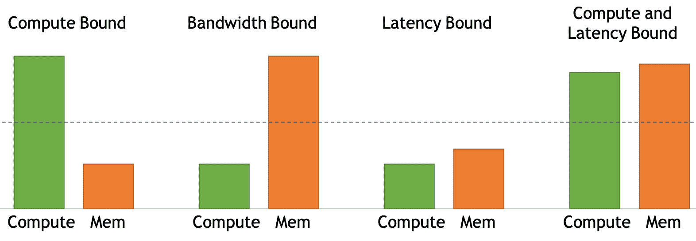

在我们确定限制器之后，我们可以使用下一个优化策略。如果两种资源的利用率都很高，我们可以集中精力优化资源。如果两者都没有得到充分利用，我们可以从系统的输入/输出方面进行延迟优化。如果两者都很高，我们可以调查是否存在内存操作停滞问题和计算相关问题。

现在让我们看看如何获取利用率信息。

# 寻找性能限制和优化

现在，让我们将这种分析应用于两种简化实现。我们将对它们进行比较，并讨论共享内存如何有助于性能限制器分析，从而提高性能。首先，让我们使用以下命令通过度量分析来分析基于内存的全局缩减应用:

```cpp
$ nvprof -o reduction_global.nvvp ./reduction_global 
$ nvprof --analysis-metrics -o reduction_global_metric.nvvp ./reduction_global
```

然后，我们将从 NVIDIA profiler 获得以下图表，其中显示了第一个基于内存的全局缩减的性能限制器:


在这个图表中，我们需要通过检查内核延迟分析来查看性能执行比率是否平衡。因为从上图中可以看出，**计算**和**内存**之间的利用率差距很大，这可能意味着由于内存瓶颈，计算会有很大的延迟。下图显示了基于采样的分析结果，我们可以确定 CUDA 内核由于内存依赖而处于饥饿状态:

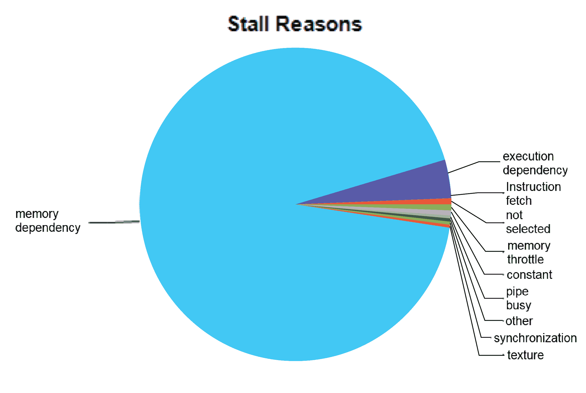

如您所见，内核执行由于内存等待而延迟。现在，让我们描述一下基于共享内存的缩减。我们可以使用以下命令来实现这一点:

```cpp
$ nvprof -o reduction_shared.nvvp ./reduction_shared 
$ nvprof --analysis-metrics -o reduction_shared_metric.nvvp ./reduction_shared
```

然后，我们将获得下面的图表，该图表显示了第二个基于共享内存的缩减的性能限制器:


我们可以确定它是计算受限的，并且内存不会饿死 CUDA 内核。

现在让我们回顾一下优化计算操作的内核操作。以下代码显示了内核函数中的并行约简部分:

```cpp
for (unsigned int stride = 1; stride < blockDim.x; stride *= 2) {
     if ( (idx_x % (stride * 2)) == 0 )
         s_data[threadIdx.x] += s_data[threadIdx.x + stride];
     __syncthreads();
 }
```

作为一种算术运算，模运算是重运算。由于`stride`变量是`2`的指数，因此可以用按位运算代替，如下所示:

```cpp
for (unsigned int stride = 1; stride < blockDim.x; stride *= 2) {
     if ( (idx_x & (stride * 2 - 1)) == 0 )
         s_data[threadIdx.x] += s_data[threadIdx.x + stride];
     __syncthreads();
 }
```

运行以下命令查看优化的输出:

```cpp
$ nvcc -run -m64 -gencode arch=compute_70,code=sm_70 -I/usr/local/cuda/samples/common/inc -o reduction_shared ./reduction_shared.cpp reduction_shared_kernel.cu
```

那么，新的估计时间为 **0.399 ms** ，我们可以实现更优化的性能，如下表所示:

| **操作** | **预计时间(毫秒)** | **加速** |
| 原始方法(使用全局内存进行缩减) | Four point six zero nine | 1.0x |
| 使用共享内存进行还原 | Zero point six two four | 7.4 倍 |
| 将条件操作从`%`更改为`&` | Zero point three nine nine | 11.55 倍 |

下图显示了更新后的性能限制器:


我们可以识别出它的操作是**计算和延时有界**。因此，我们可以确定我们可以通过优化计算效率来提高内存利用率。

# 最小化 CUDA 翘曲发散效应

在**单指令、多线程** ( **SIMT** )执行模型中，线程被分组为 32 个线程的集合，每一个集合被称为一个 **warp** 。如果一个 warp 遇到一个条件语句或分支，它的线程可以被分叉和序列化来执行每个条件。这被称为**分支发散**，对性能影响很大。

CUDA 经线发散指的是这种 CUDA 线程在经线中的发散操作。如果条件分支具有`if` - `else`结构，并且扭曲具有这种扭曲发散，则所有 CUDA 线程对于分支的代码块都具有活动和非活动的操作部分。

下图显示了 CUDA 扭曲中的扭曲发散效果。不处于空闲状态并降低 GPU 线程使用效率的 CUDA 线程:

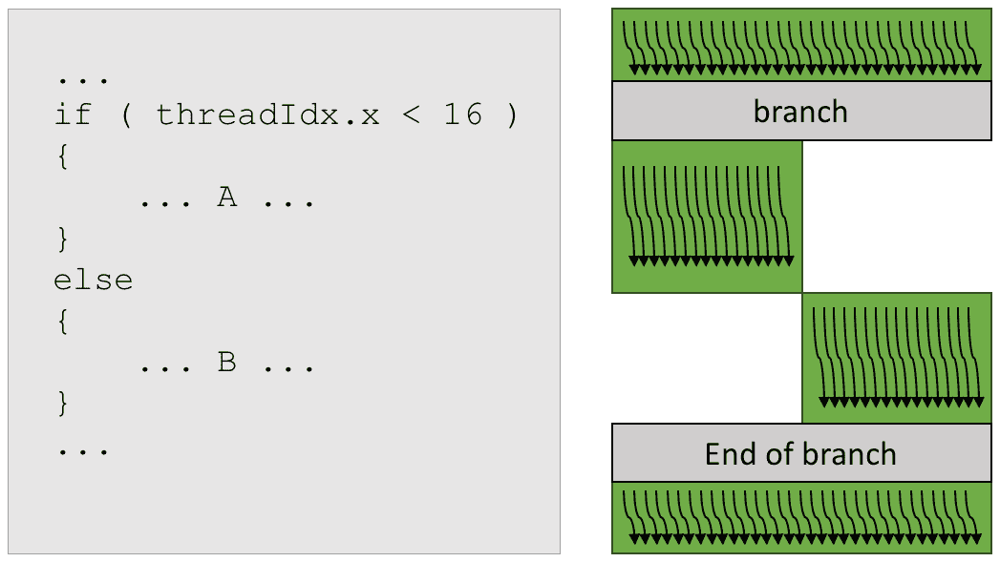

随着更多分支部分变得重要，GPU 调度吞吐量变得低效。因此，我们需要避免或最小化这种翘曲发散效应。有几个选项可以选择:

*   通过处理不同的经线来执行分支部分，从而避免发散
*   合并分枝部分以减少经线中的分枝
*   缩短分枝部分；只有关键部分需要分支
*   重新排列数据(即，调换、合并等)
*   在协作组中使用`tiled_partition`划分组

# 将发散确定为性能瓶颈

从前面的简化优化中，您可能会发现一个关于低效内核的警告，这是由于计算分析中的分歧分支，如下所示:


73.4 %的背离意味着我们有一条低效的运行路径。我们可以确定缩减解决方案是问题所在，接下来重点介绍:

```cpp
__global__ void reduction_kernel(float* d_out, float* d_in, unsigned int size) {
    unsigned int idx_x = blockIdx.x * blockDim.x + threadIdx.x;

    extern __shared__ float s_data[];
    s_data[threadIdx.x] = (idx_x < size) ? d_in[idx_x] : 0.f;

    __syncthreads();

    // do reduction
    for (unsigned int stride = 1; stride < blockDim.x; stride *= 2) {
        // thread synchronous reduction
        if ( (idx_x % (stride * 2 - 1)) == 0 )
            s_data[threadIdx.x] += s_data[threadIdx.x + stride];

        __syncthreads();
    }

    if (threadIdx.x == 0)
        d_out[blockIdx.x] = s_data[0];
}
```

说到精简寻址，我们可以选择以下 CUDA 线程索引策略之一:

*   交错寻址
*   顺序寻址

让我们回顾一下它们是什么，并通过实施这些策略来比较它们的性能。因为我们将只修改简化内核，所以我们可以在接下来的两个实现中重用宿主代码。

# 交错寻址

在这种策略中，连续的 CUDA 线程使用交错寻址策略获取输入数据。与以前的版本相比，CUDA 线程通过增加步幅值来访问输入数据。下图显示了 CUDA 线程如何与缩减项交错:


这种交错寻址可以如下实现:

```cpp
__global__ void
 interleaved_reduction_kernel(float* g_out, float* g_in, unsigned int size) {
    unsigned int idx_x = blockIdx.x * blockDim.x + threadIdx.x;

    extern __shared__ float s_data[];
    s_data[threadIdx.x] = (idx_x < size) ? g_in[idx_x] : 0.f;
    __syncthreads();

    // do reduction
    // interleaved addressing
    for (unsigned int stride = 1; stride < blockDim.x; stride *= 2) {
        int index = 2 * stride * threadIdx.x;
        if (index < blockDim.x)
            s_data[index] += s_data[index + stride];
        __syncthreads();
    }
    if (threadIdx.x == 0)
        g_out[blockIdx.x] = s_data[0];
}
```

运行以下命令来编译前面的代码:

```cpp
$ nvcc -run -m64 -gencode arch=compute_70,code=sm_70 -I/usr/local/cuda/samples/common/inc -o reduction ./reduction.cpp ./reduction_kernel_interleaving.cu
```

在特斯拉 V100 上测得的内核执行时间为 **0.446 ms** 。它比以前的版本慢，因为这种方法没有充分利用每个线程块。我们将能够通过分析其指标获得更多细节。

现在，我们将尝试另一种寻址方法，这种方法被设计为每个线程块计算更多的数据。

# 顺序寻址

与以前的版本相比，这具有高度整合的索引和寻址。这种设计效率更高，因为当步幅大于弯曲尺寸时，没有发散。下图显示了合并线程操作:

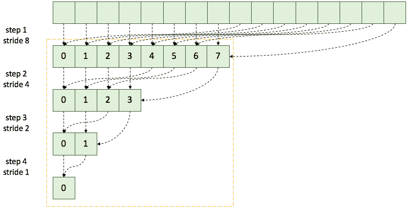

现在，让我们编写一个内核函数，对缩减项使用顺序寻址:

```cpp
__global__ void
 sequantial_reduction_kernel(float *g_out, float *g_in, 
                             unsigned int size)
{
    unsigned int idx_x = blockIdx.x * blockDim.x + threadIdx.x;

    extern __shared__ float s_data[];

    s_data[threadIdx.x] = (idx_x < size) ? g_in[idx_x] : 0.f;

    __syncthreads();

    // do reduction
    // sequential addressing
    for (unsigned int stride = blockDim.x / 2; stride > 0; 
         stride >>= 1)
    {
        if (threadIdx.x < stride)
            s_data[threadIdx.x] += s_data[threadIdx.x + stride];

        __syncthreads();
    }

    if (threadIdx.x == 0)
        g_out[blockIdx.x] = s_data[0];
}
```

运行以下命令来编译前面的代码:

```cpp
$ nvcc -run -m64 -gencode arch=compute_70,code=sm_70 -I/usr/local/cuda/samples/common/inc -o reduction ./reduction.cpp ./reduction_kernel_sequential.cu
```

它在特斯拉 V100 GPU 上的实测执行时间为 **0.378 ms** ，比之前的策略(0.399 ms)稍快。

由于避免了扭曲发散，我们可以在原始计算上获得 12.2 倍的性能增益。下图显示了更新后的性能限制器分析:

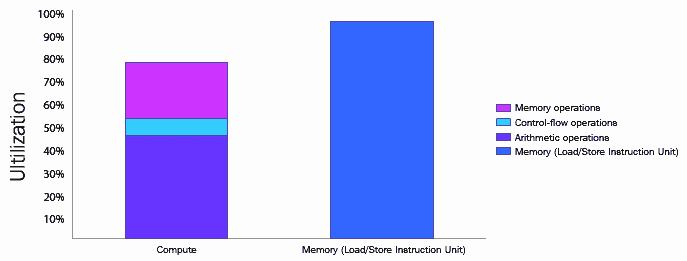

与之前的性能限制器相比，我们可以看到控制流操作的减少和内存利用率的提高。

# 限制器的性能建模和平衡

在性能限制器分析之后，我们当前的降低性能受到内存带宽导致的计算延迟的限制，尽管限制器分析显示了每个资源的充分利用。让我们解释一下为什么这是一个问题，以及我们如何通过遵循屋顶线性能模型来解决这个问题。

# 屋顶模型

**屋顶线模型**是一个直观的可视化性能分析模型，用于为并行处理单元上的给定计算内核提供估计性能。基于这个模型，并行编程中的开发人员可以识别算法应该绑定到什么，并确定应该优化哪个。

下图显示了屋顶线模型的示例:


倾斜部分表示受记忆限制，平坦部分表示受算术限制。每个并行算法和实现都有自己的屋顶线模型，因为它们具有不同的计算能力和内存带宽。有了这个模型，算法可以根据它们的操作强度(触发器/字节)来放置。如果一个实现没有达到这个模型的预期性能，我们可以确定这个版本是受延迟限制的。

考虑到我们的并行约简的复杂性，它必须是受内存限制的。换句话说，它的操作强度低，所以我们的策略应该尽可能地最大化内存带宽。

因此，我们需要使用分析器中的性能分析来确认我们的缩减内核函数是如何消耗内存带宽的。下图显示了全局内存的带宽使用情况:


如图所示，我们没有充分利用内存带宽。在特斯拉 V100 GPU 上，总带宽为 343.376 GB/s，由于该 GPU 具有 900 GB/s 带宽的 HBM2 内存，因此它利用了大约三分之一的带宽。因此，下一步是通过让每个 CUDA 线程消化更多的数据来增加带宽使用。这将解决延迟受限的情况，并使我们的应用受限于内存带宽。

现在，让我们讨论如何增加内存带宽。

# 利用网格环最大化内存带宽

我们可以用一个简单的想法实现这一点。约简问题允许我们用 CUDA 线程积累输入数据并开始约简操作。以前，我们的缩减实现从输入数据大小开始。但是现在，我们将使用一组 CUDA 线程迭代输入数据，这个大小将是我们内核函数的网格大小。这种迭代风格被称为网格纹循环。这种技术对于控制多个 CUDA 内核有很多好处，在本文中介绍:[https://dev blogs . NVIDIA . com/CUDA-pro-tip-write-flexible-kernel-grid-stride-loops](https://devblogs.nvidia.com/cuda-pro-tip-write-flexible-kernels-grid-stride-loops)。

下面的代码显示了更新后的约简内核函数:

```cpp
__global__ void reduction_kernel(float *g_out, float *g_in, 
                                 unsigned int size) {
    unsigned int idx_x = blockIdx.x * blockDim.x + threadIdx.x;
    extern __shared__ float s_data[];

    // cumulates input with grid-stride loop 
 // and save to the shared memory
 float input = 0.f;
 for (int i = idx_x; i < size; i += blockDim.x * gridDim.x)
 input += g_in[i];
 s_data[threadIdx.x] = input;
 __syncthreads();

    // do reduction
    for (unsigned int stride = blockDim.x / 2; stride > 0; 
         stride >>= 1) {
        if (threadIdx.x < stride)
            s_data[threadIdx.x] += s_data[threadIdx.x + stride];
        __syncthreads();
    }
    if (threadIdx.x == 0)
        g_out[blockIdx.x] = s_data[0];
}

```

你会发现这个内核函数首先专注于积累输入数据，然后减少加载的数据。

现在，我们需要确定网格大小。为了让我们的 GPU 代码在各种 GPU 目标上运行，我们必须在运行时确定它们的大小。此外，我们需要利用 GPU 中的所有多处理器。CUDA C 提供相关功能。我们可以使用`cudaOccpancyMaxActiveBlocksPerMultiprocessor()`函数获得每个多处理器的占用感知最大活动块。此外，我们可以使用`cudaDeviceGetAttribte()`功能获得目标图形处理器上的多处理器号。下面的代码展示了我们如何使用这些函数并调用内核函数:

```cpp
int reduction(float *g_outPtr, float *g_inPtr, int size, int n_threads)
{
    int num_sms;
    int num_blocks_per_sm;
    cudaDeviceGetAttribute(&num_sms, 
                           cudaDevAttrMultiProcessorCount, 0);
    cudaOccupancyMaxActiveBlocksPerMultiprocessor(&num_blocks_per_sm, 
           reduction_kernel, n_threads, n_threads*sizeof(float));
    int n_blocks = min(num_blocks_per_sm * num_sms, (size 
                       + n_threads - 1) / n_threads);

    reduction_kernel<<<n_blocks, n_threads, n_threads * 
                       sizeof(float), 0>>>(g_outPtr, g_inPtr, size);
    reduction_kernel<<<1, n_threads, n_threads * sizeof(float), 
                       0>>>(g_outPtr, g_inPtr, n_blocks);
    return 1;
}
```

这个函数还有一个额外的修改。为了节省占用率计算开销，它用单个块再次启动`reduction_kernel()`功能。运行以下命令:

```cpp
$ nvcc -run -m64 -gencode arch=compute_70,code=sm_70 -I/usr/local/cuda/samples/common/inc -o reduction ./reduction.cpp ./reduction_kernel.cu
```

在一台特斯拉 V100 上更新后的还原性能为 **0.278** **ms** ，比之前的方法快了 100 ms 左右。

现在，让我们回顾一下如何利用内存带宽。下图显示了 Visual Profiler 中的内存利用率分析，并显示了我们如何将内存带宽增加了两倍:


虽然它显示带宽增加，但我们仍有进一步增加的空间。让我们讨论如何获得更多带宽。

# 平衡输入/输出吞吐量

从我们从分析器得到的结果来看，局部变量输入有大量的加载/存储请求。由于操作依赖性，这种大规模的输入/输出会影响线程块的调度。当前数据积累中最糟糕的是它依赖于设备内存。因此，我们将使用额外的寄存器发布更多的加载指令来缓解依赖性。下面的代码展示了我们如何做到这一点:

```cpp
#define NUM_LOAD 4
__global__ void
 reduction_kernel(float *g_out, float *g_in, unsigned int size)
{
    unsigned int idx_x = blockIdx.x * blockDim.x + threadIdx.x;

    extern __shared__ float s_data[];

    // cumulates input with grid-stride loop 
    // and save to the shared memory
    float input[NUM_LOAD] = {0.f};
    for (int i = idx_x; i < size; i += blockDim.x * 
         gridDim.x * NUM_LOAD)
    {
        for (int step = 0; step < NUM_LOAD; step++)
            input[step] += (i + step * blockDim.x * gridDim.x < size) ? 
                g_in[i + step * blockDim.x * gridDim.x] : 0.f;
    }
    for (int i = 1; i < NUM_LOAD; i++)
        input[0] += input[i];
    s_data[threadIdx.x] = input[0];

    __syncthreads();

    // do reduction
    for (unsigned int stride = blockDim.x / 2; stride > 0; 
         stride >>= 1)
    {
        if (threadIdx.x < stride)
            s_data[threadIdx.x] += s_data[threadIdx.x + stride];

        __syncthreads();
    }

    if (threadIdx.x == 0) {
        g_out[blockIdx.x] = s_data[0];
    }
}
```

这段代码使用另外三个寄存器来收集全局内存数据。`NUM_LOAD`的值会因 GPU 而异，因为它会受到 GPU 内存带宽和 GPU 中 CUDA 内核数量的影响:


运行以下命令时，使用特斯拉 V100 卡获得的性能为 **0.264** 毫秒:

```cpp
$ nvcc -run -m64 -gencode arch=compute_70,code=sm_70 -I/usr/local/cuda/samples/common/inc -o reduction ./reduction.cpp ./reduction_kernel_opt.cu
```

# 翘曲级原语编程

CUDA 9.0 引入了新的 warp 同步编程。这一重大变化旨在避免 CUDA 编程依赖隐式扭曲同步操作和显式处理同步目标。这有助于防止扭曲同步操作中的疏忽竞争条件和死锁。

历史上，CUDA 只为线程块中的 CUDA 线程提供了一个显式同步应用编程接口`__syncthreads()`，它依赖于扭曲的隐式同步。下图显示了 CUDA 线程块操作的两个同步级别:


然而，最新的图形处理器架构(沃尔特和图灵)有一个增强的线程控制模型，其中每个线程可以执行不同的指令，而他们保持其 SIMT 编程模型。下图显示了它的变化情况:


在帕斯卡架构(左)之前，线程是在扭曲级别调度的，它们在扭曲中隐式同步。因此，弯曲中的 CUDA 线程隐式同步。然而，这有意外的死锁可能性。

Volta 架构对此进行了翻新，引入了**独立线程调度**。这种控制模型使每个 CUDA 线程都有自己的程序计数器，并允许一组线程参与一个扭曲。在这个模型中，我们必须使用一个显式的同步应用编程接口来指定每个 CUDA 线程的操作。

因此，CUDA 9 引入了显式的翘曲级原语函数:

|  | 

**扭曲级基本函数**

 |
| 

**识别活动线程**

 | `__activemask()` |
| 

**屏蔽活动线程**

 | `__all_sync()`、`__any_sync()`、`__uni_sync()`、`__ballot_sync()``__match_any_sync()`、`__match_all_sync()` |
| 

**同步数据交换**

 | `__shfl_sync()`、`__shfl_up_sync()`、`__shfl_down_sync()`、`__shfl_xor_sync()` |
| 

**线程同步**

 | `__syncwarp()` |

有三类扭曲方向的基本函数，它们是扭曲识别、扭曲操作和同步。所有这些函数都隐式指定同步目标，以避免意外的竞争情况。

# 使用扭曲图元的并行缩减

让我们看看这对我们的并行缩减实现有什么好处。该配方将在协作组中使用`shfl_down()`功能，在扭曲图元功能中使用`shfl_down_sync()`。下图显示了`shfl_down_sync()`如何进行降档操作:

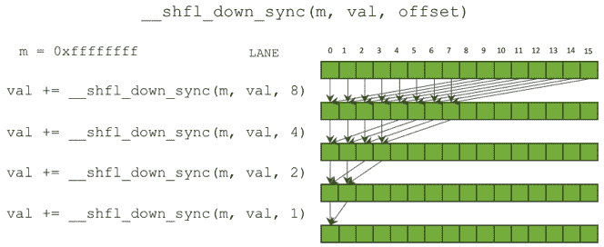

在这个集合操作中，一个经线中的 CUDA 线程可以将指定的寄存器值转移到同一经线中的另一个线程，并与之同步。具体来说，集合操作有两个步骤(第三个是可选的):

1.  识别、屏蔽或投票在一个将要进行操作的扭曲中寻找 CUDA 线程。
2.  让 CUDA 线程转移数据。
3.  翘曲中的所有 CUDA 线程都是同步的(可选)。

对于并行约简问题，我们可以使用`__shfl_down_sync()`进行翘曲级约简。现在，我们可以通过下图来增强线程块级别的减少:


每个扭曲的缩减结果都存储到共享内存中，以便与其他扭曲共享。然后，通过再次执行扭曲收集，可以获得最终的块级缩减。

We use `__shfl_down_sync()` since we need only one thread to have warp-level reduction. If you need to make all the CUDA threads have warp-level reduction, you can use `__shfl_xor_sync()` instead.

第一次块级缩减的数量是网格的维数，输出存储在全局内存中。通过再次调用，我们可以使用扭曲级同步函数构建一个并行约简内核。

现在，让我们使用扭曲级基本函数来实现扭曲级缩减。首先，我们将编写一个函数，使用扭曲移动函数来减少扭曲级别。下面的代码显示了如何实现这一点:

```cpp
__inline__ __device__ float warp_reduce_sum(float val) {
    for (int offset = warpSize / 2; offset > 0; offset >>= 1) {
        unsigned int mask = __activemask();
        val += __shfl_down_sync(mask, val, offset);
    }
    return val;
}
```

对于翘曲移位，我们需要让 CUDA 调度器识别活动线程，让翘曲移位函数进行缩减。

第二步是使用之前的扭曲级缩减编写一个块级缩减函数。我们将在共享内存中收集之前的结果，并根据结果进行第二次缩减。下面的代码显示了如何实现这一点:

```cpp
__inline__ __device__ float block_reduce_sum(float val) {
    // Shared mem for 32 partial sums
    static __shared__ float shared[32]; 
    int lane = threadIdx.x % warpSize;
    int wid = threadIdx.x / warpSize;

    val = warp_reduce_sum(val); // Warp-level partial reduction
    if (lane == 0)
        shared[wid] = val; // Write reduced value to shared memory
    __syncthreads(); // Wait for all partial reductions

    //read from shared memory only if that warp existed
    if (wid == 0) {
        val = (threadIdx.x < blockDim.x / warpSize) ? shared[lane] : 0;
        val = warp_reduce_sum(val); //Final reduce within first warp
    }
    return val;
}
```

现在，我们将实现累积输入数据的约简核函数，并根据我们已经实现的块级约简进行约简。由于我们只是专注于优化翘曲级优化，所以整体设计与之前的版本相同。下面的代码显示了内核函数:

```cpp
__global__ void
reduction_kernel(float *g_out, float *g_in, unsigned int size) {
    unsigned int idx_x = blockIdx.x * blockDim.x + threadIdx.x;
    // cumulates input with grid-stride loop and save to share memory
    float sum[NUM_LOAD] = { 0.f };
    for (int i = idx_x; i < size; i += blockDim.x * gridDim.x * NUM_LOAD) {
        for (int step = 0; step < NUM_LOAD; step++)
            sum[step] += (i + step * blockDim.x * gridDim.x < size) ? g_in[i + step * blockDim.x * gridDim.x] : 0.f;
    }
    for (int i = 1; i < NUM_LOAD; i++)
        sum[0] += sum[i];
    // warp synchronous reduction
    sum[0] = block_reduce_sum(sum[0]);

    if (threadIdx.x == 0)
        g_out[blockIdx.x] = sum[0];
}
```

然后，让我们使用以下命令编译代码:

```cpp
$ nvcc -run -m64 -gencode arch=compute_70,code=sm_70 -I/usr/local/cuda/samples/common/inc -o reduction ./reduction.cpp ./reduction_wp_kernel.cu
```

下面的截图显示了执行时间的减少:


没有主机代码修改可用于从扭曲原语切换到协作组。因此，我们可以对两个简化实现使用相同的宿主代码。

我们已经介绍了 CUDA 中的翘曲同步编程。它的应用不仅仅限于约简，还可以用于其他并行算法:扫描、二进制排序和转置。如果您需要了解更多信息，可以查看以下文章:

*   [http://on-demand . gputechconf . com/GTC/2017/presentation/s 7622-Kyrylo-perelygin-robust-and-scalable-cuda . pdf](http://on-demand.gputechconf.com/gtc/2017/presentation/s7622-Kyrylo-perelygin-robust-and-scalable-cuda.pdf)
*   [https://devblogs . NVIDIA . com/using-cuda-warp-level-primitive/](https://devblogs.nvidia.com/using-cuda-warp-level-primitives/)
*   [https://dev blogs . NVIDIA . com/fast-parallel-reductions-Kepler/](https://devblogs.nvidia.com/faster-parallel-reductions-kepler/)
*   [http://on-demand . gputechconf . com/GTC/2013/presentations/S3174-Kepler-Shuffle-Tips-ticks . pdf](http://on-demand.gputechconf.com/gtc/2013/presentations/S3174-Kepler-Shuffle-Tips-Tricks.pdf)

# 灵活线程处理的协作组

CUDA 9.0 引入了名为**协作组**的新 CUDA 编程特性。这引入了一种新的 CUDA 编程设计模式，通过指定分组操作来实现 CUDA 集合操作。利用这一点，程序员可以编写 CUDA 代码，明确地控制 CUDA 线程。

首先，让我们看看什么是协作组及其编程优势。

# CUDA 线程块中的协作组

协作组提供了显式的 CUDA 线程分组对象，这有助于程序员更清楚、更方便地编写集体操作。例如，我们需要获得一个掩码来控制扭曲中的活动 CUDA 线程，以进行扭曲移动操作。另一方面，协作组对象将可用的线程绑定为一个瓦片，我们将它们作为一个对象来控制。这给 CUDA C 编程带来了 C++ 语言的好处。

合作小组的基本类型是`thread_group`。这将启用一个 C++ 类风格的类型`thread_group`，它可以通过`is_valid()`、`size()`和`thread_rank()`功能提供其配置信息。此外，这提供了可以应用于组中所有 CUDA 线程的集合函数。这些功能如下:

|  | 

thread_group 集合函数

 |
| 

**识别活动线程**

 | `tiled_partition()`、`coalesced_threads()` |
| 

**屏蔽活动线程**

 | `any()`、`all()`、`ballot()``match_any()`、`match_all()` |
| 

**同步数据交换**

 | `shfl()`、`shfl_up()`、`shfl_down()`、`shfl_xor()` |
| 

**线程同步**

 | `sync()` |

这些函数列表类似于扭曲级基本函数。因此，扭曲级别的基本操作可以用协作组来代替。`thread_group`可以被更小的`thread_group`、`thread_block_tile`或`coalesced_group`分割。

协作组还提供了线程块编程的灵活性。使用下面一行代码，我们可以处理一个线程块:

```cpp
thread_block block = this_thread_block();
```

`thread_block`提供 CUDA 内置的关键字换行功能，我们用它来获取一个块索引和线程索引:

```cpp
dim3 group_index();  // 3-dimensional block index within the grid
dim3 thread_index(); // 3-dimensional thread index within the block
```

我们可以使用`this_thread_block()`获得一个线程块对象，如下所示:

```cpp
thread_block block = this_thread_block();
```

现在，让我们看看与传统的 CUDA 内置变量相比，合作组的优势是什么。

# 合作团体的好处

使用协作组提供了更多的 C++ 可编程性，而不是使用传统的 CUDA 内置变量。使用`thread_block`组，您可以将内核代码从使用内置变量切换到合作组的索引。但是，合作团体的真正力量不止于此。让我们在以下几节中介绍它的优点。

# 模块性

通过协作组，程序员可以模块化他们对应于障碍目标的集体操作内核代码。这有助于避免疏忽，假设所有线程都在并发运行，从而导致死锁和争用情况。下面是一个死锁和 CUDA 线程同步正常操作的例子:

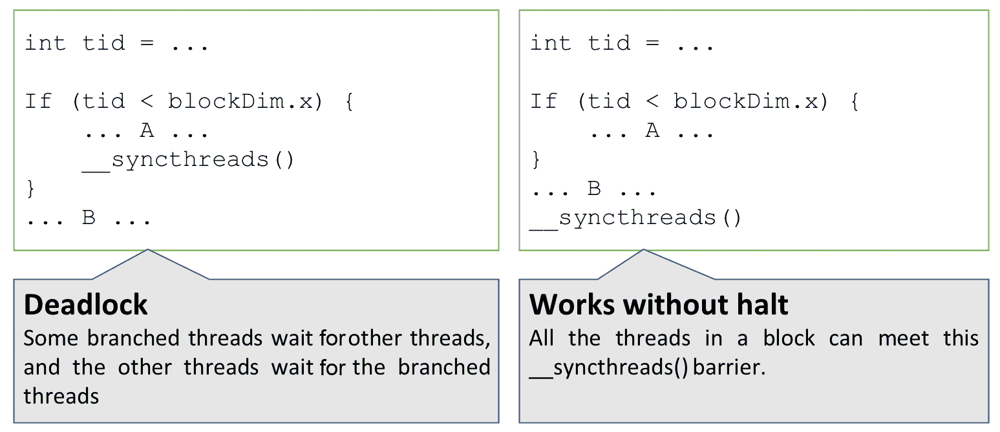

对于左边的例子，内核代码打算同步 CUDA 线程块中的一部分线程。这段代码通过指定屏障目标来最小化同步开销。但是，它引入了死锁情况，因为`__syncthreads()`调用了一个屏障，等待所有 CUDA 线程到达该屏障。但是`__synchthroead()`不能满足其他人，等待。右手边的例子显示了合理的操作，因为它没有任何死锁点，因为线程块中的所有线程都可以满足`__syncthreads()`。

另一方面，在协作组应用编程接口中，CUDA 程序员指定要同步的线程组。协作组启用显式同步目标，以便程序员可以让 CUDA 线程显式同步。这个项目也可以被视为一个实例，这样我们就可以将这个实例传递给设备函数。

下面的代码显示了协作组如何提供显式同步对象，并让它们作为实例来处理:

```cpp
__device__ bar(thread_group block, float *x) {
    ...
    block.sync();
    ...
}

__global__ foo() {
    bar(this_thread_block(), float *x);
}
```

正如您在前面的示例代码中看到的，内核代码可以指定同步组，并将它们作为参数作为`thread_group`传递。这有助于我们在子程序中指定同步目标。因此，程序员可以通过使用协作组来防止无意中的死锁。此外，我们可以将不同类型的组设置为`thread_group`类型，并重用同步代码。

# 显式分组线程操作和竞争条件避免

协作组通过在扭曲中平铺线程来支持扭曲级别的协作操作。如果图块大小与扭曲大小匹配，CUDA 可以省略扭曲的隐式同步，确保正确的内存操作以避免争用情况。通过消除隐式同步，可以提高图形处理器的性能。历史上，有经验的 CUDA 程序员使用分离的扭曲进行扭曲级同步。这意味着扭曲中的协同操作不必与其他扭曲操作同步。这释放了 GPU 性能。然而，这是有风险的，因为它在合作操作之间引入了竞争条件。

# 动态活动线程选择

CUDA 协作组的另一个好处是程序员可以在扭曲中选择活动线程，以避免分支发散效应。由于 CUDA 是一个 SIMT 体系结构，一个指令单元发出一组线程，如果它们遇到一个分支，就没有办法禁用发散。但是，从 CUDA 9.0 开始，程序员可以使用`coalesced_threads()`选择将在分支块中活动的活动线程。这将通过禁用不采用分支的线程来返回合并的线程。然后，SM 的指令单元发出活动线程组中的下一个活动线程。

# 应用于平行归约

我们将更新之前的简化内核代码，以使用协作组。从前面的内核代码中，您可以很容易地应用协作组“`thread_block`”，如下所示:

```cpp
__global__ void
 reduction_kernel(float* g_out, float* g_in, unsigned int size)
{
    unsigned int idx_x = blockIdx.x * blockDim.x + threadIdx.x;

    thread_block block = this_thread_block();

    extern __shared__ float s_data[];
```

我们不必更新数据输入累积部分，所以让我们更新每个线程块的缩减部分。以下代码显示了块大小缩减的示例:

```cpp
    // do reduction
    for (unsigned int stride = block.group_dim().x / 2; stride > 0; 
         stride >>= 1) {
        if (block.thread_index().x < stride) {
            s_data[block.thread_index().x] += 
                s_data[block.thread_index().x + stride];
            block.sync(); // threads synchronization in a branch
        }
    }
}
```

使用以下命令，估计操作性能为 0.264 毫秒:

```cpp
$ nvcc -run -m64 -gencode arch=compute_70,code=sm_70 -I/usr/local/cuda/samples/common/inc -o reduction_cg -rdc=true ./reduction.cpp ./reduction_cg_kernel.cu 
```

前面的命令显示了与以前版本相同的性能。

# 避免僵局的合作小组

协作组可以支持独立的 CUDA 线程调度。因此，我们可以用一个组单独控制 CUDA 线程，并显式同步它们。目标组可以是预定义的图块，但也可以根据条件分支确定，如下所示:

```cpp
// do reduction
for (unsigned int stride = block.group_dim().x / 2; stride > 0; 
     stride >>= 1) {
    // scheduled threads reduce for every iteration
    // and will be smaller than a warp size (32) eventually.
    if (block.thread_index().x < stride) { 
        s_data[block.thread_index().x] += s_data[
                       block.thread_index().x + stride];

        // __syncthreads(); // (3) Error. Deadlock.
        // block.sync();    // (4) Okay. Benefit of Cooperative Group
    }
    // __syncthreads();     // (1) Okay
    block.sync();           // (2) Okay
}
```

这段代码有四个线程块同步选项。选项`(1)`和`(2)`是具有不同 API 的等价操作。另一方面，选项`(3)`和`(4)`则没有。选项`(3)`引入了 CUDA 线程的死锁，主机不能有 CUDA 内核的返回，因为活动的 CUDA 线程不能与未激活的 CUDA 线程同步。另一方面，由于协作组的自动活动线程识别，选项`(4)`起作用。这有助于我们避免意外错误，并轻松开发复杂的算法。

英伟达在以下文档中提供了合作小组的详细描述:

*   [https://devblogs.nvidia.com/cuda-9-features-revealed](https://devblogs.nvidia.com/cuda-9-features-revealed)
*   [http://on-demand . gputechconf . com/GTC/2017/presentation/s 7622-Kyrylo-perelygin-robust-and-scalable-cuda . pdf](http://on-demand.gputechconf.com/gtc/2017/presentation/s7622-Kyrylo-perelygin-robust-and-scalable-cuda.pdf)

你也可以从`cooperative_groups.h`本身了解它的架构和完整的 API 列表。

# CUDA 内核中的循环展开

CUDA 也可以像其他编程语言一样获得循环展开的好处。通过这种技术，CUDA 线程可以减少或消除循环控制开销，例如每次迭代的循环结束测试、分支惩罚等等。

如果 CUDA 编译器能够识别循环的迭代次数，它会自动展开小循环。程序员也可以放置`#pragma unroll`指令给编译器一个提示，或者只是将循环代码重写为一组独立的语句。应用循环展开很简单，因此您可以很容易地将它应用到当前的工作代码中。

让我们将此应用到我们的并行约简实现中。就像 C/C++ 中的普通循环展开指令一样，我们可以将`#pragma`循环展开指令放在`for`循环之上。NVCC 编译器可以展开循环，因为编译器可以自己获得`group.size()`的精确大小:

```cpp
template <typename group_t>
__inline__ __device__ float
 warp_reduce_sum(group_t group, float val)
{
    #pragma unroll
    for (int offset = group.size() / 2; offset > 0; offset >>= 1)
        val += group.shfl_down(val, offset);
    return val;
}
```

使用以下命令，估计操作性能为 0.263 毫秒:

```cpp
$ nvcc -run -m64 -gencode arch=compute_70,code=sm_70 -I/usr/local/cuda/samples/common/inc -o reduction_cg -rdc=true ./reduction.cpp ./reduction_cg_kernel.cu
```

如果你更喜欢使用翘曲图元功能，可以像下面这样写`warp_reduce_sum`。通过将`group.size()`替换为`warpSize`，可以重用循环代码，但是在这种情况下，这稍微快了一点:

```cpp
#define FULL_MASK 0xFFFFFFFF
__inline__ __device__ float
warp_reduce_sum(float val) {
#pragma unroll 5
    for (int offset = 1; offset < 6; offset++)
        val += __shfl_down_sync(FULL_MASK, val, warpSize >> offset);
    return val;
}
```

运行以下命令来编译前面的代码:

```cpp
nvcc -run -m64 -gencode arch=compute_70,code=sm_70 -I/usr/local/cuda/samples/common/inc -o reduction_wp -rdc=true ./reduction.cpp ./reduction_wp_kernel.cu
```

其结果为 0.263 ms，与之前的结果相同。

使用循环展开有一个陷阱。展开的代码执行可能会因寄存器使用增加而导致占用率降低。此外，由于代码执行大小增加，指令高速缓存未命中损失可能更大。

# 原子操作

在 CUDA 编程中，程序员可以使用原子 API 来更新来自多个 CUDA 线程的共享资源。这些原子应用编程接口保证消除共享资源的竞争条件，因此我们可以期待并行执行的一致输出。该操作对于获取统计参数(如直方图、平均值、总和等)特别有用。我们还可以简化代码实现。例如，可以使用以下代码中的`atomicAdd()`函数编写归约操作:

```cpp
__global__ void
 atomic_reduction_kernel(float *data_out, float *data_in, int size)
 {
     int idx_x = blockIdx.x * blockDim.x + threadIdx.x;
     atomicAdd(&data_out[0], data_in[idx_x]);
 }
```

如您所见，原子函数简化了所需的操作。但是，它的性能很慢，因为原子操作将所有请求序列化到共享资源。运行以下命令查看执行时间:

```cpp
$ nvcc -run -m64 -gencode arch=compute_70,code=sm_70 -I/usr/local/cuda/samples/common/inc -o mixed_precision_single ./mixed_precision.cu
```

在我的特斯拉 V100 上显示的这个内核功能花费了 39 毫秒，这比原始版本(4.609 毫秒)慢得多。因此，推荐的原子操作用法是仅在必要时限制请求。例如，对于并行约简问题，我们可以在某个级别上并行约简项目，并使用原子操作来输出最终结果。

下图显示了另一种可能的方法。这取代了块式缩减为`atomicAdd`:

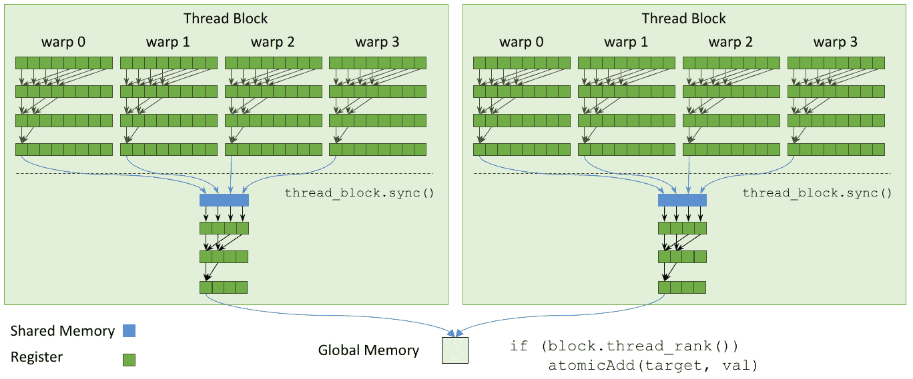

在上图中，我们可以看到有两个约简点:一个**扭曲**和一个**线程块**，分块约简结果由单个全局内存变量原子性地累加。因此，我们可以消除第二次约简迭代。下面的截图显示了第二次缩减迭代的内核优化优先级(左边)和性能限制分析(右边):


Kernel Optimization Priorities with Performance Limiter Analysis (2nd iteration)

换句话说，第二次迭代的性能受到延迟的限制，因为它的网格很小。因此，我们可以通过删除它来减少执行时间。

现在，让我们实现这个设计，看看如何改变性能。我们只需要更新缩减内核函数的最后一部分:

```cpp
__global__ void
 reduction_kernel(float* g_out, float* g_in, unsigned int size)
{
    unsigned int idx_x = blockIdx.x * (2 * blockDim.x) + threadIdx.x;

    thread_block block = this_thread_block();

    // cumulates input with grid-stride loop and save to share memory
    float sum[NUM_LOAD] = { 0.f };
    for (int i = idx_x; i < size; i += blockDim.x 
         * gridDim.x * NUM_LOAD)
    {
        for (int step = 0; step < NUM_LOAD; step++)
            sum[step] += (i + step * blockDim.x * gridDim.x < size) ? 
                         g_in[i + step * blockDim.x * gridDim.x] : 0.f;
    }
    for (int i = 1; i < NUM_LOAD; i++)
        sum[0] += sum[i];
    // warp synchronous reduction
    sum[0] = block_reduce_sum(block, sum[0]);

    sum[0] = block_reduce_sum(sum[0]);

    // Performing Atomic Add per block
    if (block.thread_rank() == 0) {
        atomicAdd(&g_out[0], sum);
    }
}
```

然后，我们将删除第二次迭代函数调用。因此，如果原子操作的延迟比这更短，我们可以消除内核调用延迟并获得更好的性能。运行以下命令:

```cpp
$ nvcc -run -m64 -gencode arch=compute_70,code=sm_70 -I/usr/local/cuda/samples/common/inc -o reduction_atomic_block ./reduction.cpp ./reduction_blk_atmc_kernel.cu
```

幸运的是，在特斯拉 V100 上，估计的执行时间为 0.259 毫秒，因此我们可以获得稍微增强的结果。

如果你想了解更多 CUDA C 中的原子操作，请点击此链接查看编程指南:[https://docs . NVIDIA . com/CUDA/CUDA-C-编程-指南/index . html #原子-函数](https://docs.nvidia.com/cuda/cuda-c-programming-guide/index.html#atomic-functions)。

# 低/混合精度操作

混合精度是一种探索低精度的技术，可以获得高精度的结果。这种技术以低精度计算核心运算，并以高精度运算生成输出。与高精度计算相比，低精度运算计算具有减少内存带宽和提高计算吞吐量的优点。如果低精度足以从高精度应用中获得目标精度，这种技术可以在这种折衷的情况下提高性能。NVIDIA 开发者博客介绍这种可编程性:[https://devblogs . NVIDIA . com/mixed-precision-programming-cuda-8](https://devblogs.nvidia.com/mixed-precision-programming-cuda-8)。

在这种情况下，CUDA 将其支持扩展到低于 32 位数据类型的低精度工具，如 8/16 位整数(INT8/INT16)和 16 位浮点(FP16)。对于那些低精度的数据类型，一个 GPU 可以使用**单指令，多数据** ( **SIMD** )操作，带有一些特定的 API。在本节中，我们将研究这两种针对混合精度目的的低精度操作的指令。

为了从中获益，您需要确认您的 GPU 能够支持低混合精度操作和支持数据类型。在特定的图形处理器中支持低精度计算是可能的，精度因图形处理器芯片组而异。具体来说，GP102(特斯拉 P40 和泰坦 X)、GP104(特斯拉 P4)、GP106 支持 INT8 而 GP100(特斯拉 P100)和 GV100(特斯拉 V100)支持 FP16(半精密)操作。特斯拉 GV100 兼容 INT8 操作，性能没有下降。

CUDA 具有一些特殊的内在功能，支持低精度数据类型的 SIMD 运算。

# 半精密操作

CUDA 为半尺寸浮点数据类型(FP16)提供了内在函数，开发人员可以选择 CUDA 是为每条指令计算一个值还是两个值。CUDA 还提供单精度和半精度之间的类型转换功能。由于 FP16 的精度限制，您必须使用固有转换来处理单精度值。

现在，让我们实现并测试 GPU 的 FP16 操作。图形处理器可以支持比计算能力 5.3 更高的本机计算。但是有些 GPU 不支持这个，所以请仔细检查你的 GPU 是否支持这个半精度操作。

CUDA C 中的半精度数据类型是`half`，但是也可以使用`__half`类型。对于应用编程接口，CUDA 用这个数据类型提供相关的内部函数，如`__hfma()`、`__hmul()`和`__hadd()`。这些内在函数还使用`__hfma2()`、`__hmul2()`和`__hadd2()`同时为本机操作提供两个数据。有了这些函数，我们可以编写混合精度的操作内核代码:

```cpp
__global__ void hfma_kernel(half *d_x, half *d_y, float *d_z, int size)
 {
     int idx_x = blockIdx.x * blockDim.x + threadIdx.x;
     int stride = gridDim.x * blockDim.x;

     half2 *dual_x = reinterpret_cast<half2*>(d_x);
     half2 *dual_y = reinterpret_cast<half2*>(d_y);
     float2 *dual_z = reinterpret_cast<float2*>(d_z);

     extern __shared__ float2 s_data[];

 #if __CUDA_ARCH__ >= 530
     for (int i = idx_x; i < size; i+=stride) {
         s_data[threadIdx.x] = __half22float2(__hmul2(dual_y[i], 
                                                      dual_x[i]));
         __syncthreads();
         dual_z[i] = s_data[threadIdx.x];
     }
     #else
     for (int i = idx_x; i < size; i+=stride) {
         s_data[threadIdx.x] = __half22float2(dual_x[i]) * 
                               __half22float2(dual_y[i]);
         __syncthreads();
         dual_z[i] = s_data[threadIdx.x];
     }
     #endif
 }
```

对于那些不支持本机半精度操作的图形处理器，我们的代码在编译时检查 CUDA 的计算能力，并确定它应该采取哪种操作。

由于每个 CUDA 线程将操作两个数据，下面的代码使用一半大小的网格调用内核函数:

```cpp
int n_threads = 256;
int num_sms;
int num_blocks_per_sm;
cudaDeviceGetAttribute(&num_sms, cudaDevAttrMultiProcessorCount, 0);
cudaOccupancyMaxActiveBlocksPerMultiprocessor(&num_blocks_per_sm,   
    hfma_kernel, n_threads, n_threads*sizeof(float2));
int n_blocks = min(num_blocks_per_sm * num_sms, 
                   (size/2 + n_threads - 1) / n_threads);
hfma_kernel<<< n_blocks, n_threads, n_threads * sizeof(float2) 
               >>>(X.d_ptr_, Y.d_ptr_, Z.d_ptr_, size/2);
```

其他初始化代码和基准代码在示例配方代码中实现，请查看。

我们已经报道了 FP16 精确操作中的 FMA 操作。CUDA C 提供各种半精度运算([https://docs . NVIDIA . com/CUDA/CUDA-MATH-API/group _ _ CUDA _ _ MATH _ _ INTRINSIC _ _ half . html](https://docs.nvidia.com/cuda/cuda-math-api/group__CUDA__MATH__INTRINSIC__HALF.html))。请检查其他操作。

# 8 位整数和 16 位数据的点积运算和累加(DP4A 和 DP2A)

对于 8 位/16 位整数，CUDA 提供矢量化点积运算。它们是 DP4A(具有累加的四元点积)和 DP2A(具有累加的二元点积)。使用这些功能，CUDA 开发人员可以进行更快的操作。CUDA 8.0 开发博客用直观的图形介绍了这些功能([https://devblogs . NVIDIA . com/mixed-precision-programming-CUDA-8/](https://devblogs.nvidia.com/mixed-precision-programming-cuda-8/))。下面显示了图形处理器的点积和累加操作是如何工作的:

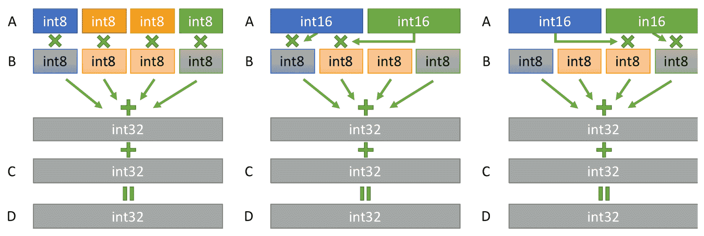

使用它，您可以只编写 8 位或 8 位/16 位混合运算，并进行 32 位整数累加。其他操作，如求和、相加和比较，也适用于 SIMD 内在函数。

如前所述，有特定的 GPU 可以支持具有特殊功能的 INT8/INT16 操作(`dp4a`和`dp2a`)。支持图形处理器的计算能力必须高于 6.1。

现在，让我们实现一个使用`dp4a` API 的内核函数，如下所示:

```cpp
__global__ void dp4a_kernel(char *d_x, char *d_y, int *d_z, int size)
 {
     int idx_x = blockIdx.x * blockDim.x + threadIdx.x;
     int stride = gridDim.x * blockDim.x;

 #if __CUDA_ARCH__ >= 610
     char4 *quad_x = (char4 *)d_x;
     char4 *quad_y = (char4 *)d_y;

     for (int i = idx_x; i < size; i+=stride)
         d_z[i] = __dp4a(quad_y[i], quad_x[i], 0);
 #else
     for (int i = idx_x; i < size; i+=4*stride) {
         int sum = 0;
         for (int j = 0; j < 4; j++)
             sum += d_y[4 * i + j] * d_x[4 * i + j];
         d_z[i] = sum + 0;
     }
 #endif
 }
```

在该函数中，`__dp4a`获取两个字符数组合并四个项目，并输出其点积输出。由于 Pascal 具有 CUDA 计算能力(版本 6.1)，因此支持该应用编程接口。但是低于 6.1 版本的老 GPU 架构，需要使用原来的操作。

下面的代码显示了我们将如何调用实现的内核函数。它的网格大小减少了四个，因为每个 CUDA 线程将对四个项目进行操作:

```cpp
int n_threads = 256;
int num_sms;
int num_blocks_per_sm;
cudaDeviceGetAttribute(&num_sms, cudaDevAttrMultiProcessorCount, 0);
cudaOccupancyMaxActiveBlocksPerMultiprocessor(&num_blocks_per_sm, 
    dp4a_kernel, n_threads, n_threads*sizeof(int));
int n_blocks = min(num_blocks_per_sm * num_sms, (size/4 + n_threads 
                                                  - 1) / n_threads);
dp4a_kernel<<< n_blocks, n_threads, n_threads * sizeof(int) >>>  
    (X.d_ptr_, Y.d_ptr_, Z.d_ptr_, size/4);
```

其他初始化代码和基准代码在示例代码中实现，例如前面的示例代码。

我们已经介绍了 INT8 的点操作，但是 CUDA C 还提供了其他 INT8 类型的 SIMD 内在函数([https://docs . NVIDIA . com/CUDA/CUDA-MATH-API/group _ _ CUDA _ _ MATH _ _ INTRINSIC _ _ SIMD . html](https://docs.nvidia.com/cuda/cuda-math-api/group__CUDA__MATH__INTRINSIC__SIMD.html))。请检查此文档以了解其他操作。

# 衡量绩效

示例代码有三个版本的混合精度操作:单精度、半精度和 INT8。随着精度的下降，我们可以为每个 CUDA 线程添加更多的操作。

针对单精度、半精度和 INT8 操作运行以下命令:

```cpp
# Single-precision
$ nvcc -run -m64 -gencode arch=compute_70,code=sm_70 -I/usr/local/cuda/samples/common/inc -o mixed_precision_single ./mixed_precision.cu

# Half-precision
$ nvcc -run -m64 -gencode arch=compute_70,code=sm_70 -I/usr/local/cuda/samples/common/inc -o mixed_precision_half ./mixed_precision_half.cu

# INT8 
$ nvcc -run -m64 -gencode arch=compute_70,code=sm_70 -I/usr/local/cuda/samples/common/inc -o mixed_precision_int ./mixed_precision_int.cu
```

下表显示了每个精密操作的估计性能:

| 精确 | 测量性能 |
| FP32 | 59，441 格弗洛姆 |
| FP16 | 86.037 格弗洛普斯 |
| INT8 | 196，225 戈巴 |

由于我们的实现没有优化，测量的性能比特斯拉 V100 的理论性能低得多。当你分析它们时，它们会报告说它们是高度内存受限的。换句话说，我们需要优化它们，使其在算术上有界，以获得接近理论的性能。

# 摘要

在本章中，我们介绍了如何配置 CUDA 并行操作并对其进行优化。为此，我们必须了解 CUDA 的分层架构线程块和流式多处理器之间的关系。通过一些性能模型——占用率、性能限制器分析和屋顶模型——我们可以优化更多的性能。然后，我们介绍了一些新的 CUDA 线程可编程性，协作组，并了解了这如何简化并行编程。我们优化了并行约简问题，用元素实现了 0.259 ms，在相同的 GPU 下速度提升了 17.8 倍。最后，我们了解了 CUDA 的半精度(FP16)和 INT8 精度的 SIMD 操作。

我们本章的经验集中在 GPU 的并行处理级编程上。然而，CUDA 编程包括系统级编程。基本上，GPU 是一种额外的计算资源，独立于主机工作。这带来了额外的计算能力，但另一方面也会带来延迟。CUDA 提供的 API 函数可以利用这一点，隐藏延迟，并实现 GPU 的全部性能。我们将在下一章讨论这个问题。