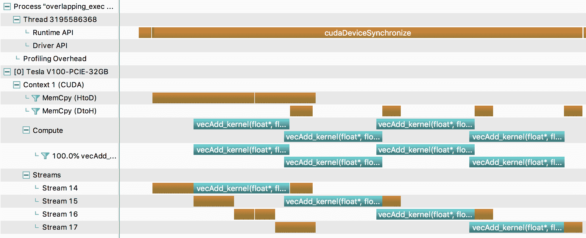
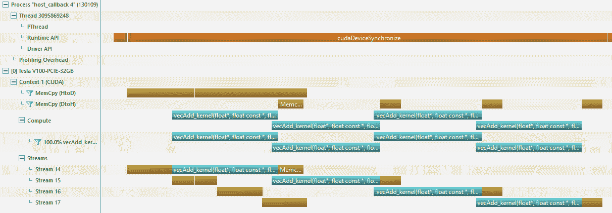
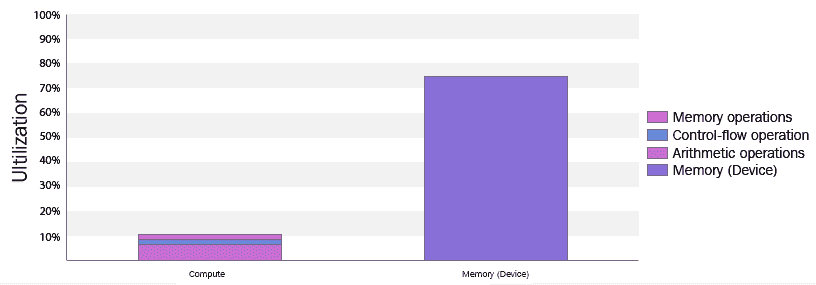
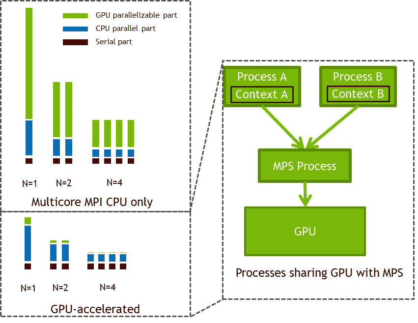
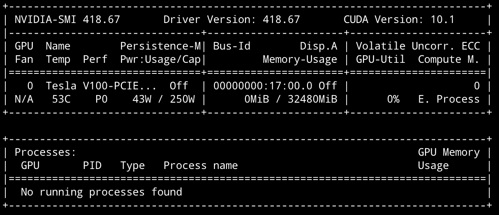
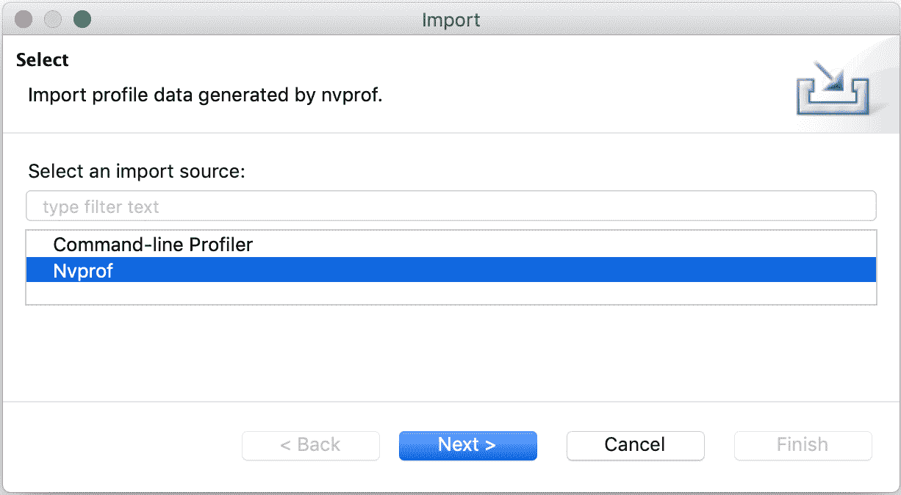
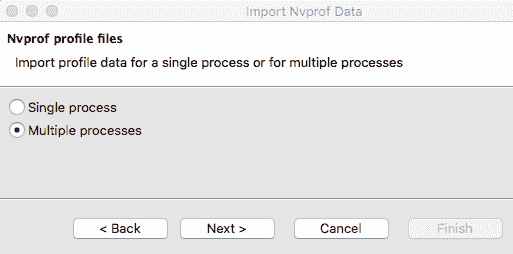
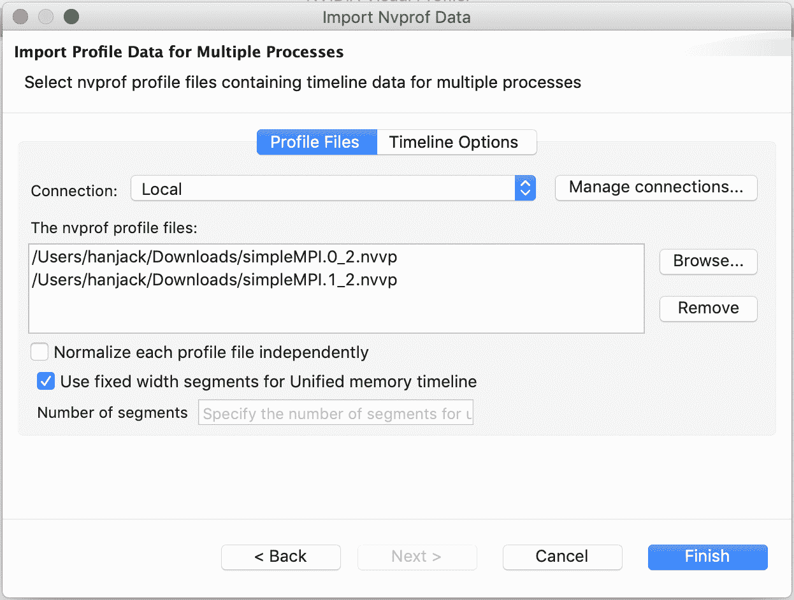

# 四、内核执行模型及优化策略

CUDA 编程有一个主机操作的程序。例如，我们需要分配全局内存，将数据传输到 GPU，执行内核函数，将数据传输回主机，并清理全局内存。这是因为 GPU 是系统中的一个额外处理单元，所以我们需要关心它的执行和数据传输。这是 GPU 编程的另一个方面，与 CPU 编程不同。

在本章中，我们将介绍控制 CUDA 操作的 CUDA 内核执行模型和 CUDA 流。然后，我们将讨论系统级的优化策略。然后，我们将介绍 CUDA 事件来度量 GPU 事件时间，以及如何使用 CUDA 事件来度量内核执行时间。之后，我们将介绍各种 CUDA 内核执行模型，并讨论这些特性给 GPU 操作带来了什么。

本章将涵盖以下主题:

*   用 CUDA 流执行内核
*   流水线图形处理器执行
*   CUDA 回调函数
*   具有优先级的 CUDA 流
*   使用 CUDA 事件估计内核执行时间
*   CUDA 动态并行
*   网格级协作组
*   用 OpenMP 调用 CUDA 内核
*   多进程服务
*   内核执行开销比较

# 技术要求

本章要求我们使用 9.x 以后的 CUDA 版本，GPU 架构应该是 Volta 或者 Turing。如果您使用具有 Pascal 架构的 GPU，请跳过*网格级协作组*部分，因为该功能是为 Volta 架构引入的。

# 用 CUDA 流执行内核

流是在 CUDA 编程中与图形处理器相关的命令序列。换句话说，所有内核调用和数据传输都由 CUDA 流处理。默认情况下，CUDA 提供一个默认流，所有命令都隐式使用该流。因此，我们不必自己处理这个问题。

CUDA 支持显式创建的附加流。虽然流中的操作是顺序的，但 CUDA 可以通过使用多个流同时执行多个操作。让我们学习如何处理流，以及它们有什么特性。

# CUDA 流的使用

以下代码显示了如何创建、使用和终止 CUDA 流的示例:

```cpp
cudaStream_t stream;
cudaStreamCreate(&stream);
foo_kernel<<< grid_size, block_size, 0, stream >>>();
cudaStreamDestroy(stream);
```

如您所见，我们可以使用`cudaStream_t`处理一个 CUDA 流。并且，我们可以使用`cudaStreamCreate()`创建它，并使用`cudaStreamDestroy()`终止它。注意，我们应该提供一个指向`cudaStreamCreate()`的指针。创建的流被传递给内核的第四个参数。

但是，我们之前没有提供这样的流。这是因为 CUDA 提供了一个默认流，这样所有的 CUDA 操作都可以运行。现在，让我们编写一个使用默认流和多个流的应用。然后，我们将看到如何更改我们的应用。

首先，让我们编写一个使用默认 CUDA 流的应用，如下所示:

```cpp
__global__ void foo_kernel(int step)
{
    printf("loop: %d\n", step);
}

int main()
{
    for (int i = 0; i < 5; i++)
 // CUDA kernel call with the default stream
 foo_kernel<<< 1, 1, 0, 0 >>>(i);
    cudaDeviceSynchronize();
    return 0;
}
```

在代码中可以看到，我们调用的内核函数的流 ID 为`0`，因为默认流的标识值为`0`。编译代码并查看执行输出:

```cpp
$ nvcc -m64 -run -gencode arch=compute_70,code=sm_70 -I/usr/local/cuda/samples/common/inc -o cuda_default_stream ./1_cuda_default_stream.cu
```

产量如何？我们可以预期输出将是循环索引的顺序。以下时间线视图显示了此代码的操作:


可以预期，在同一个流中进行循环操作会显示内核执行的顺序。那么，如果我们使用多个 CUDA 流，并且每个循环步骤使用不同的流，那么可以改变什么呢？下面的代码显示了用不同的流从 CUDA 内核函数打印循环索引的示例:

```cpp
__global__ void foo_kernel(int step)
{
    printf("loop: %d\n", step);
}

int main()
{
    int n_stream = 5;
    cudaStream_t *ls_stream;
    ls_stream = (cudaStream_t*) new cudaStream_t[n_stream];

    // create multiple streams
    for (int i = 0; i < n_stream; i++)
        cudaStreamCreate(&ls_stream[i]);

    // execute kernels with the CUDA stream each
    for (int i = 0; i < n_stream; i++)
        foo_kernel<<< 1, 1, 0, ls_stream[i] >>>(i);

    // synchronize the host and GPU
    cudaDeviceSynchronize();

    // terminates all the created CUDA streams
    for (int i = 0; i < n_stream; i++)
        cudaStreamDestroy(ls_stream[i]);
    delete [] ls_stream;

    return 0;
}
```

在这段代码中，我们有五个调用，与前面的代码相同，但是这里我们将使用五个不同的流。为此，我们构建了一个`cudaStream_t`数组，并为每个数组创建了流。你对这种变化有什么期待？打印输出将与以前的版本相同。运行以下命令编译此代码:

```cpp
$ nvcc -m64 -run -gencode arch=compute_70,code=sm_70 -I/usr/local/cuda/samples/common/inc -o cuda_mutli_stream ./2_cuda_multi_stream.cu
```

然而，这并不能保证他们有相同的操作。正如我们在开始时所讨论的，这段代码显示了多个流的并发性，如下图所示:


正如你在截图底部看到的，五个独立的流并发执行同一个内核函数，它们的操作相互重叠。由此，我们可以看出溪流的两个特征，如下所示:

1.  内核执行与主机异步。
2.  不同流中的 CUDA 操作相互独立。

利用流的并发性，我们可以通过重叠独立的操作来获得额外的优化机会。

# 流级同步

CUDA 流通过`cudaStreamSynchronize()`功能提供流级同步。使用此函数会强制主机等待某个流的操作结束。这为我们到目前为止使用的`cudaDeviceSynchronize()`功能提供了重要的优化。

我们将在接下来的章节中讨论如何利用这个特性，但是让我们在这里讨论它的基本操作。前面的示例显示了循环中没有同步的并发操作。但是，我们可以使用`cudaStreamSynchronize()`函数暂停主机执行下一个内核执行。下面的代码显示了在内核执行结束时使用流同步的示例:

```cpp
// execute kernels with the CUDA stream each
for (int i = 0; i < n_stream; i++) {
   foo_kernel<<< 1, 1, 0, ls_stream[i] >>>(i);
   cudaStreamSynchronize(ls_stream[i]);
}
```

我们可以很容易地预测，内核操作的并发性会因为同步而消失。为了证实这一点，让我们对其进行概要分析，看看这如何影响内核执行:

```cpp
$ nvcc -m64 -run -gencode arch=compute_70,code=sm_70 -I/usr/local/cuda/samples/common/inc -o cuda_mutli_stream_with_sync ./3_cuda_multi_stream_with_sync.cu
```

下面的截图显示了结果:


如您所见，所有内核执行都没有重叠点，尽管它们是用不同的流执行的。使用这个特性，我们可以让主机等待特定的流操作以结果开始。

# 使用默认流

为了让多个流同时运行，我们应该使用我们显式创建的流，因为所有流操作都与默认流同步。下面的截图显示了默认流的同步操作效果:


我们可以通过修改我们的多流内核调用操作来实现这一点，如下所示:

```cpp
for (int i = 0; i < n_stream; i++)
    if (i == 3)
        foo_kernel<<< 1, 1, 0, 0 >>>(i);
    else
        foo_kernel<<< 1, 1, 0, ls_stream[i] >>>(i);
```

运行以下命令编译代码:

```cpp
$ nvcc -m64 -run -gencode arch=compute_70,code=sm_70 -I/usr/local/cuda/samples/common/inc -o cuda_multi_stream_with_default ./4_cuda_multi_stream_with_default.cu
```

因此，我们可以看到最后一个操作不能与之前的内核执行重叠，但是我们必须等到第四个内核执行完成。

# 流水线化图形处理器的执行

多个流的主要好处之一是将数据传输与内核执行相重叠。通过重叠内核操作和数据传输，我们可以隐藏数据传输开销并提高整体性能。

# 图形处理器流水线的概念

当我们执行内核函数时，我们需要将数据从主机传输到 GPU。然后，我们将结果从 GPU 传输回主机。下图显示了在主机和内核执行之间传输数据的迭代操作示例:


然而，内核执行基本上是异步的，因为主机和 GPU 可以同时运行。如果主机和 GPU 之间的数据传输具有相同的特性，我们将能够重叠它们的执行，正如我们在前面部分中看到的。下图显示了当数据传输可以像正常内核操作一样执行，并与流一起处理时的操作:


在这个图中，我们可以看到主机和设备之间的数据传输可以与内核执行重叠。然后，这种重叠操作的好处是减少了应用的执行时间。通过比较两张图片的长度，您将能够确认哪个操作具有更高的操作吞吐量。

关于 CUDA 流，所有 CUDA 操作——数据传输和内核执行——在同一个流中都是顺序的。然而，它们可以与不同的流同时运行。下图显示了多个流的内核操作的重叠数据传输:


为了实现这样的流水线操作，CUDA 有三个先决条件:

1.  主机内存应该作为固定内存分配——CUDA 为此提供了`cudaMallocHost()`和`cudaFreeHost()`功能。
2.  在不阻塞主机的情况下，在主机和图形处理器之间传输数据——CUDA 为此提供了`cudaMemcpyAsync()`功能。
3.  管理每个操作以及不同的 CUDA 流，以实现并发操作。

现在，让我们编写一个简单的应用来传递工作负载。

# 构建流水线执行

下面的代码显示了异步数据传输的一个片段，以及在执行结束时 CUDA 流的同步:

```cpp
cudaStream_t stream;
float *h_ptr, *d_ptr;    size_t byte_size = sizeof(float) * BUF_SIZE;

cudaStreamCreate(&stream);               // create CUDA stream
cudaMallocHost(h_ptr, byte_size);        // allocates pinned memory
cudaMalloc((void**)&d_ptr, byte_size);   // allocates a global memory

// transfer the data from host to the device asynchronously
cudaMemcpyAsync(d_ptr, h_ptr, byte_size, cudaMemcpyHostToDevice, stream);

... { kernel execution } ...

// transfer the data from the device to host asynchronously
cudaMemcpyAsync(h_ptr, d_ptr, byte_size, cudaMemcpyDeviceToHost, stream);
cudaStreamSynchronize(stream);

// terminates allocated resources
cudaStreamDestroy(stream);
cudaFree(d_ptr);
cudaFreeHost(h_ptr);
```

这段代码展示了如何分配固定内存，以及如何使用用户创建的流传输数据。通过合并这个例子和多个 CUDA 流操作，我们可以得到流水线化的 CUDA 操作。

现在，让我们构建一个具有数据传输和内核执行的流水线操作的应用。在这个应用中，我们将使用一个内核函数，通过对流的数量进行切片来添加两个向量，并输出其结果。然而，内核实现并不需要对其进行任何更改，因为我们将在宿主代码级别进行更改。但是，我们将重复加法操作 500 次，以延长内核执行时间。因此，实现的内核代码如下:

```cpp
__global__ void
vecAdd_kernel(float *c, const float* a, const float* b)
{
    int idx = blockIdx.x * blockDim.x + threadIdx.x;

    for (int i = 0; i < 500; i++)
        c[idx] = a[idx] + b[idx];
}
```

为了处理每个流的操作，我们将创建一个管理 CUDA 流和 CUDA 操作的类。这个类将允许我们管理 CUDA 流和索引。下面的代码显示了该类的基本体系结构:

```cpp
class Operator
{
private:
    int index;

public:
    Operator() {
        cudaStreamCreate(&stream);    // create a CUDA stream
    }

    ~Operator() {
        cudaStreamDestroy(stream);    // terminate the CUDA stream
    }

    cudaStream_t stream;
    void set_index(int idx) { index = idx; }
    void async_operation(float *h_c, const float *h_a, 
                         const float *h_b,
                         float *d_c, float *d_a, float *d_b,
                         const int size, const int bufsize);

}; // Operator
```

现在，让我们编写一些顺序的 GPU 执行代码，我们在前面的部分中已经使用过，但是作为`Operator`类的成员函数，如下所示:

```cpp
void Operator::async_operation(float *h_c, const float *h_a, 
                          const float *h_b,
                          float *d_c, float *d_a, float *d_b,
                          const int size, const int bufsize)
{
    // start timer
    sdkStartTimer(&_p_timer);

    // copy host -> device
    cudaMemcpyAsync(d_a, h_a, bufsize, 
                    cudaMemcpyHostToDevice, stream);
    cudaMemcpyAsync(d_b, h_b, bufsize, 
                    cudaMemcpyHostToDevice, stream);

    // launch cuda kernel
    dim3 dimBlock(256);
    dim3 dimGrid(size / dimBlock.x);
    vecAdd_kernel<<< dimGrid, dimBlock, 0, 
                     stream >>>(d_c, d_a, d_b);

    // copy device -> host
    cudaMemcpyAsync(h_c, d_c, bufsize, 
                    cudaMemcpyDeviceToHost, stream);

    printf("Launched GPU task %d\n", index);
}
```

该函数的操作与我们之前使用的基本 CUDA 主机编程模式没有什么不同，只是我们在给定的`_stream`上应用了`cudaMemcpyAsync()`。然后，我们编写`main()`来处理多个运算符实例和页锁定内存:

```cpp
int main(int argc, char* argv[])
{
    float *h_a, *h_b, *h_c;
    float *d_a, *d_b, *d_c;
    int size = 1 << 24;
    int bufsize = size * sizeof(float);
    int num_operator = 4;

    if (argc != 1)
        num_operator = atoi(argv[1]);
```

现在，我们将使用`cudaMallocHost()`来分配主机内存以拥有固定内存，并初始化它们:

```cpp
    cudaMallocHost((void**)&h_a, bufsize);
    cudaMallocHost((void**)&h_b, bufsize);
    cudaMallocHost((void**)&h_c, bufsize);

    srand(2019);
    init_buffer(h_a, size);
    init_buffer(h_b, size);
    init_buffer(h_c, size);
```

而且，我们将拥有同样大小的设备存储器:

```cpp
    cudaMalloc((void**)&d_a, bufsize);
    cudaMalloc((void**)&d_b, bufsize);
    cudaMalloc((void**)&d_c, bufsize);
```

现在，我们将使用我们使用的类创建一个 CUDA 操作符列表:

```cpp
    Operator *ls_operator = new Operator[num_operator];
```

我们准备执行流水线操作。在开始执行之前，让我们放置一个秒表来查看整体执行时间，并查看重叠数据传输的好处，如下所示:

```cpp
    StopWatchInterface *timer;
    sdkCreateTimer(&timer);
    sdkStartTimer(&timer);
```

让我们使用一个循环来执行每个操作符，每个操作符将根据它们的顺序访问主机和设备内存。我们还将测量循环的执行时间:

```cpp
    for (int i = 0; i < num_operator; i++) {
        int offset = i * size / num_operator;
        ls_operator[i].set_index(i);
        ls_operator[i].async_operation(&h_c[offset], 
                                       &h_a[offset], &h_b[offset],
                                       &d_c[offset], 
                                       &d_a[offset], &d_b[offset],
                                       size / num_operator, 
                                       bufsize / num_operator);
    }

    cudaDeviceSynchronize();
    sdkStopTimer(&timer);
```

最后，我们将比较一个示例的结果，并打印出总体测量性能:

```cpp
    // prints out the result
    int print_idx = 256;
    printf("compared a sample result...\n");
    printf("host: %.6f, device: %.6f\n", h_a[print_idx] + 
           h_b[print_idx], h_c[print_idx]);

    // prints out the performance
    float elapsed_time_msed = sdkGetTimerValue(&timer);
    float bandwidth = 3 * bufsize * sizeof(float) / 
                      elapsed_time_msed / 1e6;
    printf("Time= %.3f msec, bandwidth= %f GB/s\n", 
           elapsed_time_msed, bandwidth);
```

终止句柄和内存，如下所示:

```cpp
    sdkDeleteTimer(&timer);
    delete [] ls_operator;
    cudaFree(d_a);    cudaFree(d_b);    cudaFree(d_c);
    cudaFreeHost(h_a);cudaFreeHost(h_b);cudaFreeHost(h_c);
```

为了执行代码，让我们重用前面菜谱中的主机初始化函数和 GPU 内核函数。我们现在不必修改这些函数。使用以下命令编译代码:

```cpp
$ nvcc -m64 -run -gencode arch=compute_70,code=sm_70 -I/usr/local/cuda/samples/common/inc -o cuda_pipelining ./cuda_pipelining.cu
```

您必须将您的图形处理器的计算能力版本号用于`gencode`选项。编译的输出如下:

```cpp
Launched GPU task 0
Launched GPU task 1
Launched GPU task 2
Launched GPU task 3
compared a sample result...
host: 1.523750, device: 1.523750
Time= 29.508 msec, bandwidth= 27.291121 GB/s
```

正如我们所看到的，GPU 任务是按照内核执行的顺序和流一起执行的。

现在，让我们回顾一下应用内部是如何运行的。默认情况下，示例代码将主机数据分成四部分，并发执行四个 CUDA 流。我们可以看到每个内核的输出以及流的执行。要查看重叠操作，您需要使用以下命令分析执行情况:

```cpp
$ nvprof -o overlapping_exec.nvvp ./overlapping_exec
```

下面的截图显示了四个 CUDA 流的操作，通过重叠数据传输和内核执行:



Overlaps between the kernel executions and data transfers

因此，GPU 可以一直忙到最后一次内核执行完成，我们可以隐藏大部分的数据传输。这不仅提高了图形处理器的利用率，还减少了应用的总执行时间。

在内核执行之间，我们可以发现虽然它们属于不同的 CUDA 流，但是没有一个没有争用。这是因为 GPU 调度器知道执行请求，并服务于第一个请求。然而，当当前任务完成时，流式多处理器可以服务于另一个 CUDA 流中的下一个内核，因为它们仍然被占用。

在所有多个 CUDA 流操作结束时，我们需要同步主机和 GPU，以确认 GPU 上的所有 CUDA 操作都已完成。为此，我们在循环后立即使用`cudaDeviceSynchronize()`。该功能可以在调用点同步所有选中的 GPU 操作。

对于同步任务，我们可以用下面的代码替换`cudaDeviceSynchronize()`函数。为此，我们还必须将私有成员`_stream`更改为公共成员:

```cpp
for (int i = 0; i < num_operator; i++) {
    cudaStreamSynchronize(ls_operator[i]._stream);
}
```

当我们需要在每个流结束后，从单个主机线程和流一起提供特定的操作时，可以使用这种方法。但是，这不是一个好的操作设计，因为下面的操作无法避免与其他流同步。

在循环中使用`cudaStreamSynchronize()`怎么样？在这种情况下，我们无法执行之前的重叠操作。下面的截图显示了这种情况:


这是因为`cudaStreamSynchronize()`将同步每次迭代，应用将相应地序列化所有的 CUDA 执行。在这种情况下，执行时间被测量为 41.521 毫秒，比重叠的执行时间慢大约 40%。

# CUDA 回调函数

**CUDA 回调函数**是由 GPU 执行上下文执行的可调用的宿主函数。利用这一点，程序员可以在 GPU 操作之后指定主机期望的主机操作。

CUDA 回调函数有一个名为`CUDART_CB`的特殊数据类型，所以应该用这个类型来定义。通过这种类型，程序员可以指定哪个 CUDA 流启动该功能，传递 GPU 错误状态，并提供用户数据。

注册回调函数，CUDA 提供`cudaStreamAddCallback()`。该函数接受 CUDA 流、CUDA 回调函数及其参数，这样就可以从指定的 CUDA 流中调用指定的 CUDA 回调函数并获取用户数据。这个函数有四个输入参数，但最后一个是保留的。因此，我们不使用该参数，它保持为`0`。

现在，让我们增强代码以使用回调函数并输出单个流的性能。如果你想把之前的工作和这个分开，请复制源代码。

首先，将这些函数声明放入`Operator`类的`private`区域:

```cpp
StopWatchInterface *_p_timer;
static void CUDART_CB Callback(cudaStream_t stream, cudaError_t status, void* userData);
void print_time();
```

在每个流的操作完成后将调用`Callback()`函数，并且`print_time()`函数将使用主机端定时器`_p_timer`报告估计的性能。这些功能的实现如下:

```cpp
void Operator::CUDART_CB Callback(cudaStream_t stream, cudaError_t status, void* userData) {
    Operator* this_ = (Operator*) userData;
    this_->print_time();
}

void Operator::print_time() {
    sdkStopTimer(&p_timer);    // end timer
    float elapsed_time_msed = sdkGetTimerValue(&p_timer);
    printf("stream %2d - elapsed %.3f ms \n", index, 
           elapsed_time_msed);
}
```

为了有正确的定时器操作，我们需要在`Operator`类的构造器上有一个定时器初始化器，在类的终止器上有一个定时器破坏器。另外，我们必须在`Operator::async_operation()`功能开始时启动计时器。然后，在函数的末尾插入以下代码块。这允许 CUDA 流在完成之前的 CUDA 操作时调用主机端函数:

```cpp
// register callback function
cudaStreamAddCallback(stream, Operator::Callback, this, 0);
```

现在，让我们编译并查看执行结果。您必须为`gencode`选项使用您的图形处理器的计算能力版本号:

```cpp
$ nvcc -m64 -run -gencode arch=compute_70,code=sm_70 -I/usr/local/cuda/samples/common/inc -o cuda_callback ./cuda_callback.cu
```

这是我们更新的执行结果:

```cpp
stream 0 - elapsed 11.136 ms
stream 1 - elapsed 16.998 ms
stream 2 - elapsed 23.283 ms
stream 3 - elapsed 29.487 ms
compared a sample result...
host: 1.523750, device: 1.523750
Time= 29.771 msec, bandwidth= 27.050028 GB/s
```

在这里，我们可以看到预计的执行时间以及 CUDA 流。回调函数估计其序列的执行时间。由于与其他流有重叠，并且后期 CUDA 流有延迟，所以我们可以看到后期 CUDA 流的执行时间延长了。我们可以通过与分析结果进行匹配来确认这些经过的时间，如下所示:



虽然它们测量的运行时间随着流的执行而延长，但是流之间的增量是有规律的，我们可以从分析的输出中看到这些操作。

因此，我们可以得出结论，我们可以编写主机代码，在每个单独的 CUDA 流操作完成后立即运行。并且，这是一个高级的方法来同步来自主线程的每个流。

# 具有优先级的 CUDA 流

默认情况下，所有 CUDA 流具有相同的优先级，因此它们可以以正确的顺序执行操作。除此之外，CUDA 流也可以有优先级，并且可以被更高优先级的流取代。有了这个特性，我们就可以拥有满足时间要求的 GPU 操作。

# 统一数据自动化系统的优先事项

为了使用具有优先级的流，我们需要首先从 GPU 获得可用的优先级。我们可以使用`cudaDeviceGetStreamPriorityRange()`函数获得这些。它的输出是两个数值，分别是最低优先级值和最高优先级值。然后，我们可以使用`cudaStreamCreaetWithPriority()`功能创建优先级流，如下所示:

```cpp
cudaError_t cudaStreamCreateWithPriority(cudaStream_t* pStream, unsigned int flags, int priority)
```

我们应该提供另外两个参数。第一个用默认流确定创建的流的行为。我们可以使用`cudaStreamDefault`使新流与默认流同步，就像普通流一样。另一方面，我们可以使用`cudaStreamNonBlocking`使其与默认流并发运行。最后，我们可以在优先级范围内设置流的优先级。在 CUDA 编程中，最低的值具有最高的优先级。

此外，我们可以使用以下代码来确认 GPU 是否支持这一点。但是，我们不必对此过于担心，因为自 CUDA 计算能力 3.5 以来，优先级流已经可用:

```cpp
cudaDeviceProp prop;
cudaGetDeviceProperties(&prop, 0);
if (prop.streamPrioritiesSupported == 0) { ... }
```

如果设备属性值为`0`，我们应该停止应用，因为 GPU 不支持流优先级。

# 具有优先级的流执行

现在，我们将使用回调重用前面的多流应用。在这段代码中，我们可以看到这些流可以按顺序运行，我们将看到如何根据优先级来改变这个顺序。我们将从`Operator`类中生成一个派生类，它将处理流的优先级。因此，我们将成员变量流的保护级别从私有成员更改为受保护成员。此外，构造函数可以选择性地创建流，因为这可以由派生类来完成。更改显示为以下代码:

```cpp
... { middle of the class Operator } ...
protected:
    cudaStream_t stream = nullptr;

public:
    Operator(bool create_stream = true) {
        if (create_stream)
            cudaStreamCreate(&stream);
        sdkCreateTimer(&p_timer);
    }
... { middle of the class Operator } ...
```

派生类`Operator_with_priority`将具有一个函数，该函数以给定的优先级手动创建 CUDA 流。该类配置如下:

```cpp
class Operator_with_priority: public Operator {
public:
    Operator_with_priority() : Operator(false) {}

    void set_priority(int priority) {
        cudaStreamCreateWithPriority(&stream, 
            cudaStreamNonBlocking, priority);
    }
};
```

当我们用类处理每个流的操作时，我们将更新`ls_operator`创建代码以使用`main()`中的`Operator_with_priority`类，从而使用我们之前编写的类，如下所示:

```cpp
Operator_with_priority *ls_operator = new Operator_with_priority[num_operator];
```

当我们更新类时，这个类不会在我们请求它之前创建流。如前所述，我们需要使用以下代码获得 GPU 的可用优先级范围:

```cpp
// Get priority range
int priority_low, priority_high;
cudaDeviceGetStreamPriorityRange(&priority_low, &priority_high);
printf("Priority Range: low(%d), high(%d)\n", priority_low, priority_high);
```

然后，让我们创建每个操作来拥有不同的优先级流。为了缓解这个任务，我们将让最后一个操作拥有最高的流，并看看 CUDA 流中的抢占是如何工作的。这可以通过以下代码来完成:

```cpp
for (int i = 0; i < num_operator; i++) {
    ls_operator[i].set_index(i);

    // let the latest CUDA stream to have the high priority
    if (i + 1 == num_operator)
        ls_operator[i].set_priority(priority_high);
    else
        ls_operator[i].set_priority(priority_low);
}
```

之后，我们将执行每个操作，就像之前一样:

```cpp
for (int i = 0 ; i < num_operator; i++) { 
    int offset = i * size / num_operator;
    ls_operator[i].async_operation(&h_c[offset], 
                                   &h_a[offset], &h_b[offset],
                                   &d_c[offset], 
                                   &d_a[offset], &d_b[offset],
                                   size / num_operator, 
                                   bufsize / num_operator);
}
```

为了获得正确的输出，让我们使用`cudaDeviceSynchronize()`功能同步主机和 GPU。最后，我们可以终止 CUDA 流。具有优先级的流可以用`cudaStreamDestroy()`功能终止，所以我们在这个应用中没有什么可做的，因为我们已经做了需要做的事情。

现在，让我们编译代码并看看效果。一如既往，您需要向编译器提供正确的 GPU 计算能力版本:

```cpp
$ nvcc -m64 -run -gencode arch=compute_70,code=sm_70 -I/usr/local/cuda/samples/common/inc -o prioritized_cuda_stream ./prioritized_cuda_stream.cu
```

下面显示了应用的输出:

```cpp
Priority Range: low(0), high(-1)
stream 0 - elapsed 11.119 ms
stream 3 - elapsed 19.126 ms
stream 1 - elapsed 23.327 ms
stream 2 - elapsed 29.422 ms
compared a sample result...
host: 1.523750, device: 1.523750
Time= 29.730 msec, bandwidth= 27.087332 GB/s
```

从输出中，您可以看到操作顺序已经更改。流 3 在流 1 和流 2 之前。下面的截图显示了它是如何改变的配置文件结果:


在这个截屏中，第二个 CUDA 流(在这个例子中是流 19)被按优先级排序的最后一个 CUDA 流(流 21)抢占，因此流 19 可以在流 21 完成执行后完成它的工作。请注意，数据传输的顺序不会根据此优先级而改变。

# 使用 CUDA 事件估计内核执行时间

以前的 GPU 操作时间估计有一个限制，即它不能测量内核执行时间。这是因为我们在主机端使用了定时 API。因此，我们需要与主机和 GPU 同步来测量内核执行时间，考虑到开销和对应用性能的影响，这是不切实际的。

这可以使用 CUDA 事件来解决。CUDA 事件记录 GPU 端事件以及 CUDA 流。CUDA 事件可以是基于 GPU 状态的事件，并记录计划的时序。利用这一点，我们可以触发以下操作或估计内核执行时间。在本节中，我们将介绍如何使用 CUDA 事件来测量内核执行时间。

CUDA 事件用`cudaEvent_t`句柄管理。我们可以使用`cudaEventCreate()`创建一个 CUDA 事件句柄，并用`cudaEventDestroy()`终止它。要记录事件时间，可以使用`cudaEventRecord()`。然后，CUDA 事件句柄为 GPU 记录事件时间。这个函数也接受 CUDA 流，这样我们就可以枚举事件时间到具体的 CUDA 流。获取内核执行的开始和结束事件后，可以使用`cudaEventElapsedTime()`获取经过的时间，单位为毫秒。

现在，让我们介绍如何使用这些 API 来使用 CUDA 事件。

# 使用 CUDA 事件

在本节中，我们将重用第二节中的前一个多流应用。然后，我们使用 CUDA 事件枚举每个 GPU 内核的执行时间:

1.  我们将使用一个简单的向量加法核函数，如下所示:

```cpp
__global__ void
vecAdd_kernel(float *c, const float* a, const float* b) {
    int idx = blockIdx.x * blockDim.x + threadIdx.x;
    for (int i = 0; i < 500; i++)
        c[idx] = a[idx] + b[idx];
}
```

这段代码有一个延长内核执行时间的迭代。

2.  然后，我们将使用下面的代码片段来测量内核执行时间。为了比较结果，我们将使用主机端的计时器和 CUDA 事件:

```cpp
... { memory initializations } ...

// initialize the host timer
StopWatchInterface *timer;
sdkCreateTimer(&timer);

cudaEvent_t start, stop;
// create CUDA events
cudaEventCreate(&start);
cudaEventCreate(&stop);

// start to measure the execution time
sdkStartTimer(&timer);
cudaEventRecord(start);

// launch cuda kernel
dim3 dimBlock(256);
dim3 dimGrid(size / dimBlock.x);
vecAdd_kernel<<< dimGrid, dimBlock >>>(d_c, d_a, d_b);

// record the event right after the kernel execution finished
cudaEventRecord(stop);

// Synchronize the device to measure the execution time from the host side
cudaEventSynchronize(stop); // we also can make synchronization based on CUDA event
sdkStopTimer(&timer);
```

正如您在这段代码中看到的，我们可以在内核调用后立即记录 CUDA 事件。然而，定时器需要 GPU 和主机之间的同步。对于同步，我们使用`cudaEventSynchronize(stop)`函数，因为我们还可以使宿主线程与事件同步。同时，这段代码只涉及处理定时资源和内核执行。但是，您还必须初始化所需的内存才能使其工作。

3.  内核执行后，让我们编写代码，报告每个定时资源的执行时间:

```cpp
// print out the result
int print_idx = 256;
printf("compared a sample result...\n");
printf("host: %.6f, device: %.6f\n", h_a[print_idx] + h_b[print_idx], h_c[print_idx]);

// print estimated kernel execution time
float elapsed_time_msed = 0.f;
cudaEventElapsedTime(&elapsed_time_msed, start, stop);
printf("CUDA event estimated - elapsed %.3f ms \n", elapsed_time_msed);
```

4.  现在，我们将通过终止计时资源来完成我们的应用，使用以下代码:

```cpp
// delete timer
sdkDeleteTimer(&timer);

// terminate CUDA events
cudaEventDestroy(start);
cudaEventDestroy(stop);
```

5.  让我们使用以下命令编译并查看输出:

```cpp
$ nvcc -m64 -run -gencode arch=compute_70,code=sm_70 -I/usr/local/cuda/samples/common/inc -o cuda_event ./cuda_event.cu
compared a sample result...
host: 1.523750, device: 1.523750
CUDA event estimated - elapsed 23.408 ms 
Host measured time= 35.063 msec/s
```

如您所见，我们可以使用 CUDA 事件来测量内核执行时间。然而，测量的时间在 CUDA 事件和计时器之间有间隙。我们可以使用 NVIDIA Profiler 来验证哪个提供了更准确的信息。当我们使用`# nvprof ./cuda_event`命令时，输出如下:


如您所见，与从主机进行测量相比，CUDA 事件提供了准确的结果。

使用 CUDA 事件的另一个好处是，我们可以用多个 CUDA 流同时测量多个内核执行时间。让我们实现一个示例应用，看看它的操作。

# 多流估计

`cudaEventRecord()`功能与主机异步。换句话说，没有同步来测量示例代码的内核执行时间。为了与事件和主机同步，我们需要使用`cudaEventSynchronize()`。例如，内核函数打印可以通过同步效应放在从设备到主机的异步数据传输之前，此时我们将该函数放在`cudaEventRecord(stop)`之后。

在多个 CUDA 流应用中测量内核执行时间也很有用:

1.  让我们将此应用于`04_stream_priority`示例代码中多个 CUDA 流重叠的配方代码。用以下代码更新代码:

```cpp
class Operator
{
private:
    int _index;
    cudaStream_t stream;
    StopWatchInterface *p_timer;
    cudaEvent_t start, stop;

public:
    Operator() {
        cudaStreamCreate(&stream);

 // create cuda event
 cudaEventCreate(&start);
 cudaEventCreate(&stop);
    }

    ~Operator() {
        cudaStreamDestroy(stream);

 // destroy cuda event
 cudaEventDestroy(start);
 cudaEventDestroy(stop);
    }

    void set_index(int idx) { index = idx; }
    void async_operation(float *h_c, const float *h_a, 
                          const float *h_b,
                          float *d_c, float *d_a, float *d_b,
                          const int size, const int bufsize);
 void print_kernel_time();

}; // Operator
```

2.  然后，我们将定义此时包含的`print_time()`函数，如下所示:

```cpp
void Operator::print_time() {
    float milliseconds = 0;
    cudaEventElapsedTime(&milliseconds, start, stop);
    printf("Stream %d time: %.4f ms\n", index, milliseconds);
}
```

3.  现在，在`Operator::async_operation()`的开头和结尾插入`cudaEventRecord()`函数调用，如下面的代码:

```cpp
void Operator::async_operation( ... )
{
    // start timer
    sdkStartTimer(&p_timer);

    // copy host -> device
    cudaMemcpyAsync(d_a, h_a, bufsize, 
                    cudaMemcpyHostToDevice, stream);
    cudaMemcpyAsync(d_b, h_b, bufsize, 
                    cudaMemcpyHostToDevice, stream);

    // record the event before the kernel execution
 cudaEventRecord(start, stream);

    // launch cuda kernel
    dim3 dimBlock(256);
    dim3 dimGrid(size / dimBlock.x);
    vecAdd_kernel<<< dimGrid, dimBlock, 0, 
                     stream >>>(d_c, d_a, d_b);

    // record the event right after the kernel execution finished
 cudaEventRecord(stop, stream);

    // copy device -> host
    cudaMemcpyAsync(h_c, d_c, bufsize, 
                    cudaMemcpyDeviceToHost, stream);

    // what happen if we include CUDA event synchronize?
    // QUIZ: cudaEventSynchronize(stop);

    // register callback function
    cudaStreamAddCallback(stream, Operator::Callback, this, 0);
}
```

对于这个函数，在函数的末尾放置同步是一个挑战。完成本节后，请尝试此操作。这将影响应用的行为。建议尝试向自己解释输出，然后使用 profiler 确认。

现在，让我们编译并查看执行时间报告，如下所示；它显示了与以前的执行类似的性能:

```cpp
$ nvcc -m64 -run -gencode arch=compute_70,code=sm_70 -I/usr/local/cuda/samples/common/inc -o cuda_event_with_streams ./cuda_event_with_streams.cu
Priority Range: low(0), high(-1)
stream 0 - elapsed 11.348 ms 
stream 3 - elapsed 19.435 ms 
stream 1 - elapsed 22.707 ms 
stream 2 - elapsed 35.768 ms 
kernel in stream 0 - elapsed 6.052 ms 
kernel in stream 1 - elapsed 14.820 ms 
kernel in stream 2 - elapsed 17.461 ms 
kernel in stream 3 - elapsed 6.190 ms 
compared a sample result...
host: 1.523750, device: 1.523750
Time= 35.993 msec, bandwidth= 22.373972 GB/s
```

在这个输出中，由于 CUDA 事件，我们还可以看到每个内核的执行时间。从这个结果中，我们可以看到内核执行时间被延长了，正如我们在上一节中看到的。

如果想了解更多关于 CUDA 事件的特性，可以查看 NVIDIA 的 CUDA 事件文档:[https://docs . NVIDIA . com/CUDA/CUDA-runtime-API/group _ _ CUDART _ _ event . html](https://docs.nvidia.com/cuda/cuda-runtime-api/group__CUDART__EVENT.html)。

现在，我们将介绍管理 CUDA 网格的其他一些方面。第一项是动态并行，支持从 GPU 内核函数调用内核。

# CUDA 动态并行

**CUDA 动态并行** ( **CDP** )是一个设备运行时特性，支持来自设备函数的嵌套调用。这些嵌套调用允许子网格有不同的并行性。当您根据问题需要不同的块大小时，此功能非常有用。

# 理解动态并行

像来自主机的正常内核调用一样，GPU 内核调用也可以进行内核调用。以下示例代码显示了它的工作原理:

```cpp
__global__ void child_kernel(int *data) {
    int idx = blockIdx.x * blockDim.x + threadIdx.x;
    atomicAdd(&data[idx], seed);
}

__global__ void parent_kernel(int *data)
{
 if (threadIdx.x == 0) {
        int child_size = BUF_SIZE/gridDim.x;
        child_kernel<<< child_size/BLOCKDIM, BLOCKDIM >>>
                        (&data[child_size*blockIdx.x], blockIdx.x+1);
    }
    // synchronization for other parent's kernel output
    cudaDeviceSynchronize();
}
```

正如您在这些函数中看到的，我们需要确保哪个 CUDA 线程进行内核调用来控制网格创建的数量。为了进一步了解这一点，让我们使用它来实现第一个应用。

# 动态并行的使用

我们的动态并行代码将创建一个父网格，该父网格将创建几个子网格:

1.  首先，我们将使用以下代码编写`parent_kernel()`函数和`child_kernel()`函数:

```cpp
#define BUF_SIZE (1 << 10)
#define BLOCKDIM 256

__global__ void child_kernel(int *data)
{
    int idx = blockIdx.x * blockDim.x + threadIdx.x;
    atomicAdd(&data[idx], 1);
}

__global__ void parent_kernel(int *data)
{
    if (blockIdx.x * blockDim.x + threadIdx.x == 0)
    {
        int child_size = BUF_SIZE/gridDim.x;
        child_kernel<<< child_size/BLOCKDIM, BLOCKDIM >>> \
                        (&data[child_size*blockIdx.x], 
                         blockIdx.x+1);
    }
    // synchronization for other parent's kernel output
    cudaDeviceSynchronize();
}
```

正如您在这段代码中看到的，父内核函数创建子内核网格作为块数。并且，子网格将指定的内存增加`1`来标记它们的操作。内核执行后，父内核等待，直到所有子网格使用`cudaDeviceSynchronize()`函数完成它们的工作。当我们进行同步时，我们应该确定同步的范围。如果需要在块级同步，应该选择`__synchthread()`代替。

2.  使用以下代码编写`main()`函数:

```cpp
#define BUF_SIZE (1 << 10)
#define BLOCKDIM 256
int main()
{
    int *data;
    int num_child = 4;

    cudaMallocManaged((void**)&data, BUF_SIZE * sizeof(int));
    cudaMemset(data, 0, BUF_SIZE * sizeof(int));

    parent_kernel<<<num_child, 1>>>(data);
    cudaDeviceSynchronize();

    // Count elements value
    int counter = 0;
    for (int i = 0; i < BUF_SIZE; i++)
        counter += data[i];

    // getting answer
    int counter_h = 0;
    for (int i = 0; i < num_child; i++)
        counter_h += (i+1);
    counter_h *= BUF_SIZE / num_child;

    if (counter_h == counter)
        printf("Correct!!\n");
    else
        printf("Error!! Obtained %d. It should be %d\n", 
               counter, counter_h);

    cudaFree(data);
    return 0;
}
```

如前所述，我们将创建子网格以及块数。因此，我们将执行网格大小为`4`的父内核函数，而块大小为`1`。

3.  要编译一个 CDP 应用，我们应该向`nvcc`编译器提供`-rdc=true`选项。因此，编译源代码的命令如下:

```cpp
$ nvcc -run -rdc=true -lcudadevrt -gencode arch=compute_70,code=sm_70 -o host_callback host_callback.cu -I/usr/local/cuda/samples/common/inc 
```

4.  让我们分析一下这个应用，了解它的操作。下面的截图显示了这个嵌套调用是如何工作的:


正如我们在这个截图中看到的，父内核创建了一个子网格，我们可以看到它们与左侧面板的直角标记的关系。然后，父网格(parent_kernel)等待它的执行，直到子网格完成它的工作。CUDA 目前不支持 SM70 (Volta 架构)的 CDT 评测，所以我已经用特斯拉 P40 获得了这个输出。

# 递归

动态并行的好处之一是我们可以创建一个递归。下面的代码显示了一个递归内核函数的示例:

```cpp
__global__ void recursive_kernel(int *data, int size, int depth) {
  int x_0 = blockIdx.x * size;

  if (depth > 0) {
    __syncthreads();
 if (threadIdx.x == 0) {
        int dimGrid = size / dimBlock;
        recursive_kernel<<<dimGrid, 
              dimBlock>>>(&data[x_0], size/dimGrid, depth-1);
        cudaDeviceSynchronize();
      }
      __syncthreads();
   }
}
```

可以看到，与之前的动态并行内核函数没有太大区别。但是，考虑到资源使用和限制，我们应该谨慎使用。一般来说，动态并行内核可以保守地保留多达 150 MB 的设备内存，以通过在子网格启动时同步来跟踪挂起的网格启动和父网格状态。此外，同步必须跨多个级别小心进行，而嵌套内核启动的深度被限制在 24 个级别。最后，控制嵌套内核启动的运行时会影响整体性能。

如果需要了解动态并行的限制和局限，请参阅以下编程指南:[https://docs . NVIDIA . com/cuda/cuda-c-programming-guide/index . html #实现-限制和局限](https://docs.nvidia.com/cuda/cuda-c-programming-guide/index.html#implementation-restrictions-and-limitations)。

我们将在[第 7 章](07.html)、*CUDA*中介绍其快速排序实现的应用。要了解有关动态并行的更多信息，请参见以下文档:

*   [https://dev blogs . NVIDIA . com/cuda-dynamic-parallelism-API-principles/](https://devblogs.nvidia.com/cuda-dynamic-parallelism-api-principles/)
*   [http://on-demand . gputechconf . com/GTC/2012/presentations/s 0338-新功能-CUDA-编程-模型. pdf](http://on-demand.gputechconf.com/gtc/2012/presentations/S0338-New-Features-in-the-CUDA-Programming-Model.pdf)

# 网格级协作组

如[第三章](03.html)、 *CUDA 线程编程、* CUDA 提供协作组。协作组可以按照它们的分组目标进行分类:扭曲级、块级和网格级组。这个食谱涵盖了网格级别的协作组，并研究了协作组如何处理 CUDA 网格。

协作组最突出的好处是目标并行对象的显式同步。使用协作组，程序员可以设计他们的应用来显式同步 CUDA 并行对象、线程块或网格。使用[第 3 章](03.html)、 *CUDA 线程编程*中所涵盖的块级协作组，我们可以通过指定需要同步哪些 CUDA 线程或块来编写可读性更强的代码。

# 理解网格级别的协作组

从 9.0 版本开始，CUDA 提供了另一个层次的协作组，与网格一起工作。具体来说，有两个网格级的协作组:`grid_group`和`multi_grid_group`。使用这些组，程序员可以描述网格在单个或多个图形处理器上同步的操作。

在这个食谱中，我们将探索`grid_group`的功能，它可以将网格与约简问题同步，正如[第 3 章](03.html)、 *CUDA 线程编程*中提到的，关于之前基于块级约简的约简设计。每个线程块产生自己的缩减结果，并将它们存储到全局内存中。然后，另一个分块缩减内核启动，直到我们获得一个缩减值。那是因为完成内核操作可以保证下一个**缩减**内核从多个线程块中读取一个缩减值。它的设计由左边的图表描述:


另一方面，网格级同步支持另一种内核设计，它在内部同步分块**约简**结果，这样主机只能有一次内核调用来获得约简**结果**。在协作组中，`grid_group.sync()`提供了这样的功能，所以我们不用内核级迭代就可以编写约简内核。

要使用`grid_group.sync()`函数，我们需要使用`cudaLaunchCooperativeKernel()`函数调用内核函数。其界面设计如下:

```cpp
__host__ cudaError_t cudaLaunchCooperativeKernel
    ( const T* func, dim3 gridDim, dim3 blockDim, 
      void** args, size_t sharedMem = 0, cudaStream_t stream = 0 )
```

所以，它的用法和`cudaLaunchKernel()`函数一样，启动一个内核函数。

要使`grid_group`中的所有线程块同步，网格中活动线程块的总数不应超过内核函数和设备的最大活动块数。GPU 上的最大活动块大小是每个 SM 的最大活动块数量和流式多处理器数量的乘积。违反此规则会导致死锁或未定义的行为。通过传递内核函数和块大小信息，我们可以使用`cudaOccupancyMaxActiveBlocksPerMultiprocessor()`函数获得每个内核函数的最大活动线程块数量。

# 网格组的使用

现在，让我们将`grid_group`应用于并行约简问题，看看 GPU 编程如何改变:

1.  我们将在`03_cuda_thread_programming/07_cooperative_groups`中重用之前并行约简代码中的宿主代码。换句话说，我们将通过主机代码的微小变化来改变 GPU 的操作。您也可以使用`07_grid_level_cg`目录中的代码。
2.  现在，让我们编写一些块级简化代码。当我们有网格级别的协作组时，所有的线程块都必须是活动的。换句话说，除了支持图形处理器的活动块，我们不能执行多个线程块。因此，这种减少将首先累积输入数据，以覆盖具有有限数量线程块的所有数据。然后，它将在块级别进行并行约简，如我们在[第 3 章](03.html)、 *CUDA 线程编程*中所述。

下面的代码显示了它的实现:

```cpp
__device__ void
block_reduction(float *out, float *in, float *s_data, int active_size, int size, 
          const cg::grid_group &grid, const cg::thread_block &block)
{
  int tid = block.thread_rank();

  // Stride over grid and add the values to a shared memory buffer
  s_data[tid] = 0.f;
  for (int i = grid.thread_rank(); i < size; i += active_size)
    s_data[tid] += in[i];

  block.sync();

  for (unsigned int stride = blockDim.x / 2; 
       stride > 0; stride >>= 1) {
    if (tid < stride)
      s_data[tid] += s_data[tid + stride];
    block.sync();
  }

  if (block.thread_rank() == 0)
    out[block.group_index().x] = s_data[0];
}
```

3.  然后，让我们编写一个内核函数，考虑活动块的数量和`grid_group`，执行分块缩减。在这个函数中，我们将调用块级简化代码，并在网格级同步它们。然后，我们将对输出执行并行缩减，如我们在[第 3 章](03.html)、 *CUDA 线程编程*中所述。下面的代码显示了它的实现:

```cpp
__global__ void
reduction_kernel(float *g_out, float *g_in, unsigned int size)
{
  cg::thread_block block = cg::this_thread_block();
  cg::grid_group grid = cg::this_grid();
  extern __shared__ float s_data[];

  // do reduction for multiple blocks
  block_reduction(g_out, g_in, s_data, grid.size(), 
                  size, grid, block);

  grid.sync();

  // do reduction with single block
  if (block.group_index().x == 0)
    block_reduction(g_out, g_out, s_data, block.size(), gridDim.x, grid, block);
}
```

4.  最后，我们将使用可用的活动线程块维度来实现调用内核函数的宿主代码。为此，该功能使用`cudaoccupancyMaxActiveBlocksPerMultiprocessor()`功能。此外，网格级协作组要求我们通过`cudaLaunchCooperativeKernel()`函数调用内核函数。您可以在这里看到实现:

```cpp
int reduction_grid_sync(float *g_outPtr, float *g_inPtr, int size, int n_threads)
{ 
  int num_blocks_per_sm;
  cudaDeviceProp deviceProp;

  // Calculate the device occupancy to know 
  // how many blocks can be run concurrently
  cudaGetDeviceProperties(&deviceProp, 0);
  cudaOccupancyMaxActiveBlocksPerMultiprocessor(&num_blocks_per_sm, 
      reduction_kernel, n_threads, n_threads*sizeof(float));
  int num_sms = deviceProp.multiProcessorCount;
  int n_blocks = min(num_blocks_per_sm * num_sms, 
                     (size + n_threads - 1) / n_threads);

  void *params[3];
  params[0] = (void*)&g_outPtr;
  params[1] = (void*)&g_inPtr;
  params[2] = (void*)&size;
  cudaLaunchCooperativeKernel((void*)reduction_kernel, 
                              n_blocks, n_threads, params, 
                              n_threads * sizeof(float), NULL);

  return n_blocks;
}
```

5.  现在，确保可以从`reduction.cpp`文件调用宿主函数。

6.  然后，让我们编译代码，看看它的操作。下面的 shell 命令编译代码并执行应用。计算能力应等于或大于`70`:

```cpp
$ nvcc -run -m64 -gencode arch=compute_70,code=sm_70 -I/usr/local/cuda/samples/common/inc -rdc=true -o reduction ./reduction.cpp ./reduction_kernel.cu
Time= 0.474 msec, bandwidth= 141.541077 GB/s
host: 0.996007, device 0.996007
```

输出性能远远落后于我们在[第三章](03.html)、 *CUDA 线程编程*的最终结果。由于`block_reduction()`函数在开始时使用高内存吞吐量，因此它是高度内存受限的:



主要影响因素是我们只能使用活动线程块。所以，我们无法隐藏内存访问时间。其实`grid_group`的使用还有其他的目的，比如图搜索、遗传算法、粒子模拟等，为了性能需要我们长时间保持状态活跃。

这种网格级同步可以为性能和可编程性带来更多好处。因为这使得内核能够自己同步，我们可以让内核自己迭代。因此，它有助于解决图形搜索，遗传算法和实际模拟。要了解更多关于`grid_groups`中合作小组的信息，请参考[中提供的文档。](http://on-demand.gputechconf.com/gtc/2017/presentation/s7622-Kyrylo-perelygin-robust-and-scalable-cuda.pdf)

# 用 OpenMP 调用 CUDA 内核

为了扩大应用的并发性，我们可以从主机的并行任务中进行内核调用。例如，OpenMP 提供了多核架构的简单并行性。这个食谱涵盖了 CUDA 如何操作 OpenMP。

# OpenMP 和 CUDA 调用

OpenMP 使用并行的分叉连接模型来定位多核 CPU。主线程启动并行操作并创建工作线程。宿主线程并行操作自己的作业，并在完成工作后加入。

使用 OpenMP，CUDA 内核调用可以与多个线程并行执行。这有助于程序员不必维护单独的内核调用，而是允许它们根据主机线程的索引执行内核。

在本节中，我们将使用以下 OpenMP APIs:

*   `omp_set_num_threads()`设置并行工作的工作线程数。
*   `omp_get_thread_num()`返回一个工作线程的索引，这样每个线程都可以识别自己的任务。
*   `#pragma omp parallel {}`指定将被工作线程覆盖的并行区域。

现在，让我们编写一些 OpenMP 调用 CUDA 内核函数的代码。

# 用 OpenMP 调用 CUDA 内核

在本节中，我们将实现一个使用 OpenMP 的多流矢量添加应用。为此，我们将修改以前的版本，并查看不同之处:

1.  为了用 CUDA 测试 OpenMP，我们将从`03_cuda_callback`目录修改代码。我们将修改`main()`函数的主体，或者您可以使用放置在`08_openmp_cuda`目录中的提供的示例代码。

2.  现在，让我们包含 OpenMP 头文件并修改代码。要在代码中使用 OpenMP，我们应该使用`#include <omp.h>`。并且，我们将更新迭代`for`每个流的代码以使用 OpenMP:

```cpp
// execute each operator collesponding data
omp_set_num_threads(num_operator);
#pragma omp parallel
{
    int i = omp_get_thread_num();
    printf("Launched GPU task %d\n", i);

    int offset = i * size / num_operator;
    ls_operator[i].set_index(i);
    ls_operator[i].async_operation(&h_c[offset], &h_a[offset],   
                                   &h_b[offset],&d_c[offset], 
                                   &d_a[offset], &d_b[offset],
                                   size / num_operator, bufsize 
                                   / num_operator);
}
```

3.  使用以下命令编译代码:

```cpp
$ nvcc -run -m64 -gencode arch=compute_70,code=sm_70 -I/usr/local/cuda/samples/common/inc -Xcompiler -fopenmp -lgomp -o openmp ./openmp.cu
stream 0 - elapsed 10.734 ms 
stream 2 - elapsed 16.153 ms 
stream 3 - elapsed 21.968 ms 
stream 1 - elapsed 27.668 ms 
compared a sample result...
host: 1.523750, device: 1.523750
Time= 27.836 msec, bandwidth= 28.930389 GB/s
```

每当您执行这个应用时，您将看到每个流都无序地完成它们的工作。此外，每个流显示不同的时间。那是因为 OpenMP 可以创建多个线程，操作是在运行时决定的。

为了理解它的操作，让我们分析一下这个应用。下面的截图显示了应用的概要时间线。由于时间安排的原因，这可能与您的不同:


正如您在这张截图中看到的，您将能够看到与流 17 相比，数据传输发生了逆转。由于这个原因，我们可以看到第二个流终于可以完成它的工作了。

# 多进程服务

图形处理器能够从并发的中央处理器进程中执行内核。然而，默认情况下，它们只以时间分片的方式执行，即使每个内核没有充分利用 GPU 计算资源。为了解决这种不必要的序列化，GPU 提供了**多进程服务** ( **MPS** )模式。这使得不同的进程能够在一个图形处理器上同时执行它们的内核，以充分利用图形处理器资源。启用后，`nvidia-cuda-mps-control`守护程序监控目标图形处理器，并使用该图形处理器管理进程内核操作。此功能仅在 Linux 上可用。在这里，我们可以看到多进程共享同一个 GPU 的 MPS:



如我们所见，每个进程都有一部分在 GPU 中并行运行(绿色条)，而一些部分在 CPU 上运行(蓝色条)。理想情况下，您需要蓝色条和绿色条来获得最佳性能。这可以通过使用 MPS 功能来实现，所有最新的图形处理器都支持该功能。

Please note that multiple MPI processes running on the same GPU are beneficial when one MPI process is unable to saturate the whole GPU and a significant part of the code is also running on the CPU. If one MPI process utilizes the whole GPU, even though the CPU part (blue bar) will reduce, the green bar time will not as the GPU is completely utilized by one MPI process. The other MPI processes will access the GPU one after another in a time-sliced manner based on the GPU architecture. This is similar to the launching-concurrent-kernels scenario. If one kernel utilizes the whole GPU, then the other kernel will either wait for the first kernel to finish or be time-sliced. 

这样做的好处是，使用 MPS 不需要对应用进行任何更改。MPS 进程作为守护进程运行，如以下命令所示:

```cpp
$nvidia-smi -c EXCLUSIVE_PROCESS 
$nvidia-cuda-mps-control –d
```

运行此命令后，所有进程都将其命令提交给 MPS 守护程序，该守护程序负责将 CUDA 命令提交给 GPU。对于图形处理器，只有一个进程访问图形处理器，因此多个内核可以从多个进程并发运行。这有助于将一个进程的内存副本与其他 MPI 进程的内核执行重叠。

# 消息传递接口介绍

**消息传递接口** ( **MPI** )是一个并行计算接口，能够跨计算单元(中央处理器内核、图形处理器和节点)触发多个进程。典型的密集多 GPU 系统包含 4-16 个 GPU，而 CPU 内核的数量在 20-40 个 CPU 之间。在支持 MPI 的代码中，应用的某些部分作为不同的 MPI 进程在多个内核上并行运行。每个 MPI 进程都会调用 CUDA。理解将 MPI 进程映射到相应的 GPU 是非常重要的。最简单的映射是 1:1，也就是说，每个 MPI 进程都可以独占访问各自的 GPU。此外，我们可以理想地将多个 MPI 进程映射到单个 GPU。

为了将多进程应用场景集成到单个 GPU 中，我们将使用 MPI。要使用 MPI，您需要为您的系统安装 OpenMPI。按照以下步骤为 Linux 安装 OpenMPI。此操作已在 Ubuntu 18.04 上测试过，因此如果您使用另一个发行版，这可能会有所不同:

```cpp
$ wget -O /tmp/openmpi-3.0.4.tar.gz https://www.open-mpi.org/software/ompi/v3.0/downloads/openmpi-3.0.4.tar.gz
$ tar xzf /tmp/openmpi-3.0.4.tar.gz -C /tmp
$ cd /tmp/openmpi-3.0.4
$ ./configure --enable-orterun-prefix-by-default --with-cuda=/usr/local/cuda
$ make -j $(nproc) all && sudo make install
$ sudo ldconfig
$ mpirun --version
mpirun (Open MPI) 3.0.4

Report bugs to http://www.open-mpi.org/community/help/
```

现在，让我们实现一个可以使用 MPI 和 CUDA 的应用。

# 实现支持 MPI 的应用

为了让一个应用能够使用 MPI，我们需要在应用中放入一些能够理解 MPI 命令的代码:

1.  我们将重用 OpenMP 示例代码，所以复制`08_openmp_cuda`目录中的`openmp.cu`文件。
2.  在代码开头插入`mpi`表头`include`语句:

```cpp
#include <mpi.h>
```

3.  在`main()`功能中创建秒表后，立即插入以下代码:

```cpp
// set num_operator as the number of requested process
int np, rank;
MPI_Init(&argc, &argv);
MPI_Comm_size(MPI_COMM_WORLD, &np);
MPI_Comm_rank(MPI_COMM_WORLD, &rank);
```

4.  在步骤 3 中提到的代码之后，将所需的内存大小除以进程数，如下所示:

```cpp
bufsize /= np;
size /= np;
```

5.  我们需要让每个线程报告它们所属的进程。让我们更新并行执行代码块中的`printf()`函数，如下所示:

```cpp
// execute each operator collesponding data
omp_set_num_threads(num_operator);
#pragma omp parallel
{
    int i = omp_get_thread_num();
    int offset = i * size / num_operator;
    printf("Launched GPU task (%d, %d)\n", rank, i);

    ls_operator[i].set_index(i);
    ls_operator[i].async_operation(&h_c[offset], 
                                   &h_a[offset], &h_b[offset],
                                   &d_c[offset], &d_a[offset], 
                                   &d_b[offset],
                                   size / num_operator, 
                                   bufsize / num_operator);
}
```

6.  在`main()`结束时，放置`MPI_Finalize()`功能关闭 MPI 实例。
7.  使用以下命令编译代码:

```cpp
$ nvcc -m64 -gencode arch=compute_70,code=sm_70 -I/usr/local/cuda/samples/common/inc -I/usr/local/include/ -Xcompiler -fopenmp -lgomp -lmpi -o simpleMPI ./simpleMPI.cu
```

您必须将您的图形处理器的计算能力版本号用于`gencode`选项。

8.  使用以下命令测试编译的应用:

```cpp
$ ./simpleMPI 2
```

9.  现在，使用以下命令测试 MPI 的执行情况:

```cpp
$ mpirun -np 2 ./simpleMPI 2
Number of process: 2
Number of operations: 2
Launched GPU task (1, 0)
Launched GPU task (1, 1)
Number of operations: 2
Launched GPU task (0, 0)
Launched GPU task (0, 1)
stream 0 - elapsed 13.390 ms 
stream 1 - elapsed 25.532 ms 
compared a sample result...
host: 1.306925, device: 1.306925
Time= 25.749 msec, bandwidth= 15.637624 GB/s
stream 0 - elapsed 21.334 ms 
stream 1 - elapsed 26.010 ms 
compared a sample result...
host: 1.306925, device: 1.306925
Time= 26.111 msec, bandwidth= 15.420826 GB/s
```

# 启用主生产计划

在 GPU 中启用 MPS 需要对 GPU 操作模式进行一些修改。但是，你需要一个比开普勒架构更晚的 GPU 架构。

让我们按照如下所示的步骤启用主生产计划:

1.  使用以下命令启用主生产计划模式:

```cpp
$ export CUDA_VISIBLE_DEVICES=0
$ sudo nvidia-smi -i 0 -c 3
$ sudo nvidia-cuda-mps-control -d
```

或者，您可以对该配方样本代码使用`make enable_mps`命令，该代码在`Makefile`中预定义。然后，我们可以从`nivida-smi`输出中看到更新的计算模式:



2.  现在，使用以下命令测试 MPI 在 MPS 模式下的执行情况:

```cpp
$ mpirun -np 2 ./simpleMPI 2
Number of process: 2
Number of operations: 2
Launched GPU task (1, 0)
Launched GPU task (1, 1)
stream 0 - elapsed 10.203 ms 
stream 1 - elapsed 15.903 ms 
compared a sample result...
host: 1.306925, device: 1.306925
Time= 16.129 msec, bandwidth= 24.964548 GB/s
Number of operations: 2
Launched GPU task (0, 0)
Launched GPU task (0, 1)
stream 0 - elapsed 10.203 ms 
stream 1 - elapsed 15.877 ms 
compared a sample result...
host: 1.306925, device: 1.306925
Time= 15.997 msec, bandwidth= 25.170544 GB/s
```

如您所见，与之前的执行相比，每个进程的运行时间都有所减少。

3.  现在，让我们恢复原始模式。要禁用主生产计划模式，请使用以下命令:

```cpp
$ echo "quit" | sudo nvidia-cuda-mps-control
$ sudo nvidia-smi -i 0 -c 0
```

或者，您可以对该配方样本代码使用`make disable_mps`命令，该代码在`Makefile`中预定义。

要了解更多关于 MPS 的信息，请使用以下链接:

*   [http://on-demand . gputechconf . com/GTC/2015/presentation/s 5584-Priyanka-SAH . pdf](http://on-demand.gputechconf.com/gtc/2015/presentation/S5584-Priyanka-Sah.pdf)
*   [https://docs . NVIDIA . com/deploy/pdf/CUDA _ Multi _ Process _ Service _ overview . pdf](https://docs.nvidia.com/deploy/pdf/CUDA_Multi_Process_Service_Overview.pdf)

# 分析 MPI 应用并了解 MPS 操作

使用 MPI，来自多个进程的内核可以同时共享 GPU 资源，增强了 GPU 的整体利用率。在没有多处理器系统的情况下，由于时间片共享和上下文切换开销，GPU 资源的共享效率很低。

以下截图显示了没有 MPS 的多个流程的时间线概要结果:


在这个概要文件中，我们可以看到两个 CUDA 上下文共享一个 GPU，并且由于上下文之间的时间共享，内核执行时间被延长。

另一方面，MPS 模式管理内核执行请求，因此所有内核执行都像使用单个进程一样启动。下面的截图显示了 MPS 模式下的内核执行:


如您所见，一个图形处理器上只有一个 CUDA 流，并控制所有 CUDA 流。此外，所有的内核执行时间都是稳定的，并且使用 MPS 减少了总运行时间。总之，使用 MPS 模式有利于多个 GPU 进程的整体性能，并共享 GPU 资源。

`nvprof`支持将多个 MPI 进程的探查器信息转储到不同的文件中。例如，对于基于开放 MPI 的应用，以下命令将转储多个文件中的分析信息，每个文件都有一个基于 MPI 进程等级的唯一名称:

```cpp
$ mpirun -np 2 nvprof -f -o simpleMPI.%q{OMPPI_COMM_WORLD_RANK}_2.nvvp ./simpleMPI 2
```

或者，您可以对示例配方代码使用以下命令:

```cpp
$ PROCS=2 STREAMS=2 make nvprof
```

然后，您将为每个流程获得两个`nvvp`文件。

现在，我们将使用 NVIDIA 可视化探查器按照以下步骤查看这些`nvvp`文件:

1.  打开文件|导入菜单，通过导入`nvvp`文件来创建分析会话:


在 Windows 或 Linux 中，快捷键是 *Ctrl* + *I* ，OSX 使用*命令* + *I* 。

2.  然后从列表中选择“无教授”后，单击“下一步”按钮:



3.  从 Nvprof 选项中，选择多个进程，然后单击下一步>:



4.  从导入虚拟教授数据中，单击浏览...按钮，选择`nvprof`生成的`nvvp`文件。要使用多进程分析应用，您需要导入`nvvp`文件，因为有多个进程:



5.  单击“完成”，然后 NVIDIA 可视化探查器在时间线视图中显示分析结果，如下所示:


请注意，只有同步 MPI 调用才会被`nvprof`标注。在使用异步 MPI 应用编程接口的情况下，需要使用其他 MPI 专用的分析工具。一些最著名的工具包括:

*   **TAU** : TAU 是一个性能评测工具包，目前由俄勒冈大学维护。
*   **Vampir** :这是一个商用的工具，为数百个 MPI 进程提供了良好的可扩展性。
*   **英特尔 VTune 放大器**:说到商用工具的另一个选择就是英特尔 VTune 放大器。它是可用的最佳工具之一，可用于 MPI 应用分析。

最新的 CUDA 工具包也允许对 MPI 应用编程接口进行注释。为此需要将`--annotate-mpi`标志传递给`nvprof`，如下命令所示:

```cpp
mpirun -np 2 nvprof --annotate-mpi openmpi -o myMPIApp.%q{OMPI_COMM_WORLD_RANK}.nvprof ./myMPIApplciation
```

# 内核执行开销比较

对于迭代并行 GPU 任务，我们有三种内核执行方法:迭代内核调用，有一个内部循环，有使用动态并行的递归。最佳操作由算法和应用决定。但是，您也可以考虑其中的内核执行选项。这个方法帮助您比较那些内核执行开销，并检查它们的可编程性。

首先，让我们确定要测试哪个操作。这个食谱将使用一个简单的 SAXPY 操作。这有助于我们集中精力，进行迭代执行代码。此外，随着操作变得更简单，操作控制开销将变得更大。但是，你当然可以尝试任何你想做的手术。

# 实现三种内核执行

以下步骤涵盖了三种不同迭代操作的性能比较:

1.  创建并导航`10_kernel_execution_overhead`目录。
2.  用以下代码编写`simple_saxpy_kernel()`函数:

```cpp
__global__ void
simple_saxpy_kernel(float *y, const float* x, const float alpha, const float beta)
{
    int idx = blockIdx.x * blockDim.x + threadIdx.x;

    y[idx] = alpha * x[idx] + beta;
}
```

3.  用以下代码编写`iterative_saxpy_kernel()`函数:

```cpp
__global__ void
iterative_saxpy_kernel(float *y, const float* x, 
                       const float alpha, const float beta, 
                       int n_loop)
{
    int idx = blockIdx.x * blockDim.x + threadIdx.x;

    for (int i = 0; i < n_loop; i++)
        y[idx] = alpha * x[idx] + beta;
}

```

4.  用以下代码编写`recursive_saxpy_kernel()`函数:

```cpp
__global__ void
recursive_saxpy_kernel(float *y, const float* x, 
                       const float alpha, const float beta, 
                       int depth)
{
    int idx = blockIdx.x * blockDim.x + threadIdx.x;

    if (depth == 0)
        return;
    else
        y[idx] = alpha * x[idx] + beta;

    if (idx == 0)
        vecAdd_kernel_C<<< gridDim.x, blockDim.x 
                           >>>(y, x, alpha, beta, depth - 1);
}
```

5.  编写启动这些 CUDA 内核函数的主机代码。首先，我们将对`simple_saxpy_kernel()`函数进行迭代函数调用:

```cpp
for (int i = 0; i < n_loop; i++) {
    simple_saxpy_kernel<<< dimGrid, dimBlock >>>(
                           d_y, d_x, alpha, beta);
}
```

其次，我们将调用`iterative_saxpy_kernel()`内核函数，它内部有一个迭代循环:

```cpp
iterative_saxpy_kernel<<< dimGrid, dimBlock >>>(
                          d_y, d_x, alpha, beta, n_loop);
```

最后，我们将调用`recursive_saxpy_kernel()`内核函数，它以递归方式调用自己:

```cpp
recursive_saxpy_kernel<<< dimGrid, dimBlock >>>(
                          d_y, d_x, alpha, beta, n_loop);
```

循环数小于或等于 24，因为最大递归深度为 24。除了简单的循环操作之外，您不必在主机上放置循环操作，因为它已经在内核代码中定义了。

6.  使用以下命令编译代码:

```cpp
$ nvcc -run -m64 -gencode arch=compute_70,code=sm_70 -I/usr/local/cuda/samples/common/inc -rdc=true -o cuda_kernel ./cuda_kernel.cu
```

您必须将您的图形处理器的计算能力版本号用于`gencode`选项。

7.  测试编译后的应用。该结果是使用特斯拉 P40 测量的，因为 CUDA 9.x 不支持 Volta GPUs 的 **CUDA 动态并行度** ( **CDP** )配置文件:

```cpp
Elapsed Time...
simple loop: 0.094 ms
inner loop : 0.012 ms
recursion : 0.730 ms
```

# 三次处决的比较

从结果中，我们可以确认内循环是迭代运算的最快方法。以下屏幕截图显示了此示例应用的分析结果:


迭代内核调用显示了每个内核调用的内核启动开销。GPU 需要从设备内存中获取所有需要的数据，需要调度 GPU 资源等等。另一方面，内部循环内核显示一个打包的操作，因为所有需要的资源都是预先定位的，不需要重新安排它的执行。由于我们前面讨论的动态并行限制，递归内核操作显示了最长的执行时间。

一般来说，建议使用开销最小的方法。然而，很难说哪个内核调用设计优于其他设计，因为算法及其问题比我们在这里讨论的更多。例如，CDP 在某些情况下用于增强并行性，例如用于 GPU 树和搜索。

# 摘要

在本章中，我们已经介绍了几种内核执行机制。我们介绍了什么是 CUDA 流，以及如何使用它们来并发执行多个内核函数。通过利用主机和 GPU 之间的异步操作，我们了解到可以通过使流水线架构具有数据传输和内核执行来隐藏内核执行时间。此外，我们可以使用回调函数进行 CUDA 流调用宿主函数。我们可以创建一个优先流，并确认其优先执行。为了测量内核函数的确切执行时间，我们使用了 CUDA 事件，我们还了解到 CUDA 事件可以用来与主机同步。在最后一节中，我们还讨论了每个内核执行方法的性能。

我们还介绍了其他内核操作模型:动态并行和网格级协作组。动态并行支持内核函数内部的内核调用，因此我们可以用它进行递归操作。网格级协作组实现了通用的网格级同步，我们讨论了这个特性如何在特定领域有用:图搜索、遗传算法和粒子模拟。

然后，我们将覆盖范围扩大到了主机。可以从多个线程或多个进程调用 CUDA 内核。为了执行多个线程，我们将 OpenMP 与 CUDA 结合使用，并讨论了它的实用性。我们使用 MPI 来模拟多个流程操作，并可以看到 MPS 如何提高整体应用性能。

正如我们在本章中看到的，选择正确的内核执行模型是一个重要的主题，线程编程也是如此。这可以优化应用执行时间。现在，我们将讨论扩展到多 GPU 编程来解决大问题。