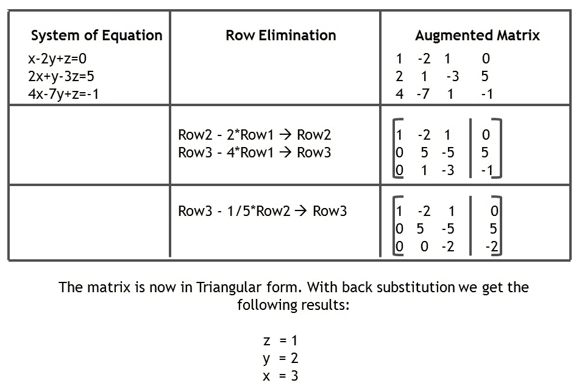
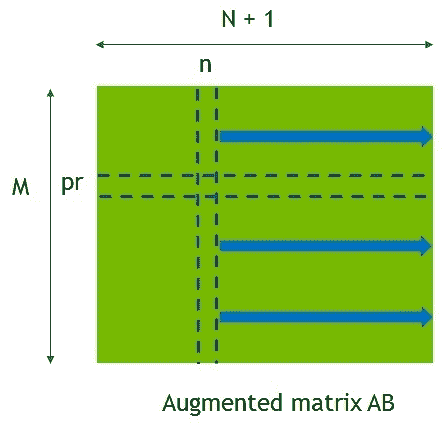
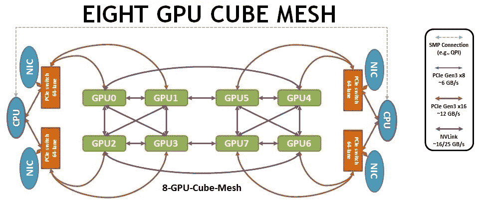
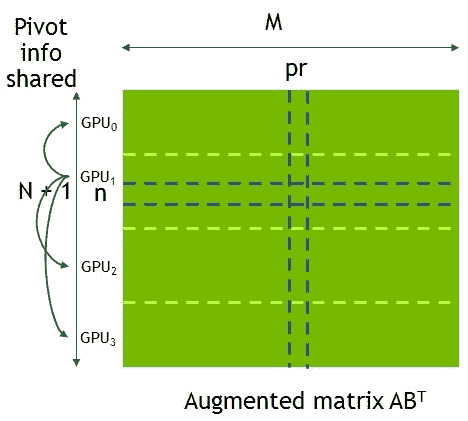
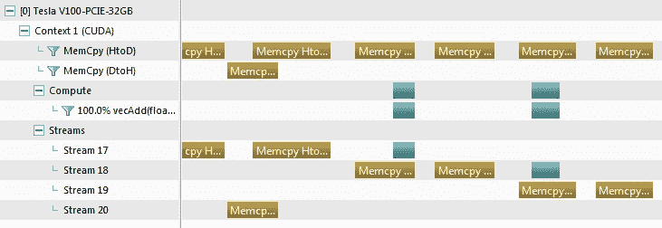
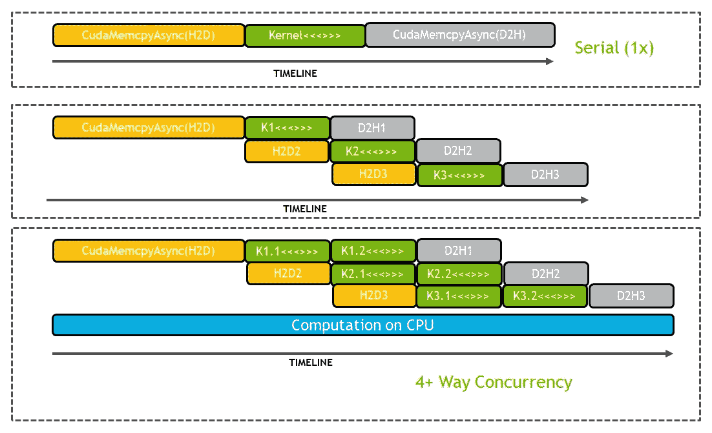
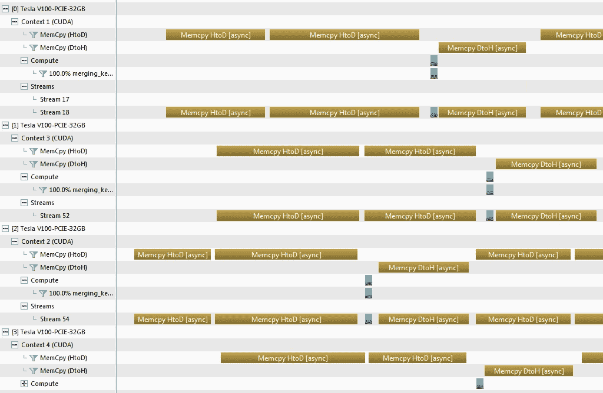
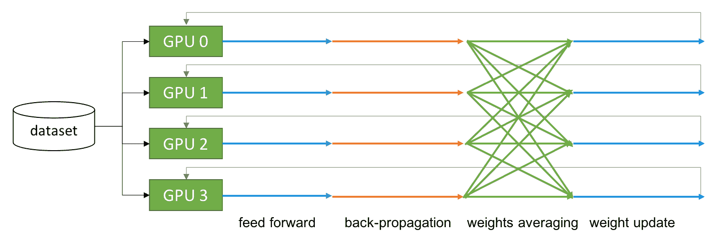
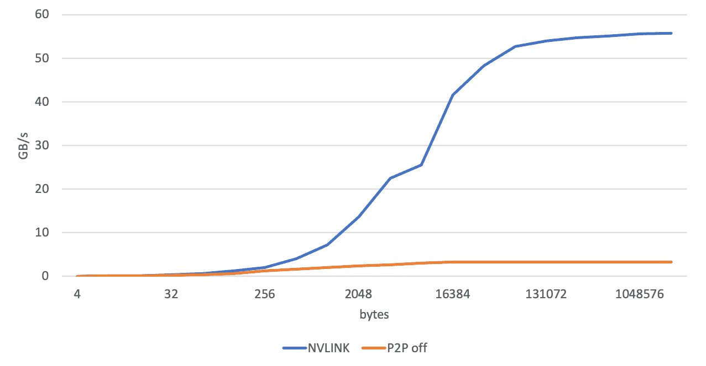
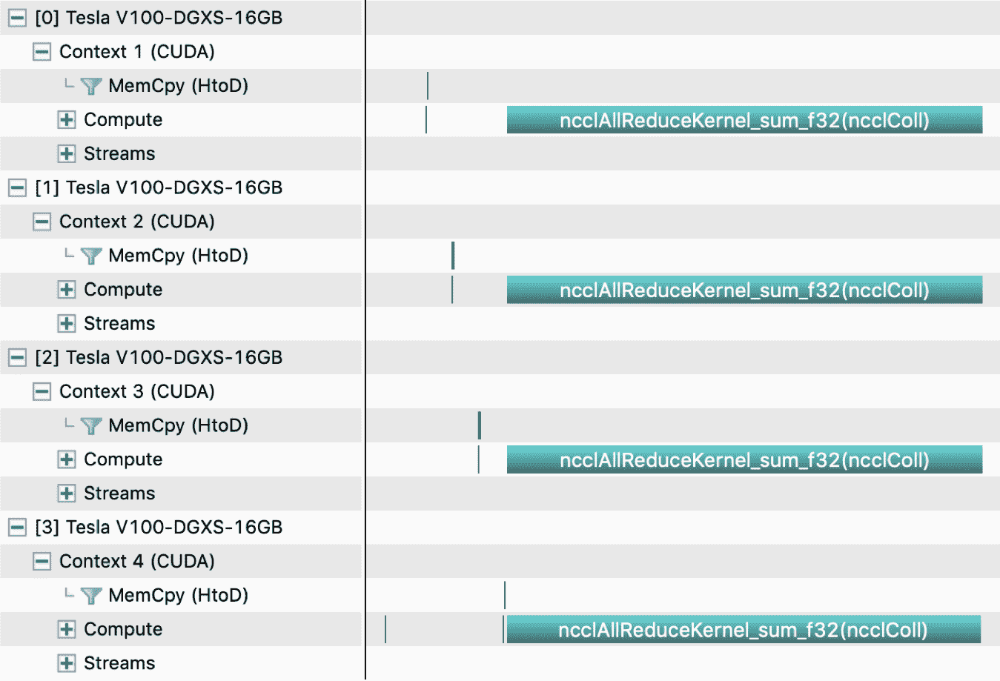

# 可扩展的多图形处理器编程

到目前为止，我们专注于在单个 GPU 上获得最佳性能。具有多个 GPU 的密集节点已经成为对即将到来的超级计算机的迫切需求，尤其是因为 ExaFLOP(每秒五千万次操作)系统正在成为现实。GPU 架构是高能效的，因此，近年来，拥有 GPU 的系统占据了绿色 500 强榜单([https://www.top500.org/green500](https://www.top500.org/green500))的大部分榜首位置。在 green 500 2018 年 11 月的榜单中，前 10 名系统中有 7 款基于 NVIDIA GPU。

英伟达的 DGX 系统现在在一台服务器中有 16 V100 32 GB。借助统一内存和 NVLink、NvSwitch 等互连技术，开发人员可以将所有 GPU 视为一个拥有 512 GB 内存(每个 16 GPU * 32 GB)的大 GPU。在这一章中，我们将深入到编写 CUDA 代码的细节，并利用 CUDA 感知库在节点内和跨节点的多 GPU 环境中高效地获得可伸缩性。

在本章中，我们将涵盖以下主题:

*   用高斯消去法求解线性方程
*   点对点
*   MPI 简介
*   GPUDirect RDMA
*   CUDA 流
*   其他技巧

# 技术要求

这一章需要一台带有现代 NVIDIA GPU (Pascal 架构以后)的 Linux 电脑，安装所有必要的 GPU 驱动程序和 CUDA 工具包(10.0 以后)。如果您不确定自己的 GPU 架构，请访问 NVIDIA GPU 的网站([https://developer.nvidia.com/cuda-gpus](https://developer.nvidia.com/cuda-gpus))并确认您的 GPU 架构。本章的代码也可以在 https://github.com/PacktPublishing/Learn-CUDA-Programming的 GitHub 上找到。

本章中的示例代码已经用 CUDA 版本 10.1 进行了开发和测试。但是，建议您使用最新版本(CUDA)或更高版本。

由于本章需要展示多 GPU 交互，我们将需要至少两个相同类型和架构的 GPU。此外，请注意，某些功能，如 GPUDirect RDMA 和 NVLink，仅在 NVIDIA 的特斯拉卡上受支持。如果你没有特斯拉 P100 或特斯拉 V100 这样的特斯拉卡，不要灰心丧气。您可以放心地忽略其中一些功能。与我们在这里展示的相比，性能数字将会有所变化，但是相同的代码将按原样工作。

在下一节中，我们将看一个流行的高斯算法求解一系列线性方程的例子，以演示如何编写多 GPU。

# 用高斯消去法求解线性方程

为了演示节点内和跨节点的多个图形处理器的用法，我们将从一些顺序代码开始，然后将其转换为节点内和跨节点的多个图形处理器。我们将求解一个包含 *M* 方程和 *N* 未知数的线性方程组。该方程可以表示如下:

***A × x = b***

这里 *A* 是一个有 *M* 行和 *N* 列的矩阵， *x* 是一个有 *N* 行的列向量(也称为解向量)，而 *b* 也是一个有 *M* 行的列向量。求解向量涉及到给定 *A* 和 *b* 时计算向量 *x* 。求解线性方程组的标准方法之一是高斯消去法。在高斯消去法中，通过执行初等行变换，第一矩阵 *A* 被简化为上三角矩阵或下三角矩阵。然后，通过使用反向替换步骤来求解所得的三角形方程组。

下面的伪代码解释了求解线性方程的步骤:

```cpp
1\. For iteration 1 to N (N: number of unknowns) 
    1.1 Find a row with non-zero pivot
    1.2 Extract the pivot row
    1.3 Reduce other rows using pivot row
2 Computing the solution vector through back substitution
```

让我们看一个例子来理解这个算法。假设方程组如下:



首先，我们将尝试设置基线系统，如下所示:

1.  准备好你的 GPU 应用程序。这段代码可以在本书 GitHub 储存库中的`06_multigpu/gaussian`文件夹中找到。

2.  使用`nvcc`编译器编译您的应用程序，如下所示:

```cpp
$ nvcc -o gaussian_sequential.out gaussian_sequential.cu
$ nvcc -o gaussian_single_gpu.out gaussian_single_gpu.cu
$ $ time ./gaussian_sequential.out
$ time ./gaussian_single_gpu.out
```

前面的步骤编译并运行本章中的两个版本的代码:

*   按顺序运行的中央处理器代码
*   CUDA 代码，运行在单个图形处理器上

现在，让我们来看看高斯消除的单个 GPU 实现中的热点。

# 高斯消去法的单 GPU 热点分析

让我们尝试理解和剖析顺序和单个 GPU 代码，以设置基线。在此基础上，我们将增强和增加对在多 GPU 上运行的支持。

**顺序 CPU 代码**:以下代码为顺序实现的提取代码:

```cpp
for( int n = 0; n < N; n++ ){
// M: number of equations, N: number of unknowns
    for( int pr = 0; pr < M; pr++ ){
        // finding the pivot row 
        //if pr satisfies condition for pivot i.e. is non zero 
        break; 
    }
    for( int r = 0; r < M; r++ ){
        // reduce all other eligible rows using the pivot row
        double ratio = AB[r*N+n]/AB[pr*N+n]
        for( int nn = n; nn < N + 1; nn++ ){
            AB[r * N + nn] -= (ratio*AB[pr * N + nn]);
        }
    }
}
```

视觉上，发生的操作如下:



这里，在这个高斯消去法中，行数等于方程数，列数等于未知数数。上图中所示的 **pr** 行是枢轴行，将用于使用枢轴元素减少其他行。

我们可以做的第一个观察是，我们正在对一个增广矩阵进行操作，以合并 *A* 矩阵和 *b* 向量。因此，未知数的大小是 *N+1* ，因为增广矩阵的最后一列是 *b* 向量。创建一个增广矩阵可以帮助我们处理一个数据结构，也就是矩阵。您可以使用以下命令分析这段代码。分析结果将向您显示`guassian_elimination_cpu()`功能花费的时间最多:

```cpp
$ nvprof --cpu-profiling on ./guassian_sequential.out
```

**CUDA 单 GPU 代码**:看完前面的章节，我们希望大家已经熟悉了如何编写最优的 GPU 代码，因此我们就不深入单 GPU 实现的细节了。以下摘录显示，在单个 GPU 实现中，这三个步骤被称为用于寻找 *N* 未知数的三个核:

*   `findPivotRowAndMultipliers<<<...>>>`:内核找到轴心行和乘数，应该用于行消除。
*   `extractPivotRow<<<>>>`:内核提取轴心行，然后用于执行行消除。
*   `rowElimination<<<>>>`:这是最后一次内核调用，在 GPU 上并行进行行消除。

下面的代码片段显示了在数据被复制到 GPU 后迭代调用的三个内核:

```cpp
<Copy input augmented matrix AB to GPU>
...
for( int n = 0; n < N; n++ ){
// M: number of equations, N: number of unknowns
    findPivotRowAndMultipliers<<<...>>>(); 
    extractPivotRow<<<...>>>(); 
    rowElimination<<<...>>>(); 

}
```

本章的重点是如何增强单个图形处理器的实现以支持多个图形处理器。然而，为了填补 GPU 实现中缺失的部分，我们需要对单个 GPU 实现进行一些优化更改:

*   高斯消除算法的性能受到内存访问模式的严重影响。基本上，这取决于 AB 矩阵是如何存储的:
    *   查找数据透视表行更喜欢以列为主的格式，因为如果矩阵以列为主的格式存储，它会提供合并访问。
    *   另一方面，提取数据透视表行更喜欢以行为主的格式。
*   无论我们如何存储 *AB* 矩阵，一个合并和一个交错/非合并的内存访问都是不可避免的。
*   列主格式也有利于行消除核，因此，对于我们的高斯消除核，我们决定存储 AB 矩阵的转置，而不是 AB。AB 矩阵被转置一次，在`transposeMatrixAB()`函数的代码开始处。

在下一节中，我们将启用多 GPU P2P 访问，并将工作分配给多个 GPU。

# 点对点

GPUDirect 技术的创建是为了允许不同节点内和跨节点的 GPU 之间进行高带宽、低延迟的通信。引入这项技术是为了消除一个图形处理器需要与另一个图形处理器通信时的 CPU 开销。GPUDirect 可以分为以下几大类:

*   **GPU 之间的对等(P2P)传输**:允许CUDA 程序使用高速**直接内存传输** ( **DMA** )在同一系统的两个 GPU 之间复制数据。它还允许对同一系统中其他图形处理器的内存进行优化访问。
*   **网络和存储之间的加速通信**:这项技术有助于从第三方设备(如 InfiniBand 网络适配器或存储)直接访问 CUDA 内存。它消除了不必要的内存拷贝和 CPU 开销，因此减少了传输和访问的延迟。从 CUDA 3.1 开始支持该功能。
*   **视频的 GPUDirect】:这项技术优化了基于帧的视频设备的流水线。它允许与 OpenGL、DirectX 或 CUDA 进行低延迟通信，并且从 CUDA 4.2 开始支持。**
*   **远程直接内存访问(RDMA)** :该功能允许集群中的 GPU 之间直接通信。CUDA 5.0 及更高版本支持此功能。

在这一节中，我们将转换我们的顺序代码，以利用 GPUDirect 的 P2P 特性，以便它可以在同一系统中的多个 GPU 上运行。

GPUDirect P2P 功能允许以下内容:

*   **GPU 直接传输** : `cudaMemcpy()`启动从 GPU 1 的内存到 GPU 2 的内存的 DMA 复制。
*   **直接访问** : GPU 1 可以读写 GPU 2 的内存(加载/存储)。

下图展示了这些功能:


要了解 P2P 的优势，就要了解 PCIe 总线规范。这是为了通过互连(如 InfiniBand)与其他节点进行最佳通信而创建的。当我们希望以最佳方式发送和接收来自单个图形处理器的数据时，情况就不同了。以下是一个 PCIe 拓扑示例，其中八个图形处理器连接到不同的中央处理器和网卡/无限带宽卡:


在上图中，GPU0 和 GPU1 之间允许 P2P 传输，因为它们都位于同一个 PCIe 交换机中。但是，GPU0 和 GPU4 无法执行 P2P 传输，因为两个**输入/输出集线器** ( **IOHs** )之间不支持 PCIe P2P 通信。对于远程对等 MMIO 事务，IOH 不支持来自 PCI Express 的非连续字节。连接两个处理器的 QPI 链路的性质确保了如果两个处理器驻留在不同的 PCIe 域上，则不可能在两个处理器之间进行直接的 P2P 复制。因此，从 GPU0 的内存复制到 GPU4 的内存需要通过 PCIe 链路复制到连接到 CPU0 的内存，然后通过 QPI 链路将其传输到 CPU1，并通过 PCIe 再次传输到 GPU4。可以想象，这个过程在延迟和带宽方面都增加了大量的开销。

下图显示了另一个系统，其中 GPU 通过支持 P2P 传输的 NVLink 互连相互连接:



上图显示了一个示例 NVLink 拓扑，它产生了一个八立方体网格，其中每个 GPU 连接到另一个 GPU，最大跳数为 1。

更重要的问题是，*我们如何知道这种拓扑以及哪些图形处理器支持 P2P 传输？*好在有工具可以做到这一点。`nvidia-smi`就是这样一个工具，作为 NVIDIA 驱动程序安装的一部分进行安装。下面的截图显示了在网络拓扑如上图所示的英伟达 DGX 服务器上运行`nvidia-smi`的输出:


前面的截图代表了在 DGX 系统上运行`nvidia-smi topo -m`命令的结果，该系统有 8 个图形处理器。如您所见，任何通过 SMP 互连(`QPI` / `UPI`)连接到另一个 GPU 的 GPU 都无法执行 P2P 传输。比如`GPU0`就无法和`GPU5`、`GPU6`、`GPU7`做 P2P。另一种方法是通过 CUDA APIs 来解决这个传输问题，我们将在下一节中使用它来转换我们的代码。

现在我们已经了解了系统拓扑，我们可以开始将我们的应用程序转换为单个节点/服务器中的多个 GPU。

# 单节点–多 GPU 高斯消除

准备你的多图形处理器应用程序。这段代码可以在本书的 GitHub 库中的`06_multigpu/gaussian`找到。使用`nvcc`编译器编译您的应用程序，如下所示:

```cpp
$ nvcc -o gaussian_multi_gpu_p2p.out gaussian_multi_gpu_p2p.cu
$ time ./gaussian_multi_gpu_p2p.out
```

从单 GPU 实现到多 GPU 实现，我们在前面小节中定义的三个内核将按原样使用。然而，线性系统被分成与图形处理器数量相等的多个部分。这些部分分配给每个 GPU 一个部分。每个图形处理器负责对分配给该图形处理器的部件执行操作。矩阵是按列拆分的。这意味着每个图形处理器从所有行中获得相等数量的连续列。寻找枢轴的内核在保存包含枢轴元素的列的 GPU 上启动。透视元素的行索引被广播给其他图形处理器。提取的枢轴行和行消除内核在所有图形处理器上启动，每个图形处理器在矩阵中自己的部分工作。下图显示了在多个 GPU 之间拆分的行，以及如何将透视行广播给其余进程:



上图显示了多个图形处理器之间的分工。目前，透视行属于 **GPU1** ，负责向其他 GPU 广播透视行。

让我们尝试理解这些代码变化，以及用于启用 P2P 功能的 CUDA 应用编程接口:

1.  在支持的图形处理器之间启用 P2P 访问。下面的代码显示了在 GPU 之间启用 P2P 访问的第一步:

```cpp
for( int i = 0; i < nGPUs; i++ ){   
    // setup P2P 
    cudaSetDevice(i);   
    for( int j = 0; j < nGPUs; j++ ) {      
        if (i == j) continue;      
        cudaDeviceCanAccessPeer(&canAccessPeer, i, j);
        if (canAccessPeer)      
            cudaDeviceEnablePeerAccess(j, 0);    
    } 
}
```

前面代码中使用的关键 API 如下:

2.  将内容拆分并传输到相应的图形处理器:

```cpp
for( int g = 0; g < nGPUs; g++ ){       
    cudaSetDevice(g);       
    //Copy  part ‘g’ of ABT to GPU ‘g’; 
}
```

前面代码中使用的关键应用编程接口是`cudaSetDevice()`。这将当前上下文设置为作为参数传递的图形处理器标识。

3.  找到轴心行并通过 P2P 广播:

```cpp
for( int n = 0; n < N; n++ ){        
    gp = GPU that holds n;        
    cudaSetDevice(gp);        
    findPivotRowAndMultipliers<<<...>>>();
    for( int g = 0; g < nGPUs; g++ ){ 
        if (g == gp) continue;
        cudaMemcpyPeer(pivotDatag, g, pivotDatagp, gp, numBytes);
     }  ... 
```

用于向图形处理器广播传输的应用编程接口是`cudaMemcpyPeer()`。

4.  提取透视行并执行行消除:

```cpp
for( int n = 0; n < N; n++ ){
    ...
    for( int g = 0; g < nGPUs; g++ ){  
        cudaSetDevice(g); 
        extractPivotRow<<<...>>>(); 
        rowElimination<<<...>>>();   
    }  
}  
```

如您所见，我们仍然在重用相同的内核。唯一不同的是，我们使用`cudaSetDevice()` API 来告诉 CUDA 运行时内核应该在哪个 GPU 上启动。请注意`cudaSetDevice()`是一个昂贵的调用，尤其是在老一代图形处理器上。因此，建议您利用`OpenMP` / `OpenACC`或 CPU 上的任何其他线程机制在 CPU 上并行调用`nGPUs`的 for 循环。

5.  从各自的中央处理器复制回数据:

```cpp
for( int g = 0; g < nGPUs; g++ ){ 
    cudaSetDevice(g);  
    Copy  part ‘g’ of reduced ABT from GPU ‘g’ to Host; 
}
```

这五个步骤完成了将单个 GPU 实现转换为单个节点上的多个 GPU 的练习。

作为 CUDA 安装的一部分发货的 CUDA 示例包括一些测试 P2P 带宽性能的示例代码。可以在`samples/1_Utilities/p2pBandwidthLatencyTest`文件夹中找到。建议您在系统上运行此应用程序，以便了解系统的 P2P 带宽和延迟。

现在我们已经在单个节点上实现了多 GPU 实现，我们将改变策略，在多个 GPU 上运行这段代码。但是在将我们的代码转换成多个 GPU 之前，我们将提供一个简短的 MPI 编程入门，主要用于节间通信。

# MPI 简介

**消息传递接口** ( **MPI** )标准是一个消息传递库标准，已经成为在 HPC 平台上编写消息传递程序的行业标准。基本上，MPI 用于跨多个 MPI 进程的消息传递。相互通信的 MPI 进程可以驻留在同一个节点上，也可以跨多个节点。

以下是 Hello World MPI 程序的示例:

```cpp
#include <mpi.h> 
int main(int argc, char *argv[]) {     
    int rank,size;     
    /* Initialize the MPI library */     
    MPI_Init(&argc,&argv);     
    /* Determine the calling process rank and total number of ranks */
    MPI_Comm_rank(MPI_COMM_WORLD,&rank);     
    MPI_Comm_size(MPI_COMM_WORLD,&size);     
    /* Compute based on process rank */     
    /* Call MPI routines like MPI_Send, MPI_Recv, ... */     
    ...     
    /* Shutdown MPI library */     
    MPI_Finalize();     
    return 0; 
}
```

如您所见，MPI 程序中涉及的一般步骤如下:

1.  我们包含头文件`mpi.h`，它包含了所有 MPI API 调用的声明。
2.  我们通过调用`MPI_Init`并向其传递可执行参数来初始化 MPI 环境。在此语句之后，创建多个 MPI 等级，并开始并行执行。
3.  所有 MPI 进程并行工作，并使用消息传递 API(如`MPI_Send()`、`MPI_Recv()`等)相互通信。
4.  最后，我们通过调用`MPI_Finalize()`来终止 MPI 环境。

我们可以使用不同的 MPI 实现库(如 OpenMPI、MVPICH、英特尔 MPI 等)来编译这段代码:

```cpp
$ mpicc -o helloWorldMPI helloWorldMPI.c
$ mpirun -n 4 --hostfile hostsList ./helloWorldMPI
```

我们正在利用`mpicc`编译器来编译我们的代码。`mpicc`基本上是一个包装脚本，它在内部扩展编译指令，以包括相关库和头文件的路径。此外，运行一个 MPI 可执行文件需要将其作为参数传递给`mpirun`。`mpirun`是一个包装器，帮助跨应用程序应该执行的多个节点设置环境。`-n 4`参数表示我们希望运行四个进程，这些进程将在主机名存储在文件主机列表中的节点上运行。

在这一章中，我们的目标是将 GPU 内核与 MPI 集成，使其跨多个 MPI 进程运行。然而，我们不会涉及 MPI 编程的细节。不熟悉 MPI 编程的朋友应该先看看[https://computing.llnl.gov/tutorials/mpi/](https://computing.llnl.gov/tutorials/mpi/)了解一下分布式并行编程，然后再进入下一节。

# GPUDirect RDMA

在集群环境中，我们希望跨多个节点使用图形处理器。我们将允许我们的并行求解器将 CUDA 代码与 MPI 集成，以在多节点、多 GPU 系统上利用多级并行。一个 CUDA 感知的 MPI 被用来利用 GPUDirect RDMA 来优化节点间的通信。

GPUDirect RDMA 允许跨集群的 GPU 之间直接通信。它最初是由 CUDA 5.0 用开普勒 GPU 卡支持的。在下图中，我们可以看到 GPUDirect RDMA，即**服务器 1** 中的 **GPU 2** 与【服务器 2】中的 **GPU 1** 直接通信:


GPUDirect RDMA 工作的唯一理论要求是**网卡**和 **GPU** 共享同一个根联合体。图形处理器和第三方设备(如网络适配器)之间的路径决定了是否支持 RDMA。让我们重温一下我们在上一节中运行的 DGX 系统上的`nvidia-smi topo -m`命令的输出:


如果我们看一下`GPU4`行，它显示`GPU4`到`mlx5_2`的连接类型是`PIX`(通过 PCIe 开关遍历)。我们还可以看到`GPU4`到`mlx_5_0`的连接类型是`SYS`(穿越经过`QPI`)。这意味着`GPU4`可以通过 Mellanox InfiniBand 适配器`mlx_5_2`执行 RDMA 传输，但如果传输需要从`mlx_5_0`开始，则不能执行，因为`QPI`不允许使用 RDMA 协议。

# 支持 CUDA 的 MPI

所有最新版本的 MPI 库都支持 GPUDirect 功能。支持 NVIDIA GPUDirect 和**统一虚拟寻址** ( **UVA** )的 MPI 库支持以下功能:

*   MPI 可以传输应用编程接口，将数据直接复制到图形处理器内存(RDMA)。
*   MPI 库还可以区分设备内存和主机内存，而无需用户的任何提示，因此它对 MPI 程序员来说是透明的。
*   随着跨多个 MPI 级别的数据传输需要更改的应用程序代码越来越少，程序员的工作效率也随之提高。

正如我们前面提到的，CPU 内存和 GPU 内存是不同的。没有 CUDA 感知的 MPI，开发人员只能将指向 CPU/主机内存的指针传递给 MPI 调用。以下代码是使用不支持 CUDA 的 MPI 调用的示例:

```cpp
 //MPI rank 0:Passing s_buf residing in GPU memory 
 // requires it to be transferred to CPU memory
cudaMemcpy(s_buf_h,s_buf_d,size,cudaMemcpyDeviceToHost);
MPI_Send(s_buf_h,size,MPI_CHAR,1,100,MPI_COMM_WORLD);

//MPI rank 1: r_buf received buffer needs to be 
// transferred to GPU memory before being used in GPU
MPI_Recv(r_buf_h,size,MPI_CHAR,0,100,MPI_COMM_WORLD, &status);
cudaMemcpy(r_buf_d,r_buf_h,size,cudaMemcpyHostToDevice);
```

有了一个 CUDA 感知的 MPI 库，这就不是必须的了；GPU 缓冲区可以直接传递给 MPI，如下面的代码所示:

```cpp
//MPI rank 0
MPI_Send(s_buf_d,size,MPI_CHAR,1,100,MPI_COMM_WORLD);

//MPI rank n-1
MPI_Recv(r_buf_d,size,MPI_CHAR,0,100,MPI_COMM_WORLD, &status);
```

例如，对于开放 MPI，在开放 MPI 1.7 系列和更高版本中存在 CUDA 感知支持。要启用此功能，需要在编译时使用 CUDA 支持配置开放 MPI 库，如下所示:

```cpp
$ ./configure --with-cuda
```

拥有一个支持 CUDA 的 MPI 并不意味着总是使用 GPUDirect RDMA。如果数据传输发生在共享同一根联合体的网卡和 GPU 之间，则使用 GPUDirect 功能。尽管如此，即使没有启用 RDMA 支持，拥有一个支持 CUDA 的 MPI 也能通过利用消息传输等功能提高应用程序的效率，如下图所示:


上图显示了带有 GPUDirect 的支持 CUDA 的 MPI 和不带 GPUDirect 的支持 CUDA 的 MPI。这两个调用都来自于 CUDA 感知 MPI，但是左侧是带 GPUDirect 传输的，右侧是不带 GPUDirect 传输的。

非 GPUDirect 传输有以下几个阶段:

*   节点 1:从 GPU1 到主机内存的传输
*   节点 1:从主机内存传输到网络适配器暂存区
*   网络:通过网络传输
*   节点 2:从网络临时区域传输到主机内存
*   节点 2:从主机内存到 GPU 内存的传输

如果支持 GPUDirect RDMA，那么来自 GPU 的传输将直接通过网络进行，涉及主机内存的额外拷贝将全部删除。

既然我们已经掌握了这个概念，让我们开始转换代码，使用 CUDA 感知的 MPI 编程来支持多 GPU。

# 多节点–多 GPU 高斯消除

准备好你的 GPU 应用程序。这段代码可以在本书的 GitHub 存储库中的`06_multigpu/gaussian`找到。使用`nvcc`编译器编译并运行应用程序，如下所示:

```cpp
$ mpicc-o gaussian_multi_gpu_rdma.out gaussian_multi_gpu_rdma.cu
$ mpirun -np 8 ./gaussian_multi_gpu_rdma.out
```

我们用`mpicc`代替`nvcc`来编译 MPI 程序。我们使用`mpirun`命令运行可执行文件，而不是直接运行编译后的可执行文件。您将在本节中看到的结果是在 DGX 系统上运行的输出，在同一系统上有 8 V100。我们利用最大 8 个 MPI 进程，因为我们为每个 GPU 映射了 1 个 MPI 进程。要了解如何将多个 MPI 进程映射到同一个 GPU，请阅读本章后面的 *MPS* 小节。在本练习中，我们使用了 Open MPI 1.10，如前一节所述，它已经过编译以支持 CUDA。

多图形处理器实现中涉及的步骤如下:

1.  MPI 过程的秩 0 为线性系统(矩阵 A，B)生成数据。
2.  转置后的增广矩阵(AB <sup>T</sup> )通过使用`MPI_Scatterv()`在 MPI 进程之间逐行拆分。

3.  每个 MPI 进程并行计算其输入部分:
    *   处理这三个内核发生在图形处理器上。
    *   使用`MPI_Send()` / `Recv()`进行`findPivot`操作后，达成枢轴的一致。
4.  使用`MPI_Gatherv()`将简化的**转置增强矩阵** ( **ABT** )聚集在根部。
5.  根执行反向替换来计算解决方案 x。

展示前面代码的提取的高斯代码示例如下:

```cpp
void gaussianEliminationOnGPU() {
    cudaSetDevice(nodeLocalRank); //Set CUDA Device based on local rank
    //Copy  chuck of AB Transpose from Host to GPU; 
   for( int n = 0; n < N; n++ ){ 
       prank = MPI rank that holds n; 
       if (myRank == prank) 
           findPivotRowAndMultipliers<<<...>>>(); 
       bCastPivotInfo(); // from prank to other ranks 
       extractPivotRow<<<...>>>(); 
       rowElimination<<<...>>>(); 
   //Copy  myPartOfReducedTransposeAB from GPU to Host;
}
```

现在，让我们添加多图形处理器支持:

1.  **按 MPI 等级设置 CUDA 设备** : 在 Open MPI 中，利用`MPI_COMM_TYPE_SHARED`作为`MPI_Comm_split_type`的参数，可以得到 MPI 进程的本地等级，如下代码所示:

```cpp
MPI_Comm loc_comm;
MPI_Comm_split_type(MPI_COMM_WORLD, MPI_COMM_TYPE_SHARED, rank, MPI_INFO_NULL, &loc_comm);
int local_rank = -1;
MPI_Comm_rank(loc_comm,&local_rank);
MPI_Comm_free(&loc_comm);
```

现在我们有了本地排名，每个 MPI 进程都用它来通过`cudaSetDevice()`设置当前 GPU，如下图所示:


2.  使用`MPI_Scatter`将输入拆分并分配给不同的 MPI 流程:

```cpp
void distributeInputs() {
    MPI_Scatterv(transposeAB, ..., myPartOfTransposeAB, recvCount, MPI_UNSIGNED, 0, MPI_COMM_WORLD); 
} 
```

3.  在图形处理器上执行高斯消除:

```cpp
void gaussianEliminationOnGPU() { 
    cudaSetDevice(nodeLocalRank);
     for( int n = 0; n < N; n++ ){ 
        prank = MPI rank that holds n; 
        if (myRank == prank) 
            findPivotRowAndMultipliers<<<...>>>();
        MPI_Bcast(...); // from prank to other ranks 
        extractPivotRow<<<...>>>(); 
        rowElimination<<<...>>>(); 
}
```

在执行任何操作之前，当前图形处理器是基于本地等级设置的。然后，由负责该行的进程提取数据透视表行，然后将数据透视表行广播给所有其他 MPI 等级，我们使用这些等级进行消除。

通过使用异步 MPI 调用，而不是使用`MPI_Bcast`等广播 API，可以提高传输时间的整体性能。事实上，不鼓励使用广播应用编程接口；应该换成`MPI_Isend`和`MPI_Irecv`，这是可以实现相同功能的异步版本。请注意，使调用异步会增加调试等其他方面的复杂性。因此，用户需要编写额外的代码来发送和接收数据。

This chapter provides the best coding practices when it comes to adding GPU support to an existing MPI program and should not be considered an expert guide on the best programming practices for MPI programming.

# CUDA 流

流以先进先出的方式运行，其中操作序列按照它们被发出的顺序执行。主机代码发出的请求被放入先进先出队列。队列由驱动程序异步读取和处理，设备驱动程序确保队列中的命令按顺序处理。例如，内存拷贝在内核启动前结束，等等。

使用多个流的一般思想是，在不同流中激发的 CUDA 操作可能会并发运行。这可能导致多个内核在内核执行中重叠或重叠内存副本。

为了理解 CUDA 流，我们将研究两个应用程序。第一个应用程序是一个简单的矢量加法代码，添加了流，因此它可以将数据传输与内核执行重叠。第二个应用是图像合并应用，也将用于[第 9 章](09.html)、*使用 OpenACC* 进行 GPU 编程。

首先，根据以下步骤配置您的环境:

1.  准备好你的 GPU 应用程序。例如，我们将合并两幅图像。这段代码可以在本书 GitHub 储存库中的`06_multi-gpu/streams`文件夹中找到。
2.  使用`nvcc`编译器编译您的应用程序，如下所示:

```cpp
$ nvcc --default-stream per-thread -o vector_addition -Xcompiler -fopenmp -lgomp vector_addition.cu
$ nvcc --default-stream per-thread -o merging_muli_gpu -Xcompiler -fopenmp -lgomp scrImagePgmPpmPackage.cu image_merging.cu
$ ./vector addition
$ ./merging_muli_gpu
```

前面的命令将创建两个名为`vector_addition`和`merging_multi_gpu`的二进制文件。正如您可能已经观察到的，我们在代码中使用了额外的参数。让我们更详细地了解它们:

*   `--default-stream per-thread`:这个标志告诉编译器解析代码中提供的 OpenACC 指令。
*   `-Xcompiler -fopenmp -lgomp`:这个标志告诉`nvcc`把这些额外的标志传递给下面的 CPU 编译器，编译代码的 CPU 部分。在这种情况下，我们要求编译器向我们的应用程序添加 OpenMP 相关的库。

我们将把这一部分分成两部分。应用 1 和应用 2 分别演示了在单个和多个图形处理器中使用流。

# 应用 1–使用多个流将数据传输与内核执行重叠

我们需要遵循以下步骤来将数据传输与内核执行重叠，或者同时启动多个内核:

1.  声明要固定的主机内存，如下面的代码片段所示:

```cpp
cudaMallocHost(&hostInput1, inputLength*sizeof(float));
cudaMallocHost(&hostInput2, inputLength*sizeof(float));
cudaMallocHost(&hostOutput, inputLength*sizeof(float));
```

这里，我们使用`cudaMallocHost()`应用编程接口来分配向量作为固定内存。

2.  创建一个`Stream`对象，如下面的代码片段所示:

```cpp
for (i = 0; i < 4; i++) {
 cudaStreamCreateWithFlags(&stream[i],cudaStreamNonBlocking);
```

这里，我们利用`cudaStreamCreateWithFlags()` API，传递`cudaStreamNonBlocking`作为标志，使这个流不阻塞。

3.  用`stream`标志调用 CUDA 内核和内存副本，如下面的代码片段所示:

```cpp
for (i = 0; i < inputLength; i += Seglen * 4) {
    for (k = 0; k < 4; k++) {
        cudaMemcpyAsync(... , cudaMemcpyHostToDevice, stream[k]);
        cudaMemcpyAsync(... , cudaMemcpyHostToDevice, stream[k]);
        vecAdd<<<Gridlen, 256, 0, stream[k]>>>(...);
    }
}
```

正如我们所看到的，我们不是通过复制整个数组一次来一次性执行向量加法，而是将数组分成段并异步复制这些段。内核执行也是在各自的流中异步完成的。

当我们通过 Visual Profiler 运行这段代码时，我们可以看到以下特征:



前面的 profiler 截图显示蓝色条(基本上是`vector_addition`内核)与内存副本重叠。因为我们在代码中创建了四个流，所以在分析器中也有四个流。

每个 GPU 都有两个内存复制引擎。一个负责主机到设备的传输，另一个负责设备到主机的传输。因此，发生在相反方向的两个内存副本可以重叠。此外，内存副本可以与计算内核重叠。这会导致 *n* 路并发，如下图所示:



每个 GPU 架构都有特定的约束和规则，基于这些约束和规则，我们将在执行时看到这些重叠。总的来说，以下是一些指导原则:

*   CUDA 操作必须在不同的非 0 流中。
*   `cudaMemcpyAsync`用主机应使用`cudaMallocHost()`或`cudaHostAlloc()`进行固定。
    *   必须有足够的资源
    *   `cudaMemcpyAsyncs`在不同的方向
    *   启动多个并发内核的设备资源(SMEM、寄存器、块等)

# 应用程序 2–使用多个流在多个设备上运行内核

为了在多个设备上运行内核和重叠内存传输，我们之前遵循的步骤保持不变，除了一个额外的步骤:设置 CUDA 设备来创建流。让我们看看以下步骤:

1.  创建与系统中 CUDA 设备数量相等的流，如以下代码片段所示:

```cpp
cudaGetDeviceCount(&noDevices);
cudaStream_t *streams;
streams = (cudaStream_t*) malloc(sizeof(cudaStream_t) * noDevices);
```

我们利用`cudaGetDeviceCount()` API 获取 CUDA 设备的数量。

2.  在相应的设备中创建流，如下面的代码片段所示:

```cpp
#pragma omp parallel num_threads(noDevices)
{
     int block = omp_get_thread_num();
    cudaSetDevice(block);
    cudaStreamCreate(&streams[block]);
```

我们正在启动与 CUDA 设备数量相等的 OpenMP 线程，这样每个 CPU 线程都可以为各自的设备创建自己的 CUDA 流。每个中央处理器线程执行`cudaSetDevice()`根据其标识设置当前图形处理器，然后为该设备创建流。

3.  在该流中启动内核和内存副本，如下所示:

```cpp
cudaMemcpyAsync(... cudaMemcpyHostToDevice,streams[block]);
cudaMemcpyAsync(..., cudaMemcpyHostToDevice, streams[block]);
merging_kernel<<<gridDim,blockDim,0,streams[block]>>>(...);
cudaMemcpyAsync(...,streams[block]); 
```

在探查器中运行代码后的输出可以在下面的屏幕截图中看到，它代表了可视化探查器的时间线视图。这显示了一个 GPU 的内存副本与另一个 GPU 的内核执行重叠:



如您所见，我们在四个 V100s 的多 GPU 系统上运行了这段代码。不同图形处理器中的内存副本和内核相互重叠。在这段代码中，我们演示了如何利用 OpenMP 在不同的设备上并行调用 CUDA 内核。这也可以通过利用 MPI 来启动利用不同 GPU 的多个进程来实现。

在下一节中，我们将了解一些其他主题，这些主题可以提高多 GPU 应用程序的性能，并帮助开发人员分析和调试他们的代码。

# 其他技巧

在本节中，我们将涵盖一些其他主题，这些主题将有助于我们理解多 GPU 系统的其他特性。

# 使用 InfiniBand 网卡对现有系统进行基准测试

不同的基准可用于测试 RDMA 功能。InfiniBand 适配器的一个这样的基准可以在[https://www.openfabrics.org/](https://www.openfabrics.org/)找到。您可以通过执行以下代码来测试带宽:

```cpp
$ git clone git://git.openfabrics.org/~grockah/perftest.git
$ cd perftest 
$ ./autogen.sh 
$ export CUDA_H_PATH=<<Path to cuda.h>> 
$ ./configure –prefix=$HOME/test 
$ make all install
```

然后，您可以运行以下命令来测试带宽:

```cpp
For example host to GPU memory (H-G) BW test:
server$ ~/test/bin/ib_write_bw -n 1000 -O -a --use_cuda
client $ ~/test/bin/ib_write_bw -n 1000 -O -a server.name.org

//GPU to GPU memory (G-G) BW test:
server$ ~/test/bin/ib_write_bw -n 1000 -O -a --use_cuda
client $ ~/test/bin/ib_write_bw -n 1000 -O -a --use_cuda server.name.org
```

# 英伟达集体交流图书馆(NCCL)

NCCL 提供了通信原语的实现，这些原语通常用于深度学习等领域。NCCL 1.0 从在同一个节点内的多个图形处理器之间实现通信原语开始，发展到支持多个节点中的多个图形处理器。NCCL 图书馆的一些主要特点包括:

*   支持来自多线程和多个进程的调用
*   支持多环和树形拓扑，以提高节点内和节点间的总线利用率
*   支持 InfiniBand 节点间通信
*   源码包可从 GitHub([https://github.com/nvidia/nccl](https://github.com/nvidia/nccl))免费下载

NCCL 可以扩展到 24，000 个图形处理器，远低于 300 微秒的延迟。请注意，NCCL 已被证明是一个非常有用和方便的深度学习框架库，但在用于高性能计算应用程序时有其局限性，因为它不支持点对点通信。NCCL 支持集体操作，用于深度学习应用，例如:

*   `AllReduce`
*   `AllGather`
*   `ReduceScatter`
*   `Reduce`
*   `Broadcast`

所有 NCCL 调用都作为 CUDA 内核运行，以便更快地访问 GPU 内存。它利用了作为一个块实现的较少线程。这最终只在一个图形处理器 SM 上运行，因此不会影响其他图形处理器的利用率。让我们看看下面的代码:

```cpp
ncclGroupStart(); 
for (int i=0; i<ngpus; i++) 
{ 
    ncclAllGather(…, comms[i], streams[i]); 
} 
ncclGroupEnd();
```

正如我们所看到的，NCCL 呼叫很简单，可以轻松呼叫。

# 利用 NCCL 加速集体通信

**NVIDIA 集体通信库** ( **NCCL** )为多个 NVIDIA GPUs 提供了性能优化的通信原语集体。在本节中，我们将了解这个库是如何工作的，以及我们如何从使用它中获益。

不难找到使用多个 GPU 来训练网络的深度学习模型。由于两个图形处理器并行计算神经网络，我们可以很容易地想象这种技术将随着图形处理器数量的增加而提高训练性能。不幸的是，这个世界并没有那么简单。梯度应在多个图形处理器之间共享，一个图形处理器中的权重更新程序应等待其他图形处理器的梯度更新其权重。这是多 GPU 深度学习训练的一般流程，如下图所示:



集体沟通有很多种类型:全缩减、广播、缩减、全聚集、缩减分散等等。在深度学习中，每个图形处理器收集另一个图形处理器的数据，同时将自己的数据传输到其他图形处理器。因此，我们可以确定深度学习在他们的交流中需要所有类型的减少风格的交流。

在 HPC 社区，集体沟通，包括 all-reduce，是一个相当常见的话题。节点间和节点内处理器之间的通信是一个具有挑战性但又至关重要的问题，因为它直接关系到可扩展性。正如我们在[第 6 章](06.html)、*可扩展多 GPU 编程*中提到的，在*多 GPU 编程*部分，需要大量考虑与各 GPU 进行通信。开发人员应该在图形处理器中设计和实现集体通信，即使 MPI 已经支持这样的通信模式。

NCCL 提供了这样一个知道图形处理器拓扑结构的集体。通过使用各种分组和通信命令，您可以应用所需的通信任务。

一个先决条件是你的系统需要有一个以上的图形处理器，因为 NCCL 是一个通信库，可以与多个图形处理器一起工作。

以下步骤涵盖了如何调用`ncclAllReduce()`作为测试并测量系统的 GPU 网络带宽。示例代码在`04_nccl`中实现:

1.  让我们为每个 GPU 设备定义一个类型，该类型将包含发送和接收、一个缓冲区和`cudaStream`，如下所示:

```cpp
typedef struct device
{
    float *d_send;
    float *d_recv;
    cudaStream_t stream;
} device_t;
```

2.  在应用程序开始时，我们需要准备一些句柄，以便我们可以控制多个 GPU:

```cpp
cudaGetDeviceCount(&num_dev);
ncclComm_t *ls_comms = new ncclComm_t[num_dev];
int *dev_ids = new int[num_dev];
for (int i = 0; i < num_dev; i++)
    dev_ids[i] = i;
```

3.  然后，我们将创建一个缓冲区，假设我们有数据。对于每个设备，我们将初始化每个设备的项目，如下所示:

```cpp
unsigned long long size = 512 * 1024 * 1024; // 2 GB

// allocate device buffers and initialize device handles
device_t *ls_dev = new device_t[num_dev];
for (int i = 0; i < num_dev; i++) {
    cudaSetDevice(i);
    cudaMalloc((void**)&ls_dev[i].d_send, sizeof(float) * size);
    cudaMalloc((void**)&ls_dev[i].d_recv, sizeof(float) * size);
    cudaMemset(ls_dev[i].d_send, 0, sizeof(float) * size);
    cudaMemset(ls_dev[i].d_recv, 0, sizeof(float) * size);
    cudaStreamCreate(&ls_dev[i].stream);
}
```

4.  在开始 NCCL 通信之前，我们需要初始化 GPU 设备，以便它们知道它们在整个 GPU 组中的排名。由于我们将使用单个进程测试带宽，因此我们可以安全地调用一个函数来初始化所有设备:

```cpp
ncclCommInitAll(ls_comms, num_dev, dev_ids);
```

5.  如果我们用多个进程测试带宽，我们需要调用`ncclCommInitRank()`。我们需要提供计算进程标识和图形处理器等级的图形处理器标识。
6.  现在，我们可以和 NCCL 一起完成全部还原操作。下面的代码是`ncclAllReduce`的一个示例实现:

```cpp
ncclGroupStart();
for (int i = 0; i < num_dev; i++) {
    ncclAllReduce((const void*)ls_dev[i].d_send, 
                  (void*)ls_dev[i].d_recv,
        test_size, ncclFloat, ncclSum, 
        ls_comms[i], ls_dev[i].stream);
}
ncclGroupEnd();
```

对于每个设备，我们需要触发流量。为此，我们需要启动和关闭 NCCL 集团的沟通。现在，我们已经实现了一些使用`ncclAllReduce()`的测试代码。让我们通过对我们的系统进行微观基准测试来了解 NCCL 是如何工作的。

让我们在多 GPU 系统上测试这段代码，运行以下命令:

```cpp
$ nvcc -run -m64 -std=c++11 -I/usr/local/cuda/samples/common/inc -gencode arch=compute_70,code=sm_70 -lnccl -o nccl ./nccl.cu
```

下图显示了在 DGX 站使用四个 V100 32G 图形处理器测量的性能。蓝线表示基于 NVLink 的带宽，而橙线表示基于 PCIe 的带宽，它通过设置`NCCL_P2P_DISABLE=1 ./ncd`和关闭点对点 GPU 来实现:



该 NCCL 测试可能会受到系统配置的影响。这意味着结果可能会有所不同，具体取决于您系统的 GPU 拓扑。

这显示了基于 PCI express 和基于 NVLINK 的全缩减性能之间的差异。我们可以用`nvprof`看到它的交流。以下截图显示了 NCCL 通过 NCCL 2.3.7 在 DGX 站的全缩减通信:



NCCL 越来越快了。通过引入带有 NVLink 和 NVSwitch 的新 GPU 互连，我们在 NCCL 的体验正在增加，以至于我们可以实现可扩展的性能。

The following link provides a discussion about NCCL: [https://developer.nvidia.com/gtc/2019/video/S9656/video](https://developer.nvidia.com/gtc/2019/video/S9656/video).

# 摘要

在本章中，我们介绍了多 GPU 编程的不同方法。借助一个高斯消去的例子，我们看到了如何将单个 GPU 应用程序工作负载拆分到多个 GPU 中，首先是单个节点，然后是多个节点。我们看到了系统拓扑如何在利用 P2P 传输和 GPUDirect RDMA 等功能方面发挥重要作用。我们还看到了如何使用多个 CUDA 流来重叠多个图形处理器之间的通信和数据传输。我们还简要介绍了一些可以帮助 CUDA 程序员优化代码的其他主题，例如 MPS 和使用`nvprof`来分析多 GPU 应用程序。

在下一章中，我们将研究大多数高性能计算应用程序中出现的常见模式，以及如何在图形处理器中实现它们。