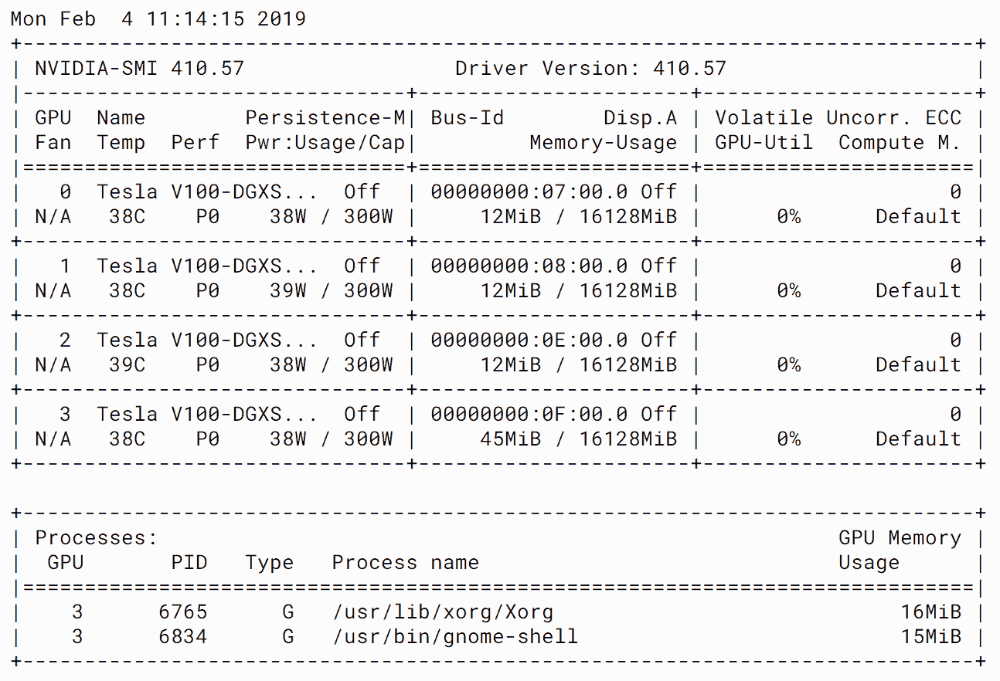
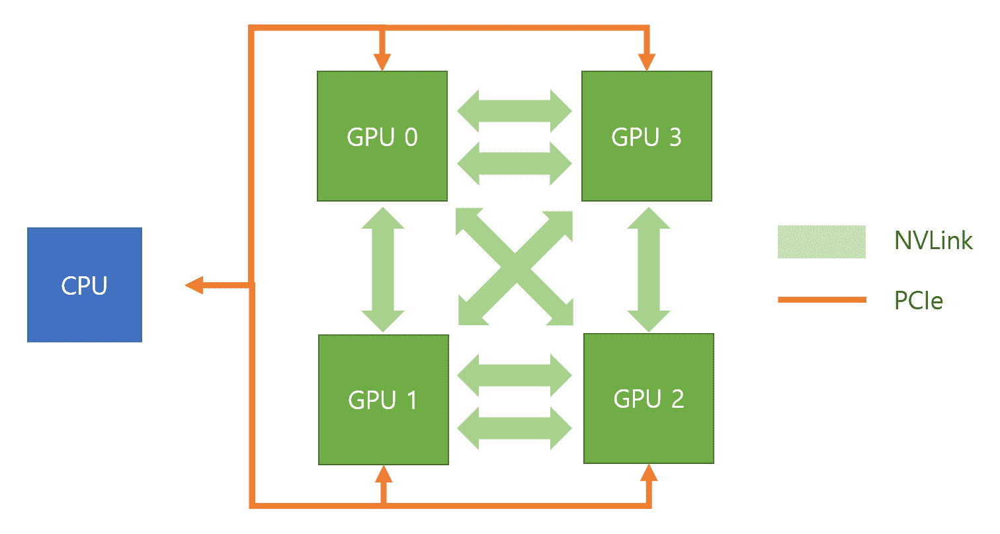
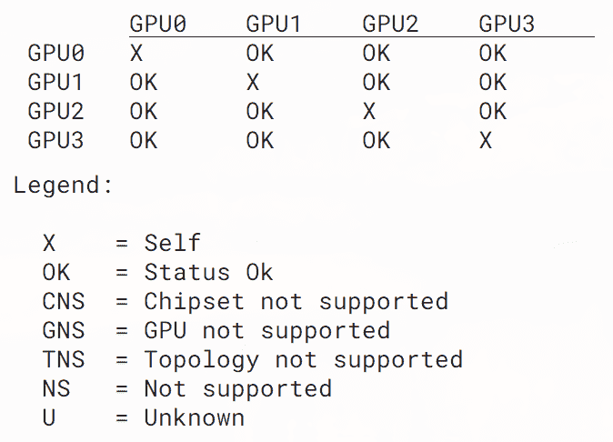
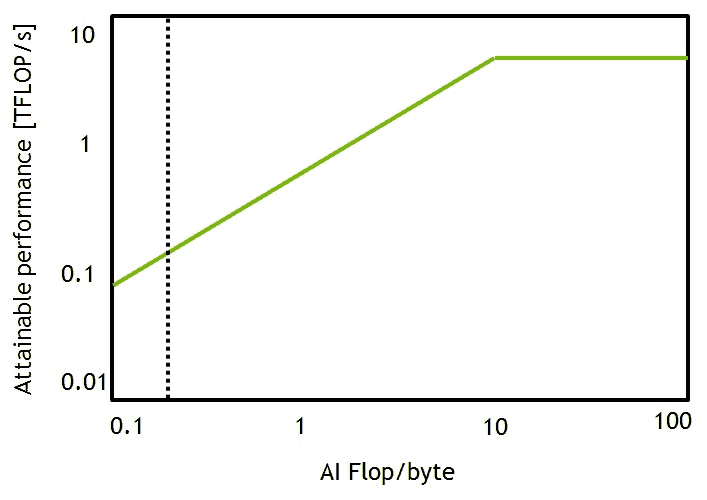
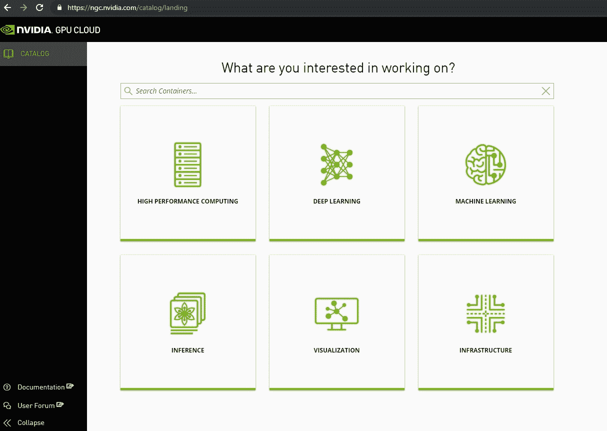
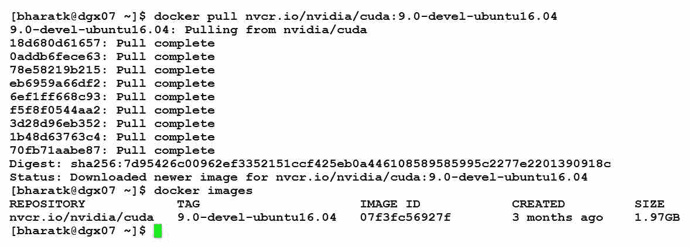
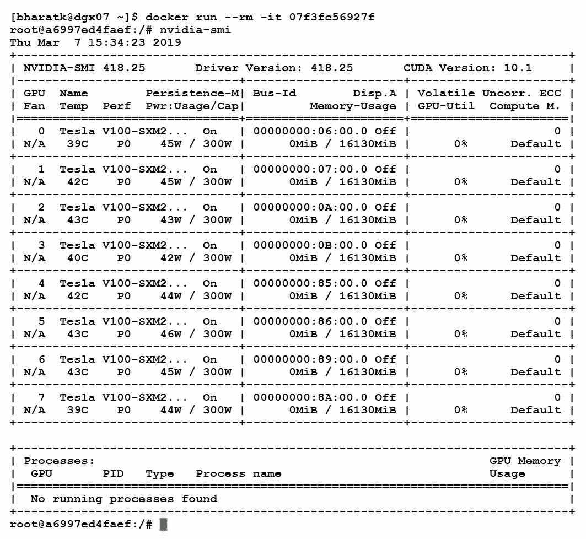

# 附录

CUDA 是一个并行编程平台。学习 CUDA 不仅意味着学习语言，还意味着在图形处理器方面有一些工程能力。工程领域可以是监控、环境设置、性能理解、集装箱化等等。本章提供了一些帮助工程师使用图形处理器的技巧。我们可以涵盖更多的主题，但是下面的主题将对那些想了解 CUDA 及其 GPU 操作的人有所帮助。

在本章中，我们将涵盖以下主题:

*   有用的`nvidia-smi`命令
*   Windows 中的 WDDM/TCC 模式
*   性能建模
*   探索基于容器的开发

# 有用的 nvidia-smi 命令

在本节中，我们将介绍`nvidia-smi`的监控功能和管理操作。`nvidia-smi`是 **NVIDIA 管理库** ( **NVML** )的**命令行界面** ( **CLI** )。该库支持对英伟达设备的管理和监控。`nvidia-smi`还通过库向设备提供直接查询和命令。数据通过`stdout`或文件以纯文本或 XML 格式呈现。它提供了几种用于更改设备统计信息的管理工具。

`nvidia-smi`是包装 NVML C/c++ API 的 CLI 应用。它通过 NVML 从`NVIDIA`驱动程序获得请求的信息。NVML 还提供了与其他语言(如 Python 和 Perl)一起工作的 API。

基本上，`nvidia-smi`为用户报告以下已安装的 GPU 统计信息:

*   第一行报告驱动程序版本，以及支持的 CUDA 版本
*   第二行显示了图形处理器统计格式
*   每个连续的行包含每个图形处理器的统计信息，包括以下内容:
    *   GPU ID
    *   操作模式:
        *   持续模式(开/关)
        *   **特斯拉计算集群** ( **TCC** )/ **Windows 显示驱动型号** ( **WDDM** )模式
    *   风扇速度
    *   图形处理器温度
    *   性能模式
    *   用电量和容量
    *   总线标识
    *   内存使用情况和安装的内存
    *   计数**纠错码** ( **纠错码**
    *   图形处理器利用率
    *   计算方式

基本上`nvidia-smi`可以处理所有的 NVIDIA GPU 卡，包括特斯拉、Quadro、GeForce。启用的功能可能因型号和类型而异。例如，ECC 错误计数在特斯拉和 Quadro 卡中可用，而在 GeForce 中不可用，因为它在其设备内存中不提供 ECC 功能。

`nvidia-smi`报告的格式在各操作系统之间是相同的。下面的截图显示了窗口的输出:


下面的截图显示了 Linux 的输出:



因此，我们可以阅读报告，并以相同的格式设置 GPU 操作。现在，让我们继续，看看经常使用的命令。默认`nvidia-smi` CLI 的用法如下:

```cpp
$ nvidia-smi [option1 [arg]] [option2 [arg]] ...
```

首先，根据监控目的，经常使用以下选项:

*   `-i`、`--id=`:用于选择目标 GPU
*   `-l`、`--loop=`:以指定的秒间隔报告 GPU 的状态
*   `-f`、`--filename=`:用于登录指定文件

该列表涵盖了`nvidia-smi`选项，可以帮助我们从图形处理器获得详细信息。

# 获取图形处理器的信息

当我们使用`--query` ( `-q`)选项时，`nvidia-smi`报告结构化输出。因此，我们可以了解收集了哪些信息。我们可以获得 GPU 信息，如利用率、功率、内存和时钟速度统计。另一方面，如果我们希望持续监控图形处理器的状态，这种格式是没有帮助的。

# 获取格式化信息

我们需要监控的基本 GPU 统计数据是功率、温度、内核利用率和内存使用情况。这可以通过`--query-gpu`命令轻松完成:

```cpp
$ nvidia-smi --query-gpu=timestamp,name,pci.bus_id,driver_version,pstate,pcie.link.gen.max,pcie.link.gen.current,temperature.gpu,utilization.gpu,utilization.memory,memory.used,memory.free,memory.used --format=csv -l 1
```

以下命令显示了一些选项，我们可以使用这些选项来检测时钟限制的性能消耗原因:

```cpp
$ nvidia-smi --query-gpu=index,clocks_throttle_reasons.active,clocks_throttle_reasons.gpu_idle,clocks_throttle_reasons.applications_clocks_setting,clocks_throttle_reasons.sw_power_cap,clocks_throttle_reasons.hw_slowdown,clocks_throttle_reasons.hw_thermal_slowdown,clocks_throttle_reasons.hw_power_brake_slowdown,clocks_throttle_reasons.sync_boost --format=csv
```

GPU 时钟节流的原因可能是电源制动、过热和同步增强。电源制动是指 GPU 的功耗受到用户设置或系统中电源供应商性能的限制。由于冷却环境差，过热也是频繁节流的原因。

# 电源管理模式设置

您可以使用以下命令找出每个图形处理器的最大功耗:

```cpp
$ nvidia-smi -i <device id> -pl N
```

# 设置图形处理器的时钟速度

默认情况下，GPU 的时钟速度根据需求而变化，并节省功耗以最大限度地提高能效。为了最大限度地提高图形处理器的性能并减少延迟，尤其是在基准测试情况下，我们可以确保图形处理器具有最大时钟速度，并禁用图形处理器驱动程序。

首先，我们需要将 GPU 设置为持久性模式。这样做意味着 GPU 驱动程序模块总是加载到内核中，减少了初始响应时间。此选项仅在 Linux 上可用，因为 Windows 不卸载图形处理器驱动程序。持续模式设置命令如下:

```cpp
$ sudo nvidia-persistenced
```

然后，我们可以设置支持的最大时钟。该值会因您使用的图形处理器而异:

```cpp
$ nvidia-smi -q -d SUPPORTED_CLOCKS
$ sudo nvidia-smi -ac <Mem clock, Graphics clock>
```

例如，特斯拉 V100 卡可以通过以下命令进行设置:

```cpp
$ sudo nvidia-smi -ac 877,1380 # V100 PCIe
$ sudo nvidia-smi -ac 877,1530  # V100 SMX
```

# 图形处理器设备监控

该命令每秒探测所选图形处理器的设备状态:

```cpp
$ nvidia-smi dmon -s pucvmet -i -0
```

下面的截图显示了上一个命令的结果。我们正在监控的设备表示其 GPU 设备状态为`0`:


可以使用`-s`选项指定收集的信息，如下所示:

*   `p`:用电量和温度
*   `u`:利用率
*   `c`:进程和内存时钟
*   `v`:电力和热力违规
*   `m` : FB 和 Bar1 内存
*   `e` : ECC 错误和 PCIe 重放错误
*   `t` : PCIe 接收和发送吞吐量

# 监控 GPU 利用率以及多个进程

如果您在单个图形处理器上使用多个进程操作，您可以考虑使用此命令。该命令收集图形处理器的统计数据，以及它们正在使用的进程。这意味着您可以确定哪个进程受到了 GPU 共享、内存计时空间等的限制:

```cpp
$ nvidia-smi pmon -i 0 -s u -o T
```

下面的截图显示了带有**进程标识** ( **进程标识**)的`nvidia-smi`的输出，这有助于确定哪个进程正在使用什么 GPU 资源:


前面截图中的每一列都显示了每个 GPU 的计算单元利用率或内存使用情况:

*   `sm%` : CUDA 核心利用率
*   `mem%`:内存操作的采样时间比
*   `enc%` / `dec%`:硬件编码器的利用率
*   `fb` : FB 内存使用情况

# 获取图形处理器拓扑信息

在多 GPU 系统中，使用`nvidia-smi`获取 GPU 拓扑信息是有用的。以下命令是显示多图形处理器系统图形处理器拓扑的`nvidia-smi`命令:

```cpp
nvidia-smi topo -m
```

下面的截图显示了`nvidia-smi`的输出，显示了系统的拓扑结构。DGX 站的结果是，我们有四个支持 NVLink 的 V100 图形处理器:


根据这个结果，我们可以确认系统的 GPU 拓扑如下:



以下命令标识了图形处理器之间的对等可访问性。我们在[第 6 章](06.html)、*可扩展多 GPU 编程*中使用了这个命令:

```cpp
$ nvidia-smi topo -p2p rwnap
```

以下是`nvidia-smi`拓扑的输出，该拓扑在一个系统中有四个图形处理器:



对等访问是可伸缩性或操作的一个重要因素。此命令帮助您确认图形处理器和您的系统可以支持图形处理器之间的对等访问。

# Windows 中的 WDDM/TCC 模式

在 Windows 平台上，NVIDIA GPU 有两种模式:WDDM 和 TCC。WDDM 是显卡的图形驱动程序，因此它可以渲染桌面和应用。如果安装的 GPU 只用于计算，显示渲染就是无用的开销。在这种情况下，NVIDIA GPU 可以切换到只专注于计算的模式。这种模式被称为 TCC 模式。

WDDM 允许英伟达图形处理器与服务于显示器的视窗 WDDM 驱动程序合作。支持 WDDM 模式是对 Windows 图形的要求。另一方面，TCC 模式只对计算有效。根据您的图形处理器产品和配置，可以更改图形处理器的模式。

操作模式遵循四种英伟达产品类别，其默认模式可能会有所不同，如下所示:

*   **GeForce** :仅限WDDM 模式。
*   **Quadro/Titan** :默认为 WDDM 模式，但也可以在 TCC 模式下使用。
*   **特斯拉**:通常默认为 TCC 模式。
*   **Tegra** :仅支持 Linux。没有 WDDM/部队派遣国问题。

WDDM 模式支持 CUDA 操作，用 Nsight 调试 CUDA 应用，同时还支持显示。作为一台主机，你可以做 GPU 能做的一切。但是，TCC 模式会禁用图形驱动程序上的图形，并启用 GPU 作为计算加速器。换句话说，这应该在显卡不必为显示器服务时使用。

在 CUDA 处理方面，TCC 模式比 WDDM 模式有一些优势，如下所示:

*   服务于大规模计算
*   忽略 Windows 的显示超时间隔(通常为两秒钟)，以启用长于两秒钟的内核操作
*   降低了 CUDA 在 Windows 上的内核启动开销
*   通过 Windows 远程桌面服务支持 CUDA 处理
*   支持在非英伟达集成显卡上使用英伟达图形处理器，从而节省全局内存

因此，如果图形处理器不为显示器服务，TCC 模式会为图形处理器带来作为加速器的最佳配置。

# 设置变矩器离合器/WDDM 模式

要更改变矩器离合器或 WDDM 模式，使用`nvidia-smi`工具，如下所示:

```cpp
$ sudo nvidia-smi -dm {0|1}
```

`0`表示 WDDM 模式，`1`表示 TCC 模式。

如果要为选定的图形处理器设置 TCC 模式，请使用`-g`选项指定目标图形处理器:

```cpp
$ nvidia-smi -g {GPU_ID} -dm {0|1}
```

当您想要将图形处理器用于显示和计算的目的分开时，此选项非常有用。应用这些设置后，您可能需要*重新启动*机器来应用这些更改。

我们可以通过使用`nvidia-smi`来识别 TCC 模式是否启用。以下截图显示了 TCC 中的 GPU 运行模式:


通过查看第一列中 GPU 名称的右侧，我们可以确认启用了 TCC 模式。

# 性能建模

了解应用/算法和图形处理器硬件的特性对于设定真实的加速目标非常重要。这可以通过增加并行性来实现。我们还需要在优化应用时确定是否有优化 GPU 的空间。

一个简单的方法是应用阿姆达尔定律。我们可以预测，应用中可实现的性能增益受到代码顺序部分的限制。例如，只有 50%的代码可以并行，而其余的代码本质上是顺序的(例如从文件中读取)。如果是这种情况，可以达到的最大加速是 2x；也就是说，程序只能运行两倍的速度。然而，这种性能建模只显示了最大加速比。我们不得不假设我们可以完全并行化并消除代码并行部分的执行时间。

另一个性能建模实践是基于目标体系结构的性能约束因素进行分析。实际上，我们有硬件规格，其操作引入了不可避免的性能限制。通过分析这些限制，我们可以确定是否有执行优化的空间，并查看下一组优化策略。

# 屋顶模型

每个内核函数都可以分为以下几类:

*   **计算界限**:内核函数对读取或写入的每个字节数据进行更多的算术运算。这些应用对硬件的计算要求更高。
*   **内存限制**:应用花费大部分时间从内存中读写，计算量较少。应用受系统内存带宽的影响最大，而不是硬件的 FLOP 等级。
*   **延迟界限**:内核函数的 CUDA 线程大部分时间都在等待，而不是执行。出现这种情况有很多原因。主要原因是并行性的次优级别或内存和计算资源的非最佳使用。

由于所有这些绑定都是由硬件引入的，因此我们可以绘制目标硬件的峰值性能和内存带宽以及它们的算术强度。性能曲线受硬件峰值性能的限制。我们在[第三章](03.html)、 *CUDA 线程编程*中对此进行了简要的触及，以确定下一步的优化策略。下图用在[第三章](03.html)、 *CUDA 线程编程*中，并展示了一个屋顶线模型的例子:


为了进行任何计算，数据需要从内存传输到算术单元。它遍历不同级别的内存层次结构，峰值内存带宽因内存类型而异。该算法的峰值性能可以按照其算术强度进行分类。这种强度是由计算数据与加载数据的数量决定的。此外，这些延迟限制因素也带来了计算上限。通过测量性能并对照硬件规格进行分析，我们可以确认目标算法达到了峰值性能，或者受到内存或延迟的限制。无论哪种情况，我们都可以确定下一步。在[第三章](03.html)*CUDA 线程编程*中，我们对此进行了深入的探讨。在本节中，我们将通过查看一个示例来关注屋顶线模型，并了解它有多有用。

屋顶线模型考虑了应用的操作强度。简单来说，这意味着从主存储器(动态随机存取存储器)每字节进行操作。虽然有更复杂的模型也考虑了高速缓存到处理器的传输，但屋顶线模型更侧重于从动态随机存取存储器到高速缓存的数据传输，因此，侧重于特定图形处理器架构上 CUDA 内核所需的动态随机存取存储器带宽。

屋顶线模型陈述如下:

"Attainable performance ( GFLOP/s) = min (Peak Floating-Point Performance, Peak Memory Bandwidth * Operational Intensity)"

# 雅可比方法分析

让我们试着理解这个公式，得到 V100 GPU 卡的屋顶线模型。V100 图形处理器具有以下规格:

*   80 个 SMs，每个具有 32 个 FP64 内核
*   900 GB/s 的总带宽
*   L2 快取记忆体:6 MB
*   L1 快取记忆体:10 MB
*   寄存器:62 KB/SM

让我们尝试分析一个简单的雅可比方法:

```cpp
for (int iy = 1; iy < NoRows; iy++)
{
    for ( int ix = 1; ix < NoCols; ix++)
    {
        Anew[ix][iy] = rhs[iy∗nx+ix] 
                     - 0.25f*(Aref[ix-1][iy] + Aref[ix+1][iy] 
                     + Aref[ix][iy-1] + Aref[ix][iy+1]);
    }
}
```

让我们分析一下前面代码的数据传输:

*   向量的内存加载(`Anew`、`rhs`、`Aref` ): *I <sub>加载</sub>* *= NoRow * NoCol * 3 * 8 字节(双精度)*
*   向量存储(`Anew` ): *I <sub>存储</sub> = NoRow * NoCol * 8 字节*
*   浮点运算:*I<sub>FP</sub>= NoRow * NoCol * 6 FLOP*

下图显示了特斯拉 V100 卡的屋顶线分析和雅可比方法的算术强度:



V100 上雅可比的算术强度为*I<sub>FP</sub>/(I<sub>Load</sub>+I<sub>Strore</sub>)= 0.18 FLOP/字节。*

屋顶线模型清楚地表明，该算法是受内存限制的，最大可实现的性能仅为 0.18 FLOP/字节，因此无法达到 V100 的峰值 FLOP 额定值，即 7.8 TFLOPS。但是，我们也可以通过重用提取的数据来预测优化后可获得的性能。

屋顶线模型有助于根据算法的硬件特性来定义算法的性能上限。

**Jacobi method** 
This is an iterative algorithm for finding solutions for a system of linear equations. Its basic operations and GPU optimization are explained at [https://www.olcf.ornl.gov/wp-content/uploads/2016/01/Introduction-to-Accelerated-Computing-with-OpenACC-Jeff-Larkin.pdf](https://www.olcf.ornl.gov/wp-content/uploads/2016/01/Introduction-to-Accelerated-Computing-with-OpenACC-Jeff-Larkin.pdf).

# 探索基于容器的开发

维护集群的开发人员和 IT 管理员面临的一个关键挑战是软件堆栈的复杂性。每个应用/框架都有许多依赖项。当这些依赖项的版本不同时，复杂性会增加。例如，在 DL 中，Caffe 对 cuDNN 和 Python 版本的要求与 TensorFlow 不同。在一个特定的组织/机构中，有许多用户，每个用户都可能使用同一框架的不同版本。安装所有正确的依赖项并设置正确的环境会导致生产力的损失。更多的时间花在安装上，而不是工作上。面临的另一个挑战是，由于依赖性不匹配，几乎不可能由不同的人来再现结果/性能数字，即使他们可能在同一系统上运行。比如 GROMACS 分子动力学框架有很多设置，比如多线程编译或者**消息传递接口** ( **MPI** )支持，MPI 上的版本，MPI 类型。另一个挑战，尤其是在人工智能领域，是你能想到的每一个软件框架都在快速发展，新的补丁也在频繁添加。

容器为这些问题提供了解决方案。使用容器的主要优势如下:

*   **隔离**:容器为应用提供环境隔离
*   **在任何地方运行**:容器提供了一种在不同环境中共享和测试应用的简单方法
*   **轻量级**:与使用基于虚拟机的解决方案相比，容器是轻量级的，并且提供几乎可以忽略的延迟和开销

最著名的两个容器环境是 Docker 和奇点。两者各有利弊。但是，请注意，这一部分不是 Docker 或奇点的详尽指南。

开发人员通常会创建容器并在线发布给其他人使用。我们将详细解释一个由英伟达维护的名为**英伟达 GPU 云** ( **NGC** )的存储库。NGC 就像一个存放流行的**深度学习**(**DL**)**高性能计算** ( **HPC** )和**虚拟现实** ( **VR** )框架的容器的仓库。英伟达针对 GPU 的不同环境测试这些应用，并在向公众提供之前经历广泛的质量保证过程。这意味着性能得到保证。

NGC 的一个类比是安卓应用商店，它为运行安卓操作系统的不同手机上运行的不同应用提供了一个存储库。这些应用得到验证并通过质量保证过程。NGC 这个名字有时会让人困惑，开发者认为它是一朵云。应该明确的是，它是一个容器存储库，可以被拉入一个带有 GPU 的系统中，并在本地运行。该容器可以在不同的系统上运行，具有图形处理器，就像它可以运行在桌面上的 NVIDIA 泰坦卡，服务器与特斯拉 V100 卡，或 NVIDIA AI 超级计算机 DGX。NGC 容器也可以在诸如 AWS 和 Azure 等云平台上运行。

# 主机的 NGC 配置

以下步骤介绍了如何配置 NGC 工作环境和在 NGC 查找可用映像:

1.  **基本安装**:要在 GPU 系统上使用容器，您需要安装以下内容:

`nvidia-docker`是一个将 NVIDIA 组件和模块加载到容器中的开源项目。它基本上是 Docker 的包装器。您可以在下载并查看安装说明。

2.  **访问 NGC 网站**:现在可以去 NGC 网站选择集装箱([nvidia.com/ngc](https://www.nvidia.com/en-us/gpu-cloud/)，如下图截图所示:



如您所见，容器有六个类别。选择一个与你相关的。早期版本的 NGC 要求用户注册，但最近取消了这一要求。

# NGC 集装箱的基本用法

在本节中，我们将介绍如何从 NGC 注册中心提取容器，以及如何定制我们自己的容器。这和使用 Docker 没什么不同，只是我们可以访问 NGC 注册表`nvcr.io`。如果您已经熟悉 Docker 命令，可以跳过这一部分。

以下步骤说明了如何在终端会话中获取并启动本地 Linux 机器上的 NGC 容器:

1.  找到您想要使用的软件，并从 NGC 站点复制命令。
2.  然后，通过将命令粘贴到终端中来拉出容器图像。以下截图显示了`pull`命令及其 Docker 操作:



如您所见，Docker 使用基于层的方法。CUDA 容器建立在 Ubuntu 的基础层之上。此外，Docker images 命令向我们展示了机器上本地拉取的容器。

3.  使用以下命令启动拉出的容器:

```cpp
docker run --rm -it --runtime=nvidia nvcr.io/nvidia/cuda:9.0-devel-ubuntu16.04
```

图形处理器如下图所示:



只要我们运行 Docker，shell 登录就会改变，我们会登录到以 root 用户身份运行的容器中。因此，我们能够在容器内运行`nvidia-smi`命令。

4.  我们还可以使用容器的附加选项来访问主机资源。最常用的选项如下:

`nvidia-docker`的基本用法类似于正常的 Docker 用法，只是我们可以使用 GPU。这意味着您还可以获得 Docker 的额外好处。

# 从 NGC 容器创建和保存新容器

您也可以将图层添加到现有容器中，并保存它们以备将来使用。让我们学习如何做到这一点:

1.  创建一个`Dockerfile`并在基础图像上创建一些层。例如，我们可以更新 NGC PyTorch 容器中的 APEX([https://github.com/nvidia/apex](https://github.com/nvidia/apex))，这样我们就可以使用它的最新版本:

```cpp
FROM nvcr.io/nvidia/pytorch:19.03-py3
RUN git clone https://github.com/NVIDIA/apex /opt/apex && \
 cd /opt/apex && \
 pip install -v --no-cache-dir --global-option="--cpp_ext" --global-option="--cuda_ext" .
```

您也可以将所需的 Ubuntu 包或 Python 包安装代码添加到该文件中。

2.  然后，我们可以用`docker build`命令构建一个定制的容器。以下命令显示了 Docker 图像`build`命令的基本格式:

```cpp
docker build -t <image-name>:<tag> .
```

该命令将找到我们创建的`Dockerfile`，并逐行启动每个命令。`Dockerfile`的每一行都将创建一个 Docker 层，因此建议编写一个`RUN`命令来覆盖单个目标。

3.  现在，您需要将 Docker 映像备份到您的私有注册表中或创建一个文件。完成容器后，您可能希望在其他系统中传播或重用该容器。在这种情况下，您可以将 Docker 映像推入注册表。例如，如果你在`DockerHub`上有账户，Docker 会提供免费注册。您可以使用以下命令将容器推入注册表:

```cpp
docker push <DockerHub-ID>/<image-name>:<tag>
```

您还可以创建备份文件，并将它们复制到本地文件系统上。以下命令向您展示了如何使用压缩创建容器备份:

```cpp
docker save <image-name>:<tag> | gzip > container.tgz
```

然后，您可以使用以下命令加载该图像:

```cpp
gunzip -c container.tgz | docker load
```

您可以在不压缩的情况下创建本地备份映像，但是输出文件太大，通常无法传送到其他系统。

在本节中，我们已经介绍了 Docker 的一些基本操作。然而，Docker 也提供了其他丰富的功能和好处。尽管 Linux 仅可用于 Docker 容器中 CUDA 的使用，但 Docker 将在构建工作环境时为您节省时间，并帮助您专注于代码开发。

# 将默认运行时设置为 NVIDIA Docker

通过对`nvidia-docker`配置的一些修改，我们可以启动 GPU 容器，而无需通知 GPU 此用途。因为我们可以将 GPU 运行时选项设置为`nvidia-docker`，所以可以采用 Docker 的运行时设计。为此，您需要在`/etc/docker/daemon.json`中插入`default-runtime": "nvidia",`作为选项。然后，如果没有其他 Docker 配置，`daemon.json`文件可以配置如下:

```cpp
{
    "default-runtime": "nvidia",
    "runtimes": {
        "nvidia": {
            "path": "nvidia-container-runtime",
            "runtimeArgs": []
        }
    }
}
```

执行此操作后，使用以下命令重新启动系统或重新启动 Docker 守护程序:

```cpp
sudo systemctl restart docker
```

现在，我们可以享受没有 Docker 命令中的 GPU 命令选项的 GPU 容器。

英伟达开发博客提供了`nvidia-docker`的介绍，可以在[https://devblogs.nvidia.com/gpu-containers-runtime](https://devblogs.nvidia.com/gpu-containers-runtime/)找到。在这里，您不仅可以了解它的配置，还可以了解如何将其与 Docker compose 或**Linux Containers**(**LXC**)集成。它甚至允许 GPU 容器通过其 GPU 设备插件与 Kubernetes 一起工作。