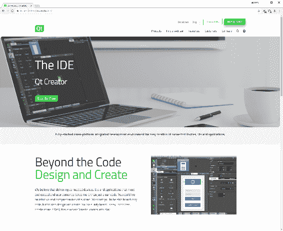
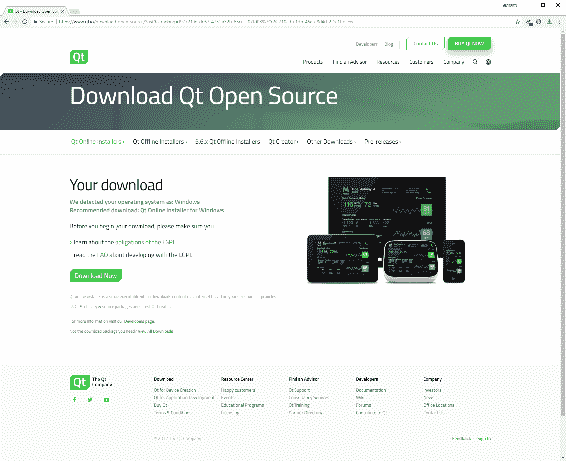
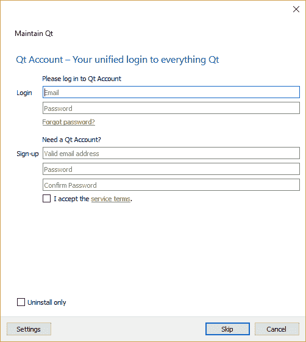
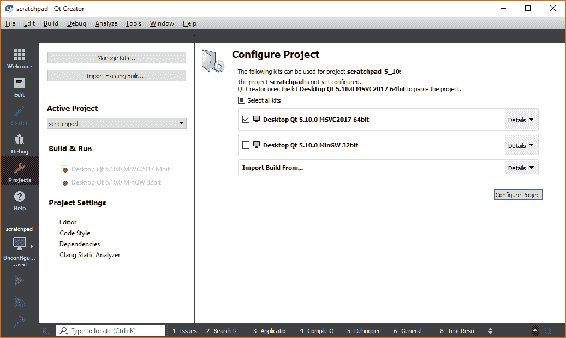

# 你好，Qt

Qt 是一个成熟而强大的框架，用于跨多个平台交付复杂的应用。它广泛应用于嵌入式设备，包括电视、卫星机顶盒、医疗设备、汽车仪表板等。它在 Linux 领域也有着丰富的历史，KDE 和旗鱼操作系统广泛使用它，商店里的许多应用都是使用 Qt 开发的。过去几年，它在移动领域也取得了长足的进步。然而，在微软视窗和苹果 Mac OS X 的世界里，C#/的统治地位。NET 和 Objective-C/Cocoa 意味着 Qt 经常被忽略。

这本书旨在展示 Qt 框架的强大和灵活性，并展示如何一次性编写应用并将其部署到多个操作系统桌面。我们将从头开始构建一个完整的真实世界的**业务线** ( **LOB** )解决方案，具有清晰的库、用户界面和单元测试项目。

我们将讨论用 QML 构建一个现代的、响应迅速的用户界面，并将其连接到丰富的 C++ 类。我们将使用 QMake 控制项目配置和输出的每个方面，包括平台检测和条件表达式。我们将构建“自我感知”的数据实体，它们可以将自己序列化到 JSON 和从 JSON 序列化。我们将把这些数据实体保存在数据库中，并学习如何查找和更新它们。我们将接触互联网，并消费一个 RSS 源。最后，我们将生成一个安装包，以便将我们的应用部署到其他机器上。

在本章中，我们将安装和配置 Qt 框架和相关的**集成开发环境** ( **IDE** ) Qt Creator。我们将创建一个简单的便笺式应用，我们将在本书的剩余部分中使用它来演示各种技术。我们将涵盖以下主题:

*   安装 Qt
*   维护您的安装
*   Qt 创建者
*   便笺项目
*   qmake

# 安装 Qt

让我们从访问 Qt 网站 [https://www.qt.io](https://www.qt.io/) 开始:



网站布局变化相当频繁，但您正在寻找的是下载适用于台式机和移动设备的 Qt 开源软件:

1.  从顶层菜单中，选择产品，然后选择集成开发环境和工具
2.  点击免费开始
3.  选择桌面和移动应用
4.  点击获取您的开源包

If you continue to use Qt beyond these personal projects, ensure that you read the licensing information available on the Qt website ([https://www.qt.io/licensing/](https://www.qt.io/licensing/)). Upgrade to the commercial Qt license if the scope of your projects requires it or if you want access to the official Qt support and the benefits of a close strategic relationship with the Qt company.

该网站将检测您的操作系统，并建议您下载:



在 Windows 上，您将被推荐在线安装程序`*.exe`文件，而在 Linux 上，您将获得一个`*.run`文件，如果您运行的是 Mac OS X，还将获得一个`.dmg`文件。在所有情况下，下载并启动安装程序:


On Linux, once downloaded, you may need to first navigate to the `*.run` file and mark it as executable in order to be able to launch it. To do this, right-click on the file in the file manager and click on Properties. Click on the Permissions tab and tick the box that says Allow executing file as program.

在最初的欢迎对话框后，您首先看到的是注册 Qt 帐户或使用 Qt 帐户登录的选项。如果您愿意，可以随意创建一个，但现在我们将继续跳过:



然后要求您选择要安装的组件。

你的第一个决定是你想要 Qt 框架的哪个版本。您可以并排安装多个版本。让我们选择最新的和最棒的(在撰写本文时是 Qt 5.10)并保留所有较旧的版本。

接下来，展开所选版本，您将看到选项的第二个列表。描述中写着“Qt 5.9.x 预构建组件”的所有选项被称为**套件**。工具包本质上是一个工具集，使您能够使用特定的编译器/链接器构建应用，并在特定的目标体系结构上运行它。每个工具包都带有专门为特定工具集编译的 Qt 框架二进制文件以及必要的支持文件。请注意，引用的编译器不附带工具包；你需要提前安装。在 Windows 上有一个例外，那就是 MinGW(它包含了适用于 Windows 的 GCC)，你可以通过底部的工具组件列表选择安装它。

在 Windows 上，这正是我们要做的，所以我们从工具部分选择了 MinGW 5.3.0 32 位工具包和 MinGW 5.3.0 开发环境。在我的(64 位)机器上，我已经安装了 Microsoft Visual Studio 2017，因此我们还将选择 MSVC 2017 64 位工具包，以帮助在本书后面演示一些技术。在 Linux 上，我们选择 GCC 64 位，而在 Mac OS 上，我们选择 macOS 64 位(使用 Clang 编译器)。请注意，在 Mac OS 上，必须安装 XCode，最好至少启动一次 XCode，让它有机会完成初始化和配置。

请随意按暂停，去安装你想使用的任何其他 IDEs 或编译器，然后回来选择匹配的工具包。你选择哪一个并不重要——整本书解释的技术都是适用的，不管套件是什么，你可能只是得到稍微不同的结果。请注意，根据您的操作系统和芯片组，提供给您的可用套件会有所不同；例如，如果你在一台 32 位机器上，你将不会得到任何 64 位套件。

Below the kits are some optional Qt APIs (such as Qt Charts), which we won’t need for the topics covered in this book, but feel free to add them in if you want to explore their functionality. Note that they may have different licensing agreements from the core Qt framework.

不管工具包和应用编程接口如何，您都会在工具部分注意到，Qt Creator 是默认安装的，这是我们将在本书中使用的集成开发环境:


完成选择后，单击下一步和更新开始安装。

It's generally a good idea to leave the installation location as the default for consistency across machines, but feel free to install it wherever you want.

# 维护您的安装

安装后，您可以通过位于您安装 Qt 的目录中的`Maintenance Tool`应用更新、添加和删除组件(甚至整个 Qt 安装)。

启动这个工具提供了与我们第一次安装 Qt 时几乎相同的体验。“添加或删除组件”选项是您想要添加到您以前可能不需要的项目中的选项，包括工具包，甚至是框架的全新版本。除非您主动取消选中它们，否则已经安装在系统上的组件不会受到影响。

# Qt 创建者

虽然 Qt Creator 的详细概述超出了本书的范围(Qt Creator 手册可通过这里描述的帮助模式访问)，但在我们开始第一个项目之前，有必要进行一次短暂的停留，因此启动新安装的应用，我们将看一看:


左上角(1)是应用的不同区域或模式:

*   欢迎模式是 Qt Creator 启动时的默认模式，也是创建或打开项目的起点。有大量的例子可以帮助展示框架的各种功能以及一些教程视频。
*   编辑模式是您花费大部分时间的地方，用于编辑所有基于文本的文件。
*   只有当您打开一个用户界面文件并且是视图的所见即所得编辑器时，才可以访问设计。虽然有用的 UX 设计和基本布局工作，它可以很快令人沮丧，我们将在编辑模式下做我们所有的 QML 工作。以这种方式工作促进了对 QML 的理解(因为你必须写它)，并且还有一个优点，那就是编辑器不会添加你不想要的代码。
*   调试模式用于调试应用，超出了本书的范围。
*   项目模式是管理项目配置的地方，包括生成设置。这里所做的更改将反映在`*.pro.user`文件中。
*   帮助模式将带您进入 Qt 创建者手册和 Qt 库参考。

Pressing *F1* while the cursor is on a recognized Qt symbol will automatically open context sensitive help for that symbol.

下面，我们有构建/运行工具(2):

*   套件/构建允许您选择套件并设置构建模式
*   运行构建并运行应用，无需调试
*   开始调试使用调试器构建和运行应用(请注意，您必须在选定的工具包中安装和配置调试器，这样才能工作)
*   构建项目在不运行应用的情况下构建应用

沿着底部(3)，我们有一个搜索框和几个输出窗口:

问题显示任何警告或错误。对于与您的代码相关的编译器错误，双击该项将引导您找到相关的源代码。

*   搜索结果允许您在不同范围内查找文本。 *Ctrl* + *F* 调出快速搜索，从那里选择高级…也调出搜索结果控制台。
*   应用输出是控制台窗口；所有来自应用代码的输出，像`std::` cout 和 Qt 的等价物`qDebug()`出现在这里，还有来自 Qt 框架的某些消息。
*   编译输出包含构建过程的输出，从 qmake 到编译和链接。
*   调试器控制台包含我们在本书中不会涉及的调试信息。
*   通用消息包含其他杂项输出，其中最有用的是来自`*.pro`文件的 qmake 解析，我们将在后面看到。

搜索框真的是一个隐藏的宝石，可以让你不用在无穷无尽的文件和文件夹中点击来寻找你想要的东西。您可以开始在框中键入要查找的文件名，此时将出现一个包含所有匹配文件的筛选列表。只需点击你想要的文件，它就会在编辑器中打开。不仅如此，你还可以应用大量的过滤器。在空搜索框中单击光标，它会显示可用过滤器的列表。例如，过滤器`m`搜索 C++ 方法。所以，假设你记得写了一个叫`SomeAmazingFunction()`的方法，但是不记得它在哪里了，直接去搜索框，开始输入`m Some`，它就会出现在过滤列表中。

在编辑模式下，布局会略有变化，并且会出现一些新的窗格。最初，它们将是空的，但是一旦您打开了一个项目，它们将类似于以下内容:


导航栏旁边是项目资源管理器，您可以使用它来导航解决方案的文件和文件夹。下方窗格是您当前打开的所有文档的列表。右边较大的区域是编辑器窗格，您可以在其中编写代码和编辑文档。

双击项目资源管理器中的文件通常会在编辑器窗格中打开它，并将其添加到打开的文档列表中。单击打开的文档列表中的文档将在编辑器窗格中激活它，而单击文件名右侧的小 x 将关闭它。

可以更改窗格以显示不同的信息，调整大小、拆分、关闭，也可以使用标题中的按钮进行筛选或与编辑器同步。尝试去感受他们能做什么。

正如您对现代 IDE 的期望，chrome 和文本编辑器的外观和感觉是非常可定制的。选择工具>选项…查看可用选项。我通常会编辑以下内容:

*   `Environment > Interface > Theme > Flat`
*   `Text Editor > Fonts & Colors > Color Scheme > My own scheme`
*   `Text Editor > Completion > Surround text selection with brackets > Off`
*   `Text Editor > Completion > Surround text selection with quotes > Off`
*   `C++ > Code Style > Current Settings > Copy… then Edit…`
*   `Edit Code Style > Pointers and References > Bind to Type name > On (other options Off)`

尽情玩耍，让你喜欢的东西变得更好。

# 便笺项目

为了演示 Qt 项目可以有多小，并给我们一个可以玩的编程沙坑，我们将创建一个简单的草稿栏项目。对于这个项目，我们甚至不会使用 IDE 来为我们做，所以您可以真正看到项目是如何构建的。

首先，我们需要创建一个根文件夹来存储我们所有的 Qt 项目。在 Windows 上，我用`c:\projects\qt`，而在 Linux 和 Mac OS 上我用`~/projects/qt`。在任何适合你的地方创建这个文件夹。

Note that file syncing tools (OneDrive, DropBox, and so on) can sometimes cause problems with project folders, so keep your project files in a regular unsynchronized folder and use version control with a remote repository for backups and sharing.

对于本书的其余部分，我将松散地称这个文件夹为`<Qt Projects>`或类似的文件夹。我们也倾向于使用文件路径的 Unix 风格/分隔符，而不是 Windows 风格的反斜杠`\`。所以，对于使用 Windows 的读者来说，`<Qt Projects>/scratchpad/amazing/code`相当于`c:\projects\qt\scratchpad\amazing\code`。Qt 也倾向于支持这个惯例。

同样，本书剩余部分的大部分截图将来自 Windows，因此 Linux/Mac 用户应该将任何对`c:\projects\qt`的引用解释为`~/projects/qt`。

在我们的 Qt 项目文件夹中，创建一个新的文件夹草稿栏并导航到其中。创建一个名为`scratchpad.pro`的新纯文本文件，记住删除操作系统可能想为您添加的任何`.txt`扩展名。

接下来，只需双击该文件，它将在 Qt Creator 中打开:



在这里，Qt Creator 问我们希望如何配置我们的项目，也就是说，我们希望在构建和运行代码时使用哪些工具包。选择一个或多个可用的工具包，然后单击配置项目。以后可以轻松添加和删除套件，所以不用担心选择哪一个。

如果切换回`filesystem`，你会看到 Qt Creator 已经为我们创建了一个名为`scratchpad.pro.user`的新文件。这只是一个包含配置信息的 XML 文件。如果您删除此文件并再次打开`.pro`文件，系统将提示您再次配置项目。顾名思义，配置设置与本地用户相关，因此如果您加载了由其他人创建的项目，您通常也需要完成配置项目步骤。

项目配置成功后，您会看到项目已经打开，甚至有一个完全空的`.pro`文件。这大概是一个项目所能达到的最小限度了！

回到`filesystem`，创建以下纯文本文件:

*   `main.cpp`
*   `main.qml`
*   `qml.qrc`

我将仔细检查这些文件，解释它们的目的，并很快添加它们的内容。在现实世界的项目中，我们当然会使用集成开发环境来为我们创建文件。事实上，这正是我们创建主解决方案文件时要做的事情。然而，这样做的目的是向您表明，当您将其归结为一个项目时，它只是一堆文本文件。永远不要害怕手动创建和编辑文件。许多现代 IDEs 会与一个又一个菜单和永无止境的选项窗口混淆和过度复杂。Qt Creator 可能会错过其他 ide 的一些高级功能，但它非常精简和简单。

创建完这些文件后，双击项目窗格中的`scratchpad.pro`文件，我们将开始编辑新项目。

# qmake

我们的项目(`.pro`)文件由一个名为 **qmake** 的实用程序解析，该实用程序反过来生成驱动应用构建的`Makefiles`。我们定义了我们想要的项目输出类型，包括哪些源文件以及依赖项等等。这在很大程度上是通过简单地设置变量来实现的，就像我们现在在项目文件中所做的那样。

在`scratchpad.pro`中增加以下内容:

```cpp
TEMPLATE = app

QT += qml quick

CONFIG += c++ 14
SOURCES += main.cpp
RESOURCES += qml.qrc
```

让我们依次浏览每一行:

```cpp
TEMPLATE = app
```

`TEMPLATE`告诉 qmake 这是什么类型的项目。在我们的例子中，它是一个可执行的应用，由`app`表示。我们感兴趣的其他值是用于构建库二进制文件的`lib`和用于多项目解决方案的`subdirs`。请注意，我们使用`=`运算符设置了一个变量:

```cpp
QT += qml quick
```

Qt 是一个模块化的框架，允许你只获取你需要的部分。`QT`标志指定了我们想要使用的 Qt 模块。默认包括*核心*和*图形用户界面*模块。请注意，我们将附加值附加到一个变量，该变量需要一个带有`+=`的列表:

```cpp
CONFIG += c++ 14
```

`CONFIG`允许您添加项目配置和编译器选项。在这种情况下，我们指定要使用 C++ 14 特性。请注意，如果您使用的编译器不支持这些语言功能标志，它们将不起作用:

```cpp
SOURCES += main.cpp
```

`SOURCES`是我们想要包含在项目中的所有`*.cpp`源文件的列表。在这里，我们添加我们的空`main.cpp`文件，在这里我们将实现我们的`main()`功能。我们还没有，但是当我们有了，我们的头文件将被指定一个`HEADERS`变量:

```cpp
RESOURCES += qml.qrc 
```

`RESOURCES`是包含在项目中的所有资源收集文件(`*.qrc`)的列表。资源集合文件用于管理应用资源，如图像和字体，但对我们来说最重要的是我们的 QML 文件。

项目文件更新后，保存更改。

每当您保存对`*.pro`文件的更改时，qmake 都会解析该文件。如果一切顺利，你会在 Qt Creator 的右下角看到一个绿色的小条。红色条表示某种问题，通常是语法错误。该过程的任何输出都将写入“常规消息”窗口，以帮助您诊断和修复问题。空白被忽略，所以不要担心空白行是否完全匹配。

To get qmake to take a fresh look at your project and generate new `Makefiles`, right-click on your project in the Projects pane and select Run qmake. It may be slightly tedious, but it’s a good habit to manually run qmake in this way on each of your projects before building and running your application. I’ve found that certain types of code changes can “slip under the radar” and leave you scratching your head when you run your application and they don’t seem to have had any effect. If you ever see your application ignoring the changes you’ve just made, run qmake on each of your projects and try again. The same applies if you get spurious linker errors.

您将看到我们的其他文件现在神奇地出现在“项目”窗格中:


双击`main.cpp`进行编辑，我们将编写第一段代码:

```cpp
#include <QGuiApplication>
#include <QQmlApplicationEngine>

int main(int argc, char *argv[])
{
    QGuiApplication app(argc, argv);
    QQmlApplicationEngine engine;

    engine.load(QUrl(QStringLiteral("qrc:/main.qml")));

    return app.exec();
}
```

我们在这里所做的就是实例化一个 Qt 图形用户界面应用对象，并要求它加载我们的`main.qml`文件。它非常简短，因为 Qt 框架为我们完成了所有复杂的底层工作。我们不必担心平台检测或管理窗口句柄或 OpenGL。

可能要学习的最有用的事情之一是将光标放在其中一个 Qt 对象上，然后按下 *F1* 将打开该类型的帮助。Qt 对象上的方法和属性也是如此。在帮助文件中四处看看`QGuiApplication`和`QQmlApplicationEngine`都是关于什么的。

要编辑我们项目中的下一个文件—`qml.qrc`—您需要右键单击并选择要打开它的编辑器。默认为资源编辑器:


我个人不是这个编辑的粉丝。我不认为这比只写纯文本更容易编辑，也不是特别直观。关闭此选项，选择`Open with > Plain Text Editor`。

添加以下内容:

```cpp
<RCC>
    <qresource prefix="/">
        <file>main.qml</file>
    </qresource>
</RCC>
```

回到`main.cpp`，我们要求 Qt 加载`qrc:/main.qml`文件。这基本上可以分解为“在前缀为`/`和名称为`main.qml`的`qrc`文件中查找该文件”。现在在我们的`qrc`文件中，我们已经创建了一个前缀属性为`/`的`qresource`元素。在这个元素中，我们有一个名为`main.qml`的资源集合(尽管只有一个)。把`qrc`文件想象成一个可移植的文件系统。请注意，资源文件相对于引用它们的`.qrc`文件进行定位。在这种情况下，我们的`main.qml`文件和我们的`qml.qrc`文件在同一个文件夹中。例如，如果它在一个名为`views`的子文件夹中，那么`qml.qrc`中的行应该是这样的:

```cpp
<file>views/main.qml</file>
```

类似地，`main.cpp`中的字符串也是`qrc:/views/main.qml`。

一旦保存了这些更改，您将看到我们的空`main.qml`文件作为`qml.qrc`文件的子文件出现在项目窗格中。双击该文件进行编辑，我们将完成我们的项目:

```cpp
import QtQuick 2.9
import QtQuick.Window 2.3

Window {
    visible: true
    width: 1024
    height: 768
    title: qsTr("Scratchpad")
    color: "#ffffff"

    Text {
        id: message
        anchors.centerIn: parent
        font.pixelSize: 44
        text: qsTr("Hello Qt Scratchpad!")
        color: "#008000"
    }
}
```

我们将在[第 2 章](2.html)、*项目结构*中详细介绍 QML，但简而言之，该文件代表应用启动时呈现给用户的屏幕或视图。

导入行类似于 C++ 中的`#include`语句，尽管它们不是包含单个头文件，而是导入整个模块。在这种情况下，我们希望基本的 QtQuick 模块允许我们访问所有核心的 QML 类型，同时 QtQuick 窗口模块允许我们访问`Window`组件。模块是有版本控制的，通常，您会希望使用最新版本来发布您正在使用的 Qt。当前版本号可以在 Qt 文档中找到。请注意，虽然您在输入版本号时会得到代码完成，但所显示的选项有时并不反映最新的可用版本。

顾名思义，`Window`元素为我们提供了一个顶级窗口，我们所有的其他内容都将在这个窗口中呈现。我们给它一个 1024 x 765 像素的大小，一个“草稿栏”的标题和一个以十六进制 RGB 值表示的白色背景。

在该组件中(QML 是一种分层标记语言)，我们用`Text`组件添加了一条欢迎消息。我们将文本放在屏幕中央，并设置其字体大小和颜色，但除此之外，我们在这个阶段不关心花哨的格式或任何东西，所以这就像我们要做的那样复杂。同样，我们稍后会更详细地介绍这一点，所以如果它看起来有点陌生，请不要担心。

就这样。要构建和运行我们令人惊叹的新应用，首先使用左下角的监视器图标选择您想要的工具包和构建配置:


接下来，右键单击“项目”窗格中的项目名称，然后选择“运行 qmake”。完成后，使用绿色播放图标运行应用:


# 摘要

在本章中，我们下载、安装和配置了 Qt。我们已经对 Qt Creator IDE 进行了一次旋风之旅，玩了它的选项，并看到了如何用它编辑各种文件。我们已经温和地介绍了 qmake，并且看到了创建项目是多么的简单，在这个过程中揭开了事情的神秘面纱。最后，我们从头开始构建了我们的首个项目(弱双关)，并在屏幕上获得了强制性的 Hello World 消息。

在[第 2 章](2.html)、*项目结构*中，我们将在这些基础上建立我们的主要解决方案。