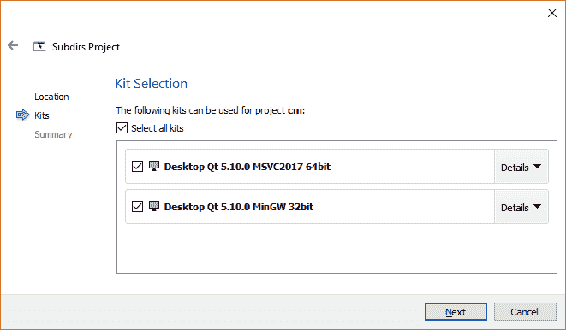
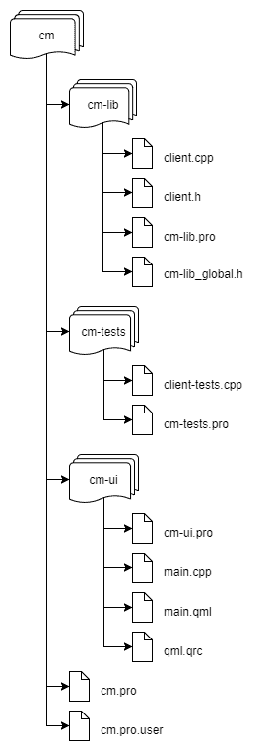
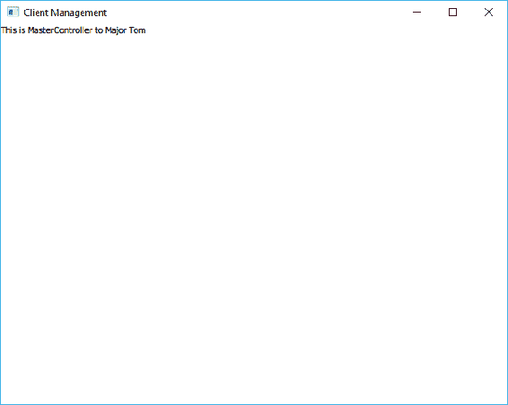
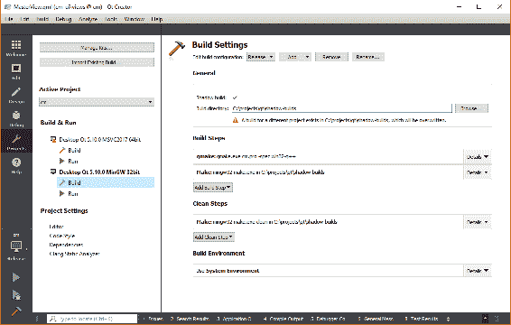

# 项目结构

在本章中，我们将创建一个新的多项目解决方案，这将是我们的示例应用程序的基础。我们将应用模型视图控制器模式，分离用户界面和业务逻辑。我们还将介绍 Qt 的单元测试框架——QtTest——并演示如何将其集成到我们的解决方案中。我们将在本章中介绍这些内容:

*   项目、MVC 和单元测试
*   创建库项目
*   创建单元测试项目
*   创建用户界面项目
*   掌握 MVC
*   QObject 基类
*   QML
*   控制项目产出

# 项目、MVC 和单元测试

我们在前一章中构建的草稿栏应用程序是一个 Qt 项目，由`.pro`文件表示。在商业环境中，技术解决方案通常作为公司计划的一部分来开发，这些计划通常也被称为**项目**。为了尽量减少混乱(以及项目这个词出现的次数！)，我们将使用 project 来表示由`.pro`文件定义的 Qt 项目，并使用 initiative 这个词来指代商业意义上的项目。

我们将着手开发一个通用的客户管理系统。这将是一种可以针对多种应用进行调整和再利用的东西，例如管理客户的供应商、管理患者的医疗服务等等。它将执行现实世界**业务线** ( **业务线**)应用程序中反复出现的常见任务，主要是添加、编辑和删除数据。

我们的草稿栏应用程序完全封装在一个项目中。对于较小的应用，这是完全可行的。然而，对于更大的代码库，尤其是涉及到几个开发人员时，将事情分解成更易于管理的部分通常是有好处的。

我们将使用**模型视图控制器** ( **MVC** )架构模式的超级轻量级实现。如果您以前没有遇到过 MVC，那么它主要用于从用户界面中分离业务逻辑。用户界面(视图)将命令传递给切换面板样式类(控制器)，以检索数据并执行所需的操作。控制器又将数据、逻辑和规则的责任委托给数据对象(模型):


关键是**视图**知道**控制器**和**模型**，因为它需要向**控制器**发送命令并显示**模型**中保存的数据。**控制器**知道**模型**，因为它需要将工作委托给它，但是它不知道**视图**。模型对**控制器**或**视图**一无所知。

在业务环境中以这种方式设计应用程序的一个主要好处是，敬业的 UX 专家可以处理视图，而程序员则处理业务逻辑。第二个好处是，因为业务逻辑层对用户界面一无所知，所以您可以添加、编辑甚至完全替换用户界面，而不会影响逻辑层。一个很好的用例是为桌面应用程序提供一个“全胖”的用户界面，为移动设备提供一个“半胖”的用户界面，两者可以使用相同的业务逻辑。考虑到所有这些，我们将在物理上将用户界面和业务逻辑分离到单独的项目中。

我们还将考虑将自动化单元测试集成到我们的解决方案中。单元测试和**测试驱动开发** ( **TDD** )最近真的越来越受欢迎了，当在商业环境中开发应用程序时，您很可能会在编写代码的同时编写单元测试。如果没有，你真的应该提议去做，因为它有很大的价值。如果你之前没有做过任何单元测试，不用担心；这非常简单，我们将在本书后面更详细地讨论它。

最后，我们需要一种方法将这些子项目聚合在一起，这样我们就不必单独打开它们。我们将通过一个伞式解决方案项目来实现这一点，该项目除了将其他项目捆绑在一起之外什么也不做。我们将这样安排我们的项目:


# 项目创建

在上一章中，我们看到了仅仅通过创建几个文本文件来设置一个新项目是多么容易。然而，我们将使用 Qt Creator 创建我们的新解决方案。我们将使用新项目向导来指导我们创建顶级解决方案和单个子项目。

从顶部菜单中，选择文件>新建文件或项目，然后选择项目>其他项目>子项目，然后单击选择…:


子项目是我们顶级解决方案项目所需的模板。给它命名`cm`并在我们的`qt`项目文件夹中创建它:


在套件选择窗格上，检查我们安装的台式机 Qt 5 . 10 . 0 MinGW 32 位套件。如果你已经安装了额外的套件，请随意选择你想要试用的套件，但这不是必须的。点击下一步:



如前所述，版本控制超出了本书的范围，因此在“项目管理”窗格中，从“添加到版本控制”下拉列表中选择“无”。单击完成并添加子项目:


我们将添加用户界面项目作为第一个子项目。该向导遵循与我们刚刚遵循的步骤大致相同的模式，因此请执行以下操作:

1.  选择项目>应用程序>季度快速应用程序-空，然后单击选择...
2.  在“项目位置”对话框中，将其命名为`cm-ui`(对于客户端管理-用户界面)，将该位置保留为我们的新`cm`文件夹，然后单击“下一步”。
3.  在“定义构建系统”对话框中，选择构建系统，然后单击“下一步”。
4.  在“定义项目详细信息”对话框中，保留 QT 5.9 的默认最小 QT 版本和“使用 Qt 虚拟键盘”框未选中，然后单击“下一步”。
5.  在“套件选择”对话框中，选择桌面 Qt 5 . 10 . 0 MinGW 32 位套件以及您想要尝试的任何其他套件，然后单击“下一步”。
6.  最后，在项目管理对话框中，跳过版本控制(保留为<none>)并点击完成。</none>

我们的顶级解决方案和用户界面项目现在已经启动并运行，所以让我们添加其他子项目。接下来添加业务逻辑项目，如下所示:

1.  在项目窗格中，右键单击顶层`cm`文件夹并选择新建子项目。
2.  选择项目>库> C++库，然后单击选择....
3.  在“简介和项目位置”对话框中，选择“共享库”作为类型，将其命名为`cm-lib`，在`<Qt Projects>/cm`中创建，然后单击“下一步”。
4.  在“选择所需模块”对话框中，只需接受默认的 QtCore，然后单击“下一步”。
5.  在**班级信息**对话框中，我们有机会创建一个新班级来开始学习。给出类名`Client`，加上`client.h`头文件和`client.cpp`源文件，然后点击下一步。
6.  最后，在项目管理对话框中，跳过版本控制(保留为<none>)并点击完成。</none>

最后，我们将重复创建单元测试项目的过程:

1.  新子项目....
2.  项目>其他项目>季度单元测试。
3.  项目名称`cm-tests`。
4.  包括 QtCore 和 QtTest。

5.  使用`testCase1`测试槽和`client-tests.cpp`文件名创建`ClientTests`测试类。将类型设置为测试，并选中生成初始化和清理代码。
6.  跳过版本控制并完成。

这需要通过很多对话框，但是我们现在已经有了框架解决方案。您的项目文件夹应该如下所示:



我们现在将依次查看每个项目，并在开始添加内容之前进行一些调整。

# cm-lib

首先，前往文件浏览器，在`cm-lib`下创建一个名为`source`的新子文件夹；将`cm-lib_global.h`移到那里。在`source`中创建另一个名为`models`的子文件夹，并将两个`Client`类文件移到那里。

接下来，回到 Qt Creator，打开`cm-lib.pro`并编辑如下:

```cpp
QT -= gui
TARGET = cm-lib
TEMPLATE = lib
CONFIG += c++14
DEFINES += CMLIB_LIBRARY
INCLUDEPATH += source

SOURCES += source/models/client.cpp

HEADERS += source/cm-lib_global.h \
    source/models/client.h
```

由于这是一个库项目，我们不需要加载默认的 GUI 模块，所以我们使用`QT`变量将其排除。`TARGET`变量是我们希望给出二进制输出的名称(例如，`cm-lib.dll`)。它是可选的，如果没有提供，将默认为项目名称，但我们会明确。接下来，不是像我们在便签簿应用程序中看到的那样有一个`TEMPLATE`应用程序，这次我们使用`lib`给我们一个库。我们通过`CONFIG`变量添加 c++14 特性。

`cm-lib_global.h`文件是一个有用的预处理器样板，我们可以用它来导出我们的共享库符号，你很快就会看到它投入使用。我们使用`DEFINES`变量中的`CMLIB_LIBRARY`标志来触发该导出。

最后，我们稍微重写了一下`SOURCES`和`HEADERS`变量列表，以便在我们移动一些东西之后说明新的文件位置，并且我们将源文件夹(这是我们所有代码将驻留的地方)添加到`INCLUDEPATH`中，以便在我们使用`#include`语句时搜索路径。

右键单击项目窗格中的`cm-lib`文件夹，并选择运行质量评估。完成后，再次右键单击并选择**重建**。一切都应该是绿色和快乐的。

# cm-测试

创建新的`source/models`子文件夹并将`client-tests.cpp`移到那里。切换回 Qt 创建者并编辑`cm-tests.pro`:

```cpp
QT += testlib
QT -= gui
TARGET = client-tests
TEMPLATE = app

CONFIG += c++14 
CONFIG += console 
CONFIG -= app_bundle

INCLUDEPATH += source 

SOURCES += source/models/client-tests.cpp
```

除了我们想要一个控制台应用程序而不是一个库之外，这遵循了与`cm-lib`几乎相同的方法。我们不需要图形用户界面模块，但是我们将添加`testlib`模块来访问 Qt 测试功能。

这个子项目还没有太多内容，但是您应该能够成功地运行 qmake 并重建。

# cm-ui

这次创建两个子文件夹:`source`和`views`。将`main.cpp`移至`source`，将`main.qml`移至`views`。将`qml.qrc`重命名为`views.qrc`，编辑`cm-ui.pro`:

```cpp
QT += qml quick

TEMPLATE = app

CONFIG += c++14 

INCLUDEPATH += source 

SOURCES += source/main.cpp 

RESOURCES += views.qrc 

# Additional import path used to resolve QML modules in Qt Creator's code model 
QML_IMPORT_PATH = $$PWD
```

我们的 UI 是用 QML 写的，需要`qml`和`quick`模块，所以我们增加了这些。我们编辑`RESOURCES`变量来获取我们重命名的资源文件，并且还编辑`QML_IMPORT_PATH`变量，当我们进入定制的 QML 模块时，我们将详细讨论这个变量。

接下来，编辑`views.qrc`以说明我们已经将`main.qml`文件移动到了`views`文件夹中。记得右键点击并用>纯文本编辑器打开:

```cpp
<RCC>
    <qresource prefix="/">
        <file>views/main.qml</file>
    </qresource>
</RCC>
```

最后，我们还需要在`main.cpp`中编辑一行来说明文件移动:

```cpp
engine.load(QUrl(QStringLiteral("qrc:/views/main.qml")));
```

您现在应该能够运行 qmake 并重建`cm-ui`项目。在运行它之前，让我们快速查看一下构建配置按钮，因为我们已经打开了多个项目:


请注意，现在，除了工具包和构建选项，我们还必须选择我们希望运行的可执行文件。确保选择`cm-ui`，然后运行应用程序:


你好，世界。这是相当没有启发性的东西，但我们有一个多项目解决方案愉快地构建和运行，这是一个很好的开始。当你不能享受更多乐趣时，请关闭应用程序！

# 掌握 MVC

现在我们的解决方案结构已经就位，我们将开始 MVC 实现。正如您将看到的，它非常小，并且非常容易设置。

首先，展开`cm-ui > Resources > views.qrc > / > views`，右键点击`main.qml`，选择【重命名】，将文件重命名为`MasterView.qml`。如果您收到有关项目编辑的消息，请选择“是”继续:


如果您确实收到错误消息，该文件仍将在“项目”窗格中显示为`main.qml`，但该文件将在文件系统中被重命名。

接下来，编辑`views.qrc`(右键点击并选择>纯文本编辑器打开)。将内容替换如下:

```cpp
<RCC>
    <qresource prefix="/views">
        <file alias="MasterView.qml">views/MasterView.qml</file>
    </qresource>
</RCC>
```

如果你还记得我们是如何在`main.cpp`中加载这个 QML 文件的，语法是`qrc:<prefix><filename>`。我们之前有一个`/`前缀和一个`views/main.qml`相对文件名。这给了我们`qrc:/views/main.qml`。

`/`的前缀并不十分具有描述性。随着您添加越来越多的 QML 文件，用有意义的前缀将它们组织成块确实很有帮助。拥有非结构化资源块还会使“项目”窗格变得丑陋且更难导航，正如您刚刚看到的，您必须深入查看`views.qrc > / > views`。所以，第一步是将前缀从`/`重命名为`/views`。

然而，有了`/views`的前缀和`views/main.qml`的相对文件名，我们的网址现在是`qrc:/views/views/main.qml`。

这比以前更糟糕了，我们在`views.qrc`中还有一个很深的文件夹结构。幸运的是，我们可以为我们的文件添加一个*别名*来解决这两个问题。你可以用一个资源的别名代替相对路径，所以如果我们分配一个`main.qml`的别名，我们可以用简单的`main.qml`代替`views/main.qml`，给我们`qrc:/views/main.qml`。

这是简洁和描述性的，我们的项目窗格也更整洁。

所以，回到我们更新的`views.qrc`版本，我们已经简单地将文件的名称从`main.qml`更新为`MasterView.qml`，与我们执行的文件重命名一致，并且我们还提供了一个快捷别名，因此我们不必指定视图两次。

我们现在需要更新`main.cpp`中的代码来反映这些变化:

```cpp
engine.load(QUrl(QStringLiteral("qrc:/views/MasterView.qml")));
```

您应该能够运行 qmake，并构建和运行以验证没有任何损坏。

接下来，我们将创建一个`MasterController`类，因此右键单击`cm-lib`项目并选择添加新… > C++ > C++类>选择…:


使用浏览…按钮创建`source/controllers`子文件夹。

通过选择 QObject 作为基类并包含它，Qt Creator 将为我们编写一些样板代码。您可以稍后自己添加，所以不要觉得这是创建新类的必要部分。

一旦您跳过了版本控制并创建了类，请按如下方式声明和定义它。我们的`MasterController`还没有做什么特别激动人心的事情，我们只是在做基础工作。

以下是`master-controller.h`:

```cpp
#ifndef MASTERCONTROLLER_H
#define MASTERCONTROLLER_H
#include <QObject>

#include <cm-lib_global.h>
namespace cm {
namespace controllers {
class CMLIBSHARED_EXPORT MasterController : public QObject
{
    Q_OBJECT
public:
    explicit MasterController(QObject* parent = nullptr);
};

}}

#endif
```

我们真正添加到 Qt Creator 给我们的默认实现中的是 Qt Creator 在`cm-lib_global.h`中为我们编写的`CMLIBSHARED_EXPORT`宏，以处理我们的共享库导出，并将该类放在一个命名空间中。

I always have the project name as a root namespace and then additional namespaces that reflect the physical location of the class files within the source directory, so in this case, I use `cm::controllers`, as the class is located in the directory `source/controllers`.

这是`master-controller.cpp`:

```cpp
#include "master-controller.h"

namespace cm {
namespace controllers {
MasterController::MasterController(QObject* parent)
    : QObject(parent)
{
}

}}

```

I use a slightly unorthodox style in the implementation file—most people just add `using namespace cm::controllers;` at the top of the `.cpp` file. I often like to put the code within the scope of namespaces because it becomes collapsible in the IDE. By repeating the innermost namespace scope (*controllers* in this example), you can break your code up into collapsible regions much like you can in C#, which helps with navigation in larger files, as you can collapse the sections you’re not interested in. It makes no functional difference, so use whichever style you prefer.

# Q 对象

那么，我们继承的这个不断出现的古怪的东西是什么？嗯，它是所有 Qt 对象的基类，它免费给了我们一些强大的功能。

QObjects 将自己组织成对象层次结构，其中*父*对象承担其*子*对象的所有权，这意味着我们不必担心(同样多！)关于内存管理。例如，如果我们有一个从 QObject 派生的 Client 类的实例，它是同样从 QObject 派生的 Address 的父类，那么当客户端被销毁时，该地址会自动被销毁。

QObjects 携带的元数据允许一定程度的类型检查，并且是与 QML 交互的支柱。他们还可以通过事件订阅机制相互通信，其中事件作为*信号*发出，订阅的代表被称为*槽*。

现在您需要记住的是，对于您在用户界面中想要与之交互的任何自定义类，请确保它是从 QObject 派生的。无论何时从 QObject 派生，在做任何其他事情之前，确保总是将神奇的 Q_OBJECT 宏添加到类中。它注入了一堆超级复杂的样板代码，为了有效地使用 QObjects，您不需要理解这些代码。

我们现在需要引用另一个(`cm-ui`)子项目(`cm-lib`中的`MasterController`)的代码。我们首先需要能够访问我们的`#include`声明的声明。如下编辑`cm-ui.pro`中的`INCLUDEPATH`变量:

```cpp
INCLUDEPATH += source \
    ../cm-lib/source
```

`\`符号是“继续到下一行”的指示符，因此您可以将一个变量设置为跨越多行的多个值。就像控制台命令一样，'..'意味着向上遍历一个级别，所以这里我们从本地文件夹(`cm-ui`)开始，然后向下进入`cm-lib`文件夹，获取它的源代码。您需要注意项目文件夹相对于彼此保持在相同的位置，否则这将不起作用。

就在下面，我们将告诉我们的 UI 项目在哪里可以找到我们的库项目的实现(编译的二进制)。如果您查看顶层`cm`项目文件夹旁边的文件系统，您将看到一个或多个构建文件夹，例如，build-cm-Desktop _ Qt _ 5 _ 9 _ 0 _ MinGW _ 32 bit-Debug。每个文件夹都是在我们为给定的工具包和配置运行 qmake 时创建的，并在我们构建时用输出填充。

接下来，导航到与您正在使用的工具包和配置相关的文件夹，您会发现一个 cm-lib 文件夹，其中包含另一个配置文件夹。复制此文件路径；例如，我在 Debug 配置中使用的是 MinGW 32 位套件，所以我的路径是`<Qt Projects>/build-cm-Desktop_Qt_5_10_0_MinGW_32bit-Debug/cm-lib/debug`。

在该文件夹中，您将找到与您的操作系统相关的已编译二进制文件，例如，Windows 上的`cm-lib.dll`。这是我们希望我们的`cm-ui`项目为`cm-lib`库实现提供参考的文件夹。要进行设置，请在`cm-ui.pro`中添加以下语句:

```cpp
LIBS += -L$$PWD/../../build-cm-Desktop_Qt_5_10_0_MinGW_32bit-Debug/cm-lib/debug -lcm-lib
```

`LIBS`是用于向项目添加引用库的变量。`-L`前缀表示目录，`-l`表示库文件。使用该语法，我们可以忽略文件扩展名(`.a`、`.o`、`.lib`)和前缀(lib...)，这可能因操作系统而异，让 qmake 来解决。我们使用特殊的`$$`符号来访问`PWD`变量的值，该变量包含当前项目的工作目录(本例中为`cm/cm-ui`的完整路径)。从那个位置，我们接着用`../..`向上钻取两个目录，以获得 Qt 项目文件夹。从那里，我们向下钻回到我们知道构建`cm-lib`二进制文件的位置。

现在，这写起来很痛苦，丑得要命，一旦我们切换套件或配置就会掉下来，但我们稍后会回来整理这一切。随着项目参考资料全部连线，我们可以直接进入`cm-ui`中的`main.cpp`。

为了能够在 QML 使用给定的类，我们需要注册它，在创建 QML 应用引擎之前，我们在`main()`中注册它。首先，包括`MasterController`:

```cpp
#include <controllers/master-controller.h>
```

然后，就在`QGuiApplication`实例化之后但在`QQmlApplicationEngine`声明之前，添加以下行:

```cpp
qmlRegisterType<cm::controllers::MasterController>("CM", 1, 0, "MasterController");
```

我们在这里做的是用 QML 发动机注册类型。请注意，模板参数必须完全符合所有命名空间。我们将该类型的元数据添加到一个名为 CM 的模块中，版本号为 1.0，我们希望在 QML 标记中将该类型称为`MasterController`。

然后，我们实例化`MasterController`的一个实例，并将其注入到根 QML 上下文中:

```cpp
cm::controllers::MasterController masterController;

QQmlApplicationEngine engine;
engine.rootContext()->setContextProperty("masterController", &masterController);
engine.load(QUrl(QStringLiteral("qrc:/views/MasterView")));
```

请注意，您需要在加载 QML 文件之前设置 context 属性，并且还需要添加以下标头:

```cpp
#include <QQmlContext>
```

因此，我们已经创建了一个控制器，并在 QML 引擎上注册了它，现在可以运行了。现在怎么办？让我们先来看看 QML。

# QML

**Qt 建模语言** ( **QML** )是一种用于用户界面布局的分层声明性语言，其语法类似于 **JavaScript 对象符号** ( **JSON** )。它可以通过 Qt 的元对象系统绑定到 C++对象，还支持内联 JavaScript。它很像超文本标记语言或 XAML，但没有圣诞节。如果你是一个喜欢 JSON 多于 XML 的人，这只能是一件好事！

继续打开`MasterView.qml`，我们会看到发生了什么。

首先你会看到几个`import`语句。它们类似于 C++中的`#include`语句——它们引入了我们想要在视图中使用的一些功能。它们可以像 QtQuick 2.9 一样打包和版本化模块，也可以是本地内容的相对路径。

接下来，QML 层次结构从一个窗口对象开始。对象的范围由后面的`{}`表示，因此大括号内的所有内容要么是对象的属性，要么是对象的子对象。

属性遵循 JSON 属性语法，形式为键:值。一个显著的区别是，除非您提供字符串作为值，否则不需要语音标记。这里我们将 Window 对象的`visible`属性设置为`true`，窗口大小为 640 x 480 像素，在标题栏显示 Hello World。

让我们更改标题并添加一条简单的消息。用客户端管理替换 Hello World 标题，并在窗口正文中插入文本组件:

```cpp
Window {
    visible: true
    width: 640
    height: 480
    title: qsTr("Client Management")

    Text {
        text: "Welcome to the Client Management system!"
    }
}
```

保存您的更改，运行 qmake 并运行应用程序:


让我们让`MasterController`开始获得它的保留，而不是在用户界面中硬编码我们的欢迎消息，我们将从我们的控制器动态地获得它。

编辑`master-controller.h`并添加名为`welcomeMessage`的`QString`类型的新公共属性，将其设置为初始值:

```cpp
QString welcomeMessage = "This is MasterController to Major Tom";
```

你还需要`#include <QString>`。

为了能够从 QML 访问该成员，我们需要配置一个新的属性。在 Q_OBJECT 宏之后但在第一个公共访问修饰符之前，添加以下内容:

```cpp
Q_PROPERTY( QString ui_welcomeMessage MEMBER welcomeMessage CONSTANT )
```

这里，我们正在创建一个新的 QString 类型的属性，QML 可以访问它。QML 将该属性称为`ui_welcomeMessage`，当被调用时，将获取(或设置)名为`welcomeMessage`的`MEMBER`变量中的值。我们提前明确设置了变量的值，不会改变，所以保持`CONSTANT`。

You can simply name the property `welcomeMessage`, rather than `ui_welcomeMessage`. My personal preference is to explicitly name things that are solely intended for UI consumption with a ui_ prefix to differentiate them from member variables and methods. Do whatever works for you.

返回`MasterView.qml`，我们将使用这个属性。将`Text`组件的`text`属性更改为以下内容:

```cpp
text: masterController.ui_welcomeMessage
```

注意 QML 编辑器如何识别`masterController`，甚至为其提供代码补全。现在，QML 将访问我们在`main()`中注入根上下文的`MasterController`实例的`ui_welcomeMessage`属性，而不是显示字符串作为消息，这反过来将获得`welcomeMessage`成员变量的值。

构建并运行，现在您应该会看到来自`MasterController`的消息:



我们现在有了一个工作机制，让 QML 调用 C++代码，并获得我们想要提供的任何数据和业务逻辑。这里需要注意的一点是，我们的`MasterController`对`MasterView`的存在一无所知，这是 MVC 模式的关键部分。

# 项目产出

为了让我们的`cm-ui`项目知道在哪里可以找到`cm-lib`的实现，我们在项目文件中使用了`LIBS`变量。这是一个相当丑陋的文件夹名称，但它只有一行，而且一切都运行得很好，所以让事情保持原样可能很有诱惑力。然而，期待当我们准备好为测试甚至生产生产我们的第一个构建时。我们已经编写了一些非常聪明的代码，一切都在完美地构建和运行。我们将配置从调试切换到发布...一切都结束了。问题是，我们已经在项目文件中对库路径进行了硬编码，以便在`Debug`文件夹中查找。换一个不同的工具包或另一个操作系统，问题会更严重，因为使用不同的编译器会产生二进制兼容性问题。

让我们设定几个目标:

*   扔掉笨重的文件夹
*   将所有编译后的二进制输出汇总到一个公共文件夹中`cm/binaries`
*   将所有临时构建构件隐藏在自己的文件夹中`cm/<project>/build`
*   为不同的编译器和架构创建单独的构建和二进制文件夹
*   自动检测那些编译器和架构

那么，这些有趣的长文件夹名从何而来呢？在 Qt 创建器中，单击导航栏中的项目模式图标。在构建和运行部分的左侧，选择桌面 Qt 5.9.0 MinGW 32 位>构建。在这里，您将看到该解决方案中 MinGW 工具包的构建设置，并且在影子构建复选框下，您将识别长构建目录。

我们需要启用影子构建，因为这使我们能够为不同的套件在不同的位置执行构建。我们将在`.pro`文件中控制构建的精确输出，但是我们仍然需要在这里指定一个构建目录来保持 Qt Creator 的快乐。进入< Qt 项目>/阴影构建。使用窗格顶部的下拉菜单为每个构建配置(调试/发布/配置文件)以及您正在使用的所有套件重复此设置:



在你的文件系统中，删除任何旧的`build-cm…`文件夹。右键单击解决方案文件夹，然后运行 qmake。qmake 完成后，您应该会看到 shell `cm-lib`、`cm-tests`和`cm-ui`文件夹已经在< Qt 项目>/阴影构建中创建，并且长的`build-cm…`文件夹没有重新出现。

动态设置任何相对路径的第一步是知道您当前所在的路径。当我们使用`$$PWD`获取项目工作目录时，我们已经在 qmake 中看到了这一点。为了帮助我们可视化正在发生的事情，让我们介绍我们的第一个 qmake 函数— `message()`。

在`cm.pro`中添加以下一行——它在文件中的位置并不重要:

```cpp
message(cm project dir: $${PWD})
```

在`cm-lib.pro`增加以下一行:

```cpp
message(cm-lib project dir: $${PWD})
```

`message()`是 qmake 支持的一个测试功能，将提供的字符串参数输出到控制台。请注意，您不需要用双引号将文本括起来。保存更改时，您将看到解决方案项目和库项目的**项目工作目录** ( **PWD** )已注销到通用消息控制台:

`Project MESSAGE: cm project dir: C:/projects/qt/cm`

`Project MESSAGE: cm-lib project dir: C:/projects/qt/cm/cm-lib`

qmake actually takes multiple passes over `.pro` files, so whenever you use `message()`, you may see the same output several times over in the console. You can filter out the majority of duplicates using `message()` in conjunction with a scope—`!build_pass:message(Here is my message)`. This prevents the `message()` method from being called during the build pass.

如果我们回顾一下影子构建的 Qt Creator 的默认行为，我们会发现目标是允许多个构建并排放置。这是通过构造包含套件、平台和构建配置的不同文件夹名称来实现的:

`build-cm-solution-Desktop_Qt_5_10_0_MinGW_32bit-Debug`

在调试模式下，通过查看文件夹名称，您可以看到内容来自使用 Qt 5.10.0 桌面 MinGW 32 位工具包构建的 **cm** 项目。我们现在将以一种更干净、更灵活的方式重新实现这种方法。

我们更喜欢由`Operating System > Compiler > Processor Architecture > Build Configuration`文件夹组成的层次结构，而不是将信息串联成一个长文件夹名。

让我们先对这条路径进行硬编码，然后再进行自动化。编辑`cm-lib.pro`并添加:

```cpp
DESTDIR = $$PWD/../binaries/windows/gcc/x86/debug
message(cm-lib output dir: $${DESTDIR})
```

这是为了反映我们正在调试模式下用 MinGW 32 位工具包在 Windows 上构建。如果你在不同的操作系统上，用 *osx* 或 *Linux* 替换 *Windows* 。我们添加了对`message()`的另一个调用，以在通用消息控制台中输出该目标目录。记住`$$PWD`提取的是正在处理的`.pro`文件的工作目录(本例中为`cm-lib.pro`，所以这就给了我们`<Qt Projects>/cm/cm-lib`。

右键点击`cm-lib`项目，运行 qmake，构建。确保选择了 MinGW 工具包以及调试模式。

导航到文件系统中的`<Qt Projects>/cm/binaries/<OS>/gcc/x86/debug`，您将看到我们的库二进制文件，没有相关的杂乱构建工件。这是很好的第一步，但是如果您现在将构建配置更改为 Release 或 switch kits，目标目录将保持不变，这不是我们想要的。

我们将要实现的技术将在我们所有的三个项目中使用，所以与其在我们所有的`.pro`文件中复制配置，不如将配置提取到一个共享文件中并包含它。

在根`cm`文件夹中，创建两个名为`qmake-target-platform.pri`和`qmake-destination-path.pri`的新空文本文件。在`cm-lib.pro`、`cm-tests.pro`和`cm-ui.pro`中，添加以下行:

```cpp
include(../qmake-target-platform.pri)
include(../qmake-destination-path.pri)
```

将这些行添加到靠近`*.pro`文件顶部的某个地方。确切的顺序没有太大关系，只要它们在`DESTDIR`变量设置之前。

编辑`qmake-target-platform.pri`如下:

```cpp
win32 {
    CONFIG += PLATFORM_WIN
    message(PLATFORM_WIN)
    win32-g++ {
        CONFIG += COMPILER_GCC
        message(COMPILER_GCC)
    }
    win32-msvc2017 {
        CONFIG += COMPILER_MSVC2017
        message(COMPILER_MSVC2017)
        win32-msvc2017:QMAKE_TARGET.arch = x86_64
    }
}

linux {
    CONFIG += PLATFORM_LINUX
    message(PLATFORM_LINUX)
    # Make QMAKE_TARGET arch available for Linux
    !contains(QT_ARCH, x86_64){
        QMAKE_TARGET.arch = x86
    } else {
        QMAKE_TARGET.arch = x86_64
    }
    linux-g++{
        CONFIG += COMPILER_GCC
        message(COMPILER_GCC)
    }
}

macx {
    CONFIG += PLATFORM_OSX
    message(PLATFORM_OSX)
    macx-clang {
        CONFIG += COMPILER_CLANG
        message(COMPILER_CLANG)
        QMAKE_TARGET.arch = x86_64
    }
    macx-clang-32{
        CONFIG += COMPILER_CLANG
        message(COMPILER_CLANG)
        QMAKE_TARGET.arch = x86
    }
}

contains(QMAKE_TARGET.arch, x86_64) {
    CONFIG += PROCESSOR_x64
    message(PROCESSOR_x64)
} else {
    CONFIG += PROCESSOR_x86
    message(PROCESSOR_x86)
}
CONFIG(debug, release|debug) {
    CONFIG += BUILD_DEBUG
    message(BUILD_DEBUG)
} else {
    CONFIG += BUILD_RELEASE
    message(BUILD_RELEASE)
}
```

在这里，我们利用 qmake 的平台检测能力将个性化标志注入`CONFIG`变量。在每个操作系统上，不同的平台变量变得可用。例如，在 Windows 上，`win32`变量存在，Linux 用`linux`表示，Mac OS X 用`macx`表示。我们可以使用这些带有大括号的平台变量，就像 if 语句一样:

```cpp
win32 {
    # This block will execute on Windows only…
}
```

我们可以考虑平台变量的不同组合，弄清楚当前选择的套件使用的是什么编译器和处理器架构，然后给`CONFIG`添加开发者友好的标志，我们可以在后面的`.pro`文件中使用。请记住，我们正在尝试构建一条构建路径— `Operating System > Compiler > Processor Architecture > Build Configuration`。

保存这些更改时，您应该会在常规消息控制台中看到类似以下内容的标志:

```cpp
Project MESSAGE: PLATFORM_WIN
Project MESSAGE: COMPILER_GCC
Project MESSAGE: PROCESSOR_x86
Project MESSAGE: BUILD_DEBUG
```

尝试切换套件或更改构建配置，您应该会看到不同的输出。当我在发布模式下将我的工具包切换到 Visual Studio 2017 64 位时，我现在得到了以下信息:

```cpp
Project MESSAGE: PLATFORM_WIN
Project MESSAGE: COMPILER_MSVC2017
Project MESSAGE: PROCESSOR_x64
Project MESSAGE: BUILD_RELEASE
```

在一台装有 MinGW 64 位工具包的 Linux 机器上进行同样的项目，我得到了这样的结果:

```cpp
Project MESSAGE: PLATFORM_LINUX
Project MESSAGE: COMPILER_GCC
Project MESSAGE: PROCESSOR_x64
Project MESSAGE: BUILD_DEBUG
```

在使用 Clang 64 位的苹果电脑上，我得到了以下信息:

```cpp
Project MESSAGE: PLATFORM_OSX
Project MESSAGE: COMPILER_CLANG
Project MESSAGE: PROCESSOR_x64
Project MESSAGE: BUILD_DEBUG
```

To get this to work on Windows, I had to make an assumption as `QMAKE_TARGET.arch` is not correctly detected for MSVC2017, so I assumed that if the compiler is MSVC2017, then it must be x64 as there was no 32 bit kit available.

现在所有的平台检测都完成了，我们可以动态地构建目标路径。编辑`qmake-destination-path.pri`:

```cpp
platform_path = unknown-platform
compiler_path = unknown-compiler
processor_path = unknown-processor
build_path = unknown-build

PLATFORM_WIN {
    platform_path = windows
}
PLATFORM_OSX {
    platform_path = osx
}
PLATFORM_LINUX {
    platform_path = linux
}

COMPILER_GCC {
    compiler_path = gcc
}
COMPILER_MSVC2017 {
    compiler_path = msvc2017
}
COMPILER_CLANG {
    compiler_path = clang
}

PROCESSOR_x64 {
    processor_path = x64
}
PROCESSOR_x86 {
    processor_path = x86
}

BUILD_DEBUG {
    build_path = debug
} else {
    build_path = release
}

DESTINATION_PATH = $$platform_path/$$compiler_path/$$processor_path/$$build_path
message(Dest path: $${DESTINATION_PATH})
```

在这里，我们创建了四个新变量——*platform _ path*、*编译器 _path* 、*处理器 _path* 、*build _ path*——并为它们全部赋值。然后，我们使用在前面的文件中创建的`CONFIG`标志，并构建我们的文件夹层次结构，将其存储在我们自己的变量中，称为`DESTINATION_PATH`。例如，如果我们检测到 Windows 是操作系统，我们将`PLATFORM_WIN`标志添加到`CONFIG`中，结果是将`platform_path`设置为`windows`。在 Windows 上的套件和配置之间切换时，我现在收到以下消息:

```cpp
Dest path: windows/gcc/x86/debug
```

或者，我得到这个:

```cpp
Dest path: windows/msvc2017/x64/release
```

在 Linux 上，我得到了以下信息:

```cpp
Dest path: linux/gcc/x64/debug
```

在苹果操作系统上，我得到的是:

```cpp
Dest path: osx/clang/x64/debug
```

您可以将这些平台检测和目标路径创建技巧组合在一个文件中，但是通过将它们分开，您可以在项目文件的其他地方使用这些标志。无论如何，我们现在正在基于我们的构建环境动态地创建一个路径，并将其存储在一个变量中供以后使用。

接下来要做的就是将这个`DESTINATION_PATH`变量插入到我们的项目文件中。当我们在这里的时候，我们也可以通过添加一些行来使用相同的机制来构造我们的构建工件。将以下内容添加到所有三个`*.pro`文件中，替换已经在`cm-lib.pro`中的`DESTDIR`语句:

```cpp
DESTDIR = $$PWD/../binaries/$$DESTINATION_PATH
OBJECTS_DIR = $$PWD/build/$$DESTINATION_PATH/.obj
MOC_DIR = $$PWD/build/$$DESTINATION_PATH/.moc
RCC_DIR = $$PWD/build/$$DESTINATION_PATH/.qrc
UI_DIR = $$PWD/build/$$DESTINATION_PATH/.ui
```

临时构建工件现在将被放入构建文件夹中的独立目录中。

最后，我们可以解决最初把我们带到这里的问题。在`cm-tests`和`cm-ui`中，我们现在可以使用新的动态目标路径设置`LIBS`变量:

```cpp
LIBS += -L$$PWD/../binaries/$$DESTINATION_PATH -lcm-lib
```

现在，您可以右键单击`cm`项目，运行 qmake，并构建以一步自动构建所有三个子项目。所有的输出将被发送到正确的地方，库二进制文件可以很容易地被其他项目找到。您可以切换套件和配置，而不必担心引用错误的库。

# 摘要

在这一章中，我们将我们的项目创建技能提升到了一个新的水平，我们的解决方案现在开始成形。我们实现了一个 MVC 模式，并弥合了用户界面和业务逻辑项目之间的差距。我们涉猎了 QML 的第一部分，并研究了 Qt 框架的基石——Qobject。

我们移除了所有难看的文件夹，舒展了肌肉，控制了所有文件的去向。所有二进制文件现在都放在`cm/binaries`文件夹中，按照平台、编译器、处理器架构和构建配置进行组织。最终用户不需要的所有临时构建工件现在都被隐藏起来了。我们可以自由切换套件和构建配置，并让我们的输出自动重新路由到正确的位置。

在[第三章](3.html)、*用户界面*中，我们将设计我们的 UI，并陷入更多的 QML。