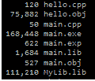
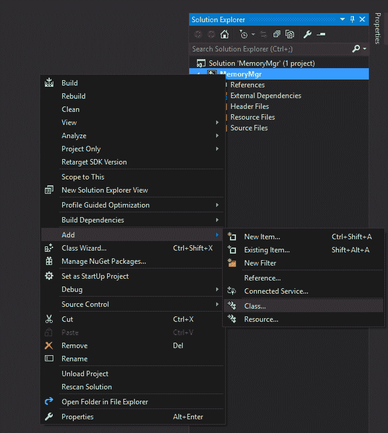
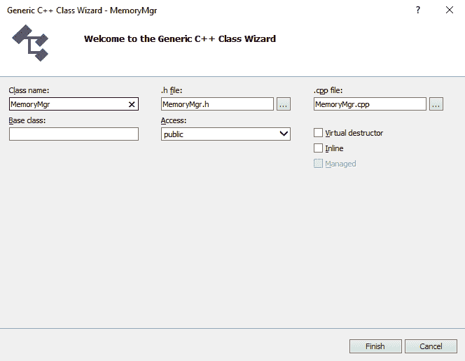
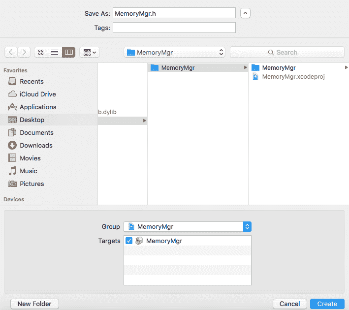
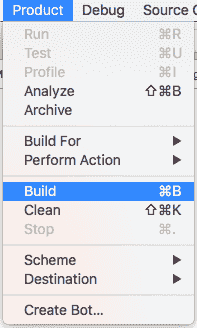
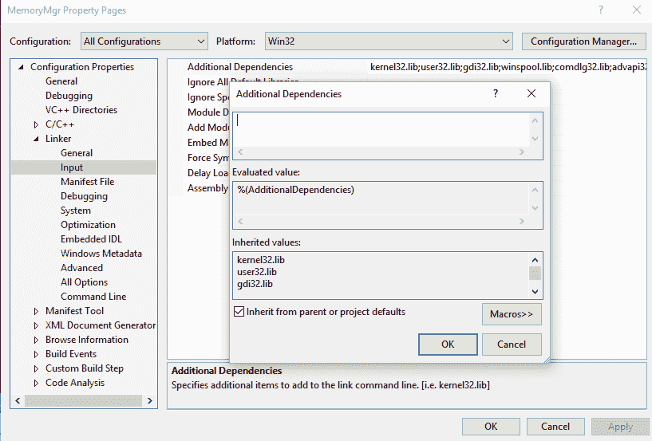

# 理解图书馆

了解库如何工作对于掌握 C++游戏开发极其重要。了解库如何在 C++中工作将使您能够构建更健壮的游戏和工具。通常，创建游戏引擎核心的最基本要素可以在易于使用的*可再发行*库中找到。在本章中，我们将探讨库类型之间的主要区别，以及如何创建、构建和使用它们。对于这一章，我假设你已经通读了[第一章](01.html)、*游戏开发用 C++第五章*，并且对编译和链接过程有了大致的了解。本章由以下几节组成:

*   库构建类型
*   构建自定义共享库

# 我们为什么使用图书馆？

库是 C++中的一个关键概念，它们是允许语言构建模块化设计和可移植代码的机制。通过使用库，我们能够创建可重用的代码，以便在多个程序之间以及与其他开发人员共享。它让开发人员不必一遍又一遍地重写特定的代码块，从而节省时间。通过允许使用其他开发人员的解决方案来解决常见问题，这也节省了开发人员的时间。**标准模板库** ( **STL** )就是一个很好的例子。对于 C++中常见的大量问题，STL 都有解决方案。这些解决方案包括实现字符串等数据类型、向量等容器以及排序等算法。这些标准实现来自多年的改进和发展。因此，它们往往具有令人难以置信的性能和高度优化，作为一般规则，我建议默认使用标准实现，而不是手写实现。有成千上万的库可用于 C++开发。

# 库构建类型

创建库文件有几种不同的方法。您可以使用不同的工具，如**集成开发环境** ( **IDE** )。开发环境工具，如 Visual Studio 和 XCode，通常包含模板或启动项目来为各种平台和情况创建库文件。另一种更简单的方式，也是我们在这里使用的方式是通过命令行。更具体地说，是 Visual Studio 2015 附带的开发人员命令提示符和 macOS X 附带的终端程序。您可以在 Visual Studio 网站上获得 Visual Studio 2015 社区版的副本，这是一个面向五名或更少开发人员的团队的免费版本。

要在 Windows 8 或更高版本上打开开发者命令提示符，点击 Windows 键并开始键入`developer command prompt`，当出现 VS2105 时选择开发者命令提示符:


要打开 OS X 终端，请打开应用程序启动器，并在屏幕顶部的搜索栏中键入`Terminal`:


首先，让我们创建一个基本库，这样我们就可以从其他程序中使用它。在这个例子中，我们将只编写一个简单的函数，它将打印出历史悠久的行`Hello World`。如果没有至少一个 hello world 程序，这就不是一本关于编程的书。这是我们将要使用的文件，我把我的保存为`hello.cpp`。

```cpp
#include <iostream> 
void Hello() 
{ 
  std::cout<< "Hello World!"<<std::endl; 
} 
```

# 静态链接库

静态库是作为应用程序本身的一部分编译的库。这意味着所有与库相关的代码都包含在一个文件中，在 Windows 系统上是`.lib`，在 Linux/OS X 系统上是`.a`，并且直接链接到程序中。包含静态库的程序从库中创建所需代码的副本，并将该副本放在调用库实现的程序中。每次打电话到图书馆都会这样。这导致了使用静态库的一个更大的缺点，它增加了可执行文件的整体大小。另一方面，使用静态库的优点是用户运行程序不需要外部依赖。这有助于避免用户系统上的库是错误版本或者不得不与程序一起分发的问题，这可能会产生一大堆问题。你会经常听到这个常见的问题被提到 *Dll 地狱*。静态库的另一个优点是，由于它们作为构建过程的一部分被链接，这将允许编译器和构建工具有更多的机会来优化实现。一个好的经验法则是，对于公共或标准库，大多数用户(OpenGL 或 DirectX)将使用动态或共享库。对于不太常见的库(GLFW 或 SDL)，您更可能使用静态库。

要从开发人员命令提示符将我们的`hello.cpp`文件转换为静态库，我们执行以下步骤:

# 在窗口上

请遵循以下步骤:

1.  对于 Windows，您需要键入以下命令:

```cpp
    cl /c hello.cpp
```

`cl`是编译和链接的命令。`/c`告诉编译器我们只想编译，不链接我们的文件。最后，我们传入要编译的文件。这将创建一个对象文件，`hello.obj`，然后我们可以用它来创建我们的静态库文件。

2.  现在我们已经创建了目标文件，我们可以使用库构建工具来创建静态库。我们使用以下命令生成一个`.lib`文件:

```cpp
    lib /out:MyLib.lib hello.obj
```

`lib`是启动构建工具的命令。`/out:MyLib.lib`告诉编译器将库版本命名为`MyLib.lib`。

3.  如果我们列出目录的内容，你会看到我们现在有了我们的静态库`MyLib.lib`:


4.  我们现在可以在其他项目中使用我们新创建的库。让我们创建一个非常简单的程序来使用我们的库:

```cpp
void Hello(); //Forward declaration of our Hello function 
void main() 
{ 
  Hello(); 
} 
```

我把文件保存为`main.cpp`。

这个程序将调用`Hello`函数，然后编译器在我们的链接库中寻找实现。

5.  要编译这个程序并链接我们的静态库，我们可以使用以下命令:

```cpp
    cl main.cpp /link MyLib.lib
```

6.  一旦编译完成，我们的目录中就会有一个`main.exe`:



# 在 macOS X 上

请遵循以下步骤:

1.  对于 macOS X，您需要键入以下命令:

```cpp
    g++ -c hello.cpp 
```

`g++`是我们正在使用的开源编译器。标志`-c`告诉`g++`输出一个目标文件。在标志之后，我们声明在构建对象文件时使用哪个 cpp 文件。该命令将产生文件`hello.o`。

2.  在 macOS X 平台上，我们使用以下命令生成一个`.a`文件:

```cpp
    arrvsMylib.ahello.o
```

`ar`，archiver 的缩写，是我们用来创建静态库的库构建工具。首先我们设置几个标志，`rvs`，告诉`ar`工具如何设置图书馆档案。然后，我们告诉工具我们正在创建的库的名称，后跟组成库的对象文件。

如果我们列出目录的内容，你会看到我们现在有了我们的静态库`Mylib.a`:


3.  我们现在可以在其他项目中使用我们新创建的库。让我们创建一个非常简单的程序来使用我们的库:

```cpp
void Hello(); //Forward declaration of our Hello function 
void main() 
{ 
  Hello(); 
} 
```

我把文件保存为`main.cpp`。

这个程序将调用`Hello`函数，然后编译器在我们的链接库中寻找实现。

4.  我们编译程序并用下面的命令链接我们的静态库:

```cpp
    g++ main.cpp MyLib.a -o Main 
```

一旦编译完成，我们的目录中就会有一个 Windows 上的`main.exe`，或者 macOS X 上的一个主可执行文件。


请注意这个适用于 Windows 和 macOS X 的可执行文件的大小。同样，由于我们是静态链接我们的库，我们实际上将库的必要部分包含在可执行文件本身中。这消除了将库与程序单独打包的需要，从而防止了库不匹配。事实上，现在库，`.lib`文件已经编译成可执行文件，我们不再需要它，可以删除它。我们的程序仍然会运行，但是如果我们想对库进行任何更改，我们必须重复前面的步骤来重新编译库，链接它，并将其添加到我们的程序构建中。

# 动态链接库

动态或共享库是在运行时链接其代码实现的库。这意味着一个动态库，Windows 上的`.dll`，Linux 上的`.so`，OS X 上的`.dylib`，都是可以在程序源代码中引用的库。当编译器看到这些引用时，它会在库实现中寻找链接。当程序启动时，引用的代码通过这些创建的链接包含在内。当程序使用动态库时，它只创建对代码的引用，而不创建任何代码副本。这是使用动态库的最大优势之一，因为它们只被引用，因此不会像静态库那样增加可执行文件的总大小。使用动态库的另一大优势是可维护性或修改性。由于库是在运行时包含的，您可以进行更新或修改，而不必重新编译整个程序。这对于*补丁*风格更新和允许用户自己修改来说非常棒。最大的缺点，就是我前面提到的那个。使用动态库通常需要将库和程序包含在某种包或安装程序中。这当然会导致不匹配和可怕的 Dll 地狱。

对于动态或共享库，我们必须进行一些修改，并遵循稍微不同的编译和链接步骤。首先，我们必须更改库文件，让编译器知道我们希望与其他程序共享某些部分。我们这样做，在微软平台上，用`__declspec`或者声明规范。将`dllexport`参数传递给`__declspec`让编译器知道这个函数甚至类应该作为动态链接库的一部分导出。在 OS X 平台上，我们还使用一种类型的声明来让编译器知道类或函数将被导出。这里我们用`__attribute__((visibility("default")))`代替`__declspec`。

# 在 Windows 上编译和链接动态库

以下是在 Windows 上编译和链接动态库的步骤:

1.  `hello.cpp`文件现在看起来像:

```cpp
      #include <iostream> 
      __declspec(dllexport) void Hello() 
      { 
        std::cout<< "Hello World Dynamically" <<std::endl; 
      } 
```

现在我们已经有了为导出指定的函数，我们可以将文件编译成一个动态共享的库。

2.  在 Windows 上，我们可以使用以下命令从开发人员控制台提示符创建一个`.dll`:

```cpp
    cl /LD /FeMyDynamicLib.dll hello.cpp
```

再次`cl`是启动编译器和链接器的命令。`/LD`告诉编译器我们要创建一个动态链接库。`/FeMyDynamicLib.dll`设置库的名称`/Fe`为编译器选项，`MyDynamicLib.dll`为名称。最后，我们再次传入想要用来创建库的文件。

3.  当编译器完成后，我们列出目录，我们现在将同时拥有`MyDynamicLib.lib`和`MyDynamicLib.dll`:


您可能注意到的第一件事是这个版本的`.lib`文件比之前的静态库示例小得多。这是因为实现没有存储在这个文件中。相反，它充当指向`.dll`文件中实际实现的指针。

4.  接下来，我们可以用新创建的库链接并构建我们的程序，就像前面的例子一样，使用以下命令(在 Windows 上):

```cpp
    cl main.cpp /link MyDynamicLib.lib  
```

5.  所以现在如果我们运行程序，会看到显示的行`Hello World Dynamically!`:


如果我们现在列出目录，我们会注意到新的主可执行文件，像这个例子中的`.lib`文件，比以前使用静态库的版本小得多。这也是因为我们在构建时没有包含库中所需的部分。相反，我们在运行时根据需要动态加载它们:


6.  我前面提到的一个好处是，当您对动态链接库进行更改时，您不必重新编译整个程序；我们只需要重新编译库。为了看到这一点，让我们对`hello.cpp`文件做一个小的修改:

```cpp
   #include <iostream> 
   __declspec(dllexport) void Hello() 
   { 
     std::cout<< "Hello World Dynamically!"<<std::endl; 
     std::cout<< "Version 2" <<std::endl; 
   } 
```

7.  接下来，我们可以使用与之前相同的命令重新编译我们的库:

```cpp
    cl /LD /FeMyDynamicLib.dll hello.cpp
```

8.  这将添加我们的新更改，我们可以看到它们生效，而无需重新编译`main.exe`，只需运行它即可。输出现在将是两行:`Hello World Dynamically!`和`Version 2`:


这使得升级变得非常容易，但也会很快导致没有更新库的机器上的 Dll 不匹配，通常称为 Dll Hell。

# 在 macOS X 上编译和链接动态库

`hello.cpp`文件现在看起来像:

```cpp
#include <iostream> 
__attribute__((visibility("default"))) void Hello() 
{ 
  std::cout<< "Hello World Dynamically" <<std::endl; 
} 
```

我们可以使用以下命令从终端外壳创建一个`.dylib`:

```cpp
g++ -dynamiclib -o MyDynamicLib.dylib hello.cpp
```

这里我们使用`g++`编译器并设置一个标志来创建一个动态库文件，`-dynamiclib`。下一个标志`-o MyDynamicLib.dylib`，告诉编译器输出文件的名称。最后，我们指定创建库时要使用的文件。如果现在列出目录，会看到新创建的`MyDynamicLib.dylib`文件:


接下来，我们可以用新创建的库链接并构建我们的程序，就像前面的例子一样，使用以下命令:

```cpp
g++ main.cpp MyDynamicLib.dylib -o Main
```

所以现在如果我们运行程序，会看到显示的行`Hello World Dynamically!`:


如果我们现在列出目录，您会注意到新的主可执行文件，像这个例子中的`.lib`文件，比以前使用静态库的版本小得多。这也是因为我们在构建时没有包含库中所需的部分。相反，我们在运行时根据需要动态加载它们:


我前面提到的一个好处是，当您对动态链接库进行更改时，您不必重新编译整个程序；我们只需要重新编译库。为了看到这一点，让我们对`hello.cpp`文件做一个小的修改:

```cpp
#include <iostream> 
__attribute__((visibility("default"))) void Hello() 
{ 
  std::cout<< "Hello World Dynamically!"<<std::endl; 
  std::cout<< "Version 2" <<std::endl; 
} 
```

接下来，我们可以使用与之前相同的命令重新编译我们的库:

```cpp
g++ -dynamiclib -o MyDynamicLib.dylib hello.cpp 
```

前面命令的输出如下所示:


这使得升级变得非常容易，但也会很快导致没有更新库的机器上的 Dll 不匹配，通常称为 Dll Hell。

# 仅头文件或源库

还有最后一种我想提到的共享库的方法，那就是简单地共享源代码或头文件实现。这是一种完全合法的共享库的方式，在开源和小型项目中非常常见。它有一个明显的好处，那就是提供修改的来源，并且可以很容易地允许消费开发者挑选他们想要在他们的项目中实现的部分。然而，这也可以被视为一个缺点，因为现在你的源代码是公开的。通过公开和自由地提供您的代码，您放弃了对其使用的大量控制，并且依赖于许可，对它实现的解决方案几乎没有或没有所有权。

要将我们的小示例更改为仅头实现，我们只需将`hello.cpp`文件更改为头文件`hello.h`，并在内部执行所有函数的实现。我们新的`hello.h`文件现在将如下所示:

```cpp
#pragma once 
#include <iostream> 
void Hello() 
{ 
  std::cout<< "Hello World Header!"<<std::endl; 
} 
```

然后为了使用头库，我们将像其他头文件一样将其包含在`main.cpp`文件中:

```cpp
#include "hello.h" 
void main() 
{ 
  Hello(); 
} 
```

因为我们只使用头实现，所以我们不用担心在构建过程中链接库。我们可以使用以下命令从开发人员控制台提示符编译程序。

在 Windows 上:

```cpp
cl main.cpp
```

编译后，您可以运行主可执行文件并看到类似的 hello world 消息，`Hello World Header!`:


在 macOS X 上:

```cpp
g++ main.cpp -o Main
```

编译后，您可以运行主可执行文件并看到类似的 hello world 消息，`Hello World Header!`:


# 构建自定义共享库

能够创建自己的自定义库是一项非常有价值的技能。对创建、构建和使用库所需的步骤有一个深刻的理解，将允许您创建更强大的系统和解决方案。在下一节中，我们将深入探讨如何在托管开发环境中创建、构建和使用一个可共享的库项目。

# 设置和结构

对于这个例子，我将坚持使用 Visual Studio for Windows，XCode for macOS X。虽然每个开发环境中的一些确切细节会有所不同，但推断步骤应该不会太困难。你可以在代码库的`Chapter02`文件夹中找到这个例子的完整源代码。

首先，我们将创建一个新项目。

# 在 Windows 上创建新项目

在 Windows 上，我们可以这样做:转到文件|新建|项目，然后展开 Visual C++下拉列表，最后选择 Win32 控制台应用程序。我给我的新项目命名为`MemoryMgr`:


选择确定后，将弹出 Win32 应用程序向导对话框。单击下一步将对话框移至下一页:


在这个对话框页面上，我们看到了一些不同的应用程序设置。对于我们的应用程序类型，我们将选择动态链接库。这将创建一个`.dll`和附带的`.lib`文件，然后我们可以共享和消费。我们选择动态或共享库而不是静态库的原因是因为我可以演示如何构建和编译一个可共享库。这是一个简单的内存管理器库，在大多数情况下会包含在一套其他实用程序库中。我们可以很容易地将这个库修改为静态的，请参阅前面的部分了解如何修改。

选择空项目的选项，这将为我们提供一个完全空白的项目，我们可以从中构建我们的库。这也将灰显大多数其他选项，例如附加选项中的预编译头。这是一个常用的选项，通过在单个头文件中调用所有或最需要的头文件来帮助加快大型项目的编译，然后将该头文件作为单个头文件添加到其他实现文件中。您可以选择安全开发生命周期(SDL)检查，因为它不会导致任何问题。单击“完成”退出对话框并打开新项目:


一旦项目被加载，我们会看到一个空白的编辑器窗口和一个空的解决方案资源管理器。

# 在 macOS X 上创建新项目

我们通过转到文件|新建|项目，然后从平台列表中选择 OS X，然后从模板选项中选择库来创建新项目:


单击“下一步”后，将出现一个包含项目设置选项的对话框。这些选项包括产品名称，我选择`MemoryMgr`作为产品名称，组织名称和组织标识符，我将它们作为默认选项。在生产环境中，您可能希望调整这些设置以匹配您的项目。最后两个选项是框架和类型。对于框架，选择 STL (C++库)这是在使用将包括对 STL 的访问的库时使用的模板。对于“类型选择动态”，还有静态库项目的选项:


我们的下一步是创建库所需的源文件。在这个例子中，我们将只创建一个由单个头文件`.h`和实现文件`.cpp`组成的类。

# 在 Windows 上创建源文件

我们可以在 Visual Studio 中使用添加|类快速添加这个类...对话。

右键单击解决方案资源管理器中的内存组项目；从菜单列表中导航到添加|类:



将弹出一个新屏幕，其中有几个用于创建新类的选项；我们将使用默认的通用 C++类选项。

选择添加进入下一个对话框屏幕。我们现在在通用 C++类向导屏幕上。在类名称部分，添加您正在创建的新类的名称，在我的例子中，我称之为`MemoryMgr`。当您输入类名时，向导将自动填充。h 文件和。cpp 文件。由于这不是一个继承的类，我们可以将基类部分留空。我们将把 Access 保留为公共的默认设置，最后我们将取消选中虚拟析构函数和内联选项。

单击“完成”将该类添加到我们的项目中:



当然，这与我们简单地键入完整的导出说明符完全相同，如下所示:

```cpp
__declspec(dllexport) int n; //Exporting a variable 
__declspec(dllexport) intfnMemoryMgr(void); //Exporting a function 
```

# 在 macOS X 上创建源文件

默认情况下，这一步已经为我们完成。项目创建向导自动包括一个实现文件`.cpp`和一个头文件，但是在这种情况下头文件的扩展名是`.hpp`。自动创建的文件也有一堆存根代码来帮助事情开始。在我们的例子中，为了使事情更加连贯，我们将删除这个存根代码并删除两个`.hpp`文件。相反，我们将创建一个新的`.h`文件并插入我们自己的代码。创建一个新的`.h`文件很简单，导航到文件|新建|文件。在新建文件对话框中，从左侧的平台列表中选择 OS X，从类型选择窗口中选择头文件:


点击下一步按钮将弹出文件保存对话框。将文件保存为`MemoryMgr.h`，注意我指定了`.h`作为扩展名。如果不指定扩展名，向导将默认为`.hpp`。同样值得注意的是，确保在对话框的底部选择了目标项目，这将确保它被算作 XCode 项目解决方案的一部分。



您的项目布局现在应该如下所示:


现在是时候编码了。我们将从`MemoryMgr`头文件`MemoryMgr.h`开始。在这个文件中，我们将声明我们将使用的所有函数和变量，以及提供对我们的动态库的访问的定义。这里是`MemoryMgr.h`为了简洁起见，删除了注释:

```cpp
#ifdef MEMORYMGR_EXPORTS 
#ifdef _WIN32 
#define EXPORT __declspec(dllexport) 
#else 
#define EXPORT __declspec(dllimport) 
#elif __APPLE__ 
#define EXPORT __attribute__((visibility("default"))) 
#endif 
#endif 
```

The full file contents are available in the code repository in the `Chapter02` folder.

当创建新的动态库时，我们采取的第一步是一个有用的快捷方式，它允许我们节省一些击键，并简单地创建导出的类、函数或变量。使用`ifdef`指令，我们可以首先为内存管理器`MEMORYMGR_EXPORTS`创建一个标识符，然后为目标平台`_WIN32`创建一个标识符，为 Windows 创建一个标识符，`__APPLE__`创建一个标识符，为 macOS X 创建一个标识符。在每个平台的`ifdef`指令中，我们可以为宏`EXPORT`添加定义，在 Windows 上，这些是为`dllexport`和`dllimport`创建的。这是使用宏来简化导出和导入过程的标准方式。有了这些宏，任何包含这个文件的项目都将看到公开的函数被导入，而动态库将看到用这个宏定义的任何东西被导出。这意味着我们现在可以简单地使用`EXPORT`来代替`_declspec(dllexport)`或`__attribute__((visibility("default")))`来指定动态库中应该提供给其他人的内容。

创建内存管理器的下一步是为我们的`Block`和`Heap`对象创建一对`struct`。块是我们将存储单个对象的内存片或块。`Heap`是包含在记忆连续容器中的这些`Block`的集合。`Block`结构只是保存一个指向下一个`Block`指针的指针；这将为每个`Heap`中的`Block`对象创建一个链接列表。`Heap`结构还保存了一个指向内存中下一个`Heap`的指针，这又为`Heap`对象创建了一个链表。`Heap`结构还包含一个小助手函数，返回`Heap`中的下一个块:

```cpp
struct Block 
{ 
  Block* next; 
}; 

struct Heap 
{ 
  Heap* next; 
  Block* block() 
  { 
    return reinterpret_cast<Block*>(this + 1); 
  } 
}; 
```

现在我们已经有了我们的`Heap`和`Block`结构，我们可以继续定义实际的内存管理器类，`CMemoryMgr`。这就是我们之前创建的定义派上用场的地方。在这种情况下，我们使用`EXPORT`来指定我们希望将整个类导出到我们的动态库中。当我们以这种方式导出类时，类访问与任何其他类完全一样。这意味着所有的`private`、`protected`和`public`对象继续具有相同的访问权限。

```cpp
class EXPORT CMemoryMgr 
```

虽然在我们的简单示例中，导出整个类是有意义的，但情况可能并非总是如此。如果我们想导出一个函数或变量，我们可以这样创建`EXPORT`宏:

```cpp
EXPORT int n; //Exporting a variable 
EXPORT void fnMemoryMgr(void); //Exporting a function 
```

当然，这与我们简单地键入完整的导出说明符(在 macOS X 上)是完全一样的:

```cpp
__attribute__((visibility("default"))) int n; //Exporting a 
 variable__attribute__((visibility("default"))) intfnMemoryMgr(void); 
 //Exporting a function
```

关于`MemoryMgr`文件的更多信息:

现在我们知道了如何导出类、函数和变量，让我们继续快速查看`MemoryMgr`头文件的其余部分。首先，我们定义了调用库时可用的公共方法。这些包括构造函数，它接受三个参数；`dataSize`，每个块的对象大小，`heapSize`，每个内存堆的大小，`memoryAlignmentSize`，这是我们用来移动内存中对象的变量。

移动内存中的对象意味着我们将总是使用固定数量的内存来保存对象，无论其大小如何。我们这样做是为了使对象对齐，从而减少对实际内存硬件的调用量，这当然会提高性能。这通常是开发人员使用自定义内存管理器的主要原因。

接下来，我们有一个没有参数的析构函数，后面是`Allocate`、`Deallocate`和`DeallocateAll`，它们完全按照它们的名字所暗示的那样运行。唯一带参数的函数是`Deallocate`函数，它带一个指向你想删除的内存的指针:

```cpp
class EXPORT CMemoryMgr 
{ 
public: 
  CMemoryMgr(unsigned int dataSize, unsigned int heapSize, unsigned int 
             memoryAlignmentSize); 
  ~CMemoryMgr(); 
  void* Allocate(); 
  void Deallocate(void* pointerToMemory); 
  void DeallocateAll(); 
```

这些函数是通过我们的库公开的唯一函数，在这个简单的例子中，可以认为是这个库的基本实现接口。

当然，在公共声明到来之后，我们的库需要私有声明。它们以三个静态常数开始，这三个静态常数保存了我们将使用的简单十六进制模式。这将帮助我们在调试时识别每个内存段，并提供一个简单的机制来检查我们是否在正确的时间处理正确的内存段:

```cpp
private: 
  static const unsigned char ALLOCATION_PATTERN = 0xBEEF; 
  static const unsigned char ALIGNMENT_PATTERN = 0xBADD; 
  static const unsigned char FREE_MEMORY_PATTERN = 0xF00D; 
```

然后我们有了我们在图书馆里用来举重的方法。助手功能`GetNextBlock`将返回`Heap`中的下一个链接`block`。`OverWriteHeap`函数接受一个指向堆的指针，该指针将写入特定的`Heap`。`OverWriteBlock`获取指向要写入的块的指针，`OverWriteAllocated`再次获取分配用于重写的`Block`指针:

```cpp
Block* GetNextBlock(Block* block); 
void OverWriteHeap(Heap* heapPointer); 
void OverWriteBlock(Block* blockPointer); 
void OverWriteAllocatedBlock(Block* blockPointer); 
```

在`private`方法之后，我们有了成员变量，它们将存储我们的内存管理器库所需的各种类型的数据。前两个是指针列表，我们用它们来保存我们创建的堆和可用的空闲块:

```cpp
Heap* m_heapList = nullptr; 
Block* m_freeBlockList = nullptr; 
```

最后，我们有一组保存各种数据的无符号整数。由于变量的名称很容易解释，我就不一一赘述了:

```cpp
 unsigned int m_dataSize; 
 unsigned int m_heapSize; 
 unsigned int m_memoryAlignment; 
 unsigned int m_blockSize; 
 unsigned int m_blocksPerHeap; 
 unsigned int m_numOfHeaps; 
 unsigned int m_numOfBlocks; 
 unsigned int m_numOfBlocksFree; 
}; 
```

现在，在我们的实现文件(`MemoryMgr.cpp`)中，因为在这个例子中我们导出了整个类，所以我们不需要包含任何特殊的内容，所有公开访问的内容对于使用我们库的任何项目都是可用的。如果我们决定只导出选定的函数和变量，而不是整个类，我们将不得不使用我们创建的`EXPORT`宏来指定它们应该在我们的库中导出。为此，您可以简单地在实现前面添加`EXPORT`如下:

```cpp
// This is an example of an exported variable 
EXPORT int nMemoryMgr=0; 
// This is an example of an exported function. 
EXPORT int fnMemoryMgr(void) 
{ 
  return 42; 
} 
```

为了节省这里的时间和空间，我不打算一一介绍`MemoryMgr.cpp`实现的每一行。该文件有很好的文档记录，应该能很好地解释内存管理器的简单机制。尽管它很简单，但这个库是构建更健壮的内存管理器系统以适应任何项目的特定需求的一个很好的起点。

# 构建自定义库

在您或其他任何人可以使用您的自定义库之前，您需要构建它。有几种不同的方法可以实现这一点。

# 在窗口上

在前一节的示例中，我们使用了 Visual Studio 2015，在这种情况下，构建库非常简单。例如，要构建`MemoryMgr`库，您可以在解决方案资源管理器中右键单击解决方案“MemoryMgr”并选择“构建解决方案”，或者使用键盘快捷键*Ctrl*+*Shift*+*B*:


这将在调试或发布下的项目输出文件夹中创建所需的`MemoryMgr.dll`和`MemoryMgr.lib`文件，具体取决于所选的构建设置。我们构建库的另一种方法是使用我们在本章第一部分讨论的开发人员命令行工具。在这种情况下，我们可以简单地将目录更改为项目文件，并运行包含库名和输入文件的`cl`命令:

```cpp
cl /LD /FeMemoryMgr.dll MemoryMgr.cpp
```

这将再次创建在其他项目中使用我们的库所需的`MemoryMgr.dll`和`MemoryMgr.lib`文件。

# 在 macOS X 上

构建一个 XCode 库项目非常容易。您可以简单地从工具栏中选择产品，然后单击构建，或者使用键盘快捷键命令+ *B* :



这将创建`MemoryMgr.dylib`文件，当在其他项目中包含该库时，我们将需要该文件。我们构建库的另一种方法是使用我们在本章前面看到的终端外壳。在这种情况下，我们可以简单地将目录更改为项目文件，并运行包含库名和输入文件的`g++`:

```cpp
g++ -dynamiclib -o MemoryMgr.dylib MemoryMgr.cpp
```

# 使用在 Windows 上构建动态库。def 文件

我们将探索仅使用`.def`文件或使用链接器选项来构建动态库的选项。

# 仅使用。def 文件

还有一种方法我想提一下，我们可以用来构建我们的动态库，那就是使用`.def`文件。模块定义或`.def`文件是包含描述动态库导出属性的模块语句的文本文件。使用`.def`文件，您不需要创建任何宏或使用`__declspec(dllexport)`说明符来导出 DLL 的函数。对于我们的`MemoryMgr`示例，我们可以通过打开文本编辑器并添加以下内容来创建`.def`文件:

```cpp
LIBRARY MEMORYMGR 
EXPORTS 
  Allocate      @1 
  Deallocate    @2 
  DeallocateAll @3 
```

这将告诉编译器我们希望导出这三个函数:`Allocate`、`Deallocate`和`DeallocateAll`。将文件保存为`.def`文件；我称我的为`MemoryMgr.def`。

在我们可以使用模块定义文件重新编译库之前，我们必须对`MemoryMgr`的源代码进行一些更改。首先，我们可以删除我们创建的宏，并删除`CMemoryMgr`类定义之前的`EXPORT`。我们之前创建的`.def`文件将告诉编译器应该导出什么，而不需要宏或`_declspec(dllexport)`说明符。

要在 Windows 平台上使用模块定义文件编译动态库，我们有几个选项。我们可以使用开发人员控制台编译库，就像我们之前做的那样，但是有一个额外的选项来指定`.def`文件。从控制台编译`MemoryMgr`库的命令如下所示:

```cpp
 cl /LD /DEF:MemoryMgr.def /FeMemoryMgr2.dll MemoryMgr.cpp
```

`/DEF:filename`是告诉编译器使用指定的模块定义文件来构建库的标志。该命令将产生一个名为`MemoryMgr2.dll`的动态库。

# 设置链接器选项

我们必须使用`.def`文件构建动态库的第二个选项是通过在 Visual Studio 开发环境中设置链接器选项。这样做相当简单。

首先，我们通过在解决方案资源管理器中右键单击项目名称或使用键盘快捷键 *Alt* + *进入*并突出显示项目来打开属性页对话框。打开属性页对话框，选择链接器，点击输入属性页，最后在模块定义文件属性中输入`.def`文件的名称。最终结果应该如下所示:


现在，当您构建动态库项目时，编译器将使用`MemoryMgr.def`文件来确定应该导出哪些属性。

接下来，我们将研究在使用 Visual Studio 和 XCode 项目时，如何使用这个库和其他库。

# 共享和消费图书馆

现在我们已经构建了自定义库，我们可以开始在其他项目中使用它。正如我们在本章前面看到的，我们可以使用命令行编译器工具链接动态和静态库。如果您只有几个库，或者可能已经创建了自定义构建脚本，这是可以的，但是在大多数情况下，当使用像 Visual Studio 这样的 IDE 时，有更简单的方法来管理。事实上，在 Visual Studio 中将库添加到项目中非常容易。要先添加库，我们再次打开属性页对话框，右键单击并转到属性或 *Alt* + *进入*，在解决方案资源管理器中选择项目。接下来，展开链接器并选择输入。在对话框顶部的“附加依赖项”属性上，单击下拉列表并选择“编辑”。这将弹出一个类似于此处所示的对话框:



在这个对话框的属性窗口中，我们可以指定我们希望在编译时包含的库。无论是动态库还是静态库，我们都会包含`.lib`文件。如果您已经在“配置属性”下的“VC++目录”文件夹中设置了库目录，您可以简单地使用库名称，如下所示:`MemoryMgr.lib`。您也可以通过指定库的路径来包含库，如`C:\project\lib\MemoryMgr.lib`。此属性还接受宏，这对于使用很重要，因为将项目移动到另一个目录会破坏 include。您可以使用的一些宏有:

*   `$(SolutionDir)`:这是顶级解决方案目录
*   `$(SourceDir)`:这是项目来源的目录
*   `$(Platform)`:这是选择的平台(Win32、x64 或 ARM)
*   `$(Configuration)`:这是选择的配置(调试或发布)

这意味着，如果我在位于解决方案目录中的名为`lib`的文件夹中有几个用于每个平台和配置的库，我可以通过使用这样的宏来为自己节省大量工作:

```cpp
$(SolutionDir)/lib/$(Platform)/$(Configuration)/MemoryMgr.lib 
```

现在，如果我切换平台或配置，我不必每次都回到属性页进行更改。

这负责链接库，但是在消费或共享库时还需要一个。在本章的第一组示例中，您一定注意到了，在创建小控制台程序来演示库的使用时，我使用了一个 forward 声明来指定从库中实现`Hello`函数。

```cpp
void Hello(); //Forward declaration of our Hello function 
```

虽然这在像这个这样的小例子中是可行的，但是如果您使用的是具有多个属性的库，那么正向声明将变得相当乏味。为了在您的项目中使用库，您通常必须包含定义文件、标题。这就是为什么当你看到共享的库时，它们通常会有一个`Include`文件夹，其中包含了使用该库所需的所有头文件。就我们的`MemoryMgr`库而言，这意味着如果我想在一个新项目中使用它或者与另一个开发人员共享它，我会包含三个文件。`MemoryMgr.dll`图书馆，其实是一个动态的图书馆。`MemoryMgr.lib`库，是用于链接的库文件。最后，我还需要包含`MemoryMgr.h`文件，该文件包含了我的库的所有属性定义。

由于您将使用的大多数库都有不止一个头文件，简单地将它们复制到项目中可能会很麻烦。好消息是，像大多数 IDEs 一样，Visual Studio 具有配置设置，允许您指定哪些文件夹包含您希望包含在项目中的文件。设置这些配置选项也很简单。首先，打开属性页对话框， *Alt* + *进入*，项目在解决方案资源管理器中高亮显示。

接下来，单击 C/C++文件夹将其展开。然后选择常规部分。在顶部的属性窗口中，您将看到附加包含目录，从该属性中选择下拉列表，然后单击编辑。这将弹出一个类似于此处所示的对话框:


在这个对话框窗口中，我们可以通过点击添加文件夹图标，或者使用快捷键 *Ctrl* + *插入*来添加新行。您可以使用“文件夹资源管理器”对话框来查找和选择需要包含的文件夹，但是该属性也支持宏，因此指定所需包含文件夹的更好方法是使用宏。如果我们在主解决方案目录中有一个名为 Include 的文件夹，其中有一个名为`MemoryMgr`的文件夹，我们可以使用以下宏来包含该文件夹:

```cpp
$(SolutionDir)Include\MemoryMgr\
```

选择“确定”和“应用”关闭“属性页”对话框后，您可以像项目中的任何其他头文件一样包含头文件。对于我们的`MemoryMgr`文件夹，我们将使用以下代码:

```cpp
#include<MemoryMgr\MemoryMgr.h>;
```

请注意，文件系统层次结构是受尊重的。

# 摘要

在本章中，我们讨论了共享库的高级主题。我们查看了不同类型的可用库。我们介绍了创建自己的共享库的各种方法。

在下一章中，我们将使用这些高级库知识来构建资产管理管道。