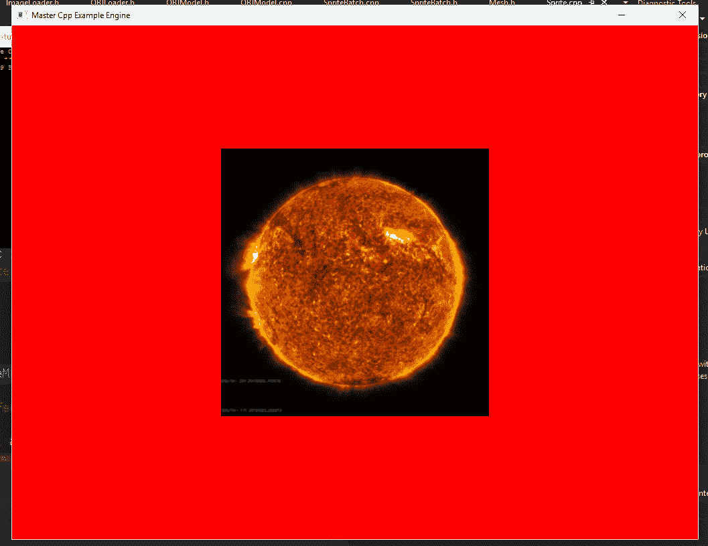
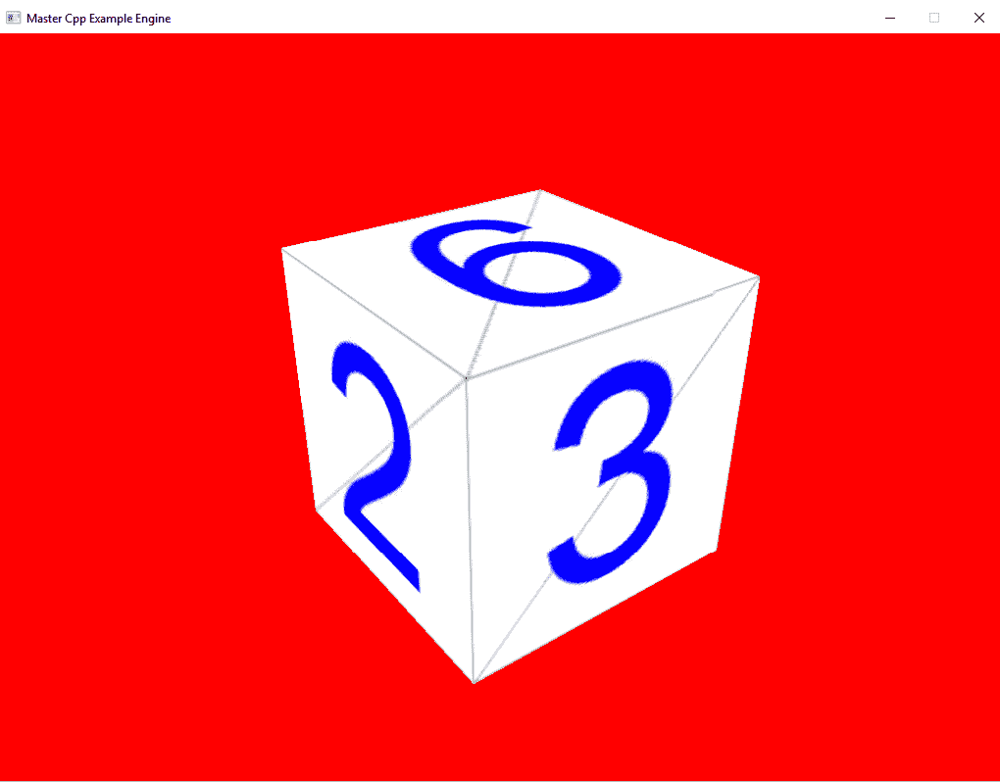
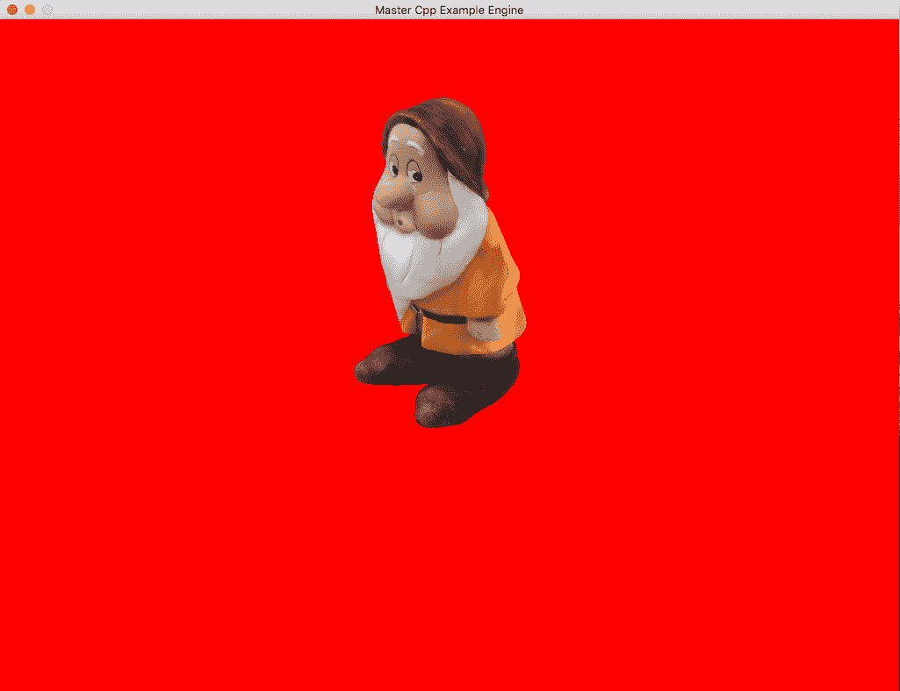

# 构建资产管道

游戏本质上是以有趣和吸引人的方式包装的资产或内容的集合。处理视频游戏所需的所有内容本身就是一个巨大的挑战。在任何实际项目中，都需要一个适当的结构来导入、转换和消费这些资产。在本章中，我们将探讨开发和实现资产管道的主题。以下是我们将讨论的主题:

*   处理音频
*   使用图像
*   导入模型网格

# 什么是资产管道？

在[第 3 章](03.html)、*构建强大的基础*中，我们看了如何使用 helper 和 manager 类的结构将多个方法包装到一个易于使用的接口中，以处理项目的各个部分。我们将在接下来的几节中使用这些技术来构建我们自己的定制框架/内容管道。

# 处理音频

首先，我们将通过研究如何在我们的游戏项目中处理音频资产来让自己轻松进入这个过程。为了帮助我们完成这个过程，我们将再次使用一个助手库。实际上有数百个不同的库来帮助使用音频。这里列出了一些更受欢迎的选择:

*   FMOD([http://www.fmod.org](http://www.fmod.org/))
*   https://www.audiokinetic.com/products/wwise/
*   xaudio 2([https://msdn . Microsoft . com/en-us/library/windows/desktop/ee 415813(v = vs . 85)。aspx](https://msdn.microsoft.com/en-us/library/windows/desktop/ee415813(v=vs.85).aspx) )
*   OpenAL([https://www.openal.org/](https://www.openal.org/))
*   SDL _ 混音器([https://www.libsdl.org/projects/SDL_mixer/](https://www.libsdl.org/projects/SDL_mixer/))

每个图书馆都有自己的长处和短处。为你的项目选择正确的一个归结为几个不同的问题，你应该问自己。

这个库满足你的技术需求吗？它有你想要的所有功能吗？

是否符合项目的预算限制？许多更健壮的库都有很大的价格标签。

这个库的学习曲线在你自己或者团队的技能范围内吗？选择一个包含一堆很酷的特性的高级应用编程接口看起来是个好主意，但是如果你花更多的时间去理解应用编程接口而不是实现它，这可能是有害的。

对于本书中的例子，我选择使用`SDL_mixer API`有几个原因。首先，与其他一些方法相比，它很容易上手。其次，它非常符合我的项目需求。它支持 FLAC、MP3，甚至 Ogg Vorbis 文件。第三，它与项目框架的其余部分连接良好，因为它是我们已经在使用的 SDL 图书馆的扩展。最后，我选择了这个应用编程接口，因为它是开源的，并且有一个简单的许可证，不需要我向创作者支付游戏收益的一部分来换取使用这个库。

让我们先来看看我们需要的几个不同类的声明和实现。我们看到的文件是`AudioManager.h`文件，可以在代码库的`Chapter04`文件夹中找到。

我们从必要的包括、`SDL/SDL_mixer.h`、`string`和`map`实现开始。像我们一直在构建的所有其他引擎组件一样，我们将这些声明包装在`BookEngine`名称空间中:

```cpp
#pragma once 
#include <SDL/SDL_mixer.h> 
#include <string> 
#include <map> 

namespace BookEngine 
{
```

在`"AudioManager.h"`文件中，我们有几个助手类的声明。第一个是`SoundEffect`班。这个类定义了我们游戏中使用的音效对象的结构:

```cpp
class SoundEffect 
 { 
  public: 
    friend class AudioManager; 
    ///Plays the sound file 
    ///@param numOfLoops: If == -1, loop forever, 
    ///otherwise loop of number times provided + 1 
    void Play(int numOfLoops = 0); 

  private: 
    Mix_Chunk* m_chunk = nullptr; 
  }; 
```

这些可以包括玩家跳跃、武器开火的声音，以及我们将在短时间内玩的任何东西。

在类定义中，我们需要一个`friend`类语句，允许这个类访问`AudioManager`类方法和变量，包括私有方法和变量。接下来我们有`Play`函数的定义。这个函数将简单地播放声音效果，只取一个参数，即循环播放声音的次数。默认情况下，我们将此设置为`0`，如果您通过`-1`作为循环次数，它会将音效设置为无限循环。最后一个定义是`Mix_Chunk`类型的私有变量。`Mix_Chunk`是将音频数据存储在内存中的`SDL_mixer`对象类型。

`Mix_Chunk`对象结构如下:

```cpp
typedef struct { 
        int allocated; 
        Uint8 *abuf; 
        Uint32 alen; 
        Uint8 volume; 
} Mix_Chunk; 
```

以下是该对象的内部结构:

*   `allocated`:如果设置为`1`，`struct`有自己分配的缓冲区
*   `abuf`:这是指向音频数据的指针
*   `alen`:这是音频数据的长度，以字节为单位
*   `volume`:这是 0 到 128 之间的每样本体积值

我们在`AudioManager.h`文件中的下一个助手类是`Music`类。像音效一样，`Music`类定义了一个`Music`对象的结构。这可用于加载屏幕音乐、背景音乐等声音，以及我们希望长时间播放或需要停止、开始和暂停的任何声音:

```cpp
class Music 
  { 
  public: 
    friend class AudioManager; 
    ///Plays the music file 
    ///@param numOfLoops: If == -1, loop forever, 
    ///otherwise loop of number times provided 
    void Play(int numOfLoops = -1); 

    static void Pause() { Mix_PauseMusic(); }; 
    static void Stop() { Mix_HaltMusic(); }; 
    static void Resume() { Mix_ResumeMusic(); }; 

  private: 
    Mix_Music* m_music = nullptr; 
  }; 
```

对于类定义，我们再次以`friend`类语句开始，这样`Music`类就可以访问`AudioManager`类所需的部分。接下来我们有一个`Play`函数，就像`SoundEffect`类一样，它只需要一个参数来设置声音将经过的循环数量。在`Play`功能之后，我们还有三个功能，`Pause()`、`Stop()`和`Resume()`功能。这三个函数只是 SDL 调音台 API 调用的包装器，分别用于暂停、停止和恢复音乐。

最后，我们有一个`Mix_Music`对象的私有声明。`Mix_Music`是用于音乐数据的 SDL 调音台数据类型。它支持加载 WAV，MOD，MID，OGG 和 MP3 声音文件。我们将在接下来的实现部分看到更多相关信息:

```cpp
class AudioManager 
  { 
  public: 
    AudioManager(); 
    ~AudioManager(); 

    void Init(); 
    void Destroy(); 

    SoundEffect LoadSoundEffect(const std::string& filePath); 
    Music LoadMusicEffect(const std::string& filePath); 
  private: 
    std::map<std::string, Mix_Chunk*> m_effectList; 
    std::map<std::string, Mix_Music*> m_musicList; 
    bool m_isInitialized = false; 
  }; 
} 
```

在两个`Music`和`SoundEffect`助手类之后，我们现在来看`AudioManager`类的定义。`AudioManager`类将完成我们这边的大部分繁重工作，它将加载、保存和管理所有音乐和音效的创建和删除。

我们的类声明像大多数其他声明一样，从默认构造函数和析构函数开始。接下来我们有一个`Init()`函数。该功能将处理我们音频系统的设置或初始化。然后我们有一个`Destroy()`功能，将处理我们的音频系统的删除和清理。在`Init`和`Destroy`功能之后，我们有两个加载器功能，`LoadSoundEffect()`和`LoadMusicEffent()`功能。这两个函数都有一个参数，一个保存音频文件路径的标准字符串。这些功能将加载音频文件，并根据功能返回一个`SoundEffect`或`Music`对象。

我们班的私人部分有三个对象。前两个私有对象是类型为`Mix_Chunk`或`Mix_Music`的地图。这是我们将存储我们需要的所有效果和音乐的地方。通过存储我们加载的音效和音乐文件列表，我们创建了一个缓存。如果我们在项目后期需要该文件，我们可以检查这些列表并节省一些宝贵的加载时间。最后一个变量`m_isInitialized`，保存一个布尔值来指定`AudioManager`类是否已经初始化。

这就完成了`AudioManager`和助手类的声明，让我们继续到实现，在这里我们可以更仔细地看看一些函数。您可以在代码库的`Chapter04`文件夹中找到`AudioManager.cpp`文件:

```cpp
#include "AudioManager.h"
#include "Exception.h" 
#include "Logger.h"

namespace BookEngine 
{ 

  AudioManager::AudioManager() 
  { 
  } 

  AudioManager::~AudioManager() 
  { 
    Destroy(); 
  } 
```

我们的实现从包含、默认构造函数和析构函数开始。这里没什么新鲜的，唯一值得注意的是我们从析构函数调用`Destroy()`函数。这允许我们通过析构函数或通过显式调用对象本身的`Destroy()`函数来清理类的两种方法:

```cpp
void BookEngine::AudioManager::Init() 
  { 
    //Check if we have already been initialized 
    if (m_isInitialized) 
      throw Exception("Audio manager is already initialized"); 
```

`AudioManager`类实现中的下一个函数是`Init()`函数。这个功能将为我们的经理设置所有需要的组件。这个函数从一个简单的检查开始，看看我们是否已经初始化了这个类；如果有，我们抛出一个异常，并显示一条调试消息:

```cpp
//Can be Bitwise combination of  
//MIX_INIT_FAC, MIX_INIT_MOD, MIX_INIT_MP3, MIX_INIT_OGG 
if(Mix_Init(MIX_INIT_OGG || MIX_INIT_MP3) == -1) 
 throw Exception("SDL_Mixer could not initialize! Error: " + 
 std::string(Mix_GetError()));
```

在我们检查了还没有之后，我们继续初始化 SDL 调音台对象。我们通过调用`Mix_Init()`函数并传入标志的位组合来设置支持的文件类型。这可以是 FLAC、MOD、MP3 和 OGG 的组合。在这个例子中，我们传递了支持 OGG 和 MP3 的标志。我们用 if 语句包装这个调用，以检查`Mix_Init()`函数调用是否有任何问题。如果遇到错误，我们会抛出另一个异常，并显示一条调试消息，其中包含从`Mix_Init()`函数返回的错误信息:

```cpp
if(Mix_OpenAudio(MIX_DEFAULT_FREQUENCY, MIX_DEFAULT_FORMAT, 2, 
 1024) == -1)      throw Exception("Mix_OpenAudio Error: " + 
 std::string(Mix_GetError()));
```

一旦`SDL_mixer`功能被初始化，我们可以调用`Mix_OpenAudio`来配置`frequency`、`format`、`channels`和`chunksize`来使用。需要注意的是，该函数必须在任何其他`SDL_mixer`函数之前调用。函数定义如下所示:

```cpp
int Mix_OpenAudio(int frequency, Uint16 format, int channels, int chunksize)
```

以下是这些论点的含义:

*   `frequency`:这是以每秒采样数为单位的输出采样频率，Hz。在示例中，我们使用`MIX_DEFAULT_FREQUENCY`定义，它是 22050，对于大多数情况来说是一个很好的值。
*   `format`:这是输出样本格式；同样，在示例中，我们通过使用`MIX_DEFAULT_FORMAT` define 将其设置为默认值，这与按照系统字节顺序使用`AUDIO_S16SYS`或带符号 16 位样本相同。要查看完整格式，定义列表，请参见`SDL_audio.h`文件。
*   `channels`:这是输出中的声道数。2 个立体声通道，1 个单声道通道。值 2 用于我们的示例。
*   `chunksize`:这是每个输出样本使用的字节数。我们使用`1024`字节或 1 **兆字节** ( **兆字节**)作为组块大小。

最后，我们在这个函数中做的最后一件事是将`m_isInitalized`布尔值设置为真。这将防止我们意外地再次尝试初始化该类:

```cpp
m_isInitialized = true; 
  } 
```

`AudioManager`类中的下一个函数是`Destroy()`方法:

```cpp
  void BookEngine::AudioManager::Destroy() 
  { 
    if (m_isInitialized) 
    { 
      m_isInitialized = false; 

      //Release the audio resources 
      for(auto& iter : m_effectList) 
        Mix_FreeChunk(iter.second); 
      for(auto& iter : m_musicList) 
        Mix_FreeMusic(iter.second); 
      Mix_CloseAudio(); 
      Mix_Quit(); 
    } 
  } 
```

我不会一行一行地讨论这个函数，因为它是不言自明的。基本概况是；检查`AudioManager`是否已经初始化，如果已经初始化，那么我们使用`Mix_FreeChunk()`功能来释放我们创建的每个声音和音乐资源。最后我们使用`Mix_CloseAudio()`和`Mix_Quit()`关闭、清理并关闭 SDL _ 混合器 API。

`LoadSoundEffect`是我们接下来要看的功能。这个函数就像它的名字一样，是加载声音效果的函数:

```cpp
 SoundEffect BookEngine::AudioManager::LoadSoundEffect(const std::string & filePath)
  { 
    SoundEffect effect; 
```

这个函数的第一步是创建一个`SoundEffect`对象来暂时保存数据，直到我们将效果返回给调用方法。我们简单地把这个变量叫做效果。

在我们创建了我们的保持变量之后，我们做一个快速的检查，看看我们需要的这个效果是否已经被创建并存储在我们的缓存中，映射对象，`m_effectList`:

```cpp
//Lookup audio file in the cached list 
auto iter = m_effectList.find(filePath); 
```

我们在这里做这件事的有趣方式是创建一个迭代器变量，并给它分配`Map.find()`的结果，这里传递的参数是我们想要加载的声音文件的位置。这个方法很酷的一点是，如果在缓存中找不到声音效果，迭代器值将被设置为映射的结束对象的索引，允许我们做一个简单的检查，如下所示:

```cpp
//Failed to find in cache, load 
    if (iter == m_effectList.end()) 
    { 
      Mix_Chunk* chunk = Mix_LoadWAV(filePath.c_str()); 
      //Error Loading file 
      if(chunk == nullptr) 
        throw Exception("Mix_LoadWAV Error: " + 
              std::string(Mix_GetError())); 

      effect.m_chunk = chunk; 
      m_effectList[filePath] = chunk; 
    } 

```

使用迭代器值技巧，我们只需检查`iter`变量的值是否与`Map.end()`函数的返回值匹配；如果有，这意味着声音效果不在缓存列表中，应该创建。

为了加载音效，我们调用`Mix_LoadWAV()`函数，将文件路径位置的参数作为`c`字符串。我们将返回的对象分配给一个名为 chunk 的`Mix_Chunk`指针。

然后，我们检查块的值是否是一个`nullptr`指针，表明加载函数遇到了错误。如果它是一个`nullptr`指针，我们抛出一个异常，其中包含一些由便利的`Mix_GetError()`函数提供的调试信息。如果成功，我们分配我们的临时持有者，效果成员`m_chunk`，块的值，这是我们加载的声音效果数据。

接下来，我们将这个新加载的效果添加到我们的缓存中，这样我们就可以在将来节省一些精力。

或者，如果我们对`iter`值的检查返回 false，这意味着我们试图加载的音效在缓存中:

```cpp
else //Found in cache 
    { 
      effect.m_chunk = iter->second; 
    } 

    return effect; 
  } 
```

迭代器的真正妙处现已显露。查找结果，即第`auto iter = m_effectList.find(filePath);`行的结果，当它找到声音效果时，就会指向列表中的那个效果。所以我们所要做的就是将持有者变量效果成员值`m_chunk`分配给`iter`第二个值，这是效果的数据值。我们在`LoadSoundEffect()`函数中做的最后一件事是将效果变量返回给调用方法。这就完成了这个过程，我们的音效现在可以使用了。

`LoadSoundEffect()`功能之后，是`LoadMusic()`功能:

```cpp
Music BookEngine::AudioManager::LoadMusic(const std::string & filePath) 
  { 
    Music music; 

    //Lookup audio file in the cached list 
    auto iter = m_musicList.find(filePath); 

    //Failed to find in cache, load 
    if (iter == m_musicList.end()) 
    { 
      Mix_Music* chunk = Mix_LoadMUS(filePath.c_str()); 
      //Error Loading file 
      if (chunk == nullptr) 
           throw Exception("Mix_LoadMUS Error: " +
            std::string(Mix_GetError())); 

      music.m_music = chunk; 
      m_musicList[filePath] = chunk; 
    } 
    else //Found in cache 
    { 
      music.m_music = iter->second; 
    } 

    return music; 
  } 
```

我不打算详细讨论这个函数，因为正如你所看到的，它非常像`LoadSoundEffect()`函数，但是它没有包装`Mix_LoadWAV()`函数，而是包装了`SDL_mixer`库的`Mix_LoadMUS()`。

`AudioManager.cpp`文件中的最后两个函数实现不属于`AudioManager`类本身，而是`SoundEffect`和`Music`助手类的`Play`函数的实现:

```cpp
 void SoundEffect::Play(int numOfLoops) 
  { 
    if(Mix_PlayChannel(-1, m_chunk, numOfLoops) == -1) 
      if (Mix_PlayChannel(0, m_chunk, numOfLoops) == -1) 
          throw Exception("Mix_PlayChannel Error: " + 
                std::string(Mix_GetError())); 
  } 

  void Music::Play(int numOfLoops) 
  { 
    if (Mix_PlayMusic(m_music, numOfLoops) == -1) 
      throw Exception("Mix_PlayMusic Error: " + 
                 std::string(Mix_GetError())); 
  }   
} 
```

我不会一行一行地遍历每个函数，相反，我想简单地指出这些函数是如何围绕 SDL_mixer、`Mix_PlayChannel`和`Mix_PlayMusic`函数创建包装器的。这本质上是`AudioManager`类的重点，它只是一个抽象加载文件和直接创建对象过程的包装器。这有助于我们创建一个可扩展的框架，管道，而不用担心底层机制。这意味着，理论上，我们可以随时用另一个甚至多个库替换底层库，而不会干扰调用管理器类函数的代码。

为了完善这个例子，让我们看看如何在演示项目中使用这个`AudioManager`。您可以在代码库的`Chapter04`文件夹中找到这个演示，标签为`SoundExample`。音乐的功劳归于本声([http://www.bensound.com](http://www.bensound.com/))。

从`GameplayScreen.h`文件开始:

```cpp
private: 
  void CheckInput(); 
  BookEngine::AudioManager m_AudioManager; 
  BookEngine::Music m_bgMusic; 
}; 
```

我们向私有声明中添加了两个新对象，一个用于名为`m_AudioManager`的`AudioManager`，另一个用于名为`m_bgMusic`的`Music`对象。

在`GameplayScreen.cpp`文件中:

```cpp
void GameplayScreen::OnEntry() 
{ 
  m_AudioManager.Init(); 
  m_bgMusic = m_audioManager.LoadMusic("Audio/bensound-epic.mp3"); 
  m_bgMusic.Play(); 
} 
```

为了初始化、加载和播放我们的音乐文件，我们需要向`GameplayScreen`类`OnEntry()`添加三行。

*   第一行`m_AudioManager.Init()`设置`AudioManager`并初始化所有组件，正如我们之前看到的。

*   接下来我们加载音乐文件，在这种情况下是`bensound-epic.mp3`文件，并将其分配给`m_bgMusic`变量。

*   最后一行`m_bgMusic.Play()`，开始播放音乐曲目。通过不传入循环音乐曲目的次数，默认为`-1`，这意味着它将继续循环，直到程序停止。

处理音乐轨道的播放，但是我们需要增加一些函数调用来清理游戏结束时的`AudioManager`，如果我们切换屏幕，停止音乐。

为了在我们离开此屏幕时停止播放音乐，我们在`GameplayScreen`类`OnExit`功能中添加了以下内容:

```cpp
m_bgMusic.Stop(); 
```

为了清理`AudioManager`并阻止任何潜在的内存泄漏，我们在`GameplayScreen`类`Destroy`函数中调用以下内容:

```cpp
  m_AudioManager.Destroy(); 
```

这将依次处理我们在上一节中介绍的任何音频资产的销毁和清理。

现在所有这些都准备好了，如果你运行`SoundExample`演示，你会听到一些史诗冒险音乐开始播放，如果你足够耐心，会不断循环播放。现在，我们在游戏中有了一些声音，让我们加快速度，看看如何在我们的项目中获得一些视觉资产。

# 使用纹理

一个纹理，如果你不熟悉这个术语，基本上可以认为是一个图像。这些纹理可以应用于一个简单的几何正方形，两个三角形，以制作一个图像。这种类型的图像通常被称为`Sprite`。我们在本节末尾的演示中使用了一个`Sprite`类。还需要注意的是，纹理可以应用于更复杂的几何图形，并用于皮肤对象的 3D 建模。在本书后面的演示中，纹理将扮演更重要的角色。

# 资源管理程序

让我们从高水平的课程`ResourceManager`开始。这个 manager 类将负责维护缓存中的资源对象，并提供一个简单的抽象接口来获取资源:

```cpp
#pragma once 
#include "TextureCache.h"
#include <string> 
namespace BookEngine 
{ 
class ResourceManager 
  { 
  public: 
    static GLTexture GetTexture(std::string pathToTextureFile); 
  private: 
    static TextureCache m_textureCache; 
  }; 
} 
```

声明文件`ResourceManager.h`是一个简单的类，由一个公共函数`GetTexture`和一个类型为`TextureCache`的私有成员组成。`GetTexure`将是我们向其他类公开的函数。它将负责返回纹理对象。`TextureCache`就像我们在`AudioManager`中使用的缓存，它会保存加载的纹理以备后用。让我们继续讨论实现，这样我们就可以看到这是如何设置的:

```cpp
#include "ResourceManager.h"
namespace BookEngine 
{ 
  TextureCache ResourceManager::m_textureCache; 

  GLTexture ResourceManager::GetTexture(std::string texturePath) 
  { 
    return m_textureCache.GetTexture(texturePath); 
  } 
} 
```

`ResourceManager`实现实际上只是对底层结构的抽象调用。当我们调用`ResourceManager`类的`GetTexture`函数时，我们期望得到一个`GLTexture`类型。作为这个函数的调用者，我不需要担心`TextureCache`的内部工作方式或者对象是如何被解析的。我所要做的就是指定我想要加载的纹理的路径，资产管道完成剩下的工作。这应该是资产管道系统的最终目标，不管方法如何，接口都应该足够抽象，以允许开发人员和设计人员在项目中导入和使用资产，而底层系统的实现不会成为阻碍。

接下来我们将看看这个纹理系统的例子，它是简单的`ResourceManager`类接口的核心。

# 纹理和纹理贴图

之前我们看到引入了两个新的对象，它们构成了`ResourceManager`类的结构，即`GLTexture`和`TextureCache`。在接下来的章节中，我们将更详细地了解这两个类，这样我们就可以看到这些类如何连接到其他系统来构建一个健壮的资产管理系统，所有这些都将回到`ResourceManager`的简单界面。

首先我们来看看这个类，`GLTexture`。这个类仅由描述我们纹理属性的`struct`组成。以下是`GLTexture`类的全部代码:

```cpp
#pragma once 
#include <GL/glew.h> 
namespace BookEngine 
{ 
  struct GLTexture 
  { 
    GLuint id; 
    int width; 
    int height; 
  }; 
} 
```

如前所述，`GLTexture`类实际上只是`struct`的包装器，也称为`GLTexture`。这个`struct`保存了一些简单的值。一个`GLuint id`，用来识别纹理和两个整数值，`width`和`height`，当然是保存纹理/图像的高度和宽度。这个`struct`很容易包含在`TextureClass`中，我选择这样实现它，一是让它更容易阅读，二是为了给未来的开发留出一些灵活性。同样，我们希望确保我们的资产管道能够适应不同的需求并包含新的资产类型。

接下来我们有`TextureCache`类，就像我们对音频资源所做的那样，为我们的图像文件创建一个缓存是一个好主意。这将再次通过将所需的图像文件保存在地图中并根据需要返回它们，为我们提供更快的访问。我们只需要创建一个新的纹理，如果它还不存在于缓存中。在构建任何使用资产的系统时，我倾向于使用缓存机制来支持这种类型的实现。

虽然这些示例提供了基本的实现，但它们是创建更健壮的系统的良好起点，集成了内存管理和其他组件。下面是`TextureCache`类的声明，从前面的音频例子看应该很熟悉:

```cpp
#pragma once 
#include <map> 
#include "GLTexture.h"

namespace BookEngine 
{ 
  class TextureCache 
  { 
  public: 
    TextureCache(); 
    ~TextureCache(); 

    GLTexture GetTexture(std::string texturePath);  
  private: 
    std::map<std::string, GLTexture> m_textureMap; 

  }; 
} 
```

接下来是`TextureCache`类的实现，在`TextureCache.cpp`文件中，让我们看一下`GetTexture()`:

```cpp
GLTexture TextureCache::GetTexture(std::string texturePath) { 

    //lookup the texture and see if it''''s in the map 
    auto mit = m_textureMap.find(texturePath); 

    //check if its not in the map 
    if (mit == m_textureMap.end()) 
    { 
      //Load the texture 
      GLTexture newTexture = ImageLoader::LoadPNG(texturePath); 

      //Insert it into the map 
      m_textureMap.insert(std::make_pair(texturePath, newTexture)); 

      //std::cout << "Loaded Texture!\n"; 
      return newTexture; 
    } 
    //std::cout << "Used Cached Texture!\n"; 
    return mit->second; 
  }
```

这个实现看起来与我们之前看到的`AudioManager`示例非常相似。这里要注意的主线是调用`ImageLoader`类加载图像文件的那一行，`GLTexture newTexture = ImageLoader::LoadPNG(texturePath);`。这个调用是类的重载方面，正如您所看到的，我们再次抽象了底层系统，并简单地提供了一个`GLTexture`作为我们的`GetTexture`类的返回类型。让我们跳到下一节，看看`ImageLoader`类的实现。

# ImageLoader 类

现在我们已经有了将我们的纹理对象传递回调用资源管理器的结构，我们需要实现一个实际加载图像文件的类。`ImageLoader`就是那个班。它将处理纹理的加载、处理和创建。这个简单的例子将加载一个**便携式网络图形** ( **PNG** )格式的图像。

因为我们在这里关注的是资产管道的结构，所以我将继续关注这个类的核心部分。我将假设一些 OpenGL 的缓冲和纹理创建的知识。如果你不熟悉 OpenGL，我强烈推荐 OpenGL 圣经系列作为很好的参考。稍后，当我们在未来的章节中查看一些高级渲染和动画技术时，我们将会看到其中的一些特性。

对于这个例子，`ImageLoader.h`文件只有一个`LoadPNG`函数的声明。该函数接受一个参数，即图像文件的路径，它将返回一个`GLTexture`。以下是`ImageLoader`的全部内容:

```cpp
#pragma once 
#include "GLTexture.h" 
#include <string> 
namespace BookEngine 
{ 
  class ImageLoader 
  { 
  public: 
    static GLTexture LoadPNG(std::string filePath);
    static GLTexture LoadDDS(const char * imagepath);
  }; 
} 
```

接下来是实现，在`ImageLoader.cpp`文件内部，让我们浏览一下`LoadPNG`功能:

```cpp
... 
  GLTexture ImageLoader::LoadPNG(std::string filePath) { 
unsigned long width, height;     
GLTexture texture = {}; 
std::vector<unsigned char> in; 
  std::vector<unsigned char> out; 
```

我们做的第一件事是创建一些临时变量来保存我们的工作数据。用于`height`和`width`的未签名`long`，一个`GLTexture`对象，然后我们将其所有字段初始化为`0`。然后我们有两个无符号字符的向量容器。`in`矢量将是存放从巴布亚新几内亚读入的原始编码数据的容器。`out`向量将保存已转换的解码数据。

```cpp
  ... 
  //Read in the image file contents into a buffer 
    if (IOManager::ReadFileToBuffer(filePath, in) == false) {
      throw Exception("Failed to load PNG file to buffer!");
    }

    //Decode the .png format into an array of pixels
    int errorCode = DecodePNG(out, width, height, &(in[0]), in.size());
    if (errorCode != 0) {
      throw Exception("decodePNG failed with error: " + std::to_string(errorCode));
    }
  ... 
```

接下来我们有两个函数调用。首先我们调用一个函数，该函数使用`IOManager`类`ReadFileToBuffer`函数读入图像文件的原始数据。我们通过了`pathToFile`，而矢量在；然后，该函数将使用原始编码数据填充向量。第二个调用是`DecodePNG`功能；这是对我之前提到的单一函数库的调用。这个库将处理原始数据的读取、解码以及用解码数据填充外部向量容器。该函数采用四个参数:

*   第一个是保存解码数据的向量，在我们的例子中是`out`向量
*   第二个是`width`和`height`变量，`DecodePNG`函数将使用图像值填充这些变量
*   第三个是对保存编码数据的容器的引用，在我们的例子中是`in`向量
*   最后一个参数是缓冲区的大小，矢量的大小`in`

这两个调用是这个类的主要部分，它们完成了构成我们资产管道的图像加载组件的系统。我们现在不会深入阅读原始数据和解码。在下一节中，我们将看到加载 3D 模型的类似技术，在这里我们将详细了解如何读取和解码数据。

这个函数的其余部分将在 OpenGL 中处理图像的上传和处理，同样，我不会在这个函数的这一部分花费时间。随着我们的前进，我们将看到更多的 OpenGL 框架的调用，届时我将深入探讨。这个例子是专门为 OpenGL 构建的，但是它很容易被更通用的代码或者特定于另一个图形库的代码所取代。

减去`IOManger`和`DecodePNG`类，这就完成了资产管道的图像处理。希望你能看到，有一个合适的结构，就像我们已经看到的，允许在引擎盖下有很大的灵活性，同时提供一个简单的界面，需要很少的底层系统的知识。

现在我们有一个简单的一行调用返回的纹理，`ResourceManger::GetTexture(std::string pathToTextureFile)`，让我们把这个例子完整的循环，看看我们如何插入这个系统，从加载的纹理创建一个`Sprite` (2D 图像):

```cpp
void Sprite::Init(float x, float y, float width, float height, std::string texturePath) { 
        //Set up our private vars 
        m_x = x; 
        m_y = y; 
        m_width = width; 
        m_height = height; 

        m_texture = ResourceManager::GetTexture(texturePath); 
```

在纹理示例项目中，跳转到`Sprite`类，如果我们关注`Init()`，我们会看到我们的简单界面允许我们调用`ResourceManager`类`GetTexture`来返回处理后的图像。就是这样，很简单！当然，这不仅限于精灵，我们可以使用这个功能来加载纹理用于其他用途，例如建模和图形用户界面用途。我们还可以扩展这个系统来加载更多的文件，而不仅仅是巴布亚新几内亚的文件，事实上，我建议您花一些时间来构建更多的文件格式，如 DDS、BMP、JPG 和其他。`ResourceManager`本身有很大的提升和成长空间。这种基本结构对于其他资产来说很容易重复，例如声音、3D 模型、字体和其他所有东西。在下一节中，我们将深入一点，看看通常所说的 3D 模型或网格的加载。

要看到整个系统在工作，运行纹理示例项目，您将看到一个非常好的太阳图像，由美国宇航局的好心人提供。

以下是 Windows 上的输出:

>

以下是 macOS 上的输出:


# 导入模型–网格

模型或网格是三维空间中对象的表示。这些模型可以是任何东西，从玩家的角色到一个小的风景物体，如桌子或椅子。加载和操作这些对象是游戏引擎和底层系统的重要组成部分。在本节中，我们将研究在三维网格中加载的过程。我们将浏览一个用三维术语描述对象的简单文件格式。我们将了解如何加载这种文件格式，并将其解析为可读格式，以便与图形处理器共享。最后，我们将讨论 OpenGL 用来渲染对象的步骤。让我们直接开始`Mesh`课:

```cpp
namespace BookEngine 
{ 
  class Mesh 
  { 
  public: 
    Mesh(); 
    ~Mesh(); 
    void Init(); 
    void Draw(); 
  private: 
    GLuint m_vao; 
    GLuint m_vertexbuffer; 
    GLuint m_uvbuffer; 
    GLTexture m_texture;   

    std::vector<glm::vec3> m_vertices; 
    std::vector<glm::vec2> m_uvs; 
    std::vector<glm::vec3> m_normals; 
    // Won''''t be used at the moment. 
  }; 
} 
```

我们的`Mesh`类声明文件，`Mesh.h`，还是蛮简单的。我们有`normal`构造器和析构器。然后我们又有两个功能公开为`public`。`Init()`功能，它将初始化所有的`Mesh`组件，以及`Draw`功能，它将进行实际处理，将信息传递给渲染器。在`private`声明中，我们有一堆变量来保存网格的数据。首先是`GLuint m_vao`变量。这个变量将持有一个 OpenGL 顶点数组对象的句柄，我现在不会详细讨论这个，请参考 OpenGL 文档进行快速分解。

接下来的两个变量`GLuint`、`m_vertexbuffer`和`m_uvbuffer`就像它们的名字一样，是`vertex`和`uv`信息的数据缓冲区。在接下来的实现中详细介绍这一点。在缓冲区之后，我们有一个`GLTexture`变量`m_texture`。您会记得以前的对象类型；这将容纳网格的纹理。最后三个变量是`glm vec3`的向量。这些是`Mesh`的`vertices`、纹理`uvs`和`normal`的笛卡尔坐标。在当前示例中，我们将不使用正常值。

这让我们很好地理解了我们的`Mesh`课需要什么；现在我们可以开始实施了。我们将走完这堂课，当其他课出现时，我们将转移到其他课。让我们从`Mesh.cpp`文件开始:

```cpp
namespace BookEngine 
{ 
  Mesh::Mesh() 
  { 
    m_vertexbuffer = 0; 
    m_uvbuffer = 0; 
    m_vao == 0; 
  }
```

`Mesh.cpp`文件从构造函数实现开始。`Mesh`构造函数将两个缓冲区和顶点数组对象的值设置为零。我们这样做是为了稍后进行一个简单的检查，看看它们是否已经初始化或删除，接下来我们将看到:

```cpp
OBJModel::~OBJModel() 
  { 
    if (m_vertexbuffer != 0) 
      glDeleteBuffers(1, &m_vertexbuffer); 
    if (m_uvbuffer != 0)  
      glDeleteBuffers(1, &m_uvbuffer); 
if (m_vao != 0) 
      glDeleteVertexArrays(1, &m_vao); 
  } 
```

`Mesh`类的析构函数处理`Buffer`和`Vertex`数组的删除。我们做了一个简单的检查，看看它们是否没有设置为零，这意味着它们已经被创建，然后删除它们，如果它们没有:

```cpp
void OBJModel::Init() 
  {   
    bool res = LoadOBJ("Meshes/Dwarf_2_Low.obj", m_vertices, m_uvs, m_normals); 
    m_texture = ResourceManager::GetTexture("Textures/dwarf_2_1K_color.png"); 
```

进入`Init()`功能，我们开始加载我们的资产。这里我们使用一个熟悉的辅助函数`ResourceManager`类`GetTexture`函数来描述我们的模型需要的纹理。我们还加载了`Mesh`，在本例中是由仙女座 vfx 在[TurboSquid.com](https://www.turbosquid.com/)上提供的名为`Dwarf_2_Low.obj`的 OBJ 格式模型。这是通过使用`LoadOBJ`功能实现的。让我们跳出我们的`Mesh`类一分钟，看看这个功能是如何实现的。

在`MeshLoader.h`文件中，我们看到了`LoadOBJ`函数的声明:

```cpp
bool LoadOBJ( 
    const char * path, 
    std::vector<glm::vec3> & out_vertices, 
    std::vector<glm::vec2> & out_uvs, 
    std::vector<glm::vec3> & out_normals 
  ); 
```

`LoadOBJ`函数接受四个参数、要加载的 OBJ 文件的文件路径和三个向量，这三个向量将填充 OBJ 文件中的数据。该函数还有一个布尔类型的返回，这是为了一个简单的错误检查能力。

在我们继续之前，看看这个函数是如何组合在一起的，以及它将如何解析数据来填充我们创建的向量，了解我们正在使用的文件的结构是很重要的。幸运的是，OBJ 文件是一个开放的文件格式，实际上可以在任何文本编辑器中以纯文本阅读。您也可以用 OBJ 格式手工创建非常简单的模型。举个例子，让我们看看在文本编辑器中看到的`cube.obj`文件。侧注，可以在 Visual Studio 中查看一个 OBJ 格式的模型三维渲染；它甚至有基本的编辑工具:

```cpp
# Simple 3D Cube Model 
mtllib cube.mtl 
v 1.000000 -1.000000 -1.000000 
v 1.000000 -1.000000 1.000000 
v -1.000000 -1.000000 1.000000 
v -1.000000 -1.000000 -1.000000 
v 1.000000 1.000000 -1.000000 
v 0.999999 1.000000 1.000001 
v -1.000000 1.000000 1.000000 
v -1.000000 1.000000 -1.000000 
vt 0.748573 0.750412 
vt 0.749279 0.501284 
vt 0.999110 0.501077 
vt 0.999455 0.750380 
vt 0.250471 0.500702 
vt 0.249682 0.749677 
vt 0.001085 0.750380 
vt 0.001517 0.499994 
vt 0.499422 0.500239 
vt 0.500149 0.750166 
vt 0.748355 0.998230 
vt 0.500193 0.998728 
vt 0.498993 0.250415 
vt 0.748953 0.250920 
vn 0.000000 0.000000 -1.000000 
vn -1.000000 -0.000000 -0.000000 
vn -0.000000 -0.000000 1.000000 
vn -0.000001 0.000000 1.000000 
vn 1.000000 -0.000000 0.000000 
vn 1.000000 0.000000 0.000001 
vn 0.000000 1.000000 -0.000000 
vn -0.000000 -1.000000 0.000000 
usemtl Material_ray.png 
s off 
f 5/1/1 1/2/1 4/3/1 
f 5/1/1 4/3/1 8/4/1 
f 3/5/2 7/6/2 8/7/2 
f 3/5/2 8/7/2 4/8/2 
f 2/9/3 6/10/3 3/5/3 
f 6/10/4 7/6/4 3/5/4 
f 1/2/5 5/1/5 2/9/5 
f 5/1/6 6/10/6 2/9/6 
f 5/1/7 8/11/7 6/10/7 
f 8/11/7 7/12/7 6/10/7 
f 1/2/8 2/9/8 3/13/8 
f 1/2/8 3/13/8 4/14/8 
```

如您所见，这些文件中包含了大量数据。记住这只是一个简单的立方体模型。看看矮人 OBJ 的文件，对其中包含的数据有更深入的了解。对我们来说重要的部分是`v`、`vt`、`vn`和`f`线。`v`线描述的是`Mesh`的几何顶点，即模型在局部空间中的`x`、`y`、`z`值(原点相对于模型本身的坐标)。`vt`线描述了模型的纹理顶点，这一次的值是归一化的 x 和 y 坐标，归一化意味着它们是介于`0`和`1`之间的值。`vn`线是顶点法线的描述，我们不会在当前示例中使用这些，但是这些值给出了垂直于顶点的归一化矢量单位。在计算光照和阴影等问题时，这些都是非常有用的值。下图描绘了十二面体形状网格的顶点法线:


最后一组线`f`线描述了网格的面。这是三个矢量值的组，构成网格的一个面，即三角形。这些也是局部空间 x，y 和 z 坐标。

该文件一旦在我们的示例引擎中呈现，将如下所示:



好了，简单来说，这就是 OBJ 文件格式，现在让我们继续，看看我们将如何解析这些数据，并将其存储在缓冲区中，供渲染器使用。在`MeshLoader.cpp`文件中，我们找到了`LoadOBJ()`功能的实现:

```cpp
... 
bool LoadOBJ( 
    std::string path, 
    std::vector<glm::vec3> & out_vertices, 
    std::vector<glm::vec2> & out_uvs, 
    std::vector<glm::vec3> & out_normals 
    )  
{ 
    WriteLog(LogType::RUN, "Loading OBJ file " + path + " ..."); 
    std::vector<unsigned int> vertexIndices, uvIndices, normalIndices; 
    std::vector<glm::vec3> temp_vertices; 
    std::vector<glm::vec2> temp_uvs; 
    std::vector<glm::vec3> temp_normals; 
```

为了启动`LoadOBJ`功能，创建了几个保持器变量。变量声明的第一行是一组三个整数向量。这些将保存`vertices`、`uvs`和`normals`的指数。在指数之后，我们还有三个向量。两个`vec3`向量用于`vertices`和`normal`，一个`vec2`向量用于`uvs`。这些向量将保存每个向量的临时值，允许我们执行一些计算:

```cpp
    try  
{ 
std::ifstream in(path, std::ios::in); 
```

接下来，我们启动一个`try`块，它将容纳函数的核心逻辑。我们这样做是为了在出现任何问题时抛出一些异常，并在这个函数结束时在内部捕获它们。`std::ifstream in(path, std::ios::in);`块中的第一行试图在我们传入的位置加载文件。您可能已经注意到，`ifstream`是标准库的一部分，用于定义一个流对象，该对象可用于从文件中读入字符数据。在现代 I/O 系统中很常见看到`ifstream`，它是常见的`fopen`的 C++替代品，实际上是 C:

```cpp
if (!in) {
throw Exception("Error opening OBJ file: " + path); }
```

然后我们可以用简单的 if 语句`if(!in)`测试加载文件是否有错误，这与直接检查状态标志如`in.bad() == true; or in.fail() == true`是一样的。如果我们确实遇到错误，我们会抛出一个带有调试消息的异常。我们稍后在函数中处理这个异常:

```cpp
std::string line; 
while (std::getline(in, line)) 
  { 
```

接下来，我们需要创建一个循环，这样我们就可以遍历文件并根据需要解析数据。我们使用`std::getline(in, line)`函数作为参数的`while()`循环来实现这一点。`std::getline`返回一行字符，直到到达行字符的末尾。`parameters std::getline()`取值是包含字符的流，在我们的例子中是`in`和保存函数输出的`std::string`对象。

通过使用这个作为`while`循环的条件参数，我们将继续一行一行地遍历输入文件，直到到达文件的末尾。条件变为假的时间，我们将停止循环。这是一种非常方便的方法，可以遍历文件进行解析:

```cpp
  if (line.substr(0, 2) == "v ") { 
    std::istringstream v(line.substr(2)); 
    glm::vec3 vert; 
    double x, y, z; 
    v >> x; v >> y; v >> z; 
    vert = glm::vec3(x, y, z); 
    temp_vertices.push_back(vert); 
  } 
```

在我们的`while`循环中，我们首先要尝试和解析的是 OBJ 文件中的顶点数据。如果你还记得我们之前的解释，顶点数据包含在一条直线上，用`v`表示。然后为了解析我们的顶点数据，我们应该首先测试该线是否是顶点(`v`)线。`std::string()`对象有一个方便的方法，允许您从字符串中选择定义数量的字符。这个方法就是`substr()`，`substr()`方法可以取两个参数，字符串中字符的起始位置和结束位置。这将创建一个子字符串对象，然后我们可以对其进行测试。

在这个例子中，我们使用`substr()`方法获取字符串的前两个字符，行，然后测试它们是否匹配字符串`"v "`(注意空格)。如果这个条件是`true`，那就意味着我们有了一条顶点线，然后可以把它解析成对我们的系统有用的形式。

代码很容易解释，但是让我们突出一些重要的部分。首先是`std::istringstream`对象`v`。`stringstream`是一个特殊的对象，它为字符串缓冲区提供了一种方便的方式来操作字符串，就像它是一个输入/输出对象(`std::cout`)一样。这意味着您可以使用`>>`和`<<`运算符将其视为一个流，也可以使用`str()`方法将其视为一个`std::string`流。我们使用字符串流对象来存放新的字符集合。这些新字符由对`line.substr(2)`的方法调用提供。这一次，通过仅将一个参数`2`传递给`substr`方法，我们告诉它从第二个字符开始返回该行的剩余部分。这样做是返回顶点线的值`x`、`y`和`z`，而不返回`v`表示。一旦我们有了这个新的字符集合，我们就可以逐步遍历每个字符，并将其分配给与之匹配的双变量。如您所见，这是我们使用字符串流对象的独特性质将字符流输出到其变量`v >> x;` `v >> y; v >> x;`行的地方。在`if`语句的末尾，我们将这些`x`、`y`、`z`变成一个`vec3`，最后将新创建的`vec3`推到 temp `vertices`向量的后面:

```cpp
else if (line.substr(0, 2) == "vt")  
{ 
std::istringstream v(line.substr(3)); 
          glm::vec2 uv; 
          double U, V; 
          v >> U;v >> V; 
          uv = glm::vec2(U, V); 
          uv.y = -uv.y; 
          temp_uvs.push_back(uv); 
        } 
```

对于纹理，我们做很多相同的事情。除了检查`"vt"`之外，主要的区别是我们只寻找两个值，或者`vec2`向量。这里的另一个注意点是我们反转`v`坐标，因为我们使用的是纹理格式，这是反转的。如果要使用 TGA 或 BMP 格式加载程序，请删除:

```cpp
        else if (line.substr(0, 2) == "vn") 
 { 

          std::istringstream v(line.substr(3)); 
          glm::vec3 normal; 
          double x, y, z; 
          v >> x;v >> y;v >> z; 
          normal = glm::vec3(x, y, z); 
          temp_normals.push_back(normal); 
        } 
```

对于法线，我们做的和顶点完全一样，但是寻找`vn`线:

```cpp

        else if (line.substr(0, 2) == "f ") 
        { 
          unsigned int vertexIndex[3], uvIndex[3], normalIndex[3]; 
          const char* cstring = line.c_str(); 
          int matches = sscanf_s(cstring, "f %d/%d/%d %d/%d/%d %d/%d/%d\n", &vertexIndex[0], &uvIndex[0], &normalIndex[0], &vertexIndex[1], &uvIndex[1], &normalIndex[1], &vertexIndex[2], &uvIndex[2], &normalIndex[2]); 
```

对于面，一个三角形的集合，我们做一些稍微不同的事情。首先我们检查一下是否有`"f "`线。如果是的话，我们设置一些数组来保存`vertex`、`uv`和`normal`的索引。然后，我们将我们的`std::string`行转换成一个字符数组，它被称为 C 字符串，行为`const char* cstring = line.c_str();`。然后，我们使用另一个 C 函数`sscanf_s`来解析实际的字符串，并将每个字符分离到特定的索引数组元素中。一旦该语句结束，`sscanf_s()`函数将返回元素集合的一个整数值，我们将其赋予匹配的变量:

```cpp
if (matches != 9) 
    throw Exception("Unable to parse format"); 
```

然后，我们使用`matches`变量来检查并查看它是否等于`9`，这意味着我们有九个元素，并且它是我们可以使用的格式。如果 matches 的值不是`9`，这意味着我们有一个格式，我们没有设置来处理，所以我们抛出一个简单的调试消息异常:

```cpp
          vertexIndices.push_back(vertexIndex[0]); 
          vertexIndices.push_back(vertexIndex[1]); 
          vertexIndices.push_back(vertexIndex[2]); 
          uvIndices.push_back(uvIndex[0]); 
          uvIndices.push_back(uvIndex[1]); 
          uvIndices.push_back(uvIndex[2]); 
          normalIndices.push_back(normalIndex[0]); 
          normalIndices.push_back(normalIndex[1]); 
          normalIndices.push_back(normalIndex[2]); 
        } 
      }
```

在`"f "`或 face line if 语句中，我们做的最后一件事是获取所有分离的元素，并将它们推入相应的索引向量中。接下来，我们使用这些值来构建实际的网格数据:

```cpp
      for (unsigned int i = 0; i < vertexIndices.size(); i++)  
{ 
        // Get the indices of its attributes 
        unsigned int vertexIndex = vertexIndices[i]; 
        unsigned int uvIndex = uvIndices[i]; 
        unsigned int normalIndex = normalIndices[i]; 
```

为了创建最终的网格数据以给出输出向量，我们创建了另一个循环来遍历模型数据，这次使用 for 循环和顶点数量作为条件。然后我们创建三个变量来保存每个`vertex`、`uv`和`normal`的当前指数。每次我们通过这个循环，我们将这个索引设置为`i`的值，该值通过以下步骤递增:

```cpp
        glm::vec3 vertex = temp_vertices[vertexIndex - 1]; 
        glm::vec2 uv = temp_uvs[uvIndex - 1]; 
        glm::vec3 normal = temp_normals[normalIndex - 1]; 
```

然后，由于这些索引值，我们可以获得每个`vertex`、`uv`和`normal`的属性。我们将这些设置在`vec2`或`vec3`中，这是我们需要的输出向量:

```cpp
        out_vertices.push_back(vertex); 
        out_uvs.push_back(uv); 
        out_normals.push_back(normal); 
      } 
    } 
```

最后，最后一步是将这些新值推送到它们特定的输出向量中:

```cpp
    catch (Exception e) 
    { 
      WriteLog(LogType::ERROR, e.reason); 
      return false; 
    } 
    return true; 
  } 
  ...
```

最后，我们有`catch`区块来从顶部匹配`try`区块。这个捕获非常简单，我们从传入的`Exception`对象中获取原因成员对象，并使用它将调试消息打印到错误日志文件中。我们还从`LoadOBJ()`函数返回 false，让调用对象知道有错误。如果没有什么可捕捉的，我们只需返回 true，让调用对象知道一切都按预期进行。我们现在准备使用这个函数来加载我们的 OBJ 文件，并为渲染系统生成有用的数据。

现在，回到`Mesh.cpp`文件，我们将继续使用这个加载的数据，用示例引擎绘制模型。我不会在每个函数上花费太多时间，这也是特定于 OpenGL API 的，但是可以用更通用的方式编写，或者使用另一个图形库，如 DirectX:

```cpp
    if (m_vao == 0)  
      glGenVertexArrays(1, &m_vao); 
    glBindVertexArray(m_vao); 
```

这里我们检查顶点数组对象是否已经生成；如果没有，我们继续使用我们的`m_vao`作为参考对象制作一个。接下来我们绑定 VAO，这将允许我们在这个类的所有后续 OpenGL 调用中使用它:

```cpp
    if (m_vertexbuffer == 0) 
glGenBuffers(1, &m_vertexbuffer); 
    if (m_uvbuffer == 0)  
      glGenBuffers(1, &m_uvbuffer); 
```

接下来，我们检查我们的顶点缓冲区是否已经创建；如果没有，我们使用`m_vertexbuffer`变量作为被引用对象来创建一个。我们对`uvbuffer`也是如此:

```cpp
    glBindBuffer(GL_ARRAY_BUFFER, m_vertexbuffer); 
    glBufferData(GL_ARRAY_BUFFER, m_vertices.size() * sizeof(glm::vec3), &m_vertices[0], GL_STATIC_DRAW); 
    glBindBuffer(GL_ARRAY_BUFFER, m_uvbuffer); 
    glBufferData(GL_ARRAY_BUFFER, m_uvs.size() * sizeof(glm::vec2), &m_uvs[0], GL_STATIC_DRAW); 
  }
```

我们在`Meshes Init()`功能中做的最后一件事是绑定`vertex`和`uv`缓冲区，然后使用 OpenGL、`glBindBuffer()`和`glBufferData()`功能将数据上传到显卡上的那些缓冲区。有关这些功能的更多详细信息，请查看 OpenGL 文档:

```cpp
  void Mesh::Draw() 
  {   
    glActiveTexture(GL_TEXTURE0); 
    glBindTexture(GL_TEXTURE_2D, m_texture.id); 
```

对于`Mesh`类`Draw()`函数，我们开始在 OpenGL API 框架中设置纹理。我们通过函数调用`glActiveTexture()`和`glBindTexture()`来实现这一点，前者激活纹理，后者实际绑定内存中的纹理数据:

```cpp
    glBindBuffer(GL_ARRAY_BUFFER, m_vertexbuffer); 
    glVertexAttribPointer( 0,  3,  GL_FLOAT,  GL_FALSE,  0, (void*)0); 
    glBindBuffer(GL_ARRAY_BUFFER, m_uvbuffer); 
    glVertexAttribPointer(1, 2, GL_FLOAT, GL_FALSE, 0, (void*)0); 
```

接下来，我们绑定缓冲区，并为顶点数据和纹理坐标数据设置属性。同样，我不会在这里关注细节，代码有注释来解释每个参数。有关函数的更多信息，我建议在线查看 OpenGL 文档。

```cpp
    glDrawArrays(GL_TRIANGLES, 0, m_vertices.size()); 
```

数据全部绑定，属性全部设置好之后，我们就可以调用函数实际绘制`Mesh`对象了。在这种情况下，我们使用`glDrawArrays()`功能，传入`GL_TRIANGLES`作为绘图方法。这意味着我们希望使用三角形来渲染顶点数据。为了好玩，尝试将该值更改为`GL_POINTS`。

```cpp
    glDisableVertexAttribArray(0); 
    glDisableVertexAttribArray(1); 
    glBindBuffer(GL_ARRAY_BUFFER, 0); 
  } 
}
```

在抽奖结束时，我们还有最后一步要完成，那就是清理。每次调用 OpenGL 绘图后，需要禁用已设置的已用属性，并解除已用缓冲区的绑定。`glDisableVertexAttribArray()`和`glBindBuffer()`功能用于这些任务。

在`GameplayScreen.cpp`文件中，我们添加我们的调用来初始化模型:

```cpp
 ... 
//Init Model 
  m_model.Init("Meshes/Dwarf_2_Low.obj", "Textures/dwarf_2_1K_color.png"); 
  ... 
```

然后，我们可以通过简单地在`GameplayScreen`的`Draw()`函数中添加对模型的`Draw()`函数的调用来开始绘制它:

```cpp
  ... 
//Draw Model 
  m_model.Draw(); 
... 
```

就这样！如果运行`ModelExample`，屏幕上会看到矮人模型的输出。我还在游戏中添加了一个简单的 3D 相机，这样你就可以在模型周围移动。`W`、`A`、`S`和`D`用于在游戏空间中上下左右移动相机。用鼠标四处看看。

以下是 Windows 上的输出:


以下是 macOS 上的输出:



# 摘要

在本章中，我们讲述了开发的一个非常重要的部分，资产的处理。我们看了一下导入、处理和管理内容(如声音、图像和 3D 对象)的过程。有了这个基础系统，我们可以继续完善游戏开发所需的其他系统。

在下一章中，我们将研究开发所需的核心游戏系统，包括状态系统、物理、相机和图形用户界面/平显系统。