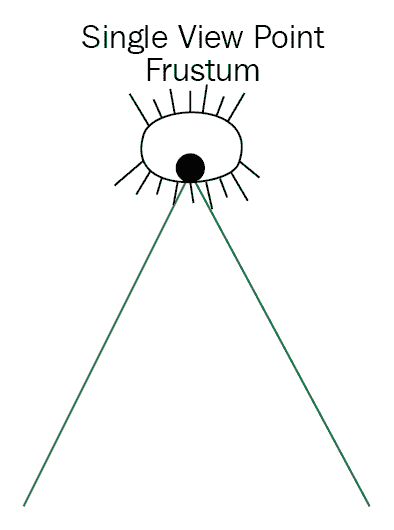
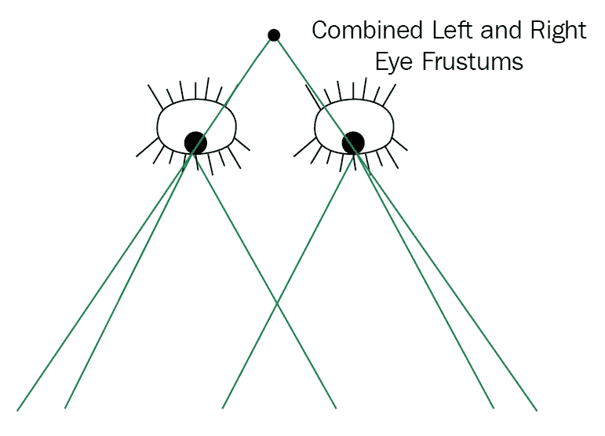
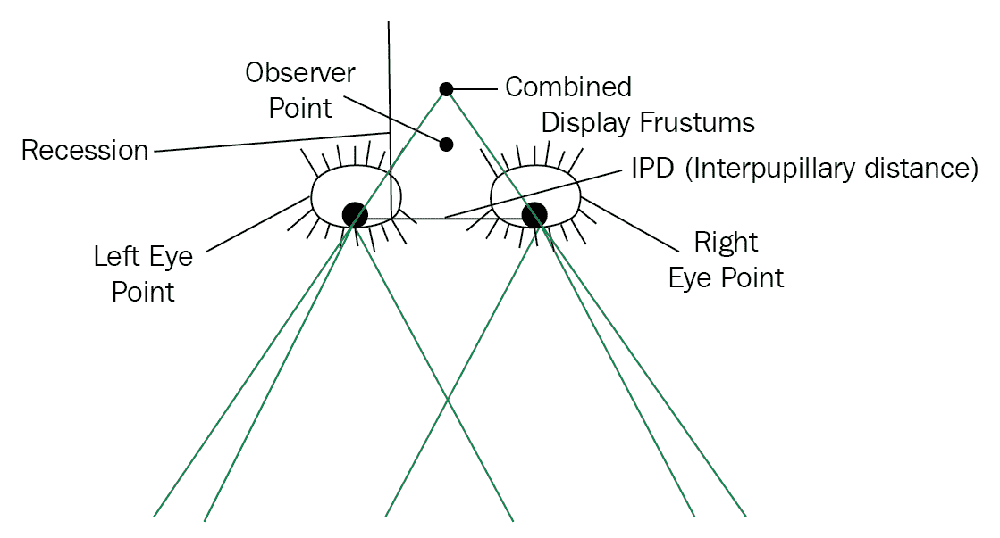
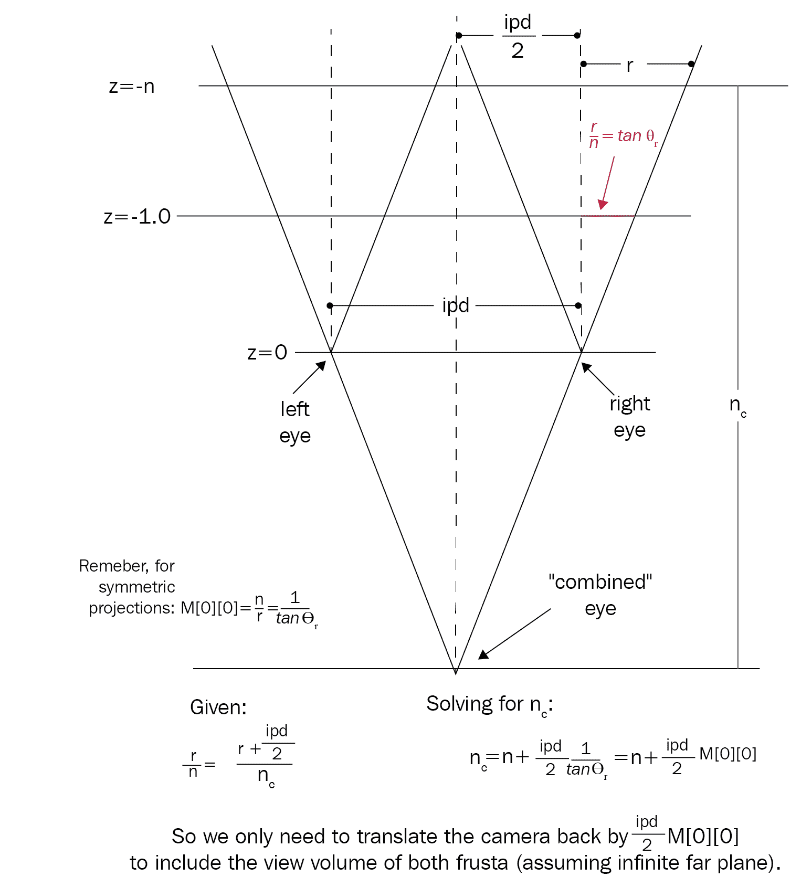

# 虚拟现实

**虚拟现实** ( **VR** )是这几天游戏开发非常热门的话题。在本章中，我们将了解如何利用 C++ 的强大功能来创建沉浸式虚拟现实体验。需要注意的是，虽然用于示例集成的 SDK 可用于 macOS，但本章中介绍的硬件和示例代码尚未在 macOS 上测试过，也不能保证得到支持。还应该注意的是，您将需要一个虚拟现实耳机和一个功能强大的电脑和显卡来运行本章的结束示例。建议您使用与英特尔 i5-4590 或 AMD FX 8350 相匹配或超越的中央处理器，以及与英伟达 GeForce GTX 960 或 AMD 镭龙 R9 290 相匹配或超越的图形处理器。在本章中，我们将涵盖以下主题:

*   当前虚拟现实硬件
*   虚拟现实渲染概念
*   SDKs 耳机
*   实施虚拟现实支持

# 快速虚拟现实概述

虚拟现实是一种计算机技术，它使用各种形式的硬件，通过使用逼真的图像、声音和其他感觉，在重建或想象的环境中生成用户身体存在的模拟。处于虚拟现实环境中的用户能够环视人工世界，并且随着虚拟现实技术的新进步，在虚拟世界中移动并与虚拟项目或对象交互。虽然虚拟现实技术可以追溯到 20 世纪 50 年代，但随着计算机图形、处理和电源的最新发展，虚拟现实已经复苏。脸书、索尼、谷歌和微软等知名科技巨头在虚拟和增强现实技术上下了大赌注。自从鼠标发明以来，用户与计算机交互的方式还没有如此大的创新潜力。虚拟现实的用例不仅仅是游戏开发。许多其他领域都将虚拟现实技术视为扩展自己独特互动的一种方式。医疗保健、教育、培训、工程、社会科学、市场营销，当然还有电影和娱乐，都为拥有本书和游戏开发中所学技能的开发人员提供了充满希望的机会。我经常建议寻求改变节奏或新挑战的游戏开发人员将新兴的虚拟现实开发场景作为他们知识和技能库的替代用途。

# 当前虚拟现实硬件

作为开发者，我们正处于一个非常幸运的 VR 硬件发展时期。说到虚拟现实硬件，有许多不同的选择，包括投影系统，如**洞穴自动虚拟环境** ( **洞穴**)、**头戴式显示器** ( **头盔显示器**)，甚至基于手机的系统，如谷歌白日梦和纸板。在这里，我们将重点关注沉浸式电脑和控制台驱动的头盔显示器。这些头盔显示器背后的大多数技术非常相似。这里列出的每个头盔显示器在运动、3D 空间头部跟踪方面至少有 **s** **ix 自由度** ( **6DOF** )，有的甚至有基本的空间感知，常被称为*房间感*。这些耳机的开发在很大程度上可以用相同的方式进行，但是对这些不同的设备有一个大致的了解是很好的。接下来，我们将快速了解一下目前可供消费者使用的一些最常见的耳机。

# Oculus Rift CV1

Oculus Rift 最初是一个由人群资助的项目，现已成为目前最受欢迎的耳机之一。Oculus 裂谷经历了几次迭代。第一个和第二个硬件版本面向开发者(DK1 和 DK2)。在脸书收购 Oculus 初创公司后，这家社交媒体巨头发布了第一款商用版硬件，名为**消费版 1** ( **CV1** )。虽然支持在**蒸汽**游戏平台，Oculus 是非常绑在自己的发射器和软件平台。耳机目前仅支持 PC 开发:


以下是 Oculus Rift CV1 的特点:

*   **屏幕类型** : AMOLED
*   **分辨率**:每只眼睛 1080 x 1200
*   **视野** : ~110 <sup>0</sup>
*   **头部跟踪** : IMU(指南针、加速度计、陀螺仪)、IR 光学跟踪

推荐的最低电脑规格如下:

*   **GPU** : NVIDIA GeForce GTX 970 或 AMD 镭龙 R9 290
*   **CPU** :英特尔 i5-4590 或 AMD FX 8350
*   **RAM** : 8 GB
*   **OS** : Windows 7

# HTC 还活着

可以说是目前最受欢迎的耳机，HTC Vive 是由 HTC(一家智能手机和平板电脑制造商)和 Valve corporation(一家游戏公司，以蒸汽游戏平台而闻名)创建的。通常直接与 Oculus Rift 相比，HTC Vive 在设计上确实有许多相似之处，只是略有不同，在许多开发人员看来，这使得 HTC Vive 成为了一款出色的硬件:


以下是 HTC Vive 的特点:

*   **屏幕类型** : AMOLED
*   **分辨率**:每只眼睛 1080 x 1200
*   **视野** : 110 <sup>0</sup>
*   **头部跟踪** : IMU(罗盘、加速度计、陀螺仪)、2 个 IR 基站

推荐的最低电脑规格如下:

*   **GPU** : NVIDIA GeForce GTX 970 或 AMD 镭龙 R9 290
*   **CPU** :英特尔 i5-4590 或 AMD FX 8350
*   **RAM** : 4 GB
*   **OS** : Windows 7，Linux

# 开源虚拟现实开发工具包

另一个非常有趣的硬件选项是 OSVR 套件，由 Razer 和 Sensics 开发。OSVR 的独特之处在于，它是一个开放许可、非专有的硬件平台和生态系统。这给了开发者在设计他们的增强现实/虚拟现实体验时很大的自由。OSVR 也是一个软件框架，我们将在稍后介绍。与硬件一样，该框架是开放许可的，旨在跨平台:


以下是 OSVR 的特性:

*   **屏幕类型** : AMOLED
*   **分辨率**:每只眼睛 960 x 1080
*   **视野** : 100 <sup>0</sup>
*   **头部跟踪** : IMU(指南针、加速度计、陀螺仪)、IR 光学跟踪

推荐的最低电脑规格如下:

*   **GPU** : NVIDIA GeForce GTX 970 或 AMD 镭龙 R9 290
*   **CPU** :英特尔 i5-4590 或 AMD FX 8350
*   **RAM** : 4 GB
*   **OS** :跨平台支持

# 索尼游戏机 VR

索尼 PlayStation VR 最初被称为**Mopheus 项目**，是索尼公司进入虚拟现实领域的入口。与此列表中的其他耳机不同，索尼 PlayStation VR 耳机不是由 PC 驱动，而是连接到索尼 PlayStation 4 游戏控制台。虽然不是最高保真度或最先进的技术，但通过使用 PS4 作为平台，索尼 PlayStation VR 耳机拥有 3000 多万的控制台基础:


以下是索尼 PlayStation VR 的功能:

*   **屏幕类型** : AMOLED
*   **分辨率**:每只眼睛 960 x 1080
*   **视野** : ~100 <sup>0</sup>
*   **头部跟踪** : IMU(指南针、加速度计、陀螺仪)、IR 光学跟踪
*   **控制台硬件**:索尼 PlayStation 4

# 视窗混合现实耳机

虚拟现实硬件领域的最新条目之一是支持视窗混合现实的耳机组。虽然不是单一的耳机设计，但视窗混合现实有一套规范和软件支持，可以从视窗 10 桌面实现虚拟现实。被称为**混合现实** ( **MR** )，这些耳机的独特之处在于其内置的空间感知或房间感。其他耳机，如 Oculus Rift 和 HTC Vive，也支持类似的功能，但与 Windows MR 设备不同，它们需要额外的硬件来支持跟踪。这种额外硬件的缺乏意味着 Windows MR 头戴式耳机应该更容易设置，并有可能使电脑驱动的虚拟现实体验更加便携:


以下是视窗磁流变耳机的特点:

*   **屏幕类型**:各种
*   **分辨率**:各种
*   **视野**:各种
*   **头部跟踪**:基于耳机的 9 自由度内外跟踪系统

推荐的最低电脑规格如下:

*   **GPU** : NVIDIA GeForce GTX 960、AMD 镭龙 RX 460 或集成英特尔高清显卡 620
*   **CPU** :英特尔 i5-4590 或 AMD FX 8350
*   **RAM** : 8 GB
*   **OS** : Windows 10

# 虚拟现实渲染概念

从渲染的角度来看虚拟现实，很快就会发现虚拟现实带来了一些独特的挑战。部分原因是需要达到一些必要的性能基准，以及渲染硬件目前的局限性。渲染 VR 内容时，需要以比标准高清更高的分辨率进行渲染，通常是两倍或更多。渲染也需要非常快，以每只眼睛 90 fps 或更高的帧速率为基准。这与抗锯齿和采样技术的使用相结合，意味着渲染一个虚拟现实场景需要的计算能力是以 1080p 和 60 fps 运行的标准游戏的五倍以上。在接下来的几节中，我们将讨论渲染虚拟现实内容时的一些主要差异，并涉及一些您可以实现以保持性能的概念。

# 与挫折一起工作

当开发一个虚拟现实就绪引擎时，最大的区别是理解如何在处理多个视点时构建一个合适的、裁剪的视图平截头体。在一个典型的非虚拟现实游戏中，你只有一个视点(摄像机)，你可以从这个视点创建一个视图平截头体。如果你需要一个完整的复习，请参考本书前面的内容，但是这个视图截锥决定了什么将被呈现并最终显示在屏幕上给用户。以下是描绘典型视平截头体的示意图:



在虚拟现实中渲染时，每只眼睛至少有一个平截头体，通常以立体方式显示到单个 HMD，这意味着在单个屏幕上显示一对图像，从而产生深度错觉。这些图像通常描绘场景的左眼和右眼视图。这意味着我们必须考虑两个*眼睛*截头体的位置，并通过组合它们来产生用于渲染的最终视图截头体。下面是这些视图墩的图示:



当涉及到创建一个结合了左眼和右眼截头体的单个截头体时，实际上是相当容易的。如下图所示，您需要将新平截头体的顶点放在两只眼睛之间，并稍微靠后。然后移动近裁剪平面位置，使其与任意一个眼平截头体的裁剪平面对齐。这对于最终显示**平截头体剔除**很重要:



您可以使用**瞳孔间距** ( **IPD** )通过一些简单的数学运算来计算这个平截头体，正如 Oculus Rift 团队的 Cass Everitt 在下图中完美展示的那样:



我们也可以通过简单地剔除共享的眼锥顶面和底面来简化这个过程。虽然在技术上没有形成完美的平截头体，但使用剔除算法在给定时间测试单个平面将产生所需的效果。

好消息是，这些大部分都可以抽象出来，在许多耳机 SDK 中都有方法可以帮助你。然而，重要的是要理解与标准的非虚拟现实场景渲染相比，如何使用截头体的区别。

# 提高渲染性能

当使用单个相机和视点时，就像大多数非虚拟现实游戏一样，我们可以简单地将渲染过程视为引擎中的一个步骤。当使用多个视点时，这是不同的。当然，我们可以将每个视点视为一个渲染任务，一个接一个地处理，但是这会导致渲染速度变慢。

如前一节所示，每只*眼睛*看到的东西有相当大的重叠。这为我们提供了通过共享和重用数据来优化渲染过程的绝佳机会。为此，我们可以实现**数据上下文**的概念。利用这个概念，我们可以分类哪些元素对于单眼来说是唯一存在的，哪些元素是可以共享的。让我们看看这些数据上下文，以及我们如何使用它们来加快渲染速度:

*   **框架上下文**:简单来说，框架上下文用于任何需要渲染的元素，与视图方向无关。这将包括诸如天空盒子、全局反射、水纹理等元素。任何可以跨视点共享的东西都可以放在这个上下文中。
*   **眼睛上下文**:这是视点之间不能共享的元素的上下文。这将包括渲染时需要立体视差的任何元素。也是在这种情况下，我们可以存储用于着色器计算的每只眼睛的数据。

使用这种将数据分成不同上下文的简单方法，我们可以重新组织渲染过程，如下所示:

```cpp
RenderScene(Frame f)
{
  ProcessFrame(f); //Handle any needed globally shared calculations
  RenderFrame(f); //Render any globally shared elements
  for(int i=0; i<numview points; i++) //numview points would be 2 for                            stereo
    {
      ProcessEye(i, f); //Handle any per eye needed calculations
      RenderEye(i, f); //Render any per eye elements
    }
}
```

虽然这表面上看起来是基本的，但它是一个非常强大的概念。通过以这种方式分离渲染，并尽可能地共享，我们大大提高了渲染器的整体性能。这是最简单的优化之一，也是回报最大的优化之一。我们还可以将这一点延续到如何设置着色器制服，将它们分解为上下文片段:

```cpp
layout (binding = 0) uniform FrameContext
{
  Mat4x4 location; //modelview
  Mat4x4 projection;
  Vec3 viewerPosition;
  Vec3 position;
}frame;
layout (binding = 1) uniform EyeContext
{
  Mat4x4 location; //modelview
  Mat4x4 projection;
  Vec3 position;
}eye;
```

从概念的角度来看，这种数据划分非常有效，并且这些数据片段中的每一个都可以在不同的时间更新，从而提供更好的整体性能。

这基本上从高层次上描述了处理虚拟现实中多个视点渲染的高效方式。如前所述，在正在开发的软件开发工具包中，与连接硬件和管道相关的大量设置被抽象出来。在下一节中，我们将研究其中的一些 SDK，并通过研究 SDK 在示例引擎中的实现来结束这一章。

# SDKs 耳机

有许多 SDK 可用于实现各种耳机和支持硬件，大多数制造商以某种形式提供自己的 SDK。在接下来的章节中，我们将快速了解开发个人电脑驱动的 HMD 虚拟现实体验时最常用的三个软件开发工具包:

*   **Oculus PC SDK**([https://developer . Oculus . com/downloads/package/Oculus-SDK-for-windows/](https://developer.oculus.com/downloads/package/oculus-sdk-for-windows/)):这个 SDK 是专门为用 C++ 开发 Oculus Rift HMD 体验和游戏时使用而创建的。核心软件开发工具包提供了开发人员访问渲染、跟踪、输入和其他核心硬件功能所需的一切。核心 SDK 由其他支持音频、平台和头像的 SDK 升华而来。
*   **OpenVR**([https://github.com/ValveSoftware/openvr](https://github.com/ValveSoftware/openvr)):这是 Valve 公司提供的 SDK，作为 SteamVR 平台的默认 API 和运行时。这也是 HTC Vive HMD 开发的默认 SDK，但旨在拥有多个供应商的支持。这意味着你有能力瞄准多个头盔显示器，而不必确切知道哪个 HMD 与之相连。这将是我们为示例引擎实现的 SDK。
*   **OSVR**([http://osvr.github.io/](http://osvr.github.io/)):OSVR SDK，就像它的名字所说的那样，是一个开源 SDK，旨在与多个硬件供应商合作。这个软件开发工具包是同名 HMD 的默认软件开发工具包，即 OSVR 耳机。该项目由 Razer 和 Sensics 牵头，许多大型游戏合作伙伴都加入了进来。OSVR SDK 可用于微软视窗、Linux、安卓和苹果操作系统。

# 实施虚拟现实支持

正如我们在整本书中看到的许多其他系统一样，从头开始实现虚拟现实支持可能是一个非常具有挑战性和耗时的过程。然而，很像那些其他系统，库和 SDK 的存在有助于简化和简化这个过程。在下一节中，我们将介绍如何使用 Valve 公司提供的 OpenVR SDK 向示例引擎添加 VR 渲染支持。我们将只讨论全部要点。要查看每种方法的更完整概述，请参考示例代码中的注释，并访问 OpenVR SDK Wiki 了解更多特定于 SDK 的信息([https://github.com/ValveSoftware/openvr/wiki](https://github.com/ValveSoftware/openvr/wiki))。

# 核实 HMD

首先，我们需要做一些事情来设置我们的硬件和环境。我们需要首先测试电脑是否连接了耳机。然后我们需要检查 OpenVR 运行时是否已经安装。然后我们可以初始化硬件，最后问它几个关于其性能的问题。为此，我们将向我们的`GameplayScreen`类添加一些代码；为了简洁起见，我们将跳过一些部分。完整的代码可以在代码库的`Chapter11`文件夹中的示例项目中找到。

让我们从检查是否有虚拟现实耳机连接到计算机开始，以及是否安装了 OpenVR(StemVR)运行时。为此，我们将在`Build()`方法中添加以下内容:

```cpp
void GameplayScreen::Build()
{
  if (!vr::VR_IsHmdPresent())
   {
      throw BookEngine::Exception("No HMD attached to the system");
   }
  if (!vr::VR_IsRuntimeInstalled())
   {
      throw BookEngine::Exception("OpenVR Runtime not found");
   }
}
```

在这里，我们抛出一个异常，如果这些检查中的任何一个失败，我们将处理并记录该异常。现在我们知道我们有一些硬件和所需的软件，我们可以初始化框架。为此，我们调用`InitVR`函数:

```cpp
InitVR();
```

`InitVR`函数的主要目的是依次调用 OpenVR SDK 的`VR_Init`方法。为此，它需要首先创建并设置一个错误处理程序。它还要求我们定义这将是什么类型的应用程序。在我们的案例中，我们声明这将是一个场景应用程序，`vr::VRApplication_Scene`。这意味着我们正在创建一个将绘制环境的 3D 应用程序。还有其他选项，如创建实用程序或仅覆盖应用程序。最后，一旦我们初始化了 HMD，没有错误，我们要求耳机告诉我们一些关于它自己的信息。我们使用`GetTrackedDeviceString`方法来实现这一点，我们将在稍后介绍。整个`InitVR`方法看起来如下:

```cpp
void GameplayScreen::InitVR()
{
   vr::EVRInitError err = vr::VRInitError_None;
   m_hmd = vr::VR_Init(&err, vr::VRApplication_Scene);
   if (err != vr::VRInitError_None)
   {
     HandleVRError(err);
   }
   std::cout << GetTrackedDeviceString(m_hmd,
   vr::k_unTrackedDeviceIndex_Hmd,vr::Prop_TrackingSystemName_String)
   << std::endl;
   std::clog << GetTrackedDeviceString(m_hmd,                  vr::k_unTrackedDeviceIndex_Hmd, vr::Prop_SerialNumber_String)<<        std::endl;
}
```

`HandleVRError`方法只是一个简单的助手方法，它接受传入的错误并抛出一个要处理和记录的错误，同时提供所抛出错误的英文翻译。以下是整个方法:

```cpp
void GameplayScreen::HandleVRError(vr::EVRInitError err)
{
  throw BookEngine::Exception(vr::VR_GetVRInitErrorAsEnglishDescription(err));
}
```

`InitVR`函数调用的另一个方法是`GetTrackedDeviceString`函数。这是作为 OpenVR 示例代码的一部分提供的一个函数，它允许我们返回一些关于附加设备的信息。在我们的案例中，我们要求连接设备的系统名称和序列号属性(如果有):

```cpp
std::string GameplayScreen::GetTrackedDeviceString(vr::IVRSystem * pHmd, vr::TrackedDeviceIndex_t unDevice, vr::TrackedDeviceProperty prop, vr::TrackedPropertyError * peError)
{
  uint32_t unRequiredBufferLen = pHmd-                  >GetStringTrackedDeviceProperty(unDevice, prop, NULL, 0, peError);
    if (unRequiredBufferLen == 0)
      return "";

   char *pchBuffer = new char[unRequiredBufferLen];
   unRequiredBufferLen = pHmd->GetStringTrackedDeviceProperty(unDevice,   prop, pchBuffer, unRequiredBufferLen, peError);
   std::string sResult = pchBuffer;
   delete[] pchBuffer;
   return sResult;
}
```

最后，回到我们的`Build`方法，现在我们已经完成了初始化步骤，我们可以通过询问系统`VRCompositor`函数是否被设置为非空值来检查是否一切正常。如果是，这意味着一切都准备好了，然后我们可以询问我们的 HMD 希望我们的渲染目标大小是多少，并在我们的控制台窗口中显示为字符串输出:

```cpp
if (!vr::VRCompositor())
 {
   throw BookEngine::Exception("Unable to initialize VR compositor!\n ");
 }
m_hmd->GetRecommendedRenderTargetSize(&m_VRWidth, &m_VRHeight);

std::cout << "Initialized HMD with suggested render target size : " << m_VRWidth << "x" << m_VRHeight << std::endl;
}
```

我们需要做的最后一件事是确保我们在程序完成时清理干净。这里，在`GamplayScreen`的`Destroy`方法中，我们首先检查 HMD 是否被初始化；如果是，我们调用`VR_Shutdown`方法并将`m_hmd`变量设置为空。在应用程序关闭时调用`VR_Shutdown`是非常重要的，如果您没有这样做，OpenVR/StemVR 可能会挂起，并可能需要重新启动才能再次运行:

```cpp
void GameplayScreen::Destroy()
{
   if (m_hmd)
    {
       vr::VR_Shutdown();
       m_hmd = NULL;
    }
}
```

现在，如果我们继续运行这个示例，在控制台窗口中，您应该会看到类似如下的内容:

**** 

# 翻译

现在，我们已经建立了 HMD 和我们的引擎交谈，下一步是渲染它。过程其实没那么复杂；如前所述，SDK 为我们处理了大量事务。为了使事情尽可能简单，这个例子只是一个简单的渲染例子。我们不处理头部跟踪或输入，我们只是简单地在每只眼睛中显示不同的颜色。和前面的例子一样，为了节省时间和空间，我们只打算覆盖重要的元素，让你掌握概念。完整的代码可以在代码库的`Chapter11`文件夹中的示例项目中找到。

正如我们之前所讨论的，在立体渲染时，您通常会渲染一个已经分成两半的显示器。然后，我们将适当的数据传递给另一半，这取决于在那只眼睛中可以看到什么。回顾*与截头体*一起工作部分，了解为什么会这样。归根结底，我们需要为每只眼睛创建一个帧缓冲区。为此，我们有一个`RenderTarget`类来创建帧缓冲区，附加纹理，最后创建所需的视口(它是总显示宽度的一半)。为了节省空间，我不会打印出`RenderTarget`类；它相当简单明了，我们以前从未见过。相反，让我们继续设置和处理 HMD 场景显示的实际功能。首先，我们需要将我们的`RenderTarget`连接到我们的纹理，为了正确的实现，清除并设置缓冲区。为此，我们在`GameplayScreen`的`OnEntry`方法中添加了以下内容:

```cpp
BasicRenderTarget leftRT(1, vrApp.rtWidth, vrApp.rtHeight);
BasicRenderTarget rightRT(1, vrApp.rtWidth, vrApp.rtHeight);

leftRT.Init(leftEyeTexture.name);
rightRT.Init(rightEyeTexture.name);

glClearColor(1.0f, 0.0f, 0.0f, 1.0f);
leftRT.fbo.Bind(GL_FRAMEBUFFER);
glClear(GL_COLOR_BUFFER_BIT | GL_DEPTH_BUFFER_BIT);

if (glCheckFramebufferStatus(GL_FRAMEBUFFER) != GL_FRAMEBUFFER_COMPLETE)
  {
    throw std::runtime_error("left rt incomplete");
  }
glClearColor(0.0f, 1.0f, 0.0f, 1.0f);
rightRT.fbo.Bind(GL_FRAMEBUFFER);
glClear(GL_COLOR_BUFFER_BIT | GL_DEPTH_BUFFER_BIT);
if (glCheckFramebufferStatus(GL_FRAMEBUFFER) != GL_FRAMEBUFFER_COMPLETE)
  {
    throw std::runtime_error("right rt incomplete");
  }
glBindFramebuffer(GL_FRAMEBUFFER, 0);

glClearColor (0.0f, 0.0f, 1.0f, 1.0f);
```

我不会一行一行地重复前面的代码，因为我们之前已经看到了所有这些。现在，随着我们的缓冲区和纹理设置，我们可以继续添加绘图调用。

OpenVR SDK 提供了处理显示虚拟现实场景的复杂片段所需的方法。这项复杂工作的大部分是由排字系统完成的。如 Valve 所述，*“合成器通过处理失真、预测、同步和其他微妙的问题，简化了向用户显示图像的过程，这些问题对于获得稳定的虚拟现实体验来说是一个挑战。”*

为了连接到合成器子系统，我们创建了一个名为`SubmitFrames`的简单方法。这个方法有三个参数——每只眼睛的纹理和一个布尔值来指定颜色空间是否应该是`linear`。在写的时候，我们总想指定颜色空间应该是`Gamma`为`OpenGL`。在该方法中，我们获得想要渲染的设备，设置颜色空间，转换纹理，然后将这些纹理提交给`VRCompositor`，然后在引擎盖下，处理纹理显示给正确的眼睛。整个方法如下所示:

```cpp
void GameplayScreen::SubmitFrames(GLint leftEyeTex, GLint rightEyeTex, bool linear = false)
{
 if (!m_hmd)
  {
    throw std::runtime_error("Error : presenting frames when VR system handle is NULL");
  }
  vr::TrackedDevicePose_t trackedDevicePose[vr::k_unMaxTrackedDeviceCount];
  vr::VRCompositor()->WaitGetPoses(trackedDevicePose,        vr::k_unMaxTrackedDeviceCount, nullptr, 0);

  vr::EColorSpace colorSpace = linear ? vr::ColorSpace_Linear :    vr::ColorSpace_Gamma;

  vr::Texture_t leftEyeTexture = { (void*)leftEyeTex,    vr::TextureType_OpenGL, colorSpace };
  vr::Texture_t rightEyeTexture = { (void*)rightEyeTex,   vr::TextureType_OpenGL, colorSpace };

  vr::VRCompositor()->Submit(vr::Eye_Left, &leftEyeTexture);
  vr::VRCompositor()->Submit(vr::Eye_Right, &rightEyeTexture);

  vr::VRCompositor()->PostPresentHandoff();
}
```

有了我们的`SubmitFrames`函数，我们就可以在`glClear`函数调用之后调用游戏屏幕更新中的方法表单:

```cpp
…
glClear(GL_COLOR_BUFFER_BIT);
SubmitFrames(leftEyeTexture.id, rightEyeTexture.id);
```

如果您现在运行示例项目，假设您安装了必要的 SteamVR 框架，您应该会看到耳机的每只眼睛都显示不同的颜色。

# 摘要

虽然这是对虚拟现实开发世界的快速介绍，但它应该为您的体验想法提供一个很好的测试平台。我们学习了如何处理多视图截头体，了解了各种硬件选项，最后研究了如何使用 OpenVR SDK 向示例引擎添加 VR 支持。随着硬件的进步，虚拟现实将继续获得势头，并将继续推进到新的领域。了解 VR 渲染作为一个整体是如何工作的，可以为您的开发知识库提供新的深度。