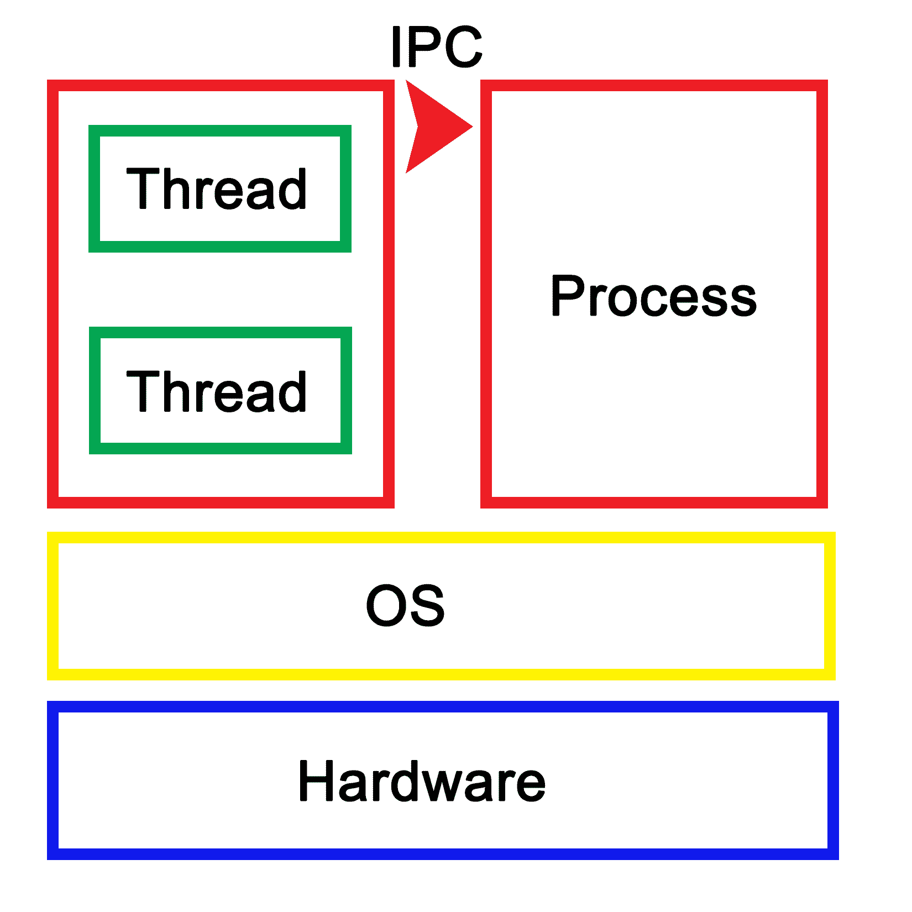
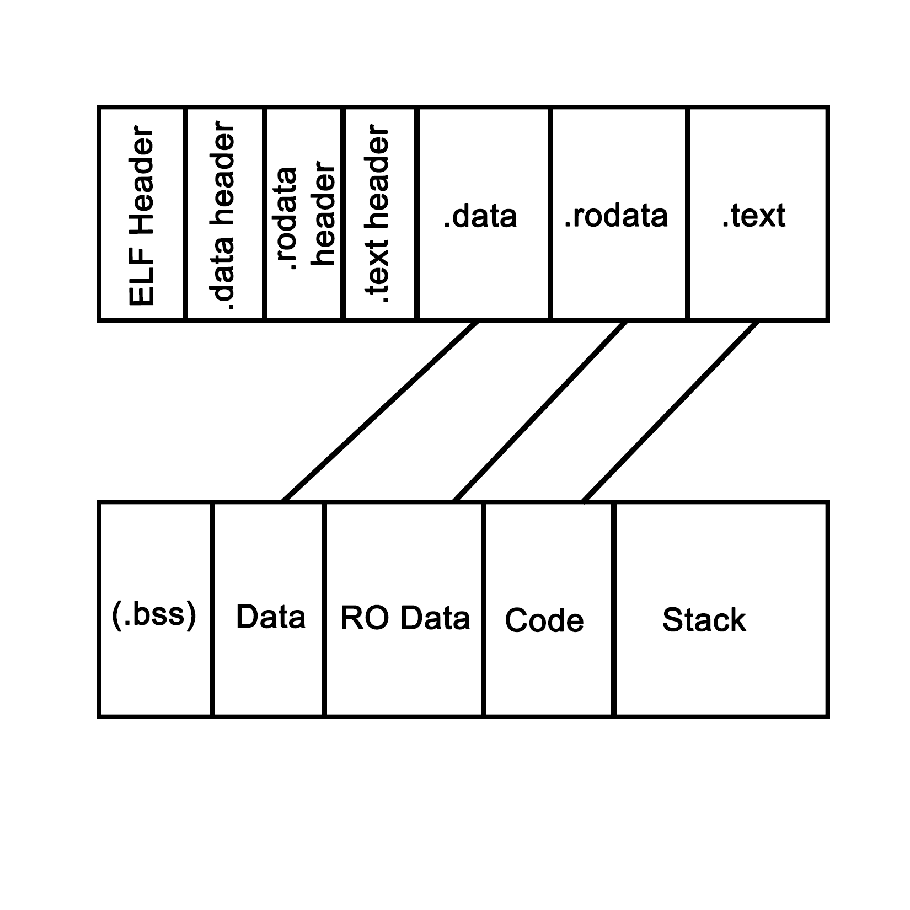
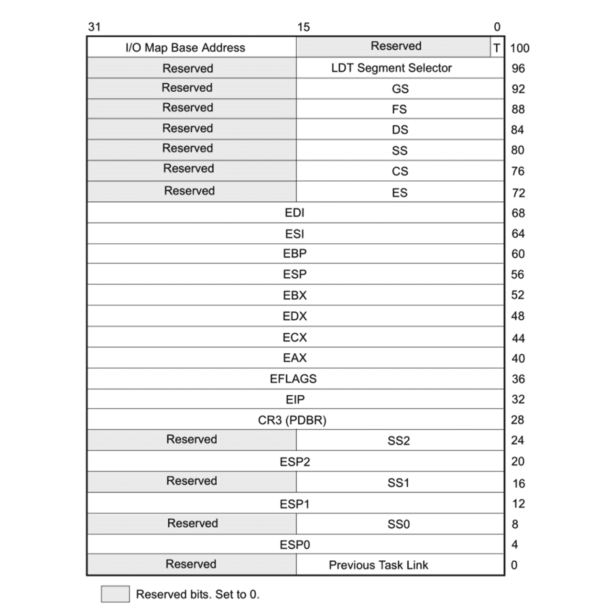
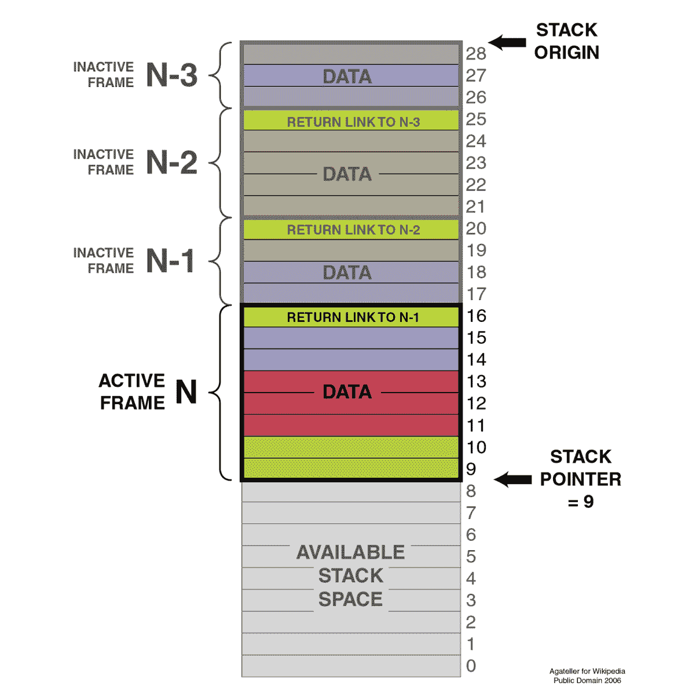
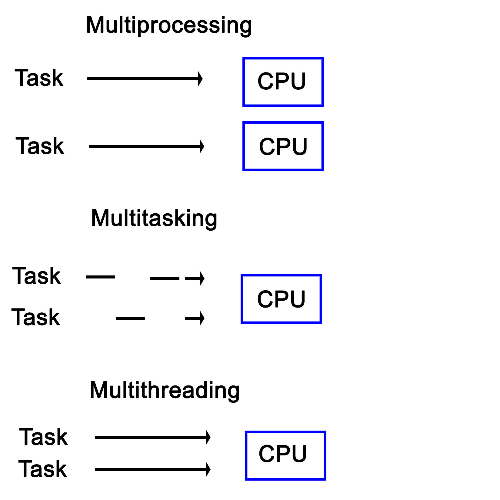
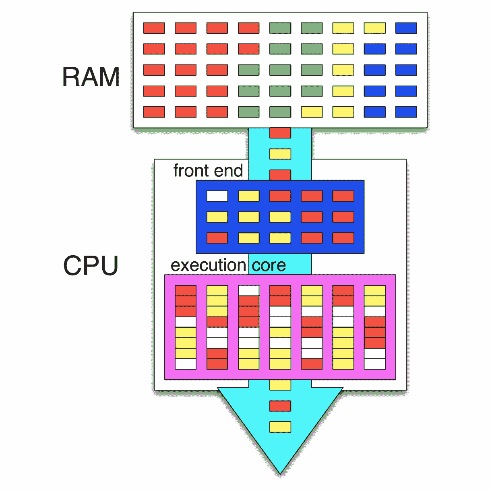
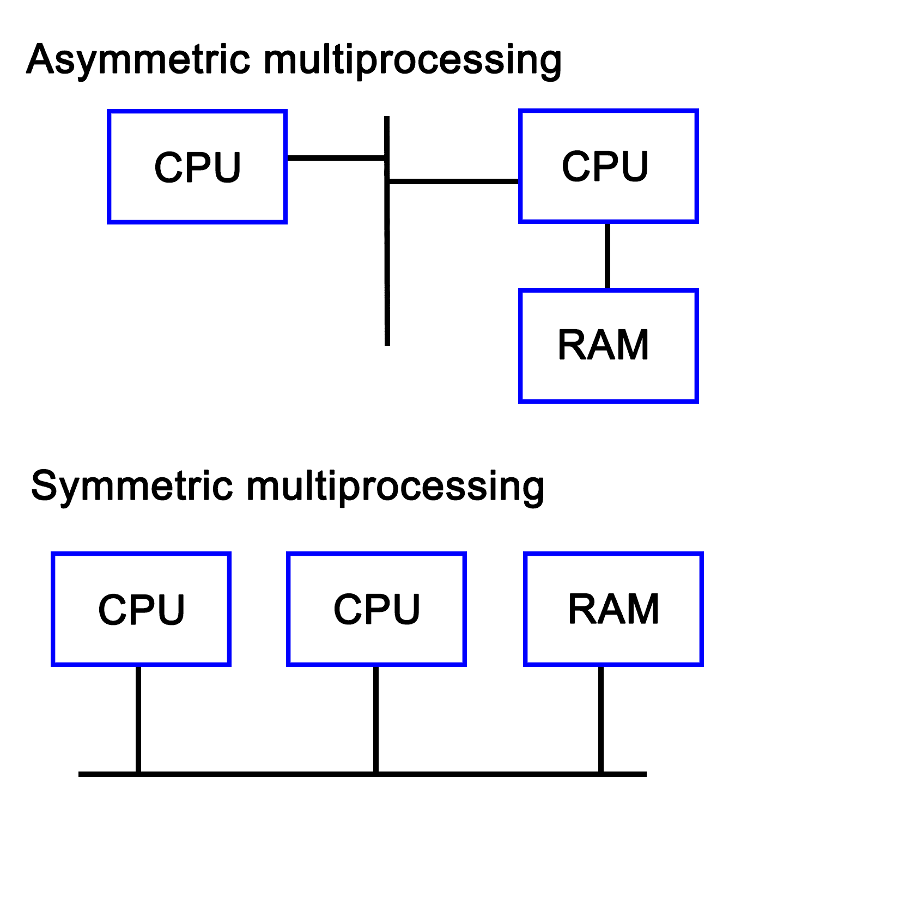
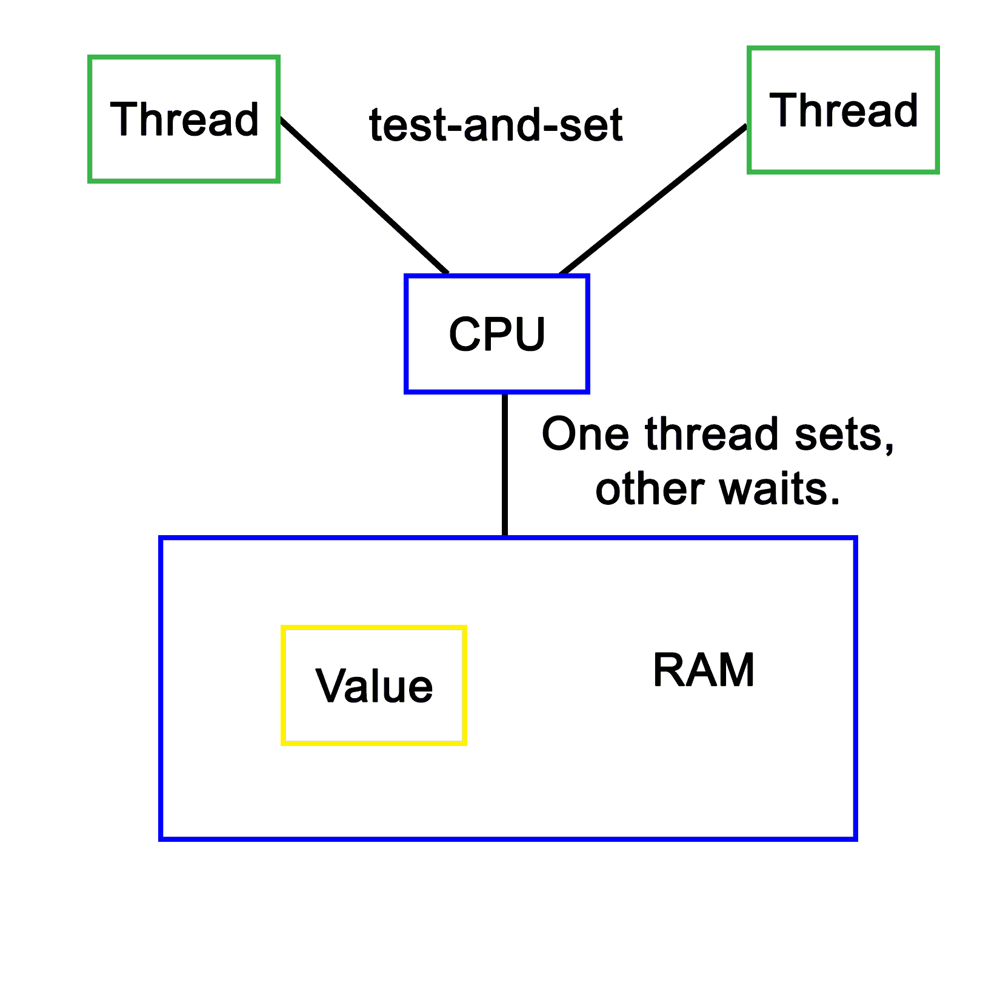

# 处理器和操作系统上的多线程实现

任何多线程应用程序的基础都是由处理器硬件实现所需的功能，以及由操作系统将这些功能转换为应用程序使用的应用程序接口的方式形成的。了解这一基础对于直观了解如何最好地实现多线程应用程序至关重要。

本章着眼于硬件和操作系统在过去几年中是如何发展的，以达到今天使用的当前实现和应用编程接口。它展示了前一章的示例代码如何最终转化为处理器和相关硬件的命令。

本章涵盖的主题包括:

*   支持多线程概念的处理器硬件的发展
*   操作系统如何改变以使用这些硬件功能
*   各种架构中内存安全和内存模型背后的概念
*   操作系统不同进程和线程模型之间的差异

# 定义进程和线程

本质上，对于**操作系统** ( **操作系统**，一个进程由一个或多个线程组成，每个线程处理自己的状态和变量。人们会认为这是一种分层配置，以操作系统为基础，为(用户)进程的运行提供支持。每个进程都由一个或多个线程组成。进程间通信由操作系统提供的**进程间通信** ( **IPC** )处理。

在图形视图中，如下所示:



操作系统中的每个进程都有自己的状态，进程中的每个线程都有自己的状态以及相对于同一进程中其他线程的状态。虽然 IPC 允许进程之间相互通信，但线程可以通过各种方式与进程内的其他线程进行通信，我们将在后面的章节中对此进行更深入的探讨。这通常涉及线程之间的某种共享内存。

应用程序是以特定的可执行格式从二进制数据加载的，例如通常在 Linux 和许多其他操作系统上使用的**可执行和可链接格式** ( **ELF** )。对于 ELF 二进制文件，应该始终存在以下数量的部分:

*   `.bss`
*   `.data`
*   `.rodata`
*   `.text`

`.bss`部分本质上被分配了未初始化的内存，包括不占用二进制空间的空数组，因为在可执行文件中存储纯零的行是没有意义的。同样，还有`.data`部分，有初始化的数据。这包含全局表、变量等。最后，`.rodata`部分类似于`.data`，但顾名思义，它是只读的。它包含诸如硬编码字符串之类的东西。

在`.text`部分，我们找到将由处理器执行的实际应用指令(代码)。整个过程将由操作系统加载，从而创建一个进程。这样一个过程的布局如下图所示:



这就是从 ELF 格式二进制文件启动的进程的样子，尽管内存中的最终格式在基本上任何操作系统中都大致相同，包括从 PE 格式二进制文件启动的 Windows 进程。二进制文件中的每个部分都被加载到各自的部分中，BSS 部分被分配到指定的大小。`.text`部分与其他部分一起被加载，一旦完成，它的初始指令就被执行，从而开始该过程。

在 C++等系统语言中，可以看到变量和其他程序状态信息是如何存储在堆栈(变量存在于范围内)和堆(使用新的运算符)中的。堆栈是内存的一部分(每个线程分配一个)，其大小取决于操作系统及其配置。创建新线程时，通常还可以通过编程设置堆栈大小。

在操作系统中，一个进程由一个内存地址块组成，内存地址块的大小是恒定的，并受内存指针大小的限制。对于 32 位操作系统，这将把该数据块限制为 4 GB。在这个虚拟内存空间中，操作系统分配一个基本堆栈和堆，这两者都可以增长，直到所有内存地址都用完，进程分配更多内存的进一步尝试将被拒绝。

堆栈是操作系统和硬件的概念。本质上，它是所谓堆栈帧的集合(堆栈)，每个堆栈帧都由变量、指令和其他与任务执行帧相关的数据组成。

在硬件方面，堆栈是任务(x86)或进程状态(ARM)的一部分，这是处理器定义执行实例(程序或线程)的方式。这个硬件定义的实体包含单个执行线程的整个状态。有关这方面的更多详细信息，请参见以下部分。

# x86 (32 位和 64 位)中的任务

英特尔 IA-32 系统编程指南第 3A 卷中对任务的定义如下:

*“任务是处理器可以分派、执行和挂起的工作单元。它可以用来执行程序、任务或进程、操作系统服务实用程序、中断或异常处理程序、内核或执行实用程序。”*

*“IA-32 架构提供了一种机制，用于保存任务的状态、分派任务以供执行以及从一个任务切换到另一个任务。当在保护模式下运行时，所有的处理器执行都发生在一个任务中。即使是简单的系统也必须定义至少一个任务。更复杂的系统可以使用处理器的任务管理设施来支持多任务应用。”*

本节选自 IA-32(英特尔 x86)手册，总结了硬件如何支持和实现对操作系统、进程以及这些进程之间的切换的支持。

这里重要的是要认识到，对于处理器来说，没有进程或线程这种东西。它只知道执行线程，定义为一系列指令。这些指令被加载到内存中的某个地方，并且随着应用程序在进程的数据部分中执行，这些指令中的当前位置与正在创建的变量数据(变量)一起被跟踪。

每个任务也在硬件定义的保护环内运行，操作系统的任务通常在环 0 上运行，用户任务在环 3 上运行。除了 x86 体系结构上现代操作系统的特定用例之外，很少使用环 1 和环 2。这些环是由硬件强制执行的特权级别，例如允许内核和用户级任务的严格分离。

32 位和 64 位任务的任务结构在概念上非常相似。它的官方名称是**任务状态结构** ( **TSS** )。对于 32 位 x86 CPUs，它具有以下布局:



以下是第一部分:

*   **SS0** :第一个堆栈段选择器字段
*   **ESP0** :第一个 SP 字段

对于 64 位 x86 _ 64 CPUs，TSS 布局看起来有些不同，因为在这种模式下不支持基于硬件的任务切换:


在这里，我们有相似的相关字段，只是名称不同:

*   **RSPn** :权限级别 0 到 2 的 SP
*   **ISTn** :中断堆栈表指针

即使在 32 位模式的 x86 上，CPU 支持基于硬件的任务间切换，但大多数操作系统在不考虑模式的情况下，每个 CPU 将仅使用单个 TSS 结构，并在软件中进行任务间的实际切换。这部分是由于效率原因(仅换出发生变化的指针)，部分是由于只有这种方式才可能实现的功能，例如测量进程/线程使用的 CPU 时间，以及调整线程或进程的优先级。在软件中这样做也简化了 64 位和 32 位系统之间代码的可移植性，因为前者不支持基于硬件的任务切换。

在基于软件的任务切换期间(通常通过中断)，电潜泵/RSP 等存储在内存中，并用下一个计划任务的值替换。这意味着一旦执行恢复，TSS 结构现在将拥有新任务的**堆栈指针** ( **SP** )、段指针、寄存器内容和所有其他细节。

中断的来源可以基于硬件或软件。设备通常使用硬件中断向中央处理器发出信号，表示它们需要操作系统的注意。调用硬件中断的行为称为中断请求(IRQ)。

软件中断可能是由于中央处理器本身的异常情况，或者是中央处理器指令集的特征。操作系统内核切换任务的动作也是通过触发软件中断来执行的。

# ARM 中的进程状态

在 ARM 架构中，应用通常运行在非特权**异常级别 0** ( **EL0** )级别，相当于 x86 架构上的 ring 3，以及 EL1 中的 OS 内核。ARMv7 (AArch32，32 位)架构在通用寄存器 13 中具有 SP。对于 ARMv8 (AArch64，64 位)，为每个异常级别实现一个专用的 SP 寄存器:`SP_EL0`、`SP_EL1`等等。

对于任务状态，ARM 架构使用**程序状态寄存器** ( **PSR** )实例作为**当前程序状态寄存器** ( **CPSR** )或**保存程序状态寄存器** ( **SPSR** )程序状态的寄存器。PSR 是**过程状态** ( **PSTATE** )的一部分，它是过程状态信息的抽象。

虽然 ARM 架构与 x86 架构有很大的不同，但在使用基于软件的任务切换时，基本原则不会改变:保存当前任务的 SP，注册状态，并在恢复处理之前将下一个任务的细节放在那里。

# 堆栈

正如我们在前面几节中看到的，堆栈和中央处理器寄存器一起定义了一个任务。如前所述，这个堆栈由堆栈帧组成，每个堆栈帧定义了特定任务执行实例的(局部)变量、参数、数据和指令。值得注意的是，尽管堆栈和堆栈框架主要是一个软件概念，但它是任何现代操作系统的一个基本特征，在许多中央处理器指令集中都有硬件支持。从图形上看，它可以像下面这样可视化:



SP(x86 上的 e SP)指向堆栈顶部，另一个指针(**扩展基本指针** ( **EBP** )代表 x86)。每个帧都包含对前一帧的引用(调用者返回地址)，由操作系统设置。

当在自己的 C++应用程序中使用调试器时，这基本上是在请求回溯时看到的——堆栈的各个帧显示了直到当前帧之前的初始堆栈帧。在这里，人们可以检查每个单独的帧的细节。

# 定义多线程

在过去的几十年里，许多与计算机处理任务的方式有关的不同术语被创造出来并被普遍使用。不管正确与否，其中许多也可以互换使用。与多处理相比，多线程就是一个例子。

这里，后者意味着在具有多个物理处理器的系统中，每个处理器运行一个任务，而前者意味着在单个处理器上同时运行多个任务，因此给人一种它们都在同时执行的错觉:



多处理和多任务之间的另一个有趣的区别是，后者使用时间片在单个处理器内核上运行多个线程。这与多线程不同，因为在多任务系统中，没有任务会在同一个中央处理器内核上以并发方式运行，尽管任务仍然会被中断。

从软件的角度来看，进程和包含在所述进程中的线程之间的共享内存空间的概念是多线程系统的核心。尽管硬件通常没有意识到这一点——只看到操作系统的一项任务。然而，这样的多线程进程包含两个或更多线程。然后，这些线程中的每一个都执行自己的一系列任务。

在其他实现中，例如英特尔在 x86 处理器上的**超线程** ( **HT** )，这种多线程是在硬件本身中实现的，通常称为 SMT(详见*同步多线程(SMT)* 一节)。启用超线程后，每个物理中央处理器内核作为两个内核呈现给操作系统。然后，硬件本身将尝试同时执行分配给这些所谓的虚拟内核的任务，调度可以同时使用处理内核的不同元素的操作。实际上，这可以显著提升性能，而无需操作系统或应用程序进行任何类型的优化。

当然，操作系统仍然可以进行自己的调度，以进一步优化任务的执行，因为硬件不知道它正在执行的指令的许多细节。

启用超线程在视觉格式中如下所示:



在上图中，我们看到了内存中四个不同任务的指令。其中，两个任务(线程)同时执行，中央处理器的调度器(在前端)试图调度指令，以便尽可能多的指令可以并行执行。在不可能的地方，所谓的管道气泡(白色)出现在执行硬件空闲的地方。

加上内部中央处理器优化，这导致了非常高的指令吞吐量，也称为每秒**指令** ( **IPC** )。对于确定一个中央处理器的绝对性能来说，这个 IPC 值通常远比一个中央处理器的千兆赫等级更重要。

# 弗林分类法

早在 1966 年，迈克尔·j·弗林就首次提出用一个系统对不同类型的计算机体系结构进行分类。这个分类系统知道四个类别，根据输入和输出流的数量定义处理硬件的能力:

*   **单指令、单数据** ( **SISD** ):取单指令对单数据流进行操作。这是 CPU 的传统模式。
*   **单指令多数据** ( **SIMD** ):采用这种模型，单个指令并行操作多个数据流。这是矢量处理器如**图形处理单元** ( **图形处理器**)使用的。
*   **多指令、单数据** ( **MISD** ):该模型最常用于冗余系统，不同的处理单元对同一数据执行相同的操作，在最后验证结果以检测硬件故障。这是航空电子系统和类似系统常用的。
*   **多指令、多数据** ( **MIMD** ):对于这个模型，多处理系统非常适合自己。多个处理器上的多个线程处理多个数据流。这些线索并不完全相同，SIMD 的情况就是如此。

这些类别需要注意的一点是，它们都是根据多处理来定义的，这意味着它们指的是硬件的内在能力。使用软件技术，几乎任何方法都可以在一个常规的 SISD 风格的架构上进行近似。然而，这是多线程的一部分。

# 对称与非对称多处理

在过去的几十年里，许多包含多个处理单元的系统被创造出来。这些可大致分为**对称多处理** ( **SMP** )和**非对称多处理** ( **AMP** )系统。

AMP 的主要定义特征是第二个处理器作为外围设备连接到主 CPU。这意味着它不能运行控制软件，只能运行用户应用程序。这种方法也被用来连接使用不同架构的 CPU，例如，允许在基于 Amiga 68k 的系统上运行 x86 应用程序。

在 SMP 系统中，每个 CPU 都是能够访问相同硬件资源的对等体，并且以协作方式建立。最初，SMP 系统涉及多个物理 CPU，但后来，多个处理器内核集成在单个 CPU 芯片上:



随着多核 CPU 的激增，SMP 是嵌入式开发之外最常见的处理类型，其中单处理(单核、单处理器)仍然非常普遍。

从技术上讲，系统中的声音、网络和图形处理器可以被认为是与 CPU 相关的非对称处理器。随着**通用 GPU**(**GPU**)处理的增加，AMP 变得更加相关。

# 松散和紧密耦合的多处理

多处理系统不一定必须在单个系统中实现，但也可以由连接在网络中的多个系统组成。这样的集群被称为松散耦合的多处理系统。我们在[第 9 章](09.html)、*分布式计算的多线程*中介绍了分布式计算。

这与紧密耦合的多处理系统形成对比，该系统使用相同的低级高速总线或类似设备集成在单个**印刷电路板** ( **印刷电路板**)上。

# 将多处理和多线程结合起来

几乎任何现代系统都将多处理和多线程结合在一起，这得益于多核处理器，它在单个处理器芯片上结合了两个或更多的处理核心。这对操作系统来说意味着，它必须跨多个处理内核调度任务，同时还必须在特定的内核上调度任务，以获得最大的性能。

这是任务调度器的领域，我们稍后会看到。只要说这是一个值得自己写本书的话题就够了。

# 多线程类型

像多处理一样，没有一个单一的实现，而是两个主要的实现。这两者之间的主要区别是处理器在单个周期内可以并发执行的最大线程数。多线程实现的主要目标是获得尽可能接近 100%的处理器硬件利用率。多线程利用线程级和进程级并行来实现这一目标。

是两种类型的多线程，我们将在下面的小节中介绍。

# 时态多线程

也称为超线程，**时态多线程** ( **TMT** )的主要子类型为粗粒度和细粒度(或交错)。前者在不同任务之间快速切换，在切换到另一个任务的上下文之前保存每个任务的上下文。后一种类型在每个周期内切换任务，从而产生一个包含来自各种任务的指令的中央处理器流水线，术语*交错*就是由此而来的。

细粒度类型在桶处理器中实现。与 x86 和其他体系结构相比，它们有一个优势，即它们可以保证特定的时序(对硬实时嵌入式系统有用)，而且由于可以做出假设，实现起来不太复杂。

# 同时多线程

SMT 在超标量 CPU(实现指令级并行)上实现，包括 x86 和 ARM 架构。SMT 的定义特征也由其名称来表示，具体来说，它能够在每个内核上并行执行多个线程。

通常，每个内核两个线程是常见的，但是一些设计支持每个内核最多八个并发线程。这样做的主要优点是能够在线程之间共享资源，而明显的缺点是多线程的需求冲突，这是必须管理的。另一个优点是，由于缺乏硬件资源复制，它使最终的中央处理器更节能。

英特尔的 HT 技术本质上是英特尔的 SMT 实现，提供了一个基本的两线程 SMT 引擎，从 2002 年的一些奔腾 4 CPUs 开始。

# 调度程序

存在许多任务调度算法，每种算法都关注不同的目标。一些人可能寻求最大化吞吐量，另一些人可能寻求最小化延迟，而另一些人可能寻求最大化响应时间。哪个调度程序是最佳选择完全取决于系统的应用。

对于桌面系统，调度程序通常尽可能通用，通常优先考虑前台应用程序而不是后台应用程序，以便给用户最好的桌面体验。

对于嵌入式系统，尤其是实时系统，工业应用反而会寻求保证时序。这使得过程能够在正确的时间执行，这在例如驱动机械、机器人或化学过程中至关重要，在这些过程中，即使几毫秒的延迟也可能是昂贵的，甚至是致命的。

调度程序的类型也取决于操作系统的多任务状态——协作多任务系统无法提供关于何时可以将正在运行的进程切换到另一个进程的许多保证，因为这取决于活动进程何时退出。

使用抢占式调度器，进程可以在不被察觉的情况下进行切换，从而允许调度器更好地控制进程何时在哪个时间点运行。

基于 Windows NT 的操作系统(Windows NT、2000、XP 等)使用所谓的多级反馈队列，具有 32 个优先级。这种类型的优先级调度器允许用户将任务优先于其他任务，允许用户微调结果体验。

Linux 最初(内核 2.4)也使用了类似 Windows NT 的基于多级反馈队列的优先级调度器，带有 O(n)调度器。在 2.6 版本中，这被一个 O(1)调度程序所取代，允许在固定的时间内调度进程。从 Linux 内核 2.6.23 开始，默认的调度程序是**完全公平调度程序** ( **CFS** )，它确保所有任务都获得相当份额的 CPU 时间。

下表列出了用于许多常用或知名操作系统的调度算法类型:

| **操作系统** | **先发制人** | **算法** |
| 朋友 OS | 是 | 优先循环调度 |
| FreeBSD | 是 | 多级反馈队列 |
| 2.6.0 之前的 Linux 内核 | 是 | 多级反馈队列 |
| Linux 内核 2.6.0-2.6.23 | 是 | O(1)调度程序 |
| 2.6.23 之后的 Linux 内核 | 是 | 完全公平调度程序 |
| 经典的 Mac OS 之前版本 | 没有人 | 合作调度程序 |
| Mac OS 9 | 一些 | MP 任务的抢先调度程序，进程和线程的协作调度程序 |
| X/macOS | 是 | 多级反馈队列 |
| NetBSD | 是 | 多级反馈队列 |
| Solaris | 是 | 多级反馈队列 |
| Windows 3.1x | 没有人 | 合作调度程序 |
| Windows 95、98、我 | 一半 | 32 位进程的抢先调度程序，16 位进程的协作调度程序 |
| Windows NT(包括 2000、XP、Vista、7 和服务器) | 是 | 多级反馈队列 |

(来源:[https://en . Wikipedia . org/wiki/Scheduling _(计算)](https://en.wikipedia.org/wiki/Scheduling_(computing)))

抢先列指示调度程序是否抢先，下一列提供进一步的细节。可以看到，抢占式调度器非常常见，所有现代桌面操作系统都使用它。

# 跟踪演示应用程序

在[第 1 章](01.html)、*重访多线程*的演示代码中，我们看了一个简单的`c++11`应用程序，它使用四个线程来执行一些处理。在本节中，我们将从硬件和操作系统的角度来看同一个应用程序。

当我们查看`main`函数中代码的开始时，我们看到我们创建了一个包含单个(整数)值的数据结构:

```cpp
int main() {
    values.push_back(42);

```

在操作系统创建新的任务和相关的堆栈结构后，向量数据结构的实例(为整数类型定制)被分配到堆栈上。这个文件的大小是在二进制文件的全局数据部分指定的。

当应用程序使用其入口函数(默认为`main()`)开始执行时，数据结构被修改为包含新的整数值。

接下来，我们创建四个线程，为每个线程提供一些初始数据:

```cpp
    thread tr1(threadFnc, 1);
    thread tr2(threadFnc, 2);
    thread tr3(threadFnc, 3);
    thread tr4(threadFnc, 4);

```

对于操作系统，这意味着创建新的数据结构，并为每个新线程分配一个堆栈。对于硬件，如果不使用基于硬件的任务切换，这最初不会改变任何事情。

此时，操作系统的调度程序和中央处理器可以结合起来，利用硬件的特性，包括 SMP、SMT 等，尽可能高效、快速地执行这组任务(线程)。

此后，主线程等待，直到其他线程停止执行:

```cpp
    tr1.join();
    tr2.join();
    tr3.join();
    tr4.join();

```

这些是阻塞调用，将主线程标记为阻塞，直到这四个线程(任务)完成执行。此时，操作系统的调度程序将恢复主线程的执行。

在每个新创建的线程中，我们首先在标准输出上输出一个字符串，确保锁定互斥体以确保同步访问:

```cpp
void threadFnc(int tid) {
    cout_mtx.lock();
    cout << "Starting thread " << tid << ".\n";
    cout_mtx.unlock();

```

本质上，互斥体是存储在堆堆栈上的单个值，然后使用原子操作访问它。这意味着需要某种形式的硬件支持。使用这个，任务可以检查它是否被允许继续，或者必须等待并重试。

在最后这段特殊的代码中，这个互斥锁允许我们在标准的 C++输出流上输出，而没有其他线程的干扰。

之后，我们将向量中的初始值复制到一个局部变量，再次确保同步完成:

```cpp
    values_mtx.lock();
    int val = values[0];
    values_mtx.unlock();

```

这里也发生了同样的事情，只是现在互斥锁允许我们读取向量中的第一个值，而不会有另一个线程访问甚至在我们使用它时改变它的风险。

接下来生成一个随机数，如下所示:

```cpp
    int rval = randGen(0, 10);
    val += rval;

```

这使用`randGen()`方法，如下所示:

```cpp
int randGen(const int& min, const int& max) {
    static thread_local mt19937 generator(hash<thread::id>() (this_thread::get_id()));
    uniform_int_distribution<int> distribution(min, max);
    return distribution(generator);
}

```

这个方法很有趣，因为它使用了一个线程局部变量。线程本地存储是线程内存中特定于它的一部分，用于全局变量，然而，全局变量必须保持限于该特定线程。

这对于像这里使用的静态变量非常有用。`generator`实例是静态的，因为我们不想每次使用这个方法时都重新初始化它，但是我们也不想在所有线程之间共享这个实例。通过使用线程本地的静态实例，我们可以实现这两个目标。创建并使用一个静态实例，但是对于每个线程是分开的。

`Thread`函数随后以相同的互斥锁序列被锁定，新值被复制到数组中而结束。

```cpp
    cout_mtx.lock();
    cout << "Thread " << tid << " adding " << rval << ". New value: " << val << ".\n";
    cout_mtx.unlock();

    values_mtx.lock();
    values.push_back(val);
    values_mtx.unlock();
}

```

在这里，我们看到对标准输出流的同步访问，然后是对值数据结构的同步访问。

# 互斥实现

互斥是多线程应用程序中线程安全访问数据的基础原则。人们可以在硬件和软件中实现这一点。**互斥** ( **互斥**)是大多数实现中这个功能最基本的形式。

# 五金器具

在单处理器(单处理器内核)非 SMT 系统上，最简单的基于硬件的实现是禁用中断，从而防止任务被更改。更常见的是，采用所谓的忙-等原则。这是互斥体背后的基本原理——由于处理器如何获取数据，只有一个任务可以在共享内存中获取和读/写一个原子值，这意味着一个大小与中央处理器寄存器相同(或更小)的变量。这在[第 8 章](02.html)、*原子操作-使用硬件*中有进一步的详细说明。

当我们的代码试图锁定一个互斥体时，它所做的是读取这样一个原子内存段的值，并试图将其设置为锁定值。因为这是单个操作，所以在任何给定时间只有一个任务可以更改该值。其他任务将不得不等待，直到它们可以在这个繁忙等待周期中获得访问权限，如下图所示:



# 软件

软件定义的互斥实现都是基于繁忙等待的。一个例子是**德克尔的**算法，它定义了一个系统，其中两个进程可以同步，采用忙等待来等待另一个进程离开关键部分。

该算法的伪代码如下:

```cpp
    variables
        wants_to_enter : array of 2 booleans
        turn : integer

    wants_to_enter[0] ← false
    wants_to_enter[1] ← false
    turn ← 0 // or 1

p0:
    wants_to_enter[0] ← true
    while wants_to_enter[1] {
        if turn ≠ 0 {
            wants_to_enter[0] ← false
            while turn ≠ 0 {
                // busy wait
            }
            wants_to_enter[0] ← true
        }
    }
    // critical section
    ...
    turn ← 1
    wants_to_enter[0] ← false
    // remainder section

p1:
    wants_to_enter[1] ← true
    while wants_to_enter[0] {
        if turn ≠ 1 {
            wants_to_enter[1] ← false
            while turn ≠ 1 {
                // busy wait
            }
            wants_to_enter[1] ← true
        }
    }
    // critical section
    ...
    turn ← 0
    wants_to_enter[1] ← false
    // remainder section

```

(参考自:[https://en.wikipedia.org/wiki/Dekker's_algorithm](https://en.wikipedia.org/wiki/Dekker's_algorithm)

在前面的算法中，进程指示进入关键部分的意图，检查是否轮到它们(使用进程标识)，然后在它们进入该部分后将它们进入该部分的意图设置为假。只有当一个流程再次将其输入意图设置为真时，它才会再次进入关键部分。如果它希望进入，但`turn`与它的进程标识不匹配，它将忙碌等待，直到条件变为真。

基于软件的互斥算法的一个主要缺点是，只有当代码的**无序** ( **OoO** )执行被禁用时，它们才能工作。OoO 意味着硬件主动对传入的指令重新排序，以便优化它们的执行，从而改变它们的顺序。由于这些算法要求按顺序执行各种步骤，因此它们不再适用于 OoO 处理器。

# 摘要

在本章中，我们看到了进程和线程是如何在操作系统和硬件中实现的。我们还研究了处理器硬件的各种配置和调度中涉及的操作系统元素，以了解它们如何提供各种类型的任务处理。

最后，我们采用了上一章的多线程程序示例，并再次运行了一遍，这一次考虑了在执行时操作系统和处理器中发生的情况。

在下一章中，我们将看看通过操作系统和基于库的实现提供的各种多线程应用编程接口，以及比较这些应用编程接口的例子。