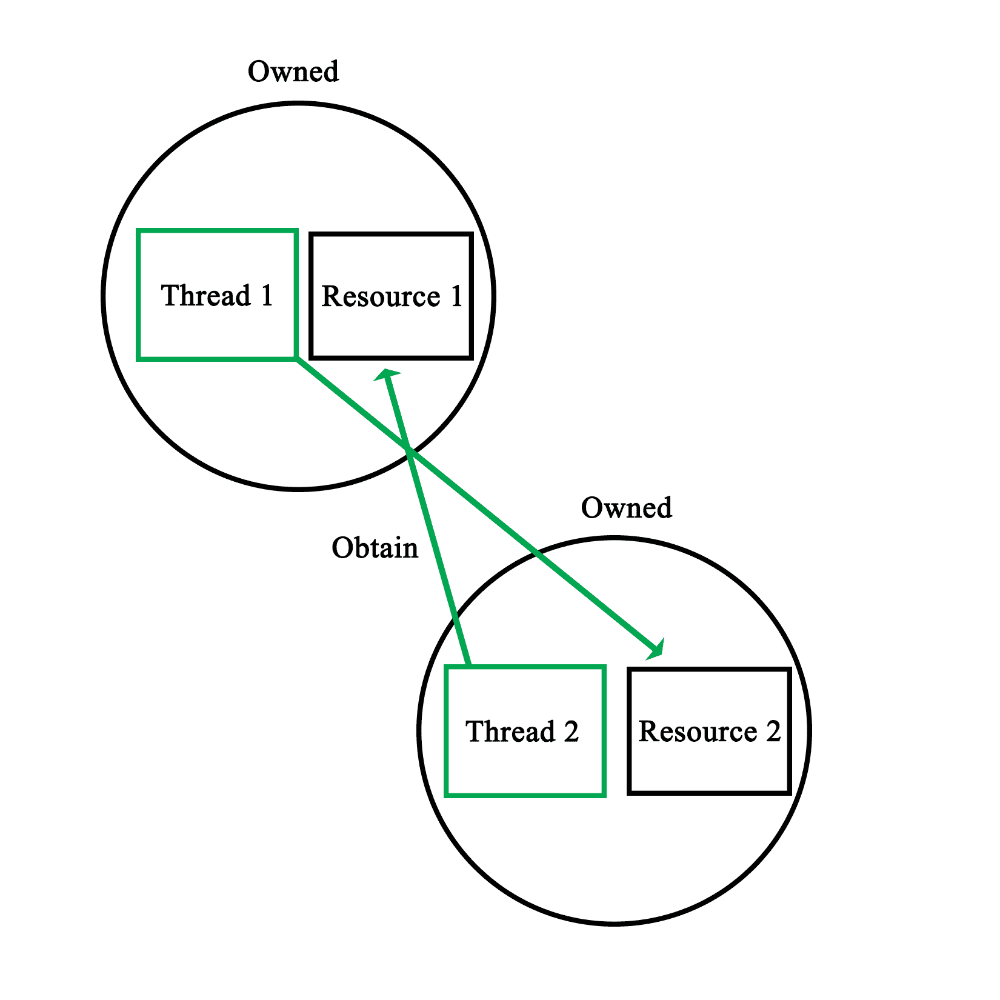
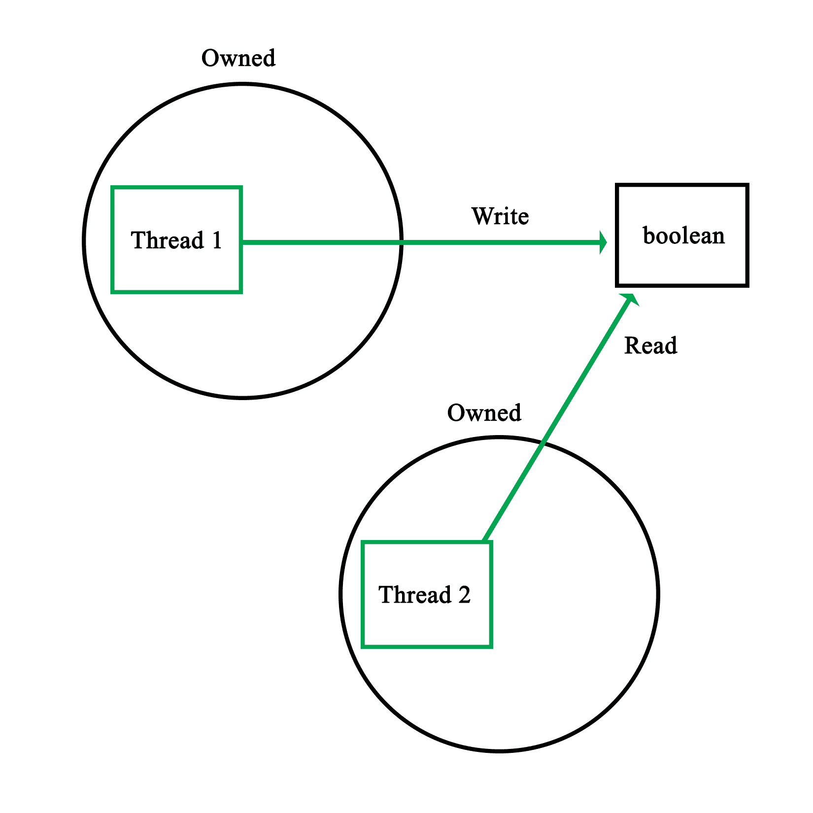
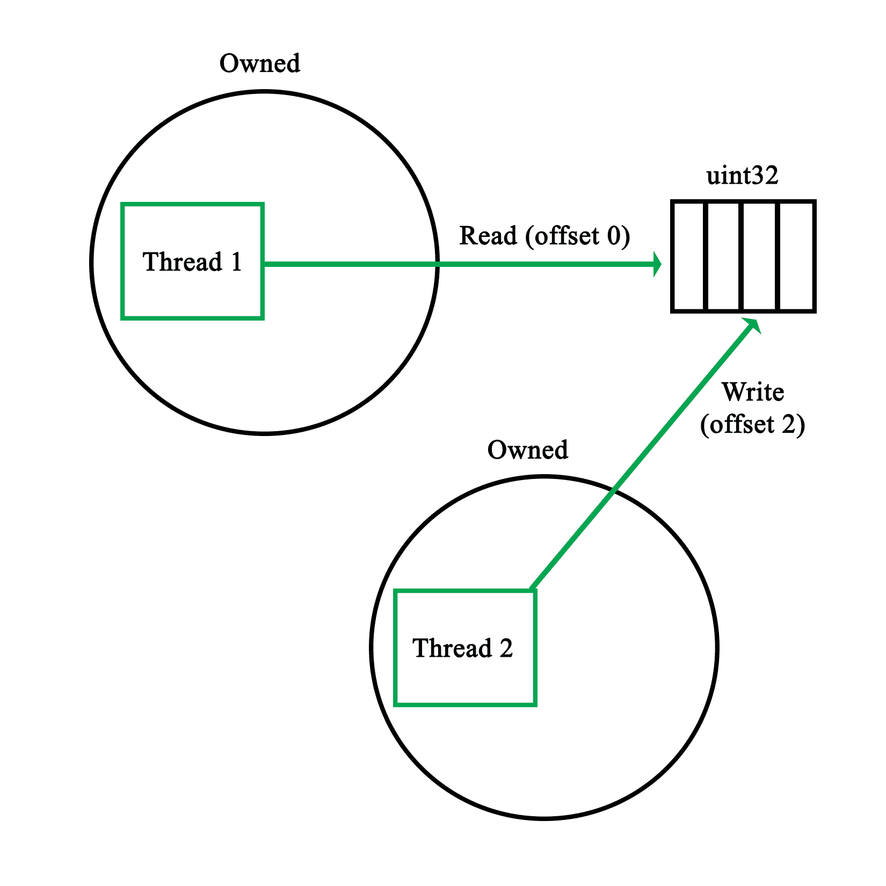
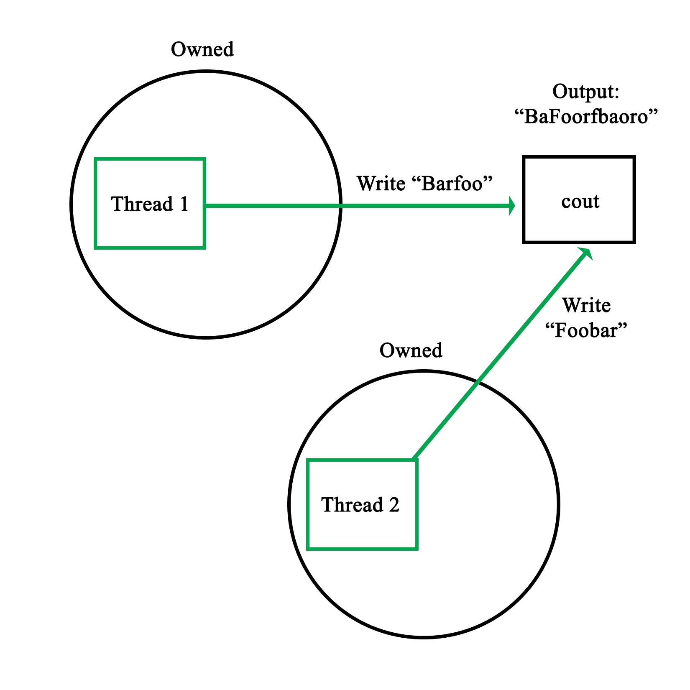

# 七、最佳实践

和大多数事情一样，最好避免犯错，而不是事后改正。本章讨论了多线程应用的一些常见错误和设计问题，并展示了避免常见和不常见问题的方法。

本章的主题包括:

*   常见的多线程问题，如死锁和数据竞争。
*   互斥、锁和陷阱的正确使用。
*   使用静态初始化时的潜在问题。

# 适当的多线程

在前面的章节中，我们已经看到了编写多线程代码时可能出现的各种潜在问题。这些问题从显而易见的，比如两个线程不能同时写入同一个位置，到更微妙的，比如互斥锁的不正确使用。

还有许多不是多线程代码直接组成部分的元素的问题，然而这些问题可能会导致看似随机的崩溃和其他令人沮丧的问题。这方面的一个例子是变量的静态初始化。在接下来的几节中，我们将研究所有这些问题以及更多的问题，以及防止不得不处理这些问题的方法。

就像生活中的许多事情一样，它们是有趣的经历，但你通常不愿意重复它们。

# 错误的期望-僵局

死锁的名字已经被描述得非常简洁了。当两个或多个进程试图访问另一个进程持有的资源，而另一个线程同时等待访问它持有的资源时，就会发生这种情况。

例如:

1.  线程 1 获得对资源 A 的访问
2.  线程 1 和 2 都想访问资源 B
3.  线程 2 获胜，现在拥有 B，线程 1 仍在等待 B
4.  线程 2 现在想使用 A，等待访问
5.  线程 1 和 2 永远等待资源

在这种情况下，我们假设线程将能够在某个时候访问每个资源，而事实恰恰相反，这要归功于每个线程都持有另一个线程需要的资源。

想象一下，这个死锁过程如下所示:



这清楚地表明，防止死锁的两个基本规则是:

*   任何时候都不要超过一把锁。
*   尽快释放所有锁。

我们在[第 4 章](04.html)、*线程同步和通信*中看到了一个真实的例子，当时我们看了调度器演示代码。这段代码包含两个互斥锁，用于安全访问两个数据结构:

```cpp
void Dispatcher::addRequest(AbstractRequest* request) {
    workersMutex.lock();
    if (!workers.empty()) {
          Worker* worker = workers.front();
          worker->setRequest(request);
          condition_variable* cv;
          mutex* mtx;
          worker->getCondition(cv);
          worker->getMutex(mtx);
          unique_lock<mutex> lock(*mtx);
          cv->notify_one();
          workers.pop();
          workersMutex.unlock();
    }
    else {
          workersMutex.unlock();
          requestsMutex.lock();
          requests.push(request);
          requestsMutex.unlock();
    }
 } 

```

这里的互斥体是`workersMutex`和`requestsMutex`变量。我们可以清楚地看到，在试图访问另一个互斥体之前，我们在任何时候都没有抓住这个互斥体。我们在方法的开始显式锁定`workersMutex`，这样我们就可以安全地检查 workers 数据结构是否为空。

如果不是空的，我们会将新的请求交给一个工作人员。然后，当我们处理完工人、数据结构时，我们释放互斥体。此时，我们保留零互斥体。这里没有什么太复杂的，因为我们只使用一个互斥体。

有趣的是在 else 语句中，因为当没有等待的工作者并且我们需要获得第二个互斥体时。当我们进入这个范围时，我们保留一个互斥体。我们可以尝试获取`requestsMutex`并假设它会工作，然而这可能会陷入僵局，原因很简单:

```cpp
bool Dispatcher::addWorker(Worker* worker) {
    bool wait = true;
    requestsMutex.lock();
    if (!requests.empty()) {
          AbstractRequest* request = requests.front();
          worker->setRequest(request);
          requests.pop();
          wait = false;
          requestsMutex.unlock();
    }
    else {
          requestsMutex.unlock();
          workersMutex.lock();
          workers.push(worker);
          workersMutex.unlock();
    }
          return wait;
 } 

```

前面我们看到的伴随函数也使用了这两个互斥体。更糟糕的是，这个函数在单独的线程中运行。结果，当第一个函数在试图获得`requestsMutex`时保持`workersMutex`，而第二个函数同时保持后者，同时试图获得前者时，我们遇到了死锁。

然而，在函数中，正如我们在这里看到的，这两个规则都已成功实现；我们从不一次持有一把以上的锁，我们会尽快释放我们持有的任何锁。这可以在其他两种情况下看到，当我们进入它们时，我们首先释放任何不再需要的锁。

无论哪种情况，我们都不再需要分别检查工作人员或请求数据结构；我们可以在做其他事情之前释放相关的锁。这将产生以下可视化效果:


当然，我们可能需要使用包含在两个或多个数据结构或变量中的数据；其他线程同时使用的数据。可能很难确保生成的代码中没有死锁的可能。

在这里，可能需要考虑使用临时变量或类似的东西。通过锁定互斥体，复制相关数据，并立即释放锁，就没有机会与该互斥体死锁。即使必须将结果写回数据结构，也可以在单独的操作中完成。

这又增加了两条防止死锁的规则:

*   尽量不要同时持有一把以上的锁。
*   尽快释放所有锁。
*   锁的时间不要超过绝对必要的时间。
*   当持有多把锁时，注意它们的顺序。

# 粗心-数据竞赛

当两个或多个线程试图同时写入同一个共享内存时，就会发生数据争用，也称为争用情况。因此，在每个线程执行的指令序列期间和结束时，共享存储器的状态根据定义是非确定性的。

正如我们在[第 6 章](06.html)、*调试多线程代码*中看到的，用于调试多线程应用的工具经常报告数据竞争。例如:

```cpp
    ==6984== Possible data race during write of size 1 at 0x5CD9260 by thread #1
 ==6984== Locks held: none
 ==6984==    at 0x40362C: Worker::stop() (worker.h:37)
 ==6984==    by 0x403184: Dispatcher::stop() (dispatcher.cpp:50)
 ==6984==    by 0x409163: main (main.cpp:70)
 ==6984== 
 ==6984== This conflicts with a previous read of size 1 by thread #2
 ==6984== Locks held: none
 ==6984==    at 0x401E0E: Worker::run() (worker.cpp:51)
 ==6984==    by 0x408FA4: void std::_Mem_fn_base<void (Worker::*)(), true>::operator()<, void>(Worker*) const (in /media/sf_Projects/Cerflet/dispatcher/dispatcher_demo)
 ==6984==    by 0x408F38: void std::_Bind_simple<std::_Mem_fn<void (Worker::*)()> (Worker*)>::_M_invoke<0ul>(std::_Index_tuple<0ul>) (functional:1531)
 ==6984==    by 0x408E3F: std::_Bind_simple<std::_Mem_fn<void (Worker::*)()> (Worker*)>::operator()() (functional:1520)
 ==6984==    by 0x408D47: std::thread::_Impl<std::_Bind_simple<std::_Mem_fn<void (Worker::*)()> (Worker*)> >::_M_run() (thread:115)
 ==6984==    by 0x4EF8C7F: ??? (in /usr/lib/x86_64-linux-gnu/libstdc++.so.6.0.21)
 ==6984==    by 0x4C34DB6: ??? (in /usr/lib/valgrind/vgpreload_helgrind-amd64-linux.so)
 ==6984==    by 0x53DF6B9: start_thread (pthread_create.c:333)
 ==6984==  Address 0x5cd9260 is 96 bytes inside a block of size 104 alloc'd
 ==6984==    at 0x4C2F50F: operator new(unsigned long) (in /usr/lib/valgrind/vgpreload_helgrind-amd64-linux.so)
 ==6984==    by 0x40308F: Dispatcher::init(int) (dispatcher.cpp:38)
 ==6984==    by 0x4090A0: main (main.cpp:51)
 ==6984==  Block was alloc'd by thread #1

```

产生上述警告的代码如下:

```cpp
bool Dispatcher::stop() {
    for (int i = 0; i < allWorkers.size(); ++ i) {
          allWorkers[i]->stop();
    }
          cout << "Stopped workers.\n";
          for (int j = 0; j < threads.size(); ++ j) {
          threads[j]->join();
                      cout << "Joined threads.\n";
    }
 } 

```

考虑`Worker`实例中的这段代码:

```cpp
   void stop() { running = false; } 

```

我们还有:

```cpp
void Worker::run() {
    while (running) {
          if (ready) {
                ready = false;
                request->process();
                request->finish();
          }
                      if (Dispatcher::addWorker(this)) {
                while (!ready && running) {
                      unique_lock<mutex> ulock(mtx);
                      if (cv.wait_for(ulock, chrono::seconds(1)) == cv_status::timeout) {
                      }
                }
          }
    }
 } 

```

这里，`running`是一个被设置为`false`的布尔变量(从一个线程向其写入)，通知工作线程它应该终止其等待循环，其中从不同的进程读取布尔变量，主线程对工作线程:



这个特殊例子的警告是由于一个布尔变量被同时写入和读取。自然，这种特定情况安全的原因与原子有关，如[第 8 章](08.html)、*原子操作-使用硬件*中详细解释的那样。

之所以即使这样的操作也有潜在的风险，是因为读取操作可能会在变量仍处于更新过程中时发生。例如，在 32 位整数的情况下，根据硬件架构，更新该变量可能在一次操作中完成，也可能在多次操作中完成。在后一种情况下，读取操作可能会读取一个具有不可预测结果的中间值:



更滑稽的情况发生在多个线程使用例如`cout`向一个标准写入数据时。由于该流不是线程安全的，因此无论何时任一线程有机会写入，结果输出流都将包含输入流的位和片段:



因此，防止数据竞争的基本规则是:

*   切勿写入未锁定的非原子共享资源
*   从不从未锁定的非原子共享资源中读取

这实质上意味着任何写或读都必须是线程安全的。如果一个线程写入共享内存，那么其他线程应该不能同时写入。同样，当我们读取共享资源时，我们需要确保最多只有其他线程也在读取共享资源。

正如我们在前面的章节中看到的，这种级别的互斥自然是通过互斥来实现的，读写锁提供了一种改进，允许同时读取，同时将写入作为完全互斥的事件。

当然，互斥体也有问题，我们将在下一节中看到。

# 互斥体不是魔法

互斥体构成了几乎所有形式互斥 API 的基础。在它们的核心，它们看起来极其简单，只有一个线程可以拥有一个互斥体，其他线程整齐地在队列中等待，直到它们可以获得互斥体的锁。

人们甚至可以这样描述这个过程:


现实当然不那么美好，主要是因为硬件强加给我们的实际限制。一个明显的限制是同步原语不是免费的。即使它们在硬件中实现，也需要多次调用才能使它们工作。

在硬件中实现互斥体最常见的两种方法是使用**测试和设置**(**【TAS】**)或**比较和交换** ( **CAS** ) CPU 功能。

测试集通常被实现为两条汇编级指令，它们是自主执行的，这意味着它们不能被中断。第一条指令测试某个内存区域是设置为 1 还是 0。第二条指令仅在值为零时执行(`false`)。这意味着互斥锁还没有被锁定。因此，第二条指令将内存区域设置为 1，锁定互斥体。

在伪代码中，这看起来像这样:

```cpp
bool TAS(bool lock) { 
   if (lock) { 
         return true; 
   } 
   else { 
         lock = true; 
         return false; 
   } 
} 

```

比较和交换是一种较少使用的变体，它对一个内存位置和一个给定值执行比较操作，只有在前两者匹配时才替换该内存位置的内容:

```cpp
bool CAS(int* p, int old, int new) { 
   if (*p != old) { 
               return false; 
         } 

   *p = new; 
         return true; 
} 

```

无论是哪种情况，都必须主动重复任一函数，直到返回正值:

```cpp
volatile bool lock = false; 

 void critical() { 
     while (TAS(&lock) == false); 
     // Critical section 
     lock = 0; 
 } 

```

这里，一个简单的 while 循环用于不断轮询内存区域(标记为易失性，以防止可能有问题的编译器优化)。通常，使用一种算法来缓慢降低轮询速率。这是为了减少处理器和内存系统的压力。

这表明互斥锁的使用不是自由的，而是等待互斥锁的每个线程都在主动使用资源。因此，这里的一般规则是:

*   确保线程尽可能短暂地等待互斥体和类似的锁。
*   使用条件变量或定时器来延长等待时间。

# 锁是奇特的互斥体

正如我们在前面关于互斥体的章节中看到的，在使用互斥体时有一些问题需要记住。当然，当使用锁和其他基于互斥的机制时，这些也适用，即使其中一些问题被这些 API 解决了。

第一次使用多线程 API 时，人们可能会感到困惑的一件事是，不同同步类型之间的实际区别是什么。正如我们在本章前面所述，互斥体实际上是所有同步机制的基础，只是它们使用互斥体来实现所提供的功能的方式不同。

这里重要的是，它们不是不同的同步机制，而只是基本互斥类型的专门化。一个人是否会使用常规互斥体、读/写锁、信号量，甚至像可重入(递归)互斥体或锁这样深奥的东西，完全取决于他试图解决的特定问题。

对于调度器，我们首先在[第 4 章](04.html)、*线程同步和通信*中遇到，我们使用常规互斥来保护包含排队的工作线程和请求的数据结构。由于对任一数据结构的任何访问都可能不仅涉及读取操作，还涉及对该结构的操作，因此在那里使用读/写锁是没有意义的。类似地，递归锁对于普通的互斥锁没有任何作用。

因此，对于每一个同步问题，都必须提出以下问题:

*   我有哪些要求？
*   哪种同步机制最符合这些要求？

因此，选择复杂的类型是有吸引力的，但通常最好选择满足所有要求的简单类型。当调试一个人的实现时，可以比一个更好的实现节省宝贵的时间。

# 线程与未来

最近，建议不要使用线程变得流行起来，转而提倡使用其他异步处理机制，如`promise`。这背后的原因是线程的使用和所涉及的同步复杂且容易出错。通常一个人只想并行运行一个任务，而不关心结果是如何获得的。

对于只会短暂运行的简单任务，这肯定是有意义的。基于线程的实现的主要优势总是可以完全定制其行为。有了`promise`，一个人发送一个任务运行，最后，一个人从`future`实例中得到结果。这对于简单的任务来说很方便，但显然没有涵盖很多情况。

这里最好的方法是首先很好地学习线程和同步机制，以及它们的局限性。只有在那之后，才真正有意义考虑一个人是希望使用一个承诺，`packaged_task`，还是一个成熟的线程。

这些更高级的、基于未来的 API 的另一个主要考虑是，它们在很大程度上是基于模板的，这使得调试和排除任何可能出现的问题比使用更简单的低级 API 时要容易得多。

# 初始化的静态顺序

静态变量是只声明一次的变量，本质上存在于全局范围内，尽管可能只在特定类的实例之间共享。也可能有完全静态的类:

```cpp
class Foo { 
   static std::map<int, std::string> strings; 
   static std::string oneString; 

public: 
   static void init(int a, std::string b, std::string c) { 
         strings.insert(std::pair<int, std::string>(a, b)); 
         oneString = c; 
   } 
}; 

std::map<int, std::string> Foo::strings; 
std::string Foo::oneString; 

```

正如我们在这里所看到的，静态变量和静态函数看起来是一个非常简单但强大的概念。虽然从本质上来说这是真的，但是当涉及到静态变量和类的初始化时，有一个主要的问题会引起人们的疏忽。这是初始化顺序的形式。

想象一下，如果我们希望使用另一个类的静态初始化中的前一个类，会发生什么，如下所示:

```cpp
class Bar { 
   static std::string name; 
   static std::string initName(); 

public: 
   void init(); 
}; 

// Static initializations. 
std::string Bar::name = Bar::initName(); 

std::string Bar::initName() { 
   Foo::init(1, "A", "B"); 
   return "Bar"; 
} 

```

虽然这看起来很好，但是将第一个字符串添加到以整数为键的类映射结构中意味着这段代码很有可能会崩溃。原因很简单，不能保证`Foo::string`是在我们调用`Foo::init()`的时候初始化的。试图使用未初始化的映射结构将导致异常。

简而言之，静态变量的初始化顺序基本上是随机的，如果不考虑这一点，就会导致不确定的行为。

这个问题的解决方法相当简单。基本上，目标是使更复杂的静态变量的初始化显式化，而不是像前面的例子那样隐式化。为此，我们修改了 Foo 类:

```cpp
class Foo { 
   static std::map<int, std::string>& strings(); 
   static std::string oneString; 

public: 
   static void init(int a, std::string b, std::string c) { 
         static std::map<int, std::string> stringsStatic = Foo::strings(); 
         stringsStatic.insert(std::pair<int, std::string>(a, b)); 
         oneString = c; 
   } 
}; 

std::string Foo::oneString; 

std::map<int, std::string>& Foo::strings() { 
   static std::map<int, std::string>* stringsStatic = new std::map<int, std::string>(); 
   return *stringsStatic; 
} 

```

从顶部开始，我们看到不再直接定义静态映射。相反，我们有一个同名的私有函数。这个函数的实现可以在这个示例代码的底部找到。在其中，我们有一个静态指针指向具有熟悉的地图定义的地图结构。

当这个函数被调用时，由于它是一个静态变量，当还没有实例时，会创建一个新的映射。在修改后的`init()`函数中，我们看到我们调用`strings()`函数来获取对这个实例的引用。这是显式的初始化部分，因为调用函数将始终确保在我们使用之前对映射结构进行初始化，从而解决了我们之前遇到的问题。

我们在这里还看到了一个小优化:我们创建的`stringsStatic`变量也是静态的，这意味着我们只会调用`strings()`函数一次。这使得重复的函数调用变得不必要，并恢复了我们在前面简单但不稳定的实现中所拥有的速度。

因此，静态变量初始化的基本规则是，总是对非平凡静态变量使用显式初始化。

# 摘要

在这一章中，我们研究了在编写多线程代码时需要记住的一些好的实践和规则，以及一些一般性的建议。在这一点上，当编写这样的代码时，应该能够避免一些更大的陷阱和主要的混乱来源。

在下一章中，我们将研究如何利用底层硬件进行原子操作，以及 C++ 11 中引入的`<atomics>`头。