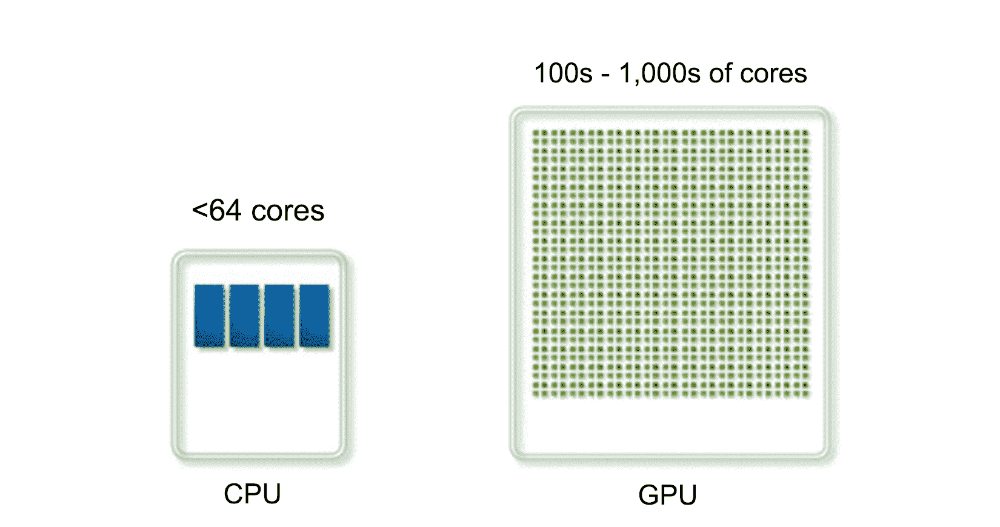
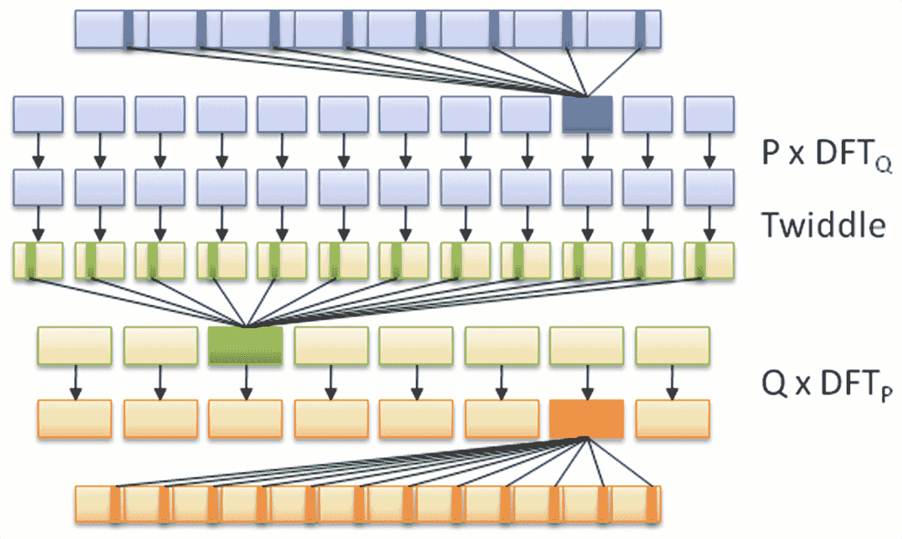
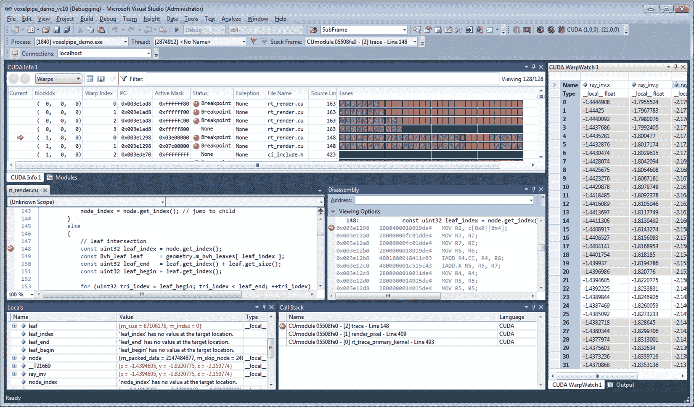

# 图形处理器多线程

最近的发展是将显卡用于通用计算。例如，使用 CUDA 和 OpenCL 等框架，可以加快医疗、军事和科学应用中大型数据集的并行处理。在本章中，我们将了解如何使用 C++和 OpenCL 来实现这一点，以及如何在 C++中将这样的特性集成到多线程应用中。

本章的主题包括:

*   将 OpenCL 集成到基于 C++的应用中
*   以多线程方式使用 OpenCL 的挑战
*   延迟和调度对多线程性能的影响

# 图形处理器处理模型

在[第 9 章](09.html)、*分布式计算的多线程*中，我们研究了在集群系统中的多个计算节点上运行相同的任务。这种设置的主要目标是以高度并行的方式处理数据，理论上相对于具有更少 CPU 内核的单个系统来说加快了所述处理。

**GPU**(**图形处理单元上的通用计算**)在某些方面与此类似，但有一个主要区别:虽然只有常规 CPU 的计算集群擅长标量任务——这意味着在单个数据集上执行一个任务(SISD)——GPU 是擅长 SIMD(单输入、多数据)任务的矢量处理器。

本质上，这意味着可以将一个大数据集连同单个任务描述一起发送到 GPU，GPU 将在其数百或数千个内核上对该数据的部分并行执行相同的任务。因此，我们可以将图形处理器视为一种非常特殊的集群:



# 履行

当图形处理器的概念第一次被提出时(大约在 2001 年)，编写图形处理器程序最常见的方法是使用 GLSL (OpenGL 着色语言)和类似的着色语言。由于这些着色器语言已经瞄准了 SIMD 任务(图像和场景数据)的处理，因此将它们调整为更通用的任务相当简单。

从那时起，出现了许多更专业的实现:

| **名称** | **自**起 | **车主** | **注释** |
| 库达 | Two thousand and six | NVidia | 这是专有的，只在 NVidia 图形处理器上运行 |
| 接近金属 | Two thousand and six | ATi/AMD | 这被 OpenCL 放弃了 |
| DirectCompute | Two thousand and eight | 微软 | 这是与 DX11 一起发布的，运行在 DX10 GPUs 上，并且仅限于 Windows 平台 |
| OpenCL(打开 CL) | Two thousand and nine | Khronos 集团 | 这是一个开放标准，适用于所有主流平台以及移动平台上的 AMD、英特尔和 NVidia GPUs |

# OpenCL(打开 CL)

在目前各种图形处理器实现中，由于没有限制，OpenCL 是迄今为止最有趣的图形处理器应用编程接口。它几乎适用于所有主流图形处理器和平台，甚至在特定的移动平台上也能获得支持。

OpenCL 的另一个显著特点是它也不仅限于 GPU。作为其名称(开放计算语言)的一部分，它将一个系统抽象成所谓的*计算设备*，每个设备都有自己的功能。GPU 是最常见的应用，但是这个特性使得首先在 CPU 上测试实现变得相当容易，以便于调试。

OpenCL 的一个可能的缺点是，它对内存和硬件细节采用了高度抽象，这可能会对性能产生负面影响，即使它增加了代码的可移植性。

在本章的剩余部分，我们将关注 OpenCL。

# 常见的 OpenCL 应用

许多程序结合了基于 OpenCL 的代码，以加快操作速度。这些项目包括图形处理，以及三维建模和计算机辅助设计，音频和视频处理。一些例子是:

*   Adobe Photoshop 中
*   GIMP
*   ImageMagick
*   欧特克玛雅
*   搅拌机
*   手闸
*   拉斯维加斯专业版
*   OpenCV
*   Libav
*   最终切割专业版
*   芬佩格

在包括 LibreOffice Calc 和微软 Excel 在内的办公应用中，可以发现某些操作的进一步加速。

也许更重要的是，OpenCL 也常用于科学计算和密码学，包括 BOINC 和 GROMACS 以及许多其他库和程序。

# OpenCL 版本

自 2008 年 12 月 8 日 OpenCL 规范发布以来，到目前为止已经进行了五次更新，使其达到了 2.2 版本。接下来将提到这些版本的重要变化。

# OpenCL 1.0 版

第一次公开发布是苹果在 2009 年 8 月 28 日发布的 macOS X 雪豹版本的一部分。

与此同时，AMD 宣布将支持 OpenCL，并退役自己的 Close to Metal (CtM)框架。NVidia、RapidMind 和 IBM 也在自己的框架中增加了对 OpenCL 的支持。

# OpenCL 1.1 版

OpenCL 1.1 规范于 2010 年 6 月 14 日获得了 Khronos 集团的批准。它为并行编程和性能增加了额外的功能，包括:

*   新的数据类型包括三分量矢量和附加图像格式
*   处理来自多个主机线程的命令，并处理跨多个设备的缓冲区
*   对缓冲区区域的操作，包括读取、写入和复制 1D、2D 或三维矩形区域
*   增强使用事件来驱动和控制命令执行
*   额外的 OpenCL 内置 C 函数，如整数箝位、洗牌和异步步进(不连续，但数据之间有间隙)拷贝
*   通过链接 OpenCL 和 OpenGL 事件，高效共享图像和缓冲区，提高 OpenGL 互操作性

# OpenCL 1.2 版

OpenCL 1.2 版本于 2011 年 11 月 15 日发布。其最重要的特点包括以下几点:

*   **设备分区:**这使应用能够将设备划分为子设备，以直接控制对特定计算单元的工作分配，保留设备的一部分用于高优先级/延迟敏感任务，或者有效地使用共享硬件资源，如缓存。
*   **对象的单独编译和链接**:这提供了传统编译器的能力和灵活性，使得能够创建 OpenCL 程序库供其他程序链接。
*   **增强的图像支持**:这个 **i** 包括对 1D 图像和 1D & 2D 图像阵列的支持。此外，OpenGL 共享扩展现在支持从 OpenGL 1D 纹理和 1D & 2D 纹理阵列创建 OpenCL 图像。

*   **内置内核:**这代表了专用或不可编程硬件和相关固件(如视频编码器/解码器和数字信号处理器)的能力，使这些定制设备能够从 OpenCL 框架中驱动并与之紧密集成。
*   **DX9 媒体表面共享**:这实现了 OpenCL 和 DirectX 9 或 DXVA 媒体表面之间的高效共享。
*   **DX11 曲面共享**:用于 OpenCL 和 DirectX 11 曲面之间的无缝共享。

# OpenCL 2.0 版

OpenCL2.0 版本于 2013 年 11 月 18 日发布。此版本有以下重大更改或增加:

*   **共享虚拟内存**:主机和设备内核可以直接共享复杂的、包含指针的数据结构，如树和链表，提供了显著的编程灵活性，并消除了主机和设备之间昂贵的数据传输。
*   **动态并行**:设备内核可以在没有主机交互的情况下将内核入队到同一个设备，实现了灵活的工作调度范例，避免了在设备和主机之间传输执行控制和数据的需要，通常会显著卸载主机处理器瓶颈。
*   **通用地址空间**:函数可以在不为参数指定命名地址空间的情况下编写，尤其是对于那些声明为指向类型的指针的参数非常有用，无需为应用中使用的每个命名地址空间编写多个函数。
*   **图像**:改进的图像支持，包括 sRGB 图像和 3D 图像写入，内核读取和写入同一图像的能力，以及从 mip 映射或多采样 OpenGL 纹理创建 OpenCL 图像，以改进 OpenGL 互操作。
*   **C11 原子**:C11 原子和同步操作的子集，使一个工作项中的分配对一个工作组中的其他工作项可见，跨在设备上执行的工作组可见，或者用于在 OpenCL 设备和主机之间共享数据。
*   **Pipes** : Pipes 是存储组织为 FIFO 的数据的内存对象，OpenCL 2.0 为内核提供了从 Pipes 读取或向 Pipes 写入的内置函数，提供了可以由 OpenCL 实现者高度优化的 Pipes 数据结构的直接编程。
*   **安卓可安装客户端驱动扩展**:支持 OpenCL 实现在安卓系统上作为共享对象被发现和加载。

# OpenCL 2.1 版

OpenCL 2.1 对 2.0 标准的修订版于 2015 年 11 月 16 日发布。这个版本最值得注意的是 OpenCL C++内核语言的引入，比如 OpenCL 语言最初是如何基于带有扩展的 C 的，C++版本是基于 C++14 的子集，向后兼容 C 内核语言。

OpenCL 应用编程接口的更新包括以下内容:

*   **子组**:这些实现了硬件线程的更精细的控制，现在在核心中，与附加的子组查询操作一起增加了灵活性
*   **内核对象和状态的复制** : clCloneKernel 支持内核对象和状态的复制，以便在包装类中安全地实现复制构造函数
*   **低延迟设备定时器查询**:这些允许在设备和主机代码之间对齐分析数据
*   **运行时的中间 SPIR-伏代码**:
    *   LLVM 到 SPIR-V 之间的双向翻译器，支持在工具链中灵活使用两种中间语言。
    *   一个 OpenCL C 到 LLVM 编译器，通过上面的翻译器生成 SPIR-V。
    *   一个 SPIR-V 汇编器和反汇编器。

标准可移植中间表示(SPIR)及其后继版本 SPIR-V 是一种提供跨 OpenCL 设备使用的独立于设备的二进制文件的方法。

# OpenCL 2.2 版

2017 年 5 月 16 日，也就是现在的 OpenCL 版本发布了。根据 Khronos 集团的说法，它包括以下变化:

*   OpenCL 2.2 将 OpenCL C++内核语言引入了核心规范，显著提高了并行编程的效率
*   OpenCL C++内核语言是 C++14 标准的静态子集，包括类、模板、Lambda 表达式、函数重载以及许多其他用于泛型和元编程的构造
*   利用新的 Khronos SPIR-V 1.1 中间语言，该语言完全支持 OpenCL C++内核语言
*   OpenCL 库函数现在可以利用 C++语言，在访问诸如原子、迭代器、图像、采样器、管道和设备队列内置类型和地址空间等特性时，提供更高的安全性并减少未定义的行为
*   管道存储是 OpenCL 2.2 中的一种新的设备端类型，通过在编译时使连接大小和类型已知，并在内核之间实现高效的设备范围通信，对 FPGA 实现非常有用
*   OpenCL 2.2 还包括增强生成代码优化的特性:应用可以在 SPIR-V 编译时提供专门化常量的值，新的查询可以检测程序范围全局对象的非平凡构造函数和析构函数，用户回调可以在程序发布时设置
*   在任何支持 OpenCL 2.0 的硬件上运行(仅需要驱动程序更新)

# 建立开发环境

不管你有哪种平台和 GPU，做 OpenCL 开发最重要的部分是从制造商那里获得一个人的 GPU 的 OpenCL 运行时。在这里，AMD、英特尔和 NVidia 都为所有主流平台提供了一个 SDK。对于 NVidia，OpenCL 支持包含在 CUDA SDK 中。

除了图形处理器供应商的软件开发工具包，人们还可以在他们的网站上找到这个软件开发工具包支持哪些图形处理器的详细信息。

# Linux 操作系统

在使用提供的说明安装了供应商的 GPU SDK 之后，我们仍然需要下载 OpenCL 头。与供应商提供的共享库和运行时文件不同，这些头文件是通用的，将适用于任何 OpenCL 实现。

对于基于 Debian 的发行版，只需执行以下命令行:

```cpp
    $ sudo apt-get install opencl-headers

```

对于其他发行版，包可能被称为相同的，或不同的东西。关于如何找到软件包名称，请查阅手册的发行版。

在安装了 SDK 和 OpenCL 头之后，我们准备编译我们的第一个 OpenCL 应用。

# Windows 操作系统

在 Windows 上，我们可以选择用 Visual Studio (Visual C++)开发还是用 GCC (MinGW)的 Windows 端口开发。为了与 Linux 版本保持一致，我们将使用 MinGW 和 MSYS2。这意味着我们将拥有相同的编译器工具链、相同的 Bash shell 和实用程序，以及 Pacman 包管理器。

如前所述，安装供应商的 GPU SDK 后，只需在 MSYS2 shell 中执行以下命令行，即可安装 OpenCL 头:

```cpp
    $ pacman -S mingw64/mingw-w64-x86_64-opencl-headers

```

或者，在使用 32 位版本的 MinGW 时，执行以下命令行:

```cpp
    mingw32/mingw-w64-i686-opencl-headers 

```

有了这个，OpenCL 头就就位了。我们现在只需要确保 MinGW 链接器可以找到 OpenCL 库。使用 NVidia CUDA SDK，您可以为此使用`CUDA_PATH`环境变量，或者浏览 SDK 的安装位置，并将相应的 OpenCL LIB 文件从那里复制到 MinGW lib 文件夹，确保不要混合 32 位和 64 位文件。

现在共享库也就位了，我们可以编译 OpenCL 应用。

# X/MacOS

从 OS X 10.7 开始，操作系统提供了一个 OpenCL 运行时。在为开发头和库安装了 XCode 之后，可以立即开始 OpenCL 开发。

# 一个基本的 OpenCL 应用

图形处理器应用的一个常见例子是计算快速傅立叶变换。这种算法通常用于音频处理等，允许您从时域转换到频域进行分析。

它所做的是对数据集应用分治法，以便计算离散傅立叶变换。它通过将输入序列分成固定的、少量的更小的子序列，计算它们的离散傅立叶变换，并组合这些输出来组成最终的序列。

这是相当先进的数学，但可以说，它之所以对 GPU 如此理想，是因为它是一种高度并行的算法，采用数据细分来加快离散傅立叶变换的计算，如下图所示:



每个 OpenCL 应用至少由两部分组成:设置和配置 OpenCL 实例的 C++代码，以及实际的 OpenCL 代码，也称为内核，例如基于维基百科 FFT 演示示例的代码:

```cpp
// This kernel computes FFT of length 1024\.  
// The 1024 length FFT is decomposed into calls to a radix 16 function,  
// another radix 16 function and then a radix 4 function
 __kernel void fft1D_1024 (__global float2 *in,  
                     __global float2 *out,  
                     __local float *sMemx,  
                     __local float *sMemy) {
          int tid = get_local_id(0);
          int blockIdx = get_group_id(0) * 1024 + tid;
          float2 data[16];

          // starting index of data to/from global memory
          in = in + blockIdx;  out = out + blockIdx;

          globalLoads(data, in, 64); // coalesced global reads
          fftRadix16Pass(data);      // in-place radix-16 pass
          twiddleFactorMul(data, tid, 1024, 0);

          // local shuffle using local memory
          localShuffle(data, sMemx, sMemy, tid, (((tid & 15) * 65) + (tid >> 4)));
          fftRadix16Pass(data);               // in-place radix-16 pass
          twiddleFactorMul(data, tid, 64, 4); // twiddle factor multiplication

          localShuffle(data, sMemx, sMemy, tid, (((tid >> 4) * 64) + (tid & 15)));

          // four radix-4 function calls
          fftRadix4Pass(data);      // radix-4 function number 1
          fftRadix4Pass(data + 4);  // radix-4 function number 2
          fftRadix4Pass(data + 8);  // radix-4 function number 3
          fftRadix4Pass(data + 12); // radix-4 function number 4

          // coalesced global writes
    globalStores(data, out, 64);
 } 

```

这个 OpenCL 内核表明，像 GLSL 着色器语言一样，OpenCL 的内核语言本质上是带有许多扩展的 C 语言。虽然可以使用 OpenCL C++内核语言，但这种语言仅在 OpenCL 2.1 (2015)之后才可用，因此，对它的支持和示例不如 C 内核语言常见。

接下来是 C++应用，使用它，我们运行前面的 OpenCL 内核:

```cpp
#include <cstdio>
 #include <ctime>
 #include "CL\opencl.h"

 #define NUM_ENTRIES 1024

 int main() { // (int argc, const char * argv[]) {
    const char* KernelSource = "fft1D_1024_kernel_src.cl"; 

```

正如我们在这里看到的，只有一个头，我们必须包括在内，以获得对 OpenCL 函数的访问。我们还指定了包含 OpenCL 内核源代码的文件名。由于每个 OpenCL 设备可能是不同的体系结构，因此当我们加载目标设备时，会为其编译内核:

```cpp
          const cl_uint num = 1;
    clGetDeviceIDs(0, CL_DEVICE_TYPE_GPU, 0, 0, (cl_uint*) num); 

   cl_device_id devices[1];
    clGetDeviceIDs(0, CL_DEVICE_TYPE_GPU, num, devices, 0);

```

接下来，我们必须获得一个我们可以使用的 OpenCL 设备列表，通过 GPU 对其进行过滤:

```cpp
    cl_context context = clCreateContextFromType(0, CL_DEVICE_TYPE_GPU,  
                                                   0, 0, 0); 

```

然后，我们使用找到的图形处理器设备创建一个 OpenCL `context`。上下文管理一系列设备上的资源:

```cpp
    clGetDeviceIDs(0, CL_DEVICE_TYPE_DEFAULT, 1, devices, 0);
    cl_command_queue queue = clCreateCommandQueue(context, devices[0], 0, 0); 

```

最后，我们将创建命令队列，其中包含要在 OpenCL 设备上执行的命令:

```cpp
    cl_mem memobjs[] = { clCreateBuffer(context, CL_MEM_READ_ONLY | CL_MEM_COPY_HOST_PTR, sizeof(float) * 2 * NUM_ENTRIES, 0, 0),              
   clCreateBuffer(context, CL_MEM_READ_WRITE, sizeof(float) * 2 * NUM_ENTRIES, 0, 0) }; 

```

为了与设备通信，我们需要分配缓冲区对象，这些对象将包含我们将复制到其内存中的数据。这里，我们将分配两个缓冲区，一个用于读取，一个用于写入:

```cpp
    cl_program program = clCreateProgramWithSource(context, 1, (const char **)& KernelSource, 0, 0); 

```

我们现在已经获得了设备上的数据，但是仍然需要在设备上加载内核。为此，我们将使用前面介绍的 OpenCL 内核源代码，使用前面定义的文件名来创建一个内核:

```cpp
    clBuildProgram(program, 0, 0, 0, 0, 0); 

```

接下来，我们将如下编译源代码:

```cpp
   cl_kernel kernel = clCreateKernel(program, "fft1D_1024", 0); 

```

最后，我们将根据我们创建的二进制文件创建实际的内核:

```cpp
    size_t local_work_size[1] = { 256 };

    clSetKernelArg(kernel, 0, sizeof(cl_mem), (void *) &memobjs[0]);
    clSetKernelArg(kernel, 1, sizeof(cl_mem), (void *) &memobjs[1]);
    clSetKernelArg(kernel, 2, sizeof(float) * (local_work_size[0] + 1) * 16, 0);
    clSetKernelArg(kernel, 3, sizeof(float) * (local_work_size[0] + 1) * 16, 0); 

```

为了将参数传递给我们的内核，我们必须在这里设置它们。在这里，我们将添加指向缓冲区和工作大小维度的指针，如下所示:

```cpp
    size_t global_work_size[1] = { 256 };
          global_work_size[0] = NUM_ENTRIES;
    local_work_size[0]  =  64;  // Nvidia: 192 or 256
    clEnqueueNDRangeKernel(queue, kernel, 1, 0, global_work_size, local_work_size, 0, 0, 0); 

```

现在我们可以设置工作项维度并执行内核。在这里，我们将使用内核执行方法来定义工作组的大小:

```cpp
          cl_mem C = clCreateBuffer(context, CL_MEM_WRITE_ONLY, (size), 0, &ret);
                      cl_int ret = clEnqueueReadBuffer(queue, memobjs[1], CL_TRUE, 0, sizeof(float) * 2 * NUM_ENTRIES, C, 0, 0, 0); 

```

在执行内核之后，我们希望读回结果信息。为此，我们告诉 OpenCL 将我们作为内核参数传递的已分配写缓冲区复制到新分配的缓冲区中。我们现在可以自由使用这个缓冲区中我们认为合适的数据。

但是，在本例中，我们将不使用以下数据:

```cpp
    clReleaseMemObject(memobjs[0]);
    clReleaseMemObject(memobjs[1]); 
   clReleaseCommandQueue(queue); 
   clReleaseKernel(kernel); 
   clReleaseProgram(program); 
   clReleaseContext(context); 
   free(C);
 } 

```

最后，我们释放分配的资源并退出。

# 图形处理器内存管理

当使用一个中央处理器时，必须处理许多内存层次结构，以主内存(最慢)、中央处理器缓存(较快)和中央处理器寄存器(最快)的形式。图形处理器也是如此，因为一个人必须处理一个内存层次，这个层次会极大地影响应用的速度。

在图形处理器上最快的也是寄存器(或私有)内存，我们比一般的中央处理器多一点。在此之后，我们获得本地内存，这是一个由多个处理元素共享的内存。GPU 本身最慢的是内存数据缓存，也叫纹理内存。这是卡上的内存，通常被称为视频随机存取存储器(VRAM)，使用高带宽但相对高延迟的内存，如 GDDR5。

绝对最慢的是使用主机系统的内存(系统内存)，因为这必须通过 PCIe 总线和各种其他子系统来传输任何数据。相对于设备上的存储系统，主机设备之间的通信最好称为“冰川”。

对于 AMD、Nvidia 和类似的专用 GPU 设备，内存架构可以这样可视化:


由于这种内存布局，建议在大块中传输任何数据，如果可能，使用异步传输。理想情况下，内核将在 GPU 内核上运行，并让数据流向它，以避免任何延迟。

# 图形处理器和多线程

将多线程代码与图形处理器相结合比试图管理运行在 MPI 集群上的并行应用要容易得多。这主要是由于以下工作流程:

1.  准备数据:通过将数据发送到图形处理器的内存中，准备好我们要处理的数据，例如一大组图像或单个大图像。
2.  准备内核:加载 OpenCL 内核文件，编译成 OpenCL 内核。
3.  执行内核:将内核发送到 GPU，指示其开始处理数据。
4.  读取数据:一旦我们知道处理已经完成，或者达到了一个特定的中间状态，我们将读取一个缓冲区，作为一个参数传递给 OpenCL 内核，以便获得我们的结果。

由于这是一个异步进程，我们可以将它视为一个“一劳永逸”的操作，只需要一个线程来监控活动内核的进程。

多线程和 GPU 应用方面的最大挑战不在于基于主机的应用，而在于 GPU 内核或运行在 GPU 上的着色器程序，因为它必须协调本地和远程处理单元之间的内存管理和处理，根据数据类型确定使用哪些内存系统，而不会在处理的其他地方造成问题。

这是一个微妙的过程，涉及大量的试错、剖析和优化。一次内存拷贝优化或使用异步操作代替同步操作可能会将处理时间从几个小时缩短到几个小时。对内存系统的良好理解对于防止数据匮乏和类似问题至关重要。

由于 GPU 通常用于加速持续时间较长的任务(几分钟到几小时或更长)，因此从多线程的角度来看，它可能最好被视为一个普通的工作线程，尽管有一些重要的复杂性，主要是延迟。

# 潜伏

正如我们在前面关于图形处理器内存管理的部分中提到的，最好首先使用最靠近图形处理器处理单元的内存，因为它们是最快的。这里的“最快”主要意味着它们的延迟更少，这意味着从内存请求信息和接收响应所需的时间。

每个 GPU 的确切延迟会有所不同，但例如，对于英伟达的开普勒(特斯拉 K20)架构，可以预期延迟为:

*   **全局**内存:450 周期。
*   **常量**内存缓存:45–125 个周期。
*   **本地** ( **共享**)内存:45 周期。

这些测量都是在 CPU 本身。对于 PCIe 总线，一旦开始传输几兆字节的缓冲区，每次传输就需要几毫秒的时间。例如，用千兆字节大小的缓冲区填充图形处理器的内存可能需要相当长的时间。

对于 PCIe 总线上的简单往返，可以测量以微秒为单位的延迟，对于运行在 1+ GHz 的 GPU 内核来说，这似乎是永恒的。这基本上定义了为什么主机和 GPU 之间的通信应该是绝对最小和高度优化的。

# 潜在问题

GPU 应用的一个常见错误是在处理完成之前读取结果缓冲区。在将缓冲区转移到设备并执行内核之后，必须插入同步点来通知主机它已经完成了处理。这些通常应该使用异步方法来实现。

正如我们在延迟部分所述，重要的是要记住请求和响应之间潜在的巨大延迟，这取决于内存子系统或总线。如果做不到这一点，可能会导致奇怪的故障，冻结和崩溃，以及数据损坏和一个似乎永远等待的应用。

对一个图形处理器应用进行分析是至关重要的，这样才能很好地了解图形处理器的利用率，以及处理流程是否接近最佳。

# 调试图形处理器应用

GPU 应用的最大挑战是调试内核。因为这个原因，CUDA 附带了一个模拟器，允许在 CPU 上运行和调试内核。OpenCL 允许在 CPU 上运行内核而无需修改，尽管这可能不会获得与在特定 GPU 设备上运行时完全相同的行为(和 bug)。

一种稍微高级一点的方法是使用一个专用调试器，比如英伟达的 Nsight，它有两个版本，分别是 Visual Studio 版本([https://developer . Nvidia . com/Nvidia-Nsight-Visual Studio-edition](https://developer.nvidia.com/nvidia-nsight-visual-studio-edition))和 Eclipse 版本([https://developer.nvidia.com/nsight-eclipse-edition 版本](https://developer.nvidia.com/nsight-eclipse-edition))。

根据 Nsight 网站上的营销简介:

NVIDIA Nsight Visual Studio Edition brings GPU computing into Microsoft Visual Studio (including multiple instances of VS2017). This application development environment for GPUs allows you to build, debug, profile and trace heterogeneous compute, graphics, and virtual reality applications built with CUDA C/C++, OpenCL, DirectCompute, Direct3D, Vulkan API, OpenGL, OpenVR, and the Oculus SDK.

以下屏幕截图显示了一个活动的 CUDA 调试会话:



这种调试器工具的一大优势是，它允许人们通过识别瓶颈和潜在问题来监控、分析和优化自己的 GPU 应用。

# 摘要

在这一章中，我们研究了如何以 OpenCL 的形式将 GPU 处理集成到 C++应用中。我们还研究了 GPU 内存层次结构，以及这如何影响性能，尤其是在主机设备通信方面。

现在，您应该熟悉 GPU 的实现和概念，以及如何创建一个 OpenCL 应用，以及如何编译和运行它。如何避免常见错误也要知道。

由于这是这本书的最后一章，希望所有的主要问题都已经得到回答，前面的几章以及这一章在某种程度上提供了信息和帮助。

从这本书开始，读者可能会对更详细的主题感兴趣，这方面的许多资源在线上和线下都有。多线程和相关领域的主题非常广泛，涉及许多应用，从商业到科学、艺术和个人应用

读者可能想建立一个自己的贝奥武夫集群，或者专注于图形处理器，或者两者结合。也许有一个复杂的应用，他们已经想写了一段时间，或者只是享受编程的乐趣。