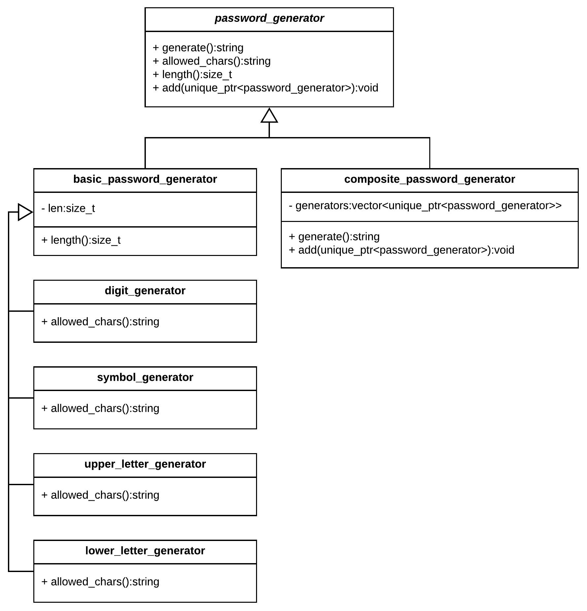
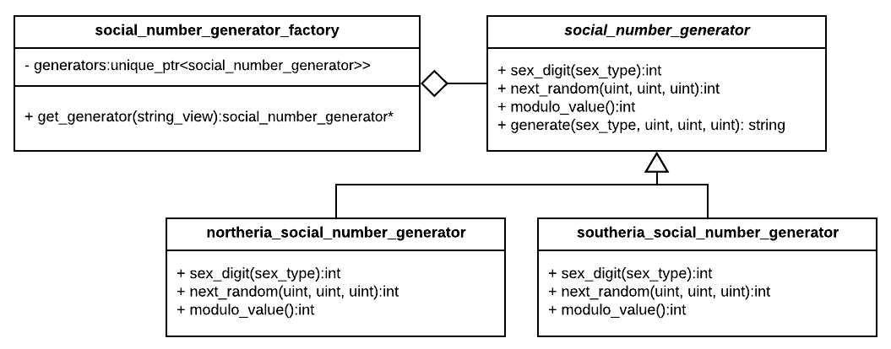
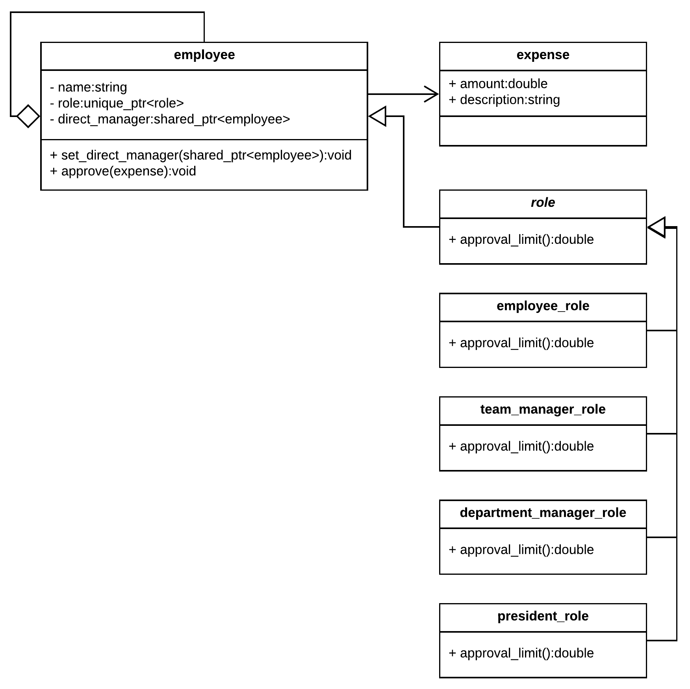
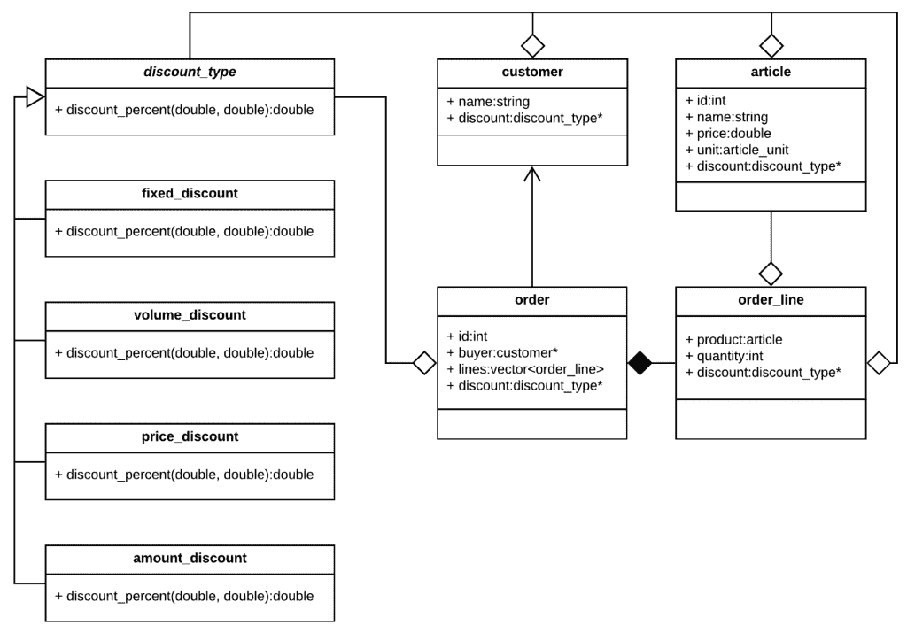

# 八、设计模式

# 问题

# 67.验证密码

编写一个程序，根据预定义的规则验证密码强度，然后可以选择各种组合。至少，每个密码都必须满足最小长度要求。此外，还可以实施其他规则，例如至少存在一个符号、数字、大写和小写字母等。

# 68.生成随机密码

编写一个程序，可以根据一些预定义的规则生成随机密码。每个密码必须具有可配置的最小长度。此外，应该可以在生成规则中包括至少一个数字、符号、小写或大写字符等。这些附加规则必须是可配置和可组合的。

# 69.生成社会保障号码

编写一个程序，可以为两个国家生成社会保障号码，这两个国家的号码具有不同但相似的格式:

*   在 Northeria，数字的格式为`SYYYYMMDDNNNNNC`，其中`S`是代表性别的数字，女性为 9，男性为 7，`YYYYMMDD`是出生日期，`NNNNN`是一个五位数的随机数，一天唯一(意味着同一个数字可以在两个不同的日期出现两次，但不是同一个日期)，`C`是一个选择的数字，因此后面描述的计算校验和是 11 的倍数。
*   在南方，数字的格式为`SYYYYMMDDNNNNC`，其中`S`是代表性别的数字，1 代表女性，2 代表男性，`YYYYMMDD`是出生日期，`NNNN`是一个四位数的随机数，一天唯一，`C`是一个数字，因此如下所述计算的校验和是 10 的倍数。

两种情况下的校验和都是所有数字的总和，每个数字乘以其权重(从最高有效数字到最低有效数字的位置)。例如，南方数字 12017120134895 的校验和计算如下:

```cpp
crc = 14*1 + 13*2 + 12*0 + 11*1 + 10*7 + 9*1 + 8*2 + 7*0 + 6*1 + 5*3 
           +  4*4 +  3*8 +  2*9 +  1*5
    = 230 = 23 * 10
```

# 70.审批制度

为公司的采购部门编写一个程序，允许员工批准新的采购(或费用)。但是，根据他们的职位，每个员工只能批准不超过预定义限额的费用。例如，正式员工最多可以批准 1000 个货币单位的费用，团队经理最多可以批准 10000 个，部门经理最多可以批准 100000 个。任何超过这个数额的费用都必须得到公司总裁的明确批准。

# 71.可观测向量容器

编写一个行为类似于向量的类模板，但是可以通知注册方内部状态的变化。该类必须至少提供以下操作:

*   用于创建类的新实例的各种构造函数
*   `operator=`给容器赋值
*   `push_back()`在容器的末尾添加新元素
*   `pop_back()`从容器中取出最后一个元素
*   `clear()`从容器中取出所有元素
*   `size()`返回容器中元素的数量
*   `empty()`指示容器是空的还是有元素

`operator=`、`push_back()`、`pop_back()`和`clear()`必须将状态变化通知其他人。通知应包括更改的类型，以及在这种情况下，已更改元素的索引(如添加或删除)。

# 72.计算有折扣的订单价格

零售商店出售各种商品，可以为选定的顾客、商品或每笔订单提供各种类型的折扣。可以获得以下类型的折扣:

*   固定折扣，如 5%，与购买的商品或数量无关。
*   当购买超过特定数量的商品时，每件商品的数量折扣，如 10%。
*   商品总订单的价格折扣，即当顾客购买一定数量的商品，使总成本超过特定金额时，商品的折扣。例如，当一件商品的总成本超过 100 美元时，可以享受 15%的折扣。如果物品售价 5 美元，客户购买 30 台，总成本为 150 美元；因此，15%的折扣适用于该商品的订单。
*   整个订单的价格折扣(无论订购了什么商品和数量)。

编写一个程序，可以计算特定订单的最终价格。可以用不同的方法计算最终价格；例如，所有折扣都可以是累积的，或者另一方面，如果一件商品有折扣，则可能不考虑顾客折扣或总订单折扣。

# 解决方法

# 67.验证密码

这里描述的问题是*装饰器*模式的典型案例。这种设计模式允许在不影响其他同类型对象的情况下向对象添加行为。这是通过将一个对象包装在另一个对象中来实现的。多个装饰器可以堆叠在一起，每次都添加新的功能。在我们的例子中，该功能将验证给定的密码是否满足特定的要求。

下面的类图描述了验证密码的模式:


如图所示，该模式的实现如下:

```cpp

class password_validator
{
public:
   virtual bool validate(std::string_view password) = 0;
   virtual ~password_validator() {}
};

class length_validator final : public password_validator
{
public:
   length_validator(unsigned int min_length): length(min_length)
   {}

   virtual bool validate(std::string_view password) override
   {
      return password.length() >= length;
   }

private:
   unsigned int length;
};

class password_validator_decorator : public password_validator
{
public:
   explicit password_validator_decorator(
      std::unique_ptr<password_validator> validator):
         inner(std::move(validator))
   {
   }

   virtual bool validate(std::string_view password) override
   {
      return inner->validate(password);
   }

private:
   std::unique_ptr<password_validator> inner;
};

class digit_password_validator final : public password_validator_decorator
{
public:
   explicit digit_password_validator(
      std::unique_ptr<password_validator> validator):
         password_validator_decorator(std::move(validator))
   {
   }

   virtual bool validate(std::string_view password) override
   {
      if(!password_validator_decorator::validate(password))
         return false;

      return password.find_first_of("0123456789") != std::string::npos;
   }
};

class case_password_validator final : public password_validator_decorator
{
public:
   explicit case_password_validator(
      std::unique_ptr<password_validator> validator):
         password_validator_decorator(std::move(validator))
   {
   }

   virtual bool validate(std::string_view password) override
   {
      if(!password_validator_decorator::validate(password))
         return false;

      bool haslower = false;
      bool hasupper = false;

      for(size_t i = 0; i < password.length() && !(hasupper && haslower); 
         ++ i)
      {
         if(islower(password[i])) haslower = true;
         else if(isupper(password[i])) hasupper = true;
      }

      return haslower && hasupper;
   }
};

class symbol_password_validator final : public password_validator_decorator
{
public:
   explicit symbol_password_validator(
      std::unique_ptr<password_validator> validator):
         password_validator_decorator(std::move(validator))
   {
   }

   virtual bool validate(std::string_view password) override
   {
      if(!password_validator_decorator::validate(password))
         return false;

      return password.find_first_of("!@#$%^&*(){}[]?<>") != 
         std::string::npos;
   }
};
```

`password_validator`是基类，有一个名为`validate()`的虚拟方法，带有一个表示密码的字符串参数。`length_validator`就是从这个类派生出来的，实现了最短长度的强制密码要求。

`password_validator_decorator`也来源于`password_validator`，包含一个内部的`password_validator`成分。它的`validate()`实现只是决定调用`inner->validate()`。其他类`digit_password_validator`、`symbol_password_validator`、`case_password_validator`都是从它派生出来的，实现了其他个人密码强度要求。

以下是如何组成这些类来创建各种密码验证器的示例:

```cpp
int main()
{
   auto validator1 = std::make_unique<digit_password_validator>(
      std::make_unique<length_validator>(8));

   assert(validator1->validate("abc123!@#"));
   assert(!validator1->validate("abcde!@#"));

   auto validator2 = 
      std::make_unique<symbol_password_validator>(
         std::make_unique<case_password_validator>(
            std::make_unique<digit_password_validator>(
               std::make_unique<length_validator>(8))));

   assert(validator2->validate("Abc123!@#"));
   assert(!validator2->validate("Abc123567"));
}
```

# 68.生成随机密码

这个问题可以通过使用*复合*图案或该图案的变体来解决。这种设计模式将对象组成树层次结构，并允许以处理相同类型的单个对象的相同方式来处理对象组(或树)。下面的类图显示了可用于生成密码的类的层次结构:



`password_generator`是基类，有几个虚方法:`generate()`返回一个新的随机字符串，`length()`指定它生成的字符串的长度，`allowed_chars()`返回一个包含它用于生成密码的所有字符的字符串，`add()`向复合生成器添加一个新的子组件。`basic_password_generator`是从这个基类派生出来的，定义了一个最小长度的生成器。`digit_generator`、`symbol_generator`、`upper_letter_generator`和`lower_letter_generator`源自`basic_password_generator`并覆盖`allowed_chars()`以定义用于生成随机文本的字符子集。

`composite_password_generator`也是从`password_generator`派生出来的，它有一个`password_generator`对象的集合，用来组成一个随机的文本。这是在被覆盖的`generate()`方法中完成的，该方法将子组件生成的所有字符串连接起来，然后对它们进行随机混洗，生成代表密码的最终字符串:

```cpp
class password_generator
{
public:
   virtual std::string generate() = 0;

   virtual std::string allowed_chars() const = 0;
   virtual size_t length() const = 0;

   virtual void add(std::unique_ptr<password_generator> generator) = 0;

   virtual ~password_generator(){}
};

class basic_password_generator : public password_generator
{
   size_t len;
public:
   explicit basic_password_generator(size_t const len) noexcept : len(len) 
   {}

   virtual std::string generate() override
   { throw std::runtime_error("not implemented"); }

   virtual void add(std::unique_ptr<password_generator>) override
   { throw std::runtime_error("not implemented"); }

   virtual size_t length() const override final
   {return len;}
};

class digit_generator : public basic_password_generator
{
public:
   explicit digit_generator(size_t const len) noexcept
   : basic_password_generator(len) {}

   virtual std::string allowed_chars() const override
   {return "0123456789";}
};

class symbol_generator : public basic_password_generator
{
public:
   explicit symbol_generator(size_t const len) noexcept
   : basic_password_generator(len) {}

   virtual std::string allowed_chars() const override
   {return "!@#$%^&*(){}[]?<>";}
};

class upper_letter_generator : public basic_password_generator
{
public:
   explicit upper_letter_generator(size_t const len) noexcept
   : basic_password_generator(len) {}

   virtual std::string allowed_chars() const override
   {return "ABCDEFGHIJKLMNOPQRSTUVXYWZ";}
};

class lower_letter_generator : public basic_password_generator
{
public:
   explicit lower_letter_generator(size_t const len) noexcept
   : basic_password_generator(len) {}

   virtual std::string allowed_chars() const override
   {return "abcdefghijklmnopqrstuvxywz";}
};

class composite_password_generator : public password_generator
{
   virtual std::string allowed_chars() const override
   { throw std::runtime_error("not implemented"); };
   virtual size_t length() const override
   { throw std::runtime_error("not implemented"); };
public:
   composite_password_generator()
   {
      auto seed_data = std::array<int, std::mt19937::state_size> {};
      std::generate(std::begin(seed_data), std::end(seed_data), 
                    std::ref(rd));
      std::seed_seq seq(std::begin(seed_data), std::end(seed_data));
      eng.seed(seq);
   }

   virtual std::string generate() override
   {
      std::string password;
      for(auto & generator : generators)
      {
         std::string chars = generator->allowed_chars();
         std::uniform_int_distribution<> ud(
            0, static_cast<int>(chars.length() - 1));

         for(size_t i = 0; i < generator->length(); ++ i)
            password += chars[ud(eng)];
      }

      std::shuffle(std::begin(password), std::end(password), eng);

      return password;
   }

   virtual void add(std::unique_ptr<password_generator> generator) override
   {
      generators.push_back(std::move(generator));
   }

private:
   std::random_device rd;
   std::mt19937 eng;
   std::vector<std::unique_ptr<password_generator>> generators;
};
```

上述代码可用于以下列方式生成密码:

```cpp
int main()
{
   composite_password_generator generator;
   generator.add(std::make_unique<symbol_generator>(2));
   generator.add(std::make_unique<digit_generator>(2));
   generator.add(std::make_unique<upper_letter_generator>(2));
   generator.add(std::make_unique<lower_letter_generator>(4));

   auto password = generator.generate();
}
```

您可以使用我们为前面的问题编写的密码验证器来确保以这种方式生成的密码确实符合预期的要求。

# 69.生成社会保障号码

这两个国家的格式非常相似，尽管几个细节不同:

*   性别的数字值
*   随机部分的长度，也就是整个数字的长度
*   校验和必须是的倍数

这个问题可以使用*模板方法*设计模式来解决，该模式定义了算法的框架，并允许子类重新定义特定的步骤:



`social_number_generator`是一个基类，它有一个名为`generate()`的公共方法，为指定的性别和出生日期生成一个新的社会保障号。这个方法在内部调用几个受保护的虚拟方法，`sex_digit()`、`next_random()`和`modulo_value()`。这些虚拟方法在两个派生类`northeria_social_number_generator`和`southeria_social_number_generator`中被重写。此外，工厂类保存这些社交号码生成器的实例，并使它们对呼叫客户端可用:

```cpp
enum class sex_type {female, male};

class social_number_generator
{
protected:
   virtual int sex_digit(sex_type const sex) const noexcept = 0;
   virtual int next_random(unsigned const year, unsigned const month, 
                           unsigned const day) = 0;
   virtual int modulo_value() const noexcept = 0;

   social_number_generator(int const min, int const max):ud(min, max)
   {
      std::random_device rd;
      auto seed_data = std::array<int, std::mt19937::state_size> {};
      std::generate(std::begin(seed_data), std::end(seed_data), 
                    std::ref(rd));
      std::seed_seq seq(std::begin(seed_data), std::end(seed_data));
      eng.seed(seq);
   }

public:
   std::string generate(
      sex_type const sex,
      unsigned const year, unsigned const month, unsigned const day)
   {
      std::stringstream snumber;

      snumber << sex_digit(sex);

      snumber << year << month << day;

      snumber << next_random(year, month, day);

      auto number = snumber.str();

      auto index = number.length();
      auto sum = std::accumulate(std::begin(number), std::end(number), 0,
         [&index](int const s, char const c) {
            return s + index-- * (c-'0');});

      auto rest = sum % modulo_value();
      snumber << modulo_value() - rest;

      return snumber.str();
   }

   virtual ~social_number_generator() {}

protected:
   std::map<unsigned, int> cache;
   std::mt19937 eng;
   std::uniform_int_distribution<> ud;
};

class southeria_social_number_generator final : 
   public social_number_generator
{
public:
   southeria_social_number_generator():
      social_number_generator(1000, 9999)
   {
   }

protected:
   virtual int sex_digit(sex_type const sex) const noexcept override
   {
      if(sex == sex_type::female) return 1;
      else return 2;
   }

   virtual int next_random(unsigned const year, unsigned const month, 
                           unsigned const day) override
   {
      auto key = year * 10000 + month * 100 + day;
      while(true)
      {
         auto number = ud(eng);
         auto pos = cache.find(number);
         if(pos == std::end(cache))
         {
            cache[key] = number;
            return number;
         }
      }
   }

   virtual int modulo_value() const noexcept override
   {
      return 11;
   }
};

class northeria_social_number_generator final : 
   public social_number_generator
{
public:
   northeria_social_number_generator():
      social_number_generator(10000, 99999)
   {
   }

protected:
   virtual int sex_digit(sex_type const sex) const noexcept override
   {
      if(sex == sex_type::female) return 9;
      else return 7;
   }

   virtual int next_random(unsigned const year, unsigned const month, 
                           unsigned const day) override
   {
      auto key = year * 10000 + month * 100 + day;
      while(true)
      {
         auto number = ud(eng);
         auto pos = cache.find(number);
         if(pos == std::end(cache))
         {
            cache[key] = number;
            return number;
         }
      }
   }

   virtual int modulo_value() const noexcept override
   {
      return 11;
   }
};

class social_number_generator_factory
{
public:
   social_number_generator_factory()
   {
      generators["northeria"] = 
      std::make_unique<northeria_social_number_generator>();
      generators["southeria"] = 
         std::make_unique<southeria_social_number_generator>();
   }

   social_number_generator* get_generator(std::string_view country) const
   {
      auto it = generators.find(country.data());
      if(it != std::end(generators))
      return it->second.get();

      throw std::runtime_error("invalid country");
   }

private:
   std::map<std::string, 
   std::unique_ptr<social_number_generator>> generators;
};
```

使用此代码，可以按如下方式生成社会保险号:

```cpp
int main()
{
   social_number_generator_factory factory;

   auto sn1 = factory.get_generator("northeria")->generate(
                 sex_type::female, 2017, 12, 25);
   auto sn2 = factory.get_generator("northeria")->generate(
                 sex_type::female, 2017, 12, 25);
   auto sn3 = factory.get_generator("northeria")->generate(
                 sex_type::male, 2017, 12, 25);

   auto sss1 = factory.get_generator("southeria")->generate(
                 sex_type::female, 2017, 12, 25);
   auto ss2 = factory.get_generator("southeria")->generate(
                 sex_type::female, 2017, 12, 25);
   auto ss3 = factory.get_generator("southeria")->generate(
                 sex_type::male, 2017, 12, 25);
}
```

# 70.审批制度

所描述的问题可以用一系列`if … else if … else … endif`语句来表达。这个习语的面向对象版本是*责任链*设计模式。这个模式定义了一个接收者对象链，这些对象负责处理一个请求，或者将它传递给链中的下一个接收者(如果存在的话)。下面的类图显示了这个问题的模式的可能实现:



`employee`是代表公司某个员工的类。员工可能有一个直接经理，该经理被设置为调用`set_direct_manager()`方法。每个员工都有一个定义其职责和权限的姓名和角色。`role`是一个可能角色的抽象基类，它有一个纯虚拟方法`approval_limit()`，派生的类如`employee_role`、`team_manager_role`、`department_manager_role`和`president_role`会覆盖该方法，以指示员工可以批准费用的上限。`employee`类中的`approve()`方法用于让员工批准费用。如果员工的角色允许他们批准费用，他们就会这样做；否则，请求将被传递给他们的直接经理(如果有定义的话):

```cpp
class role
{
public:
   virtual double approval_limit() const noexcept = 0;
   virtual ~role() {}
};

class employee_role : public role
{
public:
   virtual double approval_limit() const noexcept override
   {
      return 1000;
   }
};

class team_manager_role : public role
{
public:
   virtual double approval_limit() const noexcept override
   {
      return 10000;
   }
};

class department_manager_role : public role
{
public:
   virtual double approval_limit() const noexcept override
   {
      return 100000;
   }
};

```

```cpp
class president_role : public role
{
public:
   virtual double approval_limit() const noexcept override
   {
      return std::numeric_limits<double>::max();
   }
};

struct expense
{
   double amount;
   std::string description;

   expense(double const amount, std::string_view desc):
      amount(amount), description(desc)
   {
   }
};

class employee
{
public:
   explicit employee(std::string_view name, std::unique_ptr<role> ownrole)
      : name(name), own_role(std::move(ownrole))
   {
   }

   void set_direct_manager(std::shared_ptr<employee> manager)
   {
      direct_manager = manager;
   }

   void approve(expense const & e)
   {
      if(e.amount <= own_role->approval_limit())
         std::cout << name << " approved expense '" << e.description 
                   << "', cost=" << e.amount << std::endl;
      else if(direct_manager != nullptr)
         direct_manager->approve(e);
 }

private:
   std::string               name;
   std::unique_ptr<role>     own_role;
   std::shared_ptr<employee> direct_manager;
};
```

以下示例显示了如何使用此代码来批准费用:

```cpp
int main()
{
   auto john = std::make_shared<employee>("john smith", 
                    std::make_unique<employee_role>());

   auto robert = std::make_shared<employee>("robert booth", 
                      std::make_unique<team_manager_role>());

   auto david = std::make_shared<employee>("david jones", 
                     std::make_unique<department_manager_role>());

   auto cecil = std::make_shared<employee>("cecil williamson", 
                     std::make_unique<president_role>());

   john->set_direct_manager(robert);
   robert->set_direct_manager(david);
   david->set_direct_manager(cecil);

   john->approve(expense{500, "magazins"});
   john->approve(expense{5000, "hotel accomodation"});
   john->approve(expense{50000, "conference costs"});
   john->approve(expense{200000, "new lorry"});
}
```

# 71.可观测向量容器

这个问题中描述的可观测向量是设计模式中一个被称为观察者的主题的典型例子。这个模式描述了一个名为**主题**的对象，它维护一个名为**观察者**的依赖对象列表，并通过调用它们的一个方法通知它们任何状态变化。这里显示的类图描述了所提出问题的一种可能的模式实现:


`observable_vector`是包装`std::vector`并公开所需操作的类。它还维护一个指向`collection_observer`对象的指针列表。这是一个基类，用于希望被告知`observable_vector`中任何状态变化的对象。它有一个名为`collection_changed()`的虚拟方法，带有一个类型为`collection_changed_notification`的参数，其中包含关于变更的信息。当`observable_vector`的内部状态发生任何变化时，它在所有注册的观察器上调用该方法。观察者可以通过`add_observer()`方法添加到向量中，或者通过调用`remove_observer()`方法从向量中移除:

```cpp
enum class collection_action
{
   add,
   remove,
   clear,
   assign
};

std::string to_string(collection_action const action)
{
   switch(action)
   {
      case collection_action::add:    return "add";
      case collection_action::remove: return "remove";
      case collection_action::clear:  return "clear";
      case collection_action::assign: return "assign";
   }
}

struct collection_change_notification
{
   collection_action action;
   std::vector<size_t> item_indexes;
};

class collection_observer
{
public:
   virtual void collection_changed(
      collection_change_notification notification) = 0;
   virtual ~collection_observer() {}
};

template <typename T, class Allocator = std::allocator<T>>
class observable_vector final
{
   typedef typename std::vector<T, Allocator>::size_type size_type;
public:
   observable_vector() noexcept(noexcept(Allocator()))
      : observable_vector( Allocator() ) {}
   explicit observable_vector( const Allocator& alloc ) noexcept
      : data(alloc){}
   observable_vector( size_type count, const T& value, 
                     const Allocator& alloc = Allocator())
      : data(count, value, alloc){}
   explicit observable_vector( size_type count, 
                               const Allocator& alloc = Allocator() )
      :data(count, alloc){}
   observable_vector(observable_vector&& other) noexcept
      :data(other.data){}
   observable_vector(observable_vector&& other, 
                     const Allocator& alloc)
      :data(other.data, alloc){}
   observable_vector(std::initializer_list<T> init,
      const Allocator& alloc = Allocator())
      :data(init, alloc){}
   template<class InputIt>
   observable_vector(InputIt first, InputIt last, const 
                     Allocator& alloc = Allocator())
      :data(first, last, alloc){}

   observable_vector& operator=(observable_vector const & other)
   {
      if(this != &other)
      {
         data = other.data;

         for(auto o : observers)
         {
            if(o != nullptr)
            {
               o->collection_changed({
                  collection_action::assign,
                  std::vector<size_t> {}
               });
            }
         }
      }

      return *this;
   }

   observable_vector& operator=(observable_vector&& other)
   {
      if(this != &other)
      {
         data = std::move(other.data);

         for(auto o : observers)
         {
            if(o != nullptr)
            {
               o->collection_changed({
                  collection_action::assign,
                  std::vector<size_t> {}
               });
            }
         }
      }

      return *this;
   }

   void push_back(T&& value)
   {
      data.push_back(value);

      for(auto o : observers)
      {
         if(o != nullptr)
         {
            o->collection_changed({
               collection_action::add,
               std::vector<size_t> {data.size()-1}
            });
         }
      }
   }

   void pop_back()
   {
      data.pop_back();

      for(auto o : observers)
      {
         if(o != nullptr)
         {
            o->collection_changed({
               collection_action::remove,
               std::vector<size_t> {data.size()+1}
            });
         }
      }
   }

   void clear() noexcept
   {
      data.clear();

      for(auto o : observers)
      {
         if(o != nullptr)
         {
            o->collection_changed({
               collection_action::clear,
               std::vector<size_t> {}
            });
         }
      }
   }

   size_type size() const noexcept
   {
      return data.size();
   }

   [[nodiscard]] bool empty() const noexcept
   {
      return data.empty();
   }

   void add_observer(collection_observer * const o)
   {
      observers.push_back(o);
   }

   void remove_observer(collection_observer const * const o)
   {
      observers.erase(std::remove(std::begin(observers), 
                                  std::end(observers), o),
                      std::end(observers));
   }

private:
   std::vector<T, Allocator> data;
   std::vector<collection_observer*> observers;
};

class observer : public collection_observer
{
public:
   virtual void collection_changed(
      collection_change_notification notification) override
   {
      std::cout << "action: " << to_string(notification.action);
      if(!notification.item_indexes.empty())
      {
         std::cout << ", indexes: ";
         for(auto i : notification.item_indexes)
            std::cout << i << ' ';
      }
      std::cout << std::endl;
   }
};
```

以下是使用`observable_vector`类并获取其内部状态变化通知的示例:

```cpp
int main()
{
   observable_vector<int> v;
   observer o;

   v.add_observer(&o);

   v.push_back(1);
   v.push_back(2);
   v.pop_back();
   v.clear();

   v.remove_observer(&o);

   v.push_back(3);
   v.push_back(4);

   v.add_observer(&o);

   observable_vector<int> v2 {1,2,3};
   v = v2;
   v = observable_vector<int> {7,8,9};
}
```

You can take it as a further exercise to add more functionality to `observable_vector`, such as providing access to the elements using iterators.

# 72.计算有折扣的订单价格

这里提出的问题可以用*战略*模式来解决。这种设计模式定义了一个算法家族，并使它们在家族中可以互换。在这个特殊的问题中，折扣和最终订单价格计算器都可以基于策略模式来实现。下图描述了折扣类型的层次结构及其在其他类别`customer`、`article`、`order_line`和`order`中的可互换使用:



折扣类型的实现如下所示:

```cpp
struct discount_type
{
   virtual double discount_percent(
      double const price, double const quantity) const noexcept = 0;
   virtual ~discount_type() {}
};

struct fixed_discount final : public discount_type
{
   explicit fixed_discount(double const discount) noexcept 
      : discount(discount) {}
   virtual double discount_percent(
      double const, double const) const noexcept 
   {return discount;}

private:
   double discount;
};

struct volume_discount final : public discount_type
{
   explicit volume_discount(double const quantity, 
                            double const discount) noexcept 
     : discount(discount), min_quantity(quantity) {}
   virtual double discount_percent(
      double const, double const quantity) const noexcept 
   {return quantity >= min_quantity ? discount : 0;}

private:
   double discount;
   double min_quantity;
};

struct price_discount : public discount_type
{
   explicit price_discount(double const price, 
                           double const discount) noexcept 
      : discount(discount), min_total_price(price) {}
   virtual double discount_percent(
      double const price, double const quantity) const noexcept 
   {return price*quantity >= min_total_price ? discount : 0;}

private:
   double discount;
   double min_total_price;
};

struct amount_discount : public discount_type
{
   explicit amount_discount(double const price, 
                            double const discount) noexcept 
      : discount(discount), min_total_price(price) {}
   virtual double discount_percent(
      double const price, double const) const noexcept 
   {return price >= min_total_price ? discount : 0;}

private:
   double discount;
   double min_total_price;
};
```

为客户、商品和订单建模的类只有最低限度的结构，以保持解决方案的简单性。它们显示在这里:

```cpp
struct customer
{
   std::string    name;
   discount_type* discount;
};

enum class article_unit
{
   piece, kg, meter, sqmeter, cmeter, liter
};

struct article
{
   int            id;
   std::string    name;
   double         price;
   article_unit   unit;
   discount_type* discount;
};

struct order_line
{
   article        product;
   int            quantity;
   discount_type* discount;
};

struct order
{
   int                     id;
   customer*               buyer;
   std::vector<order_line> lines;
   discount_type*          discount;
};
```

为了计算订单的最终价格，我们可以使用各种类型的计算器。这是策略模式的又一个实例:


`price_calculator`是一个抽象基类，有一个纯虚方法，`calculate_price()`。从`price_calculator`派生的类，例如`cumulative_price_calculator`，通过覆盖`calculate_price()`方法来提供实际的算法实现。为简单起见，在该实现中，仅提供了一种具体的价格计算策略。作为进一步的练习，您可以实现其他:

```cpp
struct price_calculator
{
   virtual double calculate_price(order const & o) = 0;
};

struct cumulative_price_calculator : public price_calculator
{
   virtual double calculate_price(order const & o) override
   {
      double price = 0;

      for(auto ol : o.lines)
      {
         double line_price = ol.product.price * ol.quantity;

         if(ol.product.discount != nullptr)
            line_price *= (1.0 - ol.product.discount->discount_percent(
               ol.product.price, ol.quantity));

         if(ol.discount != nullptr)
            line_price *= (1.0 - ol.discount->discount_percent(
               ol.product.price, ol.quantity));

         if(o.buyer != nullptr && o.buyer->discount != nullptr)
            line_price *= (1.0 - o.buyer->discount->discount_percent(
               ol.product.price, ol.quantity));

         price += line_price;
      }

      if(o.discount != nullptr)
         price *= (1.0 - o.discount->discount_percent(price, 0));

      return price;
   }
};
```

以下是如何使用`cumulative_price_calculator`计算最终订单价格的示例:

```cpp
inline bool are_equal(double const d1, double const d2, 
                      double const diff = 0.001)
{
   return std::abs(d1 - d2) <= diff;
}

int()
{
   fixed_discount  d1(0.1);
   volume_discount d2(10, 0.15);
   price_discount  d3(100, 0.05);
   amount_discount d4(100, 0.05);

   customer c1 {"default", nullptr};
   customer c2 {"john", &d1};
   customer c3 {"joane", &d3};

   article a1 {1, "pen", 5, article_unit::piece, nullptr};
   article a2 {2, "expensive pen", 15, article_unit::piece, &d1};
   article a3 {3, "scissors", 10, article_unit::piece, &d2};

   cumulative_price_calculator calc;

   order o1 {101, &c1, {{a1, 1, nullptr}}, nullptr};
   assert(are_equal(calc.calculate_price(o1), 5));

```

```cpp
   order o3 {103, &c1, {{a2, 1, nullptr}}, nullptr};
   assert(are_equal(calc.calculate_price(o3), 13.5));

   order o6 {106, &c1, {{a3, 15, nullptr}}, nullptr};
   assert(are_equal(calc.calculate_price(o6), 127.5));

   order o9 {109, &c3, {{a2, 20, &d1}}, &d4};
   assert(are_equal(calc.calculate_price(o9), 219.3075));
}
```