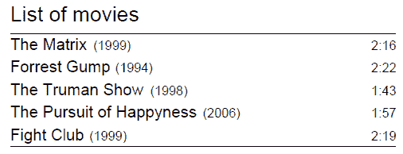
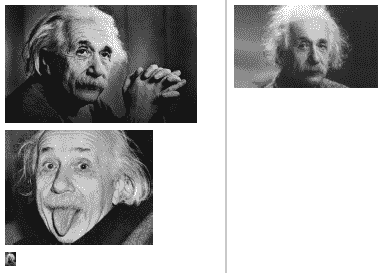

# 数据序列化

# 问题

# 73.将数据序列化为 XML 或将数据反序列化为 XML

编写一个可以将电影列表序列化为 XML 文件的程序，并用电影列表反序列化 XML 文件。每部电影都有一个数字标识符、标题、上映年份、分钟长度、导演名单、编剧名单以及演员姓名和角色名称的演员名单。这样的 XML 可能如下所示:

```cpp
<?xml version="1.0"?>
<movies>
  <movie id="9871" title="Forrest Gump" year="1994" length="202">
    <cast>
      <role star="Tom Hanks" name="Forrest Gump" />
      <role star="Sally Field" name="Mrs. Gump" />
      <role star="Robin Wright" name="Jenny Curran" />
      <role star="Mykelti Williamson" name="Bubba Blue" />
    </cast>
    <directors>
      <director name="Robert Zemeckis" />
    </directors>
    <writers>
      <writer name="Winston Groom" />
      <writer name="Eric Roth" />
    </writers>
  </movie>
  <!-- more movie elements -->
</movies>
```

# 74.使用 XPath 从 XML 中选择数据

考虑一个包含电影列表的 XML 文件，如前一个问题所述。编写一个可以选择和打印以下内容的程序:

*   一年后发行的所有电影的名称
*   文件中每部电影的演员名单中最后一个演员的姓名

# 75.将数据序列化为 JSON

编写一个程序，可以将前面问题中定义的电影列表序列化到一个 JSON 文件中。每部电影都有一个数字标识符、标题、上映年份、分钟长度、导演名单、编剧名单以及演员姓名和角色名称的演员名单。以下是预期 JSON 格式的示例:

```cpp
{
  "movies": [{
    "id": 9871,
    "title": "Forrest Gump",
    "year": 1994,
    "length": 202,
    "cast": [{
        "star": "Tom Hanks",
        "name": "Forrest Gump"
      },
      {
        "star": "Sally Field",
        "name": "Mrs. Gump"
      },
      {
        "star": "Robin Wright",
        "name": "Jenny Curran"
      },
      {
        "star": "Mykelti Williamson",
        "name": "Bubba Blue"
      }
    ],
    "directors": ["Robert Zemeckis"],
    "writers": ["Winston Groom", "Eric Roth"]
  }]
}
```

# 76.从 JSON 反序列化数据

考虑一个包含电影列表的 JSON 文件，如前一个问题所示。编写一个可以反序列化其内容的程序。

# 77.将电影列表打印到 PDF

编写一个程序，可以将电影列表以表格形式打印到 PDF 文件中，并满足以下要求:

*   列表必须有标题，内容为*电影列表*。这必须只出现在文档的第一页。
*   对于每部电影，它应该显示标题、发行年份和长度。
*   标题后面是括号中的发布年份，必须左对齐。
*   以小时和分钟为单位的长度(例如，2:12)必须右对齐。
*   每一页的电影列表上面和下面必须有一行。

以下是这样一个 PDF 输出的示例:



# 78.从图像集合中创建 PDF

编写一个程序，可以创建一个包含来自用户指定目录的图像的 PDF 文档。图像必须一个接一个地显示。如果图像不适合页面的其余部分，则必须将其放在下一页。

下面是一个这样的 PDF 文件的例子，它是由阿尔伯特·爱因斯坦的几张图片创建的(这些图片是随书附上的源代码):



# 解决方法

# 73.将数据序列化为 XML 或将数据反序列化为 XML

C++ 标准库不支持 XML，但是有多个开源的、跨平台的库可以使用。一些库是轻量级的，支持一组基本的 XML 特性，而另一些库更复杂，功能更丰富。由你来决定哪一个最适合某个特定的项目。

您可能要考虑的库列表应该包括 *Xerces-C++* 、 *libxml++* 、 *tinyxml* 或 *tinyxml2* 、 *pugixml* 、 *gSOAP* 和 *RapidXml* 。为了解决这个特殊的任务，我将选择 *pugixml* 。这是一个跨平台的轻量级库，具有快速但不可验证的 XML 解析器。它有一个类似 DOM 的接口，具有丰富的遍历/修改功能，支持 Unicode 和 XPath 1.0。关于库的局限性，应该提到的是它缺乏对模式验证的支持。pugixml 库可在[https://pugixml.org/](https://pugixml.org/)获得。

为了表现电影，如问题中所述，我们将使用以下结构:

```cpp
struct casting_role
{
   std::string actor;
   std::string role;
};

struct movie
{
   unsigned int              id;
   std::string               title;
   unsigned int              year;
   unsigned int              length;
   std::vector<casting_role> cast;
   std::vector<std::string>  directors;
   std::vector<std::string>  writers;
};

using movie_list = std::vector<movie>;
```

要创建一个 XML 文档，您必须使用`pugi::xml_document`类。构建 DOM 树后，可以通过调用`save_file()`将其保存到文件中。可以通过调用`append_child()`添加节点，用`append_attribute()`添加属性。以下方法以请求的格式序列化电影列表:

```cpp
void serialize(movie_list const & movies, std::string_view filepath)
{
   pugi::xml_document doc;
   auto root = doc.append_child("movies");

   for (auto const & m : movies)
   {
      auto movie_node = root.append_child("movie");

      movie_node.append_attribute("id").set_value(m.id);
      movie_node.append_attribute("title").set_value(m.title.c_str());
      movie_node.append_attribute("year").set_value(m.year);
      movie_node.append_attribute("length").set_value(m.length);

      auto cast_node = movie_node.append_child("cast");
      for (auto const & c : m.cast)
      { 
         auto node = cast_node.append_child("role");
         node.append_attribute("star").set_value(c.actor.c_str());
         node.append_attribute("name").set_value(c.role.c_str());
      }

      auto directors_node = movie_node.append_child("directors");
      for (auto const & director : m.directors)
      {
         directors_node.append_child("director")
                       .append_attribute("name")
                       .set_value(director.c_str());
      }

      auto writers_node = movie_node.append_child("writers");
      for (auto const & writer : m.writers)
      {
         writers_node.append_child("writer")
                     .append_attribute("name")
                     .set_value(writer.c_str());
      }
   }

   doc.save_file(filepath.data());
}
```

对于相反的操作，您可以通过调用其`load_file()`方法将 XML 文件的内容加载到`pugi::xml_document`中。可以通过调用`child()`、`next_sibling()`等方法访问节点，通过调用`attribute()`访问属性。`deserialize()`方法，如下所示，读取 DOM 树并构建电影列表:

```cpp
movie_list deserialize(std::string_view filepath)
{
   pugi::xml_document doc;
   movie_list movies;

   auto result = doc.load_file(filepath.data());
   if (result)
   {
      auto root = doc.child("movies");
      for (auto movie_node = root.child("movie");
           movie_node;
           movie_node = movie_node.next_sibling("movie"))
      {
         movie m;
         m.id = movie_node.attribute("id").as_uint();
         m.title = movie_node.attribute("title").as_string();
         m.year = movie_node.attribute("year").as_uint();
         m.length = movie_node.attribute("length").as_uint();

         for (auto role_node :       
              movie_node.child("cast").children("role"))
         {
            m.cast.push_back(casting_role{
               role_node.attribute("star").as_string(),
               role_node.attribute("name").as_string() });
         }

         for (auto director_node : 
              movie_node.child("directors").children("director"))
         {
            m.directors.push_back(
               director_node.attribute("name").as_string());
         }

         for (auto writer_node : 
              movie_node.child("writers").children("writer"))
         {
            m.writers.push_back(
               writer_node.attribute("name").as_string());
         }

         movies.push_back(m);
      }
   }

   return movies;
}
```

下面的列表显示了如何使用这些函数的示例:

```cpp
int main()
{
   movie_list movies
   {
      {
         11001, "The Matrix",1999, 196,
         { {"Keanu Reeves", "Neo"},
           {"Laurence Fishburne", "Morpheus"},
           {"Carrie-Anne Moss", "Trinity"}, 
           {"Hugo Weaving", "Agent Smith"} },
         {"Lana Wachowski", "Lilly Wachowski"},
         {"Lana Wachowski", "Lilly Wachowski"},
      },
      {
         9871, "Forrest Gump", 1994, 202,
         { {"Tom Hanks", "Forrest Gump"},
           {"Sally Field", "Mrs. Gump"},
           {"Robin Wright","Jenny Curran"},
           {"Mykelti Williamson","Bubba Blue"} },
         {"Robert Zemeckis"},
         {"Winston Groom", "Eric Roth"},
      }
   };

   serialize(movies, "movies.xml");
   auto result = deserialize("movies.xml");

   assert(result.size() == 2);
   assert(result[0].title == "The Matrix");
   assert(result[1].title == "Forrest Gump");
}
```

# 74.使用 XPath 从 XML 中选择数据

可以使用 *XPath* 来导航一个 XML 文件的元素和属性。XPath 为此使用 XPath 表达式，为此有一长串内置函数。 *pugixml* 支持 XPath 表达式，您可以使用`xml_document`类中的`select_nodes()`方法来实现这一目的。请注意，如果在选择 XPath 的过程中出现错误，则会抛出`xpath_exception`。以下 XPath 表达式可用于根据问题要求选择节点:

*   对于给定年份(在本例中，该年份是 1995 年)之后发行的所有电影:`/movies/movie[@year>1995]`
*   每部电影最后的选角角色:`/movies/movie/cast/role[last()]`

下面的程序从字符串缓冲区加载一个 XML 文档，然后使用前面列出的 XPath 表达式执行节点选择。XML 文档的定义如下:

```cpp
std::string text = R"(
<?xml version="1.0"?>
<movies>
  <movie id="11001" title="The Matrix" year="1999" length="196">
    <cast>
      <role star="Keanu Reeves" name="Neo" />
      <role star="Laurence Fishburne" name="Morpheus" />
      <role star="Carrie-Anne Moss" name="Trinity" />
      <role star="Hugo Weaving" name=" Agent Smith" />
    </cast>
    <directors>
      <director name="Lana Wachowski" />
      <director name="Lilly Wachowski" />
    </directors>
    <writers>
      <writer name="Lana Wachowski" />
      <writer name="Lilly Wachowski" />
    </writers>
  </movie>
  <movie id="9871" title="Forrest Gump" year="1994" length="202">
    <cast>
      <role star="Tom Hanks" name="Forrest Gump" />
      <role star="Sally Field" name="Mrs. Gump" />
      <role star="Robin Wright" name="Jenny Curran" />
      <role star="Mykelti Williamson" name="Bubba Blue" />
    </cast>
    <directors>
      <director name="Robert Zemeckis" />
    </directors>
    <writers>
      <writer name="Winston Groom" />
      <writer name="Eric Roth" />
    </writers>
  </movie>
</movies>
)";
```

可以通过以下方式选择请求的数据:

```cpp
pugi::xml_document doc;
if (doc.load_string(text.c_str()))
{
   try
   {
      auto titles = doc.select_nodes("/movies/movie[@year>1995]");

      for (auto it : titles)
      {
         std::cout << it.node().attribute("title").as_string() 
                   << std::endl;
      }
   }
   catch (pugi::xpath_exception const & e)
   {
      std::cout << e.result().description() << std::endl;
   }

   try
   {
      auto titles = doc.select_nodes("/movies/movie/cast/role[last()]");

      for (auto it : titles)
      {
         std::cout << it.node().attribute("star").as_string() 
                   << std::endl;
      }
   }
   catch (pugi::xpath_exception const & e)
   {
      std::cout << e.result().description() << std::endl;
   }
}
```

# 75.将数据序列化为 JSON

与 XML 一样，不存在对 JSON 的标准支持。然而，有大量的跨平台库用于此目的。在撰写本文时，[https://github.com/miloyip/nativejson-benchmark](https://github.com/miloyip/nativejson-benchmark)提供的 *nativejson-benchmark* 项目列出了 40 多个库。这个项目是一个基准测试，评估具有 JSON 解析/生成能力的开源 C/C++ 库的一致性和性能(速度、内存和代码大小)。这使得选择合适的库可能有点困难，尽管顶级竞争者可能包括`RapidJSON`、`NLohmann`、`taocpp/json`、`Configuru`、`json_spirit`、`jsoncpp`。为了解决这个任务，我们将在这里使用`nlohmann/json`库。这是一个跨平台的 C++ 11 头文件库，具有直观的语法和良好的文档。这个图书馆可以在[https://github.com/nlohmann/json](https://github.com/nlohmann/json)找到。

我们将使用相同的数据结构来表示电影，就像我们用于问题*将数据序列化和反序列化为/从 XML* 一样。`nlohmann`库使用`nlohmann::json`作为表示 JSON 对象的主要数据类型。虽然您可以使用更显式的语法创建 JSON 值，但是也有标量类型和标准容器之间的隐式转换。此外，您还可以通过在要转换的类型的命名空间中提供`to_json()`和`from_json()`方法来启用自定义类型之间的隐式转换。这些功能有一些要求，您可以在文档中阅读。

在下面的代码中，这是所选择的方法。由于`movie`和`casting_role`类型是在全局命名空间中定义的，因此序列化这些类型的`to_json()`重载也是在全局命名空间中定义的。另一方面，类型`movie_list`实际上是`std::vector<movie>`的类型别名，可以直接序列化和反序列化，因为如前所述，库支持与标准容器之间的隐式转换:

```cpp
using json = nlohmann::json;

void to_json(json& j, casting_role const & c)
{
   j = json{ {"star", c.actor}, {"name", c.role} };
}

void to_json(json& j, movie const & m)
{
   j = json::object({
      {"id", m.id},
      {"title", m.title},
      {"year", m.year},
      {"length", m.length},
      {"cast", m.cast },
      {"directors", m.directors},
      {"writers", m.writers}
   });
}

void serialize(movie_list const & movies, std::string_view filepath)
{
   json jdata{ { "movies", movies } };

   std::ofstream ofile(filepath.data());
   if (ofile.is_open())
   {
      ofile << std::setw(2) << jdata << std::endl;
   }
}
```

功能`serialize()`可以使用，如下例所示:

```cpp
int main()
{
   movie_list movies
   {
      {
         11001, "The Matrix", 1999, 196,
         { {"Keanu Reeves", "Neo"},
           {"Laurence Fishburne", "Morpheus"},
           {"Carrie-Anne Moss", "Trinity"}, 
           {"Hugo Weaving", "Agent Smith"} },
         {"Lana Wachowski", "Lilly Wachowski"},
         {"Lana Wachowski", "Lilly Wachowski"},
      },
      {
         9871, "Forrest Gump", 1994, 202,
         { {"Tom Hanks", "Forrest Gump"},
           {"Sally Field", "Mrs. Gump"},
           {"Robin Wright","Jenny Curran"},
           {"Mykelti Williamson","Bubba Blue"} },
         {"Robert Zemeckis"},
         {"Winston Groom", "Eric Roth"},
      }
   };

   serialize(movies, "movies.json");
}
```

# 76.从 JSON 反序列化数据

为了解决这个任务，我们将再次使用`nlohmann/json`库。我们将采取更明确的方法，而不是像前面问题的解决方案中提到的那样编写`from_json()`函数。可以使用重载的`operator>>`将 JSON 文件的内容加载到`nlohmann::json`对象中。要访问对象值，应该使用`at()`方法，而不是`operator[]`，因为前者在键不存在时抛出异常(您可以处理的异常)，而后者表现出未定义的行为。要将对象值检索为特定的`T`对象，请使用`get<T>()`方法。然而，这要求类型`T`是默认可构造的。

这里显示的`deserialize()`函数返回一个从指定 JSON 文件的内容构建的`std::vector<movie>`:

```cpp
using json = nlohmann::json;

movie_list deserialize(std::string_view filepath)
{
   movie_list movies;

   std::ifstream ifile(filepath.data());
   if (ifile.is_open())
   {
      json jdata;

      try
      {
         ifile >> jdata;

         if (jdata.is_object())
         {
            for (auto & element : jdata.at("movies"))
            {
               movie m;

               m.id = element.at("id").get<unsigned int>();
               m.title = element.at("title").get<std::string>();
               m.year = element.at("year").get<unsigned int>();
               m.length = element.at("length").get<unsigned int>();

               for (auto & role : element.at("cast"))
               {
                  m.cast.push_back(casting_role{
                     role.at("star").get<std::string>(),
                     role.at("name").get<std::string>() });
               }

               for (auto & director : element.at("directors"))
               {
                  m.directors.push_back(director);
               }

               for (auto & writer : element.at("writers"))
               {
                  m.writers.push_back(writer);
               }

               movies.push_back(m);
            }
         }
      }
      catch (std::exception const & ex)
      {
         std::cout << ex.what() << std::endl;
      }
   }

   return movies;
}
```

这个反序列化函数可以如下使用:

```cpp
int main()
{
   auto movies = deserialize("movies.json");

   assert(movies.size() == 2);
   assert(movies[0].title == "The Matrix");
   assert(movies[1].title == "Forrest Gump");
}
```

# 77.将电影列表打印到 PDF

有各种用于处理 PDF 文件的 C++ 库。 *HaHu* 、 *PoDoFo* 、*jaggpdf*和 *PDF-Writer* (也称为 *Hummus* )是您可以用于此目的的一些开源和跨平台库。在本书中，我将使用 *PDF-Writer* ，可在[https://github.com/galkahana/PDF-Writer](https://github.com/galkahana/PDF-Writer)获得。这是一个免费、快速、可扩展的库，具有基本的功能集，包括对文本、图像和形状的支持，同时支持 PDF 操作符和更高级的功能(我将使用它来解决这个问题)。

功能`print_pdf()`，如下所示，实现了以下算法:

*   用`PDFWriter::StartPDF()`开始一个新的 PDF 文档。
*   每页最多打印 25 部电影。每个页面由一个`PDFPage()`对象表示，并且有一个`PageContentContext`对象，该对象是用`PDFPage::StartPageContentContext()`创建的，用于在页面上绘制项目。
*   在第一页，放一个标题，内容为*电影列表*。使用`PageContentContext::WriteText()`将文本写在页面上。
*   电影信息使用不同的字体书写。
*   使用`PageContentContext::DrawPath()`在每页电影列表的顶部和底部画线。
*   `PDFWriter::EndPageContentContext()`和`PDFWriter::WritePageAndRelease()`必须在一页写完内容后调用。
*   `PDFWriter::EndPDF()`在完成 PDF 文档的编写时必须调用:

For information about the types and methods used in the following code, as well as more information about creating PDF documents and working with text, shapes, and images, see the project documentation available at [https://github.com/galkahana/PDF-Writer/wiki](https://github.com/galkahana/PDF-Writer/wiki).

```cpp
#ifdef _WIN32
static const std::string fonts_dir = R"(c:\windows\fonts\)";
#elif defined (__APPLE__)
static const std::string fonts_dir = R"(/Library/Fonts/)";
#else
static const std::string fonts_dir = R"(/usr/share/fonts)"; 
#endif

void print_pdf(movie_list const & movies,
               std::string_view path)
{
   const int height = 842;
   const int width = 595;
   const int left = 60;
   const int top = 770;
   const int right = 535;
   const int bottom = 60;
   const int line_height = 28;

```

```cpp
   PDFWriter pdf;
   pdf.StartPDF(path.data(), ePDFVersion13);
   auto font = pdf.GetFontForFile(fonts_dir + "arial.ttf");

   AbstractContentContext::GraphicOptions pathStrokeOptions(
      AbstractContentContext::eStroke,
      AbstractContentContext::eRGB,
      0xff000000,
      1);

   PDFPage* page = nullptr;
   PageContentContext* context = nullptr;
   int index = 0;
   for (size_t i = 0; i < movies.size(); ++ i)
   {
      index = i % 25;
      if (index == 0)
      {
         if (page != nullptr)
         {
            DoubleAndDoublePairList pathPoints;
            pathPoints.push_back(DoubleAndDoublePair(left, bottom));
            pathPoints.push_back(DoubleAndDoublePair(right, bottom));
            context->DrawPath(pathPoints, pathStrokeOptions);

            pdf.EndPageContentContext(context);
            pdf.WritePageAndRelease(page);
         }

         page = new PDFPage();
         page->SetMediaBox(PDFRectangle(0, 0, width, height));
         context = pdf.StartPageContentContext(page);

         {
            DoubleAndDoublePairList pathPoints;
            pathPoints.push_back(DoubleAndDoublePair(left, top));
            pathPoints.push_back(DoubleAndDoublePair(right, top));
            context->DrawPath(pathPoints, pathStrokeOptions);
         }
      }

      if (i == 0)
      {
         AbstractContentContext::TextOptions const textOptions(
            font, 26, AbstractContentContext::eGray, 0);

```

```cpp
         context->WriteText(left, top + 15, 
                            "List of movies", textOptions);
      }

      auto textw = 0;
      {
         AbstractContentContext::TextOptions const textOptions(
            font, 20, AbstractContentContext::eGray, 0);

         context->WriteText(left, top - 20 - line_height * index, 
                            movies[i].title, textOptions);
         auto textDimensions = font->CalculateTextDimensions(
                            movies[i].title, 20);
         textw = textDimensions.width;
      }

      {
         AbstractContentContext::TextOptions const textOptions(
            font, 16, AbstractContentContext::eGray, 0);

         context->WriteText(left + textw + 5, 
                            top - 20 - line_height * index, 
                            " (" + std::to_string(movies[i].year) + ")", 
                            textOptions);

         std::stringstream s;
         s << movies[i].length / 60 << ':' << std::setw(2) 
           << std::setfill('0') << movies[i].length % 60;

         context->WriteText(right - 30, top - 20 - line_height * index,
            s.str(),
           textOptions);
      }
   }

   DoubleAndDoublePairList pathPoints;
   pathPoints.push_back(
      DoubleAndDoublePair(left, top - line_height * (index + 1)));
   pathPoints.push_back(
      DoubleAndDoublePair(right, top - line_height * (index + 1)));
   context->DrawPath(pathPoints, pathStrokeOptions);

   if (page != nullptr)
   {
```

```cpp
      pdf.EndPageContentContext(context);
      pdf.WritePageAndRelease(page);
   }

   pdf.EndPDF();
}
```

`print_pdf()`功能可以如下使用:

```cpp
int main()
{
   movie_list movies
   {
      { 1, "The Matrix", 1999, 136},
      { 2, "Forrest Gump", 1994, 142},
      // .. other movies
      { 28, "L.A. Confidential", 1997, 138},
      { 29, "Shutter Island", 2010, 138},
   };

   print_pdf(movies, "movies.pdf");
}
```

# 78.从图像集合中创建 PDF

为了解决这个问题，我们将使用与前一个问题相同的 *PDF-Writer* 库。我建议您先看看并实现前面的问题，如果您还没有这样做，然后再继续这个问题。

下面的`get_images()`函数返回一个字符串向量，代表指定目录中所有 JPG 图像的路径:

```cpp
namespace fs = std::experimental::filesystem;

std::vector<std::string> get_images(fs::path const & dirpath)
{
   std::vector<std::string> paths;

   for (auto const & p : fs::directory_iterator(dirpath))
   {
```

```cpp
      if (p.path().extension() == ".jpg")
         paths.push_back(p.path().string());
   }

   return paths;
}
```

`print_pdf()`功能从一个指定的目录创建一个包含所有 JPG 图像的 PDF 文档。它实现了以下算法:

*   使用`PDFWriter::StartPDF()`创建新的 PDF 文档
*   创建一个页面及其内容，并在页面上放置尽可能多的图像，一个接一个地垂直排列
*   当新图像不适合当前页面时，用`PDFWriter::EndPageContentContext()`和`PDFWriter::SavePageAndRelease()`关闭页面并开始新页面
*   使用`PageContentContext::DrawImage()`在页面内容上书写图像
*   通过调用`PDFWriter::EndPDF()`结束文档

```cpp
void print_pdf(fs::path const & pdfpath,
               fs::path const & dirpath)
{
   const int height = 842;
   const int width = 595;
   const int margin = 20;

   auto image_paths = get_images(dirpath);

   PDFWriter pdf;
   pdf.StartPDF(pdfpath.string(), ePDFVersion13);

   PDFPage* page = nullptr;
   PageContentContext* context = nullptr;

   auto top = height - margin;
   for (size_t i = 0; i < image_paths.size(); ++ i)
   {
      auto dims = pdf.GetImageDimensions(image_paths[i]);

      if (i == 0 || top - dims.second < margin)
      {
         if (page != nullptr)
         {
```

```cpp
            pdf.EndPageContentContext(context);
            pdf.WritePageAndRelease(page);
         }

         page = new PDFPage();
         page->SetMediaBox(PDFRectangle(0, 0, width, height));
         context = pdf.StartPageContentContext(page);

         top = height - margin;
      }

      context->DrawImage(margin, top - dims.second, image_paths[i]);

      top -= dims.second + margin;
   }

   if (page != nullptr)
   {
      pdf.EndPageContentContext(context);
      pdf.WritePageAndRelease(page);
   }

   pdf.EndPDF();
}
```

`print_pdf()`可以像下面的例子一样使用，其中`sample.pdf`是输出的名称，`res`是包含图像的文件夹的名称:

```cpp
int main()
{
   print_pdf("sample.pdf", "res");
}
```