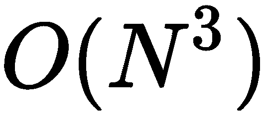
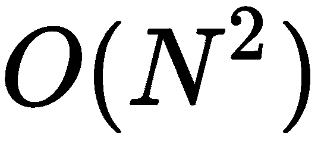

# 十四、字符串和正则表达式

# 问题

这是本章的解题部分。

# 23.二进制到字符串转换

编写一个函数，在给定 8 位整数范围(如数组或向量)的情况下，返回包含输入数据的十六进制表示的字符串。该函数应该能够同时生成大写和小写内容。以下是一些输入和输出示例:

输入:`{ 0xBA, 0xAD, 0xF0, 0x0D }`，输出:`"BAADF00D"`或`"baadf00d"`
输入:`{ 1,2,3,4,5,6 }`，输出:`"010203040506"`

# 24.字符串到二进制的转换

编写一个函数，在给定包含十六进制数字作为输入参数的字符串的情况下，返回一个 8 位整数的向量，该向量表示字符串内容的数字反序列化。以下是一些例子:

输入:`"BAADF00D"`或`"baadF00D"`，输出:`{0xBA, 0xAD, 0xF0, 0x0D}`
输入`"010203040506"`，输出:`{1, 2, 3, 4, 5, 6}`

# 25.将文章标题大写

编写一个函数，将输入文本转换为大写版本，其中每个单词都以大写字母开头，所有其他字母都以小写字母开头。例如，文本`"the c++ challenger"`应该转换为`"The C++ Challenger"`。

# 26.用分隔符将字符串连接在一起

编写一个函数，在给定字符串列表和分隔符的情况下，通过连接用指定分隔符分隔的所有输入字符串来创建一个新字符串。分隔符不能出现在最后一个字符串之后，并且当没有提供输入字符串时，函数必须返回一个空字符串。

示例:输入`{ "this","is","an","example" }`和分隔符`' '`(空格)，输出:`"this is an example"`。

# 27.使用可能的分隔符列表将字符串拆分为标记

编写一个函数，给定一个字符串和一个可能的分隔符列表，将字符串拆分成由任何分隔符分隔的标记，并在`std::vector`中返回它们。

示例:输入:`"this,is.a sample!!"`带分隔符`",.! "`，输出:`{"this", "is", "a", "sample"}`。

# 28.最长回文子串

编写一个函数，在给定输入字符串的情况下，定位并返回字符串中最长的回文序列。如果存在多个相同长度的回文，则应返回第一个回文。

# 29.车牌验证

考虑格式为`LLL-LL DDD`或`LLL-LL DDDD`的车牌(其中`L`是从 *A* 到 *Z* 的大写字母，`D`是数字)，写:

*   验证车牌号码格式是否正确的一种功能
*   一个函数，给定输入文本，提取并返回文本中找到的所有车牌号码

# 30.正在提取网址部分

编写一个函数，给定一个代表 URL 的字符串，解析并提取 URL 的各个部分(协议、域、端口、路径、查询和片段)。

# 31.在字符串中转换日期

编写一个函数，给定一个包含格式为`dd.mm.yyyy`或`dd-mm-yyyy`的日期的文本，转换该文本，使其包含格式为`yyyy-mm-dd`的日期。

# 解决方法

以下是上述问题解决部分的解决方案。

# 23.二进制到字符串转换

为了编写一个能够处理各种范围的通用函数，比如`std::array`、`std::vector`、类 C 数组或者其他，我们应该编写一个函数模板。在下面，有两个重载；一个使用容器作为参数和指示大小写样式的标志，另一个使用一对迭代器(标记第一个迭代器，然后一个迭代器越过范围的结束元素)和指示大小写的标志。该范围的内容被写入一个`std::ostringstream`对象，带有适当的输入/输出操纵器，例如宽度、填充字符或大小写标志:

```cpp
template <typename Iter>
std::string bytes_to_hexstr(Iter begin, Iter end, 
                            bool const uppercase = false)
{
   std::ostringstream oss;
   if(uppercase) oss.setf(std::ios_base::uppercase);
   for (; begin != end; ++ begin)
     oss << std::hex << std::setw(2) << std::setfill('0') 
         << static_cast<int>(*begin);
   return oss.str();
}

template <typename C>
std::string bytes_to_hexstr(C const & c, bool const uppercase = false)
{
   return bytes_to_hexstr(std::cbegin(c), std::cend(c), uppercase);
}
```

这些功能可以如下使用:

```cpp
int main()
{
   std::vector<unsigned char> v{ 0xBA, 0xAD, 0xF0, 0x0D };
   std::array<unsigned char, 6> a{ {1,2,3,4,5,6} };
   unsigned char buf[5] = {0x11, 0x22, 0x33, 0x44, 0x55};

   assert(bytes_to_hexstr(v, true) == "BAADF00D");
   assert(bytes_to_hexstr(a, true) == "010203040506");
   assert(bytes_to_hexstr(buf, true) == "1122334455");

   assert(bytes_to_hexstr(v) == "baadf00d");
   assert(bytes_to_hexstr(a) == "010203040506");
   assert(bytes_to_hexstr(buf) == "1122334455");
}
```

# 24.字符串到二进制的转换

这里请求的操作与上一个问题中实现的操作相反。然而，这一次，我们可以编写一个函数，而不是函数模板。输入是一个`std::string_view`，这是一个轻量级的字符序列包装器。输出是一个 8 位无符号整数向量。下面的`hexstr_to_bytes`函数将每两个文本字符转换成一个`unsigned char`值(`"A0"`变成`0xA0`，将它们放入一个`std::vector`，并返回向量:

```cpp
unsigned char hexchar_to_int(char const ch)
{
   if (ch >= '0' && ch <= '9') return ch - '0';
   if (ch >= 'A' && ch <= 'F') return ch - 'A' + 10;
   if (ch >= 'a' && ch <= 'f') return ch - 'a' + 10;
      throw std::invalid_argument("Invalid hexadecimal character");
}

std::vector<unsigned char> hexstr_to_bytes(std::string_view str)
{
   std::vector<unsigned char> result;
   for (size_t i = 0; i < str.size(); i += 2) 
   {
      result.push_back(
         (hexchar_to_int(str[i]) << 4) | hexchar_to_int(str[i+1]));
   }
   return result;
}
```

This function assumes the input string contains an even number of hexadecimal digits. In cases where the input string contains an odd number of hexadecimal digits, the last one is discarded (so that `"BAD"` becomes `{0xBA}`). As a further exercise, modify the preceding function so that, instead of discarding the last odd digit, it considers a leading zero so that `"BAD"` becomes `{0x0B, 0xAD}`. Also, as yet another exercise, you can write a version of the function that deserializes content that has the hexadecimal digits separated by a delimiter, such as space (for example `"BA AD F0 0D"`).

下一个代码示例显示了如何使用该函数:

```cpp
int main()
{
   std::vector<unsigned char> expected{ 0xBA, 0xAD, 0xF0, 0x0D, 0x42 };
   assert(hexstr_to_bytes("BAADF00D42") == expected);
   assert(hexstr_to_bytes("BaaDf00d42") == expected);
}
```

# 25.将文章标题大写

如下实现的函数模板`capitalize()`可以处理任何类型的字符串。它不修改输入字符串，而是创建一个新字符串。为此，它使用了`std::stringstream`。它会遍历输入字符串中的所有字符，并在每次遇到空格或标点符号时向`true`设置一个指示新单词的标志。当输入字符代表单词中的第一个字符时，它们会转换为大写，否则会转换为小写:

```cpp
template <class Elem>
using tstring = std::basic_string<Elem, std::char_traits<Elem>, 
                                  std::allocator<Elem>>;
template <class Elem>
using tstringstream = std::basic_stringstream<
   Elem, std::char_traits<Elem>, std::allocator<Elem>>;

template <class Elem>
tstring<Elem> capitalize(tstring<Elem> const & text)
{
   tstringstream<Elem> result;
   bool newWord = true;
   for (auto const ch : text)
   {
      newWord = newWord || std::ispunct(ch) || std::isspace(ch);
      if (std::isalpha(ch))
      {
         if (newWord)
         {
            result << static_cast<Elem>(std::toupper(ch));
            newWord = false;
         }
         else
            result << static_cast<Elem>(std::tolower(ch));
      }
      else result << ch;
   }
   return result.str();
}
```

在下面的程序中，您可以看到如何使用这个函数来大写文本:

```cpp
int main()
{
   using namespace std::string_literals;
   assert("The C++ Challenger"s ==
          capitalize("the c++ challenger"s));
   assert("This Is An Example, Should Work!"s == 
          capitalize("THIS IS an ExamplE, should wORk!"s));
}
```

# 26.用分隔符将字符串连接在一起

下面的代码中列出了两个名为`join_strings()`的重载。一个接受一个字符串容器和一个指向表示分隔符的字符序列的指针，而另一个接受两个随机访问迭代器和一个分隔符，前者表示区域的第一个元素，后者表示最后一个元素。它们都使用输出字符串流和`std::copy`函数，返回通过连接所有输入字符串而创建的新字符串。这个通用函数将指定范围内的所有元素复制到输出范围，由输出迭代器表示。我们这里使用的是一个`std::ostream_iterator`，每次迭代器被赋值时，它使用`operator<<`将赋值写入指定的输出流:

```cpp
template <typename Iter>
std::string join_strings(Iter begin, Iter end, 
                         char const * const separator)
{
   std::ostringstream os;
   std::copy(begin, end-1, 
             std::ostream_iterator<std::string>(os, separator));
   os << *(end-1);
   return os.str();
}

template <typename C>
std::string join_strings(C const & c, char const * const separator)
{
   if (c.size() == 0) return std::string{};
   return join_strings(std::begin(c), std::end(c), separator);
}

int main()
{
   using namespace std::string_literals;
   std::vector<std::string> v1{ "this","is","an","example" };
   std::vector<std::string> v2{ "example" };
   std::vector<std::string> v3{ };

   assert(join_strings(v1, " ") == "this is an example"s);
   assert(join_strings(v2, " ") == "example"s);
   assert(join_strings(v3, " ") == ""s);
}
```

As a further exercise, you should modify the overload that takes iterators as arguments so that it works with other types of iterators, such as bidirectional iterators, thereby enabling the use of this function with lists or other containers.

# 27.使用可能的分隔符列表将字符串拆分为标记

拆分函数的两个不同版本如下所示:

*   第一个使用单个字符作为分隔符。为了分割输入字符串，它使用一个用输入字符串的内容初始化的字符串流，使用`std::getline()`从中读取数据块，直到遇到下一个分隔符或行尾字符。
*   第二个使用可能的字符分隔符列表，在`std::string`中指定。它使用`std:string::find_first_of()`定位任何分隔符字符的第一个位置，从给定的位置开始。它循环执行，直到处理完整个输入字符串。提取的子串被添加到结果向量:

```cpp
template <class Elem>
using tstring = std::basic_string<Elem, std::char_traits<Elem>, 
                                  std::allocator<Elem>>;

template <class Elem>
using tstringstream = std::basic_stringstream<
   Elem, std::char_traits<Elem>, std::allocator<Elem>>;
template<typename Elem>
inline std::vector<tstring<Elem>> split(tstring<Elem> text, 
                                        Elem const delimiter)
{
   auto sstr = tstringstream<Elem>{ text };
   auto tokens = std::vector<tstring<Elem>>{};
   auto token = tstring<Elem>{};
   while (std::getline(sstr, token, delimiter))
   {
      if (!token.empty()) tokens.push_back(token);
   }
   return tokens;
}

template<typename Elem>
inline std::vector<tstring<Elem>> split(tstring<Elem> text, 
                                        tstring<Elem> const & delimiters)
{
   auto tokens = std::vector<tstring<Elem>>{};
   size_t pos, prev_pos = 0;
   while ((pos = text.find_first_of(delimiters, prev_pos)) != 
   std::string::npos)
   {
      if (pos > prev_pos)
      tokens.push_back(text.substr(prev_pos, pos - prev_pos));
      prev_pos = pos + 1;
   }
   if (prev_pos < text.length())
   tokens.push_back(text.substr(prev_pos, std::string::npos));
   return tokens;
}
```

以下示例代码显示了如何使用一个分隔符或多个分隔符拆分不同字符串的两个示例:

```cpp
int main()
{
   using namespace std::string_literals;
   std::vector<std::string> expected{"this", "is", "a", "sample"};
   assert(expected == split("this is a sample"s, ' '));
   assert(expected == split("this,is a.sample!!"s, ",.! "s));
}
```

# 28.最长回文子串

这个问题最简单的解决方案是尝试蛮力方法，检查每个子串是否是回文。但是，这意味着我们需要检查 *C(N，2)* 子串(其中 *N* 是字符串中的字符数)，时间复杂度为 ** 。通过存储子问题的结果，复杂性可以降低到。为此，我们需要一个大小为的布尔值表，其中`[i, j]`处的元素指示从位置`i`到`j`的子串是否是回文。我们首先用`true`(单字符回文)初始化所有元素`[i,i]`，用`true`初始化所有元素`[i,i+i]`，用于所有连续的两个相同字符(双字符回文)。然后我们继续检查大于两个字符的子字符串，如果`[i+i,j-1]`处的元素是`true`，并且字符串中`i`和`j`位置上的字符也相等，则将`[i,j]`处的元素设置为`true`。一路上，我们保留最长回文子串的起始位置和长度，以便在计算完表后提取它。

在代码中，此解决方案如下所示:

```cpp
std::string longest_palindrome(std::string_view str)
{
   size_t const len = str.size();
   size_t longestBegin = 0;
   size_t maxLen = 1;

   std::vector<bool> table(len * len, false);
   for (size_t i = 0; i < len; i++)
      table[i*len + i] = true;

   for (size_t i = 0; i < len - 1; i++)
   {
      if (str[i] == str[i + 1]) 
      {
         table[i*len + i + 1] = true;
         if (maxLen < 2)
         {
            longestBegin = i;
            maxLen = 2;
         }
      }
   }

   for (size_t k = 3; k <= len; k++)
   {
      for (size_t i = 0; i < len - k + 1; i++)
      {
         size_t j = i + k - 1;
         if (str[i] == str[j] && table[(i + 1)*len + j - 1])
         {
            table[i*len +j] = true;
            if (maxLen < k)
            {
               longestBegin = i;
               maxLen = k;
            }
         }
      }
   }
   return std::string(str.substr(longestBegin, maxLen));
}
```

以下是`longest_palindrome()`功能的一些测试案例:

```cpp
int main()
{
   using namespace std::string_literals;
   assert(longest_palindrome("sahararahnide") == "hararah");
   assert(longest_palindrome("level") == "level");
   assert(longest_palindrome("s") == "s");
}
```

# 29.车牌验证

解决这个问题最简单的方法是使用正则表达式。符合所述格式的正则表达式为`"[A-Z]{3}-[A-Z]{2} \d{3,4}"`。

第一个函数只需要验证输入字符串只包含与该正则表达式匹配的文本。为此，我们可以使用`std::regex_match()`，如下所示:

```cpp
bool validate_license_plate_format(std::string_view str)
{
   std::regex rx(R"([A-Z]{3}-[A-Z]{2} \d{3,4})");
   return std::regex_match(str.data(), rx);
}

int main()
{
   assert(validate_license_plate_format("ABC-DE 123"));
   assert(validate_license_plate_format("ABC-DE 1234"));
   assert(!validate_license_plate_format("ABC-DE 12345"));
   assert(!validate_license_plate_format("abc-de 1234"));
}
```

第二个功能略有不同。它必须标识字符串中正则表达式的所有匹配项，而不是匹配输入字符串。正则表达式将因此变为`"([A-Z]{3}-[A-Z]{2} \d{3,4})*"`。为了遍历所有匹配，我们必须使用`std::sregex_iterator`，如下所示:

```cpp
std::vector<std::string> extract_license_plate_numbers(
                            std::string const & str)
{
   std::regex rx(R"(([A-Z]{3}-[A-Z]{2} \d{3,4})*)");
   std::smatch match;
   std::vector<std::string> results;

   for(auto i = std::sregex_iterator(std::cbegin(str), std::cend(str), rx); 
       i != std::sregex_iterator(); ++ i) 
   {
      if((*i)[1].matched)
      results.push_back(i->str());
   }
   return results;
}

int main()
{
   std::vector<std::string> expected {
      "AAA-AA 123", "ABC-DE 1234", "XYZ-WW 0001"};
   std::string text("AAA-AA 123qwe-ty 1234 ABC-DE 123456..XYZ-WW 0001");
   assert(expected == extract_license_plate_numbers(text));
}
```

# 30.正在提取网址部分

这个问题也适合使用正则表达式来解决。然而，找到一个可以匹配任何网址的正则表达式是一项困难的任务。本练习的目的是帮助您使用 regex 库练习技巧，而不是为了这个特殊的目的找到最终的正则表达式。因此，这里使用的正则表达式仅用于教学目的。

You can try regular expressions using online testers and debuggers, such as [https://regex101.com/](https://regex101.com/). This can be useful in order to work out your regular expressions and try them against various datasets.

对于这个任务，我们将考虑一个网址有以下几个部分:`protocol`和`domain`是强制的，`port`、`path`、`query`和`fragment`都是可选的。以下结构用于返回解析 URL 的结果(或者，您可以返回一个元组，并使用结构化绑定将变量绑定到元组的各个子部分):

```cpp
struct uri_parts
{
   std::string                protocol;
   std::string                domain;
   std::optional<int>         port;
   std::optional<std::string> path;
   std::optional<std::string> query;
   std::optional<std::string> fragment;
};
```

一个可以解析网址并提取和返回其部分的函数可以有以下实现。请注意，返回类型是`std::optional<uri_parts>`，因为该函数可能无法将输入字符串与正则表达式匹配；在这种情况下，返回值为`std::nullopt`:

```cpp
std::optional<uri_parts> parse_uri(std::string uri)
{
   std::regex rx(R"(^(\w+):\/\/([\w.-]+)(:(\d+))?([\w\/\.]+)?(\?([\w=&]*)(#?(\w+))?)?$)");
   auto matches = std::smatch{};
   if (std::regex_match(uri, matches, rx))
   {
      if (matches[1].matched && matches[2].matched)
      {
         uri_parts parts;
         parts.protocol = matches[1].str();
         parts.domain = matches[2].str();
         if (matches[4].matched)
            parts.port = std::stoi(matches[4]);
         if (matches[5].matched)
            parts.path = matches[5];
         if (matches[7].matched)
            parts.query = matches[7];
         if (matches[9].matched)
            parts.fragment = matches[9];
         return parts;
      }
   }
   return {};
}
```

以下程序使用包含不同部分的两个网址测试`parse_uri()`功能:

```cpp
int main()
{
   auto p1 = parse_uri("https://packt.com");
   assert(p1.has_value());
   assert(p1->protocol == "https");
   assert(p1->domain == "packt.com");
   assert(!p1->port.has_value());
   assert(!p1->path.has_value());
   assert(!p1->query.has_value());
   assert(!p1->fragment.has_value());

   auto p2 = parse_uri("https://bbc.com:80/en/index.html?lite=true#ui");
   assert(p2.has_value());
   assert(p2->protocol == "https");
   assert(p2->domain == "bbc.com");
   assert(p2->port == 80);
   assert(p2->path.value() == "/en/index.html");
   assert(p2->query.value() == "lite=true");
   assert(p2->fragment.value() == "ui");
}
```

# 31.在字符串中转换日期

使用`std::regex_replace()`可以用正则表达式进行文本转换。能够匹配指定格式日期的正则表达式是`(\d{1,2})(\.|-|/)(\d{1,2})(\.|-|/)(\d{4})`。这个正则表达式定义了五个捕获组；1 <sup>st</sup> 为日，2 <sup>nd</sup> 为分隔符(`.`或`-`)，3 <sup>rd</sup> 为月，4 <sup>th</sup> 再次为分隔符(`.`或`-`)，5 <sup>th</sup> 为年。

因为我们要将日期从格式`dd.mm.yyyy`或`dd-mm-yyyy`转换为`yyyy-mm-dd`，所以`std::regex_replace()`的正则表达式替换格式字符串应该是`"($5-$3-$1)"`:

```cpp
std::string transform_date(std::string_view text)
{
   auto rx = std::regex{ R"((\d{1,2})(\.|-|/)(\d{1,2})(\.|-|/)(\d{4}))" };
   return std::regex_replace(text.data(), rx, R"($5-$3-$1)");
}

int main()
{
   using namespace std::string_literals;
   assert(transform_date("today is 01.12.2017!"s) == 
          "today is 2017-12-01!"s);
}
```