# 十二、使用 Qt 网络引擎开发网络应用

在本章中，我们将介绍以下食谱:

*   介绍 Qt 网络引擎
*   使用网络视图和网络设置
*   在项目中嵌入谷歌地图
*   从 JavaScript 调用 C++ 函数
*   从 C++ 调用 JavaScript 函数

# 介绍

Qt 包括一个名为 **Qt WebEngine** 的模块，它允许我们在程序中嵌入一个网页浏览器小部件，并使用它来显示网页或本地 HTML 内容。在 5.6 版本之前，Qt 使用了另一个类似的模块，叫做 **Qt WebKit** ，现在已经被弃用了，并且已经被基于 Chromium 的 WebEngine 模块所取代。Qt 还允许 JavaScript 和 C++ 代码之间通过**网络频道**进行通信，这使得我们能够以更有效的方式使用这个模块。

# 技术要求

本章的技术要求包括 Qt 5.11.2 MSVC 2017 64 位、Qt Creator 4.8.2 和 Windows 10。

本章使用的所有代码都可以从本章的 GitHub 资源库下载，网址为[https://GitHub . com/PacktPublishing/Qt5-CPP-GUI-Programming-cook book-第二版/tree/master/Chapter12](https://github.com/PacktPublishing/Qt5-CPP-GUI-Programming-Cookbook-Second-Edition/tree/master/Chapter12) 。

查看以下视频，查看正在运行的代码:[http://bit.ly/2ToK3Do](http://bit.ly/2ToK3Do)

# 介绍 Qt 网络引擎

在这个示例项目中，我们将探索 Qt 中 WebEngine 模块的基本特性，并尝试构建一个简单的工作 web 浏览器。从 Qt 5.6 开始，Qt 的 **WebKit** 模块被弃用，取而代之的是基于谷歌 Chromium 引擎的 **WebEngine** 模块。

# 怎么做…

首先，让我们设置我们的网络引擎项目:

1.  如果计算机上没有安装 Microsoft Visual Studio，请下载并安装它。目前，Qt 的网络引擎模块只适用于 Visual C++ 编译器，而不适用于其他编译器，如 MinGW 或 Clang。这在未来可能会改变，但这完全取决于 Qt 开发人员是否希望将其移植到其他编译器。可以从[https://www.visualstudio.com](https://www.visualstudio.com)下载最新的 **Visual Studio** 。

2.  确保你安装在电脑上的 Qt 版本支持 **Visual C++ 编译器**。您可以使用 Qt 的维护工具将 MSVC 2015 64 位组件添加到 Qt 安装中。此外，确保您已经在 Qt 版本中安装了 Qt 网络引擎组件:

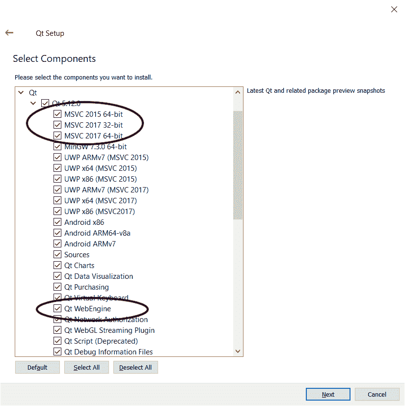

3.  打开 Qt 创建器，创建一个新的 Qt 小部件应用项目。选择使用 Visual C++ 编译器的工具包:

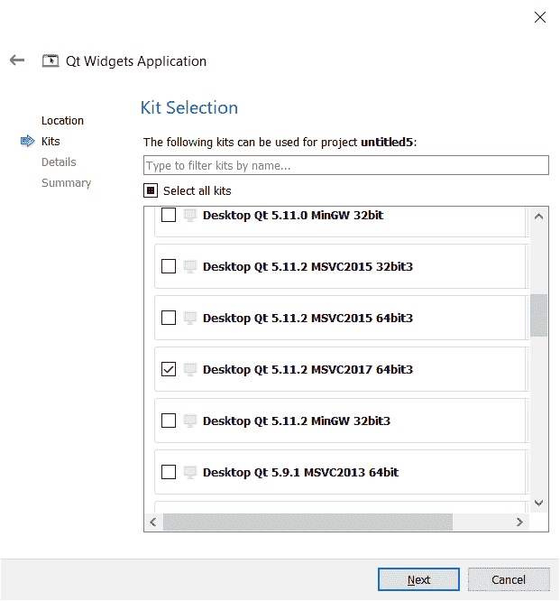

4.  打开您的项目文件(`.pro`)并将以下模块添加到您的项目中:

```cpp
QT += core gui webengine webenginewidgets
```

5.  打开`mainwindow.ui`并删除菜单栏、主工具栏和状态栏对象，因为我们在这个项目中不需要这些对象:


6.  在画布上放置两个水平布局，然后在顶部放置一个线条编辑小部件和一个布局按钮:


7.  选择画布，然后单击位于编辑器顶部的“垂直布局”按钮:


8.  布局将扩展，并遵循主窗口的大小。基于水平布局的宽度，线编辑也将水平扩展:


9.  在线编辑的左侧添加两个按钮。我们将使用这两个按钮在页面历史之间前后移动。在主窗口的底部添加一个进度条小部件，这样我们就可以知道页面是已经完成加载还是仍在进行中。此时，我们不必担心中间的水平布局，因为稍后我们将在*步骤 16* 使用 C++ 代码向其中添加 webview，空间将被占用:

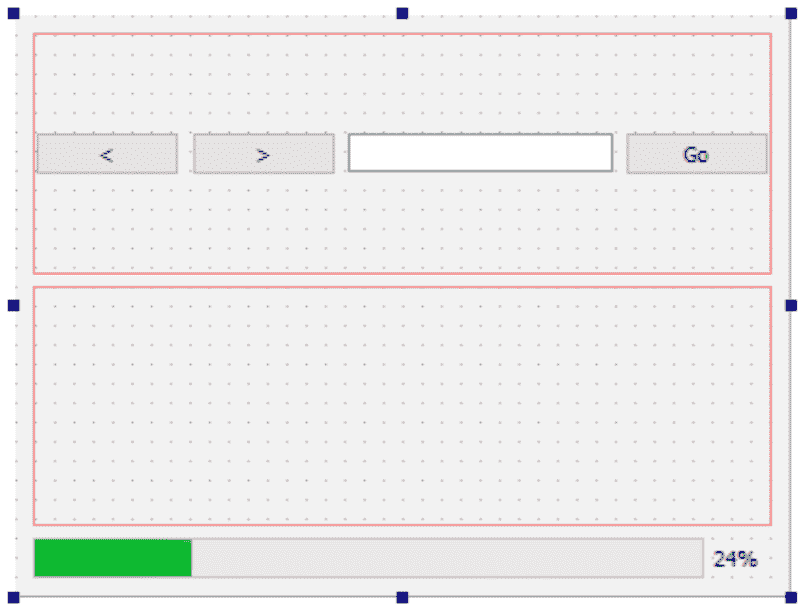

10.  右键单击其中一个按钮并选择转到插槽…，然后选择单击()并单击确定。在`mainwindow.h`和`mainwindow.cpp`会自动为你创建一个槽功能。对所有其他按钮也重复此步骤。
11.  右键单击编辑行并选择转到插槽…，然后选择返回按下()并单击确定。现在将在`mainwindow.h`和`mainwindow.cpp`中为您自动创建另一个插槽功能。
12.  让我们跳到`mainwindow.h`。我们需要做的第一件事就是在`mainwindow.h`中添加以下表头:

```cpp
#include <QtWebEngineWidgets/QtWebEngineWidgets>
```

13.  在类析构函数下声明`loadUrl()`函数:

```cpp
public:
    explicit MainWindow(QWidget *parent = 0);
    ~MainWindow();
    void loadUrl();
```

14.  在`mainwindow.h`中添加一个名为`loading()`的自定义槽函数:

```cpp
private slots:
    void on_goButton_clicked();
    void on_address_returnPressed();
    void on_backButton_clicked();
    void on_forwardButton_clicked();
    void loading(int progress);
```

15.  声明一个`QWebEngineView`对象，称之为`webview`:

```cpp
private:
    Ui::MainWindow *ui;
    QWebEngineView* webview;
```

16.  打开`mainwindow.cpp`文件，启动网络引擎视图。将其添加到第二个水平布局，并将其`loadProgress()`信号连接到我们刚刚添加到`mainwindow.h`的`loading()`插槽功能:

```cpp
MainWindow::MainWindow(QWidget *parent) :
QMainWindow(parent),
ui(new Ui::MainWindow) {
    ui->setupUi(this);
    webview = new QWebEngineView;
    ui->horizontalLayout_2->addWidget(webview);
    connect(webview, QWebEngineView::loadProgress, this, MainWindow::loading);
}
```

17.  声明调用`loadUrl()`函数时会发生什么:

```cpp
void MainWindow::loadUrl() {
    QUrl url = QUrl(ui->address->text());
    url.setScheme("http");
    webview->page()->load(url);
}
```

18.  点击开始按钮或按下进入 T2 键，调用开始功能:

```cpp
void MainWindow::on_goButton_clicked() {
    loadUrl();
}
void MainWindow::on_address_returnPressed() {
    loadUrl();
}
```

19.  至于另外两个按钮，我们将要求`webview`加载上一页或下一页，如果它在历史堆栈中可用的话:

```cpp
void MainWindow::on_backButton_clicked() {
    webview->back();
}
void MainWindow::on_forwardButton_clicked() {
    webview->forward();
}
```

20.  加载网页时更改`progressBar`的值:

```cpp
void MainWindow::loading(int progress) {
    ui->progressBar->setValue(progress);
}
```

21.  立即构建并运行该程序，您将获得一个非常基本但功能强大的网络浏览器:


# 它是如何工作的…

旧的 webview 系统基于苹果的 WebKit 引擎，仅在 Qt 5.5 及其前身中提供。从 5.6 开始，WebKit 被 Qt 彻底抛弃，取而代之的是谷歌的 Chromium 引擎。API 已经完全改变，因此一旦迁移到 5.6，所有与 Qt WebKit 相关的代码都将无法正常工作。如果您是 Qt 新手，建议您跳过 WebKit，学习 WebEngine API，因为它正在成为 Qt 的新标准。

If you have used Qt's WebKit in the past, this webpage teaches you how to port your old code over to Web Engine: [https://wiki.qt.io/Porting_from_QtWebKit_to_QtWebEngine](https://wiki.qt.io/Porting_from_QtWebKit_to_QtWebEngine).

在*步骤 16* 中，我们将属于 webview widget 的`loadProgress()`信号连接到`loading()`槽功能。在*步骤 17* 中，当网页浏览器正在加载您通过调用`QWebEnginePage::load()`请求的网页时，该信号将被自动调用。如果需要，也可以连接`loadStarted()`和`loadFinished()`信号。

在*步骤 17* 中，我们使用`QUrl`类将行编辑获得的文本转换为网址格式。默认情况下，如果我们不指定 URL 方案(HTTP、HTTPS、FTP 等)，我们插入的地址将指向本地路径。如果我们给了它`packtpub.com`而不是`http://packtpub.com`，我们可能无法加载页面。因此，我们通过调用`QUrl::setScheme()`为其手动指定一个 URL 方案。这将确保在将地址传递给 webview 之前，该地址的格式正确。

# 还有更多…

如果您正在运行 Qt 5.6 或更高版本，并且由于某种原因您需要项目的 WebKit 模块(通常用于维护旧项目)，您可以从 GitHub 获取模块代码并自行构建:[https://github.com/qt/qtwebkit](https://github.com/qt/qtwebkit)。

# 使用网络视图和网络设置

在本食谱中，我们将深入研究 Qt 的网络引擎中可用的功能，并探索我们可以用来定制网络视图的设置。我们将使用前面示例中的源文件，并向其中添加更多代码。

# 怎么做…

让我们探索一下 Qt 网络引擎的一些基本特性:

1.  打开`mainwindow.ui`，在进度条下添加垂直布局。向垂直布局添加纯文本编辑小部件(在输入小部件类别下)和按钮。将按钮显示更改为`Load HTML`，并将纯文本编辑小部件的明文属性设置如下:

```cpp
</img>
<h1>Hello World!</h1>
<h3>This is our custom HTML page.</h3>
<script>alert("Hello!");</script>
```

这是在您将代码添加到纯文本编辑的顶部后应该看到的样子:

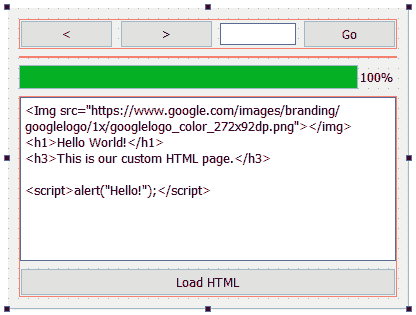

2.  转到文件|新建文件或项目。将弹出一个窗口，要求您选择一个文件模板。选择 Qt 类别下的 Qt 资源文件，然后点击选择…按钮。键入所需的文件名，然后单击“下一步”，接着单击“完成”:

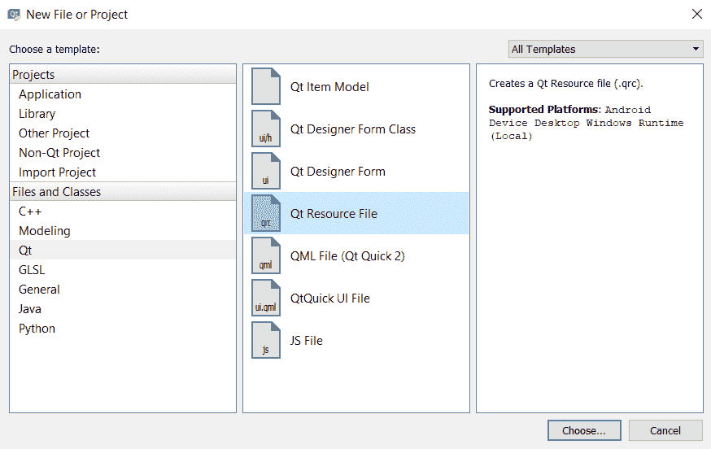

3.  通过在“项目”窗格中右键单击资源文件并选择“在编辑器中打开”选项，打开我们刚刚创建的资源文件。编辑器打开文件后，单击添加按钮，然后单击添加前缀。将前缀设置为`/`并点击添加，然后点击添加文件。将出现文件浏览器窗口，我们将选择`tux.png`图像文件并单击打开。图像文件现在被添加到我们的项目中，一旦编译完成，它将被嵌入到可执行文件(`.exe`)中:

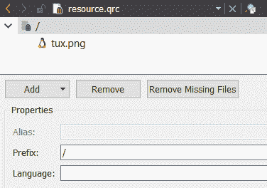

4.  打开`mainwindow.h`并添加以下标题:

```cpp
#include <QMainWindow>
#include <QtWebEngineWidgets/QtWebEngineWidgets>
#include <QDebug>
#include <QFile>
```

5.  确保以下函数和指针已在`mainwindow.h`中声明:

```cpp
public:
    explicit MainWindow(QWidget *parent = 0);
    ~MainWindow();
    void loadUrl();
private slots:
    void on_goButton_clicked();
    void on_address_returnPressed();
    void on_backButton_clicked();
    void on_forwardButton_clicked();
    void startLoading();
    void loading(int progress);
    void loaded(bool ok);
    void on_loadHtml_clicked();
private:
    Ui::MainWindow *ui;
    QWebEngineView* webview;
```

6.  打开`mainwindow.cpp`，将以下代码添加到类构造函数中:

```cpp
MainWindow::MainWindow(QWidget *parent) :
QMainWindow(parent),
ui(new Ui::MainWindow) {
    ui->setupUi(this);
    webview = new QWebEngineView;
    ui->horizontalLayout_2->addWidget(webview);
    //webview->page()->settings()->setAttribute(QWebEngineSettings::JavascriptEnabled, false);
    //webview->page()->settings()->setAttribute(QWebEngineSettings::AutoLoadImages, false);
    //QString fontFamily = webview->page()->settings()->fontFamily(QWebEngineSettings::SerifFont);
    QString fontFamily = webview->page()->settings()->fontFamily(QWebEngineSettings::SansSerifFont);
    int fontSize = webview->page()->settings()->fontSize(QWebEngineSettings::MinimumFontSize);
    QFont myFont = QFont(fontFamily, fontSize);
    webview->page()->settings()->setFontFamily(QWebEngineSettings::StandardFont, myFont.family());
```

7.  加载图像文件并将其放在 webview 上:

```cpp
    QFile file("://tux.png");
    if (file.open(QFile::ReadOnly)) {
        QByteArray data = file.readAll();
        webview->page()->setContent(data, "img/png");
    } else {
        qDebug() << "File cannot be opened.";
    }
    connect(webview, QWebEngineView::loadStarted, this, MainWindow::startLoading()));
    connect(webview, QWebEngineView::loadProgress, this, MainWindow::loading(int)));
    connect(webview, QWebEngineView::loadFinished, this, MainWindow::loaded(bool)));
}
```

8.  `MainWindow::loadUrl()`功能与*介绍 Qt 网络引擎*部分的前一个例子相同，在加载页面之前将网址方案设置为 HTTP:

```cpp
void MainWindow::loadUrl() {
    QUrl url = QUrl(ui->address->text());
    url.setScheme("http");
    webview->page()->load(url);
}
```

9.  以下功能也是如此，也与*介绍 Qt 网络引擎*部分中的前一个示例相同:

```cpp
void MainWindow::on_goButton_clicked() {
    loadUrl();
}
void MainWindow::on_address_returnPressed() {
    loadUrl();
}
void MainWindow::on_backButton_clicked() {
    webview->back();
}
void MainWindow::on_forwardButton_clicked() {
    webview->forward();
}
```

10.  增加`MainWindow::startLoading()`和`MainWindow::loaded()`槽功能，由`loadStarted()`和`loadFinished()`信号调用。这两个功能基本上在页面开始加载时显示进度条，在页面加载完成时隐藏进度条:

```cpp
void MainWindow::startLoading() {
    ui->progressBar->show();
}
void MainWindow::loading(int progress) {
    ui->progressBar->setValue(progress);
}
void MainWindow::loaded(bool ok) {
    ui->progressBar->hide();
}
```

11.  点击`Load HTML`按钮，调用`webview->loadHtml()`将纯文本转换为 HTML 内容:

```cpp
void MainWindow::on_loadHtml_clicked() {
    webview->setHtml(ui->source->toPlainText());
}
```

12.  构建并运行程序，您应该会看到如下内容:

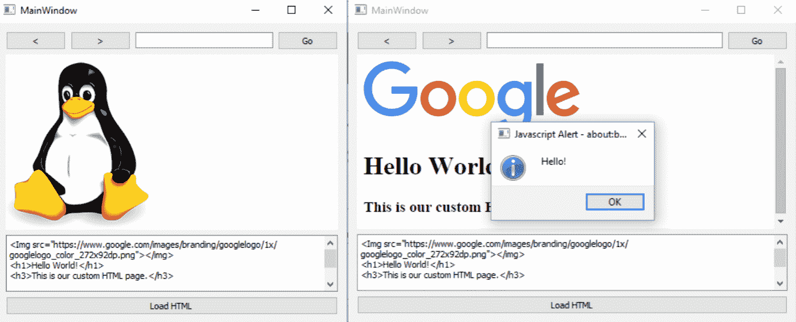

# 它是如何工作的…

在本例中，我们使用 C++ 加载了一个图像文件，并将其设置为 WebView 的默认内容(而不是一个空白页)。我们可以通过在启动时加载一个带有图像的默认 HTML 文件来获得同样的结果。

类构造函数中的一些代码已被注释掉。您可以删除双斜线`//`，看看它有什么不同–JavaScript 警报将不再出现(因为 JavaScript 被禁用)，图像将不再出现在您的网络视图中。

另外一个可以尝试的就是将字体家族从`QWebEngineSettings::SansSerifFont`改为`QWebEngineSettings::SerifFont`。您会注意到 webview 中出现的字体略有不同:


通过点击`Load HTML`按钮，我们要求 WebView 将纯文本编辑小部件的内容视为 HTML 代码，并将其加载为 HTML 页面。你可以用它来制作一个由 Qt 驱动的简单的 HTML 编辑器！

# 在项目中嵌入谷歌地图

在这个食谱中，我们将学习如何通过 Qt 的网络引擎模块将**谷歌地图**嵌入到我们的项目中。这个例子不太关注 Qt 和 C++，而是关注 HTML 代码中的**谷歌地图应用编程接口**。

# 怎么做…

让我们按照以下步骤创建一个显示谷歌地图的程序:

1.  创建一个新的 Qt 小部件应用项目，并删除状态栏、菜单栏和主工具栏。
2.  打开您的项目文件(`.pro`)并将以下模块添加到您的项目中:

```cpp
QT += core gui webengine webenginewidgets
```

3.  打开`mainwindow.ui`并在画布上添加垂直布局。然后，选择画布并点按画布顶部的“垂直布局”按钮。您将获得以下信息:

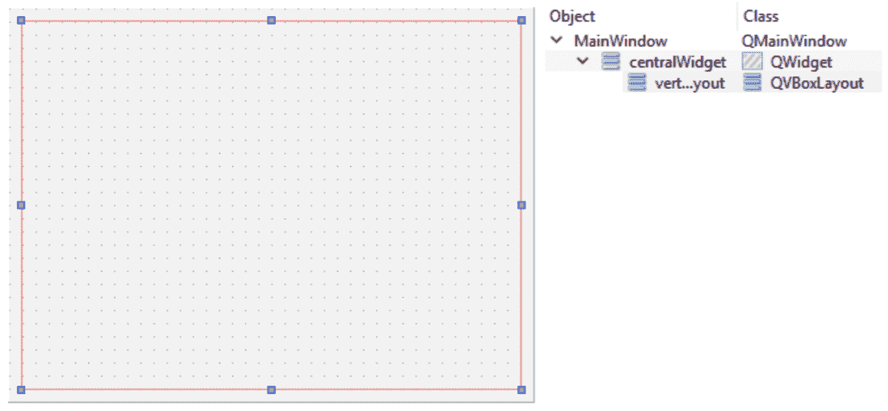

4.  打开`mainwindow.cpp`并在源代码顶部添加以下标题:

```cpp
#include <QtWebEngineWidgets/QWebEngineView>
#include <QtWebEngineWidgets/QWebEnginePage>
#include <QtWebEngineWidgets/QWebEngineSettings>
```

5.  将以下代码添加到`MainWindow`构造函数中:

```cpp
MainWindow::MainWindow(QWidget *parent) :
QMainWindow(parent),
ui(new Ui::MainWindow) {
    ui->setupUi(this);
    QWebEngineView* webview = new QWebEngineView;
    QUrl url = QUrl("qrc:/map.html");
    webview->page()->load(url);
    ui->verticalLayout->addWidget(webview);
}
```

6.  转到文件|新文件或项目，并创建一个 Qt 资源文件(`.qrc`)。我们将在我们的项目中添加一个名为`map.html`的 HTML 文件:

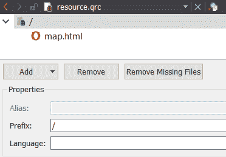

7.  用你喜欢的文本编辑器打开`map.html`。不建议使用 Qt Creator 打开一个 HTML 文件，因为它没有为 HTML 语法提供任何颜色编码。
8.  通过声明重要标签开始编写 HTML 代码，如`<html>`、`<head>`、`<body>`:

```cpp
<!DOCTYPE html>
<html>
    <head>
    </head>
    <body ondragstart="return false">
    </body>
</html>
```

9.  在正文中添加一个`<div>`标签，并将其 ID 设置为`map-canvas`:

```cpp
<body ondragstart="return false">
    <div id="map-canvas" />
</body>
```

10.  在 HTML 文档的头部添加以下代码:

```cpp
<meta name="viewport" content="initial-scale=1.0, user-scalable=no" />
<style type="text/css">
    html { height: 100% }
    body { height: 100%; margin: 0; padding: 0 }
    #map-canvas { height: 100% }
</style>
<script type="text/javascript" src="https://maps.googleapis.com/maps/api/js?key=YOUR_KEY_HERE&libraries=drawing"></script>
```

11.  将下面的代码添加到 HTML 文档的头部，在我们上一步插入的代码下面:

```cpp
<script type="text/javascript">
    var map;
    function initialize() {
        // Add map
        var mapOptions = {
            center: new google.maps.LatLng(40.705311, -74.2581939), zoom: 6
        };
        map = new google.maps.Map(document.getElementById("map-canvas"),mapOptions);
        // Add event listener
        google.maps.event.addListener(map, 'zoom_changed', function() {
            //alert(map.getZoom());
        });
```

12.  创建标记并将其放置在地图上:

```cpp
        // Add marker
        var marker = new google.maps.Marker({
            position: new google.maps.LatLng(40.705311, -74.2581939), map: map, title: "Marker A",
        });
        google.maps.event.addListener (marker, 'click', function() {
            map.panTo(marker.getPosition());
        });
        marker.setMap(map);
```

13.  向地图添加多段线:

```cpp
        // Add polyline
        var points = [ new google.maps.LatLng(39.8543, -73.2183), new google.maps.LatLng(41.705311, -75.2581939), new google.maps.LatLng(40.62388, -75.5483) ];
        var polyOptions = {
            path: points,
            strokeColor: '#FF0000',
            strokeOpacity: 1.0,
            strokeWeight: 2
        };
        historyPolyline = new google.maps.Polyline(polyOptions);
        historyPolyline.setMap(map);
```

14.  添加多边形形状:

```cpp
        // Add polygon
        var points = [ new google.maps.LatLng(37.314166, -75.432), new google.maps.LatLng(40.2653, -74.4325), new google.maps.LatLng(38.8288, -76.5483) ];
        var polygon = new google.maps.Polygon({
            paths: points,
            fillColor: '#000000',
            fillOpacity: 0.2,
            strokeWeight: 3,
            strokeColor: '#fff000',
        });
        polygon.setMap(map);
```

15.  创建图形管理器并将其应用于地图:

```cpp
        // Setup drawing manager
        var drawingManager = new google.maps.drawing.DrawingManager();
        drawingManager.setMap(map);
    }
    google.maps.event.addDomListener(window, 'load', initialize);
</script>
```

16.  编译并运行项目。您应该会看到以下内容:

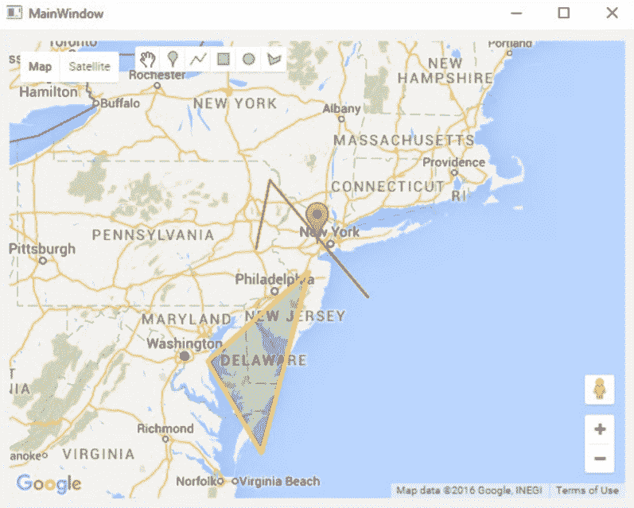

# 它是如何工作的…

谷歌允许你使用他们的 JavaScript 库在网页中嵌入谷歌地图，这个库叫做**谷歌地图应用编程接口**。通过 Qt 的 WebEngine 模块，我们可以将一个 HTML 文件加载到我们的 webview 小部件中，从而将谷歌地图嵌入到我们的 C++ 项目中，该小部件使用谷歌地图 API。这种方法的唯一缺点是，当没有互联网连接时，我们无法加载地图。

只要谷歌允许，你的网站可以调用谷歌应用编程接口。如果你的计划是为了更大的流量，选择免费的应用编程接口。

前往[https://console.developers.google.com](https://console.developers.google.com)获取一个免费密钥，用你从谷歌获得的 API 密钥替换 JavaScript 源代码路径中的`YOUR_KEY_HERE`。

我们必须定义一个`<div>`对象，作为地图的容器。然后，当我们初始化地图时，我们指定`<div>`对象的标识，这样谷歌地图应用编程接口就知道嵌入地图时要寻找哪个 HTML 元素。默认情况下，我们将地图的中心设置为纽约的坐标，并将默认缩放级别设置为`6`。然后，我们添加一个事件侦听器，当地图的缩放级别发生变化时，它就会被触发。从代码中删除双斜线`//`，以查看它的运行情况。

之后，我们通过 JavaScript 在地图上添加了一个标记。标记还附带一个事件监听器，点击标记时会触发`panTo()`功能。它基本上将地图视图平移到已单击的标记。虽然我们已经将绘图管理器添加到地图中(地图和卫星按钮旁边的图标按钮)，允许用户在地图上绘制任何类型的形状，但是也可以使用 JavaScript 手动添加形状，类似于我们在*步骤 12* 中添加标记的方式，在*如何操作中...*节。

最后，你可能已经注意到标题被添加到`mainwindow.cpp`而不是`mainwindow.h`。这完全没问题，除非你在`mainwindow.h`中声明类指针——然后你必须在其中包含那些头。

# 从 JavaScript 调用 C++ 函数

在这个食谱中，我们将学习如何使用我们的知识，并使用 Qt 和 MySQL 创建一个功能登录屏幕。

# 怎么做…

让我们学习如何使用以下步骤从 JavaScript 调用 C++ 函数:

1.  创建一个 Qt 小部件应用项目。打开项目文件(`.pro`)并向项目中添加以下模块:

```cpp
QT += core gui webengine webenginewidgets
```

2.  打开`mainwindow.ui`并删除主工具栏、菜单栏和状态栏，因为在这个示例程序中我们不需要这些。

3.  向画布添加垂直布局，然后选择画布，并点按画布顶部的“垂直布局”按钮。在垂直布局的顶部添加一个文本标签，并将其文本设置为`Hello!`。通过如下设置样式表属性来增大字体:

```cpp
font: 75 26pt "MS Shell Dlg 2";
```

这是我们将字体属性应用到样式表后的样子:


4.  转到文件|新建文件或项目并创建资源文件。将一个空的 HTML 文件以及所有属于 **jQuery** 、**booster**和 **Font Awesome** 的 JavaScript 文件、CSS 文件、字体文件等添加到您的项目资源中:

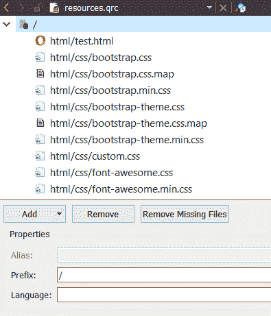

5.  打开你的 HTML 文件，在这种情况下叫做`test.html`。将所有必要的 JavaScript 和 CSS 文件链接到 HTML 源代码，在`<head>`标签之间:

```cpp
<!DOCTYPE html>
<html>
    <head>
        <script src="qrc:///qtwebchannel/qwebchannel.js"></script>
        <script src="js/jquery.min.js"></script>
        <script src="js/bootstrap.js"></script>
        <link rel="stylesheet" type="text/css" href="css/bootstrap.css">
        <link rel="stylesheet" type="text/css" href="css/font-awesome.css">
    </head>
    <body>
    </body>
</html>
```

6.  将以下 JavaScript 添加到`<head>`元素中，包装在`<script>`标签之间:

```cpp
<script>
    $(document).ready(function() {
        new QWebChannel(qt.webChannelTransport, function(channel) {
            mainWindow = channel.objects.mainWindow;
        });
        $("#login").click(function(e) {
            e.preventDefault();
            var user = $("#username").val();
            var pass = $("#password").val();
            mainWindow.showLoginInfo(user, pass);
        });
```

7.  点击`changeText`按钮时打印`Good bye!`，代码如下:

```cpp
        $("#changeText").click(function(e) {
            e.preventDefault();
            mainWindow.changeQtText("Good bye!");
        });
    });
</script>
```

8.  向`<body>`元素添加以下代码:

```cpp
<div class="container-fluid">
    <form id="example-form" action="#" class="container-fluid">
        <div class="form-group">
            <div class="col-md-12"><h3>Call C++ Function from Javascript</h3></div>
            <div class="col-md-12">
                <div class="alert alert-info" role="alert">
                    <i class="fa fa-info-circle"></i>
                    <span id="infotext">Click "Login" to send username and password variables to C++. Click "Change Cpp Text" to change the text label on Qt GUI.</span>
                </div>
            </div>
```

9.  继续前面的代码，这次我们为`username`和`password`创建了输入字段，底部有两个按钮，分别叫做`Login`和`Change Cpp Text`:

```cpp
            <div class="col-md-12">
                <label>Username:</label>
                <input id="username" type="text"><p />
            </div>
            <div class="col-md-12">
                <label>Password:</label> <input id="password" type="password"><p />
            </div>
            <div class="col-md-12">
                <button id="login" class="btn btn-success" type="button"><i class="fa fa-check"></i> Login</button> <button id="changeText" class="btn btn-primary" type="button"> <i class="fa fa-pencil"></i> Change Cpp Text</button>
            </div>
        </div>
    </form>
</div>
```

10.  打开`mainwindow.h`，将以下公共功能添加到`MainWindow`类中:

```cpp
public:
    explicit MainWindow(QWidget *parent = 0);
    ~MainWindow();
    Q_INVOKABLE void changeQtText(QString newText);
    Q_INVOKABLE void showLoginInfo(QString user, QString pass);
```

11.  打开`mainwindow.cpp`并在源代码顶部添加以下标题:

```cpp
#include <QtWebEngineWidgets/QWebEngineView>
#include <QtWebChannel/QWebChannel>
#include <QMessageBox>
```

12.  将以下代码添加到`MainWindow`构造函数中:

```cpp
MainWindow::MainWindow(QWidget *parent) :
QMainWindow(parent),
ui(new Ui::MainWindow) {
    qputenv("QTWEBENGINE_REMOTE_DEBUGGING", "1234");
    ui->setupUi(this);
    QWebEngineView* webview = new QWebEngineView();
    ui->verticalLayout->addWidget(webview);
    QWebChannel* webChannel = new QWebChannel();
    webChannel->registerObject("mainWindow", this);
    webview->page()->setWebChannel(webChannel);
    webview->page()->load(QUrl("qrc:///html/test.html"));
}
```

13.  声明调用`changeQtText()`和`showLoginInfo()`时会发生什么:

```cpp
void MainWindow::changeQtText(QString newText) {
    ui->label->setText(newText);
}
void MainWindow::showLoginInfo(QString user, QString pass) {
    QMessageBox::information(this, "Login info", "Username is " + user + " and password is " + pass);
}
```

14.  编译并运行程序；您应该会看到类似于下面截图的内容。如果你点击更改 Cpp 文本按钮，你好！顶部将改为再见！如果您单击登录按钮，将出现一个消息框，向您显示您在用户名和密码输入字段中键入的内容:

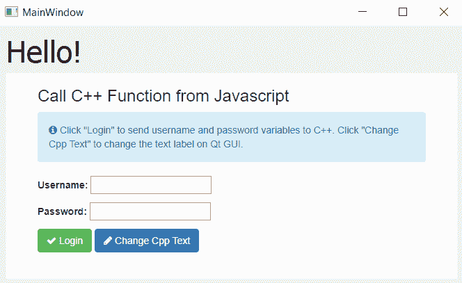

# 它是如何工作的…

在这个例子中，我们使用了两个 JavaScript 库:jQuery 和 Bootstrap。我们还使用了一个名为 Font Awesome 的标志性字体包。这些第三方插件被用来使 HTML 用户界面更加有趣，并对不同的屏幕分辨率做出响应。我们还使用 jQuery 来检测文档的就绪状态，以及获取输入字段的值。

You can download jQuery from [https://jquery.com/download](https://jquery.com/download), Bootstrap from [http://getbootstrap.com/getting-started/#download](http://getbootstrap.com/getting-started/#download), and Font Awesome from [http://fontawesome.io](http://fontawesome.io).

Qt 的 WebEngine 使用了一种叫做 **WebChannel** 的机制，这种机制可以实现 C++ 程序和 HTML 页面之间的对等通信。网络引擎模块提供了一个 JavaScript 库，使得集成变得更加容易。默认情况下，JavaScript 嵌入到项目的资源中，因此不需要手动将其导入到项目中。您只需通过调用以下命令将其包含在您的 HTML 页面中:

```cpp
<script src="qrc:///qtwebchannel/qwebchannel.js"></script>
```

一旦包含了`qwebchannel.js`，就可以初始化`QWebChannel`类，并将我们之前在 C++ 中注册的 Qt 对象分配给一个 JavaScript 变量。

在 C++ 中，这是按如下方式完成的:

```cpp
QWebChannel* webChannel = new QWebChannel();
webChannel->registerObject("mainWindow", this);
webview->page()->setWebChannel(webChannel);
```

然后在 JavaScript 中，这是按如下方式完成的:

```cpp
new QWebChannel(qt.webChannelTransport, function(channel) {
    mainWindow = channel.objects.mainWindow;
});
```

你可能想知道这句话是什么意思:

```cpp
qputenv("QTWEBENGINE_REMOTE_DEBUGGING", "1234");
```

Qt 的 WebEngine 使用远程调试方法来检查 JavaScript 错误和其他问题。数字`1234`定义了您想要用于远程调试的端口号。

启用远程调试后，打开基于 Chromium 的网页浏览器即可进入调试页面，如**谷歌 Chrome** (这在**火狐**等浏览器中无法使用)，输入`http://127.0.0.1:1234`。然后，您将看到如下页面:


第一页将显示你的程序中当前运行的所有 HTML 页面，在这种情况下是`test.html`。点击页面链接，它会把你带到另一个页面进行检查。您可以用它来检查 CSS 错误、JavaScript 错误和丢失的文件。请注意，一旦您的程序没有错误并准备好部署，就应该禁用远程调试。这是因为远程调试需要时间来初始化，并且会增加程序的启动时间。

如果要从 JavaScript 调用 C++ 函数，必须将`Q_INVOKABLE`宏放在函数声明的前面；否则，它将不起作用:

```cpp
Q_INVOKABLE void changeQtText(QString newText);
```

# 从 C++ 调用 JavaScript 函数

在之前的食谱中，我们学习了如何通过 Qt 的 **WebChannel** 系统从 JavaScript 调用 C++ 函数。在这个例子中，我们将尝试做相反的事情:从 C++ 代码中调用 JavaScript 函数。

# 怎么做…

我们可以通过以下步骤从 C++ 调用 JavaScript 函数:

1.  创建一个新的 Qt 小部件应用项目，并将`webengine`和`webenginewidgets`模块添加到您的项目中。
2.  打开`mainwindow.ui`并移除主工具栏、菜单栏和状态栏。
3.  向画布添加垂直布局和水平布局。选择画布并单击垂直布局。确保水平布局位于垂直布局的底部。
4.  向水平布局添加两个按钮；一个叫做更改 HTML 文本，另一个叫做播放 UI 动画。右键单击其中一个按钮，然后单击转到插槽。会弹出一个窗口，让你选择一个信号。选择单击的()选项，然后单击确定。Qt 会自动给你的源代码添加一个槽函数。对另一个按钮重复此步骤:

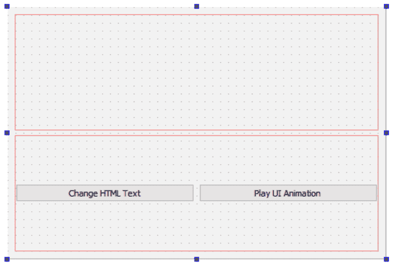

5.  打开`mainwindow.h`并添加以下标题:

```cpp
#include <QtWebEngineWidgets/QWebEngineView>
#include <QtWebChannel/QWebChannel>
#include <QMessageBox>
```

6.  声明名为`webview`的`QWebEngineView`对象的类指针:

```cpp
public:
    explicit MainWindow(QWidget *parent = 0);
    ~MainWindow();
    QWebEngineView* webview;
```

7.  打开`mainwindow.cpp`并向`MainWindow`构造函数添加以下代码:

```cpp
MainWindow::MainWindow(QWidget *parent) :
QMainWindow(parent),
ui(new Ui::MainWindow) {
    //qputenv("QTWEBENGINE_REMOTE_DEBUGGING", "1234");
    ui->setupUi(this);
    webview = new QWebEngineView();
    ui->verticalLayout->addWidget(webview);
    QWebChannel* webChannel = new QWebChannel();
    webChannel->registerObject("mainWindow", this);
    webview->page()->setWebChannel(webChannel);
    webview->page()->load(QUrl("qrc:///html/test.html"));
}
```

8.  定义当点击`changeHtmlText`按钮和`playUIAnimation`按钮时会发生什么:

```cpp
void MainWindow::on_changeHtmlTextButton_clicked() {
    webview->page()->runJavaScript("changeHtmlText('Text has been replaced by C++!');");
}

void MainWindow::on_playUIAnimationButton_clicked() {
    webview->page()->runJavaScript("startAnim();");
}
```

9.  让我们转到文件|新文件或项目，为我们的项目创建一个资源文件。选择 Qt 类别下的 Qt 资源文件，然后单击选择....插入所需的文件名，单击“下一步”，然后单击“完成”。
10.  向项目资源中添加一个空的 HTML 文件和所有必需的附加组件(jQuery、Bootstrap 和 Font Awesome)。将`tux.png`图像文件也添加到资源文件中，因为我们将在*步骤 14* 中使用它。

11.  打开我们刚刚创建的 HTML 文件，将其添加到项目资源中；在我们的例子中，它被称为`test.html`。向文件中添加以下 HTML 代码:

```cpp
<!DOCTYPE html>
<html>
    <head>
        <script src="qrc:///qtwebchannel/qwebchannel.js"></script>
        <script src="js/jquery.min.js"></script>
        <script src="js/bootstrap.js"></script>
        <link rel="stylesheet" type="text/css" href="css/bootstrap.css">
        <link rel="stylesheet" type="text/css" href="css/font-awesome.css">
    </head>
    <body>
    </body>
</html>
```

12.  将以下包装在`<script>`标签中的 JavaScript 代码添加到我们的 HTML 文件的`<head>`元素中:

```cpp
<script>
    $(document).ready(function() {
        $("#tux").css({ opacity:0, width:"0%", height:"0%" });
        $("#listgroup").hide();
        $("#listgroup2").hide();
        new QWebChannel(qt.webChannelTransport, function(channel) {
            mainWindow = channel.objects.mainWindow;
        });
    });
    function changeHtmlText(newText) {
        $("#infotext").html(newText);
    }
```

13.  定义`startAnim()`功能:

```cpp
    function startAnim() {
        // Reset
        $("#tux").css({ opacity:0, width:"0%", height:"0%" });
        $("#listgroup").hide();
        $("#listgroup2").hide();
        $("#tux").animate({ opacity:1.0, width:"100%", height:"100%" }, 1000, function() {
            // tux animation complete
            $("#listgroup").slideDown(1000, function() {
                // listgroup animation complete
                $("#listgroup2").fadeIn(1500);
            });
        });
    }
</script>
```

14.  将以下代码添加到我们的 HTML 文件的`<body>`元素中:

```cpp
<div class="container-fluid">
    <form id="example-form" action="#" class="container-fluid">
        <div class="form-group">
            <div class="col-md-12"><h3>Call Javascript Function from C++ </h3></div>
            <div class="col-md-12">
                <div class="alert alert-info" role="alert"><i class="fa fa-info-circle"></i> <span id="infotext"> Change this text using C++.</span></div>
            </div>
            <div class="col-md-2">
                </img>
            </div>
```

15.  继续编写下面的代码，我们已经在其中添加了一个列表:

```cpp
            <div class="col-md-5">
                <ul id="listgroup" class="list-group">
                    <li class="list-group-item">Cras justoodio</li>
                    <li class="list-group-item">Dapibus acfacilisis in</li>
                    <li class="list-group-item">Morbi leorisus</li>
                    <li class="list-group-item">Porta acconsectetur ac</li>
                    <li class="list-group-item">Vestibulum ateros</li>
                </ul>
            </div>
            <div id="listgroup2" class="col-md-5">
                <a href="#" class="list-group-item active">
                    <h4 class="list-group-item-heading">Item heading</h4>
                    <p class="list-group-item-text">Cras justo odio</p>
                </a>
```

16.  当我们将剩余的项目添加到第二个列表时，代码继续:

```cpp
                <a href="#" class="list-group-item">
                    <h4 class="list-group-item-heading">Item heading</h4>
                    <p class="list-group-item-text">Dapibus ac facilisis in</p>
                </a>
                <a href="#" class="list-group-item">
                    <h4 class="list-group-item-heading">Item heading</h4>
                    <p class="list-group-item-text">Morbi leo risus</p>
                </a>
            </div>
        </div>
    </form>
</div>
```

17.  构建和运行程序；您应该会得到类似于下面截图中的结果。当您单击“更改 HTML 文本”按钮时，信息文本位于顶部面板中。如果您单击“播放用户界面动画”按钮，企鹅图像以及两组小部件将一个接一个地出现，具有不同的动画:

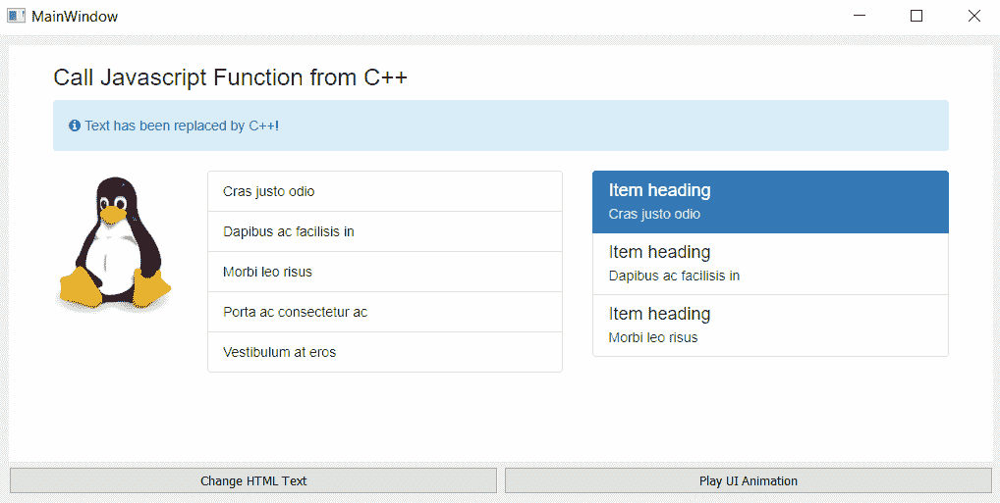

# 它是如何工作的…

这个例子类似于上一个在*从 JavaScript* 部分调用 C++ 函数的例子。一旦我们包含了**网络频道** JavaScript 库并启动了`QWebChannel`类，我们就可以通过调用`webview->page()->runJavascript("jsFunctionNameHere();")`从 C++ 中调用任何 JavaScript 函数。不要忘记将 C++ 中创建的网络频道也应用到网络视图的页面上；否则，它将无法与您的 HTML 文件中的`QWebChannel`类进行通信。

默认情况下，我们更改企鹅图片的 CSS 属性，将其不透明度设置为`0`，宽度设置为`0%`，高度设置为`0%`。我们还通过调用`hide()` jQuery 函数隐藏了两个列表组。单击“播放用户界面动画”按钮时，我们会再次重复这些步骤，以防动画之前已经播放过(也就是说，之前单击过同一个按钮)，然后我们会再次隐藏它们，以便回放动画。

jQuery 的一个强大功能是，您可以定义动画完成后会发生什么，这允许我们按顺序播放动画。在这个例子中，我们从企鹅图像开始，并在一秒钟(1000 毫秒)内将它的 CSS 属性插入到目标设置中。一旦完成，我们开始另一个动画，这使得第一个列表组在一秒钟内从上到下滑动。之后，我们运行第三个动画，使第二个列表组在 1.5 秒内不知从哪里淡入。

为了替换位于顶部面板的信息文本，我们创建了一个名为`changeHtmlText()`的 JavaScript 函数；在函数本身内部，我们通过引用其 ID 并调用`html()`来更改其内容，从而得到了 HTML 元素。