# 十三、性能优化

在本章中，我们将介绍以下食谱:

*   优化表单和 C++
*   剖析和优化 QML
*   渲染和动画

# 介绍

Qt 5 以其优化的性能而闻名。但是，如果您的代码写得不好，性能问题可能仍然会出现。在向用户发布软件之前，我们有很多方法可以识别这些问题并解决它们。

# 技术要求

本章的技术要求包括 Qt 5.11.2 MinGW 32 位、Qt Creator 4.8.2 和 Windows 10。

本章使用的所有代码都可以从以下 GitHub 链接下载:[https://GitHub . com/PacktPublishing/Qt5-CPP-GUI-编程-cook book-第二版/树/主/第 13 章](https://github.com/PacktPublishing/Qt5-CPP-GUI-Programming-Cookbook-Second-Edition/tree/master/Chapter13)。

查看以下视频，查看正在运行的代码:[http://bit.ly/2FrX5Ls](http://bit.ly/2FrX5Ls)

# 优化表单和 C++

了解如何优化用 C++ 构建的基于表单的 Qt 5 应用非常重要。最好的方法是学习如何衡量和比较不同的方法，并决定哪种方法最适合你。

# 怎么做...

让我们从以下步骤开始:

1.  让我们创建一个`Qt Widgets Application`项目并打开`mainwindow.cpp`。之后，在源代码顶部添加以下标题:

```cpp
#include <QPushButton>
#include <QGridLayout>
#include <QMessageBox>
#include <QTime>
#include <QDebug>
```

2.  创建一个`QGridLayout`对象，并将其父对象设置为`centralWidget`:

```cpp
MainWindow::MainWindow(QWidget *parent) : QMainWindow(parent), ui(new Ui::MainWindow)
{
    ui->setupUi(this);
 QGridLayout *layout = new QGridLayout(ui->centralWidget);
```

3.  创建一个`QTime`对象。我们将用它来衡量我们下一步行动的表现:

```cpp
QTime* time = new QTime;
time->start();
```

4.  我们将使用两个循环来填充网格布局的 600 个按钮，并在单击时将它们全部连接到一个 lambda 函数。然后，我们将测量经过的时间并打印出结果，如下所示:

```cpp
for (int i = 0; i < 40; ++ i) {
    for (int j = 0; j < 15; ++ j) {
        QPushButton* newWidget = new QPushButton();
        newWidget->setText("Button");
        layout->addWidget(newWidget, i, j);
        connect(newWidget, QPushButton::clicked,
        [this]() {
            QMessageBox::information(this, "Clicked", "Button has been clicked!");
        });
    }
}
qDebug() << "Test GUI:" << time->elapsed() << "msec";
```

5.  如果我们现在构建并运行这个项目，我们会看到一个窗口充满了很多按钮。当我们点击其中一个时，屏幕上会弹出一个消息框。在我的电脑上创建和布局主窗口上的所有 600 个按钮只花了大约 9 毫秒。当我们移动窗口或调整它的大小时，也没有性能问题，这非常令人印象深刻。它证明了 Qt 5 可以很好地处理这个问题。但是，请注意，您的用户可能使用的是较旧的机器，在设计用户界面时，您可能需要格外小心:

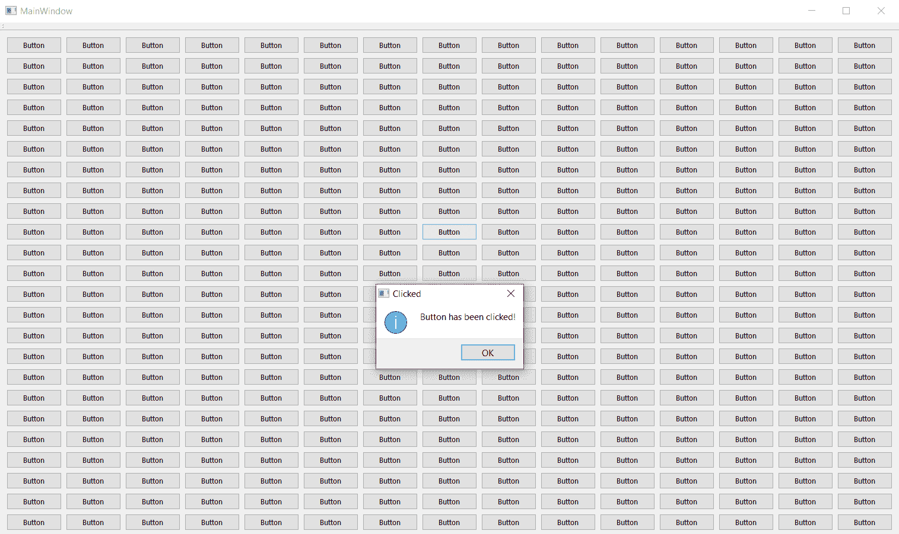

6.  让我们为每个按钮添加一个样式表，如下所示:

```cpp
QPushButton* newWidget = new QPushButton();
newWidget->setText("Button");
newWidget->setStyleSheet("background-color: blue; color: white;");
layout->addWidget(newWidget, i, j);
```

7.  再次构建并运行程序。这一次，设置图形用户界面大约花了 75 毫秒。这意味着样式表确实对程序的性能有一些影响:

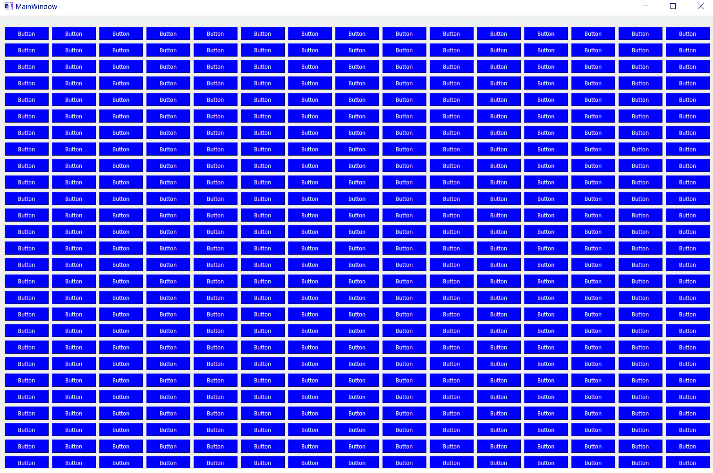

8.  完成这些之后，让我们对不同类型的 C++ 容器进行一些性能测试。打开`main.cpp`并添加以下标题:

```cpp
#include "mainwindow.h"
#include <QApplication>
#include <QDebug>
#include <QTime>
#include <vector>
#include <QVector>
```

9.  在`main()`功能之前创建一个`testArray()`功能:

```cpp
int testArray(int count) {
    int sum = 0;
    int *myarray = new int[count];
    for (int i = 0; i < count; ++ i)
        myarray[i] = i;
    for (int j = 0; j < count; ++ j)
        sum += myarray[j];
    delete [] myarray;
    return sum;
}
```

10.  创建另一个名为`testVector()`的函数，如下所示:

```cpp
int testVector(int count) {
    int sum = 0;
    std::vector<int> myarray;
    for (int i = 0; i < count; ++ i)
        myarray.push_back(i);
    for (int j = 0; j < count; ++ j)
        sum += myarray.at(j);
    return sum;
}
```

11.  完成后，继续创建另一个名为`testQtVector()`的函数:

```cpp
int testQtVector(int count) {
    int sum = 0;
    QVector<int> myarray;
    for (int i = 0; i < count; ++ i)
        myarray.push_back(i);
    for (int j = 0; j < count; ++ j)
        sum += myarray.at(j);
    return sum;
}
```

12.  在`main()`函数中，定义一个`QTime`对象和一个名为`lastElapse` **的整数变量:**

```cpp
int main(int argc, char *argv[]) { 
    QApplication a(argc, argv);
    MainWindow w;
    w.show();

 QTime* time = new QTime;
 time->start();
 int lastElapse = 0;
```

13.  我们将调用我们在前面步骤中创建的三个函数来测试它们的性能:

```cpp
int result = testArray(100000000);
qDebug() << "Array:" << (time->elapsed() - lastElapse) << "msec";
lastElapse = time->elapsed();

int result2 = testVector(100000000);
qDebug() << "STL vector:" << (time->elapsed() - lastElapse) << "msec";
lastElapse = time->elapsed();

int result3 = testQtVector(100000000);
qDebug() << "Qt vector:" << (time->elapsed() - lastElapse) << "msec";
lastElapse = time->elapsed();
```

14.  立即构建并运行程序；我们将看到这些容器的性能差异。在我的电脑上，执行数组需要 650 毫秒，`STL vector`大约需要 3830 毫秒，`Qt vector`大约需要 5400 毫秒。因此，阵列仍然是产生最佳性能的容器，尽管与其他两个相比它缺乏特性。令人惊讶的是，Qt 自己的向量类的工作速度比 C++ 标准库提供的向量容器稍慢。

# 它是如何工作的...

创建`Qt Widgets Application`项目时，尝试执行以下操作来提高性能:

*   避免向堆叠的小部件中添加太多页面并用小部件填充，因为 Qt 需要在渲染过程和事件处理过程中递归地找到所有页面，这将极大地影响程序的性能。
*   请注意，`QWidget`类使用光栅引擎，一种软件渲染来渲染小部件，而不是使用图形处理器。然而，它足够轻，可以在大多数情况下保持良好的性能。或者，您应该考虑使用 QML 来代替您的程序的图形用户界面，因为它是完全硬件加速的。

*   如果小部件不需要，关闭鼠标跟踪、桌面跟踪和其他事件捕获。这些跟踪和捕获会增加程序的 CPU 使用量:


*   保持你的样式表尽可能的简单。大型样式表需要更长的时间让 Qt 将信息解析到渲染系统中，这也会影响性能。
*   不同的 C++ 容器产生不同的速度，如我们在前面的例子中所示。令人惊讶的是，Qt 的向量容器比 STL(c++ 标准库)的向量容器稍慢。总的来说，好的旧 C++ 数组仍然是最快的，但是不提供排序功能。使用最符合你要求的东西。
*   对于大型操作，尽可能使用异步方法，因为它不会停止主进程并保持程序平稳运行。
*   多线程非常适合在并行事件循环中运行不同的操作。然而，如果做得不好，它也会变得非常丑陋，例如，频繁地创建和销毁线程，或者没有计划好的线程间通信。
*   除非绝对必要，尽量避免使用网络引擎。这是因为在你的程序中嵌入一个完整的网络浏览器是非常沉重和过分的，尤其是对于一个小的应用。如果您想创建以用户界面为中心的软件，您可以考虑使用 QML，而不是制作混合应用。
*   通过像我们在前面的示例项目中所做的那样进行性能测试，您可以很容易地确定哪种方法是您的项目的最佳选择，以及如何使您的程序表现得更好。

# 剖析和优化 QML

Qt 5 中的 QML 引擎利用硬件加速，使其渲染能力和性能优于旧的小部件用户界面。然而，这并不意味着你不应该关心优化；这是因为随着时间的推移，小的性能问题可能会滚雪球般变成更大的问题，并对您的产品声誉造成损害。

# 怎么做...

按照以下步骤开始分析和优化 QML 应用:

1.  让我们创建一个 Qt 快速应用-空项目:


2.  然后，转到分析| QML 探查器并运行 QML 探查器工具:

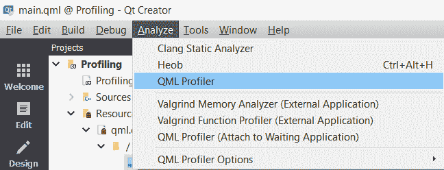

3.  你的 Qt Quick 项目将由 QML 评测器运行。“QML 探查器”窗口也将出现在代码编辑器下。程序通过测试点后，单击位于 QML 探查器窗口顶部栏的停止按钮，在本例中，成功创建了空窗口:

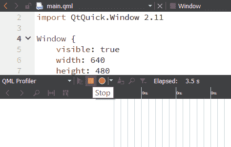

4.  停止探查器分析后，时间线将显示在“QML 探查器”窗口下的“时间线”选项卡上。您可以在三个选项卡之间切换，即时间线、火焰图和统计。您可以在 QML 探查器窗口底部的不同选项卡之间切换:

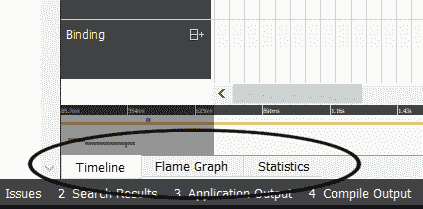

5.  让我们看看时间表选项卡。我们可以在时间轴显示下看到五个不同的类别:场景图、内存使用、编译、创建和绑定。这些类别为我们提供了程序执行过程中不同阶段和过程的概述。我们还可以看到时间线上正在显示一些彩色条。让我们单击“创建”类别下显示 QtQuick.Window/Window.的一个栏。单击后，我们将能够看到此操作的总持续时间以及矩形窗口上显示的代码位置，该窗口位于 QML 探查器窗口的顶部:

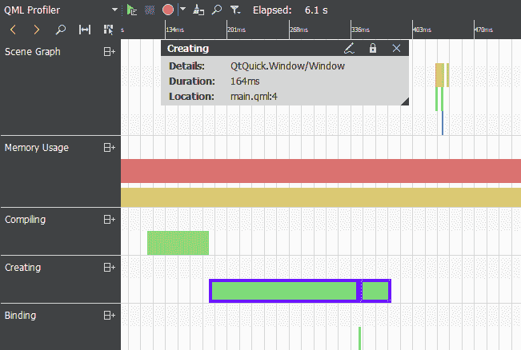

6.  完成后，让我们继续打开火焰图选项卡。在火焰图选项卡下，您将看到应用的总时间、内存和分配的可视化百分比。您可以通过单击位于 QML 探查器窗口右上角的选择框，在总时间、内存和分配之间切换:


7.  不仅如此，您还会看到 QML 代码编辑器上显示的百分比值:

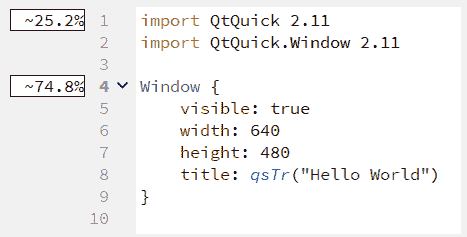

8.  打开“QML 探查器”窗口下的“统计”类别。该选项卡主要以表格形式向我们显示有关流程的信息:

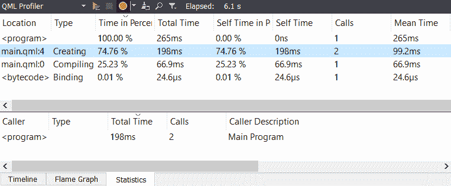

# 它是如何工作的...

这类似于我们在前面使用 C++ 和小部件的示例项目中所做的，除了这一次，它是由 Qt 5 提供的 QML Profiler 工具自动分析的。

QML 事件探查器不仅生成用于运行特定进程的总时间，还显示内存分配、应用的执行时间表以及其他信息，这些信息可以让您深入了解软件的性能。

通过查看 QML 分析器分析的数据，您将能够发现代码的哪一部分降低了程序的速度，从而使您能够快速修复任何问题。

在编写 QML 时，有一些规则需要注意，以避免性能瓶颈。例如，类型转换有时会很昂贵，尤其是在不紧密匹配的类型之间(例如，字符串到数字)。当你的项目随着时间的推移变得越来越大时，像这样的小问题很可能会变成瓶颈。

除此之外，尽量不要在经常运行的代码块中多次使用`id`进行项目查找，如下例所示:

```cpp
Item {
    width: 400
    height: 400
    Rectangle {
        id: rect
        anchors.fill: parent
        color: "green"
    }
    Component.onCompleted: {
        for (var i = 0; i < 1000; ++ i) {
            console.log("red", rect.color.r);
            console.log("green", rect.color.g);
            console.log("blue", rect.color.b);
            console.log("alpha", rect.color.a);
        }
}
```

相反，我们可以使用一个变量来缓存数据，并避免一次又一次地对同一项进行多次查找:

```cpp
Component.onCompleted: {
 var rectColor = rect.color;
    for (var i = 0; i < 1000; ++ i) {
        console.log("red", rectColor.r);
        console.log("green", rectColor.g);
        console.log("blue", rectColor.b);
        console.log("alpha", rectColor.a);
    }
}
```

此外，如果您更改绑定表达式的属性，尤其是在循环中，Qt 将被迫重复重新计算它。这将导致一些性能问题。用户应该遵循下一个代码片段，而不是这样做:

```cpp
Item {
    id: myItem
    width: 400
    height: 400
 property int myValue: 0 Text {anchors.fill: parent
 text: myItem.myValue.toString() }
    Component.onCompleted: {
        for (var i = 0; i < 1000; ++ i) {
 myValue += 1;
        }
    }
}
```

相反，我们可以使用一个临时变量来存储`myValue`的数据，然后在循环完成后将最终结果应用回`myValue`:

```cpp
Component.onCompleted: {
 var temp = myValue;
    for (var i = 0; i < 1000; ++ i) {
 temp += 1;
    }
 myValue = temp;
}
```

考虑使用锚点来定位用户界面项，而不是使用绑定。使用绑定进行项目定位非常缓慢且低效，尽管它允许最大的灵活性。

# 渲染和动画

对于渲染图形和动画的应用，良好的性能至关重要。当图形在屏幕上动画显示不流畅时，用户很容易注意到任何性能问题。在下面的例子中，我们将研究如何进一步优化图形密集型 Qt Quick 应用。

# 怎么做...

要了解如何在 QML 渲染动画，请遵循以下示例:

1.  创建一个 Qt 快速应用-空项目。然后，右键单击我们项目面板下的资源图标，并将`tux.png`添加到我们项目的资源中:

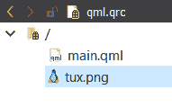

2.  打开`main.qml`，将窗口大小改为`650 x 650`。我们还将把`id`添加到`Window`项目中，并将其命名为`window`:

```cpp
Window {
    id: window
    visible: true
 width: 650
 height: 650
```

3.  在`Window`项内添加以下代码:

```cpp
property int frame: 0;
onAfterRendering: { frame++ ; }

Timer {
    id: timer
    interval: 1000
    running: true
    repeat: true
    onTriggered: { frame = 0; }
}
```

4.  紧接着，在下面加上`Repeater`和`Image`:

```cpp
Repeater {
        model: 10
        delegate:
            Image {
                id: tux
                source: "tux.png"
                sourceSize.width: 50
                sourceSize.height: 60
                width: 50
                height: 60
                smooth: false
                antialiasing: false
                asynchronous: true
```

5.  我们将继续并添加以下代码:

```cpp
property double startX: Math.random() * 600;
property double startY: Math.random() * 600;
property double endX: Math.random() * 600;
property double endY: Math.random() * 600;
property double speed: Math.random() * 3000 + 1000;

RotationAnimation on rotation{
    loops: Animation.Infinite
    from: 0
    to: 360
    duration: Math.random() * 3000 + 1000;
}
```

6.  完成后，在前面代码的底部添加以下代码:

```cpp
SequentialAnimation {
    running: true
    loops: Animation.Infinite
    ParallelAnimation {
        NumberAnimation {
            target: tux
            property: "x"
            from: startX
            to: endX
            duration: speed
            easing.type: Easing.InOutQuad
    }
```

7.  前面的代码激活了图像的`x`属性。我们需要另一个`NumberAnimation`属性来激活`y`属性:

```cpp
    NumberAnimation {
        target: tux
        property: "y"
        from: startY
        to: endY
        duration: speed
        easing.type: Easing.InOutQuad
    }
}
```

8.  之后，我们重复`ParallelAnimation`的整个代码，除了这次，我们交换`from`和`to`的值，像这样:

```cpp
ParallelAnimation {
    NumberAnimation {
        target: tux
        property: "x"
 from: endX
 to: startX
        duration: speed
        easing.type: Easing.InOutQuad
    }
```

9.  `y`属性的`NumberAnimation`也是如此:

```cpp
    NumberAnimation {
        target: tux
        property: "y"
 from: endY
 to: startY
        duration: speed
        easing.type: Easing.InOutQuad
    }
}
```

10.  然后，我们添加一个`Text`项来显示我们的应用的帧速率:

```cpp
Text {
    property int frame: 0
    color: "red"
    text: "FPS: 0 fps"
    x: 20
    y: 20
    font.pointSize: 20
```

11.  让我们在`Text`下增加`Timer`，每秒更新一次帧率显示:

```cpp
    Timer {
        id: fpsTimer
        repeat: true
        interval: 1000
        running: true
        onTriggered: {
            parent.text = "FPS: " + frame + " fps"
        }
    }
}
```

12.  如果我们现在构建并运行该程序，我们将能够看到几只企鹅以稳定的 60 fps 在屏幕上移动:


13.  让我们返回代码，将`Repeater`项的`model`属性更改为`10000` **。**再次构建并运行程序；您应该会看到，您的窗口中充满了移动的企鹅，并且帧速率显著下降到大约 29 fps，考虑到我们拥有的企鹅数量，这还不算太坏:

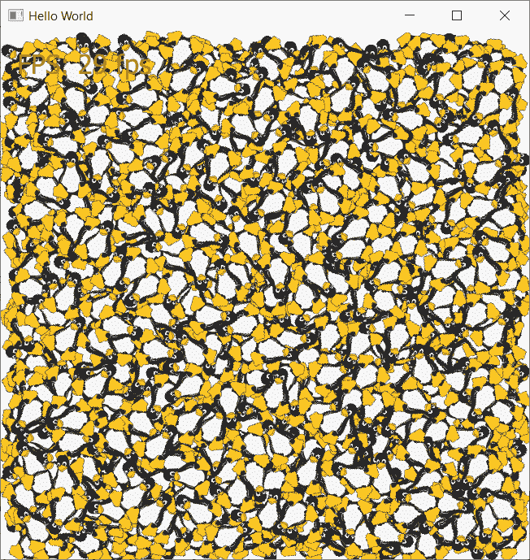

14.  然后，回到我们的源代码，注释掉两个`sourceSize`属性。我们还将`smooth`和`antialiasing`属性设置为`false`，同时将`asynchronous`属性设置为`false`:

```cpp
Image {
    id: tux
    source: "tux.png"
 //sourceSize.width: 50
 //sourceSize.height: 60
    width: 50
    height: 60
    smooth: true
 antialiasing: true
 asynchronous: false
```

15.  让我们再次构建并运行该程序。这一次，帧速率略微下降到 22 fps，但企鹅看起来更平滑，质量更好，即使在移动时也是如此:

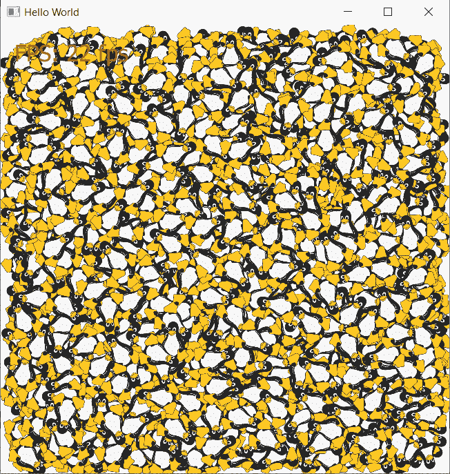

# 它是如何工作的...

当在屏幕上渲染动画图形时，为 Qt Quick 应用提供动力的 QML 引擎是非常优化和强大的。然而，我们仍然可以遵循一些技巧来加快速度。

尽量利用 Qt 5 提供的内置功能，而不是自己实现，比如`Repeater`、`NumberAnimation`、`SequentialAnimation`。这是因为 Qt 5 开发人员在优化这些特性方面付出了巨大的努力，所以您不必这样做。

`sourceSize`属性告诉 Qt 在将图像加载到内存之前调整图像的大小，这样大图像就不会占用过多的内存。

当`smooth`属性被启用时，它告诉 Qt 过滤图像，使其在缩放或从自然大小转换时看起来更平滑。如果图像以与其`sourceSize`相同的速度渲染，不会有任何区别。此属性将影响您的应用在一些旧硬件上的性能。

`antialiasing`属性告诉 Qt 去除图像边缘周围的混叠伪影，使其看起来更平滑。该属性还会影响程序的性能。

`asynchronous`属性告诉 Qt 在低优先级线程下加载图像，这意味着你的程序在加载一个巨大的图像文件时不会停滞。

我们使用帧速率来表示程序的性能。因为`onAfterRendering`总是在每一帧被调用，所以我们可以在每一个渲染中积累`frame`变量。然后，我们使用`Timer`每秒重置`frame`值。最后，我们使用`Text`项目在屏幕上显示该值。